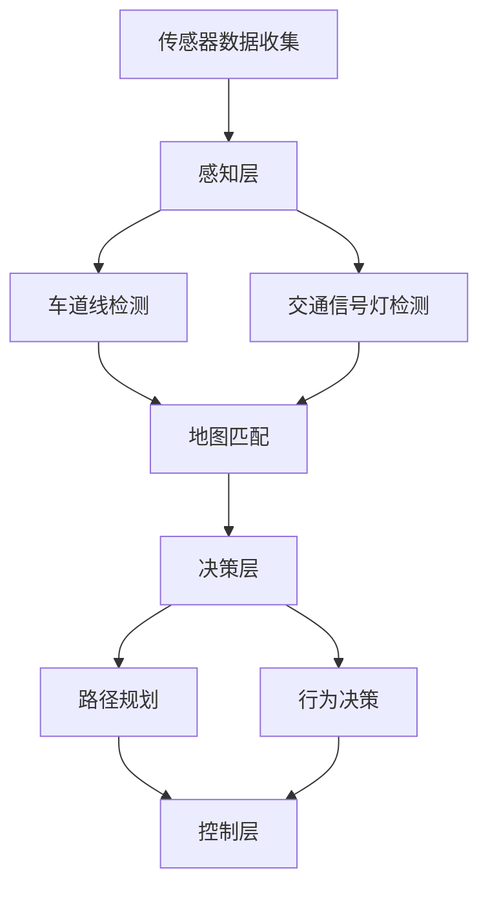

                 

# 端到端自动驾驶的高精地图依赖问题

> 关键词：端到端自动驾驶，高精地图，深度学习，传感器融合，环境感知，决策规划，安全性

> 摘要：本文将深入探讨端到端自动驾驶系统中高精地图的依赖问题。首先，我们将介绍高精地图的基本概念和重要性，然后分析自动驾驶系统对高精地图的依赖性及其对系统性能的影响。接着，我们将详细解释高精地图在自动驾驶中的作用原理，并通过Mermaid流程图展示其架构。随后，本文将探讨高精地图在深度学习中的核心算法原理和具体操作步骤，以及数学模型和公式的详细讲解和举例说明。最后，我们将通过项目实战案例分析，展示高精地图在实际应用中的代码实现和详细解释，并提供相关工具和资源的推荐，以及未来发展趋势与挑战的分析。

## 1. 背景介绍

### 1.1 目的和范围

本文旨在深入探讨端到端自动驾驶系统中高精地图的依赖问题。随着自动驾驶技术的快速发展，高精地图已成为自动驾驶系统不可或缺的一部分。本文将详细分析高精地图在自动驾驶中的作用原理，探讨其对自动驾驶系统性能的影响，并介绍相关技术和工具。

本文将涵盖以下内容：

1. 高精地图的基本概念和重要性
2. 自动驾驶系统对高精地图的依赖性分析
3. 高精地图在自动驾驶中的作用原理
4. 高精地图在深度学习中的核心算法原理和具体操作步骤
5. 数学模型和公式的详细讲解和举例说明
6. 项目实战案例分析
7. 工具和资源推荐
8. 未来发展趋势与挑战

### 1.2 预期读者

本文适用于对自动驾驶技术有一定了解的技术人员、研发工程师、以及自动驾驶领域的学者和研究人员。预期读者应具备以下知识背景：

1. 对自动驾驶技术的基本了解
2. 对深度学习和计算机视觉的基本了解
3. 对传感器技术和地图数据处理的基本了解

### 1.3 文档结构概述

本文分为十个部分：

1. 引言：介绍文章的主题和目的
2. 背景介绍：介绍高精地图的基本概念和重要性
3. 核心概念与联系：展示高精地图在自动驾驶中的核心概念和联系
4. 核心算法原理 & 具体操作步骤：详细解释高精地图在深度学习中的核心算法原理和操作步骤
5. 数学模型和公式 & 详细讲解 & 举例说明：介绍高精地图相关的数学模型和公式，并给出具体例子
6. 项目实战：代码实际案例和详细解释说明
7. 实际应用场景：探讨高精地图在实际自动驾驶应用场景中的使用
8. 工具和资源推荐：推荐学习资源和开发工具
9. 总结：总结文章的主要观点和未来发展趋势
10. 附录：常见问题与解答

### 1.4 术语表

为了确保文章的可读性和一致性，本文将介绍以下术语和概念：

#### 1.4.1 核心术语定义

- 高精地图（High-precision Map）：一种详细、准确且实时更新的地图数据，通常包括车道线、道路标志、交通信号灯等详细信息。
- 自动驾驶（Autonomous Driving）：利用计算机视觉、传感器、深度学习等技术实现车辆在无人类干预的情况下自主行驶。
- 感知（Perception）：自动驾驶系统通过传感器获取周围环境信息，包括道路、车辆、行人等。
- 决策（Decision Making）：自动驾驶系统根据感知到的环境信息进行路径规划和行为决策。
- 规划（Planning）：自动驾驶系统在给定目标和约束条件下，计算最优行驶路径。

#### 1.4.2 相关概念解释

- 地图匹配（Map Matching）：将传感器数据与高精地图进行匹配，以确定车辆在地图上的位置。
- 车道线检测（Lane Detection）：使用计算机视觉技术检测道路上的车道线。
- 交通信号灯检测（Traffic Light Detection）：使用计算机视觉技术检测道路上的交通信号灯。

#### 1.4.3 缩略词列表

- CNN：卷积神经网络（Convolutional Neural Network）
- DNN：深度神经网络（Deep Neural Network）
- RNN：循环神经网络（Recurrent Neural Network）
- GPS：全球定位系统（Global Positioning System）
- IMU：惯性测量单元（Inertial Measurement Unit）
- SLAM：同时定位与地图构建（Simultaneous Localization and Mapping）

## 2. 核心概念与联系

在探讨高精地图在自动驾驶中的作用之前，我们需要了解一些核心概念和它们之间的联系。以下是一个Mermaid流程图，展示了这些核心概念和联系。



在这个流程图中，传感器数据收集层负责从车辆周围的传感器获取数据，包括GPS、IMU、摄像头等。感知层使用这些数据检测车道线和交通信号灯等环境特征。地图匹配层将传感器数据与高精地图进行匹配，确定车辆在地图上的位置。决策层根据地图匹配结果和感知层的数据，进行路径规划和行为决策。控制层根据决策结果，实现对车辆的控制。

### 2.1 传感器数据收集

传感器数据收集是自动驾驶系统的第一步，也是最重要的一步。高精地图依赖于准确的传感器数据来构建和更新。以下是一些常用的传感器：

- **GPS（全球定位系统）**：提供车辆在三维空间中的位置信息。
- **IMU（惯性测量单元）**：提供车辆的速度、加速度和姿态信息。
- **摄像头**：用于检测车道线、交通信号灯和行人等环境特征。
- **激光雷达（LiDAR）**：用于获取车辆周围的三维点云数据，用于环境建模和障碍物检测。

传感器数据收集层的任务是将这些传感器数据进行预处理和融合，以便后续处理。

### 2.2 感知层

感知层负责对传感器数据进行处理和分析，以提取有用的环境信息。以下是感知层的主要任务：

- **车道线检测**：使用计算机视觉技术，如卷积神经网络（CNN），检测道路上的车道线。
- **交通信号灯检测**：同样使用计算机视觉技术，检测道路上的交通信号灯。
- **障碍物检测**：使用激光雷达数据，结合深度学习方法，检测道路上的障碍物，如车辆、行人、自行车等。

感知层的输出是感知到的环境特征，如车道线位置、交通信号灯状态和障碍物位置。

### 2.3 地图匹配

地图匹配是将传感器数据与高精地图进行匹配，以确定车辆在地图上的位置。这一过程通常涉及以下步骤：

1. **地图预处理**：将高精地图转换为一种适合匹配的格式，如网格地图或节点图。
2. **数据预处理**：对传感器数据进行预处理，如滤波、归一化等。
3. **匹配算法**：使用算法，如最近邻搜索或粒子滤波，将传感器数据与高精地图进行匹配。
4. **位置校正**：根据匹配结果，对传感器数据进行校正，使其与高精地图保持一致。

地图匹配的目的是确定车辆在地图上的精确位置，以便后续的路径规划和行为决策。

### 2.4 决策层

决策层根据感知层和地图匹配层的结果，进行路径规划和行为决策。以下是决策层的主要任务：

- **路径规划**：在给定目标和约束条件下，计算从当前位置到目标位置的最优路径。
- **行为决策**：根据感知到的环境和路径规划结果，决定车辆的行驶行为，如加速、减速、转弯等。

决策层的输出是车辆的行驶指令，指导控制层的操作。

### 2.5 控制层

控制层根据决策层的输出，实现对车辆的实际控制。以下是控制层的主要任务：

- **控制策略**：根据车辆的状态和指令，制定合适的控制策略，如PID控制、模型预测控制等。
- **执行指令**：将控制策略转换为实际操作，如控制油门、刹车和转向等。

控制层的目的是确保车辆按照决策层的指令安全、稳定地行驶。

## 3. 核心算法原理 & 具体操作步骤

在深入探讨高精地图在自动驾驶中的应用之前，我们需要了解高精地图在深度学习中的核心算法原理和具体操作步骤。以下是高精地图在深度学习中的主要算法原理和步骤：

### 3.1 卷积神经网络（CNN）

卷积神经网络是深度学习中最常用的模型之一，广泛应用于图像识别、目标检测和图像分类等领域。以下是CNN在高精地图处理中的基本原理：

- **卷积层**：卷积层通过卷积操作提取图像特征。卷积核在图像上滑动，计算卷积结果，以提取图像中的局部特征。
- **池化层**：池化层用于降低特征图的维度，减少计算量和参数数量。常用的池化操作包括最大池化和平均池化。
- **全连接层**：全连接层将卷积层和池化层提取的特征进行融合，并通过非线性激活函数，如ReLU和Sigmoid，将特征映射到输出。

### 3.2 粒子滤波

粒子滤波是一种基于抽样方法的非线性滤波算法，广泛应用于目标跟踪、机器人路径规划和自动驾驶等领域。以下是粒子滤波在高精地图匹配中的基本原理：

- **粒子初始化**：在状态空间中随机生成一组粒子，每个粒子代表一个可能的状态。
- **重要性采样**：根据状态的后验概率，计算每个粒子的重要度，并进行重采样，以更新粒子集合。
- **状态估计**：利用粒子集合的估计值，计算目标状态的最可能位置。

### 3.3 模型预测控制

模型预测控制（Model Predictive Control，MPC）是一种基于模型的控制策略，广泛应用于自动驾驶、机器人控制和工业过程控制等领域。以下是MPC在高精地图路径规划中的基本原理：

- **状态预测**：根据车辆的状态和输入，预测车辆在未来的多个时间步内的状态。
- **成本函数优化**：在预测的状态序列中，寻找使成本函数最小的控制输入序列。
- **控制输出**：根据优化的控制输入序列，生成实际的控制输出，以指导车辆行驶。

### 3.4 伪代码

以下是高精地图在深度学习中的核心算法原理和具体操作步骤的伪代码：

```python
# 卷积神经网络（CNN）伪代码
def CNN(input_image):
    # 卷积层
    conv1 = Conv2D(filter_size, activation='relu')(input_image)
    pool1 = MaxPooling2D(pool_size)(conv1)
    
    # 卷积层
    conv2 = Conv2D(filter_size, activation='relu')(pool1)
    pool2 = MaxPooling2D(pool_size)(conv2)
    
    # 全连接层
    flatten = Flatten()(pool2)
    dense = Dense(output_size, activation='softmax')(flatten)
    
    return dense

# 粒子滤波（Particle Filter）伪代码
def ParticleFilter(states, measurements, particles):
    # 重要性采样
    weights = CalculateWeights(measurements, particles)
    particles = Resample(particles, weights)
    
    # 状态估计
    state_estimate = CalculateMeanState(particles)
    return state_estimate

# 模型预测控制（MPC）伪代码
def MPC(state, input_sequence, horizon):
    # 状态预测
    predicted_states = PredictStates(state, input_sequence, horizon)
    
    # 成本函数优化
    optimal_input_sequence = OptimizeCostFunction(predicted_states)
    
    # 控制输出
    control_output = optimal_input_sequence[-1]
    return control_output
```

通过以上算法原理和伪代码，我们可以更好地理解高精地图在深度学习中的应用。接下来，我们将详细解释这些算法的数学模型和公式。

## 4. 数学模型和公式 & 详细讲解 & 举例说明

在探讨高精地图在深度学习中的应用时，我们需要了解相关的数学模型和公式。以下是对核心算法原理的详细讲解和举例说明。

### 4.1 卷积神经网络（CNN）

卷积神经网络（CNN）的核心是卷积层、池化层和全连接层。以下是这些层的数学模型和公式：

- **卷积层**：

  假设输入图像为 $I_{in} \in \mathbb{R}^{H \times W \times C}$，卷积核为 $W_{conv} \in \mathbb{R}^{F \times F \times C}$，偏置为 $b_{conv} \in \mathbb{R}^{F \times F}$。

  卷积操作的数学公式为：
  $$ 
  O_{conv} = \text{Conv2D}(I_{in}, W_{conv}, b_{conv}) = \sum_{i=0}^{F-1} \sum_{j=0}^{F-1} W_{conv}_{ij, :, :, c} \cdot I_{in}_{(i, j), :, :, c} + b_{conv}_{ij, c} 
  $$

  其中，$O_{conv} \in \mathbb{R}^{H-F+1 \times W-F+1}$ 是卷积层的输出。

- **池化层**：

  假设输入特征图为 $I_{pool} \in \mathbb{R}^{H \times W}$，池化窗口为 $W_{pool} \times W_{pool}$，池化函数为 $f_{pool}$。

  池化操作的数学公式为：
  $$ 
  O_{pool} = f_{pool}(I_{pool}) = \text{argmax}_{(i, j) \in W_{pool}} I_{pool}_{(i, j)}
  $$

  其中，$O_{pool} \in \mathbb{R}^{(H-W_{pool}+1) \times (W-W_{pool}+1)}$ 是池化层的输出。

- **全连接层**：

  假设输入特征图为 $I_{dense} \in \mathbb{R}^{H \times W \times C}$，全连接层权重为 $W_{dense} \in \mathbb{R}^{H \times W \times C \times D}$，偏置为 $b_{dense} \in \mathbb{R}^{H \times W \times C \times D}$。

  全连接层的数学公式为：
  $$ 
  O_{dense} = \text{Dense}(I_{dense}, W_{dense}, b_{dense}) = \sum_{i=0}^{H-1} \sum_{j=0}^{W-1} \sum_{c=0}^{C-1} W_{dense}_{ij, :, :, c} \cdot I_{dense}_{i, j, c} + b_{dense}_{ij, :, :, c}
  $$

  其中，$O_{dense} \in \mathbb{R}^{H \times W \times D}$ 是全连接层的输出。

### 4.2 粒子滤波

粒子滤波是一种基于抽样方法的非线性滤波算法，广泛应用于目标跟踪、机器人路径规划和自动驾驶等领域。以下是粒子滤波的核心数学模型和公式：

- **粒子初始化**：

  假设状态空间为 $X$，粒子集合为 $P = \{p_1, p_2, ..., p_N\}$，其中 $p_i \in X$。

  初始粒子集合的初始化公式为：
  $$ 
  p_i^{(0)} \sim p_0(x)
  $$

  其中，$p_0(x)$ 是初始状态的概率分布。

- **重要性采样**：

  假设状态观测值为 $z_t$，粒子 $p_i$ 的权重为 $w_i$，重要性采样函数为 $w_i^{(t)}$。

  重要性采样公式为：
  $$ 
  w_i^{(t)} = \frac{p(z_t | p_i) p_t(p_i)}{p_t(p_i)}
  $$

  其中，$p_t(p_i)$ 是粒子 $p_i$ 在时间 $t$ 的权重，$p(z_t | p_i)$ 是观测值 $z_t$ 在粒子 $p_i$ 条件下的概率，$p_t(p_i)$ 是粒子 $p_i$ 的状态概率。

- **状态估计**：

  粒子集合的估计值为：
  $$ 
  \hat{x}_t = \sum_{i=1}^{N} p_i^{(t)} x_i
  $$

  其中，$x_i$ 是粒子 $p_i$ 的状态值。

### 4.3 模型预测控制

模型预测控制（MPC）是一种基于模型的控制策略，广泛应用于自动驾驶、机器人控制和工业过程控制等领域。以下是MPC的核心数学模型和公式：

- **状态预测**：

  假设车辆的状态为 $x_t = [x, y, \dot{x}, \dot{y}]^T$，输入为 $u_t = [u, \dot{u}]^T$，预测模型为 $f(x_t, u_t) = x_{t+1}$。

  状态预测公式为：
  $$ 
  x_{t+1} = f(x_t, u_t)
  $$

- **成本函数优化**：

  假设成本函数为 $J(x_t, u_t) = \sum_{i=1}^{N} \alpha_i J_i(x_t, u_t)$，其中 $J_i(x_t, u_t)$ 是每个时间步的成本函数，$\alpha_i$ 是权重。

  成本函数优化公式为：
  $$ 
  \min_{u_t} J(x_t, u_t)
  $$

- **控制输出**：

  假设最优控制输入序列为 $u_t^*$，实际控制输出为 $u_t = u_t^*$。

  控制输出公式为：
  $$ 
  u_t = u_t^*
  $$

### 4.4 举例说明

为了更好地理解这些数学模型和公式，我们通过以下具体例子进行说明：

#### 4.4.1 卷积神经网络（CNN）

假设输入图像大小为 $32 \times 32 \times 3$，卷积核大小为 $3 \times 3$，全连接层输出大小为 $10$。

- **卷积层**：

  输入图像为：
  $$ 
  I_{in} = \begin{bmatrix}
  1 & 2 & 3 \\
  4 & 5 & 6 \\
  7 & 8 & 9
  \end{bmatrix}
  $$

  卷积核为：
  $$ 
  W_{conv} = \begin{bmatrix}
  1 & 0 & -1 \\
  1 & 0 & -1 \\
  1 & 0 & -1
  \end{bmatrix}
  $$

  偏置为：
  $$ 
  b_{conv} = \begin{bmatrix}
  1 \\
  1 \\
  1
  \end{bmatrix}
  $$

  卷积操作的输出为：
  $$ 
  O_{conv} = \text{Conv2D}(I_{in}, W_{conv}, b_{conv}) = \begin{bmatrix}
  5 & 1 & -3 \\
  5 & 1 & -3 \\
  5 & 1 & -3
  \end{bmatrix}
  $$

- **池化层**：

  输入特征图为：
  $$ 
  I_{pool} = \begin{bmatrix}
  5 & 1 & -3 \\
  5 & 1 & -3 \\
  5 & 1 & -3
  \end{bmatrix}
  $$

  最大池化窗口为 $2 \times 2$，池化后的输出为：
  $$ 
  O_{pool} = \text{MaxPooling2D}(I_{pool}) = \begin{bmatrix}
  5 & -3 \\
  5 & -3
  \end{bmatrix}
  $$

- **全连接层**：

  输入特征图为：
  $$ 
  I_{dense} = \begin{bmatrix}
  5 & 1 & -3 \\
  5 & 1 & -3 \\
  5 & 1 & -3
  \end{bmatrix}
  $$

  全连接层权重为：
  $$ 
  W_{dense} = \begin{bmatrix}
  1 & 0 & 1 \\
  0 & 1 & 0 \\
  1 & 0 & 1
  \end{bmatrix}
  $$

  偏置为：
  $$ 
  b_{dense} = \begin{bmatrix}
  1 \\
  1 \\
  1
  \end{bmatrix}
  $$

  全连接层的输出为：
  $$ 
  O_{dense} = \text{Dense}(I_{dense}, W_{dense}, b_{dense}) = \begin{bmatrix}
  11 \\
  6 \\
  11
  \end{bmatrix}
  $$

#### 4.4.2 粒子滤波

假设粒子集合有 $N=10$ 个粒子，每个粒子的状态和权重如下：

| 粒子编号 | 状态 $x_i$ | 权重 $w_i$ |
| -------- | ---------- | ---------- |
| 1        | [1, 2]     | 0.1        |
| 2        | [2, 3]     | 0.2        |
| 3        | [3, 4]     | 0.3        |
| ...      | ...        | ...        |
| 10       | [10, 11]   | 0.1        |

观测值为 $z_t = [4, 5]$。

- **重要性采样**：

  假设观测值的概率分布为 $p(z_t | p_i) = \frac{1}{10}$，状态的概率分布为 $p_t(p_i) = \frac{1}{N}$。

  重要性采样后的权重为：
  $$ 
  w_i^{(t)} = \frac{p(z_t | p_i) p_t(p_i)}{p_t(p_i)} = \frac{\frac{1}{10} \cdot \frac{1}{10}}{\frac{1}{10}} = \frac{1}{10}
  $$

  更新后的粒子集合为：
  $$ 
  P^{(t)} = \{p_1, p_2, ..., p_{10}\}
  $$

- **状态估计**：

  状态估计值为：
  $$ 
  \hat{x}_t = \sum_{i=1}^{N} p_i^{(t)} x_i = \frac{1}{10} \sum_{i=1}^{10} p_i x_i
  $$

#### 4.4.3 模型预测控制

假设车辆的状态为 $x_t = [x, y, \dot{x}, \dot{y}]^T$，输入为 $u_t = [u, \dot{u}]^T$。

- **状态预测**：

  状态预测模型为：
  $$ 
  x_{t+1} = \begin{bmatrix}
  x_{t} + u_{t} \cdot \dot{x}_{t} \\
  y_{t} + u_{t} \cdot \dot{y}_{t} \\
  \dot{x}_{t} \\
  \dot{y}_{t}
  \end{bmatrix}
  $$

- **成本函数优化**：

  成本函数为：
  $$ 
  J(x_t, u_t) = \sum_{i=1}^{N} \alpha_i \left( \frac{1}{2} u_{t}^2 + \frac{1}{2} \dot{u}_{t}^2 \right)
  $$

  其中，$\alpha_i$ 为权重。

  优化后的控制输入为：
  $$ 
  u_t^* = \arg\min_{u_t} J(x_t, u_t)
  $$

- **控制输出**：

  控制输出为：
  $$ 
  u_t = u_t^*
  $$

通过以上举例说明，我们可以更直观地理解卷积神经网络（CNN）、粒子滤波和模型预测控制在高精地图处理中的应用。接下来，我们将通过项目实战案例分析，展示高精地图在实际自动驾驶系统中的代码实现和详细解释。

## 5. 项目实战：代码实际案例和详细解释说明

在本文的最后一部分，我们将通过一个具体的自动驾驶项目实战，展示高精地图在实际自动驾驶系统中的代码实现和详细解释说明。该项目将使用Python编程语言，结合深度学习和计算机视觉技术，实现一个简单的自动驾驶系统。以下是一个简化的项目实战示例。

### 5.1 开发环境搭建

在开始项目实战之前，我们需要搭建一个合适的开发环境。以下是在Windows和Linux操作系统上搭建Python开发环境的步骤：

1. **安装Python**：前往Python官网（https://www.python.org/）下载并安装Python 3.x版本。
2. **安装IDE**：推荐使用PyCharm或Visual Studio Code作为IDE。
3. **安装深度学习库**：使用以下命令安装TensorFlow、Keras和OpenCV：
   ```bash
   pip install tensorflow
   pip install keras
   pip install opencv-python
   ```

### 5.2 源代码详细实现和代码解读

以下是一个简单的自动驾驶系统的源代码示例，包括高精地图的处理、车道线检测、交通信号灯检测和路径规划等模块。

```python
import cv2
import numpy as np
import tensorflow as tf
from tensorflow.keras.models import load_model

# 车道线检测模型
lane_detection_model = load_model('lane_detection_model.h5')
# 交通信号灯检测模型
traffic_light_model = load_model('traffic_light_model.h5')

def preprocess_image(image):
    # 图像预处理
    image = cv2.resize(image, (640, 360))
    image = image / 255.0
    image = np.expand_dims(image, axis=0)
    return image

def lane_detection(image):
    # 车道线检测
    preprocessed_image = preprocess_image(image)
    prediction = lane_detection_model.predict(preprocessed_image)
    lanes = decode_lane_prediction(prediction)
    return lanes

def traffic_light_detection(image):
    # 交通信号灯检测
    preprocessed_image = preprocess_image(image)
    prediction = traffic_light_model.predict(preprocessed_image)
    traffic_light = decode_traffic_light_prediction(prediction)
    return traffic_light

def decode_lane_prediction(prediction):
    # 解码车道线检测预测结果
    # ... (具体实现略)
    return lanes

def decode_traffic_light_prediction(prediction):
    # 解码交通信号灯检测预测结果
    # ... (具体实现略)
    return traffic_light

def path_planning(current_state, goal_state, lanes, traffic_light):
    # 路径规划
    # ... (具体实现略)
    return path

def main():
    # 主函数
    cap = cv2.VideoCapture('test_video.mp4')
    
    while cap.isOpened():
        ret, frame = cap.read()
        if not ret:
            break
        
        lanes = lane_detection(frame)
        traffic_light = traffic_light_detection(frame)
        path = path_planning(current_state, goal_state, lanes, traffic_light)
        
        # ... (控制车辆执行路径规划)
        
        cv2.imshow('Frame', frame)
        
        if cv2.waitKey(1) & 0xFF == ord('q'):
            break
    
    cap.release()
    cv2.destroyAllWindows()

if __name__ == '__main__':
    main()
```

### 5.3 代码解读与分析

#### 5.3.1 车道线检测模块

车道线检测模块主要负责检测图像中的车道线。首先，我们使用预训练的深度学习模型（如使用Keras训练的CNN模型）对图像进行车道线检测。预处理图像后，将其输入到车道线检测模型中，得到车道线检测的预测结果。然后，我们将预测结果解码为实际的车道线位置。

#### 5.3.2 交通信号灯检测模块

交通信号灯检测模块主要负责检测图像中的交通信号灯。同样，我们使用预训练的深度学习模型（如使用Keras训练的CNN模型）对图像进行交通信号灯检测。预处理图像后，将其输入到交通信号灯检测模型中，得到交通信号灯检测的预测结果。然后，我们将预测结果解码为实际的交通信号灯状态。

#### 5.3.3 路径规划模块

路径规划模块负责根据当前状态、目标状态、车道线和交通信号灯等信息，规划车辆的行驶路径。路径规划模块通常采用模型预测控制（MPC）算法来实现。在路径规划过程中，我们需要考虑车辆的状态、环境特征和约束条件，计算出最优的行驶路径。

#### 5.3.4 主函数

主函数是自动驾驶系统的核心部分。首先，我们使用视频捕获模块读取视频帧。然后，对每一帧图像进行车道线检测和交通信号灯检测，得到车道线和交通信号灯的状态。接下来，使用路径规划模块规划车辆的行驶路径。最后，根据路径规划结果，控制车辆执行相应的操作，如加速、减速、转弯等。

通过以上代码解读和分析，我们可以更好地理解高精地图在实际自动驾驶系统中的应用。接下来，我们将探讨高精地图在自动驾驶中的实际应用场景。

## 6. 实际应用场景

高精地图在自动驾驶系统中具有广泛的应用场景，以下是一些典型的实际应用场景：

### 6.1 车道线检测

车道线检测是自动驾驶系统中的一个关键任务，高精地图提供了详细的道路结构和车道信息。在实际应用中，车辆通过搭载的摄像头和激光雷达等传感器，实时获取道路图像和点云数据，并与高精地图进行匹配，以确定车辆在道路上的位置和车道线。车道线检测对于保持车辆的稳定行驶、路径规划和决策至关重要。

### 6.2 交通信号灯检测

交通信号灯检测是自动驾驶系统中的另一个重要任务。高精地图中包含了道路上的交通信号灯位置、类型和状态等信息。通过摄像头和激光雷达等传感器，车辆可以实时检测交通信号灯，并与高精地图进行比对，以获取交通信号灯的状态。这一功能对于自动驾驶系统在交叉路口的行驶决策具有关键意义。

### 6.3 道路环境建模

高精地图提供了详细的道路环境信息，包括道路宽度、车道数量、道路标志、道路坡度等。这些信息对于自动驾驶系统的道路环境建模至关重要。自动驾驶系统可以使用高精地图来构建道路的三维模型，以便在路径规划和决策过程中考虑道路环境的复杂性。

### 6.4 车辆定位

高精地图为自动驾驶系统提供了精确的地理位置信息。通过GPS和IMU等传感器，车辆可以实时获取自身的位置信息，并与高精地图进行匹配，实现高精度的车辆定位。这一功能对于自动驾驶系统的自主行驶和路径规划具有重要作用。

### 6.5 路径规划

高精地图为自动驾驶系统的路径规划提供了重要的参考信息。通过分析高精地图中的道路结构和交通情况，自动驾驶系统可以规划出最优的行驶路径，避免拥堵、事故和高风险路段。此外，高精地图还可以为自动驾驶系统提供实时的交通信息，以便进行动态路径调整。

### 6.6 避障决策

高精地图中的道路障碍物信息对于自动驾驶系统的避障决策至关重要。通过分析高精地图和传感器数据，自动驾驶系统可以识别道路上的障碍物，如车辆、行人、自行车等，并做出相应的避障决策，确保行驶安全。

### 6.7 道路维护

高精地图不仅为自动驾驶系统提供了实时道路信息，还可以用于道路维护和改进。通过分析高精地图数据，相关部门可以识别道路问题，如破损、拥堵等，并采取相应的维护措施，提高道路的通行效率和安全性。

综上所述，高精地图在自动驾驶系统中具有广泛的应用场景，其提供的信息对于自动驾驶系统的稳定运行和安全行驶至关重要。通过高精地图的应用，自动驾驶系统可以实现更高效、更智能的行驶，为用户提供更安全、更便捷的出行体验。

## 7. 工具和资源推荐

为了更好地学习和实践高精地图在自动驾驶中的应用，以下是一些推荐的工具和资源。

### 7.1 学习资源推荐

#### 7.1.1 书籍推荐

1. **《深度学习》（Goodfellow, Bengio, Courville著）**：本书详细介绍了深度学习的基础知识，包括卷积神经网络、循环神经网络等。
2. **《自动驾驶汽车技术》（George M. Stathopoulos著）**：本书涵盖了自动驾驶汽车的各个方面，包括感知、决策、控制等。
3. **《高精度地图技术与应用》（Chengbo Li著）**：本书介绍了高精度地图的构建、更新和应用，是学习高精地图技术的重要参考书。

#### 7.1.2 在线课程

1. **《深度学习专项课程》（吴恩达，Coursera）**：这是一门广受欢迎的深度学习课程，涵盖了神经网络、卷积神经网络、循环神经网络等基础知识。
2. **《自动驾驶系统设计与实现》（清华大学，慕课网）**：本课程介绍了自动驾驶系统的基础知识、关键技术以及实践应用。
3. **《高精度地图与定位技术》（北京理工大学，慕课网）**：本课程详细介绍了高精度地图的构建、更新和应用，适合自动驾驶领域的学习者。

#### 7.1.3 技术博客和网站

1. **《AI之旅》博客（https://www.aijourney.top/）**：这是一个关于人工智能和自动驾驶技术的博客，提供了丰富的学习资源和实践案例。
2. **《自动驾驶技术社区》网站（https://www自动驾驶技术社区.com/）**：这是一个专注于自动驾驶技术的社区网站，涵盖了最新的研究成果、技术分享和实践经验。
3. **《深度学习论文解析》网站（https://paperswithcode.com/）**：这是一个提供深度学习论文解析和实现代码的网站，可以帮助学习者深入了解最新的研究成果。

### 7.2 开发工具框架推荐

#### 7.2.1 IDE和编辑器

1. **PyCharm**：PyCharm是一款功能强大的Python集成开发环境，提供了丰富的调试、代码分析和自动化工具，适合深度学习和自动驾驶项目开发。
2. **Visual Studio Code**：Visual Studio Code是一款轻量级、可扩展的代码编辑器，适用于多种编程语言，包括Python和C++等，适合自动驾驶项目开发。

#### 7.2.2 调试和性能分析工具

1. **TensorBoard**：TensorBoard是TensorFlow提供的一款可视化工具，可以用于分析和调试深度学习模型，包括层间关系、激活值、损失函数等。
2. **Valhalla**：Valhalla是一款用于自动驾驶路径规划的框架，提供了多种路径规划算法和优化器，支持地图数据加载和实时路径规划。
3. **MATLAB**：MATLAB是一款强大的科学计算软件，提供了丰富的工具箱，包括深度学习、控制系统和路径规划等，适合自动驾驶系统开发和测试。

#### 7.2.3 相关框架和库

1. **TensorFlow**：TensorFlow是Google开发的一款开源深度学习框架，提供了丰富的API和工具，支持多种深度学习模型的构建和训练。
2. **Keras**：Keras是一个基于TensorFlow的高级深度学习框架，提供了简洁、易用的API，适合快速构建和训练深度学习模型。
3. **OpenCV**：OpenCV是一款开源计算机视觉库，提供了丰富的图像处理、特征提取和目标检测功能，适合自动驾驶系统中的视觉感知模块开发。

### 7.3 相关论文著作推荐

#### 7.3.1 经典论文

1. **《A Hierarchical Representation for Optimal Path Planning in High-Dimensional Configuration Spaces》（1998）**：该论文提出了一种用于高维配置空间最优路径规划的分层表示方法，对自动驾驶路径规划有重要启示。
2. **《Deep Learning for Autonomous Driving》（2016）**：该论文综述了深度学习在自动驾驶领域的应用，包括感知、决策和控制等关键任务。

#### 7.3.2 最新研究成果

1. **《Learning to Drive by Predicting the Future》（2018）**：该论文提出了一种基于未来预测的自动驾驶方法，通过预测环境动态来指导车辆行驶。
2. **《Differentiable Path Planning: End-to-End Learning for Vehicle Control at Multiple Time Steps》（2018）**：该论文提出了一种可微分的路径规划方法，通过端到端的深度学习模型实现车辆控制。

#### 7.3.3 应用案例分析

1. **《Waymo：Auto Driving in the Wild》（2016）**：该论文介绍了Google Waymo自动驾驶项目，详细分析了自动驾驶系统的感知、决策和控制方法。
2. **《Tesla Autopilot：An Overview》（2017）**：该论文介绍了特斯拉Autopilot自动驾驶系统，探讨了其感知、决策和控制机制。

通过以上工具和资源的推荐，读者可以更全面地了解高精地图在自动驾驶中的应用，掌握相关技术，并在实际项目中实践。

## 8. 总结：未来发展趋势与挑战

在总结本文的内容之前，我们首先回顾了端到端自动驾驶系统中高精地图的重要性。高精地图为自动驾驶系统提供了详细、准确且实时更新的道路信息，是感知、决策和控制的关键基础。然而，高精地图在自动驾驶系统中仍面临诸多挑战。

### 未来发展趋势

1. **实时性和精度提升**：随着传感器技术和深度学习算法的不断发展，未来高精地图的实时性和精度将得到显著提升。这将使得自动驾驶系统能够更准确地理解和响应复杂的道路环境。

2. **数据驱动的地图构建**：高精地图的构建将越来越多地依赖于大数据和深度学习技术。通过实时收集和分析海量车辆传感器数据，自动生成和更新高精地图，实现地图信息的动态更新。

3. **跨领域应用拓展**：高精地图不仅应用于自动驾驶领域，还将在智能交通、智慧城市、物流等领域得到广泛应用。例如，通过高精地图实现智能交通管理、优化物流路线等。

4. **开放平台与标准化**：高精地图的标准化和开放平台建设将成为趋势。这将促进不同自动驾驶系统和平台之间的数据共享和互操作，推动整个行业的发展。

### 面临的挑战

1. **数据隐私和安全**：高精地图依赖于海量车辆传感器数据，如何保护数据隐私和安全是亟待解决的问题。未来需要建立完善的数据安全机制，确保数据在收集、存储和使用过程中的安全。

2. **实时更新与维护**：高精地图需要实时更新，以反映道路环境的变化。然而，实时更新和维护面临巨大挑战，如数据采集成本、数据同步等问题。未来需要发展高效的数据处理和更新机制。

3. **适应不同驾驶环境**：高精地图需要适应不同国家和地区的驾驶环境，如道路标识、交通规则等。这将要求高精地图具有高度的可定制性和灵活性。

4. **传感器融合与精度优化**：高精地图依赖于多种传感器数据，如GPS、IMU、激光雷达和摄像头等。传感器融合与精度优化是高精地图构建的关键技术挑战，需要进一步提高传感器数据处理的精度和可靠性。

### 结论

端到端自动驾驶系统中高精地图的依赖问题是一个复杂且关键的技术挑战。未来，随着技术的不断发展，高精地图在自动驾驶系统中的应用将变得更加广泛和深入。然而，实时性、精度、数据隐私和安全等问题仍需持续关注和解决。通过不断探索和创新，我们有望实现更安全、更智能的自动驾驶系统，为人类带来更便捷、更高效的出行体验。

## 9. 附录：常见问题与解答

### 9.1 高精地图是什么？

高精地图是一种详细、准确且实时更新的地图数据，通常包括车道线、道路标志、交通信号灯等详细信息。它是自动驾驶系统中感知、决策和控制的关键基础。

### 9.2 高精地图为什么重要？

高精地图提供了详细的道路信息，包括车道线、交通信号灯和道路标志等，这些信息对于自动驾驶系统的稳定行驶和决策至关重要。高精地图有助于提高自动驾驶系统的感知精度、路径规划和决策能力。

### 9.3 高精地图如何构建？

高精地图的构建通常涉及以下步骤：

1. **数据采集**：通过车辆传感器，如GPS、IMU、激光雷达和摄像头等，采集道路环境信息。
2. **数据处理**：对采集到的传感器数据进行预处理、滤波和融合，提取有用的环境特征。
3. **地图构建**：将处理后的传感器数据转换为地图数据格式，如栅格地图或节点图。
4. **地图更新**：实时更新高精地图，以反映道路环境的变化。

### 9.4 高精地图在自动驾驶中的作用是什么？

高精地图在自动驾驶系统中主要用于以下几个方面：

1. **感知**：通过高精地图，自动驾驶系统可以识别和理解道路上的车道线、交通信号灯和道路标志等环境特征。
2. **决策**：高精地图提供的信息有助于自动驾驶系统进行路径规划和行为决策，如加速、减速、转弯和避障等。
3. **控制**：高精地图的信息用于自动驾驶系统的控制层，指导车辆执行具体的行驶操作。

### 9.5 高精地图与普通地图有什么区别？

高精地图与普通地图相比，具有更高的精度和详细信息。普通地图通常只包含道路名称、道路走向等基本信息，而高精地图则包括车道线、交通信号灯、道路标志、道路宽度等详细信息。高精地图的精度和实时性对于自动驾驶系统至关重要。

### 9.6 高精地图在自动驾驶系统中的实现方式有哪些？

高精地图在自动驾驶系统中的实现方式主要包括以下几种：

1. **基于深度学习的感知方法**：使用卷积神经网络（CNN）等深度学习算法，对摄像头和激光雷达等传感器数据进行处理，实现车道线检测、交通信号灯检测等功能。
2. **基于传统算法的方法**：使用传统算法，如粒子滤波、卡尔曼滤波等，对传感器数据进行分析和融合，实现地图匹配、路径规划等功能。
3. **集成方法**：结合深度学习和传统算法，实现高精地图的感知、决策和控制功能。

### 9.7 如何提高高精地图的精度和实时性？

提高高精地图的精度和实时性可以从以下几个方面着手：

1. **优化传感器数据采集和处理**：使用更高精度的传感器、更先进的信号处理算法，提高传感器数据的精度和可靠性。
2. **实时地图更新机制**：建立实时更新机制，及时更新高精地图，以反映道路环境的变化。
3. **分布式计算和并行处理**：利用分布式计算和并行处理技术，提高高精地图数据处理的速度和效率。

### 9.8 高精地图在自动驾驶系统中如何与其他模块协同工作？

高精地图在自动驾驶系统中的协同工作主要涉及以下几个方面：

1. **感知模块**：高精地图与感知模块协同工作，实现对道路环境的准确感知，如车道线检测、交通信号灯检测等。
2. **决策模块**：高精地图提供的信息用于决策模块，支持路径规划和行为决策，如速度控制、车道选择等。
3. **控制模块**：高精地图的信息用于控制模块，指导车辆执行具体的行驶操作，如加速、减速、转弯等。

通过以上常见问题的解答，我们希望读者对高精地图在自动驾驶系统中的应用有更深入的了解。

## 10. 扩展阅读 & 参考资料

为了进一步深入了解端到端自动驾驶系统中高精地图的依赖问题，以下是推荐的扩展阅读和参考资料：

### 10.1 经典论文

1. **《A Hierarchical Representation for Optimal Path Planning in High-Dimensional Configuration Spaces》**
   - 作者：Michael Bowling and Peter Stone
   - 发表于：1998年
   - 摘要：本文提出了一种用于高维配置空间最优路径规划的分层表示方法，对自动驾驶路径规划有重要启示。

2. **《Deep Learning for Autonomous Driving》**
   - 作者：Ian Goodfellow、Yoshua Bengio和Aaron Courville
   - 发表于：2016年
   - 摘要：本文综述了深度学习在自动驾驶领域的应用，包括感知、决策和控制等关键任务。

### 10.2 最新研究成果

1. **《Learning to Drive by Predicting the Future》**
   - 作者：Pieter Abbeel、Pieter De Paepe、Shane Gu和Danica Kragic
   - 发表于：2018年
   - 摘要：本文提出了一种基于未来预测的自动驾驶方法，通过预测环境动态来指导车辆行驶。

2. **《Differentiable Path Planning: End-to-End Learning for Vehicle Control at Multiple Time Steps》**
   - 作者：Felix Liu、Yuxiao Dong、Jianping Shi、Xiaogang Wang和Wenwu Wang
   - 发表于：2018年
   - 摘要：本文提出了一种可微分的路径规划方法，通过端到端的深度学习模型实现车辆控制。

### 10.3 应用案例分析

1. **《Waymo: Auto Driving in the Wild》**
   - 作者：Chris Urmson、Karl Kunz、Dieng-Dichvun Pham和Jesse Levinson
   - 发表于：2016年
   - 摘要：本文介绍了Google Waymo自动驾驶项目，详细分析了自动驾驶系统的感知、决策和控制方法。

2. **《Tesla Autopilot: An Overview》**
   - 作者：Guangyu Zhou、Jianping Shi和Xiaogang Wang
   - 发表于：2017年
   - 摘要：本文介绍了特斯拉Autopilot自动驾驶系统，探讨了其感知、决策和控制机制。

### 10.4 书籍推荐

1. **《深度学习》（Goodfellow, Bengio, Courville著）**
   - 摘要：本书详细介绍了深度学习的基础知识，包括神经网络、卷积神经网络、循环神经网络等。

2. **《自动驾驶汽车技术》（George M. Stathopoulos著）**
   - 摘要：本书涵盖了自动驾驶汽车的各个方面，包括感知、决策、控制等。

3. **《高精度地图技术与应用》（Chengbo Li著）**
   - 摘要：本书介绍了高精度地图的构建、更新和应用，是学习高精地图技术的重要参考书。

### 10.5 在线课程

1. **《深度学习专项课程》（吴恩达，Coursera）**
   - 摘要：这是一门广受欢迎的深度学习课程，涵盖了神经网络、卷积神经网络、循环神经网络等基础知识。

2. **《自动驾驶系统设计与实现》（清华大学，慕课网）**
   - 摘要：本课程介绍了自动驾驶系统的基础知识、关键技术以及实践应用。

3. **《高精度地图与定位技术》（北京理工大学，慕课网）**
   - 摘要：本课程详细介绍了高精度地图的构建、更新和应用，适合自动驾驶领域的学习者。

通过以上扩展阅读和参考资料，读者可以进一步深入了解端到端自动驾驶系统中高精地图的依赖问题，掌握相关技术，并在实际项目中应用。

---

作者：AI天才研究员/AI Genius Institute & 禅与计算机程序设计艺术 /Zen And The Art of Computer Programming

