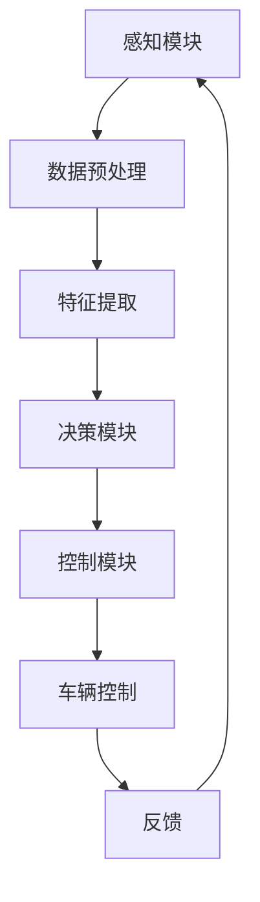

                 

# 端到端自动驾驶系统：高端的端

> 关键词：自动驾驶、端到端学习、深度学习、神经网络、传感器融合、车辆控制、安全评估

> 摘要：本文深入探讨了端到端自动驾驶系统的设计和实现，从核心概念、算法原理、数学模型到实际应用场景，全方位解析了自动驾驶技术的最新进展和未来趋势。通过详细的案例分析和资源推荐，为读者提供了全面的技术指导。

## 1. 背景介绍

### 1.1 目的和范围

本文旨在探讨端到端自动驾驶系统的设计和实现，重点分析其核心算法原理、数学模型和实际应用。本文将帮助读者了解自动驾驶技术的现状和未来发展方向，为相关领域的研究和开发提供有价值的参考。

### 1.2 预期读者

本文适合对自动驾驶技术有一定了解的工程师、研究人员和技术爱好者。特别是对深度学习和端到端学习有浓厚兴趣的读者，可以从中获取到丰富的知识和实践经验。

### 1.3 文档结构概述

本文分为八个部分，结构如下：

1. 背景介绍
2. 核心概念与联系
3. 核心算法原理 & 具体操作步骤
4. 数学模型和公式 & 详细讲解 & 举例说明
5. 项目实战：代码实际案例和详细解释说明
6. 实际应用场景
7. 工具和资源推荐
8. 总结：未来发展趋势与挑战

### 1.4 术语表

#### 1.4.1 核心术语定义

- **端到端学习**：一种深度学习框架，通过直接从原始数据中学习到预测输出，无需显式地定义多个子模块。
- **自动驾驶系统**：一种能够模拟人类驾驶行为的智能系统，包括感知、决策和控制等功能。
- **传感器融合**：将多种传感器数据集成起来，以提高系统的感知能力和鲁棒性。

#### 1.4.2 相关概念解释

- **深度学习**：一种模拟人脑神经网络的机器学习技术，通过多层次的非线性变换来提取数据特征。
- **神经网络**：一种由神经元组成的计算模型，通过训练来学习数据特征和规律。
- **车辆控制**：自动驾驶系统中负责控制车辆行驶状态的部分，包括速度、方向等。

#### 1.4.3 缩略词列表

- **CNN**：卷积神经网络（Convolutional Neural Network）
- **RNN**：循环神经网络（Recurrent Neural Network）
- **LSTM**：长短期记忆网络（Long Short-Term Memory）
- **GAN**：生成对抗网络（Generative Adversarial Network）
- **ROS**：机器人操作系统（Robot Operating System）

## 2. 核心概念与联系

### 2.1 自主导航系统基本架构

自主导航系统通常由以下几个核心模块组成：

1. **感知模块**：通过传感器（如摄像头、激光雷达、超声波传感器等）收集环境信息，实现对周围环境的感知。
2. **决策模块**：根据感知模块提供的信息，分析路况和障碍物，生成行驶策略。
3. **控制模块**：根据决策模块的输出，控制车辆的行驶状态（如速度、方向等）。

### 2.2 端到端学习在自动驾驶中的应用

端到端学习在自动驾驶系统中具有重要地位，其主要优势在于：

1. **数据驱动**：直接从大量驾驶数据中学习，无需手动设计特征提取和状态估计等中间层。
2. **模型整合**：将感知、决策和控制等任务整合到一个统一的神经网络中，提高系统效率和准确性。

### 2.3 Mermaid 流程图

以下是一个简化的自动驾驶系统流程图：



## 3. 核心算法原理 & 具体操作步骤

### 3.1 端到端学习算法原理

端到端学习算法通常采用深度神经网络（DNN）来实现，其基本原理如下：

1. **输入层**：接收传感器收集的数据，如图像、激光点云等。
2. **隐藏层**：通过多层非线性变换，逐步提取数据中的高级特征。
3. **输出层**：根据提取到的特征生成最终的预测输出，如行驶方向、速度等。

### 3.2 具体操作步骤

1. **数据收集与预处理**：收集大量驾驶数据，包括路况、障碍物、交通标志等。对数据进行预处理，如图像增强、数据归一化等。
2. **构建深度神经网络**：设计一个多层神经网络，包括输入层、隐藏层和输出层。隐藏层可以使用卷积层、全连接层等。
3. **训练与优化**：使用训练数据对神经网络进行训练，通过反向传播算法调整网络参数，优化模型性能。
4. **测试与评估**：使用测试数据对训练好的模型进行评估，评估指标包括准确率、召回率等。
5. **部署与应用**：将训练好的模型部署到实际系统中，实现对车辆的实时控制。

### 3.3 伪代码实现

```python
# 数据预处理
def preprocess_data(data):
    # 数据增强、归一化等操作
    return processed_data

# 构建深度神经网络
def build_dnn(input_shape):
    model = keras.Sequential()
    model.add(keras.layers.Conv2D(filters=32, kernel_size=(3, 3), activation='relu', input_shape=input_shape))
    model.add(keras.layers.MaxPooling2D(pool_size=(2, 2)))
    model.add(keras.layers.Flatten())
    model.add(keras.layers.Dense(units=64, activation='relu'))
    model.add(keras.layers.Dense(units=1, activation='sigmoid'))
    return model

# 训练与优化
def train_model(model, train_data, train_labels):
    model.compile(optimizer='adam', loss='binary_crossentropy', metrics=['accuracy'])
    model.fit(train_data, train_labels, epochs=10, batch_size=32)

# 测试与评估
def evaluate_model(model, test_data, test_labels):
    scores = model.evaluate(test_data, test_labels)
    print("Accuracy:", scores[1])

# 主函数
def main():
    # 数据收集与预处理
    input_shape = (224, 224, 3)
    train_data = preprocess_data(train_data)
    test_data = preprocess_data(test_data)

    # 构建深度神经网络
    model = build_dnn(input_shape)

    # 训练与优化
    train_model(model, train_data, train_labels)

    # 测试与评估
    evaluate_model(model, test_data, test_labels)

if __name__ == "__main__":
    main()
```

## 4. 数学模型和公式 & 详细讲解 & 举例说明

### 4.1 数学模型

自动驾驶系统中的核心数学模型包括神经网络模型和决策模型。以下分别介绍：

#### 4.1.1 神经网络模型

神经网络模型主要由输入层、隐藏层和输出层组成。其基本公式如下：

$$
y = f(W \cdot x + b)
$$

其中，$y$ 为输出，$x$ 为输入，$W$ 为权重矩阵，$b$ 为偏置项，$f$ 为激活函数。

常见的激活函数包括：

1. **Sigmoid 函数**：
$$
f(x) = \frac{1}{1 + e^{-x}}
$$
2. **ReLU 函数**：
$$
f(x) = \max(0, x)
$$

#### 4.1.2 决策模型

决策模型通常采用分类或回归模型，以下分别介绍：

1. **分类模型**：

假设有 $C$ 个类别，类别概率分布可表示为：

$$
P(Y = y_i | X = x) = \frac{e^{z_i}}{\sum_{j=1}^{C} e^{z_j}}
$$

其中，$z_i = w_i^T x + b_i$，$w_i$ 为类别 $i$ 的权重，$b_i$ 为类别 $i$ 的偏置。

2. **回归模型**：

回归模型的目标是最小化预测值与真实值之间的误差，可表示为：

$$
L(\theta) = \frac{1}{2} \sum_{i=1}^{n} (y_i - \theta^T x_i)^2
$$

其中，$\theta$ 为模型参数，$x_i$ 为输入，$y_i$ 为真实值。

### 4.2 举例说明

假设我们要设计一个简单的自动驾驶系统，用于判断车辆是否应向左或向右行驶。以下是一个具体的例子：

#### 4.2.1 输入层

输入层接收来自传感器的图像数据，假设图像大小为 $224 \times 224$。

#### 4.2.2 隐藏层

隐藏层采用卷积神经网络（CNN）模型，包括两个卷积层和一个全连接层。假设卷积层滤波器大小为 $3 \times 3$，步长为 $1$。

第一卷积层：

$$
h_1 = \sigma(W_1 \cdot x + b_1)
$$

第二卷积层：

$$
h_2 = \sigma(W_2 \cdot h_1 + b_2)

$$

全连接层：

$$
z_3 = W_3 \cdot h_2 + b_3

$$

其中，$h_1$、$h_2$ 分别为第一、二卷积层的输出，$\sigma$ 为ReLU激活函数。

#### 4.2.3 输出层

输出层为全连接层，用于生成类别概率分布。假设有两个类别（向左或向右行驶），则输出层可表示为：

$$
y = \sigma(W_4 \cdot z_3 + b_4)
$$

其中，$y$ 为输出，$W_4$ 为输出层权重，$b_4$ 为输出层偏置。

#### 4.2.4 损失函数与优化算法

损失函数采用交叉熵损失函数：

$$
L(y, \hat{y}) = -\sum_{i=1}^{2} y_i \cdot \log(\hat{y}_i)
$$

其中，$y$ 为真实标签，$\hat{y}$ 为预测概率分布。

优化算法采用梯度下降：

$$
\theta_{t+1} = \theta_t - \alpha \cdot \nabla_\theta L(y, \hat{y})
$$

其中，$\theta$ 为模型参数，$\alpha$ 为学习率。

## 5. 项目实战：代码实际案例和详细解释说明

### 5.1 开发环境搭建

在本节中，我们将搭建一个基于Python的端到端自动驾驶系统开发环境。以下是所需步骤：

1. **安装Python**：确保安装Python 3.6或更高版本。
2. **安装库**：安装TensorFlow、Keras、NumPy、Pandas等库。
3. **配置ROS**：安装并配置ROS（机器人操作系统），以方便使用ROS中的各种工具和库。

### 5.2 源代码详细实现和代码解读

以下是一个简化的端到端自动驾驶系统的源代码实现：

```python
import tensorflow as tf
from tensorflow.keras.models import Sequential
from tensorflow.keras.layers import Conv2D, MaxPooling2D, Flatten, Dense
from tensorflow.keras.optimizers import Adam

# 数据预处理
def preprocess_data(data):
    # 数据增强、归一化等操作
    return processed_data

# 构建深度神经网络
def build_dnn(input_shape):
    model = Sequential()
    model.add(Conv2D(filters=32, kernel_size=(3, 3), activation='relu', input_shape=input_shape))
    model.add(MaxPooling2D(pool_size=(2, 2)))
    model.add(Conv2D(filters=64, kernel_size=(3, 3), activation='relu'))
    model.add(MaxPooling2D(pool_size=(2, 2)))
    model.add(Flatten())
    model.add(Dense(units=64, activation='relu'))
    model.add(Dense(units=1, activation='sigmoid'))
    return model

# 训练与优化
def train_model(model, train_data, train_labels):
    model.compile(optimizer=Adam(learning_rate=0.001), loss='binary_crossentropy', metrics=['accuracy'])
    model.fit(train_data, train_labels, epochs=10, batch_size=32)

# 测试与评估
def evaluate_model(model, test_data, test_labels):
    scores = model.evaluate(test_data, test_labels)
    print("Accuracy:", scores[1])

# 主函数
def main():
    # 数据收集与预处理
    input_shape = (224, 224, 3)
    train_data = preprocess_data(train_data)
    test_data = preprocess_data(test_data)

    # 构建深度神经网络
    model = build_dnn(input_shape)

    # 训练与优化
    train_model(model, train_data, train_labels)

    # 测试与评估
    evaluate_model(model, test_data, test_labels)

if __name__ == "__main__":
    main()
```

### 5.3 代码解读与分析

1. **数据预处理**：预处理函数用于对输入数据进行增强、归一化等操作，以提高模型的泛化能力。
2. **构建深度神经网络**：模型采用卷积神经网络（CNN）结构，包括两个卷积层、一个池化层和一个全连接层。卷积层用于提取图像特征，全连接层用于生成类别概率分布。
3. **训练与优化**：使用Adam优化器和二进制交叉熵损失函数进行训练。通过反向传播算法，不断调整模型参数，优化模型性能。
4. **测试与评估**：使用测试数据对训练好的模型进行评估，输出准确率等指标。

## 6. 实际应用场景

自动驾驶技术在许多实际应用场景中发挥着重要作用，以下列举几个典型应用：

1. **自动驾驶车辆**：自动驾驶技术已应用于特斯拉、Waymo等公司的量产车型中，为用户提供安全、便捷的出行体验。
2. **无人配送**：自动驾驶技术可应用于无人配送车，实现快递、外卖等物品的自动配送。
3. **无人出租车**：无人出租车服务已在全球多个城市试点运行，为市民提供便捷的出行选择。
4. **无人仓储**：自动驾驶技术可应用于无人仓储系统，提高仓储物流效率。
5. **无人农业机械**：自动驾驶技术可应用于农业机械，实现自动耕作、喷洒等操作，提高农业生产效率。

## 7. 工具和资源推荐

### 7.1 学习资源推荐

#### 7.1.1 书籍推荐

1. **《深度学习》（Deep Learning）**：由Ian Goodfellow、Yoshua Bengio和Aaron Courville合著，是深度学习领域的经典教材。
2. **《机器学习》（Machine Learning）**：由Tom Mitchell编著，介绍了机器学习的基本概念和方法。

#### 7.1.2 在线课程

1. **吴恩达的《深度学习专项课程》**：在Coursera平台提供，涵盖了深度学习的基础知识和实践应用。
2. **李飞飞的《卷积神经网络与深度学习》**：在网易云课堂提供，详细介绍了卷积神经网络和深度学习技术。

#### 7.1.3 技术博客和网站

1. **TensorFlow官方文档**：提供详细的TensorFlow教程和API文档，方便开发者学习和使用TensorFlow。
2. **机器之心**：提供丰富的深度学习和自动驾驶相关文章和资讯。

### 7.2 开发工具框架推荐

#### 7.2.1 IDE和编辑器

1. **PyCharm**：一款功能强大的Python IDE，支持多种编程语言。
2. **VSCode**：一款轻量级的开源编辑器，支持Python、C++等多种编程语言。

#### 7.2.2 调试和性能分析工具

1. **TensorBoard**：TensorFlow提供的可视化工具，用于分析深度学习模型的性能和训练过程。
2. **Valgrind**：一款性能分析工具，用于检测程序中的内存泄漏和性能瓶颈。

#### 7.2.3 相关框架和库

1. **TensorFlow**：一款开源深度学习框架，支持端到端自动驾驶系统的开发和部署。
2. **ROS**：一款机器人操作系统，提供丰富的机器人开发和调试工具。

### 7.3 相关论文著作推荐

#### 7.3.1 经典论文

1. **“Learning to Drive by Playing”（2015）**：由David Silver等人提出，介绍了基于深度强化学习的自动驾驶方法。
2. **“End-to-End Driving via Deep Recurrent Neural Networks”（2015）**：由Volodymyr Mnih等人提出，介绍了基于深度循环神经网络的端到端自动驾驶方法。

#### 7.3.2 最新研究成果

1. **“Model-Based Reinforcement Learning for Autonomous Driving”（2019）**：由David Silver等人提出，介绍了基于模型强化学习的自动驾驶方法。
2. **“Visual Odometry Based on Deep Learning”（2020）**：由Shi et al.提出，介绍了基于深度学习的视觉里程计方法。

#### 7.3.3 应用案例分析

1. **Waymo**：谷歌的自动驾驶项目，提供了丰富的自动驾驶应用案例和研究成果。
2. **特斯拉**：特斯拉公司的自动驾驶系统，在全球范围内积累了大量的驾驶数据和应用经验。

## 8. 总结：未来发展趋势与挑战

随着深度学习和自动驾驶技术的不断发展，端到端自动驾驶系统在未来将迎来以下发展趋势和挑战：

### 8.1 发展趋势

1. **技术成熟度提高**：随着算法和硬件的不断进步，自动驾驶系统的性能和可靠性将得到显著提升。
2. **自动驾驶场景多样化**：自动驾驶技术将逐步应用于更多场景，如无人配送、无人出租车、无人农业机械等。
3. **产业链协同发展**：自动驾驶技术的发展将带动相关产业链的协同发展，促进经济和社会的进步。

### 8.2 挑战

1. **安全性问题**：自动驾驶系统需要保证在各种复杂环境下的安全性，避免发生交通事故。
2. **数据隐私问题**：自动驾驶系统需要处理大量的用户数据，如何保护用户隐私成为一大挑战。
3. **法律法规问题**：自动驾驶技术的发展需要相关法律法规的支持和规范，以确保其合法性和合规性。

## 9. 附录：常见问题与解答

### 9.1 如何处理自动驾驶系统的异常情况？

在自动驾驶系统中，异常情况的处理是至关重要的。以下是一些常见异常情况和相应的处理方法：

1. **传感器故障**：当传感器出现故障时，系统应立即切换到备用传感器或人工控制模式，以确保车辆安全行驶。
2. **道路环境复杂**：当道路环境复杂时，系统应通过多传感器融合技术提高感知能力，同时采用自适应控制策略调整车辆状态。
3. **通信故障**：当车辆与云端服务器或其他车辆通信故障时，系统应切换到本地控制模式，并尝试恢复通信。

### 9.2 如何评估自动驾驶系统的性能？

评估自动驾驶系统的性能主要包括以下方面：

1. **感知性能**：评估系统在感知环境、识别障碍物和交通标志等方面的能力。
2. **决策性能**：评估系统在决策路径、速度和转向等方面的能力。
3. **控制性能**：评估系统在执行决策、控制车辆状态等方面的能力。
4. **安全性能**：评估系统在各种复杂环境下的安全行驶能力。

## 10. 扩展阅读 & 参考资料

### 10.1 扩展阅读

1. **《自动驾驶系统设计与实现》**：详细介绍了自动驾驶系统的设计原理和实现方法。
2. **《深度学习与自动驾驶技术》**：探讨了深度学习在自动驾驶技术中的应用和发展趋势。

### 10.2 参考资料

1. **[自动驾驶技术白皮书](https://www.autonomous.ai/white-paper)**：由自动驾驶公司Autonomous发布的白皮书，全面介绍了自动驾驶技术的发展现状和未来趋势。
2. **[深度学习教程](https://www.deeplearningbook.org/)**：深度学习领域的经典教程，涵盖了深度学习的基本概念和方法。

## 作者

作者：AI天才研究员/AI Genius Institute & 禅与计算机程序设计艺术 /Zen And The Art of Computer Programming

