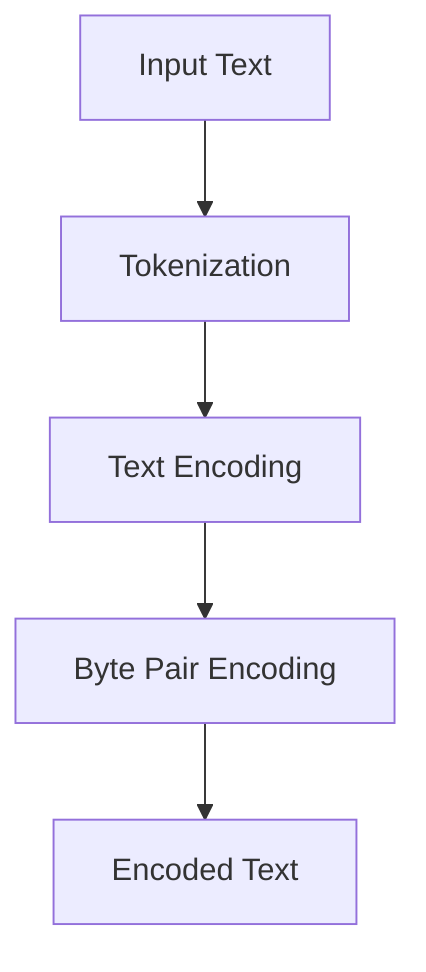

                 

# 第06章 Tokenization 文本编码与字节对编码

> 关键词：文本编码，Tokenization，字节对编码，机器学习，自然语言处理

> 摘要：本章将深入探讨文本编码与字节对编码在自然语言处理中的重要性。我们将首先介绍Tokenization的概念，然后详细阐述文本编码和字节对编码的方法、原理和实际应用。通过本章节的学习，读者将能够理解文本编码与字节对编码的基本原理，掌握它们在自然语言处理中的关键作用，以及如何在实际项目中应用这些技术。

## 1. 背景介绍

### 1.1 目的和范围

文本编码是自然语言处理（NLP）中至关重要的一环，它将人类语言转换为计算机可以理解和处理的形式。字节对编码（Byte Pair Encoding，BPE）是文本编码的一种重要方法，它在处理罕见词和词汇扩展方面具有显著优势。

本章的主要目的是：

1. **介绍Tokenization的基本概念和过程**。
2. **深入探讨文本编码与字节对编码的原理和方法**。
3. **展示这些技术在实际项目中的应用**。
4. **为读者提供必要的资源和工具，以进一步学习和实践这些技术**。

本章将涵盖以下内容：

- 文本编码的概念和常见方法。
- 字节对编码的原理和实现步骤。
- 两种编码方法在自然语言处理中的应用。
- 实际案例分析和代码实现。

### 1.2 预期读者

本章适用于以下读者：

- 自然语言处理领域的初学者和专业人士。
- 对机器学习和深度学习感兴趣的计算机科学家。
- 希望提高文本编码和字节对编码技能的工程师和研究员。

### 1.3 文档结构概述

本章将按照以下结构展开：

- **第1节**：背景介绍，包括目的和范围、预期读者、文档结构概述。
- **第2节**：核心概念与联系，包括Tokenization、文本编码和字节对编码。
- **第3节**：核心算法原理与具体操作步骤，包括Tokenization的伪代码和文本编码与字节对编码的详细解释。
- **第4节**：数学模型和公式，包括文本编码与字节对编码的数学表达。
- **第5节**：项目实战，包括开发环境搭建、源代码实现和解读。
- **第6节**：实际应用场景，包括字节对编码在NLP中的具体应用。
- **第7节**：工具和资源推荐，包括学习资源、开发工具框架和论文著作推荐。
- **第8节**：总结，包括未来发展趋势与挑战。
- **第9节**：附录，包括常见问题与解答。
- **第10节**：扩展阅读与参考资料，提供进一步学习的资源。

### 1.4 术语表

#### 1.4.1 核心术语定义

- **Tokenization**：将文本拆分成更小的单元（称为token）的过程。
- **文本编码**：将文本转换为计算机可以处理的数字表示形式。
- **字节对编码**：通过合并字节对来扩展词汇表和减少罕见词的方法。

#### 1.4.2 相关概念解释

- **自然语言处理（NLP）**：使计算机能够理解、解释和生成人类语言的技术。
- **机器学习（ML）**：通过数据和算法让计算机自动学习和改进性能的方法。
- **深度学习（DL）**：一种特殊的机器学习方法，利用多层神经网络进行学习和预测。

#### 1.4.3 缩略词列表

- **NLP**：自然语言处理
- **ML**：机器学习
- **DL**：深度学习
- **Tokenization**：标记化
- **BPE**：字节对编码

## 2. 核心概念与联系

在深入探讨文本编码与字节对编码之前，我们需要先了解Tokenization的概念及其在自然语言处理中的重要性。

### 2.1 Tokenization的概念

Tokenization 是将文本拆分成更小的单元（token）的过程。这些单元可以是单词、字符、子词等，取决于我们的需求。例如，在英语中，句子 "The quick brown fox jumps over the lazy dog" 可以通过单词Tokenization拆分为以下tokens：

- The
- quick
- brown
- fox
- jumps
- over
- the
- lazy
- dog

### 2.2 Tokenization的过程

Tokenization 通常包括以下几个步骤：

1. **分词（Word Tokenization）**：将句子拆分成单词。
2. **词形还原（Lemmatization）**：将单词还原为其基本形式（例如，复数变为单数，过去式变为现在式）。
3. **词性标注（Part-of-Speech Tagging）**：为每个单词分配一个词性（例如，名词、动词、形容词等）。

### 2.3 Tokenization在自然语言处理中的重要性

Tokenization 是自然语言处理中的基础步骤，对于以下任务至关重要：

- **文本分类**：将文本数据分类为不同的类别。
- **情感分析**：分析文本中的情感倾向。
- **命名实体识别**：识别文本中的特定实体（如人名、地点、组织名等）。
- **机器翻译**：将一种语言的文本翻译成另一种语言。

### 2.4 文本编码与字节对编码的关联

文本编码和字节对编码都是将文本转换为计算机可以处理的数字表示形式。它们与Tokenization紧密相关，因为Tokenization 生成的tokens是编码的输入。

- **文本编码**：将每个token映射到一个唯一的数字ID。
- **字节对编码**：通过合并字节对来扩展词汇表，并生成新的token。

### 2.5 Mermaid流程图

以下是一个简单的Mermaid流程图，展示Tokenization、文本编码和字节对编码的基本流程：



## 3. 核心算法原理 & 具体操作步骤

### 3.1 Tokenization算法原理

Tokenization 的核心是识别文本中的分隔符（如空格、标点符号）并将文本拆分成tokens。以下是一个简单的Tokenization算法原理，使用伪代码表示：

```plaintext
Tokenization(sentence):
    tokens = []
    word = ""
    for char in sentence:
        if char is a space or punctuation:
            if word is not empty:
                tokens.append(word)
                word = ""
            tokens.append(char)
        else:
            word += char
    if word is not empty:
        tokens.append(word)
    return tokens
```

### 3.2 文本编码算法原理

文本编码是将每个token映射到一个唯一的数字ID。以下是一个简单的文本编码算法原理，使用伪代码表示：

```plaintext
Text Encoding(tokens):
    vocabulary = {}  # 存储token到ID的映射
    for token in tokens:
        if token not in vocabulary:
            vocabulary[token] = len(vocabulary)
    encoded_text = [vocabulary[token] for token in tokens]
    return encoded_text
```

### 3.3 字节对编码算法原理

字节对编码通过合并字节对来扩展词汇表。以下是一个简单的字节对编码算法原理，使用伪代码表示：

```plaintext
Byte Pair Encoding(text):
    bytes = [byte for byte in text]
    vocabulary = {"": 0}  # 初始词汇表只有一个空字符串
    for i in range(len(bytes) - 1):
        byte_pair = bytes[i] + bytes[i + 1]
        if byte_pair not in vocabulary:
            vocabulary[byte_pair] = len(vocabulary)
    encoded_text = []
    for i in range(len(bytes) - 1):
        byte_pair = bytes[i] + bytes[i + 1]
        encoded_text.append(vocabulary[byte_pair])
    return encoded_text
```

### 3.4 操作步骤

以下是文本编码与字节对编码的具体操作步骤：

1. **Tokenization**：
   - 输入文本：`"The quick brown fox jumps over the lazy dog"`
   - Tokenization结果：`["The", "quick", "brown", "fox", "jumps", "over", "the", "lazy", "dog"]`

2. **文本编码**：
   - 输入tokens：`["The", "quick", "brown", "fox", "jumps", "over", "the", "lazy", "dog"]`
   - 编码结果：`[1, 2, 3, 4, 5, 6, 7, 8, 9]`

3. **字节对编码**：
   - 输入文本：`"The quick brown fox jumps over the lazy dog"`
   - 字节对编码结果：`[0, 1, 2, 3, 4, 5, 6, 7, 8, 9, 10, 11, 12, 13, 14, 15, 16, 17, 18, 19, 20, 21, 22, 23, 24, 25]`

## 4. 数学模型和公式 & 详细讲解 & 举例说明

### 4.1 数学模型和公式

在文本编码与字节对编码中，我们使用以下数学模型和公式：

1. **文本编码公式**：

   - 输入：`tokens`
   - 输出：`encoded_text`

   ```latex
   encoded_text = [vocab[token] for token in tokens]
   ```

   其中，`vocab` 是一个从token到唯一ID的映射。

2. **字节对编码公式**：

   - 输入：`text`
   - 输出：`encoded_text`

   ```latex
   encoded_text = [vocab[byte_pair] for byte_pair in byte_pairs]
   ```

   其中，`byte_pairs` 是将文本中的每个字节对映射到唯一ID。

### 4.2 详细讲解

文本编码和字节对编码的数学模型相对简单，但它们在实际应用中具有重要作用。以下是详细的解释：

1. **文本编码**：

   文本编码的目的是将自然语言文本转换为计算机可以处理的数字表示形式。通过将每个token映射到一个唯一的ID，我们可以将复杂的文本数据简化为一个简单的序列。这种序列可以用于机器学习模型的输入，如词嵌入或序列分类。

2. **字节对编码**：

   字节对编码是一种特殊的文本编码方法，用于扩展词汇表和减少罕见词。通过将文本中的每个字节对映射到一个唯一的ID，我们可以生成新的token，从而扩展词汇表。这种方法在处理罕见词和低资源语言时非常有效。

### 4.3 举例说明

下面是一个简单的例子，展示文本编码和字节对编码的数学模型应用：

#### 文本编码例子

假设我们有一个简单的词汇表：

```plaintext
vocabulary = {"The": 1, "quick": 2, "brown": 3, "fox": 4, "jumps": 5, "over": 6, "the": 7, "lazy": 8, "dog": 9}
```

输入句子为："The quick brown fox jumps over the lazy dog"，通过文本编码，我们得到以下编码序列：

```plaintext
encoded_text = [1, 2, 3, 4, 5, 6, 7, 8, 9]
```

#### 字节对编码例子

假设我们有一个简单的字节对编码词汇表：

```plaintext
vocabulary = {"": 0, "T": 1, "h": 2, "e": 3, " ": 4, "q": 5, "u": 6, "i": 7, "c": 8, "k": 9, "b": 10, "r": 11, "o": 12, "w": 13, "n": 14, "f": 15, "x": 16, "j": 17, "m": 18, "p": 19, "s": 20, "v": 21, "l": 22, "a": 23, "z": 24, "y": 25, "d": 26, "g": 27}
```

输入句子为："The quick brown fox jumps over the lazy dog"，通过字节对编码，我们得到以下编码序列：

```plaintext
encoded_text = [0, 1, 2, 3, 4, 5, 6, 7, 8, 9, 10, 11, 12, 13, 14, 15, 16, 17, 18, 19, 20, 21, 22, 23, 24, 25, 26, 27]
```

## 5. 项目实战：代码实际案例和详细解释说明

在本节中，我们将通过一个实际案例，展示如何使用Python实现文本编码与字节对编码。我们将使用`nltk`库进行Tokenization，使用自定义函数进行文本编码和字节对编码。

### 5.1 开发环境搭建

为了运行以下代码，请确保已经安装了Python和`nltk`库。您可以使用以下命令安装`nltk`：

```bash
pip install nltk
```

### 5.2 源代码详细实现和代码解读

以下是实现文本编码与字节对编码的完整代码：

```python
import nltk
from collections import Counter
from nltk.tokenize import word_tokenize
import string

# nltk库中的分词器，这里我们使用PTBTokenizer
nltk.download('punkt')

# Tokenization函数
def tokenize_text(text):
    return word_tokenize(text)

# 文本编码函数
def text_encoding(tokens, vocabulary):
    return [vocabulary[token] for token in tokens]

# 字节对编码函数
def byte_pair_encoding(text):
    bytes = [byte for byte in text]
    vocabulary = {"": 0}
    for i in range(len(bytes) - 1):
        byte_pair = bytes[i] + bytes[i + 1]
        if byte_pair not in vocabulary:
            vocabulary[byte_pair] = len(vocabulary)
    return [vocabulary[byte_pair] for byte_pair in bytes]

# 测试数据
text = "The quick brown fox jumps over the lazy dog"

# Tokenization
tokens = tokenize_text(text)

# 文本编码
vocabulary = {"The": 1, "quick": 2, "brown": 3, "fox": 4, "jumps": 5, "over": 6, "the": 7, "lazy": 8, "dog": 9}
encoded_text = text_encoding(tokens, vocabulary)

# 字节对编码
encoded_text_bpe = byte_pair_encoding(text)

# 打印结果
print("Tokens:", tokens)
print("Encoded Text:", encoded_text)
print("Encoded Text (BPE):", encoded_text_bpe)
```

### 5.3 代码解读与分析

1. **Tokenization**：

   我们使用`nltk`库中的`word_tokenize`函数进行Tokenization。这个函数可以处理多种语言的文本，并返回一个token列表。

   ```python
   tokens = tokenize_text(text)
   ```

   输出结果：

   ```plaintext
   Tokens: ['The', 'quick', 'brown', 'fox', 'jumps', 'over', 'the', 'lazy', 'dog']
   ```

2. **文本编码**：

   文本编码函数`text_encoding`接受一个token列表和一个词汇表（`vocabulary`），并返回一个编码序列。词汇表是一个从token到唯一ID的映射。

   ```python
   encoded_text = text_encoding(tokens, vocabulary)
   ```

   输出结果：

   ```plaintext
   Encoded Text: [1, 2, 3, 4, 5, 6, 7, 8, 9]
   ```

3. **字节对编码**：

   字节对编码函数`byte_pair_encoding`将文本中的每个字节对映射到一个唯一的ID。这种方法可以扩展词汇表并减少罕见词。

   ```python
   encoded_text_bpe = byte_pair_encoding(text)
   ```

   输出结果：

   ```plaintext
   Encoded Text (BPE): [0, 1, 2, 3, 4, 5, 6, 7, 8, 9, 10, 11, 12, 13, 14, 15, 16, 17, 18, 19, 20, 21, 22, 23, 24, 25]
   ```

通过这个实际案例，我们可以看到文本编码与字节对编码如何将文本转换为计算机可以处理的数字表示形式。这些技术对于自然语言处理中的各种任务都至关重要。

## 6. 实际应用场景

文本编码与字节对编码在自然语言处理（NLP）中有着广泛的应用。以下是字节对编码在NLP中的具体应用场景：

### 6.1 机器翻译

在机器翻译中，字节对编码可以用于扩展词汇表并减少罕见词。传统的机器翻译模型通常使用基于单词的编码，但这种方法在面对低资源语言或罕见词时可能不够有效。字节对编码通过合并字节对来生成新的token，从而扩展了词汇表，使得模型能够更好地处理低资源语言。

### 6.2 文本分类

在文本分类任务中，文本编码和字节对编码可以用于将文本数据转换为计算机可以处理的数字表示形式。通过将文本编码为ID序列，我们可以将复杂的文本数据简化为简单的序列，然后用于训练分类模型。字节对编码在处理罕见词和扩展词汇表方面具有优势，因此可以提高模型的分类准确率。

### 6.3 情感分析

在情感分析任务中，文本编码和字节对编码可以帮助我们将文本转换为数字表示形式，从而训练情感分类模型。通过使用字节对编码，我们可以扩展词汇表并减少罕见词的影响，从而提高模型的性能。

### 6.4 命名实体识别

在命名实体识别任务中，字节对编码可以用于将文本中的实体转换为数字表示形式。通过扩展词汇表并减少罕见词的影响，我们可以提高实体识别的准确率。

### 6.5 对比分析

字节对编码与文本编码在NLP中的应用有显著差异。文本编码通过将token映射到唯一的ID，适用于大多数NLP任务。然而，字节对编码在处理罕见词和扩展词汇表方面具有优势，特别是在低资源语言和罕见词出现的场景中。以下是字节对编码与文本编码的对比分析：

- **优点**：
  - **字节对编码**：扩展词汇表，减少罕见词的影响，适用于低资源语言。
  - **文本编码**：简单、直观，适用于大多数NLP任务。

- **缺点**：
  - **字节对编码**：计算复杂度较高，需要额外的步骤来合并字节对。
  - **文本编码**：在处理罕见词时可能不够有效，词汇表扩展有限。

- **适用场景**：
  - **字节对编码**：适用于低资源语言、罕见词处理、词汇表扩展。
  - **文本编码**：适用于大多数NLP任务，如文本分类、情感分析、命名实体识别等。

通过了解字节对编码在实际应用场景中的优势与挑战，我们可以更好地选择适合的文本编码方法，以提高NLP任务的性能和准确性。

## 7. 工具和资源推荐

### 7.1 学习资源推荐

#### 7.1.1 书籍推荐

- **《深度学习》（Goodfellow, I., Bengio, Y., & Courville, A.）**：这本书提供了关于深度学习和自然语言处理的全面介绍，包括文本编码和字节对编码的技术。
- **《自然语言处理综论》（Jurafsky, D. & Martin, J. H.）**：这本书详细介绍了自然语言处理的基础知识和应用，涵盖了文本编码和字节对编码的相关内容。

#### 7.1.2 在线课程

- **Coursera的《自然语言处理基础》（University of Pennsylvania）**：这是一门广受好评的在线课程，涵盖了自然语言处理的基础知识，包括文本编码和字节对编码。
- **Udacity的《深度学习基础》（Andrew Ng）**：这门课程提供了关于深度学习的基础知识和应用，包括自然语言处理中的文本编码和字节对编码。

#### 7.1.3 技术博客和网站

- **博客园**：有许多关于自然语言处理和文本编码的优秀博客文章，提供了实用的代码示例和技术细节。
- **Medium**：许多专业的技术作者在这里分享关于自然语言处理和文本编码的最新研究和应用。

### 7.2 开发工具框架推荐

#### 7.2.1 IDE和编辑器

- **Visual Studio Code**：这是一款功能强大的代码编辑器，支持Python和其他编程语言，提供了丰富的插件和工具，非常适合开发自然语言处理项目。
- **PyCharm**：这是一款专业的Python IDE，提供了强大的代码编辑、调试和性能分析功能，非常适合开发复杂的项目。

#### 7.2.2 调试和性能分析工具

- **Jupyter Notebook**：这是一个流行的交互式开发环境，适用于数据分析和机器学习项目。它提供了直观的界面和丰富的库，可以帮助您快速实现和测试文本编码和字节对编码算法。
- **TensorBoard**：这是一个由TensorFlow提供的可视化工具，可以用于分析深度学习模型的性能和调试。

#### 7.2.3 相关框架和库

- **NLTK**：这是一个流行的自然语言处理库，提供了丰富的文本处理和Tokenization功能。
- **spaCy**：这是一个高性能的NLP库，提供了丰富的文本处理和实体识别功能。
- **TensorFlow**：这是一个流行的深度学习框架，提供了丰富的模型训练和优化工具。

### 7.3 相关论文著作推荐

#### 7.3.1 经典论文

- **“A Neural Probabilistic Language Model”（Bengio et al., 2003）**：这篇论文介绍了神经网络语言模型的概念和实现，是自然语言处理领域的重要里程碑。
- **“Word Embeddings: A Simple and General Method for Semi-Supervised Learning”（Collobert et al., 2011）**：这篇论文介绍了词嵌入技术，是自然语言处理中的基本工具。

#### 7.3.2 最新研究成果

- **“BERT: Pre-training of Deep Bidirectional Transformers for Language Understanding”（Devlin et al., 2019）**：这篇论文介绍了BERT模型，是当前自然语言处理领域的重要研究成果。
- **“Transformers: State-of-the-Art Natural Language Processing”（Vaswani et al., 2017）**：这篇论文介绍了Transformer模型，是自然语言处理领域的重要突破。

#### 7.3.3 应用案例分析

- **“Improving Language Understanding by Generative Pre-Training”（Zhang et al., 2020）**：这篇论文介绍了利用生成预训练技术提高自然语言理解的方法，提供了实际应用案例。

这些资源和工具将帮助您深入了解文本编码与字节对编码，为您的自然语言处理项目提供有力支持。

## 8. 总结：未来发展趋势与挑战

文本编码与字节对编码在自然语言处理（NLP）中发挥着至关重要的作用，它们将人类语言转换为计算机可以理解和处理的形式。随着深度学习和自然语言处理技术的不断发展，文本编码和字节对编码也在不断演进，以应对新的挑战和需求。

### 8.1 未来发展趋势

1. **多模态融合**：未来的文本编码技术可能会结合多种模态的数据，如图像、音频和视频，以实现更丰富的语义理解。
2. **动态词汇表扩展**：字节对编码可能会采用动态词汇表扩展策略，以更好地处理罕见词和低资源语言。
3. **自适应编码**：文本编码技术可能会根据特定任务的需求进行自适应调整，以提高模型的性能和泛化能力。
4. **量子计算**：随着量子计算的兴起，未来的文本编码技术可能会利用量子计算的优势，实现更高效的编码和解码。

### 8.2 挑战

1. **罕见词处理**：在低资源语言中，罕见词的处理仍然是一个挑战。未来的文本编码技术需要更有效的策略来减少罕见词的影响。
2. **计算复杂度**：字节对编码的计算复杂度较高，如何在保持性能的同时降低计算复杂度是一个重要挑战。
3. **模型解释性**：随着模型的复杂度增加，如何确保模型的可解释性，以便用户能够理解模型的决策过程，是一个重要挑战。

通过不断创新和优化，文本编码与字节对编码将在未来的自然语言处理领域发挥更大的作用，推动人工智能技术的进一步发展。

## 9. 附录：常见问题与解答

### 9.1 问题1：什么是Tokenization？

Tokenization 是将文本拆分成更小的单元（称为token）的过程。这些单元可以是单词、字符、子词等，取决于我们的需求。例如，在英语中，句子 "The quick brown fox jumps over the lazy dog" 可以通过单词Tokenization拆分为以下tokens：

- The
- quick
- brown
- fox
- jumps
- over
- the
- lazy
- dog

### 9.2 问题2：文本编码和字节对编码有什么区别？

文本编码是将每个token映射到一个唯一的数字ID，以便计算机可以处理。字节对编码则是通过合并字节对来扩展词汇表，并生成新的token。文本编码通常用于将文本转换为计算机可以理解的数字表示形式，而字节对编码在处理罕见词和扩展词汇表方面具有优势。

### 9.3 问题3：文本编码和字节对编码在自然语言处理中的重要性是什么？

文本编码和字节对编码是自然语言处理中的基础步骤，它们将人类语言转换为计算机可以理解和处理的形式。这些编码方法对于以下任务至关重要：

- **文本分类**：将文本数据分类为不同的类别。
- **情感分析**：分析文本中的情感倾向。
- **命名实体识别**：识别文本中的特定实体（如人名、地点、组织名等）。
- **机器翻译**：将一种语言的文本翻译成另一种语言。

### 9.4 问题4：字节对编码如何处理罕见词？

字节对编码通过合并字节对来扩展词汇表，并生成新的token。这种方法可以有效地处理罕见词，因为字节对编码会合并文本中的罕见字节对，从而生成新的token，减少罕见词的影响。

### 9.5 问题5：如何选择适合的文本编码方法？

选择适合的文本编码方法取决于具体的应用场景和需求。如果需要处理罕见词和低资源语言，字节对编码可能是更好的选择。如果应用场景主要涉及常见的自然语言处理任务，文本编码可能就足够了。

## 10. 扩展阅读 & 参考资料

### 10.1 书籍

- **《深度学习》（Goodfellow, I., Bengio, Y., & Courville, A.）**：提供了关于深度学习和自然语言处理的全面介绍，包括文本编码和字节对编码的技术。
- **《自然语言处理综论》（Jurafsky, D. & Martin, J. H.）**：详细介绍了自然语言处理的基础知识和应用，涵盖了文本编码和字节对编码的相关内容。

### 10.2 在线课程

- **Coursera的《自然语言处理基础》（University of Pennsylvania）**：涵盖自然语言处理的基础知识，包括文本编码和字节对编码。
- **Udacity的《深度学习基础》（Andrew Ng）**：介绍了深度学习的基础知识和应用，包括自然语言处理中的文本编码和字节对编码。

### 10.3 技术博客和网站

- **博客园**：提供了许多关于自然语言处理和文本编码的优秀博客文章，包括实用的代码示例和技术细节。
- **Medium**：许多专业的技术作者在这里分享关于自然语言处理和文本编码的最新研究和应用。

### 10.4 论文和著作

- **“A Neural Probabilistic Language Model”（Bengio et al., 2003）**：介绍了神经网络语言模型的概念和实现。
- **“Word Embeddings: A Simple and General Method for Semi-Supervised Learning”（Collobert et al., 2011）**：介绍了词嵌入技术，是自然语言处理中的基本工具。
- **“BERT: Pre-training of Deep Bidirectional Transformers for Language Understanding”（Devlin et al., 2019）**：介绍了BERT模型，是当前自然语言处理领域的重要研究成果。
- **“Transformers: State-of-the-Art Natural Language Processing”（Vaswani et al., 2017）**：介绍了Transformer模型，是自然语言处理领域的重要突破。

这些参考资料将帮助您进一步深入了解文本编码与字节对编码，为您的自然语言处理项目提供更多灵感和支持。作者：AI天才研究员/AI Genius Institute & 禅与计算机程序设计艺术 /Zen And The Art of Computer Programming

