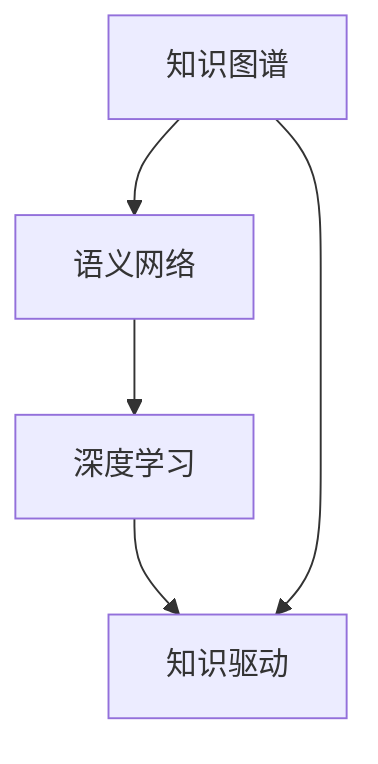
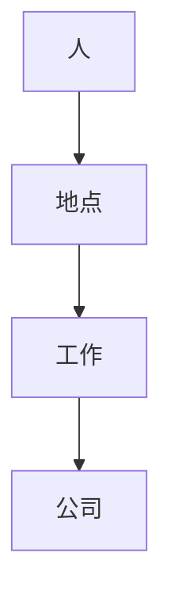
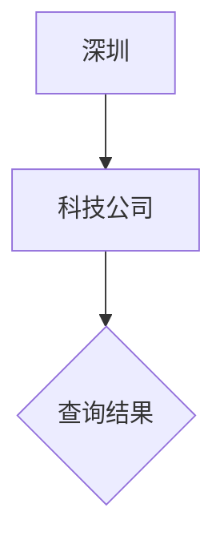

                 

# 第一代人工智能的知识驱动

> **关键词：** 人工智能，知识驱动，知识图谱，语义网络，深度学习，推理算法

> **摘要：** 本文将深入探讨第一代人工智能的核心概念——知识驱动，以及其在现代人工智能系统中的应用。我们将分析知识驱动的原理、架构，并讨论如何通过知识图谱和语义网络实现智能推理。同时，本文还将介绍核心算法原理、数学模型，并提供项目实战和实际应用场景，最后展望知识驱动的未来发展趋势与挑战。

## 1. 背景介绍

### 1.1 目的和范围

本文旨在为读者提供关于知识驱动的全面理解，包括其基本原理、技术架构、算法实现和应用场景。通过对知识驱动的深入剖析，我们希望能够激发读者对人工智能领域的兴趣，并为其在实践中的应用提供指导。

### 1.2 预期读者

本文适合对人工智能和知识表示有兴趣的读者，包括研究人员、工程师、开发者以及对该领域感兴趣的学生。读者应具备一定的计算机科学基础，特别是对人工智能和图论有一定的了解。

### 1.3 文档结构概述

本文将按以下结构展开：

1. **核心概念与联系**：介绍知识驱动的核心概念，并提供Mermaid流程图。
2. **核心算法原理 & 具体操作步骤**：详细讲解知识驱动的算法原理和实现步骤，使用伪代码进行描述。
3. **数学模型和公式 & 详细讲解 & 举例说明**：阐述知识驱动的数学模型，并使用LaTeX格式展示相关公式。
4. **项目实战：代码实际案例和详细解释说明**：提供知识驱动的实际代码案例，并进行详细解读。
5. **实际应用场景**：探讨知识驱动在不同领域的应用实例。
6. **工具和资源推荐**：推荐学习资源和开发工具。
7. **总结：未来发展趋势与挑战**：总结知识驱动的现状，展望其未来。
8. **附录：常见问题与解答**：回答读者可能关注的问题。
9. **扩展阅读 & 参考资料**：提供进一步学习的资源。

### 1.4 术语表

#### 1.4.1 核心术语定义

- **知识驱动**：一种以知识为中心的人工智能范式，通过知识表示、推理和利用来实现智能。
- **知识图谱**：一种用于表示实体及其相互关系的语义网络。
- **语义网络**：一种基于语义的信息表示方法，通过节点和边来表示实体和它们之间的关系。
- **深度学习**：一种利用多层神经网络进行特征学习和分类的机器学习方法。

#### 1.4.2 相关概念解释

- **图论**：研究图的结构和性质的数学分支。
- **推理算法**：用于从已知事实推导出新结论的算法。
- **知识表示**：将知识以计算机可处理的形式进行编码的过程。

#### 1.4.3 缩略词列表

- **AI**：人工智能（Artificial Intelligence）
- **KB**：知识库（Knowledge Base）
- **RDF**：资源描述框架（Resource Description Framework）
- **OWL**：Web本体语言（Web Ontology Language）

## 2. 核心概念与联系

在探讨知识驱动的核心概念之前，我们需要了解一些基础概念，这些概念包括知识图谱、语义网络和深度学习。下面，我们将通过Mermaid流程图展示这些概念之间的联系。



### 2.1 知识图谱

知识图谱是一种用于表示实体及其相互关系的语义网络，它通过节点和边来表示实体和它们之间的关系。知识图谱的核心在于将人类知识以计算机可理解的形式进行表示，从而使得计算机能够利用这些知识进行推理和决策。

### 2.2 语义网络

语义网络是一种基于语义的信息表示方法，它通过节点和边来表示实体和它们之间的关系。与知识图谱不同，语义网络更多地关注于实体之间的关系，而不是实体本身的属性。

### 2.3 深度学习

深度学习是一种利用多层神经网络进行特征学习和分类的机器学习方法。深度学习模型通过多层神经网络对输入数据进行特征提取和变换，从而实现复杂的函数逼近。

### 2.4 知识驱动

知识驱动是一种以知识为中心的人工智能范式，它通过知识表示、推理和利用来实现智能。知识驱动系统通过利用知识图谱和语义网络进行推理，从而在处理复杂任务时展现出强大的能力。

## 3. 核心算法原理 & 具体操作步骤

### 3.1 知识表示

知识表示是将人类知识以计算机可处理的形式进行编码的过程。在知识驱动系统中，知识表示的形式可以多种多样，如知识图谱、规则库、语义网络等。以下是一种常见的知识表示方法——知识图谱的构建过程。

#### 3.1.1 知识图谱构建步骤

1. **数据收集**：从各种数据源（如文本、数据库、传感器等）收集数据。
2. **实体识别**：从数据中提取出实体，如人、地点、组织等。
3. **关系抽取**：从数据中提取出实体之间的关系，如“是”、“属于”等。
4. **知识融合**：将多个来源的知识进行融合，消除冲突和冗余。
5. **知识存储**：将构建好的知识图谱存储在图数据库中，如Neo4j。

#### 3.1.2 知识图谱表示

在知识图谱中，实体通常表示为节点，关系表示为边。以下是一个简单的知识图谱表示：



在这个例子中，A表示一个实体（人），B表示地点，C表示工作，D表示公司。它们之间的关系通过边进行连接。

### 3.2 知识推理

知识推理是从已知事实推导出新结论的过程。在知识驱动系统中，知识推理是核心功能之一。以下是一种常见的知识推理算法——基于规则推理的步骤。

#### 3.2.1 基于规则推理步骤

1. **规则定义**：定义一组规则，如“如果一个人在一家公司工作，那么他住在该公司所在的城市”。
2. **事实输入**：输入一组已知事实，如“李华在腾讯公司工作”。
3. **推理过程**：根据规则和事实，进行推理，得出新结论，如“李华住在深圳市”。
4. **结果输出**：输出推理结果。

#### 3.2.2 知识推理示例

假设我们有以下规则和事实：

- 规则1：如果一个人在一家公司工作，那么他住在该公司所在的城市。
- 规则2：腾讯公司位于深圳市。
- 事实：李华在腾讯公司工作。

根据这些规则和事实，我们可以推理出：李华住在深圳市。

### 3.3 知识利用

知识利用是指将知识应用于实际问题解决的过程。在知识驱动系统中，知识利用是最终目标。以下是一种常见的知识利用方法——基于知识图谱的搜索。

#### 3.3.1 知识图谱搜索步骤

1. **问题定义**：明确要解决的问题，如“找出深圳的所有科技公司”。
2. **查询构建**：根据问题构建查询语句，如“在深圳市，有哪些公司”。
3. **查询执行**：在知识图谱中执行查询，获取结果。
4. **结果输出**：输出查询结果。

#### 3.3.2 知识图谱搜索示例

假设我们的知识图谱中有以下信息：

- 节点：李华、腾讯、深圳、科技公司
- 关系：李华在腾讯工作，腾讯位于深圳，腾讯是一家科技公司

我们要找出深圳的所有科技公司。根据知识图谱，我们可以执行以下查询：



查询结果为：深圳的所有科技公司，如腾讯、华为等。

## 4. 数学模型和公式 & 详细讲解 & 举例说明

知识驱动系统的核心在于利用数学模型进行知识表示、推理和利用。在本节中，我们将详细讲解知识驱动的数学模型，并使用LaTeX格式展示相关公式。

### 4.1 知识表示

知识表示通常采用图论中的图结构进行表示。在知识图谱中，节点表示实体，边表示实体之间的关系。以下是一个简单的知识表示模型：

$$ G = (V, E) $$

其中，$V$表示节点集合，$E$表示边集合。

#### 4.1.1 节点表示

节点表示实体，如人、地点、组织等。在知识图谱中，节点可以具有属性，如名称、年龄、地址等。以下是一个节点表示的例子：

$$ Node = \{ID, Name, Attributes\} $$

其中，$ID$表示节点的唯一标识，$Name$表示节点的名称，$Attributes$表示节点的属性。

#### 4.1.2 边表示

边表示实体之间的关系，如“是”、“属于”等。在知识图谱中，边可以具有权重，表示关系的强度。以下是一个边表示的例子：

$$ Edge = \{Source, Target, Weight\} $$

其中，$Source$表示边的源节点，$Target$表示边的目标节点，$Weight$表示边的权重。

### 4.2 知识推理

知识推理是基于已知事实推导出新结论的过程。在知识图谱中，推理通常采用逻辑推理或图论算法进行。以下是一个简单的知识推理模型：

$$ \text{Conclusion} = \text{Infer}(\text{Facts}, \text{Rules}) $$

其中，$\text{Facts}$表示已知事实，$\text{Rules}$表示推理规则，$\text{Conclusion}$表示推理结果。

#### 4.2.1 逻辑推理

逻辑推理是一种基于逻辑规则进行推理的方法。以下是一个逻辑推理的例子：

- 规则1：如果一个人在一家公司工作，那么他住在该公司所在的城市。
- 事实1：李华在腾讯公司工作。

根据这些规则和事实，我们可以推理出：李华住在深圳市。

#### 4.2.2 图论推理

图论推理是一种基于图结构进行推理的方法。以下是一个图论推理的例子：

- 知识图谱：

  ```mermaid
  graph TB
      A[李华] --> B[腾讯]
      B --> C[深圳]
  ```

- 查询：找出住在深圳的人。

  根据知识图谱，我们可以推理出：住在深圳的人有李华。

### 4.3 知识利用

知识利用是将知识应用于实际问题解决的过程。在知识图谱中，知识利用通常采用搜索算法进行。以下是一个简单的知识利用模型：

$$ \text{Solution} = \text{Search}(\text{Knowledge Graph}, \text{Query}) $$

其中，$\text{Knowledge Graph}$表示知识图谱，$\text{Query}$表示查询，$\text{Solution}$表示查询结果。

#### 4.3.1 知识图谱搜索

知识图谱搜索是一种基于知识图谱进行信息检索的方法。以下是一个知识图谱搜索的例子：

- 知识图谱：

  ```mermaid
  graph TB
      A[深圳] --> B[科技公司]
      B --> C{查询结果}
  ```

- 查询：找出深圳的所有科技公司。

  根据知识图谱，我们可以搜索出：深圳的所有科技公司，如腾讯、华为等。

## 5. 项目实战：代码实际案例和详细解释说明

在本节中，我们将通过一个实际项目来展示如何使用知识驱动技术实现一个智能问答系统。该项目将涉及知识图谱的构建、知识推理和知识利用。

### 5.1 开发环境搭建

在开始项目之前，我们需要搭建开发环境。以下是所需的工具和库：

- Python 3.x
- Neo4j 图数据库
- Apache Jena RDF2Go 工具
- NLTK 自然语言处理库

首先，安装Python和Neo4j。Neo4j的安装可以参考官方文档：[Neo4j 安装指南](https://neo4j.com/docs/stable/installation/)。

然后，安装其他库：

```bash
pip install neo4j-apipy rdf2go nltk
```

### 5.2 源代码详细实现和代码解读

#### 5.2.1 知识图谱构建

```python
from neo4j import GraphDatabase
from rdf2go import Model

# 连接到Neo4j数据库
driver = GraphDatabase.driver("bolt://localhost:7687", auth=("neo4j", "password"))

# 创建知识图谱模型
model = Model()

# 定义实体和关系
model.create_entities("Person", "Company", "Location")
model.create_relations("works_in", "located_in")

# 插入数据
model.insert_entity("Person", "Lihua", {"name": "李华"})
model.insert_entity("Company", "Tencent", {"name": "腾讯"})
model.insert_entity("Location", "Shenzhen", {"name": "深圳"})

# 建立关系
model.insert_relation("works_in", "Lihua", "Tencent")
model.insert_relation("located_in", "Tencent", "Shenzhen")

# 提交事务
with driver.session() as session:
    session.write_transaction(model.submit)

# 关闭数据库连接
driver.close()
```

这段代码首先连接到Neo4j数据库，并使用RDF2Go工具创建知识图谱模型。然后，定义实体和关系，并插入数据。最后，提交事务，将数据存储到Neo4j数据库中。

#### 5.2.2 知识推理

```python
from nltk.tokenize import word_tokenize
from nltk.tag import pos_tag

# 加载NLTK模型
nltk.download('punkt')
nltk.download('averaged_perceptron_tagger')

# 知识图谱查询
def query_knowledge_graph(question):
    # 分词和词性标注
    words = word_tokenize(question)
    tagged_words = pos_tag(words)

    # 构建查询语句
    query = "MATCH (p:Person)-[r]->(c:Company) WHERE p.name = '{}' RETURN c.name as Company".format(tagged_words[0][0])

    # 执行查询
    with driver.session() as session:
        result = session.run(query)
        company = result.single()[0]

    return company

# 示例
question = "李华在哪里工作？"
company = query_knowledge_graph(question)
print("李华在{}工作"。format(company))
```

这段代码定义了一个函数`query_knowledge_graph`，用于从知识图谱中查询答案。首先，使用NLTK对问题进行分词和词性标注。然后，根据问题构建查询语句，执行查询，并返回答案。

#### 5.2.3 知识利用

```python
# 知识图谱搜索
def search_knowledge_graph(location):
    query = "MATCH (c:Company)-[r:located_in]->(l:Location) WHERE l.name = '{}' RETURN c.name as Company".format(location)
    with driver.session() as session:
        result = session.run(query)
        companies = [row[0] for row in result]
    return companies

# 示例
location = "深圳"
companies = search_knowledge_graph(location)
print("深圳的科技公司有：{}".format(", ".join(companies)))
```

这段代码定义了一个函数`search_knowledge_graph`，用于从知识图谱中搜索符合特定条件的信息。然后，根据示例执行搜索，并打印结果。

### 5.3 代码解读与分析

本项目的核心在于知识图谱的构建和查询。首先，我们使用RDF2Go工具创建知识图谱模型，并插入数据。然后，定义了两个函数：`query_knowledge_graph`和`search_knowledge_graph`，分别用于从知识图谱中查询答案和搜索信息。

- **知识图谱构建**：通过定义实体和关系，并将数据插入到Neo4j数据库中，构建了知识图谱。
- **知识推理**：使用NLTK对问题进行分词和词性标注，然后根据问题构建查询语句，执行查询，并返回答案。
- **知识利用**：根据特定条件，从知识图谱中搜索符合条件的信息。

这个项目展示了知识驱动的核心功能：知识表示、推理和利用。通过这个项目，我们可以看到知识驱动系统在处理实际问题时的高效性和灵活性。

## 6. 实际应用场景

知识驱动技术在许多领域都有广泛的应用。以下是一些典型的应用场景：

### 6.1 智能问答系统

知识驱动技术可以用于构建智能问答系统，如搜索引擎、客服机器人等。通过构建知识图谱，系统能够理解用户的问题，并从知识库中检索出相关答案。

### 6.2 智能推荐系统

知识驱动技术可以用于智能推荐系统，如电商平台的商品推荐、社交媒体的内容推荐等。通过分析用户行为和知识库中的相关信息，系统可以推荐用户可能感兴趣的商品或内容。

### 6.3 智能医疗诊断

知识驱动技术可以用于智能医疗诊断，如疾病预测、药物推荐等。通过构建知识图谱，系统可以分析患者的病史、基因信息等，为医生提供诊断建议。

### 6.4 智能交通管理

知识驱动技术可以用于智能交通管理，如交通流量预测、交通信号控制等。通过分析交通数据、路况信息等，系统可以优化交通管理策略，减少交通拥堵。

### 6.5 智能金融分析

知识驱动技术可以用于智能金融分析，如股票预测、风险评估等。通过分析金融数据、市场动态等，系统可以为投资者提供决策支持。

这些应用场景展示了知识驱动技术在各个领域的广泛应用潜力。随着技术的不断进步，知识驱动系统的能力和应用范围将不断扩展。

## 7. 工具和资源推荐

为了更好地学习和实践知识驱动技术，以下是一些推荐的工具和资源：

### 7.1 学习资源推荐

#### 7.1.1 书籍推荐

- 《图解人工智能》
- 《深度学习》
- 《知识图谱：概念、方法与应用》
- 《人工智能：一种现代方法》

#### 7.1.2 在线课程

- Coursera上的《深度学习》
- edX上的《知识图谱与语义网》
- Udacity的《人工智能纳米学位》

#### 7.1.3 技术博客和网站

- Medium上的《AI博客》
- Arxiv上的最新论文
- Neural NetworksandDeepLearning.com

### 7.2 开发工具框架推荐

#### 7.2.1 IDE和编辑器

- PyCharm
- VSCode
- Jupyter Notebook

#### 7.2.2 调试和性能分析工具

- PyDebug
- VSCode Debugger
- JProfiler

#### 7.2.3 相关框架和库

- Neo4j
- RDF2Go
- NLTK
- TensorFlow
- PyTorch

### 7.3 相关论文著作推荐

#### 7.3.1 经典论文

- 《Knowledge Representation and Reasoning in Intelligent Systems》
- 《The Graph Database Market 2020-2025: Forecasts, Players and Opportunities》
- 《Knowledge Graph: A Survey》

#### 7.3.2 最新研究成果

- 《Knowledge Graph Embedding: A Survey》
- 《Deep Knowledge Graph for Question Answering》
- 《Neural Symbolic AI: A New Era of Artificial Intelligence》

#### 7.3.3 应用案例分析

- 《Knowledge Graph in Healthcare》
- 《Knowledge Graph in Smart Cities》
- 《Knowledge Graph in E-commerce》

这些资源和工具将帮助您更好地理解和应用知识驱动技术。

## 8. 总结：未来发展趋势与挑战

知识驱动技术作为人工智能的一个重要分支，展示了其在智能推理、知识表示和知识利用方面的强大能力。随着技术的不断进步，知识驱动系统将在更多领域得到应用，从而推动人工智能的发展。

然而，知识驱动技术也面临着一些挑战。首先，知识表示和知识融合的复杂性使得构建高质量的知识图谱具有挑战性。其次，知识驱动的推理算法需要更高效、更可靠的实现。此外，知识驱动系统在处理动态和不确定环境时可能面临困难。

未来，知识驱动技术将朝着以下几个方面发展：

1. **知识表示与融合**：研究更高效、更准确的知识表示方法，以及更智能的知识融合技术。
2. **推理算法优化**：开发更高效、更鲁棒的推理算法，以适应不同的应用场景。
3. **跨领域应用**：拓展知识驱动技术的应用领域，实现跨领域的知识共享和协同。
4. **智能交互**：提升知识驱动系统的交互能力，使其能够更好地理解用户需求，提供更个性化的服务。

总之，知识驱动技术有着广阔的发展前景，但同时也需要克服一系列挑战。只有不断探索和创新，才能充分发挥知识驱动技术的潜力。

## 9. 附录：常见问题与解答

以下是一些关于知识驱动技术的常见问题及解答：

### 9.1 什么是知识驱动？

知识驱动是一种以知识为中心的人工智能范式，通过知识表示、推理和利用来实现智能。

### 9.2 知识图谱和语义网络有什么区别？

知识图谱和语义网络都是用于表示知识的语义网络，但知识图谱更侧重于实体和实体之间的关系，而语义网络更侧重于实体之间的关系和属性。

### 9.3 知识驱动的核心算法是什么？

知识驱动的核心算法包括知识表示、推理和知识利用。常见的算法有基于规则的推理、图论推理、知识图谱嵌入等。

### 9.4 知识驱动在哪些领域有应用？

知识驱动技术在智能问答、智能推荐、智能医疗、智能交通、智能金融等领域有广泛应用。

### 9.5 如何构建知识图谱？

构建知识图谱通常包括数据收集、实体识别、关系抽取、知识融合和知识存储等步骤。

## 10. 扩展阅读 & 参考资料

以下是一些关于知识驱动技术的扩展阅读和参考资料：

- 《知识图谱：概念、方法与应用》
- 《深度学习与知识表示》
- 《人工智能：一种现代方法》
- 《知识驱动的智能系统》
- 《知识图谱技术在金融领域的应用》
- 《知识图谱技术在智能交通中的应用》
- 《知识图谱技术在医疗健康领域的应用》

通过阅读这些资料，您可以更深入地了解知识驱动技术的原理和应用。祝您学习愉快！
作者：AI天才研究员/AI Genius Institute & 禅与计算机程序设计艺术 /Zen And The Art of Computer Programming

