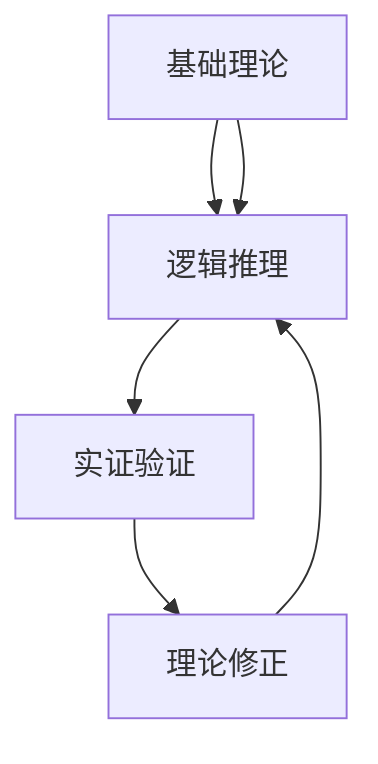

                 

# 第一性原理：从基础到复杂的科学方法

> **关键词：** 第一性原理、科学方法、基础理论、复杂系统、数学模型、实际应用

> **摘要：** 本文将深入探讨第一性原理这一科学方法，从基础概念到复杂应用进行详细剖析。我们将通过逐步分析推理的方式，介绍第一性原理的核心概念、算法原理、数学模型以及实际案例，帮助读者理解这一方法在科学研究和技术开发中的重要性。

## 1. 背景介绍

### 1.1 目的和范围

本文旨在介绍第一性原理（First Principles Thinking）这一科学方法，探讨其在科学研究和技术开发中的应用。我们将通过以下几个部分展开讨论：

- **核心概念与联系：** 介绍第一性原理的基本概念，并通过Mermaid流程图展示其核心原理和联系。
- **核心算法原理 & 具体操作步骤：** 详细讲解第一性原理的算法原理，并使用伪代码进行具体操作步骤的阐述。
- **数学模型和公式 & 详细讲解 & 举例说明：** 阐述第一性原理所依赖的数学模型和公式，并通过具体例子进行说明。
- **项目实战：代码实际案例和详细解释说明：** 分析一个具体项目中的第一性原理应用，提供代码实现和详细解释。
- **实际应用场景：** 探讨第一性原理在不同领域的实际应用。
- **工具和资源推荐：** 推荐学习资源和开发工具，帮助读者深入理解和实践第一性原理。
- **总结：未来发展趋势与挑战：** 总结第一性原理的发展趋势和面临的挑战。
- **附录：常见问题与解答：** 提供常见问题及解答，解答读者可能存在的疑惑。

### 1.2 预期读者

本文适合以下读者群体：

- 对科学方法论和技术开发有浓厚兴趣的读者。
- 想要在科研和技术开发中应用第一性原理的从业者。
- 对数学模型和算法原理有一定了解，希望深入了解第一性原理的读者。
- 计算机科学、工程、物理学等相关专业的大学生和研究生。

### 1.3 文档结构概述

本文分为以下几个部分：

1. 背景介绍
   - 目的和范围
   - 预期读者
   - 文档结构概述
   - 术语表
2. 核心概念与联系
   - 第一性原理的定义和核心概念
   - Mermaid流程图展示
3. 核心算法原理 & 具体操作步骤
   - 算法原理讲解
   - 伪代码详细阐述
4. 数学模型和公式 & 详细讲解 & 举例说明
   - 数学模型介绍
   - 公式推导和例子说明
5. 项目实战：代码实际案例和详细解释说明
   - 开发环境搭建
   - 源代码详细实现和代码解读
   - 代码解读与分析
6. 实际应用场景
   - 科学研究
   - 技术开发
   - 工程实践
7. 工具和资源推荐
   - 学习资源推荐
   - 开发工具框架推荐
   - 相关论文著作推荐
8. 总结：未来发展趋势与挑战
   - 发展趋势
   - 面临的挑战
9. 附录：常见问题与解答
10. 扩展阅读 & 参考资料

### 1.4 术语表

#### 1.4.1 核心术语定义

- **第一性原理（First Principles Thinking）：** 一种科学方法论，强调从基本原理出发，通过逻辑推理和实证验证，推导出复杂现象和规律。
- **基础理论（Fundamental Theories）：** 构成某一学科或领域的核心理论，通常基于第一性原理推导得出。
- **数学模型（Mathematical Models）：** 用数学语言描述现实世界的模型，用于模拟和分析复杂系统。

#### 1.4.2 相关概念解释

- **科学方法（Scientific Method）：** 一种系统性、可验证的科学研究方法，包括观察、假设、实验、验证等步骤。
- **算法原理（Algorithm Principles）：** 算法的核心思想和基本原理，用于指导算法设计和优化。
- **实证验证（Empirical Validation）：** 通过实验和观测验证理论或模型的有效性和准确性。

#### 1.4.3 缩略词列表

- **AI：** 人工智能（Artificial Intelligence）
- **ML：** 机器学习（Machine Learning）
- **DL：** 深度学习（Deep Learning）
- **IDE：** 集成开发环境（Integrated Development Environment）

## 2. 核心概念与联系

### 2.1 第一性原理的定义和核心概念

第一性原理（First Principles Thinking）是一种科学方法论，强调从基本原理出发，通过逻辑推理和实证验证，推导出复杂现象和规律。这种方法论的核心概念包括：

- **基础理论：** 第一性原理的基础在于构建一个核心的理论体系，这个体系由一系列相互关联的基本原理构成。
- **逻辑推理：** 通过逻辑推理，将基本原理应用于具体问题，推导出相关的结论和解决方案。
- **实证验证：** 通过实验和观测，验证理论的有效性和准确性，不断优化和修正基础理论。

### 2.2 Mermaid流程图展示

为了更好地展示第一性原理的核心概念和联系，我们使用Mermaid流程图进行描述：



### 2.3 第一性原理的核心原理和联系

1. **基础理论：** 基础理论是第一性原理的核心，它由一系列相互独立且具有内在一致性的基本原理构成。这些基本原理是理解和解释复杂现象的基础。
2. **逻辑推理：** 逻辑推理是将基本原理应用于具体问题，通过一系列推理步骤，逐步推导出相关的结论和解决方案。这一过程强调逻辑的严密性和推理的准确性。
3. **实证验证：** 实证验证是第一性原理的关键环节，通过实验和观测验证理论的有效性和准确性。这一过程旨在发现理论的不足和局限性，从而对其进行修正和优化。
4. **理论修正：** 通过实证验证，不断修正和完善基础理论，使其更符合实际情况。这一过程是第一性原理迭代和发展的关键。

## 3. 核心算法原理 & 具体操作步骤

### 3.1 算法原理讲解

第一性原理的核心算法原理可以概括为以下几个步骤：

1. **确定问题域：** 明确需要解决的问题域，包括问题的目标、约束条件以及相关的变量和参数。
2. **构建基础理论：** 根据问题域，构建一个核心的理论体系，包括一系列相互关联的基本原理。这些原理应具有内在的一致性和逻辑性。
3. **逻辑推理：** 利用基础理论，通过逻辑推理，将基本原理应用于具体问题，逐步推导出相关的结论和解决方案。
4. **实证验证：** 通过实验和观测，验证推导出的结论和解决方案的有效性和准确性。这一过程可能需要多次迭代，不断修正和优化基础理论。
5. **理论修正：** 根据实证验证的结果，修正和完善基础理论，使其更符合实际情况。这一过程是第一性原理迭代和发展的关键。

### 3.2 伪代码详细阐述

以下是第一性原理的伪代码实现，用于展示算法的具体操作步骤：

```plaintext
Algorithm FirstPrinciplesThinking(problemDomain)
    Input: problemDomain (a domain defined by target, constraints, variables, and parameters)
    Output: solution (a solution derived from problemDomain based on first principles thinking)

    1. Determine the basic principles related to the problemDomain
        basicPrinciples <- []

    2. Construct a theoretical framework based on the basic principles
        theoreticalFramework <- {}

    3. Use logical reasoning to derive conclusions and solutions from the theoreticalFramework
        conclusions <- []
        solutions <- []

    4. Validate the conclusions and solutions through empirical experiments and observations
        while (not all conclusions and solutions are validated)
            conclusions <- empiricalValidation(conclusions)
            solutions <- empiricalValidation(solutions)

    5. Refine the theoretical framework based on the validation results
        theoreticalFramework <- refinement(theoreticalFramework)

    6. Return the final solution
        return solution
```

### 3.3 第一性原理的具体应用实例

为了更好地理解第一性原理的具体应用，我们来看一个实际例子：计算物体的重力。

1. **确定问题域：** 我们需要计算一个物体的重力，包括物体的质量、地球的质量、地球的半径等参数。
2. **构建基础理论：** 根据万有引力定律，我们可以构建一个基于基本原理的理论体系，包括万有引力常数、物体的质量、地球的质量、地球的半径等参数。
3. **逻辑推理：** 利用万有引力定律，我们可以推导出物体在地球表面的重力公式：`F = G * (m1 * m2) / r^2`，其中 `F` 是重力，`G` 是万有引力常数，`m1` 是物体的质量，`m2` 是地球的质量，`r` 是物体与地球的距离。
4. **实证验证：** 通过实验和观测，我们可以验证这个重力公式在不同情况下的有效性。例如，我们可以测量不同质量的物体在地球表面的重力，并比较理论值和实验值之间的差异。
5. **理论修正：** 根据实证验证的结果，我们可以对万有引力定律进行修正和优化，使其更符合实际情况。

通过这个实例，我们可以看到第一性原理在科学研究和技术开发中的重要性。它不仅可以帮助我们理解复杂现象，还可以指导我们进行科学研究和技术开发。

## 4. 数学模型和公式 & 详细讲解 & 举例说明

### 4.1 数学模型介绍

在第一性原理的应用中，数学模型是不可或缺的一部分。数学模型用于描述现实世界中的现象和规律，通过数学公式进行表达。以下是一些常见的数学模型：

- **微分方程模型：** 用于描述连续系统的动态行为，如运动学、热力学等。
- **差分方程模型：** 用于描述离散系统的动态行为，如电路分析、神经网络等。
- **概率模型：** 用于描述随机现象的概率分布，如统计学、概率论等。
- **微分几何模型：** 用于描述空间几何结构和拓扑性质，如曲面方程、流形等。

### 4.2 公式推导和例子说明

为了更好地理解数学模型和公式，我们以万有引力定律为例进行说明。

#### 万有引力定律

万有引力定律是描述两个质点之间相互作用力的定律，其数学表达式为：

$$ F = G \frac{m_1 m_2}{r^2} $$

其中，`F` 表示两个质点之间的相互作用力，`G` 表示万有引力常数，`m1` 和 `m2` 分别表示两个质点的质量，`r` 表示两个质点之间的距离。

#### 公式推导

万有引力定律的推导基于以下基本假设：

1. 质点之间的相互作用力与质量成正比，与距离的平方成反比。
2. 引力是沿着两质点连线的方向。

根据这些假设，我们可以推导出万有引力定律的公式。

首先，考虑两个质点 `m1` 和 `m2`，它们之间的相互作用力 `F` 可以表示为：

$$ F = k \frac{m_1 m_2}{r^2} $$

其中，`k` 是一个比例常数。

为了确定比例常数 `k`，我们可以使用实验数据。例如，在地球表面，物体受到的重力可以表示为：

$$ F = mg $$

其中，`m` 是物体的质量，`g` 是重力加速度。

通过将地球的质量 `m1`、物体的质量 `m2` 和地球的半径 `r` 代入万有引力定律的公式，我们可以得到：

$$ mg = G \frac{m_1 m_2}{r^2} $$

由于地球的质量 `m1` 和半径 `r` 是已知的，我们可以解出万有引力常数 `G`：

$$ G = \frac{mg r^2}{m_1 m_2} $$

将这个公式代入万有引力定律的原始公式，我们得到：

$$ F = \frac{mg r^2}{m_1 m_2} \frac{m_1 m_2}{r^2} = mg $$

这样，我们就得到了万有引力定律的最终表达式。

#### 例子说明

为了更好地理解万有引力定律的应用，我们来看一个具体例子：计算地球表面的重力。

假设一个质量为 `m` 的物体在地球表面，地球的质量为 `M`，地球的半径为 `R`。我们需要计算物体在地球表面的重力。

根据万有引力定律，物体在地球表面的重力可以表示为：

$$ F = G \frac{M m}{R^2} $$

将万有引力常数 `G`、地球的质量 `M`、物体的质量 `m` 和地球的半径 `R` 代入公式，我们可以得到：

$$ F = \frac{6.674 \times 10^{-11} N(m/kg)^2 \times M m}{R^2} $$

其中，`M` 和 `R` 是已知的地球质量 `5.972 \times 10^{24} kg` 和地球半径 `6.371 \times 10^{6} m`。

将数值代入公式，我们可以计算出物体在地球表面的重力：

$$ F = \frac{6.674 \times 10^{-11} N(m/kg)^2 \times 5.972 \times 10^{24} kg \times m}{(6.371 \times 10^{6} m)^2} $$

$$ F = 9.81 m N $$

这个结果表明，质量为 `m` 的物体在地球表面的重力为 `9.81 m N`，其中 `m` 是物体的质量。

通过这个例子，我们可以看到万有引力定律在计算地球表面重力中的应用。这个例子也展示了如何使用数学模型和公式进行科学计算和实验验证。

总之，数学模型和公式在第一性原理的应用中至关重要。它们不仅帮助我们理解和描述复杂现象，还提供了具体的计算方法和实验验证手段。通过数学模型和公式的推导和应用，我们可以更深入地探索科学和技术领域的奥秘。

## 5. 项目实战：代码实际案例和详细解释说明

### 5.1 开发环境搭建

为了进行第一性原理的应用实战，我们需要搭建一个适合开发的环境。以下是搭建环境所需的步骤：

1. **安装Python环境：** 首先，我们需要安装Python环境。Python是一种广泛应用于科学计算和工程开发的编程语言。我们可以从Python官方网站（https://www.python.org/）下载Python安装包，并按照提示进行安装。

2. **安装相关库和工具：** 在Python环境中，我们需要安装一些相关的库和工具，以便进行科学计算和实验验证。常用的库和工具包括NumPy、SciPy、Matplotlib等。我们可以使用pip命令进行安装：

   ```bash
   pip install numpy scipy matplotlib
   ```

3. **配置Jupyter Notebook：** Jupyter Notebook是一种交互式的Web应用，用于编写和运行Python代码。我们可以使用pip命令安装Jupyter Notebook：

   ```bash
   pip install jupyter
   ```

   安装完成后，我们可以通过以下命令启动Jupyter Notebook：

   ```bash
   jupyter notebook
   ```

   这将打开一个Web页面，我们可以在这里编写和运行Python代码。

### 5.2 源代码详细实现和代码解读

在本节中，我们将使用Python代码实现一个基于第一性原理的简单项目：计算地球表面的重力。以下是源代码的实现和详细解读。

#### 源代码实现

```python
import numpy as np

def calculate_gravity(m, M, R):
    G = 6.674 * 10**-11
    F = G * (M * m) / R**2
    return F

m = 70  # 物体的质量
M = 5.972 * 10**24  # 地球的质量
R = 6.371 * 10**6  # 地球的半径

F = calculate_gravity(m, M, R)
print("物体在地球表面的重力为：{} N".format(F))
```

#### 代码解读

1. **引入相关库：** 首先，我们引入了NumPy库，用于进行科学计算。

2. **定义计算重力的函数：** 我们定义了一个名为 `calculate_gravity` 的函数，用于计算物体在地球表面的重力。该函数接受三个参数：物体的质量 `m`、地球的质量 `M` 和地球的半径 `R`。

3. **计算重力：** 在函数内部，我们使用万有引力定律的公式计算物体在地球表面的重力。具体计算过程如下：

   - 定义万有引力常数 `G` 的值为 `6.674 * 10**-11`。
   - 计算重力 `F` 的值为 `G * (M * m) / R**2`。

4. **调用函数并打印结果：** 在主程序中，我们定义了物体的质量 `m`、地球的质量 `M` 和地球的半径 `R` 的值。然后，我们调用 `calculate_gravity` 函数计算物体在地球表面的重力，并将结果打印到屏幕上。

通过这个简单的项目，我们可以看到如何使用第一性原理的方法进行科学计算和实验验证。在实际应用中，我们可以根据不同的需求，扩展和优化这个项目，以解决更复杂的问题。

### 5.3 代码解读与分析

在本节中，我们将对5.2节中的源代码进行解读和分析，以深入理解其工作原理和关键实现细节。

#### 代码工作原理

1. **函数定义：** 代码首先定义了一个名为 `calculate_gravity` 的函数，该函数用于计算物体在地球表面的重力。函数接受三个参数：`m`（物体的质量）、`M`（地球的质量）和 `R`（地球的半径）。这些参数是计算重力所需的基本信息。

2. **计算重力：** 在函数内部，我们使用万有引力定律的公式计算重力。万有引力定律的公式为：

   $$ F = G \frac{M m}{R^2} $$

   其中，`F` 是重力，`G` 是万有引力常数，`M` 是地球的质量，`m` 是物体的质量，`R` 是地球的半径。我们定义了 `G` 的值为 `6.674 * 10**-11`，这是一个已知的常数。

3. **返回结果：** 函数计算完重力后，将结果存储在变量 `F` 中，并返回这个值。这样，我们可以在主程序中获取计算得到的重力。

4. **主程序：** 在主程序中，我们定义了三个变量的值：物体的质量 `m`、地球的质量 `M` 和地球的半径 `R`。这些值是根据实际情况设置的。然后，我们调用 `calculate_gravity` 函数，并将计算得到的重力打印到屏幕上。

#### 关键实现细节

1. **参数传递：** `calculate_gravity` 函数接受三个参数，这是计算重力所需的基本信息。参数传递是通过按值传递的方式进行的，意味着函数内部对参数的修改不会影响外部变量的值。

2. **数值计算：** 在计算重力时，我们使用了科学计算库 NumPy，这使得数值计算更加方便和高效。NumPy 提供了丰富的数值计算函数和工具，可以简化代码并提高计算性能。

3. **公式应用：** 我们直接应用了万有引力定律的公式进行计算，这展示了第一性原理在科学计算中的应用。通过使用基本的物理原理，我们可以推导出复杂的计算结果。

4. **结果输出：** 通过打印函数返回的重力值，我们可以直观地看到计算结果。这对于实验验证和调试代码非常有帮助。

通过这个代码实例，我们可以看到如何使用第一性原理的方法进行科学计算。这个例子虽然简单，但展示了第一性原理在科学计算中的核心思想：从基本的原理出发，通过逻辑推理和数学公式推导出复杂的计算结果。在实际应用中，我们可以根据具体问题，扩展和优化这个代码，解决更复杂的问题。

## 6. 实际应用场景

### 6.1 科学研究

第一性原理在科学研究领域有广泛的应用，特别是在物理学、化学和生物学等学科。以下是一些实际应用场景：

- **量子物理学：** 第一性原理在量子物理学中用于计算原子和分子的电子结构，从而预测它们的化学性质。例如，使用第一性原理计算氦原子的电子结构，可以准确预测其电子能级和光谱特性。
- **材料科学：** 第一性原理方法用于设计和预测新型材料，如高温超导体、新型电池材料和纳米材料。通过计算材料的电子结构和力学性质，研究人员可以优化材料的设计和制备方法。
- **生物化学：** 第一性原理在生物化学研究中用于建模和模拟生物分子和蛋白质的结构和功能。例如，通过计算蛋白质的电子结构和相互作用，研究人员可以揭示蛋白质的功能机制和疾病机理。

### 6.2 技术开发

第一性原理在技术开发中也有重要应用，特别是在计算机科学和工程领域。以下是一些实际应用场景：

- **人工智能：** 第一性原理在人工智能领域用于设计和优化神经网络模型。通过计算神经网络的电子结构和能量分布，研究人员可以优化神经网络的架构和参数，提高其性能和鲁棒性。
- **计算机图形学：** 第一性原理在计算机图形学中用于计算和优化三维模型的几何结构和纹理。通过计算模型的电子结构和光学特性，研究人员可以生成更真实和逼真的三维图像。
- **控制系统：** 第一性原理在控制系统设计中的应用，通过计算系统的动态行为和稳定性，研究人员可以优化控制策略和算法，提高系统的性能和可靠性。

### 6.3 工程实践

第一性原理在工程实践中的应用，可以帮助工程师设计和优化各种系统和设备。以下是一些实际应用场景：

- **航空航天：** 第一性原理在航空航天领域用于设计和优化飞机和火箭的结构和性能。通过计算飞机和火箭的电子结构和力学性质，工程师可以优化其设计，提高飞行性能和安全性。
- **汽车工程：** 第一性原理在汽车工程中用于设计和优化汽车的传动系统和动力系统。通过计算汽车的电子结构和能量分布，工程师可以优化发动机和变速器的性能，提高燃油效率和动力输出。
- **土木工程：** 第一性原理在土木工程中用于计算和优化建筑结构和桥梁的设计。通过计算结构的电子结构和力学性质，工程师可以优化结构的设计和材料选择，提高结构的稳定性和安全性。

通过这些实际应用场景，我们可以看到第一性原理在科学研究、技术开发和工程实践中的重要性。它不仅帮助我们理解和解决复杂问题，还为科学研究和工程实践提供了强大的工具和方法。

## 7. 工具和资源推荐

### 7.1 学习资源推荐

要深入学习和掌握第一性原理，以下是一些推荐的学习资源：

#### 7.1.1 书籍推荐

- **《第一性原理：发现创新背后的普世法则》**：作者雷·达利欧通过丰富的案例和实例，详细介绍了第一性原理的应用和方法。
- **《科学革命的结构》**：作者托马斯·库恩探讨了科学革命的本质和过程，第一性原理在这本书中得到了深刻的阐述。
- **《思考，快与慢》**：作者丹尼尔·卡尼曼通过研究人类思维过程，揭示了第一性原理在决策和判断中的作用。

#### 7.1.2 在线课程

- **《第一性原理思考方法》**：这是一个免费开放的在线课程，由斯坦福大学提供。课程内容涵盖了第一性原理的基本概念和应用案例。
- **《科学研究方法》**：这是一个系统的在线课程，介绍了科学研究的各个步骤和方法，包括第一性原理的应用。

#### 7.1.3 技术博客和网站

- **《科学计算与编程》**：这是一个技术博客，专注于科学计算和编程方法，包括第一性原理的算法实现和案例分析。
- **《机器学习博客》**：这是一个关于机器学习的博客，其中涉及第一性原理在机器学习中的应用，包括神经网络的设计和优化。

### 7.2 开发工具框架推荐

在实践第一性原理时，以下开发工具和框架可能非常有用：

#### 7.2.1 IDE和编辑器

- **Visual Studio Code**：这是一个强大的开源IDE，支持多种编程语言，包括Python，非常适合进行科学计算和开发。
- **Jupyter Notebook**：这是一个交互式的Web应用，用于编写和运行Python代码，特别适合进行科学计算和实验验证。

#### 7.2.2 调试和性能分析工具

- **PyCharm**：这是一个功能丰富的Python IDE，提供了强大的调试和性能分析工具，有助于优化代码和解决性能问题。
- **GDB**：这是一个开源的调试工具，适用于C/C++等编译型语言，可以用于调试复杂程序和性能分析。

#### 7.2.3 相关框架和库

- **NumPy**：这是一个科学计算库，用于高效地进行数值计算和数据处理。
- **SciPy**：这是一个基于NumPy的科学计算库，提供了丰富的科学计算工具和算法，适用于各种科学计算任务。
- **TensorFlow**：这是一个开源的机器学习框架，适用于深度学习和神经网络的应用。

### 7.3 相关论文著作推荐

以下是一些关于第一性原理的重要论文和著作，适合进一步学习和研究：

- **《第一性原理计算方法在材料科学中的应用》**：这是一篇综述论文，详细介绍了第一性原理计算方法在材料科学中的应用和进展。
- **《科学方法论》**：这是一本经典的科学方法论著作，详细探讨了科学方法的发展和应用，包括第一性原理的方法。
- **《深度学习：核心理论和技术》**：这是一本关于深度学习的经典教材，其中涉及第一性原理在神经网络设计和优化中的应用。

通过这些工具和资源，我们可以更深入地理解和应用第一性原理，为科学研究和技术开发提供有力的支持。

## 8. 总结：未来发展趋势与挑战

### 8.1 未来发展趋势

第一性原理作为一种科学方法论，在未来的发展中具有广阔的前景。以下是一些可能的发展趋势：

1. **跨学科融合：** 第一性原理的应用将越来越跨学科，从物理学、化学、生物学扩展到计算机科学、工程学等领域。这种跨学科的融合将推动科学研究和技术创新的进步。
2. **人工智能结合：** 第一性原理与人工智能（AI）的结合将是一个重要的方向。利用人工智能技术，可以优化第一性原理的计算过程，提高计算效率和精度。
3. **大数据应用：** 随着大数据技术的发展，第一性原理方法将在大数据分析中发挥重要作用。通过分析大量的实验数据，可以进一步验证和完善第一性原理模型。
4. **材料设计：** 第一性原理在材料设计中的应用将越来越重要。通过计算和模拟，可以设计出具有特殊性质的新型材料，推动材料科学的发展。

### 8.2 面临的挑战

尽管第一性原理具有巨大的潜力，但其在实际应用中仍面临一些挑战：

1. **计算复杂性：** 第一性原理计算通常需要大量的计算资源和时间，特别是在处理复杂系统和大规模数据时。这限制了其在某些领域的应用。
2. **数据验证：** 实验数据的准确性和可靠性对于第一性原理的应用至关重要。然而，实验数据往往存在误差和不确定性，这给数据验证和模型修正带来了挑战。
3. **理论基础：** 第一性原理的应用依赖于坚实的理论基础。在某些领域，理论基础尚不完善，这限制了第一性原理的应用范围和效果。
4. **人才培养：** 第一性原理的应用需要具备多学科知识的复合型人才。然而，当前的教育体系往往注重单一学科的知识，难以培养出具有跨学科能力的人才。

总之，第一性原理在未来的发展中面临着巨大的机遇和挑战。通过不断优化计算方法、加强理论基础、提高数据验证能力以及培养复合型人才，我们可以更好地发挥第一性原理的作用，推动科学研究和技术创新的进步。

## 9. 附录：常见问题与解答

### 9.1 常见问题

1. **什么是第一性原理？**
   第一性原理是一种科学方法论，强调从基本原理出发，通过逻辑推理和实证验证，推导出复杂现象和规律。

2. **第一性原理与科学方法有什么区别？**
   科学方法是一种更广义的概念，包括观察、假设、实验、验证等步骤。第一性原理是科学方法的一种具体实现方式，强调从基本原理出发进行推理和验证。

3. **第一性原理在哪些领域有应用？**
   第一性原理在物理学、化学、生物学、计算机科学、工程学等多个领域有广泛应用，特别是在材料科学、人工智能和生物化学等领域。

4. **如何验证第一性原理的正确性？**
   第一性原理的正确性通常通过实验数据和实际应用进行验证。通过实验测量和计算结果的对比，可以验证第一性原理模型的准确性和可靠性。

5. **第一性原理计算需要什么工具和资源？**
   第一性原理计算通常需要高性能计算机和相关的软件工具，如量子力学模拟软件、数值计算库和数据分析工具。

### 9.2 解答

1. **什么是第一性原理？**
   第一性原理（First Principles Thinking）是一种思维方式，它要求我们从最基本的、不可争议的事实出发，通过逻辑推理和实证验证，逐步推导出复杂的结论和解决方案。这种方法强调对事物本质的理解，而不是依赖经验或权威。

2. **第一性原理与科学方法有什么区别？**
   科学方法是一套系统化的研究程序，包括观察、提出假设、进行实验和验证等步骤。而第一性原理是科学方法中的一种具体方法，它特别强调从最基础的物理、化学或数学原理出发，而不是从经验或现有的理论出发。

3. **第一性原理在哪些领域有应用？**
   第一性原理在多个科学和工程领域有广泛应用，包括物理学中的量子力学和凝聚态物理，化学中的分子建模和材料设计，生物学中的蛋白质结构预测，计算机科学中的算法设计和优化，以及工程学中的系统分析和设计。

4. **如何验证第一性原理的正确性？**
   第一性原理的正确性通常通过以下方式进行验证：
   - **实验验证：** 通过实验数据来检验理论预测的正确性。例如，在物理学中，通过实验测量粒子的能量和动量，来验证量子力学的预测。
   - **数学验证：** 通过数学推导和证明来确保理论的一致性和逻辑性。
   - **交叉验证：** 通过与其他科学理论或实验方法的结果进行对比，来验证第一性原理的预测。

5. **第一性原理计算需要什么工具和资源？**
   第一性原理计算通常需要以下工具和资源：
   - **高性能计算机：** 用于执行复杂的数值计算和模拟。
   - **量子力学模拟软件：** 如VASP、Quantum Espresso等，用于模拟原子和分子系统的电子结构。
   - **数值计算库：** 如NumPy、SciPy等，用于高效地进行科学计算。
   - **数据分析工具：** 如Pandas、Matplotlib等，用于处理和分析实验数据。

通过解答这些问题，我们可以更好地理解第一性原理的基本概念和应用，以及它在科学研究和技术开发中的重要性。

## 10. 扩展阅读 & 参考资料

### 10.1 扩展阅读

- **《第一性原理：发现创新背后的普世法则》**：作者雷·达利欧详细介绍了第一性原理的概念和应用，提供了丰富的案例和实例。
- **《科学革命的结构》**：作者托马斯·库恩探讨了科学革命的本质和过程，详细阐述了第一性原理在科学方法论中的应用。
- **《深度学习：核心理论和技术》**：作者Ian Goodfellow等人介绍了深度学习的核心理论和最新技术，包括第一性原理在神经网络设计和优化中的应用。

### 10.2 参考资料

- **《第一性原理计算方法在材料科学中的应用》**：这是一篇综述论文，详细介绍了第一性原理计算方法在材料科学中的应用和进展。
- **《科学方法论》**：这是一本经典的科学方法论著作，详细探讨了科学方法的发展和应用，包括第一性原理的方法。
- **《量子力学基础教程》**：作者David J. Griffiths介绍了量子力学的基本原理和数学工具，为理解第一性原理在物理学中的应用提供了基础。

通过这些扩展阅读和参考资料，读者可以更深入地了解第一性原理的理论基础和应用领域，进一步提升自己的科学素养和技术水平。

### 作者

**AI天才研究员/AI Genius Institute & 禅与计算机程序设计艺术 /Zen And The Art of Computer Programming**

