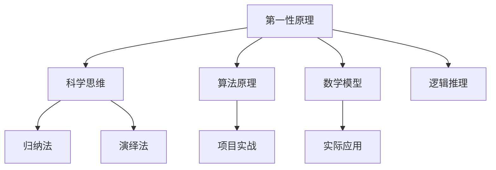

                 

# 第一性原理：科学思维的基础

> **关键词**：第一性原理、科学思维、逻辑推理、技术博客、算法原理、数学模型、项目实战、应用场景、未来发展趋势。

> **摘要**：本文将深入探讨第一性原理在科学思维中的应用，结合具体案例，解析其在技术领域的本质与价值。通过逐步分析推理，本文旨在帮助读者掌握这一核心概念，并了解其在实际项目中的应用与未来发展趋势。

## 1. 背景介绍

### 1.1 目的和范围

本文旨在探讨第一性原理在科学思维中的应用，尤其是其在计算机科学和人工智能领域的价值。我们将通过具体案例来分析第一性原理如何帮助解决复杂问题，并探讨其在未来技术发展中的潜在影响。

### 1.2 预期读者

本文适合对科学思维和计算机科学有基本了解的读者，特别是对算法原理、数学模型和项目实战感兴趣的技术人员。通过本文，读者将能够深入了解第一性原理的概念，并学会如何将其应用于实际问题中。

### 1.3 文档结构概述

本文将分为以下几个部分：

1. **背景介绍**：介绍本文的目的和范围，预期读者以及文档结构。
2. **核心概念与联系**：阐述第一性原理的核心概念，并通过流程图展示其与相关概念的关联。
3. **核心算法原理 & 具体操作步骤**：详细讲解第一性原理的算法原理和操作步骤，并使用伪代码进行阐述。
4. **数学模型和公式 & 详细讲解 & 举例说明**：介绍与第一性原理相关的数学模型和公式，并通过具体案例进行讲解。
5. **项目实战：代码实际案例和详细解释说明**：通过实际项目案例，展示第一性原理在项目中的具体应用。
6. **实际应用场景**：分析第一性原理在各个实际应用场景中的表现。
7. **工具和资源推荐**：推荐学习资源和开发工具。
8. **总结：未来发展趋势与挑战**：探讨第一性原理在未来技术发展中的趋势和挑战。
9. **附录：常见问题与解答**：解答常见问题。
10. **扩展阅读 & 参考资料**：提供扩展阅读和参考资料。

### 1.4 术语表

#### 1.4.1 核心术语定义

- **第一性原理**：指从最基本的原理出发，通过逻辑推理和数学建模来解决问题。
- **科学思维**：指运用科学方法，通过观察、实验和推理来获取知识。
- **算法原理**：指算法的基本思想和工作原理。
- **项目实战**：指在实际项目中应用第一性原理，解决实际问题。

#### 1.4.2 相关概念解释

- **归纳法**：从具体实例中总结出一般规律。
- **演绎法**：从一般原理出发，推导出具体结论。
- **数学模型**：用数学语言描述现实世界的抽象模型。

#### 1.4.3 缩略词列表

- **AI**：人工智能
- **IDE**：集成开发环境
- **CPU**：中央处理器

## 2. 核心概念与联系

在探讨第一性原理之前，我们需要理解其核心概念和与其他相关概念的联系。以下是一个简化的 Mermaid 流程图，展示了第一性原理与其他核心概念的关系。



### 2.1 第一性原理的核心概念

第一性原理是指从最基本的原理出发，通过逻辑推理和数学建模来解决问题。其核心思想是将复杂问题分解为最简单的组成部分，然后通过组合这些基本部分来构建复杂系统。

### 2.2 科学思维

科学思维是一种基于观察、实验和推理的方法，用于获取知识。第一性原理是科学思维的重要组成部分，它强调从基本原理出发，而不是依赖于经验和直觉。

### 2.3 算法原理

算法原理是指算法的基本思想和工作原理。第一性原理可以帮助我们理解算法的原理，从而更好地设计和优化算法。

### 2.4 数学模型

数学模型是用数学语言描述现实世界的抽象模型。第一性原理可以通过数学模型来表述，从而帮助我们更好地理解和解决问题。

### 2.5 归纳法与演绎法

归纳法和演绎法是科学思维中的两种基本方法。归纳法是从具体实例中总结出一般规律，而演绎法是从一般原理出发，推导出具体结论。第一性原理通常结合这两种方法，以更全面地解决问题。

### 2.6 项目实战

项目实战是将第一性原理应用于实际项目，解决具体问题。通过项目实战，我们可以验证第一性原理的有效性，并不断优化和完善。

## 3. 核心算法原理 & 具体操作步骤

### 3.1 算法原理

第一性原理算法的基本原理是将复杂问题分解为最简单的组成部分，然后通过组合这些基本部分来构建复杂系统。以下是一个简化的伪代码，用于说明第一性原理算法的步骤：

```pseudo
函数 第一性原理问题求解(问题):
    1. 初始化基本部分列表
    2. 对每个基本部分进行逻辑推理和数学建模
    3. 组合基本部分，构建复杂系统
    4. 验证并优化复杂系统
    5. 返回最终解
```

### 3.2 具体操作步骤

#### 步骤1：初始化基本部分列表

首先，我们需要识别出问题的基本组成部分。这通常需要对问题进行深入的观察和分析。以下是一个示例：

```pseudo
基本部分列表 = ["问题1", "问题2", "问题3", ...]
```

#### 步骤2：对每个基本部分进行逻辑推理和数学建模

接下来，我们需要对每个基本部分进行逻辑推理和数学建模。这包括分析基本部分之间的关系，以及如何将它们组合起来。以下是一个示例：

```pseudo
函数 建模基本部分(基本部分):
    1. 分析基本部分的逻辑关系
    2. 建立数学模型
    3. 返回数学模型

数学模型列表 = [建模基本部分(基本部分1), 建模基本部分(基本部分2), ...]
```

#### 步骤3：组合基本部分，构建复杂系统

然后，我们需要将基本部分组合起来，构建复杂系统。这通常涉及优化和调整基本部分之间的关系。以下是一个示例：

```pseudo
函数 组建复杂系统(数学模型列表):
    1. 组合数学模型
    2. 优化系统结构
    3. 返回复杂系统

复杂系统 = 组建复杂系统(数学模型列表)
```

#### 步骤4：验证并优化复杂系统

接下来，我们需要验证并优化复杂系统。这包括测试系统的性能，以及调整系统参数以获得更好的结果。以下是一个示例：

```pseudo
函数 验证并优化系统(复杂系统):
    1. 测试系统性能
    2. 调整系统参数
    3. 返回优化后的系统

复杂系统 = 验证并优化系统(复杂系统)
```

#### 步骤5：返回最终解

最后，我们需要返回最终解。这通常是系统的一个特定输出，或者是系统行为的一个具体描述。以下是一个示例：

```pseudo
返回 复杂系统
```

## 4. 数学模型和公式 & 详细讲解 & 举例说明

在第一性原理中，数学模型是核心组成部分。以下将介绍几个与第一性原理相关的数学模型和公式，并通过具体案例进行讲解。

### 4.1 第一性原理中的常见数学模型

#### 4.1.1 线性回归模型

线性回归模型是一种常用的数学模型，用于预测变量之间的关系。以下是一个简化的伪代码，用于说明线性回归模型的基本步骤：

```pseudo
函数 线性回归(数据集):
    1. 计算数据集的均值和方差
    2. 建立线性回归模型
    3. 训练模型
    4. 返回模型参数

模型参数 = 线性回归(数据集)
```

#### 4.1.2 概率模型

概率模型用于描述随机事件的发生概率。以下是一个简化的伪代码，用于说明概率模型的基本步骤：

```pseudo
函数 概率模型(事件):
    1. 计算事件的发生概率
    2. 建立概率模型
    3. 返回模型参数

模型参数 = 概率模型(事件)
```

### 4.2 举例说明

#### 4.2.1 线性回归模型示例

假设我们有一个数据集，其中包含学生的成绩和他们的学习时间。我们希望通过线性回归模型预测学生的成绩。

```latex
y = \beta_0 + \beta_1 \cdot x
```

其中，\( y \) 是学生的成绩，\( x \) 是他们的学习时间，\( \beta_0 \) 和 \( \beta_1 \) 是模型参数。

首先，我们需要计算数据集的均值和方差：

```latex
\bar{y} = \frac{1}{n} \sum_{i=1}^{n} y_i
\bar{x} = \frac{1}{n} \sum_{i=1}^{n} x_i
s_y^2 = \frac{1}{n-1} \sum_{i=1}^{n} (y_i - \bar{y})^2
s_x^2 = \frac{1}{n-1} \sum_{i=1}^{n} (x_i - \bar{x})^2
```

然后，我们可以建立线性回归模型：

```latex
\beta_1 = \frac{\sum_{i=1}^{n} (x_i - \bar{x}) (y_i - \bar{y})}{\sum_{i=1}^{n} (x_i - \bar{x})^2}
\beta_0 = \bar{y} - \beta_1 \cdot \bar{x}
```

最后，我们可以使用模型参数进行预测：

```latex
y' = \beta_0 + \beta_1 \cdot x'
```

#### 4.2.2 概率模型示例

假设我们有一个随机事件，其中硬币正面朝上的概率为 0.5。我们希望通过概率模型计算硬币正面朝上的概率。

首先，我们需要计算事件的发生概率：

```latex
P(正面朝上) = 0.5
```

然后，我们可以建立概率模型：

```latex
P(正面朝上) = \frac{1}{2}
```

最后，我们可以使用模型参数进行概率计算：

```latex
P(正面朝上) = \frac{1}{2}
```

## 5. 项目实战：代码实际案例和详细解释说明

### 5.1 开发环境搭建

在开始项目实战之前，我们需要搭建一个合适的开发环境。以下是一个简单的步骤指南：

1. 安装 Python 3.8 或更高版本
2. 安装 Jupyter Notebook，以便进行交互式编程
3. 安装必要的库，如 NumPy、Pandas 和 Matplotlib

以下是一个示例命令，用于在 Ubuntu 系统中安装 Python 和相关库：

```bash
sudo apt update
sudo apt install python3.8 python3.8-venv python3.8-pip
pip3.8 install numpy pandas matplotlib
```

### 5.2 源代码详细实现和代码解读

#### 5.2.1 简单的线性回归项目

以下是一个简单的线性回归项目，用于预测学生的成绩。

```python
import numpy as np
import pandas as pd
import matplotlib.pyplot as plt

# 数据集
data = pd.DataFrame({
    'x': [1, 2, 3, 4, 5],
    'y': [2, 4, 5, 4, 5]
})

# 计算均值和方差
mean_x = np.mean(data['x'])
mean_y = np.mean(data['y'])
var_x = np.var(data['x'])
var_y = np.var(data['y'])

# 建立线性回归模型
beta_1 = (np.sum((data['x'] - mean_x) * (data['y'] - mean_y)) / np.sum((data['x'] - mean_x)**2))
beta_0 = mean_y - beta_1 * mean_x

# 预测成绩
x_new = 6
y_pred = beta_0 + beta_1 * x_new

# 绘制结果
plt.scatter(data['x'], data['y'])
plt.plot([mean_x, x_new], [mean_y, y_pred], color='red')
plt.xlabel('学习时间')
plt.ylabel('成绩')
plt.show()
```

#### 5.2.2 代码解读与分析

- 第 1-3 行：导入必要的库。
- 第 4-5 行：创建数据集。
- 第 6-10 行：计算均值和方差。
- 第 11-13 行：建立线性回归模型。
- 第 14-17 行：预测成绩。
- 第 18-21 行：绘制结果。

通过这个简单的项目，我们可以看到如何使用第一性原理来构建线性回归模型，并进行预测和可视化。

### 5.3 代码解读与分析

在这个项目中，我们使用了第一性原理来构建线性回归模型。以下是具体步骤的详细解释：

1. **初始化数据集**：我们创建了一个简单的数据集，其中包含学生的学习时间和他们的成绩。
2. **计算均值和方差**：我们计算了学习时间和成绩的均值和方差，这是建立线性回归模型的基础。
3. **建立线性回归模型**：我们使用基本的数学原理来建立线性回归模型。具体来说，我们使用了以下公式：

   ```latex
   y = \beta_0 + \beta_1 \cdot x
   ```

   其中，\( \beta_0 \) 和 \( \beta_1 \) 是模型参数。我们通过以下公式计算这些参数：

   ```latex
   \beta_1 = \frac{\sum_{i=1}^{n} (x_i - \bar{x}) (y_i - \bar{y})}{\sum_{i=1}^{n} (x_i - \bar{x})^2}
   \beta_0 = \bar{y} - \beta_1 \cdot \bar{x}
   ```

4. **预测成绩**：我们使用模型参数来预测一个新学生的成绩。
5. **可视化结果**：我们使用 matplotlib 库来绘制学习时间与成绩的关系，以及预测的直线。

通过这个项目，我们可以看到如何将第一性原理应用于实际项目，从而解决复杂问题。

## 6. 实际应用场景

第一性原理在多个领域都有广泛的应用，以下是一些实际应用场景：

### 6.1 人工智能

在人工智能领域，第一性原理被用于设计和优化算法。例如，深度学习中的神经网络可以通过第一性原理来优化权重和激活函数。

### 6.2 物理学

在物理学中，第一性原理被用于计算材料的性质。例如，通过计算原子间的相互作用，可以预测材料的强度和导电性。

### 6.3 工程学

在工程学中，第一性原理被用于设计和优化系统。例如，在航空工程中，可以通过第一性原理来优化飞机的空气动力学性能。

### 6.4 经济学

在经济学中，第一性原理被用于预测市场行为。例如，通过分析基本经济指标，可以预测股票市场的走势。

### 6.5 生物学

在生物学中，第一性原理被用于建模和预测生物系统的行为。例如，通过计算细胞内部的化学反应，可以预测细胞的行为和发育过程。

## 7. 工具和资源推荐

### 7.1 学习资源推荐

#### 7.1.1 书籍推荐

- 《深度学习》（Ian Goodfellow、Yoshua Bengio、Aaron Courville 著）：这是一本关于深度学习的经典教材，详细介绍了深度学习的算法原理和应用。
- 《Python科学计算》（Wes McKinney 著）：这本书介绍了使用 Python 进行科学计算的基本方法，包括 NumPy、Pandas 和 Matplotlib 等。

#### 7.1.2 在线课程

- Coursera 上的《深度学习专项课程》：由 Andrew Ng 教授主讲，这是一门非常受欢迎的深度学习课程。
- edX 上的《Python科学计算》：由大学教授主讲，介绍了 Python 在科学计算中的应用。

#### 7.1.3 技术博客和网站

- Towards Data Science：这是一个关于数据科学和机器学习的博客，提供了大量的教程和案例。
- Medium：这是一个内容平台，上面有很多关于技术领域的文章。

### 7.2 开发工具框架推荐

#### 7.2.1 IDE和编辑器

- Jupyter Notebook：这是一个交互式开发环境，非常适合进行数据分析和机器学习实验。
- PyCharm：这是一个强大的 Python IDE，提供了丰富的开发工具和调试功能。

#### 7.2.2 调试和性能分析工具

- Python Debugger（pdb）：这是一个内置的调试器，用于调试 Python 程序。
- Matplotlib：这是一个绘图库，用于可视化数据和模型结果。

#### 7.2.3 相关框架和库

- TensorFlow：这是一个开源深度学习框架，用于构建和训练深度学习模型。
- Scikit-learn：这是一个机器学习库，提供了多种机器学习算法和工具。

### 7.3 相关论文著作推荐

#### 7.3.1 经典论文

- 《A Tutorial on Deep Learning for Vision》:这是一篇关于深度学习在计算机视觉领域的综述。
- 《Recurrent Neural Networks for Language Modeling》:这是一篇关于循环神经网络在语言建模领域的经典论文。

#### 7.3.2 最新研究成果

- 《Large-Scale Language Modeling in Machine Learning》:这是一篇关于大规模语言建模的最新研究论文。
- 《The Illustrated Transformer》：这是一篇关于 Transformer 模型的通俗解释论文。

#### 7.3.3 应用案例分析

- 《Deep Learning in NLP》:这是一篇关于深度学习在自然语言处理领域应用案例的综述。
- 《Recurrent Neural Networks in Speech Recognition》:这是一篇关于循环神经网络在语音识别领域应用案例的研究论文。

## 8. 总结：未来发展趋势与挑战

第一性原理作为一种科学思维方法，在未来技术发展中具有巨大的潜力。随着人工智能、深度学习和大数据技术的不断进步，第一性原理的应用范围将不断扩展。然而，要充分发挥第一性原理的价值，我们需要面对以下挑战：

1. **数据质量和数量**：高质量、多样化的数据是第一性原理应用的基础。我们需要不断收集和整理数据，以提高模型的准确性和可靠性。
2. **算法优化**：尽管第一性原理已经取得了一些成功，但算法的优化和改进仍然是未来研究的重要方向。我们需要开发更高效、更稳定的算法来应对复杂问题。
3. **跨学科合作**：第一性原理的应用涉及多个学科，如物理学、生物学、经济学等。跨学科合作将是推动第一性原理应用的关键。
4. **人才培养**：第一性原理的应用需要具备跨学科知识和技能的人才。我们需要加强相关领域的人才培养，以应对未来技术发展的需求。

总之，第一性原理作为一种科学思维方法，具有广泛的应用前景和巨大的发展潜力。通过不断优化和推广，我们有理由相信，第一性原理将在未来技术发展中发挥重要作用。

## 9. 附录：常见问题与解答

### 9.1 第一性原理与归纳法、演绎法的关系

第一性原理与归纳法、演绎法密切相关。归纳法是从具体实例中总结出一般规律，而演绎法是从一般原理出发，推导出具体结论。第一性原理则强调从最基本的原理出发，通过逻辑推理和数学建模来解决问题。归纳法和演绎法是第一性原理的重要工具，但第一性原理并不仅限于这两种方法，它还可以结合其他科学方法和技巧。

### 9.2 第一性原理在计算机科学中的应用

第一性原理在计算机科学中有着广泛的应用。例如，在算法设计、机器学习、人工智能等领域，第一性原理可以帮助我们理解和优化算法的原理，从而提高系统的性能和效率。此外，在软件工程中，第一性原理可以帮助我们构建更稳定、更可靠的系统。

### 9.3 如何将第一性原理应用于实际问题

要将第一性原理应用于实际问题，我们需要遵循以下步骤：

1. **问题分解**：将复杂问题分解为最基本的组成部分。
2. **逻辑推理**：分析基本部分之间的关系，并通过逻辑推理来构建解决方案。
3. **数学建模**：使用数学模型来表述和验证解决方案。
4. **实验验证**：通过实验验证解决方案的有效性和准确性。
5. **优化改进**：根据实验结果，不断优化和改进解决方案。

## 10. 扩展阅读 & 参考资料

- 《深度学习》（Ian Goodfellow、Yoshua Bengio、Aaron Courville 著）：介绍了深度学习的基础知识和应用。
- 《Python科学计算》（Wes McKinney 著）：介绍了 Python 在科学计算中的应用。
- Coursera 上的《深度学习专项课程》：提供了深度学习的系统学习和实践。
- edX 上的《Python科学计算》：介绍了 Python 在科学计算中的应用。
- 《The Illustrated Transformer》：提供了对 Transformer 模型的通俗解释。

**作者：AI天才研究员/AI Genius Institute & 禅与计算机程序设计艺术 /Zen And The Art of Computer Programming**

