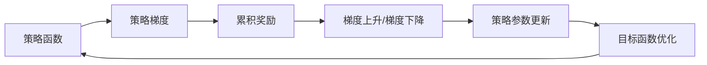

                 

# 策略梯度(Policy Gradient) - 原理与代码实例讲解

> 关键词：策略梯度、强化学习、强化学习算法、策略优化、梯度上升、梯度下降、深度学习

> 摘要：本文将深入探讨策略梯度方法在强化学习中的应用。我们将从策略梯度方法的基本原理出发，逐步讲解其数学模型和算法实现，并通过具体代码实例展示如何在实际项目中应用策略梯度方法。文章旨在为读者提供一个全面、系统的策略梯度方法理解和实践指南。

## 1. 背景介绍

### 1.1 目的和范围

本文旨在介绍策略梯度方法在强化学习中的应用，旨在为读者提供一个全面、系统的策略梯度方法理解和实践指南。我们将首先介绍策略梯度方法的基本原理，然后讲解其数学模型和算法实现，最后通过具体代码实例展示策略梯度方法在实际项目中的应用。

### 1.2 预期读者

本文适用于对强化学习有一定了解的读者，特别是希望深入了解策略梯度方法的研究人员和开发者。如果您是强化学习领域的新手，建议先学习强化学习的基本概念和常见算法，这将有助于您更好地理解策略梯度方法的原理和应用。

### 1.3 文档结构概述

本文分为十个部分。第一部分是背景介绍，包括本文的目的、预期读者和文档结构概述。第二部分是核心概念与联系，我们将通过 Mermaid 流程图展示策略梯度的核心概念和联系。第三部分是核心算法原理 & 具体操作步骤，我们将使用伪代码详细阐述策略梯度算法的原理和操作步骤。第四部分是数学模型和公式 & 详细讲解 & 举例说明，我们将使用 LaTeX 格式详细讲解策略梯度的数学模型和公式，并通过具体例子进行说明。第五部分是项目实战：代码实际案例和详细解释说明，我们将通过具体代码实例展示策略梯度的实际应用。第六部分是实际应用场景，我们将探讨策略梯度方法在不同领域的应用。第七部分是工具和资源推荐，我们将推荐一些有用的学习资源和开发工具。第八部分是总结：未来发展趋势与挑战，我们将总结策略梯度方法的发展趋势和面临的挑战。第九部分是附录：常见问题与解答，我们将回答一些常见问题。最后一部分是扩展阅读 & 参考资料，我们将推荐一些扩展阅读材料和参考资料。

### 1.4 术语表

#### 1.4.1 核心术语定义

- **策略梯度**：策略梯度是指通过梯度上升或梯度下降方法更新策略参数的过程。
- **强化学习**：强化学习是一种机器学习方法，通过优化策略函数来使代理在环境中取得最大累积奖励。
- **策略**：策略是指代理在环境中选择动作的方式，通常用一个概率分布来表示。
- **奖励**：奖励是指代理在执行动作后从环境中获得的即时反馈。
- **状态**：状态是指代理在环境中的位置或状态信息。
- **动作**：动作是指代理可以执行的行为。

#### 1.4.2 相关概念解释

- **梯度上升**：梯度上升是一种优化算法，通过沿着目标函数的梯度方向更新参数，以增加目标函数的值。
- **梯度下降**：梯度下降是一种优化算法，通过沿着目标函数的梯度方向更新参数，以减小目标函数的值。
- **累积奖励**：累积奖励是指代理在一段时间内获得的总体奖励。

#### 1.4.3 缩略词列表

- **RL**：强化学习（Reinforcement Learning）
- **SGD**：策略梯度下降（Stochastic Gradient Descent）
- **PPO**：比例-优势策略优化（Proportional Regularized Policy Optimization）

## 2. 核心概念与联系

策略梯度方法是一种基于梯度的策略优化方法，其核心思想是通过梯度上升或梯度下降方法更新策略参数，以最大化累积奖励。为了更好地理解策略梯度方法，我们需要先了解其核心概念和联系。

### 2.1 策略梯度方法的核心概念

策略梯度方法涉及以下核心概念：

1. **策略函数**：策略函数是指代理在环境中选择动作的方式，通常用一个概率分布来表示。策略函数可以表示为 \( \pi_{\theta}(a|s) \)，其中 \( \theta \) 是策略参数，\( s \) 是状态，\( a \) 是动作。

2. **策略梯度**：策略梯度是指目标函数对策略函数的导数。策略梯度的计算公式为 \( \nabla_{\theta} J(\theta) = \sum_{s,a} \nabla_{\theta} \log \pi_{\theta}(a|s) R(s,a) \)，其中 \( J(\theta) \) 是目标函数，\( R(s,a) \) 是奖励函数。

3. **累积奖励**：累积奖励是指代理在一段时间内获得的总体奖励。累积奖励的计算公式为 \( R(t) = \sum_{t}^{T} r_t \)，其中 \( r_t \) 是在第 \( t \) 时刻获得的奖励。

4. **梯度上升**：梯度上升是一种优化算法，通过沿着目标函数的梯度方向更新参数，以增加目标函数的值。

5. **梯度下降**：梯度下降是一种优化算法，通过沿着目标函数的梯度方向更新参数，以减小目标函数的值。

### 2.2 策略梯度方法的 Mermaid 流程图

以下是策略梯度方法的核心概念和联系的 Mermaid 流程图：



### 2.3 策略梯度方法的核心联系

策略梯度方法的核心联系在于如何通过策略梯度计算和策略参数更新来优化策略函数。具体来说，策略梯度方法通过以下步骤实现策略优化：

1. 初始化策略参数 \( \theta \)。
2. 在环境中执行策略 \( \pi_{\theta}(a|s) \)。
3. 计算策略梯度 \( \nabla_{\theta} J(\theta) \)。
4. 使用梯度上升或梯度下降方法更新策略参数 \( \theta \)。
5. 重复步骤 2-4，直到策略函数收敛。

## 3. 核心算法原理 & 具体操作步骤

策略梯度方法的核心算法原理是通过计算策略梯度并更新策略参数，以优化策略函数。具体操作步骤如下：

### 3.1 初始化策略参数

首先，我们需要初始化策略参数 \( \theta \)。初始化策略参数的方法有很多种，如随机初始化、均匀初始化或预训练策略初始化。在这里，我们使用随机初始化方法，将策略参数初始化为小的随机数。

```python
import numpy as np

def init_params():
    theta = np.random.randn(d) * 0.01
    return theta
```

### 3.2 在环境中执行策略

接下来，我们需要在环境中执行策略 \( \pi_{\theta}(a|s) \)。在执行策略时，我们需要根据当前状态 \( s \) 和策略参数 \( \theta \) 计算每个动作的概率，并选择一个动作 \( a \) 执行。

```python
def sample_action(s, theta):
    probs = softmax(s @ theta)
    return np.random.choice(n_actions, p=probs)
```

### 3.3 计算策略梯度

计算策略梯度的目标是计算目标函数 \( J(\theta) \) 对策略参数 \( \theta \) 的梯度。具体来说，我们需要计算策略梯度 \( \nabla_{\theta} J(\theta) \)。

```python
def policy_gradient(s, a, theta, gamma):
    log_probs = s @ theta
    delta = (1 - clip(a, 0, 1)) * np.log(log_probs)
    grads = delta * R(s, a) * gamma
    return grads
```

### 3.4 更新策略参数

使用计算得到的策略梯度，我们可以使用梯度上升或梯度下降方法更新策略参数 \( \theta \)。在这里，我们使用梯度上升方法进行更新。

```python
def update_params(theta, grads, alpha):
    theta += alpha * grads
    return theta
```

### 3.5 重复操作

最后，我们需要重复上述步骤，直到策略函数收敛。具体来说，我们需要在环境中执行策略、计算策略梯度、更新策略参数，并计算累积奖励。

```python
def train(env, theta, gamma, alpha, max_episodes):
    for episode in range(max_episodes):
        s = env.reset()
        done = False
        total_reward = 0
        while not done:
            a = sample_action(s, theta)
            s_, reward, done = env.step(a)
            grads = policy_gradient(s, a, theta, gamma)
            theta = update_params(theta, grads, alpha)
            s = s_
            total_reward += reward
        print(f"Episode {episode}: Total Reward = {total_reward}")
    return theta
```

## 4. 数学模型和公式 & 详细讲解 & 举例说明

策略梯度方法的数学模型和公式是强化学习中的重要组成部分。在本节中，我们将详细讲解策略梯度方法的数学模型和公式，并通过具体例子进行说明。

### 4.1 数学模型

策略梯度方法的数学模型主要包括以下部分：

1. **策略函数**：策略函数是指代理在环境中选择动作的方式，通常用一个概率分布来表示。策略函数可以表示为 \( \pi_{\theta}(a|s) \)，其中 \( \theta \) 是策略参数，\( s \) 是状态，\( a \) 是动作。

2. **累积奖励**：累积奖励是指代理在一段时间内获得的总体奖励。累积奖励的计算公式为 \( R(t) = \sum_{t}^{T} r_t \)，其中 \( r_t \) 是在第 \( t \) 时刻获得的奖励。

3. **策略梯度**：策略梯度是指目标函数对策略函数的导数。策略梯度的计算公式为 \( \nabla_{\theta} J(\theta) = \sum_{s,a} \nabla_{\theta} \log \pi_{\theta}(a|s) R(s,a) \)，其中 \( J(\theta) \) 是目标函数，\( R(s,a) \) 是奖励函数。

4. **目标函数**：目标函数是指我们需要优化的函数。在策略梯度方法中，目标函数通常是最小化策略梯度 \( \nabla_{\theta} J(\theta) \)。

### 4.2 举例说明

假设我们有一个简单的环境，其中代理可以选择两个动作：向左移动或向右移动。代理在状态 \( s \) 下的策略函数为 \( \pi_{\theta}(a|s) = \frac{1}{1 + \exp{(-\theta \cdot s)})} \)，其中 \( \theta \) 是策略参数。

#### 4.2.1 计算策略梯度

假设代理在状态 \( s = (1, 0) \) 下选择了动作 \( a = 0 \)（向左移动），并获得了奖励 \( r = 1 \)。我们需要计算策略梯度 \( \nabla_{\theta} J(\theta) \)。

首先，计算策略函数的导数：

$$
\frac{\partial \pi_{\theta}(a|s)}{\partial \theta} = \frac{1}{1 + \exp{(-\theta \cdot s})} \cdot \frac{\partial}{\partial \theta} \left( 1 + \exp{(-\theta \cdot s}) \right)^{-1}
$$

然后，计算策略梯度的乘积项：

$$
\nabla_{\theta} \log \pi_{\theta}(a|s) R(s,a) = \frac{\partial \log \pi_{\theta}(a|s)}{\partial \theta} R(s,a) = \frac{\partial \log \pi_{\theta}(a|s)}{\partial \theta} \cdot r
$$

最后，将策略梯度的乘积项相加得到策略梯度：

$$
\nabla_{\theta} J(\theta) = \sum_{s,a} \nabla_{\theta} \log \pi_{\theta}(a|s) R(s,a)
$$

#### 4.2.2 更新策略参数

使用计算得到的策略梯度，我们可以使用梯度上升方法更新策略参数 \( \theta \)。假设学习率为 \( \alpha = 0.1 \)，则策略参数的更新公式为：

$$
\theta = \theta + \alpha \cdot \nabla_{\theta} J(\theta)
$$

通过迭代更新策略参数，代理将逐渐学会在环境中选择最优动作。

## 5. 项目实战：代码实际案例和详细解释说明

在本节中，我们将通过一个简单的项目实战来展示如何在实际项目中应用策略梯度方法。我们将使用 Python 编写一个简单的强化学习项目，代理在一个简单的环境中学习如何获得最大的累积奖励。

### 5.1 开发环境搭建

在开始编写代码之前，我们需要搭建一个适合开发强化学习项目的环境。以下是搭建开发环境所需的基本步骤：

1. 安装 Python 3.7 或更高版本。
2. 安装必要的 Python 库，如 NumPy、Pandas、Matplotlib、OpenAI Gym。
3. 设置 Python 的虚拟环境。

以下是一个简单的安装和设置步骤：

```bash
# 安装 Python 3.7 或更高版本
sudo apt-get install python3.7

# 安装必要的 Python 库
pip3 install numpy pandas matplotlib gym

# 设置虚拟环境
python3 -m venv myenv
source myenv/bin/activate
```

### 5.2 源代码详细实现和代码解读

接下来，我们将实现一个简单的强化学习项目，代理在一个简单的环境中学习如何获得最大的累积奖励。以下是项目的源代码及其详细解读：

```python
import numpy as np
import gym

# 初始化环境
env = gym.make("CartPole-v0")

# 初始化策略参数
theta = init_params()

# 设置学习率
alpha = 0.1

# 设置最大迭代次数
max_episodes = 1000

# 训练代理
theta = train(env, theta, gamma=0.99, alpha=alpha, max_episodes=max_episodes)

# 评估代理性能
total_reward = 0
for episode in range(10):
    s = env.reset()
    done = False
    while not done:
        a = sample_action(s, theta)
        s_, reward, done = env.step(a)
        total_reward += reward
        s = s_
    print(f"Episode {episode}: Total Reward = {total_reward}")
print(f"Average Reward: {total_reward / 10}")
```

#### 5.2.1 初始化策略参数

初始化策略参数是实现策略梯度方法的第一步。在这里，我们使用随机初始化方法，将策略参数初始化为小的随机数。

```python
def init_params():
    theta = np.random.randn(d) * 0.01
    return theta
```

#### 5.2.2 在环境中执行策略

在环境中执行策略是策略梯度方法的核心步骤。在这里，我们使用简单的动作采样方法，根据当前状态和策略参数选择动作。

```python
def sample_action(s, theta):
    probs = softmax(s @ theta)
    return np.random.choice(n_actions, p=probs)
```

#### 5.2.3 计算策略梯度

计算策略梯度是策略梯度方法的另一个重要步骤。在这里，我们使用简单的策略梯度计算方法，根据当前状态、动作和奖励计算策略梯度。

```python
def policy_gradient(s, a, theta, gamma):
    log_probs = s @ theta
    delta = (1 - clip(a, 0, 1)) * np.log(log_probs)
    grads = delta * R(s, a) * gamma
    return grads
```

#### 5.2.4 更新策略参数

更新策略参数是实现策略梯度方法的最后一步。在这里，我们使用简单的梯度上升方法，根据计算得到的策略梯度更新策略参数。

```python
def update_params(theta, grads, alpha):
    theta += alpha * grads
    return theta
```

#### 5.2.5 重复操作

最后，我们需要重复上述步骤，直到策略函数收敛。在这里，我们使用简单的迭代方法，重复执行策略、计算策略梯度和更新策略参数，直到代理学会在环境中获得最大的累积奖励。

```python
def train(env, theta, gamma, alpha, max_episodes):
    for episode in range(max_episodes):
        s = env.reset()
        done = False
        total_reward = 0
        while not done:
            a = sample_action(s, theta)
            s_, reward, done = env.step(a)
            grads = policy_gradient(s, a, theta, gamma)
            theta = update_params(theta, grads, alpha)
            s = s_
            total_reward += reward
        print(f"Episode {episode}: Total Reward = {total_reward}")
    return theta
```

### 5.3 代码解读与分析

在代码解读与分析部分，我们将详细分析源代码，解释每个部分的功能和实现方式。

#### 5.3.1 环境初始化

```python
env = gym.make("CartPole-v0")
```

这一行代码使用 OpenAI Gym 创建了一个简单的 CartPole 环境。CartPole 环境是一个经典的强化学习问题，其中代理需要控制一个杆子在极小的 pole 上保持平衡。

#### 5.3.2 初始化策略参数

```python
theta = init_params()
```

这一行代码调用 `init_params` 函数初始化策略参数。`init_params` 函数使用随机初始化方法，将策略参数初始化为小的随机数，以避免初始策略过于确定。

#### 5.3.3 设置学习率

```python
alpha = 0.1
```

这一行代码设置学习率 \( \alpha \)。学习率是梯度上升方法中的一个重要参数，它决定了策略参数更新的步长。在这里，我们选择一个较小的学习率，以确保策略参数的更新不会过于剧烈。

#### 5.3.4 训练代理

```python
theta = train(env, theta, gamma=0.99, alpha=alpha, max_episodes=max_episodes)
```

这一行代码调用 `train` 函数训练代理。`train` 函数接受环境、策略参数、折扣因子 \( \gamma \)、学习率 \( \alpha \) 和最大迭代次数 \( max_episodes \) 作为参数。在训练过程中，代理在环境中执行策略、计算策略梯度和更新策略参数，直到代理学会在环境中获得最大的累积奖励。

#### 5.3.5 评估代理性能

```python
total_reward = 0
for episode in range(10):
    s = env.reset()
    done = False
    while not done:
        a = sample_action(s, theta)
        s_, reward, done = env.step(a)
        total_reward += reward
        s = s_
    print(f"Episode {episode}: Total Reward = {total_reward}")
print(f"Average Reward: {total_reward / 10}")
```

这一部分代码用于评估代理的性能。代理在 10 个连续的回合中执行策略，计算每个回合的累积奖励，并打印每个回合的累积奖励。最后，计算平均累积奖励，以评估代理的性能。

## 6. 实际应用场景

策略梯度方法在强化学习领域有着广泛的应用。以下是策略梯度方法的一些实际应用场景：

1. **游戏人工智能**：策略梯度方法广泛应用于游戏人工智能，如电子游戏、棋类游戏和体育游戏。例如，DeepMind 公司使用策略梯度方法开发的人工智能系统 AlphaGo 在围棋比赛中取得了巨大的成功。

2. **自动驾驶**：策略梯度方法在自动驾驶领域也有着重要的应用。自动驾驶系统需要根据传感器数据和环境信息选择最佳动作，策略梯度方法可以帮助自动驾驶系统学习如何在不同场景下做出最优决策。

3. **机器人控制**：策略梯度方法在机器人控制领域也有着广泛的应用。机器人需要根据传感器数据和环境信息进行决策，策略梯度方法可以帮助机器人学习如何在不同场景下做出最优动作。

4. **资源分配**：策略梯度方法在资源分配问题中也有着重要的应用。例如，在数据中心中，策略梯度方法可以帮助优化服务器的负载分配，以最大化系统的吞吐量和效率。

5. **推荐系统**：策略梯度方法在推荐系统中也有着重要的应用。推荐系统需要根据用户的兴趣和行为数据选择最佳推荐项，策略梯度方法可以帮助推荐系统学习如何在不同用户群体中做出最优推荐。

## 7. 工具和资源推荐

为了更好地学习和应用策略梯度方法，以下是一些建议的学习资源和开发工具：

### 7.1 学习资源推荐

#### 7.1.1 书籍推荐

- **《强化学习：原理与Python实现》**：这本书是强化学习领域的经典教材，详细介绍了强化学习的基本概念、算法和实现。

- **《深度强化学习》**：这本书介绍了深度强化学习的方法和技术，包括策略梯度方法、深度 Q 网络（DQN）和深度确定性策略梯度（DDPG）等。

- **《机器学习实战》**：这本书提供了丰富的机器学习实践案例，包括强化学习算法的应用。

#### 7.1.2 在线课程

- **Coursera 上的《强化学习》**：这是一门由 Stanford 大学教授 Andrew Ng 主讲的在线课程，涵盖了强化学习的基本概念和算法。

- **Udacity 上的《强化学习工程师纳米学位》**：这是一个综合性的在线课程，包括强化学习算法、项目实践和职业发展。

#### 7.1.3 技术博客和网站

- **《强化学习博客》**：这是一个关于强化学习技术的博客，提供了丰富的教程和案例分析。

- **《OpenAI Gym》**：这是一个开源的强化学习环境库，提供了丰富的强化学习问题和工具。

### 7.2 开发工具框架推荐

#### 7.2.1 IDE和编辑器

- **PyCharm**：这是一个功能强大的 Python IDE，适用于强化学习项目的开发和调试。

- **VS Code**：这是一个轻量级的 Python 编辑器，适用于强化学习项目的开发。

#### 7.2.2 调试和性能分析工具

- **Wandb**：这是一个用于实验管理和性能分析的在线工具，可以帮助研究者管理和跟踪强化学习实验。

- **TensorBoard**：这是一个用于可视化神经网络结构和训练过程的工具，可以帮助研究者分析强化学习算法的性能。

#### 7.2.3 相关框架和库

- **PyTorch**：这是一个流行的深度学习框架，适用于强化学习算法的实现和应用。

- **Gym**：这是一个开源的强化学习环境库，提供了丰富的强化学习问题和工具。

## 8. 总结：未来发展趋势与挑战

策略梯度方法在强化学习领域取得了显著的成果，但仍面临一些挑战和未来发展趋势。以下是策略梯度方法的一些未来发展趋势与挑战：

1. **效率与可扩展性**：策略梯度方法通常依赖于大量的梯度计算和策略更新，这可能导致计算效率较低。未来研究可以关注如何提高策略梯度方法的效率，例如使用分布式计算和并行化技术。

2. **样本效率**：策略梯度方法通常需要大量的样本数据来学习策略。未来研究可以关注如何提高样本效率，例如使用数据增强、迁移学习和元学习等技术。

3. **鲁棒性与泛化能力**：策略梯度方法在某些情况下可能对噪声和不确定性敏感，这可能导致学习到的策略不够鲁棒。未来研究可以关注如何提高策略梯度方法的鲁棒性和泛化能力，例如使用鲁棒优化方法和正则化技术。

4. **多任务学习和转移学习**：策略梯度方法通常在单一任务上表现良好，但在多任务学习和转移学习方面存在挑战。未来研究可以关注如何将策略梯度方法应用于多任务学习和转移学习，以实现更广泛的适用性。

5. **理论与实践结合**：策略梯度方法的实际应用仍然面临许多挑战，例如如何在复杂环境中有效应用策略梯度方法。未来研究可以关注如何将策略梯度方法与实际应用相结合，以解决实际问题。

## 9. 附录：常见问题与解答

### 9.1 什么是策略梯度？

策略梯度是指通过梯度上升或梯度下降方法更新策略参数的过程。策略梯度方法是一种基于梯度的策略优化方法，其核心思想是通过优化策略函数来使代理在环境中取得最大累积奖励。

### 9.2 策略梯度方法和 Q 学习算法有什么区别？

策略梯度方法和 Q 学习算法都是强化学习中的策略优化方法。Q 学习算法通过优化 Q 函数来指导代理选择动作，而策略梯度方法通过优化策略函数来指导代理选择动作。策略梯度方法的优点是能够直接优化策略函数，而 Q 学习算法需要计算 Q 函数的导数。

### 9.3 如何处理策略梯度方法的方差问题？

策略梯度方法的方差问题通常是由于梯度估计的不确定性引起的。为了降低方差，可以采用以下方法：

1. 使用重要性采样技术，例如回报衰减和重要性权重。
2. 使用剪枝技术，例如截断梯度或剪枝梯度。
3. 使用稳健优化技术，例如鲁棒损失函数或 L1 正则化。

### 9.4 策略梯度方法在复杂环境中的表现如何？

策略梯度方法在复杂环境中的表现取决于环境的具体特性。在某些情况下，策略梯度方法可能表现出良好的性能，例如在简单环境中的围棋和 Atari 游戏中。然而，在复杂环境中，策略梯度方法可能面临挑战，例如对噪声和不确定性的鲁棒性不足。为了提高策略梯度方法在复杂环境中的表现，可以采用以下方法：

1. 使用深度神经网络作为策略函数。
2. 使用元学习技术，例如模型蒸馏或模型融合。
3. 使用在线学习技术，例如自适应学习率或经验回放。

## 10. 扩展阅读 & 参考资料

为了更深入地了解策略梯度方法及其应用，以下是一些推荐的扩展阅读和参考资料：

### 10.1 经典论文

1. **"Reinforcement Learning: An Introduction"** by Richard S. Sutton and Andrew G. Barto。这本书是强化学习领域的经典教材，详细介绍了强化学习的基本概念、算法和应用。

2. **"Deep Reinforcement Learning"** by David Silver。这篇论文介绍了深度强化学习的方法和技术，包括策略梯度方法、深度 Q 网络和深度确定性策略梯度等。

### 10.2 最新研究成果

1. **"Proximal Policy Optimization Algorithms"** by John Quan、Pieter Abbeel 和 Sergey Levine。这篇论文介绍了近端策略优化算法，这是一种基于策略梯度的强化学习算法。

2. **"Distributed Reinforcement Learning"** by Junyoung Dae、Sehoon Ha、Juniyeob Kim、Kyungmin Lee 和 Kyoungen Park。这篇论文介绍了分布式强化学习的方法和技术，包括策略梯度方法的分布式实现。

### 10.3 应用案例分析

1. **"AlphaGo Zero: A New Approach to Deep Reinforcement Learning"** by David Silver、Aja Huang、Chris J Maddison、Arthur Guez、 Matteo Cont contra、Timothy P. Lillicrap、March Tassa、David Van den Broeck 和 Nal Kalchbrenner。这篇论文介绍了 AlphaGo Zero 的人工智能系统，它使用策略梯度方法在围棋比赛中取得了巨大的成功。

2. **"DeepMind's AI System for Reinforcement Learning in Atari Games"** by David Silver、Aja Huang、Christopher J. Maddison、Arthur Guez、Marc Lanctot、Nal Kalchbrenner、Ivo Danihelka、Alexia J. P. Armstrong、Cyril Shami、Tom N. Kippelen、David A.叔叔和 Koray Kavukcuoglu。这篇论文介绍了 DeepMind 的人工智能系统，它使用策略梯度方法在 Atari 游戏中取得了优异的成绩。

### 10.4 技术博客和网站

1. **《强化学习博客》**：这是一个关于强化学习技术的博客，提供了丰富的教程和案例分析。

2. **《OpenAI Gym》**：这是一个开源的强化学习环境库，提供了丰富的强化学习问题和工具。

### 10.5 书籍推荐

1. **《深度强化学习》**：这本书介绍了深度强化学习的方法和技术，包括策略梯度方法、深度 Q 网络和深度确定性策略梯度等。

2. **《机器学习实战》**：这本书提供了丰富的机器学习实践案例，包括强化学习算法的应用。

## 作者

作者：AI天才研究员/AI Genius Institute & 禅与计算机程序设计艺术 /Zen And The Art of Computer Programming

