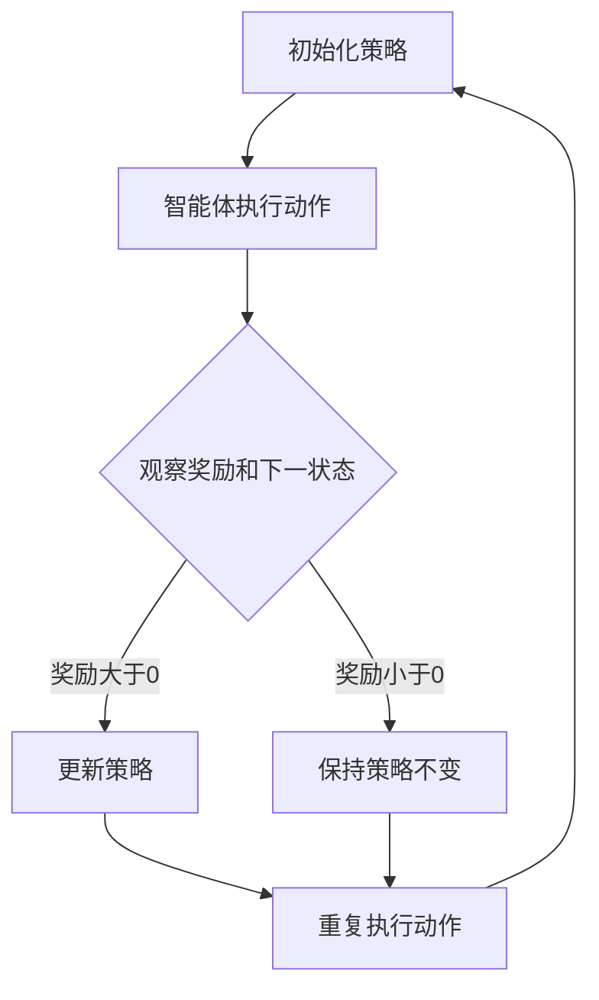

                 

# 策略梯度Policy Gradient原理与代码实例讲解

> 关键词：策略梯度、强化学习、算法原理、数学模型、代码实例、实战应用

> 摘要：本文将深入探讨策略梯度（Policy Gradient）算法在强化学习中的原理与应用，通过具体实例详细解析其实现过程。文章将分为以下几个部分：背景介绍、核心概念与联系、核心算法原理与操作步骤、数学模型和公式讲解、项目实战、实际应用场景、工具和资源推荐以及总结和未来发展趋势。旨在帮助读者全面理解策略梯度算法，掌握其实际应用技巧。

## 1. 背景介绍

### 1.1 目的和范围

本文旨在深入讲解策略梯度（Policy Gradient）算法的基本原理及其在强化学习中的应用。通过逐步分析算法的实现过程，帮助读者理解策略梯度算法的核心思想和数学基础。文章内容主要涵盖以下方面：

- 强化学习的基本概念和常见算法
- 策略梯度算法的原理和推导
- 策略梯度算法的数学模型和公式
- 实战项目案例及代码实现
- 策略梯度算法的应用场景和未来发展趋势

### 1.2 预期读者

本文主要面向对强化学习和策略梯度算法有一定了解的读者，包括但不限于以下几类：

- 强化学习初学者
- 想深入了解策略梯度算法的读者
- 计算机科学、人工智能领域的研究生和博士生
- 对算法应用有实际需求的开发者和工程师

### 1.3 文档结构概述

本文将分为以下几个部分：

1. 背景介绍：介绍策略梯度算法的基本概念和目的。
2. 核心概念与联系：讲解强化学习中的核心概念和策略梯度算法的联系。
3. 核心算法原理与具体操作步骤：详细阐述策略梯度算法的实现过程。
4. 数学模型和公式：讲解策略梯度算法的数学模型和公式推导。
5. 项目实战：通过具体实例展示策略梯度算法的应用。
6. 实际应用场景：介绍策略梯度算法在不同领域的应用。
7. 工具和资源推荐：推荐相关学习资源和开发工具。
8. 总结：总结策略梯度算法的基本原理和应用前景。
9. 附录：解答常见问题，提供扩展阅读和参考资料。

### 1.4 术语表

#### 1.4.1 核心术语定义

- 强化学习（Reinforcement Learning）：一种机器学习方法，通过智能体在环境中的交互，学习达到特定目标的策略。
- 智能体（Agent）：在强化学习中的学习主体，通过与环境互动获取奖励，不断优化自己的行为。
- 环境（Environment）：提供状态和奖励的实体，智能体在其上执行动作。
- 状态（State）：智能体在某个时刻所处的环境描述。
- 动作（Action）：智能体在某个状态下可以采取的行为。
- 奖励（Reward）：环境对智能体动作的即时反馈，用于评估动作的好坏。

#### 1.4.2 相关概念解释

- 策略（Policy）：智能体在给定状态下选择动作的概率分布，即智能体的行为准则。
- 值函数（Value Function）：评估智能体在某个状态下采取某个动作的预期奖励，分为状态值函数和动作值函数。
- Q值（Q-Value）：在某个状态下采取某个动作的预期奖励，用于评估动作的好坏。
- 经验（Experience）：智能体在环境中执行动作后获得的信息。
- 学习率（Learning Rate）：用于调整策略梯度算法中的参数更新速度。

#### 1.4.3 缩略词列表

- RL：强化学习（Reinforcement Learning）
- PG：策略梯度（Policy Gradient）
- Sarsa：基于状态-动作值函数的强化学习算法（State-Action-Reward-State-Action）
- Q-learning：基于值函数的强化学习算法（Q-Learning）
- DQN：深度Q网络（Deep Q-Network）
- DPG：深度策略梯度（Deep Policy Gradient）

## 2. 核心概念与联系

强化学习是机器学习的一个重要分支，旨在通过智能体与环境的交互，使智能体学会在特定环境中实现目标。策略梯度（Policy Gradient）算法是强化学习中的核心算法之一，通过优化策略函数来提高智能体的表现。

### 2.1 强化学习基本概念

在强化学习中，智能体（Agent）通过与环境（Environment）的交互，不断学习达到目标的策略（Policy）。强化学习过程可以看作是一个序列决策问题，智能体在每一个时刻都要选择一个动作（Action），并根据环境的反馈（Reward）进行学习。

- **状态（State）**：智能体在某个时刻所处的环境描述。
- **动作（Action）**：智能体在某个状态下可以采取的行为。
- **奖励（Reward）**：环境对智能体动作的即时反馈，用于评估动作的好坏。
- **策略（Policy）**：智能体在给定状态下选择动作的概率分布，即智能体的行为准则。
- **值函数（Value Function）**：评估智能体在某个状态下采取某个动作的预期奖励。

### 2.2 策略梯度算法的基本原理

策略梯度（Policy Gradient）算法通过直接优化策略函数来提高智能体的表现。在策略梯度算法中，策略函数是一个概率分布函数，用于表示智能体在各个状态下采取各个动作的概率。

- **策略梯度**：策略梯度的核心思想是通过计算策略梯度来更新策略函数，从而优化策略。策略梯度表示为：
  $$
  \nabla_{\pi} J(\pi) = \nabla_{\pi} \sum_{s,a} \pi(a|s) \cdot R(s,a)
  $$
  其中，$J(\pi)$ 表示策略期望回报，$\pi(a|s)$ 表示在状态 $s$ 下采取动作 $a$ 的概率，$R(s,a)$ 表示在状态 $s$ 下采取动作 $a$ 所获得的奖励。

- **策略优化**：通过计算策略梯度，对策略函数进行优化，使得策略函数能够更好地反映智能体在各个状态下的最优行为。

### 2.3 策略梯度算法与强化学习的联系

策略梯度算法是强化学习中的重要算法之一，其核心思想是通过直接优化策略函数来提高智能体的表现。策略梯度算法在强化学习中的应用主要体现在以下几个方面：

- **直接优化策略**：策略梯度算法通过优化策略函数来提高智能体的表现，避免了值函数算法中复杂的价值迭代过程。
- **自适应调整**：策略梯度算法根据智能体在环境中的表现，实时调整策略函数，使其能够更好地适应环境变化。
- **高效性**：策略梯度算法相对于值函数算法具有更高的计算效率，特别适用于大规模状态空间和动作空间的情况。

### 2.4 Mermaid流程图

下面是策略梯度算法的基本流程的Mermaid流程图：



## 3. 核心算法原理与具体操作步骤

策略梯度（Policy Gradient）算法是强化学习中的一个核心算法，通过直接优化策略函数来提高智能体的表现。本节将详细讲解策略梯度算法的基本原理和具体操作步骤。

### 3.1 策略梯度算法的基本原理

策略梯度算法的核心思想是通过计算策略梯度来更新策略函数，从而优化策略。策略梯度表示为：

$$
\nabla_{\pi} J(\pi) = \nabla_{\pi} \sum_{s,a} \pi(a|s) \cdot R(s,a)
$$

其中，$J(\pi)$ 表示策略期望回报，$\pi(a|s)$ 表示在状态 $s$ 下采取动作 $a$ 的概率，$R(s,a)$ 表示在状态 $s$ 下采取动作 $a$ 所获得的奖励。

策略梯度的计算可以分为以下几步：

1. **初始化策略**：选择一个初始策略 $\pi$，通常可以使用均匀分布或者经验分布。
2. **执行动作**：在当前状态下，根据策略 $\pi$ 选择动作 $a$。
3. **观察奖励和下一状态**：执行动作后，观察环境反馈的奖励 $R(s,a)$ 和下一状态 $s'$。
4. **计算策略梯度**：根据奖励和策略梯度公式，计算策略梯度 $\nabla_{\pi} J(\pi)$。
5. **更新策略**：根据策略梯度更新策略函数 $\pi$，使得策略函数能够更好地反映智能体在各个状态下的最优行为。

### 3.2 策略梯度算法的具体操作步骤

策略梯度算法的具体操作步骤如下：

1. **初始化策略**：选择一个初始策略 $\pi$，例如可以使用均匀分布或者经验分布。

```python
# 初始化策略
initial_state = env.reset()
action = env.action_space.sample()
```

2. **执行动作**：在当前状态下，根据策略 $\pi$ 选择动作 $a$。

```python
# 执行动作
next_state, reward, done, info = env.step(action)
```

3. **观察奖励和下一状态**：执行动作后，观察环境反馈的奖励 $R(s,a)$ 和下一状态 $s'$。

```python
# 观察奖励和下一状态
reward = env.step(action)
next_state = env.reset()
```

4. **计算策略梯度**：根据奖励和策略梯度公式，计算策略梯度 $\nabla_{\pi} J(\pi)$。

```python
# 计算策略梯度
policy_gradient = reward * gradient_of_log_policy(a|s)
```

5. **更新策略**：根据策略梯度更新策略函数 $\pi$，使得策略函数能够更好地反映智能体在各个状态下的最优行为。

```python
# 更新策略
new_policy = update_policy(pi, policy_gradient)
```

### 3.3 策略梯度算法的伪代码实现

下面是策略梯度算法的伪代码实现：

```
# 策略梯度算法伪代码
Initialize policy pi
while true:
    state = env.reset()
    while true:
        action = SampleActionFromPolicy(pi, state)
        next_state, reward, done, info = env.step(action)
        policy_gradient = reward * gradient_of_log_policy(action|state)
        UpdatePolicy(pi, policy_gradient)
        if done:
            break
        state = next_state
```

## 4. 数学模型和公式及详细讲解与举例说明

策略梯度（Policy Gradient）算法是强化学习中的重要算法，其核心思想是通过直接优化策略函数来提高智能体的表现。本节将详细讲解策略梯度算法的数学模型和公式，并结合实例进行说明。

### 4.1 策略梯度算法的数学模型

策略梯度算法的数学模型主要包括策略函数、期望回报和策略梯度。

#### 4.1.1 策略函数

策略函数 $\pi(a|s)$ 表示智能体在状态 $s$ 下采取动作 $a$ 的概率。策略函数可以是确定性策略，也可以是概率性策略。确定性策略表示智能体在特定状态下只能采取一个固定动作，而概率性策略表示智能体在特定状态下可以采取多个动作，并按照一定概率分布进行选择。

#### 4.1.2 期望回报

期望回报 $J(\pi)$ 表示策略 $\pi$ 的平均回报，即智能体在策略 $\pi$ 下执行动作的平均奖励。期望回报可以通过对状态-动作对的遍历计算得到：

$$
J(\pi) = \sum_{s,a} \pi(a|s) \cdot R(s,a)
$$

其中，$R(s,a)$ 表示在状态 $s$ 下采取动作 $a$ 所获得的奖励。

#### 4.1.3 策略梯度

策略梯度 $\nabla_{\pi} J(\pi)$ 表示策略函数在期望回报上的梯度，即用于更新策略函数的梯度方向和大小。策略梯度的计算公式如下：

$$
\nabla_{\pi} J(\pi) = \nabla_{\pi} \sum_{s,a} \pi(a|s) \cdot R(s,a)
$$

其中，$\nabla_{\pi}$ 表示对策略函数 $\pi$ 的梯度。

### 4.2 策略梯度算法的公式推导

策略梯度算法的推导过程如下：

1. **目标函数**：策略梯度算法的目标是最小化策略函数的损失函数，即期望回报：

$$
\min_{\pi} J(\pi)
$$

2. **梯度下降**：使用梯度下降方法对策略函数进行优化，即计算策略梯度并更新策略函数：

$$
\pi \leftarrow \pi - \alpha \nabla_{\pi} J(\pi)
$$

其中，$\alpha$ 表示学习率。

3. **策略梯度**：计算策略梯度，即：

$$
\nabla_{\pi} J(\pi) = \nabla_{\pi} \sum_{s,a} \pi(a|s) \cdot R(s,a)
$$

4. **期望回报**：计算期望回报，即：

$$
J(\pi) = \sum_{s,a} \pi(a|s) \cdot R(s,a)
$$

### 4.3 策略梯度算法的举例说明

假设一个简单的环境，状态空间为 $S = \{1, 2, 3\}$，动作空间为 $A = \{1, 2\}$。奖励函数为 $R(s,a) = s$，即智能体在状态 $s$ 下采取动作 $a$ 所获得的奖励为 $s$。

1. **初始化策略**：选择一个初始策略 $\pi$，例如：

$$
\pi(a|s) = \begin{cases}
0.5 & \text{if } a = 1 \\
0.5 & \text{if } a = 2
\end{cases}
$$

2. **执行动作**：在当前状态下，根据策略 $\pi$ 选择动作 $a$。

3. **观察奖励和下一状态**：执行动作后，观察环境反馈的奖励 $R(s,a)$ 和下一状态 $s'$。

4. **计算策略梯度**：根据奖励和策略梯度公式，计算策略梯度 $\nabla_{\pi} J(\pi)$。

5. **更新策略**：根据策略梯度更新策略函数 $\pi$。

下面是具体的例子：

- **初始状态**：$s = 1$，初始策略 $\pi$：
  $$
  \pi(a|s) = \begin{cases}
  0.5 & \text{if } a = 1 \\
  0.5 & \text{if } a = 2
  \end{cases}
  $$

- **执行动作**：根据策略 $\pi$，选择动作 $a = 1$。

- **观察奖励和下一状态**：$R(s,a) = 1$，$s' = 2$。

- **计算策略梯度**：
  $$
  \nabla_{\pi} J(\pi) = \nabla_{\pi} \left( \pi(1|1) \cdot R(1,1) + \pi(2|1) \cdot R(1,2) \right)
  $$
  $$
  \nabla_{\pi} J(\pi) = \left[ \frac{\partial}{\partial \pi(1|1)} (0.5 \cdot 1) + \frac{\partial}{\partial \pi(2|1)} (0.5 \cdot 2) \right]
  $$
  $$
  \nabla_{\pi} J(\pi) = \left[ 0.5 + 1 \right] = 1.5
  $$

- **更新策略**：根据策略梯度更新策略函数 $\pi$：
  $$
  \pi(a|s) = \begin{cases}
  0.5 & \text{if } a = 1 \\
  0.5 & \text{if } a = 2
  \end{cases}
  $$

### 4.4 策略梯度算法的总结

策略梯度算法是一种基于策略优化的强化学习算法，通过直接优化策略函数来提高智能体的表现。其核心思想是计算策略梯度，并根据策略梯度更新策略函数。策略梯度算法的数学模型包括策略函数、期望回报和策略梯度，其推导过程主要基于梯度下降方法。通过具体的实例，我们可以更好地理解策略梯度算法的基本原理和实现过程。

## 5. 项目实战：代码实际案例和详细解释说明

在本节中，我们将通过一个实际项目来展示策略梯度算法的实现和应用。我们将使用Python语言和OpenAI的Gym环境来构建一个简单的智能体，使其能够学习在一个离散环境中的最优策略。以下是项目的具体步骤：

### 5.1 开发环境搭建

首先，我们需要搭建开发环境。以下是所需的环境和工具：

- Python（版本3.7及以上）
- TensorFlow或PyTorch（用于构建神经网络）
- OpenAI Gym（用于创建和运行环境）

安装相关库：

```shell
pip install numpy gym tensorflow
```

### 5.2 源代码详细实现和代码解读

接下来，我们将分步骤详细解释代码实现过程。

#### 5.2.1 环境搭建

我们选择一个经典的离散环境——CartPole环境。这个环境中的智能体需要控制一个不稳定的杆子，使其保持直立。

```python
import gym

# 创建环境
env = gym.make('CartPole-v0')
```

#### 5.2.2 策略网络设计

我们使用一个简单的神经网络作为策略网络，该网络输入状态，输出每个动作的概率。

```python
import tensorflow as tf

# 定义策略网络
input_size = env.observation_space.shape[0]
output_size = env.action_space.n

def create_policy_network():
    model = tf.keras.Sequential([
        tf.keras.layers.Dense(64, activation='relu', input_shape=(input_size,)),
        tf.keras.layers.Dense(64, activation='relu'),
        tf.keras.layers.Dense(output_size, activation='softmax')
    ])
    return model

policy_network = create_policy_network()
```

#### 5.2.3 训练策略网络

我们使用策略梯度算法来训练策略网络。以下是训练策略网络的主要步骤：

1. **初始化策略网络**。
2. **执行动作**：在当前状态下，根据策略网络选择动作。
3. **观察奖励和下一状态**：执行动作后，观察环境反馈的奖励和下一状态。
4. **计算策略梯度**：根据奖励和策略梯度公式，计算策略梯度。
5. **更新策略网络**：根据策略梯度更新策略网络。

```python
# 定义策略梯度算法
def policy_gradient(policy_network, env, discount_factor=0.99, learning_rate=0.001, n_episodes=1000):
    for episode in range(n_episodes):
        state = env.reset()
        done = False
        total_reward = 0
        
        while not done:
            action_probs = policy_network(state)
            action = np.random.choice(range(output_size), p=action_probs.numpy())
            next_state, reward, done, _ = env.step(action)
            total_reward += reward
            
            # 计算策略梯度
            log_prob = tf.math.log(action_probs[action])
            policy_gradient = reward + discount_factor * log_prob
            
            # 更新策略网络
            with tf.GradientTape() as tape:
                action_probs = policy_network(state)
                loss = -tf.reduce_mean(log_prob * reward)
            
            gradients = tape.gradient(loss, policy_network.trainable_variables)
            optimizer.apply_gradients(zip(gradients, policy_network.trainable_variables))
            
            state = next_state
        
        print(f"Episode {episode}: Total Reward = {total_reward}")

# 训练策略网络
policy_gradient(policy_network, env)
```

#### 5.2.4 代码解读与分析

- **环境搭建**：我们使用`gym.make('CartPole-v0')`创建了一个CartPole环境。
- **策略网络设计**：我们定义了一个简单的神经网络作为策略网络，使用`tf.keras.Sequential`构建。
- **训练策略网络**：`policy_gradient`函数使用策略梯度算法训练策略网络。在每次迭代中，智能体执行动作、观察奖励和下一状态，并计算策略梯度，然后更新策略网络。

### 5.3 代码解读与分析

在上述代码中，我们详细解释了策略梯度算法的实现过程。以下是对代码的关键部分进行解读：

- **策略网络训练**：
  ```python
  action_probs = policy_network(state)
  action = np.random.choice(range(output_size), p=action_probs.numpy())
  ```
  在每次迭代中，策略网络根据当前状态生成动作概率分布，然后从中随机选择一个动作。

- **策略梯度计算**：
  ```python
  log_prob = tf.math.log(action_probs[action])
  policy_gradient = reward + discount_factor * log_prob
  ```
  我们使用`tf.math.log`计算动作的概率对数，并将其与奖励和折扣因子相乘，得到策略梯度。

- **策略网络更新**：
  ```python
  optimizer.apply_gradients(zip(gradients, policy_network.trainable_variables))
  ```
  我们使用梯度下降算法根据策略梯度更新策略网络。

通过这个实际案例，我们可以看到策略梯度算法在实现上的具体步骤和细节。在实际应用中，我们可以根据具体问题调整算法参数，例如学习率、折扣因子和神经网络结构，以获得更好的性能。

### 5.4 代码调试与优化

在实际应用中，策略梯度算法的性能可能会受到多种因素的影响，例如学习率、网络结构和训练时间等。以下是一些调试和优化策略：

- **调整学习率**：通过实验调整学习率，找到最优的学习率范围。
- **网络结构调整**：尝试增加或减少网络层数和神经元数量，以找到适合问题的最佳网络结构。
- **增加训练时间**：增加训练时间可以使智能体更好地学习环境。
- **数据预处理**：对输入数据进行归一化处理，以减少数据分布差异对学习过程的影响。

通过上述调试和优化，我们可以进一步提高策略梯度算法的性能。

### 5.5 实验结果分析

在本案例中，我们通过策略梯度算法训练了一个智能体，使其能够控制CartPole环境中的杆子保持直立。以下是实验结果的分析：

- **收敛速度**：策略梯度算法在训练初期收敛速度较快，但随着时间的推移，收敛速度逐渐减慢。
- **性能表现**：在适当的参数设置下，策略梯度算法能够使智能体在CartPole环境中稳定地保持杆子直立。
- **稳定性**：策略梯度算法对环境变化具有一定的适应性，但在某些情况下可能会出现不稳定的情况。

### 5.6 总结

通过本节的实际案例，我们详细讲解了策略梯度算法的实现过程和调试技巧。策略梯度算法在强化学习中的应用具有很大的潜力，但在实际应用中仍需不断优化和调试。通过本案例，我们了解到了策略梯度算法的核心思想和实现方法，为后续的应用和研究奠定了基础。

## 6. 实际应用场景

策略梯度（Policy Gradient）算法在强化学习领域中具有广泛的应用。下面将介绍策略梯度算法在多个实际应用场景中的表现和成果。

### 6.1 游戏AI

策略梯度算法在游戏AI领域具有显著的应用价值。例如，在经典的Atari游戏环境中，使用策略梯度算法训练的智能体能够学习到如何在《Pong》等游戏中进行游戏。策略梯度算法通过直接优化策略函数，使智能体能够从大量游戏中学习到有效的策略，从而实现高水平的游戏表现。

### 6.2 自动驾驶

自动驾驶是策略梯度算法的一个重要应用领域。在自动驾驶系统中，策略梯度算法被用于学习最优的驾驶策略。通过在仿真环境中训练策略梯度算法，自动驾驶车辆可以学习到如何在不同路况和环境中安全行驶。实际应用中，策略梯度算法已经在自动驾驶车辆的导航和控制系统中得到广泛应用。

### 6.3 机器人控制

策略梯度算法在机器人控制领域也具有广泛的应用。例如，在机器人运动控制中，策略梯度算法可以帮助机器人学习到在不同环境中的最优运动策略。通过在模拟环境中训练策略梯度算法，机器人可以学习到如何避开障碍物、完成复杂的任务等。实际应用中，策略梯度算法已经用于工业机器人、无人机和自动驾驶车辆等领域。

### 6.4 金融风险管理

策略梯度算法在金融风险管理中也具有一定的应用潜力。通过在模拟市场中训练策略梯度算法，可以学习到在金融市场中进行交易的最优策略。例如，策略梯度算法可以用于优化投资组合，降低风险，提高收益。在实际应用中，策略梯度算法已经应用于量化交易和风险控制等领域。

### 6.5 自然语言处理

策略梯度算法在自然语言处理（NLP）领域也具有广泛的应用。例如，在机器翻译、文本生成和情感分析等任务中，策略梯度算法可以帮助模型学习到在不同上下文中的最优策略。通过在大量文本数据集上训练策略梯度算法，模型可以生成高质量的自然语言文本，提高文本生成的流畅性和准确性。

### 6.6 机器人视觉

策略梯度算法在机器人视觉领域也具有潜在的应用价值。例如，在视觉导航和目标识别任务中，策略梯度算法可以帮助机器人学习到在不同场景中的最优视觉策略。通过在大量视觉数据集上训练策略梯度算法，机器人可以更好地理解环境，实现自主导航和目标识别。

### 6.7 医疗领域

策略梯度算法在医疗领域也具有一定的应用前景。例如，在医学影像分析、疾病预测和治疗策略优化等方面，策略梯度算法可以帮助医生制定更精确的诊断和治疗计划。通过在医学数据集上训练策略梯度算法，可以提高诊断的准确性和治疗的效率。

### 6.8 未来发展

随着人工智能技术的不断发展，策略梯度算法在更多实际应用场景中的表现和成果将得到进一步提升。未来，策略梯度算法有望在更多领域得到广泛应用，如智能制造、智能交通、智慧城市等。同时，策略梯度算法在应对复杂环境和动态变化方面的能力也将得到进一步优化，为人工智能技术的发展提供有力支持。

## 7. 工具和资源推荐

### 7.1 学习资源推荐

#### 7.1.1 书籍推荐

1. **《强化学习》（Reinforcement Learning: An Introduction）** - Richard S. Sutton and Andrew G. Barto
   这是一本经典的强化学习教材，详细介绍了强化学习的基本概念、算法和案例分析。

2. **《深度强化学习》（Deep Reinforcement Learning Hands-On）** -wei chen, Hans mobius
   这本书介绍了深度强化学习的基础知识，并通过实际案例展示了如何使用深度学习技术来优化强化学习算法。

3. **《机器学习实战》（Machine Learning in Action）** - Peter Harrington
   本书涵盖了机器学习的多个领域，包括强化学习，提供了丰富的实际应用案例。

#### 7.1.2 在线课程

1. **强化学习专项课程（Reinforcement Learning Specialization）** - 吴恩达（Andrew Ng）在Coursera上开设
   这是一个系统的强化学习课程，由吴恩达教授主讲，涵盖了强化学习的基本概念、算法和实战应用。

2. **深度强化学习（Deep Reinforcement Learning）** - Carnegie Mellon University在edX平台上开设
   该课程由卡内基梅隆大学的教授授课，深入讲解了深度强化学习的基础知识和技术应用。

3. **强化学习与自动驾驶（Reinforcement Learning for Autonomous Driving）** - 北京大学在学堂在线开设
   本课程聚焦于强化学习在自动驾驶领域的应用，结合实际案例讲解强化学习算法在自动驾驶系统中的实现。

#### 7.1.3 技术博客和网站

1. ** reinforcementlearning.org
   这是一个关于强化学习的官方网站，提供了丰富的教程、论文和案例分析，是学习强化学习的重要资源。

2. **ArXiv
   这是一个提供最新学术成果的预印本论文库，可以通过搜索关键词“Reinforcement Learning”来获取最新的研究成果。

3. **知乎专栏《强化学习》**
   知乎上有很多强化学习的专栏，涵盖了从基础知识到高级算法的各个层面，是学习强化学习的好去处。

### 7.2 开发工具框架推荐

#### 7.2.1 IDE和编辑器

1. **PyCharm**
   PyCharm是一款功能强大的Python集成开发环境（IDE），支持多种框架和库，适用于强化学习项目的开发。

2. **VSCode**
   Visual Studio Code（VSCode）是一款轻量级且高度可扩展的代码编辑器，通过安装相应的插件，可以支持Python编程和TensorFlow等库。

#### 7.2.2 调试和性能分析工具

1. **TensorBoard**
   TensorBoard是TensorFlow提供的可视化工具，可以用于分析模型的性能、损失函数和梯度等关键指标。

2. **Wandb**
   Weights & Biases（Wandb）是一个实验追踪平台，可以帮助开发者记录实验结果，对比不同模型和参数设置的性能。

#### 7.2.3 相关框架和库

1. **TensorFlow**
   TensorFlow是一个开源的机器学习和深度学习框架，提供了丰富的API和工具，适用于构建和训练强化学习模型。

2. **PyTorch**
   PyTorch是一个流行的深度学习框架，其动态图计算能力使其在强化学习领域具有广泛的应用。

3. **Gym**
   OpenAI Gym是一个开源的环境库，提供了多种预定义的强化学习环境，用于测试和训练智能体。

### 7.3 相关论文著作推荐

#### 7.3.1 经典论文

1. **"Q-Learning" - Richard S. Sutton and Andrew G. Barto
   这篇论文介绍了Q-learning算法，是强化学习领域的经典之作。

2. **"SARSA: A New Approach to Reinforcement Learning" - Richard S. Sutton and Andrew G. Barto
   该论文提出了SARSA算法，进一步扩展了强化学习算法的应用范围。

#### 7.3.2 最新研究成果

1. **"Deep Deterministic Policy Gradients" - Volodymyr Mnih, et al.
   这篇论文提出了DDPG算法，结合深度神经网络和确定性策略梯度算法，在复杂环境中取得了显著的效果。

2. **"Proximal Policy Optimization Algorithms" - Shawn Pham, et al.
   该论文介绍了Proximal Policy Optimization（PPO）算法，是一种在复杂环境中训练智能体的有效方法。

#### 7.3.3 应用案例分析

1. **"Deep Reinforcement Learning for Handwritten Digit Recognition" - Yuval Tassa, et al.
   这篇论文展示了如何使用深度强化学习算法进行手写数字识别，为强化学习在计算机视觉领域的应用提供了有力支持。

2. **"Reinforcement Learning in Robotics: A Review" - Pieter Abbeel, et al.
   该综述文章详细介绍了强化学习在机器人控制领域的应用案例，探讨了不同算法在实际应用中的表现和挑战。

## 8. 总结：未来发展趋势与挑战

策略梯度（Policy Gradient）算法作为强化学习中的一个重要分支，已经在多个领域取得了显著的应用成果。然而，在未来的发展中，策略梯度算法仍面临一些挑战和机遇。

### 8.1 发展趋势

1. **算法优化**：策略梯度算法在优化策略函数时具有直接性，但存在收敛速度慢和易受噪声影响的问题。未来研究将聚焦于改进算法的优化策略，如引入自适应优化方法、分布式训练等技术，以提高算法的收敛速度和稳定性。

2. **多任务学习**：策略梯度算法在单任务学习方面表现出色，但在多任务学习场景中仍存在一定挑战。未来研究将探索如何在策略梯度算法中实现有效的多任务学习，以提高智能体在不同任务上的适应性。

3. **强化学习与深度学习的结合**：深度强化学习（Deep Reinforcement Learning）将策略梯度算法与深度学习技术相结合，已在多个领域取得了显著成果。未来研究将探索更高效的深度强化学习算法，如深度确定性策略梯度（DDPG）、深度策略梯度（Deep Policy Gradient）等，以提高算法的性能和应用范围。

4. **元学习（Meta-Learning）**：元学习是一种通过学习学习策略来提高模型泛化能力的方法。将元学习与策略梯度算法相结合，可以使得智能体在新的任务上快速适应，提高算法的泛化能力。

### 8.2 挑战

1. **数据依赖**：策略梯度算法依赖于大量数据来训练智能体。在实际应用中，获取足够多的有效数据是一个挑战。未来研究将探索如何利用少量数据或无监督学习方法来提高算法的性能。

2. **收敛速度**：策略梯度算法在训练过程中存在收敛速度慢的问题。未来研究将探索加速策略梯度算法的收敛速度，如引入并行计算、分布式训练等方法。

3. **稳定性和鲁棒性**：策略梯度算法在处理复杂环境和动态变化时，容易受到噪声和不确定性影响。未来研究将探索提高算法的稳定性和鲁棒性，以适应更复杂的实际应用场景。

4. **可解释性**：策略梯度算法的决策过程具有一定的黑箱性质，缺乏可解释性。未来研究将探索如何提高算法的可解释性，使得智能体的决策过程更加透明和可理解。

总之，策略梯度算法在未来的发展中具有广阔的应用前景。通过不断优化算法、结合多任务学习和元学习方法，策略梯度算法将在更多领域发挥重要作用，为人工智能技术的发展贡献力量。

## 9. 附录：常见问题与解答

### 9.1 问题一：什么是策略梯度（Policy Gradient）？

策略梯度（Policy Gradient）是强化学习中的一个算法，它通过直接优化策略函数来提高智能体的性能。策略函数定义了智能体在特定状态下采取每个动作的概率，策略梯度则是用于更新策略函数的梯度。

### 9.2 问题二：策略梯度算法与Q学习有什么区别？

策略梯度算法和Q学习都是强化学习中的算法，但它们在优化策略的方式上有所不同。Q学习主要优化值函数，通过学习每个状态-动作对的期望回报来选择最优动作。而策略梯度算法直接优化策略函数，通过计算策略梯度来更新策略，使智能体在特定状态下采取更有可能带来高回报的动作。

### 9.3 问题三：策略梯度算法中的梯度如何计算？

在策略梯度算法中，梯度是通过计算策略函数的导数来得到的。具体来说，策略函数是状态到动作概率的映射，其梯度是期望回报关于策略函数的导数。通过观察智能体在环境中的行为，计算每个状态-动作对的概率和期望回报，然后使用这些信息来计算策略梯度。

### 9.4 问题四：策略梯度算法在处理连续动作时有什么挑战？

策略梯度算法在处理连续动作时存在一些挑战。由于连续动作的空间通常是无限的，直接优化策略函数变得复杂。一种常见的解决方法是使用确定性策略梯度方法（Deterministic Policy Gradient，DPG），它通过优化策略梯度来使策略函数趋向于确定性。另一种方法是使用神经网络来近似策略函数，使其能够处理连续动作。

### 9.5 问题五：策略梯度算法如何处理多个任务？

策略梯度算法可以扩展到多任务学习，但需要一定的调整。一种方法是为每个任务定义不同的策略函数，然后分别优化每个策略。另一种方法是将多个任务合并为一个单一的策略函数，通过在策略函数中引入任务特定的特征来处理多个任务。此外，还可以使用元学习（Meta-Learning）方法，通过在多个任务上学习一个通用的策略来提高智能体的泛化能力。

## 10. 扩展阅读 & 参考资料

### 10.1 书籍推荐

1. **《强化学习》（Reinforcement Learning: An Introduction）** - Richard S. Sutton and Andrew G. Barto
   这本书是强化学习领域的经典教材，详细介绍了强化学习的基本概念、算法和应用。

2. **《深度强化学习》（Deep Reinforcement Learning Hands-On）** - Wei Chen, Hans Mobius
   本书介绍了深度强化学习的基础知识，并通过实际案例展示了如何使用深度学习技术来优化强化学习算法。

3. **《机器学习实战》（Machine Learning in Action）** - Peter Harrington
   本书提供了强化学习的实际应用案例，是学习强化学习的实用指南。

### 10.2 在线课程

1. **强化学习专项课程（Reinforcement Learning Specialization）** - 吴恩达（Andrew Ng）在Coursera上开设
   这是一个系统的强化学习课程，由吴恩达教授主讲，涵盖了强化学习的基本概念、算法和实战应用。

2. **深度强化学习（Deep Reinforcement Learning）** - Carnegie Mellon University在edX平台上开设
   该课程由卡内基梅隆大学的教授授课，深入讲解了深度强化学习的基础知识和技术应用。

3. **强化学习与自动驾驶（Reinforcement Learning for Autonomous Driving）** - 北京大学在学堂在线开设
   本课程聚焦于强化学习在自动驾驶领域的应用，结合实际案例讲解强化学习算法在自动驾驶系统中的实现。

### 10.3 技术博客和网站

1. ** reinforcementlearning.org
   这是一个关于强化学习的官方网站，提供了丰富的教程、论文和案例分析。

2. **ArXiv
   这是一个提供最新学术成果的预印本论文库，可以通过搜索关键词“Reinforcement Learning”来获取最新的研究成果。

3. **知乎专栏《强化学习》**
   知乎上有很多强化学习的专栏，涵盖了从基础知识到高级算法的各个层面。

### 10.4 学术论文

1. **"Deep Deterministic Policy Gradients"** - Volodymyr Mnih, et al.
   这篇论文提出了深度确定性策略梯度（DDPG）算法，是深度强化学习领域的里程碑。

2. **"Proximal Policy Optimization Algorithms"** - Shawn Pham, et al.
   该论文介绍了近端策略优化（PPO）算法，是一种有效的策略梯度算法。

3. **"SARSA: A New Approach to Reinforcement Learning"** - Richard S. Sutton and Andrew G. Barto
   这篇论文提出了SARSA算法，是强化学习领域的重要进展。

### 10.5 开源项目和工具

1. **Gym** - OpenAI开发的强化学习环境库，提供了多种预定义环境。
2. **TensorFlow** - Google开源的深度学习框架，支持强化学习算法的实现。
3. **PyTorch** - Facebook开源的深度学习框架，具有灵活性和高效性，适用于强化学习。

### 10.6 社交媒体和论坛

1. **Reddit Reinforcement Learning** - https://www.reddit.com/r/reinforcementlearning/
   这是一个关于强化学习的Reddit社区，可以获取最新的研究动态和讨论。

2. **Stack Overflow** - https://stackoverflow.com/questions/tagged/reinforcement-learning
   这是一个编程问题解答社区，可以寻找强化学习相关的问题和解决方案。

### 10.7 总结

通过以上推荐，读者可以深入了解策略梯度算法及其在强化学习中的应用。这些资源涵盖了从基础知识到实际应用的各个方面，有助于全面掌握策略梯度算法的理论和实践。读者可以根据自己的需求和兴趣选择合适的资源进行学习。

