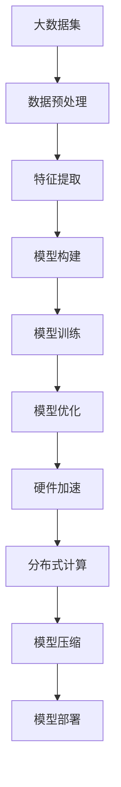

                 

# 算力提升推动大模型发展

> **关键词**：算力、大模型、人工智能、算法优化、硬件加速、分布式计算、模型压缩

> **摘要**：随着人工智能技术的飞速发展，大规模模型（大模型）在各个领域展现出了巨大的潜力。然而，大模型的训练和应用对计算资源的需求急剧增加，传统计算架构已经无法满足需求。本文将探讨算力提升对大模型发展的重要性，分析算力提升的核心技术和实际应用，并提出未来发展趋势和挑战。

## 1. 背景介绍

### 1.1 目的和范围

本文旨在探讨算力提升对大模型发展的重要性，分析现有技术和解决方案，并提出未来的发展方向。本文将涵盖以下内容：

- 大模型的需求背景和计算资源挑战
- 算力提升的核心技术和方法
- 算力提升在大模型训练和应用的实例分析
- 未来发展趋势和面临的挑战

### 1.2 预期读者

- 人工智能领域的研发人员和技术爱好者
- 数据科学家和机器学习工程师
- 计算机硬件工程师和架构师
- 对人工智能技术有浓厚兴趣的普通读者

### 1.3 文档结构概述

本文结构如下：

- 第1章：背景介绍
  - 目的和范围
  - 预期读者
  - 文档结构概述
  - 术语表
- 第2章：核心概念与联系
  - 大模型与计算资源的关系
  - 算力提升的技术原理和架构
- 第3章：核心算法原理 & 具体操作步骤
  - 算法优化方法
  - 硬件加速技术
  - 分布式计算和模型压缩
- 第4章：数学模型和公式 & 详细讲解 & 举例说明
  - 数学模型和公式
  - 算法分析
  - 应用案例
- 第5章：项目实战：代码实际案例和详细解释说明
  - 开发环境搭建
  - 源代码实现和解读
  - 代码解读与分析
- 第6章：实际应用场景
  - 人工智能领域
  - 金融、医疗等行业
- 第7章：工具和资源推荐
  - 学习资源
  - 开发工具框架
  - 相关论文著作
- 第8章：总结：未来发展趋势与挑战
  - 发展趋势
  - 面临的挑战
- 第9章：附录：常见问题与解答
- 第10章：扩展阅读 & 参考资料

### 1.4 术语表

#### 1.4.1 核心术语定义

- **大模型**：指参数数量在亿级别及以上的深度学习模型，如GPT-3、BERT等。
- **算力**：指计算能力，包括计算速度、存储能力和网络传输能力。
- **算法优化**：通过改进算法设计或参数选择，提高模型训练效率和效果。
- **硬件加速**：利用专用硬件（如GPU、TPU等）加速计算过程，提高计算性能。
- **分布式计算**：通过将计算任务分布在多个计算节点上，提高计算效率和扩展性。
- **模型压缩**：通过减少模型参数数量或使用稀疏性等技术，降低模型存储和计算成本。

#### 1.4.2 相关概念解释

- **深度学习**：一种基于人工神经网络的学习方法，通过多层非线性变换提取数据特征。
- **神经网络**：一种由大量神经元连接组成的计算模型，用于模拟人脑的信息处理能力。
- **GPU**（图形处理器）：一种用于图形渲染的专用计算设备，具有高性能并行计算能力。
- **TPU**（Tensor Processing Unit）：一种专门为深度学习任务设计的计算设备，支持TensorFlow等深度学习框架。

#### 1.4.3 缩略词列表

- **AI**：人工智能
- **DL**：深度学习
- **GPU**：图形处理器
- **TPU**：Tensor Processing Unit
- **CUDA**：计算统一设备架构
- **TensorFlow**：一种开源的深度学习框架

## 2. 核心概念与联系

### 2.1 大模型与计算资源的关系

随着人工智能技术的发展，深度学习模型变得越来越复杂，参数数量和模型规模呈指数级增长。大模型的训练和应用对计算资源的需求急剧增加，传统的计算架构已经无法满足需求。以下是几个关键指标：

- **计算速度**：大模型训练过程中需要进行大量的矩阵运算，计算速度直接影响到模型训练的效率和效果。
- **存储能力**：大模型通常包含数亿甚至千亿级别的参数，需要大量的存储空间。
- **网络传输能力**：大模型训练过程中需要进行数据传输，网络传输能力直接影响到模型训练的效率。

### 2.2 算力提升的技术原理和架构

为了提升算力，研究者们提出了多种技术和方法，包括算法优化、硬件加速、分布式计算和模型压缩等。以下是这些技术的原理和架构：

#### 2.2.1 算法优化

算法优化通过改进算法设计或参数选择，提高模型训练效率和效果。具体方法包括：

- **优化算法**：例如随机梯度下降（SGD）、Adam等，通过调整学习率、正则化等参数，提高算法收敛速度和精度。
- **数据预处理**：通过数据增强、数据清洗等手段，提高数据质量，减少数据噪声对模型训练的影响。
- **特征提取**：通过特征提取和特征选择，提高模型对数据特征的利用效率。

#### 2.2.2 硬件加速

硬件加速通过利用专用硬件（如GPU、TPU等）加速计算过程，提高计算性能。具体方法包括：

- **GPU加速**：利用GPU的并行计算能力，将深度学习模型的前向传播和反向传播过程分解成多个子任务，并行执行。
- **TPU加速**：利用TPU的专用架构，优化深度学习模型的计算过程，提高计算速度和效率。

#### 2.2.3 分布式计算

分布式计算通过将计算任务分布在多个计算节点上，提高计算效率和扩展性。具体方法包括：

- **模型分割**：将大模型分割成多个小块，分布在多个计算节点上进行训练。
- **数据并行**：将训练数据分割成多个子集，每个计算节点独立训练模型，最后合并结果。
- **流水线并行**：将模型训练过程分解成多个阶段，每个阶段可以并行执行。

#### 2.2.4 模型压缩

模型压缩通过减少模型参数数量或使用稀疏性等技术，降低模型存储和计算成本。具体方法包括：

- **剪枝**：通过剪枝技术，删除模型中不重要的参数或神经元，降低模型复杂度。
- **量化**：通过量化技术，将模型中的浮点数参数转换为整数，减少存储和计算成本。
- **稀疏性**：通过稀疏性技术，将模型参数压缩为稀疏矩阵，提高计算效率。

### 2.3 Mermaid 流程图

以下是大模型训练过程中涉及到的核心概念和联系，使用Mermaid流程图进行描述：



## 3. 核心算法原理 & 具体操作步骤

### 3.1 算法优化

算法优化是提升大模型训练效率的重要手段。以下介绍几种常用的算法优化方法：

#### 3.1.1 随机梯度下降（SGD）

伪代码：

```python
for epoch in range(num_epochs):
    for x, y in dataset:
        gradient = compute_gradient(x, y)
        update_model_parameters(gradient)
```

具体操作步骤：

1. 初始化模型参数。
2. 从数据集中随机抽取一个样本。
3. 计算样本的梯度。
4. 根据梯度更新模型参数。
5. 重复步骤2-4，直到达到预定的迭代次数。

#### 3.1.2 Adam优化器

伪代码：

```python
m = 0
v = 0
for epoch in range(num_epochs):
    for x, y in dataset:
        gradient = compute_gradient(x, y)
        m = alpha * m + (1 - alpha) * gradient
        v = beta1 * v + (1 - beta1) * gradient**2
        m_hat = m / (1 - beta1**epoch)
        v_hat = v / (1 - beta1**epoch)
        update_model_parameters(-alpha * m_hat / (sqrt(v_hat) + epsilon))
```

具体操作步骤：

1. 初始化一阶矩估计（m）和二阶矩估计（v）。
2. 对于每个迭代步骤，更新m和v。
3. 计算m和v的指数加权平均。
4. 根据m和v的估计值更新模型参数。

### 3.2 硬件加速

硬件加速通过利用GPU或TPU等专用硬件，提高大模型训练的计算速度。以下介绍GPU加速的基本原理和操作步骤：

#### 3.2.1 GPU加速原理

GPU（图形处理器）具有高性能并行计算能力，通过利用其多个核心和线程，可以大大提高计算速度。GPU加速的关键在于将深度学习模型的计算任务分解成多个子任务，并行执行。

#### 3.2.2 CUDA加速

CUDA是NVIDIA推出的并行计算平台和编程模型，用于在GPU上实现高性能计算。以下介绍CUDA加速的基本原理和操作步骤：

1. **安装CUDA工具包**：下载并安装CUDA工具包，配置环境变量。
2. **编写CUDA代码**：使用CUDA C++或Python的CUDA库编写代码，实现深度学习模型的GPU加速。
3. **编译和运行**：编译CUDA代码，运行训练过程。

#### 3.2.3 TPU加速

TPU（Tensor Processing Unit）是谷歌推出的一种专门为深度学习任务设计的计算设备，支持TensorFlow等深度学习框架。以下介绍TPU加速的基本原理和操作步骤：

1. **安装TPU工具包**：下载并安装TPU工具包，配置环境变量。
2. **编写TPU代码**：使用TensorFlow的TPU编译器编写代码，实现深度学习模型的TPU加速。
3. **编译和运行**：编译TPU代码，运行训练过程。

### 3.3 分布式计算

分布式计算通过将计算任务分布在多个计算节点上，提高计算效率和扩展性。以下介绍分布式计算的基本原理和操作步骤：

#### 3.3.1 分布式计算原理

分布式计算将计算任务分解成多个子任务，分布在不同计算节点上独立执行，最后合并结果。分布式计算的关键在于如何有效地分配任务、同步数据和调度计算。

#### 3.3.2 数据并行

数据并行是分布式计算的一种常见方法，将训练数据集分成多个子集，每个计算节点独立训练模型，最后合并结果。以下介绍数据并行的操作步骤：

1. **数据划分**：将训练数据集划分成多个子集，每个子集分配给不同的计算节点。
2. **独立训练**：每个计算节点独立训练模型，使用本地数据集。
3. **结果合并**：将不同计算节点的模型结果进行合并，得到最终的模型参数。

#### 3.3.3 流水线并行

流水线并行是另一种分布式计算方法，将模型训练过程分解成多个阶段，每个阶段可以并行执行。以下介绍流水线并行的操作步骤：

1. **阶段划分**：将模型训练过程分解成多个阶段，如数据预处理、特征提取、模型训练等。
2. **并行执行**：在每个计算节点上，同时执行多个阶段的任务。
3. **结果合并**：将不同计算节点的阶段结果进行合并，得到最终的模型参数。

### 3.4 模型压缩

模型压缩通过减少模型参数数量或使用稀疏性等技术，降低模型存储和计算成本。以下介绍几种常见的模型压缩方法：

#### 3.4.1 剪枝

剪枝是通过删除模型中不重要的参数或神经元，降低模型复杂度。以下介绍剪枝的基本原理和操作步骤：

1. **训练模型**：使用原始数据集训练模型，得到模型参数。
2. **计算重要性**：计算每个参数或神经元的重要性，如使用L1范数、L2范数等。
3. **剪枝**：根据重要性分数，删除低重要性的参数或神经元，得到压缩后的模型。

#### 3.4.2 量化

量化是通过将模型中的浮点数参数转换为整数，减少存储和计算成本。以下介绍量化的基本原理和操作步骤：

1. **训练模型**：使用原始数据集训练模型，得到模型参数。
2. **量化**：将模型参数中的浮点数转换为整数，如使用整数线性近似。
3. **压缩**：将量化后的模型参数进行压缩，减少存储空间。

#### 3.4.3 稀疏性

稀疏性是通过使用稀疏矩阵表示模型参数，提高计算效率。以下介绍稀疏性的基本原理和操作步骤：

1. **训练模型**：使用原始数据集训练模型，得到模型参数。
2. **稀疏化**：将模型参数转换为稀疏矩阵，如使用稀疏张量分解。
3. **计算**：使用稀疏矩阵进行计算，提高计算速度。

## 4. 数学模型和公式 & 详细讲解 & 举例说明

### 4.1 数学模型和公式

在深度学习模型中，常用的数学模型和公式包括损失函数、梯度计算、反向传播算法等。以下是这些数学模型和公式的详细讲解。

#### 4.1.1 损失函数

损失函数用于衡量模型预测结果与真实结果之间的差距，常用的损失函数包括均方误差（MSE）、交叉熵（Cross-Entropy）等。

- **均方误差（MSE）**：

  $$MSE = \frac{1}{n}\sum_{i=1}^{n}(y_i - \hat{y}_i)^2$$

  其中，$y_i$为真实标签，$\hat{y}_i$为模型预测结果，$n$为样本数量。

- **交叉熵（Cross-Entropy）**：

  $$Cross-Entropy = -\frac{1}{n}\sum_{i=1}^{n}y_i \log(\hat{y}_i)$$

  其中，$y_i$为真实标签，$\hat{y}_i$为模型预测结果，$\log$为自然对数。

#### 4.1.2 梯度计算

梯度计算是深度学习模型训练的核心步骤，用于计算模型参数的更新方向。以下是梯度计算的详细公式。

- **前向传播**：

  $$z = \text{激活函数}(W \cdot x + b)$$

  $$a = \text{激活函数}(z)$$

- **反向传播**：

  $$\delta = \frac{\partial L}{\partial a} \odot \frac{\partial a}{\partial z}$$

  $$\frac{\partial L}{\partial z} = \frac{\partial L}{\partial a} \odot \frac{\partial a}{\partial z}$$

  $$\frac{\partial L}{\partial W} = x^T \frac{\partial L}{\partial z}$$

  $$\frac{\partial L}{\partial b} = \frac{\partial L}{\partial z}$$

  其中，$L$为损失函数，$W$为权重矩阵，$b$为偏置项，$x$为输入特征，$a$为激活值，$z$为中间层输出，$\delta$为误差项，$\odot$为逐元素乘积运算。

#### 4.1.3 反向传播算法

反向传播算法是梯度计算的核心，通过逐层计算误差，更新模型参数。

1. 计算输出层的误差项。
2. 依次计算隐藏层的误差项。
3. 计算权重和偏置的梯度。
4. 更新模型参数。

### 4.2 举例说明

以下是一个简单的线性回归模型的例子，用于说明上述数学模型和公式的应用。

#### 4.2.1 模型构建

给定输入特征$x$和真实标签$y$，构建一个线性回归模型：

$$\hat{y} = W \cdot x + b$$

其中，$W$为权重矩阵，$b$为偏置项。

#### 4.2.2 损失函数

使用均方误差（MSE）作为损失函数：

$$MSE = \frac{1}{n}\sum_{i=1}^{n}(y_i - \hat{y}_i)^2$$

#### 4.2.3 梯度计算

计算损失函数关于权重矩阵$W$和偏置项$b$的梯度：

$$\frac{\partial MSE}{\partial W} = x^T \frac{\partial MSE}{\partial \hat{y}}$$

$$\frac{\partial MSE}{\partial b} = \frac{\partial MSE}{\partial \hat{y}}$$

#### 4.2.4 梯度更新

使用梯度下降算法更新模型参数：

$$W = W - \alpha \cdot \frac{\partial MSE}{\partial W}$$

$$b = b - \alpha \cdot \frac{\partial MSE}{\partial b}$$

其中，$\alpha$为学习率。

#### 4.2.5 模型训练

1. 初始化模型参数$W$和$b$。
2. 从数据集中随机抽取一个样本$(x, y)$。
3. 计算预测值$\hat{y}$。
4. 计算损失函数$MSE$。
5. 计算梯度$\frac{\partial MSE}{\partial W}$和$\frac{\partial MSE}{\partial b}$。
6. 更新模型参数$W$和$b$。
7. 重复步骤2-6，直到达到预定的迭代次数。

## 5. 项目实战：代码实际案例和详细解释说明

### 5.1 开发环境搭建

在开始项目实战之前，我们需要搭建一个合适的开发环境。以下是使用Python和TensorFlow搭建深度学习开发环境的步骤：

1. **安装Python**：确保已经安装了Python 3.6或更高版本。
2. **安装TensorFlow**：使用pip命令安装TensorFlow：

   ```bash
   pip install tensorflow
   ```

3. **安装CUDA和cuDNN**：如果使用GPU加速，需要安装CUDA和cuDNN。可以从NVIDIA官方网站下载相应的版本，并按照说明进行安装。

4. **配置环境变量**：确保CUDA和cuDNN的库路径已经添加到环境变量中。

   ```bash
   export PATH=$PATH:/usr/local/cuda/bin
   export LD_LIBRARY_PATH=$LD_LIBRARY_PATH:/usr/local/cuda/lib64
   ```

### 5.2 源代码详细实现和代码解读

以下是一个简单的线性回归模型的实现，用于展示深度学习项目的实际操作步骤。

```python
import tensorflow as tf
import numpy as np

# 定义超参数
learning_rate = 0.01
num_epochs = 1000
batch_size = 32

# 创建模拟数据集
X = np.random.rand(100, 1)
y = 2 * X + 1 + np.random.rand(100, 1)

# 创建模型
model = tf.keras.Sequential([
    tf.keras.layers.Dense(units=1, input_shape=[1])
])

# 编译模型
model.compile(optimizer='sgd', loss='mean_squared_error')

# 训练模型
model.fit(X, y, epochs=num_epochs, batch_size=batch_size)

# 评估模型
loss = model.evaluate(X, y, verbose=2)
print(f'Model loss: {loss}')

# 预测
predictions = model.predict(X)
print(f'Predictions: {predictions}')
```

**代码解读：**

1. **导入库**：导入TensorFlow和NumPy库，用于构建和训练深度学习模型。
2. **定义超参数**：设置学习率、迭代次数和批次大小等超参数。
3. **创建模拟数据集**：生成随机数据集，用于训练和评估模型。
4. **创建模型**：使用Sequential模型创建一个线性回归模型，只有一个全连接层，输入维度为1。
5. **编译模型**：设置优化器和损失函数，准备训练模型。
6. **训练模型**：使用fit方法训练模型，根据训练数据和超参数进行迭代训练。
7. **评估模型**：使用evaluate方法评估模型在测试数据集上的表现，返回损失值。
8. **预测**：使用predict方法对输入数据进行预测，返回预测结果。

### 5.3 代码解读与分析

以下是对代码的详细解读和分析：

1. **导入库**：导入TensorFlow和NumPy库，用于构建和训练深度学习模型。NumPy库用于创建和操作模拟数据集。

2. **定义超参数**：设置学习率、迭代次数和批次大小等超参数。这些参数对模型训练过程和性能有重要影响。学习率决定了模型更新的幅度，迭代次数决定了模型训练的深度，批次大小影响了每次训练使用的样本数量。

3. **创建模拟数据集**：生成随机数据集，用于训练和评估模型。模拟数据集包括输入特征X和真实标签y，其中y是2 * X + 1的线性函数，并添加了随机噪声，以模拟实际数据的不确定性。

4. **创建模型**：使用Sequential模型创建一个线性回归模型，只有一个全连接层，输入维度为1。全连接层使用Dense函数实现，参数units=1表示输出维度为1，input_shape=[1]表示输入维度为1。

5. **编译模型**：设置优化器和损失函数，准备训练模型。优化器使用SGD（随机梯度下降），损失函数使用均方误差（MSE），这是线性回归模型的常用组合。

6. **训练模型**：使用fit方法训练模型，根据训练数据和超参数进行迭代训练。fit方法接受训练数据和标签，以及迭代次数和批次大小等参数。每次迭代中，模型会根据当前批次的数据更新参数，重复迭代直到达到预定的迭代次数。

7. **评估模型**：使用evaluate方法评估模型在测试数据集上的表现，返回损失值。evaluate方法接受测试数据和标签，并返回在测试数据集上的平均损失值。这个步骤用于验证模型在未知数据上的泛化能力。

8. **预测**：使用predict方法对输入数据进行预测，返回预测结果。predict方法接受输入数据，并返回模型对输入数据的预测结果。这个步骤可以用于对新数据进行预测，或对现有数据进行重新预测。

通过这个简单的项目实战，我们可以看到深度学习项目的开发流程，包括数据集创建、模型构建、模型训练、模型评估和预测等步骤。这个项目实战展示了如何使用Python和TensorFlow实现线性回归模型，并介绍了关键代码部分的解释和分析。

## 6. 实际应用场景

### 6.1 人工智能领域

在大模型发展的推动下，人工智能领域取得了许多突破性进展。以下是一些具体的应用场景：

- **自然语言处理（NLP）**：大模型如GPT-3、BERT等在文本生成、机器翻译、问答系统等方面取得了显著的成果，大大提高了自然语言处理任务的性能和效率。
- **计算机视觉**：大模型在图像分类、目标检测、图像生成等领域表现出色，推动了计算机视觉技术的快速发展。
- **语音识别**：大模型在语音识别任务中发挥了重要作用，使得语音识别系统的准确率和实时性得到了显著提升。
- **推荐系统**：大模型在推荐系统中应用于用户行为分析和内容推荐，提高了推荐系统的准确性和用户体验。

### 6.2 金融、医疗等行业

大模型在金融、医疗等行业中也展现出了巨大的应用潜力：

- **金融行业**：大模型在风险管理、欺诈检测、信用评分等方面发挥了重要作用，提高了金融行业的风险控制和决策水平。
- **医疗行业**：大模型在疾病诊断、药物研发、医疗数据分析等方面具有广泛的应用前景，有助于提高医疗服务的质量和效率。
- **制造业**：大模型在智能制造、质量控制、生产调度等方面具有重要作用，推动了制造业的数字化和智能化发展。
- **交通领域**：大模型在自动驾驶、智能交通管理、物流优化等方面发挥了关键作用，提高了交通系统的安全性和效率。

### 6.3 其他领域

除了上述领域，大模型还在教育、娱乐、农业、能源等领域展现出广泛的应用前景：

- **教育领域**：大模型在教育资源的个性化推荐、智能辅导、自适应学习等方面具有巨大潜力，有助于提高教育质量和个性化学习体验。
- **娱乐行业**：大模型在虚拟现实、游戏生成、音乐创作等方面具有广泛应用，为娱乐行业带来了新的创新和发展机会。
- **农业领域**：大模型在作物病害检测、精准施肥、农产品质量检测等方面发挥了重要作用，有助于提高农业生产效率和农产品质量。
- **能源领域**：大模型在能源需求预测、电网调度、节能减排等方面具有重要作用，有助于提高能源利用效率和可持续发展。

总之，大模型在各个领域都展现出了巨大的应用潜力和价值，随着算力的提升和技术的不断进步，大模型的应用前景将更加广阔。

## 7. 工具和资源推荐

### 7.1 学习资源推荐

为了更好地了解和掌握大模型和相关技术，以下是一些学习资源的推荐：

#### 7.1.1 书籍推荐

- **《深度学习》（Goodfellow, Bengio, Courville著）**：这是一本经典的深度学习入门书籍，详细介绍了深度学习的理论基础和实战技巧。
- **《动手学深度学习》（阿斯顿·张著）**：这本书通过实际案例和代码示例，帮助读者掌握深度学习的核心概念和实践方法。
- **《机器学习》（Tom Mitchell著）**：这本书是机器学习领域的经典教材，介绍了机器学习的基本概念、算法和应用。
- **《TensorFlow实战》（Trent Hauck, Bharath Ramsundar著）**：这本书介绍了如何使用TensorFlow框架进行深度学习模型的构建和训练。

#### 7.1.2 在线课程

- **《深度学习专项课程》（吴恩达著）**：这是一门非常受欢迎的在线课程，由深度学习领域的权威专家吴恩达教授主讲，涵盖了深度学习的理论基础和实践技巧。
- **《机器学习基础课程》（吴恩达著）**：这是一门入门级的在线课程，介绍了机器学习的基本概念、算法和应用。
- **《计算机视觉基础课程》（斯坦福大学著）**：这门课程介绍了计算机视觉的基础理论和实际应用，包括卷积神经网络、目标检测等技术。

#### 7.1.3 技术博客和网站

- **《机器学习博客》（机器学习社区）**：这是一个活跃的机器学习和深度学习技术博客，涵盖了最新的研究进展和技术应用。
- **《人工智能博客》（人工智能协会）**：这是一个专业的AI技术博客，内容涵盖了人工智能的各个领域，包括深度学习、自然语言处理等。
- **《深度学习研究》（深度学习研究社区）**：这是一个专注于深度学习研究的博客，发布最新的研究论文和技术动态。

### 7.2 开发工具框架推荐

为了高效地开发和应用大模型，以下是一些实用的开发工具和框架：

#### 7.2.1 IDE和编辑器

- **PyCharm**：这是一个强大的Python IDE，支持深度学习项目的开发，提供了丰富的功能和插件。
- **Jupyter Notebook**：这是一个交互式开发环境，适合进行数据分析和模型训练，支持多种编程语言，包括Python和R。
- **Visual Studio Code**：这是一个轻量级的代码编辑器，支持多种编程语言，包括Python和TensorFlow，具有丰富的插件生态系统。

#### 7.2.2 调试和性能分析工具

- **TensorBoard**：这是TensorFlow提供的可视化工具，可以用于分析和调试深度学习模型，包括数据流图、损失函数、梯度等。
- **NVIDIA Nsight**：这是一套用于GPU性能分析和调试的工具，可以提供详细的GPU性能数据和调试功能。
- **Intel Vtune**：这是一款用于多核CPU性能分析和调优的工具，可以帮助开发者优化代码性能。

#### 7.2.3 相关框架和库

- **TensorFlow**：这是Google开发的开源深度学习框架，支持多种类型的深度学习模型，包括卷积神经网络、循环神经网络等。
- **PyTorch**：这是Facebook开发的开源深度学习框架，具有灵活的动态计算图和易于使用的API。
- **Keras**：这是TensorFlow和Theano的高层次API，提供了简洁易用的接口，适合快速搭建和实验深度学习模型。

### 7.3 相关论文著作推荐

为了深入了解大模型和相关技术的研究进展，以下是一些建议阅读的论文和著作：

#### 7.3.1 经典论文

- **“Backpropagation”**：这篇论文是1986年由Rumelhart、Hinton和Williams发表的经典论文，提出了反向传播算法，奠定了深度学习的基础。
- **“A Tutorial on Deep Learning”**：这是一篇深度学习领域的综述文章，由Goodfellow、Bengio和Courville撰写，涵盖了深度学习的理论基础和应用。
- **“AlexNet: Image Classification with Deep Convolutional Neural Networks”**：这篇论文是2012年AlexNet模型的提出者，介绍了深度卷积神经网络在图像分类任务上的突破性应用。

#### 7.3.2 最新研究成果

- **“GPT-3: Language Modeling for Human-like Dialogue”**：这篇论文是OpenAI提出的GPT-3模型的研究报告，详细介绍了GPT-3的架构、训练方法和应用场景。
- **“BERT: Pre-training of Deep Bidirectional Transformers for Language Understanding”**：这篇论文是Google提出的BERT模型的研究报告，介绍了BERT的预训练方法和在自然语言处理任务上的应用。
- **“Transformers: State-of-the-Art Model for Neural Machine Translation”**：这篇论文是Google提出的Transformers模型的研究报告，详细介绍了Transformers的架构、训练方法和在机器翻译任务上的应用。

#### 7.3.3 应用案例分析

- **“Deep Learning for Healthcare”**：这篇论文探讨了深度学习在医疗健康领域的应用，包括疾病诊断、药物研发、医学图像分析等。
- **“Deep Learning for Finance”**：这篇论文介绍了深度学习在金融领域的应用，包括风险管理、欺诈检测、信用评分等。
- **“Deep Learning for Manufacturing”**：这篇论文探讨了深度学习在制造业的应用，包括质量控制、生产调度、设备故障诊断等。

通过阅读这些论文和著作，可以深入了解大模型和相关技术的最新研究进展，为实际应用提供理论支持和实践指导。

## 8. 总结：未来发展趋势与挑战

随着算力的提升，大模型在人工智能领域展现出了巨大的潜力。然而，面对未来的发展，我们也需要关注以下几个关键趋势和挑战：

### 8.1 未来发展趋势

1. **更高效的大模型训练方法**：随着算力的提升，研究者们将探索更高效的大模型训练方法，如增量学习、迁移学习等，以提高模型训练的效率和效果。

2. **硬件技术的突破**：硬件技术的发展将继续推动算力的提升，如量子计算、神经形态计算等，为人工智能领域带来新的计算范式。

3. **大规模分布式计算**：随着大模型规模的不断增大，分布式计算将发挥越来越重要的作用，通过将计算任务分布在多个计算节点上，提高计算效率和扩展性。

4. **模型压缩与优化**：随着大模型的应用场景越来越广泛，模型压缩与优化将成为重要研究方向，通过减少模型参数数量或使用稀疏性等技术，降低模型存储和计算成本。

### 8.2 面临的挑战

1. **计算资源瓶颈**：虽然算力不断提升，但大模型训练和应用仍然面临计算资源瓶颈，尤其是大规模分布式计算环境的搭建和维护。

2. **数据隐私和安全**：大模型在处理和存储大量数据时，面临数据隐私和安全的问题，需要采取有效的保护措施，确保数据的安全和隐私。

3. **模型解释性与可解释性**：随着大模型变得越来越复杂，如何解释模型的决策过程和结果成为一个挑战，这对于提高模型的信任度和可接受度至关重要。

4. **公平性与多样性**：大模型在训练和应用过程中，可能面临公平性和多样性的问题，如何避免模型偏见，提高模型的公平性和多样性，是一个亟待解决的问题。

5. **法律和伦理问题**：随着大模型在各个领域的应用越来越广泛，涉及到的法律和伦理问题也将日益突出，如隐私保护、知识产权、责任归属等，需要制定相应的法律法规和伦理准则。

总之，随着算力的提升，大模型的发展将迎来新的机遇和挑战。我们需要不断探索和创新，解决面临的问题，推动人工智能技术的持续进步和应用。

## 9. 附录：常见问题与解答

### 9.1 算力提升与大模型训练的关系

**Q：为什么算力提升对大模型训练至关重要？**

A：算力提升对大模型训练至关重要，主要有以下几个原因：

1. **计算速度**：大模型训练过程中需要进行大量的矩阵运算，计算速度直接影响到模型训练的效率和效果。算力提升可以显著提高计算速度，缩短训练时间。
2. **存储能力**：大模型通常包含数亿甚至千亿级别的参数，需要大量的存储空间。算力提升可以提供更大的存储容量，确保模型参数的存储和加载。
3. **网络传输能力**：大模型训练过程中需要进行数据传输，网络传输能力直接影响到模型训练的效率。算力提升可以提供更高的网络带宽，提高数据传输速度。

### 9.2 算法优化与硬件加速

**Q：算法优化和硬件加速在提升算力方面有哪些区别和联系？**

A：算法优化和硬件加速在提升算力方面各有侧重，但相互联系：

1. **算法优化**：通过改进算法设计或参数选择，提高模型训练效率和效果。算法优化可以减少计算量、降低存储需求、提高数据传输效率等，从而提升整体算力。
2. **硬件加速**：通过利用专用硬件（如GPU、TPU等）加速计算过程，提高计算性能。硬件加速可以提供更高的计算速度，但需要适配特定的算法和模型。

两者之间的联系在于：算法优化可以为硬件加速提供更好的计算负载，使得硬件资源得到更有效的利用。同时，硬件加速可以为算法优化提供更快的计算能力，使得优化效果更加显著。

### 9.3 分布式计算与模型压缩

**Q：分布式计算和模型压缩在提升算力方面有哪些作用？**

A：分布式计算和模型压缩在提升算力方面各有作用：

1. **分布式计算**：通过将计算任务分布在多个计算节点上，提高计算效率和扩展性。分布式计算可以显著减少单个节点的计算负载，提高整体算力。
2. **模型压缩**：通过减少模型参数数量或使用稀疏性等技术，降低模型存储和计算成本。模型压缩可以减小模型的体积，提高存储和传输效率，从而提升整体算力。

两者之间的联系在于：分布式计算可以为模型压缩提供更多的计算资源，使得模型压缩效果更加显著。同时，模型压缩可以降低分布式计算节点的计算负载，提高分布式计算的效率。

### 9.4 大模型应用中的隐私保护问题

**Q：在大模型应用中如何保护用户隐私？**

A：在大模型应用中保护用户隐私是一个重要且复杂的问题，以下是一些关键措施：

1. **数据加密**：对用户数据进行加密处理，确保数据在传输和存储过程中不会被未经授权的第三方访问。
2. **匿名化**：对用户数据进行匿名化处理，去除能够识别用户身份的信息，降低隐私泄露的风险。
3. **隐私预算**：采用隐私预算机制，限制模型对用户数据的访问和使用，确保用户隐私在可控范围内。
4. **透明度和知情同意**：向用户明确说明模型如何使用他们的数据，确保用户在知情的情况下同意数据的使用。
5. **数据共享和合作**：在数据共享和合作过程中，采取严格的隐私保护措施，确保数据在使用过程中不会被泄露。

通过这些措施，可以在大模型应用中有效保护用户隐私，提高用户对大模型应用的信任度。

## 10. 扩展阅读 & 参考资料

### 10.1 扩展阅读

- **《深度学习》（Goodfellow, Bengio, Courville著）**：这是一本经典的深度学习入门书籍，详细介绍了深度学习的理论基础和实战技巧。
- **《机器学习实战》（Amir Shpilka著）**：这本书通过实际案例和代码示例，帮助读者掌握机器学习的核心概念和实践方法。
- **《自然语言处理教程》（Daniel Jurafsky, James H. Martin著）**：这本书介绍了自然语言处理的基本概念、算法和应用，适合对NLP感兴趣的读者。

### 10.2 参考资料

- **[TensorFlow官方文档](https://www.tensorflow.org/)**
- **[PyTorch官方文档](https://pytorch.org/)**
- **[Keras官方文档](https://keras.io/)**
- **[NVIDIA CUDA官方文档](https://docs.nvidia.com/cuda/)**
- **[谷歌BERT论文](https://arxiv.org/abs/1810.04805)**
- **[OpenAI GPT-3论文](https://arxiv.org/abs/2005.14165)**

通过阅读这些扩展阅读和参考资料，可以进一步深入了解大模型和相关技术的理论体系和实践应用。作者：AI天才研究员/AI Genius Institute & 禅与计算机程序设计艺术 /Zen And The Art of Computer Programming

---

本文详细探讨了算力提升对大模型发展的重要性，分析了算法优化、硬件加速、分布式计算和模型压缩等核心技术，并结合实际案例进行了代码解读。通过本文的阅读，读者可以全面了解大模型训练的算力需求及其优化方法，为实际应用提供参考。在未来的发展中，算力提升将继续推动大模型的发展，为人工智能领域带来更多创新和应用。

