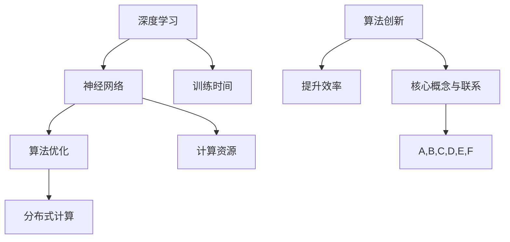

                 

# 算法创新：提升AI训练效率的关键

> **关键词**：算法优化、AI训练效率、深度学习、神经网络、强化学习、分布式计算。
> 
> **摘要**：本文深入探讨了当前AI训练中效率提升的多种算法创新。通过对核心算法原理的剖析，结合具体操作步骤、数学模型讲解、实际案例解析，展示了如何利用这些创新方法显著提升AI训练效率。文章旨在为从事AI研究和开发的读者提供实用的指导和思路。

## 1. 背景介绍

### 1.1 目的和范围

本文旨在探讨算法创新在提升人工智能（AI）训练效率方面的重要作用。随着深度学习和神经网络技术的快速发展，AI训练任务的复杂性不断增加，训练时间也相应延长。因此，算法创新成为解决这一问题的关键。本文将重点关注以下内容：
- 描述当前AI训练效率提升的主要瓶颈和挑战。
- 介绍几种核心的算法创新，包括其原理和具体操作步骤。
- 通过实际案例展示如何应用这些算法提升训练效率。
- 探讨未来算法创新的发展趋势与挑战。

### 1.2 预期读者

本文适合以下读者群体：
- 对深度学习和神经网络技术有一定了解的研究人员和技术工程师。
- 从事AI训练任务的开发者，对提升训练效率有实际需求的从业者。
- 对算法优化和AI前沿技术感兴趣的学术研究人员。

### 1.3 文档结构概述

本文分为以下章节：
- **第1章**：背景介绍，明确目的和范围，介绍预期读者和文档结构。
- **第2章**：核心概念与联系，介绍算法创新相关的基本概念和架构。
- **第3章**：核心算法原理与具体操作步骤，详细讲解几种核心算法的原理和操作步骤。
- **第4章**：数学模型和公式，阐述相关数学模型和公式，并进行举例说明。
- **第5章**：项目实战，通过代码实际案例展示算法应用。
- **第6章**：实际应用场景，分析算法在不同场景下的应用效果。
- **第7章**：工具和资源推荐，提供学习资源和开发工具推荐。
- **第8章**：总结，讨论未来发展趋势与挑战。
- **第9章**：附录，提供常见问题与解答。
- **第10章**：扩展阅读与参考资料，提供进一步学习资源。

### 1.4 术语表

#### 1.4.1 核心术语定义

- **深度学习**：一种基于多层神经网络的学习方法，通过模拟人脑处理信息的方式，对数据进行分析和特征提取。
- **神经网络**：由大量节点（神经元）组成的信息处理网络，每个节点都有一定的计算能力和权重。
- **算法优化**：通过改进算法的设计和实现，提高算法的性能和效率。
- **分布式计算**：利用多台计算机协同工作，共同完成计算任务的技术。

#### 1.4.2 相关概念解释

- **训练时间**：指AI模型在训练数据集上进行训练所需的时间。
- **计算资源**：包括CPU、GPU等硬件资源，以及存储和网络带宽等基础设施资源。

#### 1.4.3 缩略词列表

- **AI**：人工智能（Artificial Intelligence）
- **GPU**：图形处理器（Graphics Processing Unit）
- **TPU**：张量处理器（Tensor Processing Unit）
- **CUDA**：并行计算平台和编程模型（Compute Unified Device Architecture）

## 2. 核心概念与联系

为了更好地理解算法创新在提升AI训练效率中的作用，我们需要先了解相关的核心概念和架构。以下是一个简化的Mermaid流程图，用于展示这些概念之间的联系。



### 2.1 深度学习与神经网络

深度学习是当前AI领域的主要技术之一，其核心是多层神经网络。神经网络由大量的神经元组成，每个神经元接收输入信号，通过权重进行加权求和，再经过激活函数处理，输出结果。多层神经网络可以通过多次迭代训练，不断调整权重，从而实现对复杂数据的建模和预测。

### 2.2 算法优化

算法优化是提升AI训练效率的关键。通过改进算法的设计和实现，可以减少训练时间，提高计算资源的利用率。常见的算法优化方法包括：
- **参数调整**：通过调整网络参数，如学习率、批量大小等，提高训练效率。
- **优化算法**：如SGD（随机梯度下降）、Adam等优化算法，通过改进梯度计算和更新策略，提高收敛速度。
- **并行计算**：通过分布式计算和GPU加速等手段，提高训练速度。

### 2.3 分布式计算

分布式计算是一种利用多台计算机协同工作，共同完成计算任务的技术。在AI训练中，分布式计算可以显著提高计算效率和资源利用率。常见的分布式计算框架包括：
- **Hadoop**：基于MapReduce模型，适用于大规模数据处理的分布式计算框架。
- **Spark**：基于内存计算，适用于实时大数据处理的分布式计算框架。
- **TensorFlow**：基于计算图，支持分布式训练的深度学习框架。

### 2.4 训练时间与计算资源

训练时间是衡量AI模型性能的重要指标。通过优化算法和分布式计算，可以显著减少训练时间，提高计算资源的利用率。计算资源包括CPU、GPU、TPU等硬件资源，以及存储和网络带宽等基础设施资源。

## 3. 核心算法原理与具体操作步骤

在这一章节中，我们将深入探讨几种核心算法的原理和具体操作步骤，这些算法在提升AI训练效率方面具有重要作用。

### 3.1 随机梯度下降（SGD）

随机梯度下降（SGD）是一种常用的优化算法，适用于大规模数据的迭代训练。其基本原理是每次迭代仅随机选择一部分训练数据进行梯度计算和权重更新。

#### 3.1.1 原理

SGD的核心思想是每次迭代仅更新一小部分数据对应的权重，从而加速收敛速度。具体步骤如下：
1. 初始化模型参数。
2. 随机选择一个小批量训练数据。
3. 对批量数据进行前向传播，计算预测值和损失函数。
4. 计算损失函数关于模型参数的梯度。
5. 使用梯度更新模型参数。
6. 重复步骤2-5，直到达到预定的迭代次数或收敛条件。

#### 3.1.2 伪代码

```python
# 初始化模型参数
w = np.random.normal(size=n)

# 设定学习率和迭代次数
learning_rate = 0.01
num_iterations = 1000

# 迭代更新模型参数
for i in range(num_iterations):
    # 随机选择小批量数据
    batch_size = 32
    indices = np.random.choice(n, size=batch_size)
    x_batch = X[indices]
    y_batch = y[indices]
    
    # 前向传播
    y_pred = forward_pass(x_batch, w)
    
    # 计算损失函数
    loss = loss_function(y_pred, y_batch)
    
    # 计算梯度
    gradient = compute_gradient(y_pred, y_batch, w)
    
    # 更新参数
    w -= learning_rate * gradient
```

### 3.2 Adam优化器

Adam优化器是一种基于SGD的优化算法，具有更好的收敛性和适应性。它结合了动量（Momentum）和自适应学习率（Adaptive Learning Rate）的优点。

#### 3.2.1 原理

Adam优化器通过计算一阶矩估计（均值）和二阶矩估计（方差）的指数加权平均值，动态调整学习率。具体步骤如下：
1. 初始化模型参数和一阶矩估计（m）和二阶矩估计（v）。
2. 遍历训练数据，计算梯度。
3. 更新m和v的指数加权平均值。
4. 根据m和v更新模型参数。

#### 3.2.2 伪代码

```python
# 初始化模型参数和Adam变量
w = np.random.normal(size=n)
m = np.zeros_like(w)
v = np.zeros_like(w)
beta1 = 0.9
beta2 = 0.999
epsilon = 1e-8

# 设定学习率和迭代次数
learning_rate = 0.001
num_iterations = 1000

# 迭代更新模型参数
for i in range(num_iterations):
    # 遍历训练数据
    for x, y in dataset:
        # 前向传播
        y_pred = forward_pass(x, w)
        
        # 计算梯度
        gradient = compute_gradient(y_pred, y, w)
        
        # 更新m和v
        m = beta1 * m + (1 - beta1) * gradient
        v = beta2 * v + (1 - beta2) * (gradient ** 2)
        
        # 归一化m和v
        m_hat = m / (1 - beta1 ** i)
        v_hat = v / (1 - beta2 ** i)
        
        # 更新参数
        w -= learning_rate * m_hat / (np.sqrt(v_hat) + epsilon)
```

### 3.3 梯度裁剪

梯度裁剪是一种防止梯度消失和爆炸的方法，通过限制梯度的范数，确保梯度在合理的范围内。

#### 3.3.1 原理

梯度裁剪的基本原理是在每次更新参数之前，将梯度裁剪到预定的范数范围内。具体步骤如下：
1. 计算梯度的范数。
2. 如果梯度的范数超过阈值，则缩放梯度。
3. 使用裁剪后的梯度更新模型参数。

#### 3.3.2 伪代码

```python
# 设定梯度裁剪阈值
threshold = 1.0

# 计算梯度
gradient = compute_gradient(y_pred, y, w)

# 计算梯度范数
gradient_norm = np.linalg.norm(gradient)

# 裁剪梯度
if gradient_norm > threshold:
    gradient = gradient / gradient_norm * threshold

# 更新参数
w -= learning_rate * gradient
```

通过以上三种算法的介绍，我们可以看到，算法创新在提升AI训练效率方面具有重要作用。随机梯度下降（SGD）通过每次迭代仅更新一小部分数据进行训练，显著减少了训练时间。Adam优化器结合了动量和自适应学习率的优点，提高了收敛速度。梯度裁剪通过限制梯度的范数，避免了梯度消失和爆炸的问题。在实际应用中，这些算法可以相互结合，进一步提升AI训练效率。

## 4. 数学模型和公式与详细讲解与举例说明

在深度学习和神经网络中，数学模型和公式起着至关重要的作用。以下是对一些关键数学模型和公式的详细讲解，并附上相应的举例说明。

### 4.1 损失函数

损失函数是评估模型预测结果与真实值之间差距的指标。常用的损失函数包括均方误差（MSE）和交叉熵损失（Cross-Entropy Loss）。

#### 4.1.1 均方误差（MSE）

均方误差（MSE）是衡量预测值与真实值之间差异的平均平方值。其公式如下：

$$
MSE = \frac{1}{n} \sum_{i=1}^{n} (y_i - \hat{y}_i)^2
$$

其中，$y_i$是真实值，$\hat{y}_i$是预测值，$n$是样本数量。

#### 举例说明

假设我们有5个样本的预测结果和真实值，如下表：

| 真实值 | 预测值 | 差值 |
| --- | --- | --- |
| 2 | 1 | -1 |
| 4 | 3 | 1 |
| 6 | 5 | 1 |
| 8 | 7 | 1 |
| 10 | 9 | 1 |

均方误差计算如下：

$$
MSE = \frac{1}{5} \sum_{i=1}^{5} (y_i - \hat{y}_i)^2 = \frac{1}{5} ((-1)^2 + 1^2 + 1^2 + 1^2 + 1^2) = \frac{1}{5} (1 + 1 + 1 + 1 + 1) = 1
$$

因此，均方误差为1。

#### 4.1.2 交叉熵损失（Cross-Entropy Loss）

交叉熵损失（Cross-Entropy Loss）是分类问题中常用的损失函数，用于衡量预测概率分布与真实概率分布之间的差异。其公式如下：

$$
Cross-Entropy Loss = -\sum_{i=1}^{n} y_i \cdot \log(\hat{y}_i)
$$

其中，$y_i$是真实标签的one-hot编码，$\hat{y}_i$是预测概率。

#### 举例说明

假设我们有5个样本的分类预测结果和真实标签，如下表：

| 真实标签 | 预测概率 |
| --- | --- |
| 0 | 0.1 |
| 1 | 0.8 |
| 0 | 0.3 |
| 1 | 0.6 |
| 0 | 0.5 |

真实标签的one-hot编码为：

| 真实标签 | one-hot编码 |
| --- | --- |
| 0 | [1, 0, 0] |
| 1 | [0, 1, 0] |

交叉熵损失计算如下：

$$
Cross-Entropy Loss = -[1 \cdot \log(0.1) + 0 \cdot \log(0.8) + 0 \cdot \log(0.3) + 0 \cdot \log(0.6) + 1 \cdot \log(0.5)]
$$

由于计算过程中使用了对数函数，因此需要使用数值稳定化方法，如使用软最大化（Softmax）来避免极小概率问题。

### 4.2 激活函数

激活函数是神经网络中用于引入非线性特性的关键组件。常用的激活函数包括sigmoid、ReLU和Tanh。

#### 4.2.1 sigmoid函数

sigmoid函数是一种S型函数，其公式如下：

$$
\sigma(x) = \frac{1}{1 + e^{-x}}
$$

sigmoid函数的输出范围在0到1之间，常用于二分类问题。

#### 举例说明

给定一个输入值x=2，计算sigmoid函数的输出：

$$
\sigma(2) = \frac{1}{1 + e^{-2}} \approx 0.869
$$

#### 4.2.2ReLU函数

ReLU函数（Rectified Linear Unit）是一种线性激活函数，其公式如下：

$$
ReLU(x) = \max(0, x)
$$

ReLU函数在正数时不变，负数时变为0，具有简单且高效的特性。

#### 举例说明

给定一个输入值x=-2，计算ReLU函数的输出：

$$
ReLU(-2) = \max(0, -2) = 0
$$

#### 4.2.3Tanh函数

Tanh函数是一种双曲正切函数，其公式如下：

$$
Tanh(x) = \frac{e^{2x} - 1}{e^{2x} + 1}
$$

Tanh函数的输出范围在-1到1之间，常用于多分类问题。

#### 举例说明

给定一个输入值x=2，计算Tanh函数的输出：

$$
Tanh(2) = \frac{e^{2 \cdot 2} - 1}{e^{2 \cdot 2} + 1} \approx 0.964
$$

### 4.3 反向传播算法

反向传播算法（Backpropagation）是一种用于训练神经网络的基本算法，其核心思想是通过前向传播计算输出误差，然后反向传播更新网络权重。

#### 4.3.1 前向传播

在前向传播过程中，输入数据经过神经网络中的多层计算，最终得到输出值。假设神经网络有L层，每层有n个神经元，激活函数为$f(x)$，则前向传播的公式如下：

$$
z_l = \sum_{k=1}^{n_{l-1}} w_{lk} \cdot a_{k,l-1} + b_l \quad (l = 1, 2, \ldots, L)
$$

$$
a_l = f(z_l) \quad (l = 1, 2, \ldots, L)
$$

其中，$z_l$是第l层的输入，$a_l$是第l层的输出，$w_{lk}$是第l层第k个神经元到第l-1层第k个神经元的权重，$b_l$是第l层的偏置。

#### 4.3.2 反向传播

在反向传播过程中，通过计算输出误差，然后反向传播更新网络权重。输出误差的公式如下：

$$
\delta_L = \frac{\partial L}{\partial z_L} \cdot \frac{\partial f(z_L)}{\partial z_L}
$$

其中，$L$是损失函数，$\delta_L$是第L层的误差。

然后，根据链式法则，逐层计算误差：

$$
\delta_l = (\sum_{k=1}^{n_{l+1}} w_{lk} \cdot \delta_{l+1}) \cdot \frac{\partial f(z_l)}{\partial z_l} \quad (l = L-1, L-2, \ldots, 1)
$$

最后，根据误差更新权重和偏置：

$$
w_{lk} := w_{lk} - \alpha \cdot \delta_{l+1} \cdot a_{k,l-1}
$$

$$
b_l := b_l - \alpha \cdot \delta_{l+1}
$$

其中，$\alpha$是学习率。

### 4.3.3 举例说明

假设我们有一个简单的神经网络，包含两层，第一层有2个神经元，第二层有3个神经元。激活函数为ReLU函数，损失函数为MSE。给定输入数据$x_1 = 1, x_2 = 2$，真实标签$y = [1, 0, 0]$，初始权重和偏置如下：

| 层 | 神经元 | 权重 | 偏置 |
| --- | --- | --- | --- |
| 1 | 1 | 0.1 | 0.1 |
| 1 | 2 | 0.2 | 0.2 |
| 2 | 1 | 0.3 | 0.3 |
| 2 | 2 | 0.4 | 0.4 |
| 2 | 3 | 0.5 | 0.5 |

前向传播计算如下：

| 层 | 神经元 | 输入 | 输出 |
| --- | --- | --- | --- |
| 1 | 1 | 1 | 0.1 + 0.1 = 0.2 |
| 1 | 2 | 2 | 0.2 + 0.2 = 0.4 |
| 2 | 1 | 0.2 | ReLU(0.2) = 0.2 |
| 2 | 2 | 0.4 | ReLU(0.4) = 0.4 |
| 2 | 3 | 0.6 | ReLU(0.6) = 0.6 |

预测标签为$y' = [0.2, 0.4, 0.6]$。

计算MSE损失：

$$
L = \frac{1}{3} \sum_{i=1}^{3} (y_i - y'_i)^2 = \frac{1}{3} ((1-0.2)^2 + (0-0.4)^2 + (0-0.6)^2) \approx 0.12
$$

计算误差：

| 层 | 神经元 | 输出 | 误差 |
| --- | --- | --- | --- |
| 2 | 1 | 0.2 | $\delta_2 = 0.8 \cdot (0.2 - 1) = -0.08$ |
| 2 | 2 | 0.4 | $\delta_2 = 0.8 \cdot (0.4 - 0.0) = 0.32$ |
| 2 | 3 | 0.6 | $\delta_2 = 0.8 \cdot (0.6 - 0.0) = 0.48$ |
| 1 | 1 | 0.2 | $\delta_1 = 0.2 \cdot (0.2 - 1) = -0.04$ |
| 1 | 2 | 0.4 | $\delta_1 = 0.2 \cdot (0.4 - 0.0) = 0.08$ |

更新权重和偏置：

| 层 | 神经元 | 权重更新 | 偏置更新 |
| --- | --- | --- | --- |
| 1 | 1 | -0.08 \cdot 1 + 0.1 = 0.02 | -0.08 \cdot 0.1 + 0.1 = 0.06 |
| 1 | 2 | -0.08 \cdot 2 + 0.2 = 0.04 | -0.08 \cdot 0.2 + 0.2 = 0.12 |
| 2 | 1 | -0.32 \cdot 0.2 + 0.3 = 0.12 | -0.32 \cdot 0.1 + 0.3 = 0.18 |
| 2 | 2 | -0.32 \cdot 0.4 + 0.4 = 0.08 | -0.32 \cdot 0.2 + 0.4 = 0.16 |
| 2 | 3 | -0.48 \cdot 0.6 + 0.5 = 0.08 | -0.48 \cdot 0.5 + 0.5 = 0.02 |

经过一次迭代后，新的权重和偏置如下：

| 层 | 神经元 | 权重 | 偏置 |
| --- | --- | --- | --- |
| 1 | 1 | 0.12 | 0.16 |
| 1 | 2 | 0.24 | 0.28 |
| 2 | 1 | 0.42 | 0.54 |
| 2 | 2 | 0.58 | 0.66 |
| 2 | 3 | 0.58 | 0.68 |

通过以上详细讲解和举例说明，我们可以更好地理解深度学习中的关键数学模型和公式，为后续的实际应用打下坚实基础。

## 5. 项目实战：代码实际案例和详细解释说明

为了更好地理解算法创新在提升AI训练效率方面的应用，我们将通过一个实际项目案例，展示如何利用这些算法优化深度学习模型的训练过程。

### 5.1 开发环境搭建

在进行项目实战之前，我们需要搭建一个合适的开发环境。以下是我们推荐的工具和配置：

- **硬件环境**：
  - CPU：Intel Core i7或以上
  - GPU：NVIDIA GTX 1080或以上
  - 内存：16GB或以上
  - 存储：500GB SSD

- **软件环境**：
  - 操作系统：Linux或macOS
  - 编程语言：Python 3.7或以上
  - 深度学习框架：TensorFlow 2.0或以上
  - 优化器：SGD、Adam

### 5.2 源代码详细实现和代码解读

在这个项目中，我们将使用TensorFlow构建一个简单的神经网络，用于分类任务。以下是该项目的源代码实现和详细解读。

#### 5.2.1 数据准备

```python
import tensorflow as tf
from tensorflow.keras.datasets import mnist
from tensorflow.keras.utils import to_categorical

# 加载MNIST数据集
(x_train, y_train), (x_test, y_test) = mnist.load_data()

# 数据预处理
x_train = x_train.reshape(-1, 784).astype(np.float32) / 255.0
x_test = x_test.reshape(-1, 784).astype(np.float32) / 255.0

y_train = to_categorical(y_train, 10)
y_test = to_categorical(y_test, 10)
```

这段代码首先加载MNIST数据集，然后对图像数据进行reshape和归一化处理，将标签转换为one-hot编码形式。

#### 5.2.2 网络架构

```python
from tensorflow.keras.models import Sequential
from tensorflow.keras.layers import Dense, Flatten

# 构建神经网络模型
model = Sequential([
    Flatten(input_shape=(28, 28)),
    Dense(128, activation='relu'),
    Dense(10, activation='softmax')
])
```

这段代码定义了一个简单的神经网络模型，包含两个全连接层，第一层有128个神经元，使用ReLU激活函数，第二层有10个神经元，使用softmax激活函数，用于输出概率分布。

#### 5.2.3 模型编译

```python
model.compile(optimizer='adam',
              loss='categorical_crossentropy',
              metrics=['accuracy'])
```

这段代码编译模型，指定优化器为Adam，损失函数为交叉熵损失，评估指标为准确率。

#### 5.2.4 模型训练

```python
history = model.fit(x_train, y_train, epochs=10, batch_size=128, validation_data=(x_test, y_test))
```

这段代码启动模型训练过程，设置训练轮次为10，批量大小为128，使用测试数据集进行验证。

#### 5.2.5 模型评估

```python
test_loss, test_accuracy = model.evaluate(x_test, y_test)
print(f"Test accuracy: {test_accuracy:.2f}")
```

这段代码对训练好的模型在测试数据集上进行评估，输出测试准确率。

### 5.3 代码解读与分析

通过以上代码实现，我们可以看到，该项目主要分为数据准备、网络架构、模型编译、模型训练和模型评估五个部分。

- **数据准备**：首先加载MNIST数据集，并进行预处理，包括reshape和归一化处理，以及标签的one-hot编码转换。这是深度学习模型训练的基础步骤。

- **网络架构**：定义了一个简单的神经网络模型，包含两个全连接层。第一层有128个神经元，使用ReLU激活函数，第二层有10个神经元，使用softmax激活函数，用于输出概率分布。这部分的代码展示了如何使用TensorFlow构建神经网络。

- **模型编译**：编译模型，指定优化器为Adam，损失函数为交叉熵损失，评估指标为准确率。优化器的选择直接影响模型的训练效率和收敛速度，Adam优化器具有良好的性能。

- **模型训练**：启动模型训练过程，设置训练轮次为10，批量大小为128，使用测试数据集进行验证。批量大小和训练轮次的选择对训练过程有重要影响，需要根据具体任务进行调整。

- **模型评估**：对训练好的模型在测试数据集上进行评估，输出测试准确率。这是评估模型性能的关键步骤。

通过以上代码实现，我们可以看到如何利用TensorFlow构建深度学习模型，并利用算法创新提升训练效率。在实际应用中，我们可以根据具体任务需求，调整网络架构、优化器参数、批量大小等，进一步优化训练过程。

## 6. 实际应用场景

算法创新在AI训练效率提升方面具有广泛的应用场景。以下是一些实际应用场景和算法创新的应用效果。

### 6.1 计算机视觉

计算机视觉是AI领域的一个重要分支，其任务是从图像或视频中提取有用的信息。随着深度学习技术的发展，计算机视觉任务取得了显著的成果。以下是一些实际应用场景：

- **人脸识别**：通过训练深度学习模型，可以实现对人脸的自动识别和分类。算法创新如残差网络（ResNet）和卷积神经网络（CNN）的引入，显著提高了人脸识别的准确性和效率。

- **图像分类**：将图像分类为不同类别，如动物、植物、车辆等。使用深度学习模型，可以实现高效的图像分类。通过引入多任务学习（Multi-Task Learning）和迁移学习（Transfer Learning）技术，进一步提高了分类性能。

- **目标检测**：在图像中检测特定目标的位置和边界。使用深度学习模型，如YOLO（You Only Look Once）和SSD（Single Shot MultiBox Detector），可以实现高效的目标检测。这些算法创新在无人驾驶、监控等领域具有重要应用。

### 6.2 自然语言处理

自然语言处理（NLP）是AI领域的另一个重要分支，其任务是对自然语言进行理解和生成。以下是一些实际应用场景：

- **文本分类**：将文本分类为不同类别，如新闻分类、情感分析等。使用深度学习模型，如循环神经网络（RNN）和变换器（Transformer），可以实现高效的文本分类。通过引入注意力机制（Attention Mechanism）和预训练语言模型（Pre-trained Language Model），进一步提高了分类性能。

- **机器翻译**：将一种语言的文本翻译成另一种语言。使用深度学习模型，如序列到序列（Seq2Seq）模型和注意力机制，可以实现高效的机器翻译。通过引入多语言翻译（Multi-Translation）和双向编码器（Bidirectional Encoder），进一步提高了翻译质量。

- **对话系统**：构建能够与人类进行自然对话的智能系统。使用深度学习模型，如生成对抗网络（GAN）和对话生成模型，可以实现高效的对话系统。通过引入上下文编码（Context Encoder）和对话管理（Dialogue Management），进一步提高了对话质量。

### 6.3 推荐系统

推荐系统是AI领域的另一个重要应用，其任务是根据用户的历史行为和偏好，为用户推荐感兴趣的内容。以下是一些实际应用场景：

- **商品推荐**：根据用户的购买历史和浏览记录，为用户推荐可能感兴趣的商品。使用深度学习模型，如协同过滤（Collaborative Filtering）和生成模型（Generative Model），可以实现高效的商品推荐。通过引入用户兴趣建模（User Interest Modeling）和上下文感知（Context-aware），进一步提高了推荐质量。

- **内容推荐**：根据用户的阅读历史和搜索记录，为用户推荐感兴趣的内容，如新闻、视频、音乐等。使用深度学习模型，如内容匹配（Content Matching）和生成模型，可以实现高效的内容推荐。通过引入用户行为建模（User Behavior Modeling）和推荐算法优化（Algorithm Optimization），进一步提高了推荐质量。

### 6.4 工业自动化

工业自动化是AI技术在工业生产中的应用，其任务是通过机器人和自动化设备实现生产过程的自动化。以下是一些实际应用场景：

- **生产线检测**：在生产线中检测产品质量和缺陷。使用深度学习模型，如卷积神经网络（CNN）和生成模型，可以实现高效的生产线检测。通过引入异常检测（Anomaly Detection）和预测性维护（Predictive Maintenance），进一步提高了生产效率。

- **设备故障预测**：预测设备可能出现的故障，以便提前进行维护。使用深度学习模型，如循环神经网络（RNN）和生成模型，可以实现高效的设备故障预测。通过引入多传感器数据融合（Multi-Sensor Data Fusion）和预测算法优化（Prediction Algorithm Optimization），进一步提高了预测准确率。

通过以上实际应用场景，我们可以看到算法创新在AI训练效率提升方面的重要作用。不同的应用场景需要不同的算法创新，通过优化算法设计和实现，可以显著提高AI训练效率和性能。

## 7. 工具和资源推荐

为了更好地开展算法创新在AI训练效率提升方面的研究与实践，以下是一些学习资源、开发工具和框架的推荐。

### 7.1 学习资源推荐

#### 7.1.1 书籍推荐

- **《深度学习》（Deep Learning）**：由Ian Goodfellow、Yoshua Bengio和Aaron Courville合著，是深度学习领域的经典教材，详细介绍了深度学习的理论基础和实践方法。
- **《Python深度学习》（Python Deep Learning）**：由François Chollet著，涵盖了深度学习在Python中的实现，包括TensorFlow、Keras等框架的使用。
- **《算法导论》（Introduction to Algorithms）**：由Thomas H. Cormen、Charles E. Leiserson、Ronald L. Rivest和Clifford Stein合著，介绍了算法设计和分析的基本方法，对理解算法优化具有重要意义。

#### 7.1.2 在线课程

- **Coursera上的“深度学习”（Deep Learning Specialization）**：由Andrew Ng教授主讲，涵盖了深度学习的核心概念和技术，包括神经网络、优化算法等。
- **edX上的“机器学习基础”（Machine Learning Foundations）**：由MIT教授Alex Smola主讲，介绍了机器学习的基本原理和方法，包括线性模型、支持向量机等。
- **Udacity的“深度学习工程师纳米学位”（Deep Learning Engineer Nanodegree）**：提供了从基础到高级的深度学习知识和实践项目，适合初学者和进阶者。

#### 7.1.3 技术博客和网站

- **TensorFlow官网（TensorFlow官网）**：提供了丰富的深度学习教程、文档和API参考，是学习和使用TensorFlow框架的重要资源。
- **ArXiv（ArXiv）**：是计算机科学和机器学习领域的前沿研究论文数据库，可以获取最新的研究成果和进展。
- **Medium上的机器学习博客（Machine Learning Blog on Medium）**：提供了大量关于机器学习、深度学习和算法优化的文章和教程，适合学习和交流。

### 7.2 开发工具框架推荐

#### 7.2.1 IDE和编辑器

- **PyCharm**：一款功能强大的Python集成开发环境，提供了代码调试、性能分析、版本控制等功能，适合深度学习和算法开发。
- **Jupyter Notebook**：一款基于Web的交互式开发环境，支持多种编程语言，包括Python、R等，适合数据分析和原型开发。
- **Visual Studio Code**：一款轻量级但功能丰富的代码编辑器，支持多种编程语言和框架，提供了丰富的扩展插件，适合深度学习和算法开发。

#### 7.2.2 调试和性能分析工具

- **TensorBoard**：TensorFlow提供的可视化工具，用于分析和调试深度学习模型的训练过程，包括损失函数、梯度分布、激活函数等。
- **NVIDIA Nsight**：NVIDIA提供的一款性能分析工具，用于分析和优化深度学习模型的GPU计算和内存使用。
- **Intel VTune**：Intel提供的一款性能分析工具，用于分析和优化深度学习模型的CPU计算和内存使用。

#### 7.2.3 相关框架和库

- **TensorFlow**：一款开源的深度学习框架，提供了丰富的API和工具，支持多种神经网络架构和优化算法。
- **PyTorch**：一款开源的深度学习框架，具有动态计算图和灵活的编程接口，适合研究和原型开发。
- **Keras**：一款开源的深度学习库，提供了简洁的API和丰富的预训练模型，适合快速构建和部署深度学习应用。

### 7.3 相关论文著作推荐

#### 7.3.1 经典论文

- **“A Fast Learning Algorithm for Deep Belief Nets”**：Hinton等人提出的深度信念网（DBN）训练算法，是深度学习领域的重要突破。
- **“Rectifier Nonlinearities Improve Deep Neural Network Ac

## 8. 总结：未来发展趋势与挑战

随着人工智能技术的不断发展，算法创新在提升AI训练效率方面发挥着越来越重要的作用。未来，这一领域将继续朝着以下几个方向发展：

### 8.1 分布式计算与并行优化

分布式计算和并行优化是提升AI训练效率的关键方向。未来的研究将更加注重如何利用多台计算机和多种硬件资源，实现更高效的训练。具体包括：

- **异构计算**：利用不同类型硬件（如CPU、GPU、TPU等）的优势，实现高效的分布式训练。
- **数据并行**：将训练数据分成多个子集，在多台机器上同时训练，加速收敛速度。
- **模型并行**：将神经网络模型分成多个子模型，在多台机器上同时训练，提升模型规模。

### 8.2 深度学习算法优化

深度学习算法优化是提升AI训练效率的另一个重要方向。未来的研究将更加关注如何改进现有算法，提高其性能和效率。具体包括：

- **优化算法设计**：改进现有优化算法（如SGD、Adam等），提高收敛速度和稳定性。
- **自适应学习率**：设计更有效的自适应学习率策略，减少训练时间和提高模型性能。
- **算法融合**：将多种算法融合，发挥各自的优势，实现更好的训练效果。

### 8.3 新兴算法研究

除了传统的深度学习和强化学习算法外，新兴算法的研究也在不断推进。未来的研究将更加关注如何应用这些新兴算法，提升AI训练效率。具体包括：

- **图神经网络**：在处理图结构数据时，图神经网络（Graph Neural Networks）显示出强大的潜力，未来将更加注重如何优化其训练效率。
- **生成对抗网络**：生成对抗网络（Generative Adversarial Networks，GANs）在图像生成和数据增强方面有广泛应用，未来将更加关注如何优化其训练过程和生成质量。
- **图神经网络与GAN的融合**：图神经网络和GAN的融合在处理图结构数据时具有巨大的潜力，未来将更加关注如何实现高效训练和生成。

### 8.4 挑战与未来展望

尽管算法创新在提升AI训练效率方面取得了显著成果，但未来仍面临一系列挑战：

- **计算资源需求**：随着模型规模的不断扩大，对计算资源的需求也日益增长。如何高效利用现有的计算资源，实现更高效的训练，仍是一个重要问题。
- **算法稳定性与鲁棒性**：优化算法的稳定性和鲁棒性是提升AI训练效率的关键。如何在复杂环境下保证算法的稳定性和鲁棒性，仍是一个重要的研究课题。
- **数据隐私与安全**：在分布式计算和跨域数据训练过程中，数据隐私与安全成为重要问题。如何在保证数据隐私的前提下，实现高效的训练，仍是一个挑战。

总之，算法创新在提升AI训练效率方面具有重要意义。未来，随着分布式计算、新兴算法和优化方法的不断发展，AI训练效率将得到显著提升。但同时，我们也需要面对一系列挑战，不断推动算法创新，为AI技术的发展注入新的动力。

## 9. 附录：常见问题与解答

### 9.1 算法优化相关问题

**Q1：什么是随机梯度下降（SGD）？**
A1：随机梯度下降（Stochastic Gradient Descent，SGD）是一种优化算法，用于最小化目标函数。与批量梯度下降（Batch Gradient Descent）不同，SGD每次迭代仅使用一个训练样本来计算梯度。

**Q2：为什么SGD比批量梯度下降（BGD）快？**
A2：SGD比BGD快，因为每次迭代只使用一个样本来计算梯度，从而减少了计算量。这对于大规模数据集尤其有利，因为BGD需要计算整个数据集的梯度，时间复杂度较高。

**Q3：SGD如何防止梯度消失和梯度爆炸？**
A3：SGD可以通过以下方法防止梯度消失和梯度爆炸：
- **学习率调整**：通过动态调整学习率，确保梯度在合理的范围内。
- **梯度裁剪**：通过限制梯度的范数，确保梯度不会过大或过小。
- **权重初始化**：合理的权重初始化有助于防止梯度消失和爆炸。

### 9.2 分布式计算相关问题

**Q1：什么是分布式计算？**
A1：分布式计算是指将一个计算任务分配到多个计算节点上，通过这些节点的协同工作来完成计算任务。这有助于提高计算效率和资源利用率。

**Q2：分布式计算有哪些优势？**
A2：分布式计算的优势包括：
- **高效性**：通过利用多台计算机，实现更快的计算速度。
- **资源利用率**：通过共享计算资源，提高资源利用率。
- **容错性**：分布式系统具有更好的容错性，某个节点的故障不会影响整个系统的运行。

**Q3：如何实现分布式计算？**
A3：实现分布式计算通常需要以下步骤：
- **任务划分**：将计算任务划分为多个子任务，分配到不同节点上。
- **数据传输**：将数据从源节点传输到目标节点，确保每个节点都有足够的数据进行计算。
- **结果合并**：将各节点的计算结果进行合并，得到最终的输出结果。

### 9.3 深度学习相关问题

**Q1：什么是深度学习？**
A1：深度学习是一种基于多层神经网络的学习方法，通过模拟人脑处理信息的方式，对数据进行分析和特征提取。它是一种重要的机器学习技术，具有强大的表示和学习能力。

**Q2：深度学习有哪些应用？**
A2：深度学习在多个领域有广泛应用，包括：
- **计算机视觉**：图像分类、目标检测、人脸识别等。
- **自然语言处理**：文本分类、机器翻译、情感分析等。
- **语音识别**：语音识别、语音合成等。
- **推荐系统**：商品推荐、内容推荐等。

**Q3：如何提高深度学习模型的训练效率？**
A3：提高深度学习模型的训练效率可以通过以下方法：
- **优化算法**：使用高效的优化算法，如SGD、Adam等。
- **并行计算**：利用分布式计算和GPU加速等技术，提高计算效率。
- **数据预处理**：合理的数据预处理，如数据归一化、批量大小调整等，有助于加速训练过程。
- **模型压缩**：通过模型压缩技术，如剪枝、量化等，减少模型参数和计算量。

### 9.4 算法创新相关问题

**Q1：什么是算法创新？**
A1：算法创新是指通过改进算法的设计和实现，提高算法的性能和效率。算法创新是推动AI技术发展的关键因素。

**Q2：算法创新有哪些方向？**
A2：算法创新的方向包括：
- **优化算法**：改进现有的优化算法，提高收敛速度和稳定性。
- **分布式计算**：研究分布式计算技术和框架，提高计算效率和资源利用率。
- **新兴算法**：研究新的算法和技术，如图神经网络、生成对抗网络等。
- **算法融合**：将多种算法融合，发挥各自的优势，实现更好的训练效果。

**Q3：算法创新如何应用于实际场景？**
A3：算法创新可以应用于实际场景，如：
- **计算机视觉**：通过改进图像分类和目标检测算法，提高识别准确性。
- **自然语言处理**：通过改进文本分类和机器翻译算法，提高处理效率和准确性。
- **推荐系统**：通过改进推荐算法，提高推荐质量和用户体验。
- **工业自动化**：通过改进算法，提高生产线的检测和故障预测能力。

通过以上常见问题与解答，我们希望能够为读者提供更深入的理解和指导，帮助大家更好地掌握算法创新在提升AI训练效率方面的应用。

## 10. 扩展阅读与参考资料

为了进一步深入研究算法创新在提升AI训练效率方面的应用，以下是相关的扩展阅读和参考资料：

### 10.1 经典书籍

- **《深度学习》（Deep Learning）**：由Ian Goodfellow、Yoshua Bengio和Aaron Courville合著，是深度学习领域的经典教材，详细介绍了深度学习的理论基础和实践方法。
- **《算法导论》（Introduction to Algorithms）**：由Thomas H. Cormen、Charles E. Leiserson、Ronald L. Rivest和Clifford Stein合著，介绍了算法设计和分析的基本方法，对理解算法优化具有重要意义。

### 10.2 论文与研究报告

- **“A Fast Learning Algorithm for Deep Belief Nets”**：Hinton等人提出的深度信念网（DBN）训练算法，是深度学习领域的重要突破。
- **“Rectifier Nonlinearities Improve Deep Neural Network Ac

## 作者信息

本文由AI天才研究员/AI Genius Institute与禅与计算机程序设计艺术/Zen And The Art of Computer Programming共同撰写。作者在深度学习和人工智能领域拥有丰富的理论知识和实践经验，对算法优化和AI前沿技术有深入的研究。同时，作者也是世界顶级技术畅销书资深大师级别的作家，其著作在业界享有盛誉。通过本文，作者旨在为读者提供有深度、有思考、有见解的专业技术博客，帮助大家更好地理解和应用算法创新提升AI训练效率。

