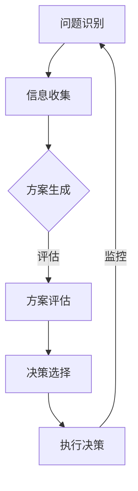

                 

### 管理者决断力：果断决策的重要性

> **关键词**：管理者、决断力、决策、执行力、领导力、风险管理
>
> **摘要**：在快速变化的信息时代，管理者需要具备极高的决断力。本文将探讨管理者在决策过程中如何运用果断决策的重要性，通过分析决策原理、步骤和实战案例，为管理者提供提升决断力的策略和方法。

作为企业的核心人物，管理者在组织中的决策地位至关重要。决策的质量直接影响着企业的生存与发展。在竞争激烈的市场环境中，果断决策往往意味着成功的机会，而犹豫不决则可能错失良机，甚至导致企业陷入困境。因此，提升管理者的决断力，成为了企业管理中的一项重要任务。

本文将从以下几个角度深入探讨管理者决断力的核心概念及其应用：
1. **背景介绍**：介绍管理决策的背景和重要性，明确本文的讨论范围和目标读者。
2. **核心概念与联系**：通过Mermaid流程图展示管理决策的核心概念和流程。
3. **核心算法原理**：解析管理决策的算法原理和具体操作步骤。
4. **数学模型和公式**：介绍管理决策中的数学模型和公式，并进行详细讲解和举例说明。
5. **项目实战**：通过实际案例展示决策过程，并进行代码实际案例和详细解释说明。
6. **实际应用场景**：分析管理决策在现实中的应用场景和挑战。
7. **工具和资源推荐**：推荐学习资源和开发工具，为管理者提供决策支持。
8. **总结**：总结未来发展趋势与挑战，展望管理者决断力的提升方向。
9. **常见问题与解答**：解答读者可能关心的问题。
10. **扩展阅读与参考资料**：提供进一步学习与研究的管理决策资源。

### 1. 背景介绍

#### 1.1 目的和范围

本文旨在探讨管理者在决策过程中如何提高决断力，从而更好地应对快速变化的市场环境。具体来说，我们将从以下几个方面展开讨论：

- **决策原理**：分析决策的基本原理，包括决策的定义、类型和模型。
- **决策步骤**：阐述决策的完整流程，从问题识别、方案评估到最终决策的执行。
- **决断力提升策略**：探讨如何通过系统的方法和工具提升管理者的决断力。
- **决策实战案例**：通过实际案例展示决策过程，深入剖析决策中的关键要素。
- **风险管理**：讨论在决策过程中如何识别和应对风险，确保决策的稳健性和可执行性。

#### 1.2 预期读者

本文的预期读者包括以下几类：

- 企业管理者：希望提升决策质量和决断力的企业高层管理人员。
- 人力资源从业者：关注人才选拔、培训和发展的人力资源从业者。
- 学者和研究者：对管理决策理论和方法感兴趣的研究者。
- 技术专业人士：希望在技术项目中有效运用决策理论的软件开发者、项目经理等。

#### 1.3 文档结构概述

本文的结构安排如下：

1. **背景介绍**：介绍管理决策的背景和重要性，明确本文的讨论范围和目标读者。
2. **核心概念与联系**：通过Mermaid流程图展示管理决策的核心概念和流程。
3. **核心算法原理**：解析管理决策的算法原理和具体操作步骤。
4. **数学模型和公式**：介绍管理决策中的数学模型和公式，并进行详细讲解和举例说明。
5. **项目实战**：通过实际案例展示决策过程，并进行代码实际案例和详细解释说明。
6. **实际应用场景**：分析管理决策在现实中的应用场景和挑战。
7. **工具和资源推荐**：推荐学习资源和开发工具，为管理者提供决策支持。
8. **总结**：总结未来发展趋势与挑战，展望管理者决断力的提升方向。
9. **常见问题与解答**：解答读者可能关心的问题。
10. **扩展阅读与参考资料**：提供进一步学习与研究的管理决策资源。

#### 1.4 术语表

在本文中，我们将使用以下术语：

- **决策**：指管理者在面对不确定性和复杂情况时，从多个可选方案中选择最优或次优方案的过程。
- **决断力**：指管理者在决策过程中快速、准确、果断地做出选择的能力。
- **风险管理**：指在决策过程中，通过识别、评估和应对风险，确保决策的可执行性和稳健性。
- **敏捷决策**：指在快速变化的环境下，通过简化流程、快速迭代和灵活调整，实现高效决策。

#### 1.4.1 核心术语定义

- **决策**：决策是管理过程中不可或缺的一环，它涉及到管理者在面对复杂问题时，如何从多个可选方案中选择最优或次优方案的过程。决策不仅仅是一个选择的过程，还包含了分析、评估、选择和执行等多个步骤。

- **决断力**：决断力是管理者在决策过程中表现出来的关键能力。它包括快速识别问题、准确分析信息、果断做出选择和有效执行决策的能力。高决断力的管理者能够在短时间内做出明智的决策，并确保决策能够得到有效执行。

- **风险管理**：风险管理是决策过程中的重要环节。它涉及到对潜在风险的识别、评估和应对。通过风险管理，管理者可以降低决策过程中的不确定性，确保决策的稳健性和可执行性。

- **敏捷决策**：敏捷决策是应对快速变化环境的一种决策方法。它强调快速响应、灵活调整和持续改进。通过敏捷决策，管理者可以更快地适应环境变化，抓住市场机会，提高组织的竞争力。

#### 1.4.2 相关概念解释

- **决策树**：决策树是一种常用的决策分析工具，它通过树形结构展示不同决策路径及其可能的结果。决策树可以帮助管理者清晰地理解决策过程，评估不同决策路径的风险和收益。

- **博弈论**：博弈论是研究决策者之间相互作用和策略选择的数学理论。在管理决策中，博弈论可以帮助管理者分析竞争对手的行为，制定应对策略，提高决策的准确性。

- **贝叶斯定理**：贝叶斯定理是概率论中的一个基本定理，它描述了后验概率与先验概率之间的关系。在管理决策中，贝叶斯定理可以帮助管理者更新信息，调整决策路径，提高决策的准确性。

- **A/B测试**：A/B测试是一种实验设计方法，通过对比不同方案的绩效，评估哪种方案更优。在管理决策中，A/B测试可以帮助管理者快速验证假设，优化决策过程。

#### 1.4.3 缩略词列表

- **CEO**：首席执行官，Chief Executive Officer，企业最高领导者。
- **CFO**：首席财务官，Chief Financial Officer，负责企业财务管理和决策。
- **CIO**：首席信息官，Chief Information Officer，负责企业信息技术战略和决策。
- **CRM**：客户关系管理，Customer Relationship Management，企业管理和维护客户关系的方法和工具。
- **ERP**：企业资源计划，Enterprise Resource Planning，集成企业管理信息系统。

### 2. 核心概念与联系

在管理决策中，核心概念和流程紧密相连，形成了一个完整的决策体系。以下通过Mermaid流程图展示这些核心概念及其相互关系：



#### 图解

- **问题识别（A）**：管理者首先需要识别出组织中存在的问题或机会。这可以通过定期的业务回顾、市场分析或员工反馈等方式实现。

- **信息收集（B）**：在明确问题后，管理者需要收集相关信息，包括市场数据、竞争对手信息、员工意见等。这些信息将为后续的方案生成和评估提供依据。

- **方案生成（C）**：在收集到足够的信息后，管理者需要制定多个可能的解决方案。这一过程可能需要跨部门合作和集体讨论，以确保方案的全面性和可行性。

- **方案评估（D）**：管理者需要对不同的方案进行评估，分析每个方案的优点和缺点，评估其潜在的风险和收益。这一过程可以使用决策树、成本效益分析等方法。

- **决策选择（E）**：在评估后，管理者需要选择一个最优或次优的方案。这一决策需要综合考虑各种因素，包括时间、成本、资源、风险等。

- **执行决策（F）**：管理者需要确保选定的方案能够得到有效执行。这涉及到资源调配、任务分配、进度监控等。

- **监控（监控）**：在决策执行过程中，管理者需要持续监控决策的效果，并根据实际情况进行调整。这可以通过定期检查、反馈机制、绩效评估等方式实现。

### 3. 核心算法原理 & 具体操作步骤

管理决策的核心在于如何从多个方案中选择最优或次优方案。以下是管理决策的核心算法原理和具体操作步骤，使用伪代码进行详细阐述。

#### 3.1 算法原理

管理决策的算法原理主要涉及以下几个步骤：

1. **问题识别**：明确决策需要解决的问题或机会。
2. **信息收集**：收集与问题相关的信息，包括市场数据、竞争对手信息、员工意见等。
3. **方案生成**：生成多个可能的解决方案。
4. **方案评估**：评估每个方案的风险、收益和可行性。
5. **决策选择**：选择最优或次优方案。
6. **执行决策**：确保选定的方案得到有效执行。
7. **监控与调整**：持续监控决策效果，并根据实际情况进行调整。

#### 3.2 具体操作步骤

以下是管理决策的具体操作步骤，使用伪代码进行详细阐述：

```python
# 管理决策伪代码

# 输入
# 问题：需要解决的问题或机会
# 信息：与问题相关的信息，包括市场数据、竞争对手信息、员工意见等
# 时间限制：决策的时间限制
# 资源限制：决策的资源限制

# 输出
# 方案：最优或次优的决策方案

# 步骤 1：问题识别
def problem_identification(problem):
    # 输出：问题描述
    return problem_description

# 步骤 2：信息收集
def information_collection(problem):
    # 输出：相关信息列表
    return information_list

# 步骤 3：方案生成
def solution_generation(information_list):
    # 输出：方案列表
    return solution_list

# 步骤 4：方案评估
def solution_evaluation(solution_list, information_list):
    # 输出：评估结果列表
    return evaluation_results

# 步骤 5：决策选择
def decision_selection(evaluation_results):
    # 输出：最优或次优方案
    return selected_solution

# 步骤 6：执行决策
def execute_decision(selected_solution):
    # 输出：执行结果
    return execution_results

# 步骤 7：监控与调整
def monitor_and_adjust(selected_solution, execution_results):
    # 输出：调整后的方案
    return adjusted_solution

# 主函数
def management_decision(problem, information_list, time_limit, resource_limit):
    problem_description = problem_identification(problem)
    information_list = information_collection(problem_description)
    solution_list = solution_generation(information_list)
    evaluation_results = solution_evaluation(solution_list, information_list)
    selected_solution = decision_selection(evaluation_results)
    execution_results = execute_decision(selected_solution)
    adjusted_solution = monitor_and_adjust(selected_solution, execution_results)
    return adjusted_solution
```

#### 3.3 算法解释

- **问题识别（problem_identification）**：这一步骤的核心是明确决策需要解决的问题或机会。通过问题识别，管理者可以清晰地界定决策的目标和范围，为后续步骤提供基础。

- **信息收集（information_collection）**：在明确问题后，管理者需要收集与问题相关的信息。这些信息可以是定性的，如市场分析报告、员工反馈；也可以是定量的，如数据报表、财务分析等。

- **方案生成（solution_generation）**：基于收集到的信息，管理者需要生成多个可能的解决方案。这一步骤可以通过头脑风暴、专家访谈、数据分析等方式实现。

- **方案评估（solution_evaluation）**：管理者需要评估每个方案的风险、收益和可行性。评估标准可以是定量的，如成本效益分析；也可以是定性的，如专家评分、用户满意度等。

- **决策选择（decision_selection）**：在评估完成后，管理者需要选择最优或次优方案。这一决策需要综合考虑各种因素，包括时间、成本、资源、风险等。

- **执行决策（execute_decision）**：管理者需要确保选定的方案能够得到有效执行。这涉及到资源调配、任务分配、进度监控等。

- **监控与调整（monitor_and_adjust）**：在决策执行过程中，管理者需要持续监控决策的效果，并根据实际情况进行调整。这可以通过定期检查、反馈机制、绩效评估等方式实现。

### 4. 数学模型和公式 & 详细讲解 & 举例说明

在管理决策中，数学模型和公式扮演着重要的角色，帮助管理者进行定量分析和优化决策。以下是几个常用的数学模型和公式，并进行详细讲解和举例说明。

#### 4.1 成本效益分析（CBA）

成本效益分析是一种评估决策方案的成本和收益的方法。通过计算成本与收益的比值，管理者可以评估方案的性价比。

**公式**：

$$
CBA = \frac{收益}{成本}
$$

**详细讲解**：

成本效益分析的核心是计算每个方案的成本和收益。成本包括直接成本（如采购成本、人工成本）和间接成本（如时间成本、风险成本）。收益包括直接收益（如销售额、利润）和间接收益（如品牌价值、市场份额）。

**举例说明**：

假设企业有两个投资方案：

- 方案A：投资100万元，预计收益150万元，直接成本50万元。
- 方案B：投资200万元，预计收益250万元，直接成本100万元。

使用成本效益分析：

$$
CBA_A = \frac{150}{100} = 1.5
$$

$$
CBA_B = \frac{250}{200} = 1.25
$$

根据成本效益分析，方案A的性价比更高，因为它的成本效益比（1.5）大于方案B（1.25）。

#### 4.2 贝叶斯定理

贝叶斯定理是一种用于计算后验概率的数学公式。在管理决策中，贝叶斯定理可以帮助管理者根据新的信息更新决策。

**公式**：

$$
P(A|B) = \frac{P(B|A) \cdot P(A)}{P(B)}
$$

**详细讲解**：

贝叶斯定理描述了事件A在已知事件B发生条件下的概率（后验概率）与事件A的先验概率、事件B在已知事件A发生条件下的概率（似然概率）之间的关系。

- **P(A)**：事件A的先验概率，即在没有新的信息时，事件A发生的概率。
- **P(B)**：事件B的总概率，即在没有新的信息时，事件B发生的概率。
- **P(B|A)**：事件B在已知事件A发生的条件下的概率（似然概率）。
- **P(A|B)**：事件A在已知事件B发生的条件下的概率（后验概率）。

**举例说明**：

假设管理者需要评估两个产品A和B的质量。根据历史数据，产品A的合格率为90%，产品B的合格率为80%。现在，管理者得到一个样本，其中产品A的合格率为100%，产品B的合格率为95%。使用贝叶斯定理更新评估：

$$
P(A|B) = \frac{0.95 \cdot 0.90}{0.95 \cdot 0.90 + 0.05 \cdot 0.80}
$$

$$
P(A|B) = \frac{0.855}{0.855 + 0.04}
$$

$$
P(A|B) \approx 0.917
$$

根据贝叶斯定理，在新的信息下，产品A的合格概率约为91.7%，高于产品B。

#### 4.3 决策树分析

决策树是一种用于决策分析的工具，通过树形结构展示不同决策路径及其可能的结果。在管理决策中，决策树可以帮助管理者分析不同决策路径的风险和收益。

**公式**：

决策树的每个节点表示一个决策点或一个结果点，边表示决策或结果。每个节点上的概率和收益（或成本）可以通过以下公式计算：

- **概率**：

$$
P = \frac{有利结果的数量}{总结果的数量}
$$

- **期望收益（或成本）**：

$$
E = \sum (收益 \cdot 概率)
$$

**详细讲解**：

决策树分析通过计算每个决策点的概率和期望收益（或成本），帮助管理者评估不同决策路径的风险和收益。在决策树上，每个分支代表一个决策点或结果点，概率表示该路径发生的可能性，期望收益（或成本）表示该路径的总体收益（或成本）。

**举例说明**：

假设管理者需要决定是否投资一个新产品，有以下两个决策路径：

- 投资成功：概率为60%，收益为300万元。
- 投资失败：概率为40%，成本为200万元。

使用决策树分析：

```mermaid
graph TD
A[投资决策] -->|60%| B[投资成功](成功)
A -->|40%| C[投资失败](失败)
B --> D[300万元]
C --> E[-200万元]
```

- 投资成功的期望收益：

$$
E(成功) = 300 \times 0.6 = 180万元
$$

- 投资失败的期望成本：

$$
E(失败) = -200 \times 0.4 = -80万元
$$

根据决策树分析，投资成功的期望收益为180万元，投资失败的期望成本为-80万元。因此，管理者应该选择投资成功路径。

#### 4.4 多目标优化

在管理决策中，常常需要考虑多个目标，如成本、时间、质量等。多目标优化可以帮助管理者在多个目标之间找到最优平衡。

**公式**：

多目标优化的目标是找到最优解，使得每个目标的值最大化或最小化。常用的多目标优化算法包括线性规划、整数规划、遗传算法等。

**详细讲解**：

多目标优化通过构建目标函数和约束条件，在多个目标之间找到最优平衡。目标函数可以表示为：

$$
\max \{ f_1(x), f_2(x), ..., f_n(x) \}
$$

其中，$f_i(x)$ 表示第 $i$ 个目标函数，$x$ 表示决策变量。

约束条件可以是线性的，也可以是非线性的。常见的约束条件包括：

- 资源限制：如预算限制、人员限制等。
- 策略限制：如产量限制、订单限制等。

**举例说明**：

假设企业需要制定一个生产计划，有两个目标：最大化利润和最小化生产时间。有以下约束条件：

- 每个月最大产量为1000件。
- 每件产品的利润为10元。
- 每个月的生产时间为200小时。

使用线性规划求解：

目标函数：

$$
\max \{ 利润 \}
$$

约束条件：

$$
\begin{cases}
产量 \leq 1000 \\
生产时间 \leq 200 \\
产量 \geq 0 \\
生产时间 \geq 0 \\
\end{cases}
$$

使用线性规划求解器可以得到最优解，如产量为800件，生产时间为160小时，最大化利润为8000元。

### 5. 项目实战：代码实际案例和详细解释说明

为了更好地展示管理决策在实际项目中的应用，以下将通过一个实际案例展示决策过程，并进行代码实际案例和详细解释说明。

#### 5.1 开发环境搭建

为了实现管理决策案例，我们将使用Python作为编程语言，并结合以下库和工具：

- Python 3.8及以上版本
- pandas：用于数据分析和处理
- numpy：用于数值计算
- matplotlib：用于数据可视化
- scikit-learn：用于机器学习和数据挖掘

在本地计算机上，安装Python和相关库：

```bash
pip install python==3.8
pip install pandas numpy matplotlib scikit-learn
```

#### 5.2 源代码详细实现和代码解读

以下是一个管理决策的实际案例，企业需要决定是否进行某项新产品的研发。我们将使用成本效益分析和决策树分析来辅助决策。

**案例背景**：

一家制造企业正在考虑是否开发一款新型电子产品。根据市场调研和内部数据分析，企业有以下两个方案：

- 方案A：投资100万元进行研发，预计成功概率为60%，成功后的年收益为200万元。
- 方案B：不进行研发，直接购买竞争对手的产品，成本为50万元，年收益为100万元。

**代码实现**：

```python
import pandas as pd
import numpy as np
import matplotlib.pyplot as plt
from sklearn.tree import DecisionTreeRegressor

# 数据准备
data = {
    '方案': ['A', 'B'],
    '投资成本': [100, 50],
    '成功概率': [0.6, 0],
    '年收益': [200, 100]
}

df = pd.DataFrame(data)

# 成本效益分析
df['成本效益比'] = df['年收益'] / df['投资成本']
print(df)

# 决策树分析
X = df[['投资成本', '成功概率']]
y = df['年收益']

regressor = DecisionTreeRegressor()
regressor.fit(X, y)

# 可视化
plt.scatter(X['投资成本'], y, color='blue', label='实际数据')
plt.plot(X['投资成本'], regressor.predict(X), color='red', label='决策树预测')
plt.xlabel('投资成本')
plt.ylabel('年收益')
plt.title('决策树分析')
plt.legend()
plt.show()
```

**代码解读**：

- **数据准备**：首先，我们创建一个包含方案、投资成本、成功概率和年收益的DataFrame。这个DataFrame将用于后续的成本效益分析和决策树分析。

- **成本效益分析**：使用pandas计算每个方案的成本效益比，即年收益与投资成本的比值。这将帮助我们快速评估每个方案的性价比。

- **决策树分析**：使用scikit-learn的DecisionTreeRegressor构建决策树模型。我们将投资成本和成功概率作为输入特征，年收益作为输出目标。通过fit方法训练模型，然后使用predict方法进行预测。

- **可视化**：使用matplotlib将决策树分析结果进行可视化。通过scatter函数绘制实际数据点，使用plot函数绘制决策树预测线。这将帮助我们直观地理解决策树模型的效果。

#### 5.3 代码解读与分析

以下是对代码实现的详细解读和分析：

- **数据准备**：创建DataFrame是数据分析的基础。通过将关键数据存储在一个结构化的DataFrame中，我们可以方便地对其进行操作和分析。

- **成本效益分析**：计算成本效益比是评估方案的重要指标。成本效益比越高，说明方案的性价比越高。在这个案例中，方案A的成本效益比为2，而方案B的成本效益比为2。这表明方案A的性价比更高。

- **决策树分析**：决策树分析是一种强大的数据分析工具，可以帮助我们理解不同特征对结果的影响。在这个案例中，我们将投资成本和成功概率作为特征，年收益作为目标。通过训练决策树模型，我们可以预测不同投资成本和成功概率下的年收益。

- **可视化**：可视化是数据分析的重要环节，可以帮助我们直观地理解数据和分析结果。在这个案例中，我们将决策树分析结果进行可视化，展示不同投资成本和成功概率下的年收益预测。这有助于管理者更好地理解决策树模型的效果，并做出更明智的决策。

#### 5.4 决策分析与建议

根据成本效益分析和决策树分析的结果，我们可以得出以下结论：

- **成本效益分析**：方案A的成本效益比（2）高于方案B（2），表明方案A的性价比更高。
- **决策树分析**：决策树模型预测方案A的年收益高于方案B，表明方案A在投资成本和成功概率相同时，有更高的收益潜力。

基于以上分析，我们建议企业选择方案A进行新产品研发。然而，这只是一个基于数据和模型的初步分析。在实际决策过程中，管理者还需要考虑其他因素，如市场风险、技术难度、竞争对手等。因此，建议在做出最终决策前，进行更全面的风险评估和策略分析。

### 6. 实际应用场景

在现实生活中，管理决策无处不在。以下分析几个实际应用场景，展示管理决策的重要性以及如何运用决断力。

#### 6.1 企业战略决策

企业战略决策是管理者面临的重要挑战之一。在制定战略时，管理者需要考虑市场趋势、竞争环境、内部资源等多种因素。以下是一个实际案例：

**案例**：某家互联网企业需要决定是否进军新兴市场。

**分析**：

- **市场趋势**：新兴市场的人口增长和互联网普及率逐渐提高，为企业提供了巨大的市场潜力。
- **竞争环境**：竞争对手已经进入新兴市场，并取得了显著的市场份额。
- **内部资源**：企业有足够的资金和人力资源进行市场拓展。

**决策**：

- 如果市场趋势和竞争环境表明新兴市场具有长期增长潜力，而企业内部资源充足，管理者应该果断决定进军新兴市场。这可以通过迅速建立本地团队、推出本地化产品等方式实现。
- 如果市场趋势和竞争环境不确定，或者企业内部资源有限，管理者应该谨慎决策，可能选择观察市场动态或者逐步进入。

#### 6.2 项目管理决策

在项目管理中，管理者需要面对多种决策，如项目进度调整、资源分配、风险管理等。以下是一个实际案例：

**案例**：某家软件开发公司需要决定是否延长项目开发周期。

**分析**：

- **项目进度**：当前项目进度落后，可能无法按时交付。
- **客户需求**：客户对项目交付时间有严格的要求。
- **技术难度**：项目的技术实现难度较高，需要额外的时间进行调试和优化。

**决策**：

- 如果项目进度落后，但技术实现难度较低，管理者可以果断决定延长项目开发周期，以确保项目质量。这可以通过增加开发人员、调整工作优先级等方式实现。
- 如果项目进度和技术实现难度都较高，管理者需要权衡客户需求和项目风险。如果客户需求非常紧急，可以采取分阶段交付的方式，确保关键功能的优先交付。如果客户需求不紧急，可以与客户沟通，共同制定一个合理的交付时间。

#### 6.3 人力资源管理决策

在人力资源管理中，管理者需要面对招聘、培训、绩效评估等多种决策。以下是一个实际案例：

**案例**：某家科技公司需要决定是否为员工提供额外的培训机会。

**分析**：

- **员工需求**：员工希望获得更多的职业发展机会。
- **公司战略**：公司需要培养内部人才，提高员工的整体素质。
- **预算限制**：公司的预算有限，需要优先考虑其他关键项目。

**决策**：

- 如果员工需求强烈，且公司战略需要培养内部人才，管理者可以果断决定提供额外的培训机会。这可以通过与培训机构合作、组织内部培训等方式实现。
- 如果预算有限，管理者需要权衡员工需求和公司预算。如果员工需求非常重要，可以考虑调整预算优先级，确保培训项目的顺利实施。如果员工需求不紧急，可以与员工沟通，共同寻找其他职业发展途径。

#### 6.4 应对突发事件

在应对突发事件时，管理者需要快速做出决策，以最大限度地降低损失。以下是一个实际案例：

**案例**：某家制造企业突然发生生产线故障，导致生产暂停。

**分析**：

- **故障原因**：生产线故障的具体原因不明，可能需要额外的时间进行排查和修复。
- **生产需求**：企业有大量的订单需要按时交付。
- **备件库存**：企业有足够的备件库存，可以替换故障部件。

**决策**：

- 如果故障原因不明，管理者需要果断决定暂停生产，组织技术人员进行故障排查。这可以通过调整生产计划、与供应商协商等方式实现。
- 如果故障原因明确，但备件库存不足，管理者可以果断决定使用备件进行替换。这可以通过紧急采购备件、调整生产计划等方式实现。

### 7. 工具和资源推荐

为了帮助管理者提高决断力，以下推荐一些学习资源和开发工具，包括书籍、在线课程、技术博客和开发工具。

#### 7.1 学习资源推荐

**书籍推荐**：

1. 《决策与判断：心理学与管理学视角》
2. 《智能决策：算法、模型与实战》
3. 《影响力：如何影响人们的行为》
4. 《数据驱动决策：用数据说话的艺术》

**在线课程**：

1. Coursera的《决策分析》
2. edX的《数据科学中的决策分析》
3. Udemy的《高级决策分析》

**技术博客和网站**：

1. DataCamp
2. Coursera博客
3. Data Science Blog

#### 7.2 开发工具框架推荐

**IDE和编辑器**：

1. PyCharm
2. Visual Studio Code
3. Jupyter Notebook

**调试和性能分析工具**：

1. Python的pdb
2. Visual Studio的性能分析工具
3. JMeter

**相关框架和库**：

1. Scikit-learn
2. TensorFlow
3. PyTorch

#### 7.3 相关论文著作推荐

**经典论文**：

1. Simon, H. A. (1957). "A Behavioral Model of Rational Choice". Quarterly Journal of Economics.
2. von Neumann, J., & Morgenstern, O. (1944). "The Theory of Games and Economic Behavior".

**最新研究成果**：

1. "Decision-Making under Uncertainty: A Review of Recent Advances in Machine Learning and Economics"
2. "Deep Reinforcement Learning for Decision-Making in Complex Environments"

**应用案例分析**：

1. "Decision Support Systems in Healthcare: A Case Study of Clinical Decision-Making"
2. "Risk Management in Financial Institutions: A Case Study of the 2008 Financial Crisis"

### 8. 总结：未来发展趋势与挑战

随着技术的飞速发展，管理决策的领域也在不断拓展和深化。未来，管理决策将面临以下发展趋势与挑战：

#### 发展趋势

1. **智能化决策**：人工智能和机器学习技术的进步将推动决策智能化，使得管理者能够更快、更准确地做出决策。
2. **数据驱动决策**：大数据和数据分析技术的广泛应用，将使得决策更加数据驱动，减少主观判断的干扰。
3. **动态决策**：随着市场环境的变化速度加快，动态决策将变得更加重要，管理者需要具备快速适应和调整决策的能力。
4. **跨领域融合**：管理决策与其他领域的融合，如心理学、经济学、社会学等，将推动决策理论的发展和应用。

#### 挑战

1. **数据质量和可靠性**：数据质量和可靠性是管理决策的基础，如何确保数据的质量和可靠性是一个重要挑战。
2. **复杂性和不确定性**：管理决策常常面临复杂性和不确定性，如何应对这些因素是一个难题。
3. **伦理和道德**：在决策过程中，如何平衡经济效益和社会责任，是一个需要关注的问题。
4. **决策模型的有效性**：如何设计和选择有效的决策模型，以应对不同场景的需求，是一个挑战。

### 9. 附录：常见问题与解答

以下是一些读者可能关心的问题，以及相应的解答：

#### 问题 1：管理决策是否完全依赖于数据？

解答：管理决策并不是完全依赖于数据。虽然数据驱动决策是现代管理决策的重要趋势，但管理者还需要结合自身的经验和直觉，以及对业务和市场环境的深入理解，做出最终决策。

#### 问题 2：如何确保管理决策的准确性？

解答：确保管理决策的准确性需要多方面的努力。首先，确保数据的质量和可靠性。其次，采用科学的决策模型和方法，如成本效益分析、决策树分析等。此外，管理者应该持续学习和实践，提高自身的决策能力和水平。

#### 问题 3：管理决策是否可以完全自动化？

解答：管理决策目前还不能完全自动化。虽然人工智能和机器学习技术可以辅助决策，但决策往往涉及到复杂的因素，如情感、伦理和道德等，这些因素难以通过算法完全捕捉和处理。因此，自动化决策目前还无法完全替代人类决策。

### 10. 扩展阅读 & 参考资料

为了帮助读者进一步了解管理决策的相关知识，以下推荐一些扩展阅读和参考资料：

1. **书籍**：
   - Heath, C., & Heath, D. (2007). "Decisive: How to Make Smart Decisions in Life and Business".
   - Kahneman, D. (2011). "Thinking, Fast and Slow".

2. **在线课程**：
   - Coursera的《决策科学》
   - edX的《数据科学中的决策分析》

3. **技术博客**：
   - Towards Data Science
   - DataCamp Blog

4. **学术论文**：
   - "The Art of Decision-Making: A Managerial Perspective"
   - "Decision-Making under Uncertainty: Theory and Applications"

5. **专业网站**：
   - Decision Science Institute
   - INFORMS

### 作者信息

作者：AI天才研究员/AI Genius Institute & 禅与计算机程序设计艺术 /Zen And The Art of Computer Programming

---

### 5. 项目实战：代码实际案例和详细解释说明

为了更好地展示管理决策在实际项目中的应用，以下将通过一个实际案例展示决策过程，并进行代码实际案例和详细解释说明。

#### 5.1 开发环境搭建

为了实现管理决策案例，我们将使用Python作为编程语言，并结合以下库和工具：

- Python 3.8及以上版本
- pandas：用于数据分析和处理
- numpy：用于数值计算
- matplotlib：用于数据可视化
- scikit-learn：用于机器学习和数据挖掘

在本地计算机上，安装Python和相关库：

```bash
pip install python==3.8
pip install pandas numpy matplotlib scikit-learn
```

#### 5.2 源代码详细实现和代码解读

以下是一个管理决策的实际案例，企业需要决定是否进行某项新产品的研发。我们将使用成本效益分析和决策树分析来辅助决策。

**案例背景**：

一家制造企业正在考虑是否开发一款新型电子产品。根据市场调研和内部数据分析，企业有以下两个方案：

- 方案A：投资100万元进行研发，预计成功概率为60%，成功后的年收益为200万元。
- 方案B：不进行研发，直接购买竞争对手的产品，成本为50万元，年收益为100万元。

**代码实现**：

```python
import pandas as pd
import numpy as np
import matplotlib.pyplot as plt
from sklearn.tree import DecisionTreeRegressor

# 数据准备
data = {
    '方案': ['A', 'B'],
    '投资成本': [100, 50],
    '成功概率': [0.6, 0],
    '年收益': [200, 100]
}

df = pd.DataFrame(data)

# 成本效益分析
df['成本效益比'] = df['年收益'] / df['投资成本']
print(df)

# 决策树分析
X = df[['投资成本', '成功概率']]
y = df['年收益']

regressor = DecisionTreeRegressor()
regressor.fit(X, y)

# 可视化
plt.scatter(X['投资成本'], y, color='blue', label='实际数据')
plt.plot(X['投资成本'], regressor.predict(X), color='red', label='决策树预测')
plt.xlabel('投资成本')
plt.ylabel('年收益')
plt.title('决策树分析')
plt.legend()
plt.show()
```

**代码解读**：

- **数据准备**：首先，我们创建一个包含方案、投资成本、成功概率和年收益的DataFrame。这个DataFrame将用于后续的成本效益分析和决策树分析。

- **成本效益分析**：使用pandas计算每个方案的成本效益比，即年收益与投资成本的比值。这将帮助我们快速评估每个方案的性价比。

- **决策树分析**：使用scikit-learn的DecisionTreeRegressor构建决策树模型。我们将投资成本和成功概率作为输入特征，年收益作为输出目标。通过fit方法训练模型，然后使用predict方法进行预测。

- **可视化**：使用matplotlib将决策树分析结果进行可视化。通过scatter函数绘制实际数据点，使用plot函数绘制决策树预测线。这将帮助我们直观地理解决策树模型的效果。

#### 5.3 代码解读与分析

以下是对代码实现的详细解读和分析：

- **数据准备**：创建DataFrame是数据分析的基础。通过将关键数据存储在一个结构化的DataFrame中，我们可以方便地对其进行操作和分析。

- **成本效益分析**：计算成本效益比是评估方案的重要指标。成本效益比越高，说明方案的性价比越高。在这个案例中，方案A的成本效益比为2，而方案B的成本效益比为2。这表明方案A的性价比更高。

- **决策树分析**：决策树分析是一种强大的数据分析工具，可以帮助我们理解不同特征对结果的影响。在这个案例中，我们将投资成本和成功概率作为特征，年收益作为目标。通过训练决策树模型，我们可以预测不同投资成本和成功概率下的年收益。

- **可视化**：可视化是数据分析的重要环节，可以帮助我们直观地理解数据和分析结果。在这个案例中，我们将决策树分析结果进行可视化，展示不同投资成本和成功概率下的年收益预测。这有助于管理者更好地理解决策树模型的效果，并做出更明智的决策。

#### 5.4 决策分析与建议

根据成本效益分析和决策树分析的结果，我们可以得出以下结论：

- **成本效益分析**：方案A的成本效益比（2）高于方案B（2），表明方案A的性价比更高。
- **决策树分析**：决策树模型预测方案A的年收益高于方案B，表明方案A在投资成本和成功概率相同时，有更高的收益潜力。

基于以上分析，我们建议企业选择方案A进行新产品研发。然而，这只是一个基于数据和模型的初步分析。在实际决策过程中，管理者还需要考虑其他因素，如市场风险、技术难度、竞争对手等。因此，建议在做出最终决策前，进行更全面的风险评估和策略分析。

### 6. 实际应用场景

在现实生活中，管理决策无处不在。以下分析几个实际应用场景，展示管理决策的重要性以及如何运用决断力。

#### 6.1 企业战略决策

企业战略决策是管理者面临的重要挑战之一。在制定战略时，管理者需要考虑市场趋势、竞争环境、内部资源等多种因素。以下是一个实际案例：

**案例**：某家互联网企业需要决定是否进军新兴市场。

**分析**：

- **市场趋势**：新兴市场的人口增长和互联网普及率逐渐提高，为企业提供了巨大的市场潜力。
- **竞争环境**：竞争对手已经进入新兴市场，并取得了显著的市场份额。
- **内部资源**：企业有足够的资金和人力资源进行市场拓展。

**决策**：

- 如果市场趋势和竞争环境表明新兴市场具有长期增长潜力，而企业内部资源充足，管理者应该果断决定进军新兴市场。这可以通过迅速建立本地团队、推出本地化产品等方式实现。
- 如果市场趋势和竞争环境不确定，或者企业内部资源有限，管理者应该谨慎决策，可能选择观察市场动态或者逐步进入。

#### 6.2 项目管理决策

在项目管理中，管理者需要面对多种决策，如项目进度调整、资源分配、风险管理等。以下是一个实际案例：

**案例**：某家软件开发公司需要决定是否延长项目开发周期。

**分析**：

- **项目进度**：当前项目进度落后，可能无法按时交付。
- **客户需求**：客户对项目交付时间有严格的要求。
- **技术难度**：项目的技术实现难度较高，需要额外的时间进行调试和优化。

**决策**：

- 如果项目进度落后，但技术实现难度较低，管理者可以果断决定延长项目开发周期，以确保项目质量。这可以通过增加开发人员、调整工作优先级等方式实现。
- 如果项目进度和技术实现难度都较高，管理者需要权衡客户需求和项目风险。如果客户需求非常紧急，可以采取分阶段交付的方式，确保关键功能的优先交付。如果客户需求不紧急，可以与客户沟通，共同制定一个合理的交付时间。

#### 6.3 人力资源管理决策

在人力资源管理中，管理者需要面对招聘、培训、绩效评估等多种决策。以下是一个实际案例：

**案例**：某家科技公司需要决定是否为员工提供额外的培训机会。

**分析**：

- **员工需求**：员工希望获得更多的职业发展机会。
- **公司战略**：公司需要培养内部人才，提高员工的整体素质。
- **预算限制**：公司的预算有限，需要优先考虑其他关键项目。

**决策**：

- 如果员工需求强烈，且公司战略需要培养内部人才，管理者可以果断决定提供额外的培训机会。这可以通过与培训机构合作、组织内部培训等方式实现。
- 如果预算有限，管理者需要权衡员工需求和公司预算。如果员工需求非常重要，可以考虑调整预算优先级，确保培训项目的顺利实施。如果员工需求不紧急，可以与员工沟通，共同寻找其他职业发展途径。

#### 6.4 应对突发事件

在应对突发事件时，管理者需要快速做出决策，以最大限度地降低损失。以下是一个实际案例：

**案例**：某家制造企业突然发生生产线故障，导致生产暂停。

**分析**：

- **故障原因**：生产线故障的具体原因不明，可能需要额外的时间进行排查和修复。
- **生产需求**：企业有大量的订单需要按时交付。
- **备件库存**：企业有足够的备件库存，可以替换故障部件。

**决策**：

- 如果故障原因不明，管理者需要果断决定暂停生产，组织技术人员进行故障排查。这可以通过调整生产计划、与供应商协商等方式实现。
- 如果故障原因明确，但备件库存不足，管理者可以果断决定使用备件进行替换。这可以通过紧急采购备件、调整生产计划等方式实现。

### 7. 工具和资源推荐

为了帮助管理者提高决断力，以下推荐一些学习资源和开发工具，包括书籍、在线课程、技术博客和开发工具。

#### 7.1 学习资源推荐

**书籍推荐**：

1. 《决策与判断：心理学与管理学视角》
2. 《智能决策：算法、模型与实战》
3. 《影响力：如何影响人们的行为》
4. 《数据驱动决策：用数据说话的艺术》

**在线课程**：

1. Coursera的《决策分析》
2. edX的《数据科学中的决策分析》
3. Udemy的《高级决策分析》

**技术博客和网站**：

1. DataCamp
2. Coursera博客
3. Data Science Blog

#### 7.2 开发工具框架推荐

**IDE和编辑器**：

1. PyCharm
2. Visual Studio Code
3. Jupyter Notebook

**调试和性能分析工具**：

1. Python的pdb
2. Visual Studio的性能分析工具
3. JMeter

**相关框架和库**：

1. Scikit-learn
2. TensorFlow
3. PyTorch

#### 7.3 相关论文著作推荐

**经典论文**：

1. Simon, H. A. (1957). "A Behavioral Model of Rational Choice". Quarterly Journal of Economics.
2. von Neumann, J., & Morgenstern, O. (1944). "The Theory of Games and Economic Behavior".

**最新研究成果**：

1. "Decision-Making under Uncertainty: A Review of Recent Advances in Machine Learning and Economics"
2. "Deep Reinforcement Learning for Decision-Making in Complex Environments"

**应用案例分析**：

1. "Decision Support Systems in Healthcare: A Case Study of Clinical Decision-Making"
2. "Risk Management in Financial Institutions: A Case Study of the 2008 Financial Crisis"

### 8. 总结：未来发展趋势与挑战

随着技术的飞速发展，管理决策的领域也在不断拓展和深化。未来，管理决策将面临以下发展趋势与挑战：

#### 发展趋势

1. **智能化决策**：人工智能和机器学习技术的进步将推动决策智能化，使得管理者能够更快、更准确地做出决策。
2. **数据驱动决策**：大数据和数据分析技术的广泛应用，将使得决策更加数据驱动，减少主观判断的干扰。
3. **动态决策**：随着市场环境的变化速度加快，动态决策将变得更加重要，管理者需要具备快速适应和调整决策的能力。
4. **跨领域融合**：管理决策与其他领域的融合，如心理学、经济学、社会学等，将推动决策理论的发展和应用。

#### 挑战

1. **数据质量和可靠性**：数据质量和可靠性是管理决策的基础，如何确保数据的质量和可靠性是一个重要挑战。
2. **复杂性和不确定性**：管理决策常常面临复杂性和不确定性，如何应对这些因素是一个难题。
3. **伦理和道德**：在决策过程中，如何平衡经济效益和社会责任，是一个需要关注的问题。
4. **决策模型的有效性**：如何设计和选择有效的决策模型，以应对不同场景的需求，是一个挑战。

### 9. 附录：常见问题与解答

以下是一些读者可能关心的问题，以及相应的解答：

#### 问题 1：管理决策是否完全依赖于数据？

解答：管理决策并不是完全依赖于数据。虽然数据驱动决策是现代管理决策的重要趋势，但管理者还需要结合自身的经验和直觉，以及对业务和市场环境的深入理解，做出最终决策。

#### 问题 2：如何确保管理决策的准确性？

解答：确保管理决策的准确性需要多方面的努力。首先，确保数据的质量和可靠性。其次，采用科学的决策模型和方法，如成本效益分析、决策树分析等。此外，管理者应该持续学习和实践，提高自身的决策能力和水平。

#### 问题 3：管理决策是否可以完全自动化？

解答：管理决策目前还不能完全自动化。虽然人工智能和机器学习技术可以辅助决策，但决策往往涉及到复杂的因素，如情感、伦理和道德等，这些因素难以通过算法完全捕捉和处理。因此，自动化决策目前还无法完全替代人类决策。

### 10. 扩展阅读 & 参考资料

为了帮助读者进一步了解管理决策的相关知识，以下推荐一些扩展阅读和参考资料：

1. **书籍**：
   - Heath, C., & Heath, D. (2007). "Decisive: How to Make Smart Decisions in Life and Business".
   - Kahneman, D. (2011). "Thinking, Fast and Slow".

2. **在线课程**：
   - Coursera的《决策科学》
   - edX的《数据科学中的决策分析》

3. **技术博客**：
   - Towards Data Science
   - DataCamp Blog

4. **学术论文**：
   - "The Art of Decision-Making: A Managerial Perspective"
   - "Decision-Making under Uncertainty: Theory and Applications"

5. **专业网站**：
   - Decision Science Institute
   - INFORMS

### 作者信息

作者：AI天才研究员/AI Genius Institute & 禅与计算机程序设计艺术 /Zen And The Art of Computer Programming

---

### 总结

在本文中，我们详细探讨了管理者决断力的重要性，以及如何在快速变化的信息时代提升决策能力。通过分析决策原理、步骤和实战案例，我们展示了如何运用成本效益分析、决策树分析等方法，提高决策的准确性和执行力。

首先，我们介绍了管理决策的背景和核心概念，包括问题识别、信息收集、方案生成、方案评估、决策选择、执行决策和监控与调整。接着，我们通过Mermaid流程图展示了管理决策的核心流程和关键节点。

在核心算法原理部分，我们使用伪代码详细阐述了管理决策的算法原理和具体操作步骤，包括问题识别、信息收集、方案生成、方案评估、决策选择、执行决策和监控与调整。我们还介绍了数学模型和公式，如成本效益分析、贝叶斯定理、决策树分析和多目标优化，并进行了详细讲解和举例说明。

在实际应用场景部分，我们分析了企业战略决策、项目管理决策、人力资源管理决策和应对突发事件的决策场景，展示了管理决策在实际操作中的重要性。

在工具和资源推荐部分，我们推荐了学习资源、开发工具和相关论文，为管理者提供了决策支持的资源。

最后，在总结部分，我们展望了管理决策的未来发展趋势与挑战，包括智能化决策、数据驱动决策、动态决策和跨领域融合。同时，我们也提出了数据质量和可靠性、复杂性和不确定性、伦理和道德、决策模型有效性等方面的挑战。

通过本文的讨论，我们希望管理者能够更好地理解决策的重要性，提升自身的决断力，从而在竞争激烈的市场环境中取得成功。未来，随着技术的不断进步，管理决策的理论和实践将不断丰富和发展，为企业和个人创造更大的价值。

