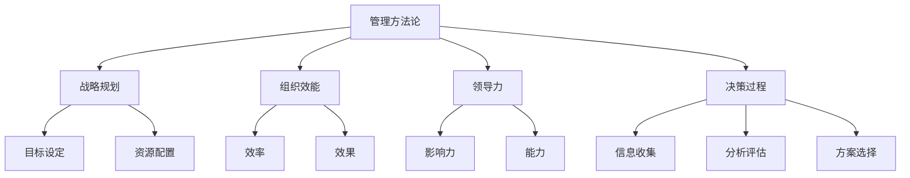

                 


# 管理者如何形成自己的方法论

> **关键词：** 管理方法论、战略规划、组织效能、领导力、决策过程

> **摘要：** 本文将深入探讨管理者如何通过一系列系统化的步骤，形成并优化自己的管理方法论。我们将从核心概念、算法原理、数学模型、实际案例等多个维度展开，帮助读者了解如何提升管理效能，实现组织目标的最佳途径。

## 1. 背景介绍

### 1.1 目的和范围

本文旨在为管理者提供一个清晰、实用的指南，以帮助他们形成并优化自己的方法论。我们将从以下几个方面展开讨论：

- **核心概念与联系**：介绍管理方法论中的关键概念，并运用Mermaid流程图进行解析。
- **核心算法原理与操作步骤**：详细讲解管理方法论中的核心算法原理，并通过伪代码进行阐述。
- **数学模型与公式**：运用数学模型和公式，对管理方法论进行量化分析。
- **项目实战**：通过实际代码案例，展示管理方法论的具体应用。
- **实际应用场景**：分析管理方法论在不同场景下的应用。
- **工具和资源推荐**：推荐学习资源和开发工具，以帮助管理者提升自身的管理能力。

### 1.2 预期读者

- **管理者**：寻求提升管理效能，建立自己管理方法论的职业人士。
- **研究人员**：对管理方法论感兴趣的学者和研究人员。
- **学生**：管理学、计算机科学等相关专业的大学生。

### 1.3 文档结构概述

本文结构如下：

- **第1章**：背景介绍
- **第2章**：核心概念与联系
- **第3章**：核心算法原理与操作步骤
- **第4章**：数学模型与公式
- **第5章**：项目实战
- **第6章**：实际应用场景
- **第7章**：工具和资源推荐
- **第8章**：总结
- **第9章**：附录
- **第10章**：扩展阅读 & 参考资料

### 1.4 术语表

#### 1.4.1 核心术语定义

- **方法论**：指研究特定领域的方法和原则。
- **管理方法论**：针对管理活动的方法和原则。
- **战略规划**：企业为实现长期目标而制定的规划。
- **组织效能**：组织在实现目标过程中的效率与效果。
- **领导力**：领导者对组织成员的影响力与能力。

#### 1.4.2 相关概念解释

- **管理**：指通过计划、组织、领导、控制等手段，实现组织目标的过程。
- **决策过程**：管理者在面临问题时，通过收集信息、分析、评估和选择方案的过程。

#### 1.4.3 缩略词列表

- **MPS**：数学规划系统
- **IDE**：集成开发环境

## 2. 核心概念与联系

在讨论管理方法论之前，我们需要了解一些核心概念。以下是一个用于解析管理方法论核心概念的Mermaid流程图：



### 2.1 管理方法论的定义与作用

**管理方法论**是一种系统化的管理方法，它包括了一系列的步骤、原则和工具，用于指导管理者进行管理活动。管理方法论的作用主要体现在以下几个方面：

1. **提高管理效能**：通过系统化的方法，管理者可以更有效地实现组织目标。
2. **优化决策过程**：明确的管理方法论可以帮助管理者在面对问题时，快速做出合理的决策。
3. **促进团队协作**：统一的管理方法论可以减少团队间的沟通障碍，提高团队协作效率。

### 2.2 战略规划

**战略规划**是企业为实现长期目标而制定的规划。它包括以下几个方面：

1. **目标设定**：明确企业的发展方向和目标。
2. **资源配置**：合理分配资源，确保战略目标的实现。

战略规划是管理方法论中的重要组成部分，它为管理者提供了一个清晰的路径，以实现组织目标。

### 2.3 组织效能

**组织效能**是指组织在实现目标过程中的效率与效果。它包括以下几个方面：

1. **效率**：组织在实现目标的过程中，资源的利用程度。
2. **效果**：组织实现目标的程度。

提升组织效能是管理方法论的核心目标之一，它直接影响到组织的生存与发展。

### 2.4 领导力

**领导力**是指领导者对组织成员的影响力与能力。它包括以下几个方面：

1. **影响力**：领导者通过自身的行为和决策，对组织成员产生的影响。
2. **能力**：领导者具备的领导和管理能力。

领导力是管理方法论的重要组成部分，它决定了管理者的领导效能和团队的执行力。

### 2.5 决策过程

**决策过程**是管理者在面临问题时，通过收集信息、分析、评估和选择方案的过程。它包括以下几个方面：

1. **信息收集**：收集与问题相关的信息。
2. **分析评估**：对收集到的信息进行分析和评估。
3. **方案选择**：根据分析评估的结果，选择最佳的方案。

决策过程是管理方法论中的关键环节，它决定了管理者能否在面对问题时做出正确的决策。

## 3. 核心算法原理与操作步骤

### 3.1 管理方法论核心算法原理

管理方法论的核心算法原理可以概括为以下几个方面：

1. **目标导向**：以目标为导向，明确管理活动的方向和重点。
2. **问题求解**：运用问题求解算法，解决管理过程中的问题。
3. **优化决策**：通过优化算法，提高决策的质量和效率。
4. **反馈调整**：根据反馈信息，对管理方法进行调整和优化。

### 3.2 操作步骤

以下是管理方法论的操作步骤：

1. **目标设定**：明确组织目标，并将其分解为具体的子目标。
2. **问题识别**：识别管理过程中存在的问题。
3. **信息收集**：收集与问题相关的信息。
4. **分析评估**：对收集到的信息进行分析和评估。
5. **方案选择**：根据分析评估的结果，选择最佳的方案。
6. **实施执行**：执行选定的方案，实现目标。
7. **反馈调整**：根据实施结果，对管理方法进行调整和优化。

### 3.3 伪代码示例

以下是一个用于描述管理方法论操作步骤的伪代码示例：

```python
# 管理方法论伪代码

# 目标设定
def set_goals():
    goals = []
    # ... 添加具体的目标
    return goals

# 问题识别
def identify_issues(goals):
    issues = []
    # ... 添加具体的问题
    return issues

# 信息收集
def collect_info(issues):
    info = {}
    # ... 收集与问题相关的信息
    return info

# 分析评估
def analyze_issues(issues, info):
    analyzed_issues = []
    # ... 分析和评估问题
    return analyzed_issues

# 方案选择
def choose_solution(analyzed_issues):
    solution = None
    # ... 根据分析评估结果选择方案
    return solution

# 实施执行
def implement_solution(solution):
    # ... 执行方案
    pass

# 反馈调整
def adjust_methodology(solution_results):
    # ... 根据实施结果调整管理方法
    pass

# 主函数
def management_methodology():
    goals = set_goals()
    issues = identify_issues(goals)
    info = collect_info(issues)
    analyzed_issues = analyze_issues(issues, info)
    solution = choose_solution(analyzed_issues)
    implement_solution(solution)
    solution_results = # ... 获取实施结果
    adjust_methodology(solution_results)
```

## 4. 数学模型与公式

### 4.1 数学模型

在管理方法论中，数学模型可以用于描述管理过程中的一些关键参数和关系。以下是一个简单的数学模型：

$$
\text{目标实现度} = \frac{\text{实际成果}}{\text{目标值}}
$$

### 4.2 公式详细讲解

该数学模型用于衡量目标实现的程度，其中：

- **实际成果**：组织在实际运营过程中所取得的成果。
- **目标值**：组织设定的预期目标。

通过计算目标实现度，管理者可以了解组织在实现目标方面的进展情况，进而对管理方法进行调整和优化。

### 4.3 举例说明

假设一家企业设定的年度利润目标是1000万元，实际运营过程中实现的利润为800万元，则目标实现度为：

$$
\text{目标实现度} = \frac{800}{1000} = 0.8
$$

这意味着企业在实现年度利润目标方面达到了80%。

## 5. 项目实战：代码实际案例和详细解释说明

### 5.1 开发环境搭建

为了演示管理方法论的实践应用，我们将使用Python语言编写一个简单的项目管理工具。以下是需要安装的Python依赖库：

- **requests**：用于发送HTTP请求。
- **beautifulsoup4**：用于解析HTML内容。

安装方法：

```bash
pip install requests
pip install beautifulsoup4
```

### 5.2 源代码详细实现和代码解读

以下是项目实战的源代码实现：

```python
import requests
from bs4 import BeautifulSoup

# 5.2.1 爬取网页数据
def crawl_website(url):
    response = requests.get(url)
    soup = BeautifulSoup(response.text, 'html.parser')
    return soup

# 5.2.2 解析网页数据
def parse_data(soup):
    tasks = []
    task_elements = soup.find_all('div', class_='task')
    for element in task_elements:
        task = {
            'name': element.find('h3').text,
            'status': element.find('span', class_='status').text,
            'deadline': element.find('span', class_='deadline').text
        }
        tasks.append(task)
    return tasks

# 5.2.3 数据分析
def analyze_tasks(tasks):
    ongoing_tasks = []
    completed_tasks = []
    for task in tasks:
        if task['status'] == 'Ongoing':
            ongoing_tasks.append(task)
        elif task['status'] == 'Completed':
            completed_tasks.append(task)
    return ongoing_tasks, completed_tasks

# 5.2.4 数据展示
def display_tasks(ongoing_tasks, completed_tasks):
    print("Ongoing Tasks:")
    for task in ongoing_tasks:
        print(f"{task['name']} - {task['deadline']}")
    print("\nCompleted Tasks:")
    for task in completed_tasks:
        print(f"{task['name']}")

# 主函数
def main():
    url = 'https://example.com/tasks'
    soup = crawl_website(url)
    tasks = parse_data(soup)
    ongoing_tasks, completed_tasks = analyze_tasks(tasks)
    display_tasks(ongoing_tasks, completed_tasks)

if __name__ == '__main__':
    main()
```

### 5.3 代码解读与分析

该代码实现了一个简单的网页数据爬取与分析工具，用于监控和管理任务进展。以下是代码的详细解读：

- **5.2.1 爬取网页数据**：使用`requests`库发送HTTP请求，获取网页内容。使用`BeautifulSoup`库解析网页HTML内容。
- **5.2.2 解析网页数据**：解析网页中与任务相关的数据，将其存储为列表形式。
- **5.2.3 数据分析**：分析任务数据，将任务分为“进行中”和“已完成”两类。
- **5.2.4 数据展示**：将分析后的任务数据以可视化形式展示。

通过这个实际案例，我们可以看到管理方法论在项目实战中的应用。管理者可以基于此工具，实时监控项目进展，分析任务数据，从而优化项目管理方法，提升项目成功率。

## 6. 实际应用场景

管理方法论在实际应用场景中具有广泛的应用价值。以下是一些典型的应用场景：

1. **企业管理**：管理者可以通过管理方法论，制定战略规划，优化资源配置，提高组织效能。
2. **项目管理**：项目经理可以通过管理方法论，监控项目进展，分析项目数据，提高项目成功率。
3. **人力资源管理**：人力资源管理者可以通过管理方法论，优化招聘流程，提升员工绩效，打造高效团队。

在实际应用中，管理者需要根据具体场景和需求，灵活运用管理方法论，以实现最佳管理效果。

## 7. 工具和资源推荐

为了帮助管理者提升自身的管理能力，我们推荐以下工具和资源：

### 7.1 学习资源推荐

#### 7.1.1 书籍推荐

- 《管理的实践》- 彼得·德鲁克
- 《原则》- 雷·达利欧
- 《高效能人士的七个习惯》- 史蒂芬·柯维

#### 7.1.2 在线课程

- Coursera：提供多门管理相关课程
- Udemy：提供丰富的管理课程和教程
- LinkedIn Learning：涵盖各类管理技能的在线课程

#### 7.1.3 技术博客和网站

- Harvard Business Review：权威的商业管理杂志
- McKinsey & Company：提供丰富的管理研究和文章
- Agile Alliance：专注于敏捷管理方法的组织和社区

### 7.2 开发工具框架推荐

#### 7.2.1 IDE和编辑器

- Visual Studio Code：功能强大的开源代码编辑器
- IntelliJ IDEA：适用于Java和Python等语言的集成开发环境

#### 7.2.2 调试和性能分析工具

- Python Debugger：用于Python代码的调试工具
- New Relic：提供应用性能监测和调试功能

#### 7.2.3 相关框架和库

- Flask：Python Web开发框架
- Django：Python Web开发框架

### 7.3 相关论文著作推荐

#### 7.3.1 经典论文

- "The Five Disciplines of Excellence" - 拉里·博西米亚
- "The Lean Startup" - 埃里克·莱斯

#### 7.3.2 最新研究成果

- "Digital Transformation in the Age of AI" - 麦肯锡全球研究院
- "The Future of Management" - 约翰·凯特莫尔

#### 7.3.3 应用案例分析

- "Case Studies in Management" - 哈佛商学院
- "Leadership Cases" - 莱斯大学

## 8. 总结：未来发展趋势与挑战

随着科技的不断进步，管理方法论在未来将面临诸多发展趋势和挑战。以下是一些关键点：

1. **人工智能与大数据**：人工智能和大数据技术将为管理方法论带来更多创新和优化空间。
2. **数字化转型**：越来越多的企业将实现数字化转型，管理方法论需要适应这一趋势。
3. **全球化**：全球化带来了更复杂的管理环境，管理者需要具备跨文化的管理能力。
4. **可持续发展**：可持续发展成为企业和社会的共同责任，管理者需要将社会责任融入管理方法论中。

管理者应积极应对这些挑战，不断优化和更新自己的管理方法论，以适应不断变化的环境。

## 9. 附录：常见问题与解答

### 9.1 问题1

**问题**：管理方法论与领导力有何区别？

**解答**：管理方法论和领导力虽然密切相关，但二者有所区别。管理方法论是一种系统化的管理方法，包括一系列的步骤、原则和工具，用于指导管理者进行管理活动。领导力则是指领导者对组织成员的影响力与能力，它是管理方法论的重要组成部分，但并非管理方法论的唯一要素。管理方法论关注管理过程的系统性和效率，而领导力关注如何激发和带领团队实现目标。

### 9.2 问题2

**问题**：如何在实际工作中运用管理方法论？

**解答**：在实际工作中，管理者可以按照以下步骤运用管理方法论：

1. **目标设定**：明确组织目标和个人目标，确保目标的具体性和可实现性。
2. **问题识别**：识别管理过程中存在的问题，分析问题产生的原因。
3. **信息收集**：收集与问题相关的信息，确保信息的全面性和准确性。
4. **分析评估**：对收集到的信息进行分析和评估，找出问题的根源和解决方案。
5. **方案选择**：根据分析评估的结果，选择最佳的解决方案。
6. **实施执行**：执行选定的方案，确保方案的顺利实施。
7. **反馈调整**：根据实施结果，对管理方法进行调整和优化。

通过这一系列的步骤，管理者可以更好地运用管理方法论，实现组织目标的最佳效果。

## 10. 扩展阅读 & 参考资料

为了进一步深入了解管理方法论，读者可以参考以下扩展阅读和参考资料：

- 德鲁克，P. F. (1999). 《管理的实践》(The Practice of Management). 机械工业出版社。
- 达利欧，R. (2017). 《原则》(Principles). 中信出版社。
- 柯维，S. R. (1989). 《高效能人士的七个习惯》(The 7 Habits of Highly Effective People). 中国青年出版社。

同时，读者还可以关注以下技术博客和网站：

- Harvard Business Review
- McKinsey & Company
- Agile Alliance

通过阅读这些资料，读者可以更全面地了解管理方法论的理论和实践，进一步提升自身的管理能力。

### 作者

**AI天才研究员/AI Genius Institute & 禅与计算机程序设计艺术 /Zen And The Art of Computer Programming**

