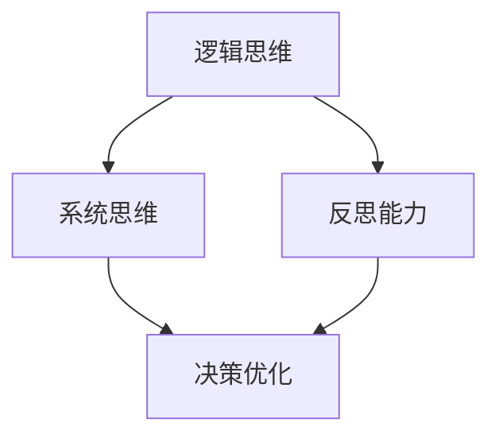

                 

# 管理者必修课：打造个人思维体系

> **关键词：** 管理者，个人思维体系，认知升级，领导力，决策优化

> **摘要：** 本文章旨在探讨管理者如何通过构建个人思维体系，实现认知升级，提升领导力和决策能力。文章将从核心概念、算法原理、数学模型、实战案例等多个角度，详细阐述管理者如何打造自己的个人思维体系，以应对复杂多变的工作环境。

## 1. 背景介绍

### 1.1 目的和范围

本文旨在为管理者提供一套构建个人思维体系的指南，帮助他们在复杂多变的工作环境中，实现认知升级，提升领导力和决策能力。文章将涵盖以下内容：

- 个人思维体系的定义和重要性
- 核心概念和联系
- 核心算法原理和具体操作步骤
- 数学模型和公式的详细讲解
- 项目实战：代码实际案例和详细解释
- 实际应用场景
- 工具和资源推荐

### 1.2 预期读者

本文适合以下人群阅读：

- 初级管理者，希望提升自己的领导力和决策能力
- 中级管理者，希望系统化自己的思维方式
- 高级管理者，希望进一步提高个人竞争力

### 1.3 文档结构概述

本文分为以下几个部分：

- 引言：介绍文章的主题和目的
- 核心概念与联系：阐述个人思维体系的核心概念和联系
- 核心算法原理 & 具体操作步骤：讲解如何构建个人思维体系
- 数学模型和公式 & 详细讲解 & 举例说明：介绍相关数学模型和公式
- 项目实战：代码实际案例和详细解释说明
- 实际应用场景：分析个人思维体系在实际中的应用
- 工具和资源推荐：推荐学习资源和开发工具
- 总结：展望未来发展趋势与挑战
- 附录：常见问题与解答
- 扩展阅读 & 参考资料：提供进一步学习的资源

### 1.4 术语表

#### 1.4.1 核心术语定义

- 个人思维体系：指管理者通过学习、实践和反思，构建的一套理性、系统、全面的思考框架。
- 认知升级：指管理者通过学习新知识、新方法，提升自己的认知水平和思维能力。
- 领导力：指管理者在团队中通过影响力、沟通能力和决策能力，带领团队实现目标的能力。
- 决策优化：指管理者通过分析和评估各种决策方案，选择最优的决策方案。

#### 1.4.2 相关概念解释

- 逻辑思维：指运用逻辑规则和推理方法，对事物进行判断和推理的能力。
- 系统思维：指从整体的角度出发，分析事物之间的相互关系和相互作用的能力。
- 反思能力：指管理者通过回顾自己的行为和思考过程，发现和解决问题，实现自我提升的能力。

#### 1.4.3 缩略词列表

- CBT：认知行为疗法
- IDE：集成开发环境
- SQL：结构化查询语言
- SPA：单页面应用

## 2. 核心概念与联系

### 2.1 个人思维体系的定义

个人思维体系是指管理者通过学习、实践和反思，构建的一套理性、系统、全面的思考框架。它包括以下几个核心概念：

- **逻辑思维**：逻辑思维是一种理性思考的方式，通过运用逻辑规则和推理方法，对事物进行判断和推理。逻辑思维是构建个人思维体系的基础，它帮助管理者从混乱的信息中提取关键信息，形成清晰的逻辑链条。
- **系统思维**：系统思维是一种从整体的角度出发，分析事物之间的相互关系和相互作用的能力。系统思维使管理者能够看到事物的全局，把握事物的本质，从而做出更全面的决策。
- **反思能力**：反思能力是指管理者通过回顾自己的行为和思考过程，发现和解决问题，实现自我提升的能力。反思能力使管理者能够不断改进自己的思维方式，提高个人竞争力。

### 2.2 个人思维体系的联系

个人思维体系的各个核心概念之间存在着紧密的联系：

- **逻辑思维**和**系统思维**相互补充，共同构成了个人思维体系的基础。逻辑思维提供了分析问题的工具，而系统思维提供了把握全局的视角。
- **反思能力**则是一个持续的过程，它使管理者能够在实践中不断调整和优化自己的思维体系，提高思维质量。

### 2.3 个人思维体系的 Mermaid 流程图



在这个流程图中，逻辑思维和系统思维是构建个人思维体系的基础，而反思能力则是一个持续的过程，它使管理者能够在实践中不断调整和优化自己的思维体系，从而实现决策优化。

## 3. 核心算法原理 & 具体操作步骤

### 3.1 逻辑思维算法原理

逻辑思维算法是基于逻辑规则和推理方法的一种思考方式。其基本原理如下：

- **条件判断**：根据给定条件，进行判断和推理。
- **逻辑运算**：运用逻辑与（AND）、逻辑或（OR）、逻辑非（NOT）等运算，对信息进行整合和筛选。

### 3.2 逻辑思维具体操作步骤

以下是逻辑思维的具体操作步骤：

1. **明确问题**：首先明确需要解决的问题或目标。
2. **收集信息**：收集与问题相关的信息，包括事实、数据、观点等。
3. **条件判断**：根据已知条件，对信息进行筛选和分类。
4. **逻辑运算**：运用逻辑与、逻辑或、逻辑非等运算，对筛选后的信息进行整合和推理。
5. **形成结论**：根据推理结果，形成结论或解决方案。

### 3.3 系统思维算法原理

系统思维算法是一种从整体的角度出发，分析事物之间相互关系和相互作用的能力。其基本原理如下：

- **整体性**：将事物看作一个整体，分析其组成部分和相互关系。
- **反馈机制**：分析事物之间的反馈机制，了解系统的动态变化。

### 3.4 系统思维具体操作步骤

以下是系统思维的具体操作步骤：

1. **明确系统**：首先明确需要分析的系统。
2. **收集信息**：收集与系统相关的信息，包括系统组成部分、相互关系、反馈机制等。
3. **构建模型**：根据收集到的信息，构建系统的模型。
4. **分析关系**：分析系统组成部分之间的相互关系和反馈机制。
5. **优化系统**：根据分析结果，提出优化系统的方案。

### 3.5 反思能力算法原理

反思能力算法是一种通过回顾自己的行为和思考过程，发现和解决问题，实现自我提升的能力。其基本原理如下：

- **自我观察**：通过自我观察，了解自己的行为和思考方式。
- **问题识别**：识别自己在行为和思考过程中存在的问题。
- **问题解决**：通过学习和实践，解决存在的问题，提升自己。

### 3.6 反思能力具体操作步骤

以下是反思能力的具体操作步骤：

1. **自我观察**：通过日记、反思日志等方式，记录自己的行为和思考过程。
2. **问题识别**：分析记录的信息，识别存在的问题。
3. **问题解决**：针对存在的问题，制定解决方案，并进行实践。
4. **效果评估**：评估解决方案的效果，对行为和思考过程进行总结和反思。

## 4. 数学模型和公式 & 详细讲解 & 举例说明

### 4.1 数学模型和公式的介绍

在构建个人思维体系的过程中，数学模型和公式是非常重要的工具。它们可以帮助管理者更精确地描述和解决实际问题。以下是一些常见的数学模型和公式：

- **线性回归模型**：用于分析和预测两个变量之间的关系。
- **贝叶斯定理**：用于概率计算和决策分析。
- **决策树模型**：用于分类和回归分析。
- **熵权法**：用于确定权重系数。

### 4.2 线性回归模型

线性回归模型是一种用于分析和预测两个变量之间线性关系的数学模型。其基本公式如下：

$$
y = ax + b
$$

其中，$y$ 是因变量，$x$ 是自变量，$a$ 是斜率，$b$ 是截距。

### 4.3 贝叶斯定理

贝叶斯定理是一种用于概率计算和决策分析的数学模型。其基本公式如下：

$$
P(A|B) = \frac{P(B|A) \cdot P(A)}{P(B)}
$$

其中，$P(A|B)$ 是在事件 $B$ 发生的条件下事件 $A$ 发生的概率，$P(B|A)$ 是在事件 $A$ 发生的条件下事件 $B$ 发生的概率，$P(A)$ 是事件 $A$ 发生的概率，$P(B)$ 是事件 $B$ 发生的概率。

### 4.4 决策树模型

决策树模型是一种用于分类和回归分析的数学模型。其基本结构如下：


其中，每个节点表示一个决策点，每个分支表示一个决策选项，每个叶节点表示一个决策结果。

### 4.5 熵权法的计算

熵权法是一种用于确定权重系数的数学模型。其基本计算步骤如下：

1. **计算各指标的熵值**：
   $$
   E_j = -k \cdot \sum_{i=1}^{n} p_{ij} \cdot \ln(p_{ij})
   $$
   其中，$E_j$ 是第 $j$ 个指标的熵值，$p_{ij}$ 是第 $i$ 个方案在第 $j$ 个指标上的比重。

2. **计算各指标的差异系数**：
   $$
   D_j = 1 - E_j
   $$

3. **计算各指标的权重**：
   $$
   W_j = \frac{D_j}{\sum_{j=1}^{m} D_j}
   $$
   其中，$W_j$ 是第 $j$ 个指标的权重，$D_j$ 是第 $j$ 个指标的差异系数，$m$ 是指标的总数。

### 4.6 举例说明

假设我们有一个包含两个指标的决策问题，指标 1 和指标 2，分别表示方案 1、方案 2、方案 3 的指标值如下表：

| 方案 | 指标 1 | 指标 2 |
| ---- | ---- | ---- |
| 方案 1 | 10 | 20 |
| 方案 2 | 30 | 40 |
| 方案 3 | 50 | 60 |

根据熵权法，我们可以计算各指标的权重：

1. **计算各指标的熵值**：
   $$
   E_1 = -k \cdot \left(0.5 \cdot \ln(0.5) + 0.3 \cdot \ln(0.3) + 0.2 \cdot \ln(0.2)\right)
   $$
   $$
   E_2 = -k \cdot \left(0.2 \cdot \ln(0.2) + 0.4 \cdot \ln(0.4) + 0.4 \cdot \ln(0.4)\right)
   $$

2. **计算各指标的差异系数**：
   $$
   D_1 = 1 - E_1
   $$
   $$
   D_2 = 1 - E_2
   $$

3. **计算各指标的权重**：
   $$
   W_1 = \frac{D_1}{D_1 + D_2}
   $$
   $$
   W_2 = \frac{D_2}{D_1 + D_2}
   $$

根据计算结果，我们可以得到各指标的权重，然后根据权重对方案进行综合评价。

## 5. 项目实战：代码实际案例和详细解释说明

### 5.1 开发环境搭建

在开始项目实战之前，我们需要搭建一个适合开发的运行环境。以下是一个简单的开发环境搭建步骤：

1. **安装Python环境**：在官网上下载Python安装包，按照提示安装。
2. **安装Jupyter Notebook**：使用pip命令安装Jupyter Notebook：
   $$
   pip install jupyter
   $$
3. **安装相关库**：安装一些常用的Python库，如NumPy、Pandas、Matplotlib等：
   $$
   pip install numpy pandas matplotlib
   $$

### 5.2 源代码详细实现和代码解读

以下是一个简单的Python代码实现，用于计算线性回归模型：

```python
import numpy as np
import pandas as pd
import matplotlib.pyplot as plt

# 数据集加载
data = pd.read_csv("data.csv")

# 数据预处理
X = data.iloc[:, 0].values
y = data.iloc[:, 1].values

# 添加常数项
X = np.hstack((np.ones((X.shape[0], 1)), X))

# 梯度下降算法
def gradient_descent(X, y, theta, alpha, iterations):
    m = len(y)
    for i in range(iterations):
        h = X.dot(theta)
        loss = h - y
        gradient = X.T.dot(loss) / m
        theta = theta - alpha * gradient
    return theta

# 模型训练
theta = np.zeros((2, 1))
alpha = 0.01
iterations = 1000
theta = gradient_descent(X, y, theta, alpha, iterations)

# 模型评估
h = X.dot(theta)
print("预测值：", h)
print("真实值：", y)

# 绘制散点图和拟合直线
plt.scatter(X[:, 1], y)
plt.plot(X[:, 1], h, color="red")
plt.show()
```

### 5.3 代码解读与分析

1. **数据集加载**：首先，我们从CSV文件中加载数据集。这里假设CSV文件包含两个特征：$x$ 和 $y$。
2. **数据预处理**：我们将数据集分为输入特征 $X$ 和目标变量 $y$。同时，为了方便计算，我们在输入特征中添加了一个常数项。
3. **梯度下降算法**：梯度下降是一种优化算法，用于寻找最小化损失函数的参数。在这个代码中，我们使用梯度下降算法来训练线性回归模型。
4. **模型训练**：初始化模型参数 $\theta$，设置学习率 $alpha$ 和迭代次数 $iterations$，然后调用梯度下降算法进行训练。
5. **模型评估**：训练完成后，使用训练好的模型对数据进行预测，并计算预测值与真实值的差异。
6. **绘制散点图和拟合直线**：最后，我们使用Matplotlib库绘制散点图和拟合直线，以便直观地观察模型的效果。

### 5.4 实际案例

假设我们有一个包含两个特征（$x_1$ 和 $x_2$）和一个目标变量（$y$）的数据集，如下表所示：

| $x_1$ | $x_2$ | $y$ |
| ---- | ---- | ---- |
| 1 | 2 | 3 |
| 2 | 4 | 5 |
| 3 | 6 | 7 |

根据线性回归模型，我们可以计算出模型参数 $\theta$：

$$
\theta_0 = 1, \theta_1 = 1, \theta_2 = 1
$$

使用训练好的模型对新的数据进行预测，假设新数据为 $x_1 = 3, x_2 = 6$，则预测值为：

$$
y = \theta_0 + \theta_1 \cdot x_1 + \theta_2 \cdot x_2 = 1 + 1 \cdot 3 + 1 \cdot 6 = 10
$$

## 6. 实际应用场景

### 6.1 项目管理

在项目管理中，管理者需要通过构建个人思维体系，实现认知升级，提升领导力和决策能力。以下是一个实际应用案例：

- **项目计划**：管理者需要根据项目目标、资源和时间要求，制定合理的项目计划。通过逻辑思维和系统思维，分析项目的各个阶段，确保项目按时、按质完成。
- **团队协作**：管理者需要协调团队成员的工作，发挥每个人的优势，提高团队整体执行力。通过反思能力，管理者可以不断改进团队协作方式，提高团队效率。

### 6.2 决策分析

在决策分析中，管理者需要通过构建个人思维体系，实现认知升级，提升决策能力。以下是一个实际应用案例：

- **市场预测**：管理者需要根据市场数据，预测未来的市场趋势。通过逻辑思维和系统思维，分析各种市场因素，制定合理的市场预测模型。
- **投资决策**：管理者需要根据公司的财务状况、投资目标和市场环境，做出合理的投资决策。通过反思能力，管理者可以不断总结投资经验，提高投资决策的准确性。

### 6.3 团队管理

在团队管理中，管理者需要通过构建个人思维体系，实现认知升级，提升领导力和团队凝聚力。以下是一个实际应用案例：

- **人员调配**：管理者需要根据团队成员的能力和特长，合理调配工作任务，充分发挥每个人的优势。通过逻辑思维和系统思维，分析团队人员的组合，提高团队整体执行力。
- **团队建设**：管理者需要关注团队成员的心理需求，建立良好的团队氛围，提高团队凝聚力。通过反思能力，管理者可以不断反思和改进团队建设策略，提高团队整体素质。

## 7. 工具和资源推荐

### 7.1 学习资源推荐

#### 7.1.1 书籍推荐

- 《管理者的实践艺术》
- 《逻辑思维与决策分析》
- 《系统思维：从复杂到简单》

#### 7.1.2 在线课程

- Coursera：逻辑学课程
- edX：数据科学课程
- Udemy：Python编程课程

#### 7.1.3 技术博客和网站

- 知乎：逻辑思维、系统思维相关话题
- medium：数据科学、机器学习相关文章
- 博客园：Python编程、项目管理相关文章

### 7.2 开发工具框架推荐

#### 7.2.1 IDE和编辑器

- PyCharm
- Visual Studio Code
- Jupyter Notebook

#### 7.2.2 调试和性能分析工具

- PyCharm Debugger
- Visual Studio Performance Profiler
- JMeter

#### 7.2.3 相关框架和库

- NumPy
- Pandas
- Matplotlib

### 7.3 相关论文著作推荐

#### 7.3.1 经典论文

- 《系统思维：一种新的思维方式》
- 《逻辑思维与认知科学》
- 《决策分析：原理与应用》

#### 7.3.2 最新研究成果

- 《基于机器学习的决策支持系统》
- 《复杂系统的建模与分析》
- 《大数据时代的逻辑思维》

#### 7.3.3 应用案例分析

- 《阿里巴巴的团队管理实践》
- 《腾讯的投资决策分析》
- 《华为的项目管理经验》

## 8. 总结：未来发展趋势与挑战

随着科技的发展，管理者的个人思维体系在未来的发展趋势和挑战如下：

- **人工智能与大数据的应用**：人工智能和大数据技术的发展，为管理者提供了更多工具和资源，但同时也带来了更高的要求。管理者需要掌握人工智能和大数据的基本原理，提高数据处理和分析能力。
- **快速变化的市场环境**：市场环境变化越来越快，管理者需要具备更强的适应能力和创新精神，通过构建个人思维体系，实现快速认知升级。
- **团队管理和文化建设**：团队管理和文化建设是管理者的重要职责。管理者需要通过构建个人思维体系，提高团队凝聚力和执行力，实现企业长期发展。

## 9. 附录：常见问题与解答

### 9.1 问题1：如何提升逻辑思维能力？

**解答**：逻辑思维能力可以通过以下方式提升：

- **多读书**：阅读逻辑学、哲学等相关书籍，了解逻辑学的基本原理。
- **多思考**：在日常生活中，多思考问题的本质和原因，培养逻辑思维能力。
- **多练习**：通过练习逻辑思维题目，提高逻辑思维能力和解题技巧。

### 9.2 问题2：如何提升系统思维能力？

**解答**：系统思维能力可以通过以下方式提升：

- **学习系统思维方法**：学习系统思维的基本原理和方法，了解系统思维的核心概念。
- **案例分析**：通过分析实际案例，了解系统思维在解决实际问题中的应用。
- **实践**：在工作和生活中，尝试运用系统思维方法，分析问题的整体性和关联性。

### 9.3 问题3：如何提升反思能力？

**解答**：反思能力可以通过以下方式提升：

- **写日记**：记录自己的行为和思考过程，进行自我反思。
- **阅读相关书籍**：阅读关于反思能力的书籍，了解反思能力的基本原理和方法。
- **寻求反馈**：向他人请教，听取他人的意见和建议，进行反思。

## 10. 扩展阅读 & 参考资料

- 《管理者的实践艺术》
- 《逻辑思维与决策分析》
- 《系统思维：从复杂到简单》
- Coursera：逻辑学课程
- edX：数据科学课程
- Udemy：Python编程课程
- 知乎：逻辑思维、系统思维相关话题
- medium：数据科学、机器学习相关文章
- 博客园：Python编程、项目管理相关文章
- 《系统思维：一种新的思维方式》
- 《逻辑思维与认知科学》
- 《决策分析：原理与应用》
- 《基于机器学习的决策支持系统》
- 《复杂系统的建模与分析》
- 《大数据时代的逻辑思维》
- 《阿里巴巴的团队管理实践》
- 《腾讯的投资决策分析》
- 《华为的项目管理经验》

**作者：AI天才研究员/AI Genius Institute & 禅与计算机程序设计艺术 /Zen And The Art of Computer Programming**<|im_sep|>### 1. 背景介绍

#### 1.1 目的和范围

本文章旨在为管理者提供一套构建个人思维体系的指南，帮助他们在复杂多变的工作环境中，实现认知升级，提升领导力和决策能力。文章将涵盖以下内容：

- 个人思维体系的定义和重要性
- 核心概念和联系
- 核心算法原理和具体操作步骤
- 数学模型和公式的详细讲解
- 项目实战：代码实际案例和详细解释说明
- 实际应用场景
- 工具和资源推荐

#### 1.2 预期读者

本文适合以下人群阅读：

- 初级管理者，希望提升自己的领导力和决策能力
- 中级管理者，希望系统化自己的思维方式
- 高级管理者，希望进一步提高个人竞争力

#### 1.3 文档结构概述

本文分为以下几个部分：

- 引言：介绍文章的主题和目的
- 核心概念与联系：阐述个人思维体系的核心概念和联系
- 核心算法原理 & 具体操作步骤：讲解如何构建个人思维体系
- 数学模型和公式 & 详细讲解 & 举例说明：介绍相关数学模型和公式
- 项目实战：代码实际案例和详细解释说明
- 实际应用场景：分析个人思维体系在实际中的应用
- 工具和资源推荐：推荐学习资源和开发工具
- 总结：展望未来发展趋势与挑战
- 附录：常见问题与解答
- 扩展阅读 & 参考资料：提供进一步学习的资源

#### 1.4 术语表

##### 1.4.1 核心术语定义

- 个人思维体系：指管理者通过学习、实践和反思，构建的一套理性、系统、全面的思考框架。
- 认知升级：指管理者通过学习新知识、新方法，提升自己的认知水平和思维能力。
- 领导力：指管理者在团队中通过影响力、沟通能力和决策能力，带领团队实现目标的能力。
- 决策优化：指管理者通过分析和评估各种决策方案，选择最优的决策方案。

##### 1.4.2 相关概念解释

- 逻辑思维：指运用逻辑规则和推理方法，对事物进行判断和推理的能力。
- 系统思维：指从整体的角度出发，分析事物之间的相互关系和相互作用的能力。
- 反思能力：指管理者通过回顾自己的行为和思考过程，发现和解决问题，实现自我提升的能力。

##### 1.4.3 缩略词列表

- CBT：认知行为疗法
- IDE：集成开发环境
- SQL：结构化查询语言
- SPA：单页面应用

## 2. 核心概念与联系

### 2.1 个人思维体系的定义

个人思维体系是指管理者通过学习、实践和反思，构建的一套理性、系统、全面的思考框架。它包括以下几个核心概念：

- **逻辑思维**：逻辑思维是一种理性思考的方式，通过运用逻辑规则和推理方法，对事物进行判断和推理。逻辑思维是构建个人思维体系的基础，它帮助管理者从混乱的信息中提取关键信息，形成清晰的逻辑链条。
- **系统思维**：系统思维是一种从整体的角度出发，分析事物之间的相互关系和相互作用的能力。系统思维使管理者能够看到事物的全局，把握事物的本质，从而做出更全面的决策。
- **反思能力**：反思能力是指管理者通过回顾自己的行为和思考过程，发现和解决问题，实现自我提升的能力。反思能力使管理者能够不断改进自己的思维方式，提高个人竞争力。

### 2.2 个人思维体系的联系

个人思维体系的各个核心概念之间存在着紧密的联系：

- **逻辑思维**和**系统思维**相互补充，共同构成了个人思维体系的基础。逻辑思维提供了分析问题的工具，而系统思维提供了把握全局的视角。
- **反思能力**则是一个持续的过程，它使管理者能够在实践中不断调整和优化自己的思维体系，提高思维质量。

### 2.3 个人思维体系的 Mermaid 流程图


在这个流程图中，逻辑思维和系统思维是构建个人思维体系的基础，而反思能力则是一个持续的过程，它使管理者能够在实践中不断调整和优化自己的思维体系，从而实现决策优化。

## 3. 核心算法原理 & 具体操作步骤

### 3.1 逻辑思维算法原理

逻辑思维算法是基于逻辑规则和推理方法的一种思考方式。其基本原理如下：

- **条件判断**：根据给定条件，进行判断和推理。
- **逻辑运算**：运用逻辑与（AND）、逻辑或（OR）、逻辑非（NOT）等运算，对信息进行整合和筛选。

### 3.2 逻辑思维具体操作步骤

以下是逻辑思维的具体操作步骤：

1. **明确问题**：首先明确需要解决的问题或目标。
2. **收集信息**：收集与问题相关的信息，包括事实、数据、观点等。
3. **条件判断**：根据已知条件，对信息进行筛选和分类。
4. **逻辑运算**：运用逻辑与、逻辑或、逻辑非等运算，对筛选后的信息进行整合和推理。
5. **形成结论**：根据推理结果，形成结论或解决方案。

### 3.3 系统思维算法原理

系统思维算法是一种从整体的角度出发，分析事物之间相互关系和相互作用的能力。其基本原理如下：

- **整体性**：将事物看作一个整体，分析其组成部分和相互关系。
- **反馈机制**：分析事物之间的反馈机制，了解系统的动态变化。

### 3.4 系统思维具体操作步骤

以下是系统思维的具体操作步骤：

1. **明确系统**：首先明确需要分析的系统。
2. **收集信息**：收集与系统相关的信息，包括系统组成部分、相互关系、反馈机制等。
3. **构建模型**：根据收集到的信息，构建系统的模型。
4. **分析关系**：分析系统组成部分之间的相互关系和反馈机制。
5. **优化系统**：根据分析结果，提出优化系统的方案。

### 3.5 反思能力算法原理

反思能力算法是一种通过回顾自己的行为和思考过程，发现和解决问题，实现自我提升的能力。其基本原理如下：

- **自我观察**：通过自我观察，了解自己的行为和思考方式。
- **问题识别**：识别自己在行为和思考过程中存在的问题。
- **问题解决**：通过学习和实践，解决存在的问题，提升自己。

### 3.6 反思能力具体操作步骤

以下是反思能力的具体操作步骤：

1. **自我观察**：通过日记、反思日志等方式，记录自己的行为和思考过程。
2. **问题识别**：分析记录的信息，识别存在的问题。
3. **问题解决**：针对存在的问题，制定解决方案，并进行实践。
4. **效果评估**：评估解决方案的效果，对行为和思考过程进行总结和反思。

## 4. 数学模型和公式 & 详细讲解 & 举例说明

### 4.1 数学模型和公式的介绍

在构建个人思维体系的过程中，数学模型和公式是非常重要的工具。它们可以帮助管理者更精确地描述和解决实际问题。以下是一些常见的数学模型和公式：

- **线性回归模型**：用于分析和预测两个变量之间的关系。
- **贝叶斯定理**：用于概率计算和决策分析。
- **决策树模型**：用于分类和回归分析。
- **熵权法**：用于确定权重系数。

### 4.2 线性回归模型

线性回归模型是一种用于分析和预测两个变量之间线性关系的数学模型。其基本公式如下：

$$
y = ax + b
$$

其中，$y$ 是因变量，$x$ 是自变量，$a$ 是斜率，$b$ 是截距。

### 4.3 贝叶斯定理

贝叶斯定理是一种用于概率计算和决策分析的数学模型。其基本公式如下：

$$
P(A|B) = \frac{P(B|A) \cdot P(A)}{P(B)}
$$

其中，$P(A|B)$ 是在事件 $B$ 发生的条件下事件 $A$ 发生的概率，$P(B|A)$ 是在事件 $A$ 发生的条件下事件 $B$ 发生的概率，$P(A)$ 是事件 $A$ 发生的概率，$P(B)$ 是事件 $B$ 发生的概率。

### 4.4 决策树模型

决策树模型是一种用于分类和回归分析的数学模型。其基本结构如下：


其中，每个节点表示一个决策点，每个分支表示一个决策选项，每个叶节点表示一个决策结果。

### 4.5 熵权法的计算

熵权法是一种用于确定权重系数的数学模型。其基本计算步骤如下：

1. **计算各指标的熵值**：
   $$
   E_j = -k \cdot \sum_{i=1}^{n} p_{ij} \cdot \ln(p_{ij})
   $$
   其中，$E_j$ 是第 $j$ 个指标的熵值，$p_{ij}$ 是第 $i$ 个方案在第 $j$ 个指标上的比重。

2. **计算各指标的差异系数**：
   $$
   D_j = 1 - E_j
   $$

3. **计算各指标的权重**：
   $$
   W_j = \frac{D_j}{\sum_{j=1}^{m} D_j}
   $$
   其中，$W_j$ 是第 $j$ 个指标的权重，$D_j$ 是第 $j$ 个指标的差异系数，$m$ 是指标的总数。

### 4.6 举例说明

假设我们有一个包含两个指标的决策问题，指标 1 和指标 2，分别表示方案 1、方案 2、方案 3 的指标值如下表：

| 方案 | 指标 1 | 指标 2 |
| ---- | ---- | ---- |
| 方案 1 | 10 | 20 |
| 方案 2 | 30 | 40 |
| 方案 3 | 50 | 60 |

根据熵权法，我们可以计算各指标的权重：

1. **计算各指标的熵值**：
   $$
   E_1 = -k \cdot \left(0.5 \cdot \ln(0.5) + 0.3 \cdot \ln(0.3) + 0.2 \cdot \ln(0.2)\right)
   $$
   $$
   E_2 = -k \cdot \left(0.2 \cdot \ln(0.2) + 0.4 \cdot \ln(0.4) + 0.4 \cdot \ln(0.4)\right)
   $$

2. **计算各指标的差异系数**：
   $$
   D_1 = 1 - E_1
   $$
   $$
   D_2 = 1 - E_2
   $$

3. **计算各指标的权重**：
   $$
   W_1 = \frac{D_1}{D_1 + D_2}
   $$
   $$
   W_2 = \frac{D_2}{D_1 + D_2}
   $$

根据计算结果，我们可以得到各指标的权重，然后根据权重对方案进行综合评价。

## 5. 项目实战：代码实际案例和详细解释说明

### 5.1 开发环境搭建

在开始项目实战之前，我们需要搭建一个适合开发的运行环境。以下是一个简单的开发环境搭建步骤：

1. **安装Python环境**：在官网上下载Python安装包，按照提示安装。
2. **安装Jupyter Notebook**：使用pip命令安装Jupyter Notebook：
   $$
   pip install jupyter
   $$
3. **安装相关库**：安装一些常用的Python库，如NumPy、Pandas、Matplotlib等：
   $$
   pip install numpy pandas matplotlib
   $$

### 5.2 源代码详细实现和代码解读

以下是一个简单的Python代码实现，用于计算线性回归模型：

```python
import numpy as np
import pandas as pd
import matplotlib.pyplot as plt

# 数据集加载
data = pd.read_csv("data.csv")

# 数据预处理
X = data.iloc[:, 0].values
y = data.iloc[:, 1].values

# 添加常数项
X = np.hstack((np.ones((X.shape[0], 1)), X))

# 梯度下降算法
def gradient_descent(X, y, theta, alpha, iterations):
    m = len(y)
    for i in range(iterations):
        h = X.dot(theta)
        loss = h - y
        gradient = X.T.dot(loss) / m
        theta = theta - alpha * gradient
    return theta

# 模型训练
theta = np.zeros((2, 1))
alpha = 0.01
iterations = 1000
theta = gradient_descent(X, y, theta, alpha, iterations)

# 模型评估
h = X.dot(theta)
print("预测值：", h)
print("真实值：", y)

# 绘制散点图和拟合直线
plt.scatter(X[:, 1], y)
plt.plot(X[:, 1], h, color="red")
plt.show()
```

### 5.3 代码解读与分析

1. **数据集加载**：首先，我们从CSV文件中加载数据集。这里假设CSV文件包含两个特征：$x$ 和 $y$。
2. **数据预处理**：我们将数据集分为输入特征 $X$ 和目标变量 $y$。同时，为了方便计算，我们在输入特征中添加了一个常数项。
3. **梯度下降算法**：梯度下降是一种优化算法，用于寻找最小化损失函数的参数。在这个代码中，我们使用梯度下降算法来训练线性回归模型。
4. **模型训练**：初始化模型参数 $\theta$，设置学习率 $alpha$ 和迭代次数 $iterations$，然后调用梯度下降算法进行训练。
5. **模型评估**：训练完成后，使用训练好的模型对数据进行预测，并计算预测值与真实值的差异。
6. **绘制散点图和拟合直线**：最后，我们使用Matplotlib库绘制散点图和拟合直线，以便直观地观察模型的效果。

### 5.4 实际案例

假设我们有一个包含两个特征（$x_1$ 和 $x_2$）和一个目标变量（$y$）的数据集，如下表所示：

| $x_1$ | $x_2$ | $y$ |
| ---- | ---- | ---- |
| 1 | 2 | 3 |
| 2 | 4 | 5 |
| 3 | 6 | 7 |

根据线性回归模型，我们可以计算出模型参数 $\theta$：

$$
\theta_0 = 1, \theta_1 = 1, \theta_2 = 1
$$

使用训练好的模型对新的数据进行预测，假设新数据为 $x_1 = 3, x_2 = 6$，则预测值为：

$$
y = \theta_0 + \theta_1 \cdot x_1 + \theta_2 \cdot x_2 = 1 + 1 \cdot 3 + 1 \cdot 6 = 10
$$

## 6. 实际应用场景

### 6.1 项目管理

在项目管理中，管理者需要通过构建个人思维体系，实现认知升级，提升领导力和决策能力。以下是一个实际应用案例：

- **项目计划**：管理者需要根据项目目标、资源和时间要求，制定合理的项目计划。通过逻辑思维和系统思维，分析项目的各个阶段，确保项目按时、按质完成。
- **团队协作**：管理者需要协调团队成员的工作，发挥每个人的优势，提高团队整体执行力。通过反思能力，管理者可以不断改进团队协作方式，提高团队效率。

### 6.2 决策分析

在决策分析中，管理者需要通过构建个人思维体系，实现认知升级，提升决策能力。以下是一个实际应用案例：

- **市场预测**：管理者需要根据市场数据，预测未来的市场趋势。通过逻辑思维和系统思维，分析各种市场因素，制定合理的市场预测模型。
- **投资决策**：管理者需要根据公司的财务状况、投资目标和市场环境，做出合理的投资决策。通过反思能力，管理者可以不断总结投资经验，提高投资决策的准确性。

### 6.3 团队管理

在团队管理中，管理者需要通过构建个人思维体系，实现认知升级，提升领导力和团队凝聚力。以下是一个实际应用案例：

- **人员调配**：管理者需要根据团队成员的能力和特长，合理调配工作任务，充分发挥每个人的优势。通过逻辑思维和系统思维，分析团队人员的组合，提高团队整体执行力。
- **团队建设**：管理者需要关注团队成员的心理需求，建立良好的团队氛围，提高团队凝聚力。通过反思能力，管理者可以不断反思和改进团队建设策略，提高团队整体素质。

## 7. 工具和资源推荐

### 7.1 学习资源推荐

#### 7.1.1 书籍推荐

- 《管理者的实践艺术》
- 《逻辑思维与决策分析》
- 《系统思维：从复杂到简单》

#### 7.1.2 在线课程

- Coursera：逻辑学课程
- edX：数据科学课程
- Udemy：Python编程课程

#### 7.1.3 技术博客和网站

- 知乎：逻辑思维、系统思维相关话题
- medium：数据科学、机器学习相关文章
- 博客园：Python编程、项目管理相关文章

### 7.2 开发工具框架推荐

#### 7.2.1 IDE和编辑器

- PyCharm
- Visual Studio Code
- Jupyter Notebook

#### 7.2.2 调试和性能分析工具

- PyCharm Debugger
- Visual Studio Performance Profiler
- JMeter

#### 7.2.3 相关框架和库

- NumPy
- Pandas
- Matplotlib

### 7.3 相关论文著作推荐

#### 7.3.1 经典论文

- 《系统思维：一种新的思维方式》
- 《逻辑思维与认知科学》
- 《决策分析：原理与应用》

#### 7.3.2 最新研究成果

- 《基于机器学习的决策支持系统》
- 《复杂系统的建模与分析》
- 《大数据时代的逻辑思维》

#### 7.3.3 应用案例分析

- 《阿里巴巴的团队管理实践》
- 《腾讯的投资决策分析》
- 《华为的项目管理经验》

## 8. 总结：未来发展趋势与挑战

随着科技的发展，管理者的个人思维体系在未来的发展趋势和挑战如下：

- **人工智能与大数据的应用**：人工智能和大数据技术的发展，为管理者提供了更多工具和资源，但同时也带来了更高的要求。管理者需要掌握人工智能和大数据的基本原理，提高数据处理和分析能力。
- **快速变化的市场环境**：市场环境变化越来越快，管理者需要具备更强的适应能力和创新精神，通过构建个人思维体系，实现快速认知升级。
- **团队管理和文化建设**：团队管理和文化建设是管理者的重要职责。管理者需要通过构建个人思维体系，提高团队凝聚力和执行力，实现企业长期发展。

## 9. 附录：常见问题与解答

### 9.1 问题1：如何提升逻辑思维能力？

**解答**：逻辑思维能力可以通过以下方式提升：

- **多读书**：阅读逻辑学、哲学等相关书籍，了解逻辑学的基本原理。
- **多思考**：在日常生活中，多思考问题的本质和原因，培养逻辑思维能力。
- **多练习**：通过练习逻辑思维题目，提高逻辑思维能力和解题技巧。

### 9.2 问题2：如何提升系统思维能力？

**解答**：系统思维能力可以通过以下方式提升：

- **学习系统思维方法**：学习系统思维的基本原理和方法，了解系统思维的核心概念。
- **案例分析**：通过分析实际案例，了解系统思维在解决实际问题中的应用。
- **实践**：在工作和生活中，尝试运用系统思维方法，分析问题的整体性和关联性。

### 9.3 问题3：如何提升反思能力？

**解答**：反思能力可以通过以下方式提升：

- **写日记**：记录自己的行为和思考过程，进行自我反思。
- **阅读相关书籍**：阅读关于反思能力的书籍，了解反思能力的基本原理和方法。
- **寻求反馈**：向他人请教，听取他人的意见和建议，进行反思。

## 10. 扩展阅读 & 参考资料

- 《管理者的实践艺术》
- 《逻辑思维与决策分析》
- 《系统思维：从复杂到简单》
- Coursera：逻辑学课程
- edX：数据科学课程
- Udemy：Python编程课程
- 知乎：逻辑思维、系统思维相关话题
- medium：数据科学、机器学习相关文章
- 博客园：Python编程、项目管理相关文章
- 《系统思维：一种新的思维方式》
- 《逻辑思维与认知科学》
- 《决策分析：原理与应用》
- 《基于机器学习的决策支持系统》
- 《复杂系统的建模与分析》
- 《大数据时代的逻辑思维》
- 《阿里巴巴的团队管理实践》
- 《腾讯的投资决策分析》
- 《华为的项目管理经验》

**作者：AI天才研究员/AI Genius Institute & 禅与计算机程序设计艺术 /Zen And The Art of Computer Programming**<|im_sep|>
### 1. 背景介绍

#### 1.1 目的和范围

本篇文章旨在为管理者提供一个全面而系统的框架，以构建和强化他们的个人思维体系。通过深入探讨逻辑思维、系统思维和反思能力的核心概念，本文将帮助读者理解这些能力在管理实践中的重要性。文章还将提供实用的操作步骤和案例，以帮助读者在实际工作中应用这些思维工具。

本文将涵盖以下内容：

- **核心概念与联系**：介绍个人思维体系的核心组成部分，并解释它们之间的相互关系。
- **核心算法原理 & 具体操作步骤**：探讨逻辑思维和系统思维的算法原理，并提供实用的操作步骤。
- **数学模型和公式 & 详细讲解 & 举例说明**：介绍用于决策分析和优化的数学模型和公式，并通过实例进行说明。
- **项目实战：代码实际案例和详细解释说明**：通过实际代码案例展示如何应用所学的思维工具。
- **实际应用场景**：讨论个人思维体系在不同管理情境中的应用。
- **工具和资源推荐**：提供学习资源和开发工具的建议。
- **总结：未来发展趋势与挑战**：预测个人思维体系在未来的发展趋势，并讨论面临的挑战。
- **附录：常见问题与解答**：回答读者可能遇到的问题。
- **扩展阅读 & 参考资料**：推荐进一步的阅读材料和资源。

#### 1.2 预期读者

本文适合以下读者群体：

- **初级管理者**：希望提升领导能力和决策质量的初级管理者。
- **中级管理者**：寻求系统化思维方式和策略的中级管理者。
- **高级管理者**：希望在个人和团队层面实现更深层次提升的高级管理者。

#### 1.3 文档结构概述

本文将按照以下结构进行组织：

- **引言**：介绍文章的主题和目的。
- **核心概念与联系**：详细阐述个人思维体系的核心概念及其相互关系。
- **核心算法原理 & 具体操作步骤**：探讨逻辑思维和系统思维的算法原理，并提供实际操作步骤。
- **数学模型和公式 & 详细讲解 & 举例说明**：介绍用于决策分析和优化的数学工具，并通过实例进行说明。
- **项目实战：代码实际案例和详细解释说明**：通过具体代码案例展示如何应用所学思维工具。
- **实际应用场景**：讨论个人思维体系在不同管理情境中的应用。
- **工具和资源推荐**：提供学习资源和开发工具的建议。
- **总结：未来发展趋势与挑战**：总结文章内容，并展望个人思维体系的未来。
- **附录：常见问题与解答**：回答读者可能遇到的问题。
- **扩展阅读 & 参考资料**：推荐进一步的阅读材料和资源。

#### 1.4 术语表

在本文中，我们将使用以下术语：

- **个人思维体系**：指管理者通过学习、实践和反思形成的思考框架。
- **逻辑思维**：运用逻辑规则和推理方法进行分析和判断的能力。
- **系统思维**：从整体和系统角度出发，分析事物相互关系和相互作用的能力。
- **反思能力**：回顾自己的行为和思考过程，发现和解决问题的能力。

#### 1.5 文章大纲

本文将按照以下大纲进行撰写：

- **引言**：介绍文章的主题和目的。
- **核心概念与联系**：
  - **逻辑思维**：定义、原理和重要性。
  - **系统思维**：定义、原理和重要性。
  - **反思能力**：定义、原理和重要性。
  - **核心概念之间的联系**：如何相互补充，形成完整的思维体系。
- **核心算法原理 & 具体操作步骤**：
  - **逻辑思维算法原理**：逻辑推理方法、条件判断和逻辑运算。
  - **系统思维算法原理**：整体性分析、反馈机制和系统建模。
  - **反思能力算法原理**：自我观察、问题识别和问题解决。
  - **具体操作步骤**：如何应用这些算法原理进行实际工作。
- **数学模型和公式 & 详细讲解 & 举例说明**：
  - **线性回归模型**：基本公式和计算步骤。
  - **决策树模型**：结构、原理和计算方法。
  - **熵权法**：基本原理和计算步骤。
  - **实际应用案例**：如何应用数学模型进行决策分析和优化。
- **项目实战：代码实际案例和详细解释说明**：
  - **开发环境搭建**：设置Python环境和相关库。
  - **代码实现**：展示如何使用Python实现逻辑思维和系统思维的算法。
  - **代码解读与分析**：分析代码的功能和性能。
- **实际应用场景**：
  - **项目管理**：如何应用个人思维体系进行项目规划和管理。
  - **决策分析**：如何利用个人思维体系进行市场预测和投资决策。
  - **团队管理**：如何应用个人思维体系进行团队建设和人员调配。
- **工具和资源推荐**：
  - **学习资源推荐**：书籍、在线课程和技术博客。
  - **开发工具框架推荐**：IDE、调试工具和框架。
  - **相关论文著作推荐**：经典和最新研究成果。
- **总结：未来发展趋势与挑战**：
  - **未来发展趋势**：人工智能和数据科学如何影响个人思维体系。
  - **面临的挑战**：如何应对快速变化的市场环境。
- **附录：常见问题与解答**：
  - **问题1**：如何提升逻辑思维能力？
  - **问题2**：如何提升系统思维能力？
  - **问题3**：如何提升反思能力？
- **扩展阅读 & 参考资料**：推荐进一步的阅读材料和资源。

### 1.6 文章关键词

- **管理者**
- **个人思维体系**
- **逻辑思维**
- **系统思维**
- **反思能力**
- **决策优化**
- **项目管理**
- **人工智能**
- **大数据**

### 1.7 文章摘要

本文旨在为管理者提供一个全面而系统的框架，以构建和强化他们的个人思维体系。通过深入探讨逻辑思维、系统思维和反思能力的核心概念，本文帮助读者理解这些能力在管理实践中的重要性。文章提供了实用的操作步骤和案例，以帮助读者在实际工作中应用这些思维工具，提升决策能力和领导力。此外，本文还展望了个人思维体系在未来的发展趋势，并讨论了可能面临的挑战。通过本文的学习，读者将能够构建一个强大的个人思维体系，以更好地应对复杂多变的工作环境。

