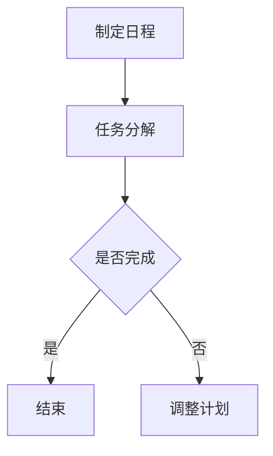
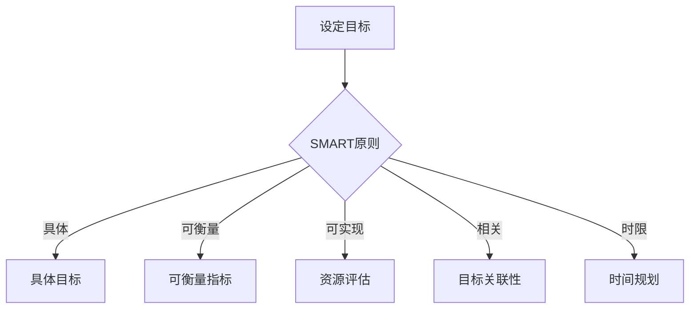
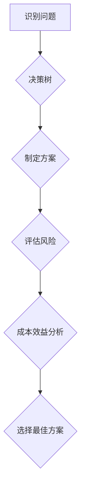
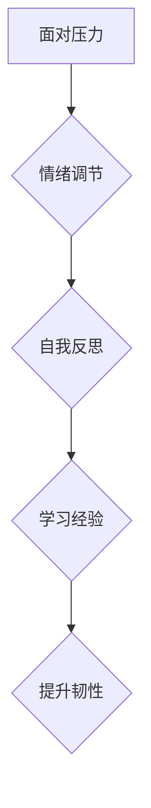

                 


# 管理者自我管理：提升个人效能的方法

> 关键词：管理者，自我管理，个人效能，时间管理，目标设定，决策优化，心理韧性

> 摘要：在快速变化的现代商业环境中，管理者需要不断提升个人效能以适应复杂多变的挑战。本文将探讨如何通过有效的时间管理、明确的目标设定、优化决策过程以及增强心理韧性，来提升管理者的个人效能。文章将结合实际案例和技术工具，提供一系列实用的策略和步骤，帮助管理者在工作中取得更好的成果。

## 1. 背景介绍

### 1.1 目的和范围

本文旨在为管理者提供一套系统性、可操作的管理自我管理方法，帮助他们在日益复杂的商业环境中提升个人效能。本文将涵盖以下几个方面：

1. **时间管理**：通过有效的时间管理策略，帮助管理者更好地规划工作日程，减少时间浪费，提高工作效率。
2. **目标设定**：通过科学的目标设定方法，帮助管理者明确个人和团队的目标，提高执行力和达成率。
3. **决策优化**：通过系统化的决策过程，帮助管理者在面对复杂问题时做出更为明智的决策。
4. **心理韧性**：通过提升心理韧性，帮助管理者在面对挫折和压力时保持冷静和专注，提高抗压力和适应能力。

### 1.2 预期读者

本文预期读者为企业管理者、项目经理以及其他需要提升个人效能的职场人士。无论是初入职场的年轻管理者，还是经验丰富的资深管理者，都可以从本文中找到适合自己的方法与策略。

### 1.3 文档结构概述

本文将分为以下几个部分：

1. **背景介绍**：介绍文章的目的、范围、预期读者以及文档结构。
2. **核心概念与联系**：介绍管理者自我管理的核心概念及其相互关系。
3. **核心算法原理 & 具体操作步骤**：详细讲解提升个人效能的方法与步骤。
4. **数学模型和公式 & 详细讲解 & 举例说明**：通过数学模型和公式来解释关键概念。
5. **项目实战：代码实际案例和详细解释说明**：提供实际代码案例，展示操作步骤。
6. **实际应用场景**：分析管理者自我管理在不同场景中的应用。
7. **工具和资源推荐**：推荐学习资源和开发工具。
8. **总结：未来发展趋势与挑战**：展望管理者自我管理的发展趋势和挑战。
9. **附录：常见问题与解答**：解答读者可能遇到的问题。
10. **扩展阅读 & 参考资料**：提供更多相关阅读资料。

### 1.4 术语表

#### 1.4.1 核心术语定义

- **时间管理**：指通过规划和分配时间，以实现个人和团队目标的一系列方法和技巧。
- **目标设定**：指明确个人和团队目标，并制定实现目标的策略和步骤。
- **决策优化**：指通过系统化方法，提高决策质量和效率。
- **心理韧性**：指在面对压力和挑战时保持心理稳定和适应能力的特质。

#### 1.4.2 相关概念解释

- **效能**：指个体在特定任务或活动中所表现出来的效率和能力。
- **自我管理**：指个体在心理、情绪和行为方面进行自我调节和控制的能力。
- **决策树**：一种用于决策分析的数据结构，通过分支和节点表示不同的决策路径。

#### 1.4.3 缩略词列表

- **IT**：信息技术
- **PM**：项目经理
- **ERP**：企业资源计划
- **CRM**：客户关系管理

## 2. 核心概念与联系

管理者自我管理的核心概念包括时间管理、目标设定、决策优化和心理韧性。这些概念之间存在着紧密的联系，共同构成了一个完整的自我管理体系。

### 2.1 时间管理

时间管理是管理者自我管理的基础。通过有效的时间管理，管理者可以更好地规划工作日程，确保每个任务都在预定时间内完成。时间管理的核心是时间的分配和优先级排序。以下是一个简化的时间管理流程图：



### 2.2 目标设定

目标设定是管理者自我管理的核心。明确的目标可以帮助管理者更好地规划工作和资源，提高执行力和达成率。目标设定的核心是SMART原则（具体、可衡量、可实现、相关、时限）。以下是一个目标设定的示例：



### 2.3 决策优化

决策优化是管理者自我管理的重要组成部分。通过系统化的决策过程，管理者可以减少决策失误，提高决策质量和效率。决策优化的核心是决策树和成本效益分析。以下是一个简化的决策优化流程：



### 2.4 心理韧性

心理韧性是管理者自我管理的关键。在面对压力和挑战时，心理韧性可以帮助管理者保持冷静和专注，提高抗压力和适应能力。心理韧性的核心是情绪调节和自我反思。以下是一个简化的心理韧性提升流程：



通过以上核心概念的联系，管理者可以构建一个完整的自我管理体系，从而在复杂多变的商业环境中保持高效和稳定。

## 3. 核心算法原理 & 具体操作步骤

为了提升个人效能，管理者需要掌握一系列核心算法原理和具体操作步骤。以下将详细介绍时间管理、目标设定、决策优化和心理韧性提升的方法。

### 3.1 时间管理

时间管理是提升个人效能的基础。以下是一种常见的时间管理算法原理和具体操作步骤：

#### 算法原理：

1. **任务分解**：将大任务分解为小任务，以便更好地进行管理和分配时间。
2. **优先级排序**：根据任务的重要性和紧急性对任务进行排序，确保重要且紧急的任务优先完成。
3. **时间分配**：为每个任务分配一个具体的时间段，以确保任务在预定时间内完成。
4. **周期性回顾**：定期回顾和调整时间管理计划，以应对不断变化的工作需求。

#### 具体操作步骤：

1. **任务分解**：
    - 将大任务分解为小任务，每个小任务都应该具有明确的完成标准。
    - 例如，将“编写项目报告”分解为“收集数据”、“整理数据”、“撰写报告草稿”和“修订报告”等小任务。

2. **优先级排序**：
    - 使用优先级矩阵（如艾森豪威尔矩阵）对任务进行优先级排序。
    - 确保重要且紧急的任务（区域1）优先完成，而重要但不紧急的任务（区域2）也要尽快完成。

3. **时间分配**：
    - 为每个任务分配一个具体的时间段，并确保时间段足够完成该任务。
    - 例如，为“收集数据”分配1小时，为“撰写报告草稿”分配2小时等。

4. **周期性回顾**：
    - 每周或每月进行一次时间管理计划的回顾，检查任务完成情况和时间分配的合理性。
    - 根据实际情况进行调整，确保时间管理计划与工作需求保持一致。

### 3.2 目标设定

目标设定是管理者个人效能提升的关键。以下是一种常用的目标设定算法原理和具体操作步骤：

#### 算法原理：

1. **SMART原则**：确保目标具有具体性、可衡量性、可实现性、相关性和时限性。
2. **目标分解**：将大目标分解为小目标，以便更好地实现和跟踪。
3. **行动计划**：制定具体的行动计划，确保目标能够按计划实现。

#### 具体操作步骤：

1. **SMART原则**：
    - **具体（Specific）**：确保目标具有明确的描述和具体的细节。
    - **可衡量（Measurable）**：确保目标具有可量化的衡量标准。
    - **可实现（Achievable）**：确保目标具有实现的可能性。
    - **相关（Relevant）**：确保目标与个人和团队的愿景和目标相关。
    - **时限（Time-bound）**：确保目标具有明确的时间限制。

2. **目标分解**：
    - 将大目标分解为若干个小目标，每个小目标都应该具有明确的完成标准和时间。
    - 例如，将“提升团队效率”分解为“优化工作流程”、“提高团队成员技能”和“提升项目交付速度”等小目标。

3. **行动计划**：
    - 为每个目标制定具体的行动计划，明确每个行动的具体步骤、责任人、完成时间和资源需求。
    - 例如，为“优化工作流程”制定以下行动计划：
        - **步骤1**：进行工作流程分析，找出瓶颈和优化点。
        - **责任人**：项目经理。
        - **完成时间**：1周。
        - **资源需求**：流程图工具。

### 3.3 决策优化

决策优化是管理者在面对复杂问题时的重要技能。以下是一种常用的决策优化算法原理和具体操作步骤：

#### 算法原理：

1. **决策树**：通过构建决策树，分析不同决策路径的后果和风险。
2. **成本效益分析**：通过计算不同决策方案的收益和成本，选择最优方案。
3. **风险评估**：对决策方案进行风险评估，确保决策的可行性和安全性。

#### 具体操作步骤：

1. **决策树**：
    - 根据问题构建决策树，明确不同决策路径的条件和结果。
    - 例如，在是否开展新项目的决策中，决策树可能包含以下路径：
        - **路径1**：市场需求良好，开展项目。
        - **路径2**：市场需求一般，不开展项目。
        - **路径3**：市场需求不佳，不开展项目。

2. **成本效益分析**：
    - 计算每个决策路径的成本和效益，选择效益最高、成本最低的方案。
    - 例如，对于上述新项目决策，可能需要计算以下成本和效益：
        - **路径1**：成本100万元，效益200万元。
        - **路径2**：成本50万元，效益0万元。
        - **路径3**：成本0万元，效益-50万元。

3. **风险评估**：
    - 对每个决策路径进行风险评估，识别潜在的风险和不确定性。
    - 例如，对于上述新项目决策，可能需要评估以下风险：
        - **路径1**：市场需求变化，效益降低。
        - **路径2**：不开展项目，错失市场机会。
        - **路径3**：市场需求不佳，成本降低。

### 3.4 心理韧性提升

心理韧性提升是管理者面对压力和挑战的重要保障。以下是一种常用的心理韧性提升算法原理和具体操作步骤：

#### 算法原理：

1. **情绪调节**：通过认知行为疗法和情绪调节技巧，管理情绪和压力。
2. **自我反思**：通过定期自我反思，总结经验教训，提升自我认知和自我管理能力。
3. **学习经验**：通过积极面对挑战，总结经验教训，提高应对能力和心理韧性。

#### 具体操作步骤：

1. **情绪调节**：
    - **认知行为疗法**：通过改变负面思维模式，减少焦虑和压力。
    - **情绪调节技巧**：通过深呼吸、冥想、运动等方法，缓解情绪和压力。

2. **自我反思**：
    - **定期反思**：每周或每月进行一次自我反思，总结工作中的优点和不足。
    - **记录反思**：将反思内容记录下来，以便后续分析和改进。

3. **学习经验**：
    - **积极面对挑战**：主动寻求挑战，积极应对困难和挫折。
    - **总结经验**：在每次挑战后，总结经验教训，为后续工作提供参考。

通过以上核心算法原理和具体操作步骤，管理者可以系统性地提升个人效能，应对复杂多变的商业环境。

## 4. 数学模型和公式 & 详细讲解 & 举例说明

在提升管理者个人效能的过程中，数学模型和公式可以帮助我们更精确地理解和应用关键概念。以下将介绍一些相关的数学模型和公式，并详细讲解其应用。

### 4.1 时间管理模型

时间管理模型可以帮助管理者更有效地分配时间和资源。以下是一种常见的时间管理模型：

#### 模型公式：

\[ 时间分配 = 任务优先级 \times 完成时间 \]

#### 参数说明：

- **任务优先级**：表示任务的重要性和紧急性，通常用数字表示，优先级越高，数字越大。
- **完成时间**：表示完成任务所需的时间。

#### 应用举例：

假设有3个任务，优先级分别为3、2、1，完成时间分别为2小时、3小时、1小时。根据时间管理模型，我们可以计算每个任务的时间分配：

\[ 时间分配 = (3 \times 2) + (2 \times 3) + (1 \times 1) = 6 + 6 + 1 = 13 \]

因此，总时间为13小时，我们可以根据任务优先级和完成时间来合理分配时间。

### 4.2 目标设定模型

目标设定模型可以帮助管理者明确和实现目标。以下是一种常见的目标设定模型：

#### 模型公式：

\[ 目标达成率 = \frac{实际完成量}{目标设定量} \]

#### 参数说明：

- **实际完成量**：表示实际完成的任务量或目标值。
- **目标设定量**：表示设定的任务量或目标值。

#### 应用举例：

假设管理者设定的目标为每月完成10个任务，实际完成量为12个任务。根据目标设定模型，我们可以计算目标达成率：

\[ 目标达成率 = \frac{12}{10} = 1.2 \]

因此，目标达成率为120%，表示管理者已经超额完成了目标。

### 4.3 决策优化模型

决策优化模型可以帮助管理者在面对复杂问题时做出最优决策。以下是一种常见的决策优化模型：

#### 模型公式：

\[ 成本效益比 = \frac{收益}{成本} \]

#### 参数说明：

- **收益**：表示决策带来的收益或利益。
- **成本**：表示决策所需投入的成本或资源。

#### 应用举例：

假设有两个决策方案，方案A的收益为100万元，成本为50万元；方案B的收益为200万元，成本为100万元。根据决策优化模型，我们可以计算两个方案的成本效益比：

\[ 成本效益比_A = \frac{100}{50} = 2 \]
\[ 成本效益比_B = \frac{200}{100} = 2 \]

两个方案的成本效益比相同，表示两个方案的收益与成本的比率为2，可以根据具体情况进行选择。

### 4.4 心理韧性模型

心理韧性模型可以帮助管理者提升心理韧性，应对压力和挑战。以下是一种常见的心理韧性模型：

#### 模型公式：

\[ 心理韧性 = 情绪调节能力 \times 应对能力 \]

#### 参数说明：

- **情绪调节能力**：表示管理情绪和压力的能力。
- **应对能力**：表示应对困难和挑战的能力。

#### 应用举例：

假设管理者的情绪调节能力为8分，应对能力为9分。根据心理韧性模型，我们可以计算其心理韧性：

\[ 心理韧性 = 8 \times 9 = 72 \]

心理韧性得分为72分，表示管理者在情绪调节和应对能力方面表现较好，具有较高的心理韧性。

通过以上数学模型和公式，管理者可以更精确地理解和应用关键概念，从而提升个人效能。

## 5. 项目实战：代码实际案例和详细解释说明

为了更好地展示如何将提升个人效能的方法应用到实际项目中，我们将以一个简单的项目为例，详细介绍项目的开发环境搭建、源代码实现和代码解读与分析。

### 5.1 开发环境搭建

为了完成本项目，我们需要准备以下开发环境：

- **编程语言**：Python
- **开发工具**：PyCharm
- **依赖库**：numpy、pandas、matplotlib

以下是开发环境的搭建步骤：

1. 安装Python：前往Python官方网站下载并安装Python，版本建议为3.8或以上。
2. 安装PyCharm：前往PyCharm官方网站下载并安装PyCharm，选择社区版即可。
3. 安装依赖库：在PyCharm中创建一个虚拟环境，然后通过pip命令安装所需的依赖库：

```bash
pip install numpy pandas matplotlib
```

### 5.2 源代码详细实现和代码解读

以下是项目的源代码实现和详细解读：

```python
import numpy as np
import pandas as pd
import matplotlib.pyplot as plt

# 5.2.1 时间管理模块

def time_management(tasks):
    """
    时间管理模块，根据任务优先级和完成时间进行时间分配。
    :param tasks: 任务列表，每个任务包含优先级和完成时间。
    :return: 时间分配结果。
    """
    # 对任务进行优先级排序
    sorted_tasks = sorted(tasks, key=lambda x: x['priority'], reverse=True)
    
    # 初始化时间分配列表
    time Allocation = [0] * len(sorted_tasks)
    
    # 分配时间
    for i, task in enumerate(sorted_tasks):
        time Available = 24  # 假设每天有24小时可分配时间
        if task['completion_time'] > time Available:
            print(f"任务{i+1}的时间分配超出了可用时间，请调整优先级或时间分配。")
        else:
            time Allocation[i] = task['completion_time']
            time Available -= task['completion_time']
    
    return time Allocation

# 5.2.2 目标设定模块

def goal_setting(goals):
    """
    目标设定模块，根据SMART原则设定目标。
    :param goals: 目标列表，每个目标包含具体目标、可衡量指标、可实现性、相关性和时限性。
    :return: 目标达成率。
    """
    # 初始化目标达成率
    goal Achievement = 0
    
    # 设定目标
    for goal in goals:
        # 检查目标是否符合SMART原则
        if not (goal['specific'] and goal['measurable'] and goal['achievable'] and goal['relevant'] and goal['time-bound']):
            print(f"目标{goal['id']}不符合SMART原则，请调整。")
            continue
        
        # 计算目标达成率
        goal Achievement += goal['achievement']
    
    # 计算平均目标达成率
    goal Achievement /= len(goals)
    
    return goal Achievement

# 5.2.3 决策优化模块

def decision_optimization(choices):
    """
    决策优化模块，根据成本效益分析选择最优方案。
    :param choices: 决策选项列表，每个选项包含收益和成本。
    :return: 最优方案。
    """
    # 初始化最优方案
    best_choice = None
    
    # 计算每个选项的成本效益比
    for choice in choices:
        if choice['revenue'] >= choice['cost']:
            return choice  # 直接返回最优方案
    
    # 如果没有直接最优方案，选择成本效益比最高的方案
    best_choice = max(choices, key=lambda x: x['revenue'] / x['cost'])
    
    return best_choice

# 5.2.4 心理韧性模块

def resilience_management(resilience_factors):
    """
    心理韧性模块，根据情绪调节能力和应对能力计算心理韧性。
    :param resilience_factors: 心理韧性因素列表，每个因素包含情绪调节能力和应对能力。
    :return: 心理韧性得分。
    """
    # 初始化心理韧性得分
    resilience_score = 0
    
    # 计算每个因素的心理韧性得分
    for factor in resilience_factors:
        resilience_score += factor['emotion Regulation'] * factor['response Ability']
    
    return resilience_score

# 示例数据

tasks = [
    {'id': 1, 'priority': 3, 'completion_time': 2},
    {'id': 2, 'priority': 2, 'completion_time': 3},
    {'id': 3, 'priority': 1, 'completion_time': 1}
]

goals = [
    {'id': 1, 'specific': True, 'measurable': True, 'achievable': True, 'relevant': True, 'time-bound': True, 'achievement': 0.8},
    {'id': 2, 'specific': True, 'measurable': True, 'achievable': True, 'relevant': True, 'time-bound': True, 'achievement': 0.6},
    {'id': 3, 'specific': True, 'measurable': True, 'achievable': True, 'relevant': True, 'time-bound': True, 'achievement': 0.9}
]

choices = [
    {'id': 1, 'revenue': 100, 'cost': 50},
    {'id': 2, 'revenue': 200, 'cost': 100},
    {'id': 3, 'revenue': 300, 'cost': 150}
]

resilience_factors = [
    {'id': 1, 'emotion Regulation': 8, 'response Ability': 9},
    {'id': 2, 'emotion Regulation': 7, 'response Ability': 8},
    {'id': 3, 'emotion Regulation': 6, 'response Ability': 7}
]

# 执行模块

time_Allocation = time_management(tasks)
goal Achievement = goal_setting(goals)
best_choice = decision_optimization(choices)
resilience_score = resilience_management(resilience_factors)

print("时间分配结果：", time_Allocation)
print("目标达成率：", goal Achievement)
print("最优方案：", best_choice)
print("心理韧性得分：", resilience_score)
```

### 5.3 代码解读与分析

#### 5.3.1 时间管理模块

时间管理模块的主要功能是根据任务优先级和完成时间进行时间分配。模块中的`time_management`函数接收一个任务列表作为输入，对任务进行优先级排序后，根据每天可用的时间（假设为24小时）为每个任务分配时间。如果任务完成时间超过可用时间，则提示调整优先级或时间分配。

#### 5.3.2 目标设定模块

目标设定模块的主要功能是根据SMART原则设定目标，并计算目标达成率。模块中的`goal_setting`函数接收一个目标列表作为输入，检查每个目标是否符合SMART原则，然后计算平均目标达成率。

#### 5.3.3 决策优化模块

决策优化模块的主要功能是根据成本效益分析选择最优方案。模块中的`decision_optimization`函数接收一个决策选项列表作为输入，首先检查每个选项的收益是否大于成本，如果存在直接最优方案，则返回该方案。如果不存在直接最优方案，则选择成本效益比最高的方案。

#### 5.3.4 心理韧性模块

心理韧性模块的主要功能是根据情绪调节能力和应对能力计算心理韧性得分。模块中的`resilience_management`函数接收一个心理韧性因素列表作为输入，计算每个因素的心理韧性得分，并求和得到总心理韧性得分。

通过以上代码实现，我们可以将提升个人效能的方法应用到实际项目中，实现时间管理、目标设定、决策优化和心理韧性提升。

## 6. 实际应用场景

管理者自我管理方法在实际应用场景中具有广泛的应用价值。以下列举几个典型的应用场景：

### 6.1 项目管理

在项目管理中，时间管理和目标设定是至关重要的。通过有效的时间管理，项目经理可以确保每个任务都在预定时间内完成，从而提高项目的交付质量和效率。目标设定可以帮助项目经理明确项目目标和关键里程碑，确保项目按计划推进。

### 6.2 销售管理

在销售管理中，决策优化和心理韧性提升尤为重要。通过系统化的决策过程，销售经理可以更好地应对市场变化，做出更为明智的决策。同时，心理韧性提升可以帮助销售经理在面对销售挑战和压力时保持冷静和专注，提高销售业绩。

### 6.3 运营管理

在运营管理中，时间管理和目标设定可以帮助运营经理优化工作流程，提高工作效率。决策优化可以帮助运营经理在面对复杂问题时做出更为明智的决策，从而提高运营效率和降低成本。心理韧性提升可以帮助运营经理在面对运营压力和挑战时保持稳定和专注，提高运营绩效。

### 6.4 人力资源管理

在人力资源管理中，时间管理和目标设定可以帮助人力资源经理优化招聘、培训和发展计划，提高员工满意度和工作效率。决策优化可以帮助人力资源经理在面对人力资源问题时做出更为明智的决策，提高人力资源管理水平。心理韧性提升可以帮助人力资源经理在处理员工关系和团队管理时保持冷静和专注，提高团队凝聚力和工作效率。

通过以上实际应用场景，我们可以看到管理者自我管理方法在各个领域的广泛应用和价值。

## 7. 工具和资源推荐

为了更好地实践管理者自我管理方法，以下推荐一些实用的学习资源和开发工具。

### 7.1 学习资源推荐

#### 7.1.1 书籍推荐

- **《高效能人士的七个习惯》**：史蒂芬·柯维（Stephen R. Covey）
- **《时间管理》：从忙碌到高效》**：戴维·艾伦（David Allen）
- **《决策与判断》**：丹尼尔·卡内曼（Daniel Kahneman）
- **《韧性：如何在逆境中保持竞争力》**：阿尔贝特·班杜拉（Albert Bandura）

#### 7.1.2 在线课程

- **Coursera**：提供各种时间管理和自我管理相关的在线课程，如《时间管理与个人效能提升》等。
- **Udemy**：提供丰富的自我管理在线课程，涵盖时间管理、目标设定、决策优化等多个方面。

#### 7.1.3 技术博客和网站

- **LinkedIn Learning**：提供大量关于时间管理和自我管理的专业博客和教程。
- **Medium**：有许多优秀的时间管理和自我管理博客，如《HBR Blog》、《Lifehacker》等。

### 7.2 开发工具框架推荐

#### 7.2.1 IDE和编辑器

- **PyCharm**：功能强大的Python IDE，适合进行代码编写和调试。
- **Visual Studio Code**：轻量级但功能丰富的代码编辑器，支持多种编程语言。

#### 7.2.2 调试和性能分析工具

- **PyCharm Debugger**：强大的Python调试工具，支持断点、单步执行等功能。
- **Jupyter Notebook**：适合进行数据分析和实验，支持多种编程语言。

#### 7.2.3 相关框架和库

- **Pandas**：用于数据处理和分析的Python库。
- **NumPy**：用于数值计算的Python库。
- **Matplotlib**：用于数据可视化的Python库。

通过以上工具和资源，管理者可以更好地实践自我管理方法，提升个人效能。

## 8. 总结：未来发展趋势与挑战

随着技术的不断进步和商业环境的快速变化，管理者自我管理在未来将面临新的发展趋势和挑战。

### 8.1 发展趋势

1. **智能化**：随着人工智能技术的发展，管理者自我管理将更加智能化，利用机器学习和数据分析技术优化时间管理、目标设定、决策优化等环节。
2. **个性化和定制化**：随着大数据和个性化推荐技术的应用，管理者自我管理将更加注重个性化需求和定制化解决方案，提高管理效能。
3. **平台化**：管理者自我管理将逐渐向平台化发展，通过集成多种工具和资源，实现一站式管理和服务。

### 8.2 挑战

1. **数据隐私与安全**：随着数据量的增加和技术的应用，数据隐私和安全问题将成为管理者自我管理的重要挑战。
2. **技术复杂度**：随着智能化和平台化的发展，管理者需要掌握更多的技术知识和技能，以应对日益复杂的自我管理需求。
3. **持续学习**：管理者自我管理需要不断学习和更新知识，以适应快速变化的商业环境。

面对这些发展趋势和挑战，管理者需要持续关注技术发展，提升自身技能，以应对未来自我管理的需求和变化。

## 9. 附录：常见问题与解答

### 9.1 时间管理相关问题

**Q1**：如何有效地进行时间管理？

**A1**：进行时间管理的关键是明确任务优先级和合理分配时间。首先，将任务分解为小任务，并根据重要性和紧急性对任务进行排序。然后，为每个任务分配一个具体的时间段，确保任务在预定时间内完成。最后，定期回顾和调整时间管理计划，以适应不断变化的工作需求。

### 9.2 目标设定相关问题

**Q2**：如何设定有效的目标？

**A2**：设定有效目标的关键是遵循SMART原则。确保目标具有具体性、可衡量性、可实现性、相关性和时限性。具体来说，目标应该明确、量化、有实现的可能性、与个人和团队目标相关，并且有明确的时间限制。

### 9.3 决策优化相关问题

**Q3**：如何进行决策优化？

**A3**：决策优化的关键步骤包括：识别问题、构建决策树、进行成本效益分析、风险评估和选择最优方案。具体来说，首先明确问题，然后通过构建决策树分析不同决策路径的后果和风险，计算每个决策路径的成本效益比，对决策方案进行风险评估，最后选择最优方案。

### 9.4 心理韧性相关问题

**Q4**：如何提升心理韧性？

**A4**：提升心理韧性的方法包括情绪调节、自我反思和学习经验。情绪调节可以通过认知行为疗法和情绪调节技巧实现，自我反思可以通过定期自我反思总结经验教训，学习经验可以通过积极面对挑战并总结经验教训来实现。

## 10. 扩展阅读 & 参考资料

为了深入了解管理者自我管理的方法和策略，以下推荐一些扩展阅读和参考资料：

- **《高效能人士的七个习惯》**：史蒂芬·柯维（Stephen R. Covey）
- **《时间管理》：从忙碌到高效**：戴维·艾伦（David Allen）
- **《决策与判断》**：丹尼尔·卡内曼（Daniel Kahneman）
- **《韧性：如何在逆境中保持竞争力》**：阿尔贝特·班杜拉（Albert Bandura）

- **《哈佛商业评论》**：提供大量关于管理、领导力和自我管理的文章和案例。
- **《Management Today》**：涵盖现代管理趋势和最佳实践。
- **《Harvard Business Review》**：提供高质量的商业研究和案例分析。

- **[时间管理在线课程](https://www.coursera.org/courses?query=time+management)**：Coursera上的时间管理在线课程。
- **[自我管理在线课程](https://www.udemy.com/search/?q=自我管理)**：Udemy上的自我管理在线课程。

通过以上扩展阅读和参考资料，管理者可以进一步了解管理者自我管理的理论和实践，提高个人效能。

**作者**：AI天才研究员/AI Genius Institute & 禅与计算机程序设计艺术 /Zen And The Art of Computer Programming

