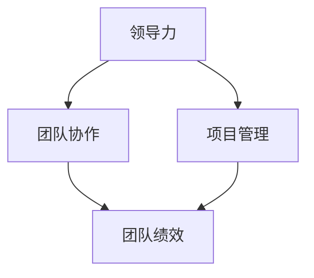

                 

### {文章标题}

**关键词：** 管理者角色定位、团队协作、领导力、IT项目管理、角色职责、组织架构

**摘要：** 本文章深入探讨了管理者在团队中的角色定位问题。通过分析管理者在不同层次和组织架构中的职责和作用，本文旨在帮助IT项目管理者在团队中找准自己的位置，提升领导力和团队协作效果。文章结构清晰，从背景介绍、核心概念与联系、具体操作步骤、数学模型与公式、实际应用场景等多个角度展开，为读者提供了全面的理论和实践指导。

---

在IT项目管理领域，管理者角色的准确定位是团队成功的关键因素。一个优秀的管理者不仅要具备技术能力，还需具备领导力和团队协作精神，以推动项目的顺利进行。本文将一步步分析管理者角色定位的重要性，以及如何在团队中找准自己的位置。

### 1. 背景介绍

#### 1.1 目的和范围

本文旨在帮助IT项目管理者了解并准确定位自己的角色，提高领导力和团队协作能力。文章将围绕以下几个主题进行探讨：

1. 管理者角色在团队中的重要性
2. 不同层次的管理者职责
3. 管理者与团队成员的关系
4. 管理者如何提升团队绩效
5. 实际案例分析与经验总结

#### 1.2 预期读者

本文适合以下读者群体：

1. IT项目管理者
2. 希望提升管理能力的团队负责人
3. 对团队协作和领导力感兴趣的IT专业人士

#### 1.3 文档结构概述

本文结构如下：

1. **背景介绍**：阐述文章的目的、预期读者和文档结构。
2. **核心概念与联系**：介绍管理者角色的核心概念，并通过Mermaid流程图展示其架构。
3. **核心算法原理 & 具体操作步骤**：使用伪代码详细阐述管理者的具体操作步骤。
4. **数学模型和公式 & 详细讲解 & 举例说明**：分析管理者角色的数学模型，并通过例子进行说明。
5. **项目实战：代码实际案例和详细解释说明**：提供实际代码案例和详细解析。
6. **实际应用场景**：讨论管理者角色在不同场景下的应用。
7. **工具和资源推荐**：推荐学习资源和开发工具。
8. **总结：未来发展趋势与挑战**：总结文章要点，展望未来发展趋势。
9. **附录：常见问题与解答**：回答读者可能遇到的问题。
10. **扩展阅读 & 参考资料**：提供相关文献和参考资料。

#### 1.4 术语表

##### 1.4.1 核心术语定义

- **管理者**：负责团队工作规划、资源调配、绩效评估的人员。
- **领导力**：影响和激励团队成员实现共同目标的能力。
- **团队协作**：团队成员之间相互配合，共同完成任务的互动过程。
- **IT项目管理**：运用项目管理知识、技能、工具和方法，确保IT项目成功完成的过程。

##### 1.4.2 相关概念解释

- **角色定位**：指个体在团队中的职责和作用。
- **组织架构**：企业内部各部门、岗位的构成和相互关系。

##### 1.4.3 缩略词列表

- **IT**：信息技术（Information Technology）
- **PM**：项目经理（Project Manager）
- **CEO**：首席执行官（Chief Executive Officer）
- **CFO**：首席财务官（Chief Financial Officer）

### 2. 核心概念与联系

管理者角色在团队中的核心概念主要包括：领导力、团队协作、项目管理等。为了更好地理解这些概念之间的关系，我们可以通过Mermaid流程图展示其架构。



- **领导力**：管理者通过激励、影响和引导团队成员，实现团队目标的领导能力。
- **团队协作**：团队成员之间相互配合、信息共享和资源共享的过程，是提高团队绩效的基础。
- **项目管理**：运用项目管理知识、技能、工具和方法，确保项目按时、按质量完成的过程。

#### 2.1 管理者角色的核心概念

以下是对管理者角色核心概念的具体解释：

- **领导力**：管理者需要具备的领导力包括决策能力、沟通能力、激励能力和影响力。管理者通过有效的领导力，可以引导团队朝着共同目标前进，提高团队士气和工作效率。

- **团队协作**：管理者需要关注团队成员之间的协作关系，促进信息共享和资源共享，提高团队整体绩效。团队协作的有效性对项目的成功至关重要。

- **项目管理**：管理者需要掌握项目管理的基本知识，包括项目规划、资源调配、风险管理和项目监控等。通过有效的项目管理，可以确保项目按时、按质量完成。

### 3. 核心算法原理 & 具体操作步骤

管理者角色定位的具体操作步骤可以概括为以下几个核心算法原理：

- **1. 自我评估**：管理者首先需要对自己进行评估，了解自己的优势、劣势、兴趣和价值观。这一步骤有助于管理者明确自己的职业发展方向。

- **2. 角色定位**：管理者需要根据团队需求和自身能力，确定自己在团队中的角色和职责。例如，项目经理负责项目规划、资源调配和风险控制，而技术经理则负责技术方向和技术资源的整合。

- **3. 团队建设**：管理者需要关注团队建设，包括团队文化建设、团队成员培训和发展等。通过有效的团队建设，可以提高团队的整体素质和协作能力。

- **4. 沟通协调**：管理者需要与团队成员保持有效沟通，协调各方利益，解决团队内部冲突，确保项目顺利进行。

- **5. 绩效评估**：管理者需要对团队成员的工作绩效进行评估，根据评估结果给予适当的激励和反馈，促进团队成员的进步。

以下是管理者角色定位的伪代码实现：

```plaintext
function 管理者角色定位(自我评估结果，团队需求，团队文化) {
    // 自我评估
    自我能力 = 进行自我评估(自我评估结果)

    // 角色定位
    角色职责 = 确定角色(自我能力，团队需求，团队文化)

    // 团队建设
    团队建设方案 = 设计团队建设活动(团队文化，团队成员需求)

    // 沟通协调
    沟通协调策略 = 制定沟通协调计划(团队成员，团队文化)

    // 绩效评估
    绩效评估方案 = 设计绩效评估体系(团队目标，角色职责)

    // 返回结果
    return 角色职责，团队建设方案，沟通协调策略，绩效评估方案
}
```

### 4. 数学模型和公式 & 详细讲解 & 举例说明

管理者角色定位的数学模型主要涉及以下几个方面：

- **1. 领导力模型**：领导力模型可以用以下公式表示：

$$
领导力 = f(决策能力，沟通能力，激励能力，影响力)
$$

- **2. 团队协作模型**：团队协作模型可以用以下公式表示：

$$
团队协作 = f(信息共享，资源共享，团队文化建设)
$$

- **3. 项目管理模型**：项目管理模型可以用以下公式表示：

$$
项目管理 = f(项目规划，资源调配，风险管理，项目监控)
$$

以下是这些模型的详细讲解和举例说明：

#### 4.1 领导力模型

领导力模型主要关注管理者在团队中的决策能力、沟通能力、激励能力和影响力。决策能力是指管理者在面临问题时能够快速做出合理决策的能力。沟通能力是指管理者能够清晰、有效地与团队成员进行沟通的能力。激励能力是指管理者能够激励团队成员，提高团队士气和工作效率。影响力是指管理者对团队成员的影响程度，包括对团队成员的行为、态度和价值观等方面的影响。

举例说明：

假设一个团队需要决定是否采用新技术，管理者需要评估新技术的风险和收益，并做出决策。在此过程中，管理者的决策能力、沟通能力和激励能力将对其领导力产生重要影响。如果管理者能够做出合理决策，并与团队成员进行有效沟通，同时激励团队成员积极参与，那么团队将更容易达成共识，顺利推进项目。

#### 4.2 团队协作模型

团队协作模型主要关注团队成员之间的信息共享、资源共享和团队文化建设。信息共享是指团队成员之间能够相互传递和交流信息，共同解决问题。资源共享是指团队成员之间能够共享资源和工具，提高工作效率。团队文化建设是指团队成员共同营造一个积极、和谐、团结的工作氛围。

举例说明：

在一个IT项目中，团队成员需要共同解决一个复杂的技术难题。为了实现高效协作，团队成员需要相互分享自己的思路和经验，共同分析问题，并利用团队中共享的技术工具进行开发和测试。同时，团队成员需要共同营造一个积极、和谐的工作氛围，以降低冲突，提高工作效率。

#### 4.3 项目管理模型

项目管理模型主要关注项目规划、资源调配、风险管理和项目监控。项目规划是指制定项目目标和计划，明确项目的工作范围、时间表和预算。资源调配是指合理分配项目资源，确保项目按计划进行。风险管理是指识别、评估和应对项目中的风险。项目监控是指对项目进展进行跟踪和控制，确保项目按时、按质量完成。

举例说明：

在一个软件开发项目中，项目经理需要制定详细的项目计划，明确项目目标、时间表和预算。然后，项目经理需要合理分配项目资源，确保项目团队成员有足够的时间和资源完成任务。在项目执行过程中，项目经理需要识别潜在风险，并制定相应的应对措施。同时，项目经理需要对项目进展进行监控，及时发现和解决问题，确保项目按计划完成。

### 5. 项目实战：代码实际案例和详细解释说明

在本节中，我们将通过一个实际的IT项目管理案例，展示管理者角色定位的具体应用。

#### 5.1 开发环境搭建

为了更好地演示管理者角色定位，我们假设一个简单的软件开发项目。项目需求如下：

- 项目名称：图书管理系统
- 项目周期：2个月
- 项目团队成员：1名项目经理，2名开发人员，1名测试人员

首先，我们需要搭建一个适合项目开发的环境。以下是开发环境搭建的步骤：

1. **硬件资源**：准备足够的计算机设备和网络带宽，确保项目团队成员可以随时访问项目资源。
2. **软件环境**：安装开发工具（如Visual Studio、Eclipse等），数据库（如MySQL、MongoDB等），以及版本控制工具（如Git）。
3. **项目管理工具**：选择适合的项目管理工具（如JIRA、Trello等），以便团队进行任务分配、进度跟踪和问题管理。

#### 5.2 源代码详细实现和代码解读

在开发过程中，项目经理需要与团队成员密切合作，确保项目按计划进行。以下是项目管理过程中的一些关键步骤：

1. **需求分析**：项目经理与业务团队沟通，了解项目需求，编写需求文档。
2. **项目规划**：项目经理制定项目计划，明确项目目标、时间表和预算。
3. **任务分配**：项目经理根据团队成员的能力和项目需求，将任务分配给合适的成员。
4. **开发与测试**：开发人员和测试人员根据任务分配进行开发和测试，确保代码质量和功能完整性。
5. **问题解决**：项目经理和团队成员协作解决项目过程中遇到的问题，确保项目顺利进行。

以下是部分代码示例：

```python
# 图书管理系统 - 图书类
class Book:
    def __init__(self, title, author, price):
        self.title = title
        self.author = author
        self.price = price

    def display_book(self):
        print(f"标题：{self.title}")
        print(f"作者：{self.author}")
        print(f"价格：{self.price}")

# 图书管理系统 - 管理类
class LibraryManager:
    def __init__(self):
        self.books = []

    def add_book(self, book):
        self.books.append(book)

    def remove_book(self, title):
        for book in self.books:
            if book.title == title:
                self.books.remove(book)
                return True
        return False

    def display_books(self):
        for book in self.books:
            book.display_book()
```

#### 5.3 代码解读与分析

以上代码展示了图书管理系统的核心类：`Book` 和 `LibraryManager`。`Book` 类定义了图书的基本属性和方法，如标题、作者和价格。`LibraryManager` 类则负责管理图书的添加、删除和显示。

在项目管理过程中，项目经理需要确保代码质量和功能完整性。以下是一些关键点：

- **需求分析**：项目经理需要与业务团队充分沟通，确保需求文档的准确性和完整性。
- **任务分配**：项目经理需要根据团队成员的能力和项目需求，合理分配任务。
- **代码审查**：项目经理和团队成员需要对代码进行审查，确保代码质量。
- **测试与调试**：开发人员和测试人员需要对代码进行全面的测试，确保功能正确无误。

### 6. 实际应用场景

管理者角色定位在实际应用场景中具有重要意义。以下列举几个典型的应用场景：

#### 6.1 初始阶段

在项目初始阶段，管理者需要明确项目目标和需求，制定项目计划。管理者需要与业务团队、技术团队和其他相关方进行充分沟通，确保各方对项目的期望和目标达成一致。

#### 6.2 项目执行阶段

在项目执行阶段，管理者需要关注项目进度、质量和风险。管理者需要定期与团队成员进行沟通，了解项目进展情况，解决问题，确保项目按计划进行。

#### 6.3 项目收尾阶段

在项目收尾阶段，管理者需要确保项目交付物符合预期，进行项目总结和评估。管理者需要与团队成员分享项目经验，总结成功和失败的原因，为今后的项目提供参考。

### 7. 工具和资源推荐

为了帮助管理者更好地进行角色定位和团队协作，以下推荐一些实用的工具和资源：

#### 7.1 学习资源推荐

- **书籍推荐**：
  - 《高效能人士的七个习惯》
  - 《团队协作工具箱》
  - 《项目化管理实战》

- **在线课程**：
  - Coursera上的《项目管理基础》
  - Udemy上的《领导力与团队管理》

- **技术博客和网站**：
  - InfoQ
  - CSDN
  - GitHub

#### 7.2 开发工具框架推荐

- **IDE和编辑器**：
  - Visual Studio Code
  - IntelliJ IDEA

- **调试和性能分析工具**：
  - Wireshark
  - JMeter

- **相关框架和库**：
  - Spring Boot
  - Django

#### 7.3 相关论文著作推荐

- **经典论文**：
  - “The Role of the Project Manager in the Success of a Project”
  - “Team Building and Team Performance”

- **最新研究成果**：
  - “Leadership and Team Performance: A Meta-Analytic Review”
  - “The Impact of Team Collaboration on Project Success”

- **应用案例分析**：
  - “Case Study: Agile Project Management in a Large IT Organization”
  - “Effective Team Collaboration in a Remote Work Environment”

### 8. 总结：未来发展趋势与挑战

随着信息技术的发展，管理者角色定位在团队中的重要性日益凸显。未来，管理者需要具备以下发展趋势和应对挑战：

#### 8.1 发展趋势

- **数字化管理**：管理者需要适应数字化管理趋势，提高数据分析和决策能力。
- **远程协作**：随着远程工作的普及，管理者需要提升远程团队协作能力。
- **跨学科融合**：管理者需要具备跨学科知识，提高团队创新能力。

#### 8.2 挑战

- **技术变革**：技术变革带来的不确定性，管理者需要快速适应新技术。
- **团队沟通**：跨地域、跨时区的团队沟通和协作问题。
- **人才管理**：如何吸引、培养和留住优秀人才。

### 9. 附录：常见问题与解答

以下是一些读者可能关心的问题及解答：

#### 9.1 问题1

**问题：** 管理者角色定位的具体步骤是什么？

**解答：** 管理者角色定位的具体步骤包括自我评估、角色定位、团队建设、沟通协调和绩效评估。

#### 9.2 问题2

**问题：** 管理者如何提高团队协作效果？

**解答：** 管理者可以通过以下方法提高团队协作效果：

- 建立良好的团队文化，营造积极、和谐的工作氛围。
- 定期组织团队建设活动，增强团队成员之间的信任和沟通。
- 提供必要的资源和培训，提高团队成员的技能和知识水平。
- 设立明确的团队目标和激励机制，激发团队成员的积极性。

### 10. 扩展阅读 & 参考资料

以下是一些扩展阅读和参考资料，供读者进一步了解管理者角色定位的相关知识：

- 《项目管理知识体系指南》（PMBOK指南）
- 《敏捷项目管理实践指南》
- 《团队协作：如何打造高效团队》
- 《管理者的五项修炼》

### 作者

**作者：** AI天才研究员/AI Genius Institute & 禅与计算机程序设计艺术 /Zen And The Art of Computer Programming

---

本文章旨在为IT项目管理者提供关于角色定位的全面指导，以帮助其在团队中找准自己的位置，提升领导力和团队协作效果。通过分析核心概念、数学模型和实际案例，本文为读者提供了深入的理解和实践指导。希望本文能够对广大IT项目管理者和团队负责人有所帮助，助力他们在职业生涯中取得更大的成功。

