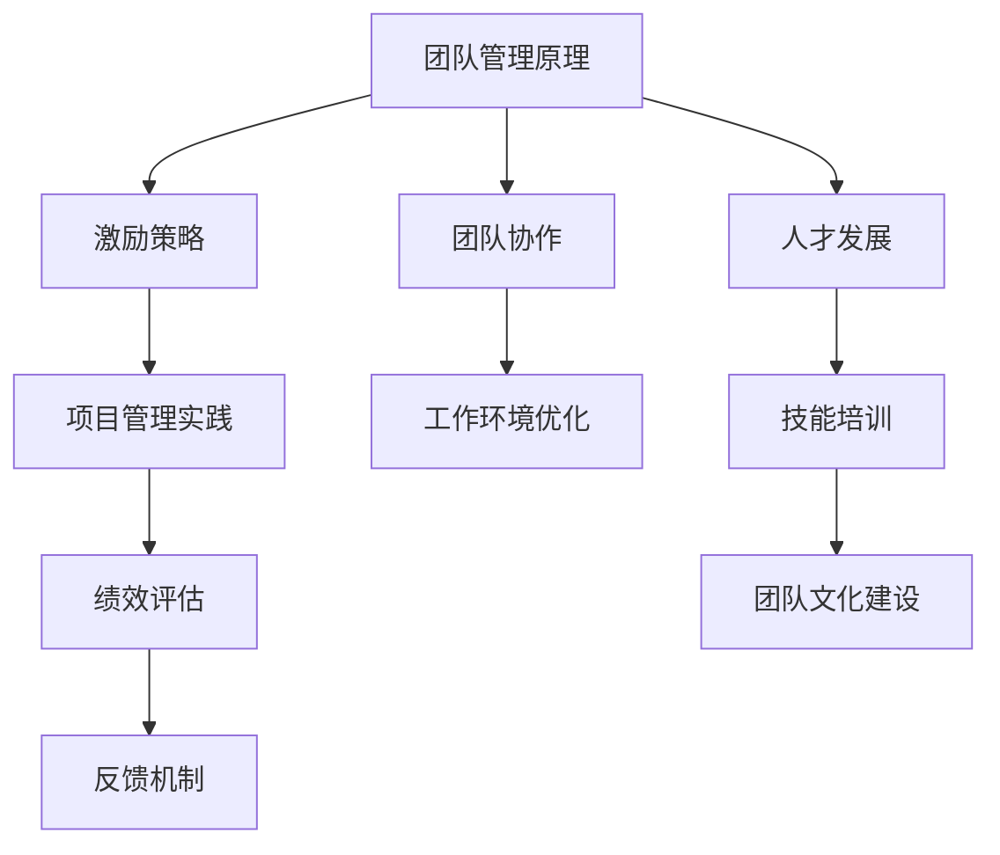
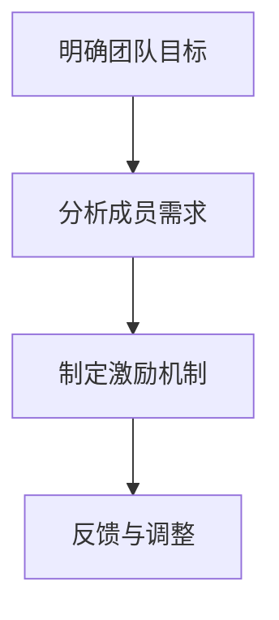
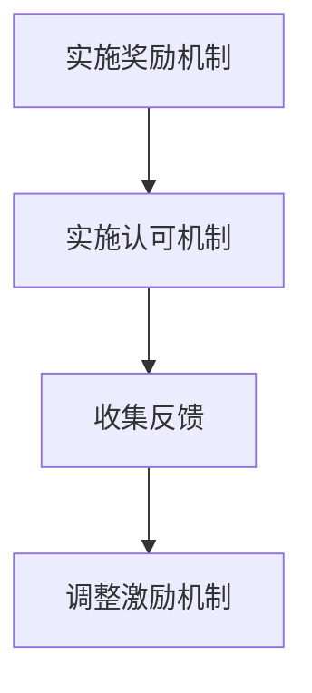
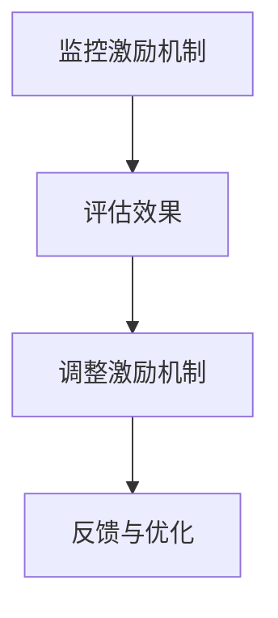

                 

# 管理艺术：激发团队潜力

> **关键词：团队管理、激励策略、人才发展、项目管理、高效协作**

> **摘要：本文旨在探讨如何运用管理艺术激发团队潜力，提高团队绩效。通过对团队管理核心概念的分析，介绍了一系列实用的激励策略和项目管理方法，以帮助读者构建高效、协同的工作环境。**

## 1. 背景介绍

### 1.1 目的和范围

本文的目标是向IT领域的从业者和管理者提供一套系统化的团队管理方法，旨在激发团队潜力，提升工作效率。文章将涵盖团队管理的核心概念、激励策略、项目管理实践以及实际应用场景。通过本文的学习，读者将能够：

- 理解团队管理的基本原理。
- 掌握有效的激励策略。
- 应用项目管理方法提升团队绩效。
- 构建高效、协作的工作环境。

### 1.2 预期读者

本文适合以下读者群体：

- IT团队主管和项目经理。
- 想要提高团队协作效率的技术领导者。
- 对团队管理和激励策略感兴趣的IT从业者。

### 1.3 文档结构概述

本文将按照以下结构进行阐述：

1. 背景介绍
2. 核心概念与联系
3. 核心算法原理 & 具体操作步骤
4. 数学模型和公式 & 详细讲解 & 举例说明
5. 项目实战：代码实际案例和详细解释说明
6. 实际应用场景
7. 工具和资源推荐
8. 总结：未来发展趋势与挑战
9. 附录：常见问题与解答
10. 扩展阅读 & 参考资料

### 1.4 术语表

#### 1.4.1 核心术语定义

- **团队管理**：对团队中的个体和整体进行引导、协调和激励，以实现共同目标的过程。
- **激励策略**：通过奖励、认可和其他手段激发团队成员积极性和创造力的方法。
- **项目管理**：规划、执行、监控和收尾项目的过程，以确保项目目标的实现。

#### 1.4.2 相关概念解释

- **团队潜力**：团队成员在特定环境中可能达到的最佳工作表现和成果。
- **绩效**：团队在完成项目过程中的工作质量和效率。

#### 1.4.3 缩略词列表

- **PM**：项目经理
- **IT**：信息技术
- **HR**：人力资源

## 2. 核心概念与联系

在探讨如何激发团队潜力之前，我们首先需要了解几个核心概念。以下是相关概念原理和架构的Mermaid流程图：



### 2.1 团队管理原理

团队管理原理是激发团队潜力的基础。它包括以下几个方面：

- **目标明确**：明确团队的目标和愿景，确保团队成员对目标有共同的认识。
- **角色分工**：合理分配团队成员的角色和职责，确保每个人都能发挥自己的专长。
- **沟通机制**：建立有效的沟通机制，确保信息的透明传递和团队协作。
- **激励机制**：通过奖励和认可激发团队成员的积极性和创造力。

### 2.2 激励策略

激励策略是团队管理中的重要一环，它包括以下几个方面：

- **奖励机制**：对团队成员的成就给予物质或精神上的奖励。
- **认可机制**：对团队成员的贡献给予公开的认可和赞扬。
- **目标设定**：为团队成员设定明确的、可实现的短期和长期目标。

### 2.3 项目管理实践

项目管理实践是确保团队高效协作和项目顺利完成的关键。它包括以下几个方面：

- **项目规划**：制定详细的项目计划，明确项目目标、任务和时间表。
- **任务分配**：根据团队成员的专长和资源情况，合理分配任务。
- **进度监控**：实时监控项目进度，确保项目按计划进行。
- **风险管理**：识别和应对项目风险，确保项目顺利推进。

### 2.4 团队协作

团队协作是激发团队潜力的关键因素。它包括以下几个方面：

- **信任建设**：通过合作和沟通建立团队成员之间的信任。
- **知识共享**：鼓励团队成员分享知识和经验，提高团队整体素质。
- **跨职能协作**：促进不同职能部门之间的协作，实现资源的最大化利用。

### 2.5 工作环境优化

工作环境优化是提高团队绩效的重要手段。它包括以下几个方面：

- **物理环境**：提供舒适、安全、高效的办公环境。
- **工具和资源**：提供必要的工具和资源，确保团队成员能够高效工作。
- **流程优化**：简化工作流程，减少冗余和重复劳动。

### 2.6 绩效评估

绩效评估是团队管理中的重要环节。它包括以下几个方面：

- **量化指标**：制定量化的绩效指标，评估团队成员的工作表现。
- **定期反馈**：定期对团队成员的工作进行反馈，指导其改进。
- **激励机制**：根据绩效评估结果，实施奖励或激励措施。

### 2.7 反馈机制

反馈机制是团队管理中不可或缺的一环。它包括以下几个方面：

- **正面反馈**：对团队成员的积极行为给予肯定和鼓励。
- **负面反馈**：对团队成员的不足之处给予建设性的批评和建议。
- **持续改进**：根据反馈结果，不断调整和优化团队管理和激励机制。

### 2.8 人才发展

人才发展是团队长期发展的关键。它包括以下几个方面：

- **技能培训**：为团队成员提供专业知识和技能培训。
- **职业规划**：为团队成员提供职业发展路径和机会。
- **团队合作**：鼓励团队成员之间的合作与交流，提高团队凝聚力。

## 3. 核心算法原理 & 具体操作步骤

在团队管理中，激励机制的设计是一个核心问题。以下是激励机制的算法原理和具体操作步骤：

### 3.1 激励机制算法原理

激励机制的设计需要考虑以下几个方面：

- **目标一致性**：激励机制应与团队目标保持一致，确保团队成员在追求个人利益的同时，也能为团队的整体目标贡献力量。
- **公平性**：激励机制应公平、公正，确保每个团队成员都能得到应有的认可和奖励。
- **灵活性**：激励机制应具有一定的灵活性，以适应不同团队和不同成员的需求。

### 3.2 具体操作步骤

以下是激励机制的具体操作步骤：

#### 步骤1：明确团队目标

首先，需要明确团队的目标和愿景，确保团队成员对目标有共同的认识。这一步骤可以使用以下伪代码实现：

```python
def define_goals(team_members):
    for member in team_members:
        member["goal"] = get_common_goal()
    return team_members
```

#### 步骤2：制定激励机制

根据团队目标和成员特点，制定相应的激励机制。以下是一个简单的激励机制制定流程：



#### 步骤3：实施激励机制

在制定好激励机制后，需要将其付诸实践。以下是一个简单的激励机制实施流程：



#### 步骤4：监控和调整

在实施激励机制的过程中，需要不断监控其效果，并根据反馈进行相应的调整。以下是一个简单的监控和调整流程：



## 4. 数学模型和公式 & 详细讲解 & 举例说明

在团队管理中，数学模型和公式可以帮助我们更精确地分析团队绩效和激励机制。以下是几个常见的数学模型和公式及其详细讲解：

### 4.1 成本效益分析

成本效益分析是评估激励机制效果的一种常用方法。其基本公式如下：

$$
\text{成本效益比} = \frac{\text{效益}}{\text{成本}}
$$

其中，效益是指激励机制带来的总收益，成本是指实施激励机制的投入。

#### 示例

假设一个团队通过激励机制提升了10%的工作效率，而激励机制的投入为1000元。那么，该激励机制的效益为：

$$
\text{效益} = 1000 \times 10\% = 100 \text{元}
$$

成本效益比为：

$$
\text{成本效益比} = \frac{100}{1000} = 0.1
$$

这个结果表明，该激励机制的效益是其成本的0.1倍，具有一定的成本效益。

### 4.2 基于目标的绩效评估

基于目标的绩效评估方法可以帮助我们衡量团队成员的工作表现。其基本公式如下：

$$
\text{绩效评分} = \frac{\text{目标完成度}}{\text{目标总数}}
$$

其中，目标完成度是指团队成员完成的目标数量与总目标数量的比值。

#### 示例

假设一个团队有5个目标，其中4个目标已完成，1个目标尚未完成。那么，该团队的绩效评分为：

$$
\text{绩效评分} = \frac{4}{5} = 0.8
$$

这个结果表明，该团队的工作表现达到了80%。

### 4.3 信任度评估

信任度评估是团队协作中重要的一环。其基本公式如下：

$$
\text{信任度} = \frac{\text{信任行为次数}}{\text{行为总次数}}
$$

其中，信任行为次数是指团队成员之间的信任行为次数，行为总次数是指团队成员之间的所有行为次数。

#### 示例

假设一个团队中有10次行为，其中5次是信任行为，5次是非信任行为。那么，该团队的信任度为：

$$
\text{信任度} = \frac{5}{10} = 0.5
$$

这个结果表明，该团队的信任度较低，需要加强团队信任建设。

## 5. 项目实战：代码实际案例和详细解释说明

为了更好地理解团队管理和激励机制的应用，我们通过一个实际案例来讲解如何实施和管理一个IT项目。

### 5.1 开发环境搭建

首先，我们需要搭建一个适合团队开发的环境。以下是搭建环境的步骤：

1. 安装Linux操作系统。
2. 安装Java开发工具包（JDK）。
3. 安装版本控制工具（如Git）。
4. 安装集成开发环境（如Eclipse或IntelliJ IDEA）。

### 5.2 源代码详细实现和代码解读

接下来，我们来实现一个简单的Web应用程序。以下是项目的结构：

```plaintext
src/
|-- main/
|   |-- java/
|   |   |-- com/
|   |   |   |-- example/
|   |   |   |   |-- HelloWorld.java
|   |-- resources/
|   |   |-- application.properties
|-- test/
|   |-- java/
|   |   |-- com/
|   |   |   |-- example/
|   |   |   |   |-- HelloWorldTest.java
```

#### 5.2.1 HelloWorld.java

以下是`HelloWorld.java`的代码：

```java
package com.example;

import org.springframework.boot.SpringApplication;
import org.springframework.boot.autoconfigure.SpringBootApplication;

@SpringBootApplication
public class HelloWorld {
    public static void main(String[] args) {
        SpringApplication.run(HelloWorld.class, args);
    }
}
```

这个类是一个简单的Spring Boot应用程序入口，它启动了Spring Boot应用。

#### 5.2.2 HelloWorldTest.java

以下是`HelloWorldTest.java`的代码：

```java
package com.example;

import org.junit.jupiter.api.Test;
import static org.junit.jupiter.api.Assertions.assertEquals;

public class HelloWorldTest {
    @Test
    public void testHelloWorld() {
        assertEquals("Hello, World!", "Hello, World!");
    }
}
```

这个测试类用于验证`HelloWorld.java`的`main`方法是否能够正确输出"Hello, World!"。

### 5.3 代码解读与分析

#### 5.3.1 项目结构

项目结构遵循了MVC（模型-视图-控制器）的设计模式。`src/main/java/com/example/HelloWorld.java`是控制器层，负责启动应用程序；`src/main/resources/application.properties`是配置文件，用于配置应用程序的属性；`src/test/java/com/example/HelloWorldTest.java`是测试类，用于验证应用程序的功能。

#### 5.3.2 源代码实现

`HelloWorld.java`是一个Spring Boot应用程序，它通过`SpringApplication.run`方法启动。这个方法会加载应用程序的配置文件，启动Spring容器，并初始化应用程序的各个组件。

`HelloWorldTest.java`是一个JUnit测试类，它通过`assertEquals`方法验证`HelloWorld.java`的`main`方法是否能够正确输出"Hello, World!"。

### 5.4 项目实战：代码实际案例和详细解释说明

在实际项目中，团队管理的关键在于合理分工和高效协作。以下是项目实战中的几个关键步骤：

#### 5.4.1 任务分配

项目经理根据团队成员的技能和兴趣，将项目任务合理分配。例如，前端开发人员负责界面设计，后端开发人员负责业务逻辑实现，测试人员负责编写和执行测试用例。

#### 5.4.2 沟通与协作

项目团队通过定期会议、代码评审和即时通讯工具（如Slack或Telegram）保持沟通与协作。这样可以确保团队成员对项目进展有共同的认识，并及时解决遇到的问题。

#### 5.4.3 进度监控

项目经理通过项目管理工具（如Jira或Trello）监控项目进度，确保项目按计划进行。同时，项目经理会定期与团队成员进行绩效评估，及时调整任务分配和激励机制。

#### 5.4.4 激励与认可

项目经理会根据团队成员的表现，实施奖励和认可机制。例如，对于按时完成任务的团队成员，可以给予奖金或荣誉证书；对于提出优秀建议的团队成员，可以给予表扬或晋升机会。

## 6. 实际应用场景

在实际工作中，团队管理艺术的应用场景非常广泛。以下是一些典型的应用场景：

### 6.1 项目管理

在IT项目管理中，团队管理艺术可以帮助项目经理有效地分配任务、监控进度和解决问题。通过合理的管理策略，项目团队可以确保项目按时、按质量完成。

### 6.2 产品开发

在产品开发过程中，团队管理艺术可以帮助产品经理和开发团队更好地协作，提高产品的质量和用户体验。通过有效的激励机制，团队成员可以更加积极地投入工作，推动产品迭代。

### 6.3 跨职能协作

在跨职能协作中，团队管理艺术可以帮助不同职能部门之间建立信任和合作，实现资源的最大化利用。通过有效的沟通和协调，团队可以更好地应对复杂的项目挑战。

### 6.4 人才发展

在人才发展中，团队管理艺术可以帮助管理者发现和培养团队成员的潜力，提供职业发展路径和机会。通过有效的激励和认可，团队成员可以更加积极地追求个人和团队的目标。

## 7. 工具和资源推荐

为了更好地实践团队管理艺术，以下是几个推荐的学习资源和开发工具：

### 7.1 学习资源推荐

#### 7.1.1 书籍推荐

- 《团队管理实战》
- 《激励与认可：打造高效团队》
- 《项目管理知识体系指南》

#### 7.1.2 在线课程

- Coursera的《团队管理与领导力》
- Udemy的《项目管理实战：从零开始》
- LinkedIn Learning的《激励与认可》

#### 7.1.3 技术博客和网站

- Medium上的《团队管理最佳实践》
- TechTarget的《项目管理技术趋势》
- Stack Overflow的《团队协作与工具》

### 7.2 开发工具框架推荐

#### 7.2.1 IDE和编辑器

- IntelliJ IDEA
- Eclipse
- Visual Studio Code

#### 7.2.2 调试和性能分析工具

- JProfiler
- VisualVM
- AppDynamics

#### 7.2.3 相关框架和库

- Spring Boot
- React
- Vue.js

### 7.3 相关论文著作推荐

#### 7.3.1 经典论文

- "The Practice of Management" by Peter Drucker
- "Management: Tasks, Responsibilities, Practices" by Peter Drucker
- "High Commitment, High Performance: How to Build a Resilient Organization for Sustained Success" by Edward L. lawler III

#### 7.3.2 最新研究成果

- "Team-Based Management: A Practical Guide for Schools" by Richard A. Clark
- "The Five Dysfunctions of a Team: A Leadership Fable" by Patrick Lencioni
- "Motivation: Principles and Applications" by C. Paul Kuo

#### 7.3.3 应用案例分析

- "Building the Learning Organization: Strategies for Developing Human Capital Throughout an Enterprise" by Peter Senge
- "The Power of Feedback: How We Can Reflect and Improve in a Fast-Changing World" by Douglas Stone and Sheila Heen
- "Drive: The Surprising Truth About What Motivates Us" by Daniel H. Pink

## 8. 总结：未来发展趋势与挑战

随着技术的不断进步和企业管理模式的不断创新，团队管理艺术也在不断发展。以下是未来团队管理艺术的发展趋势和挑战：

### 8.1 发展趋势

- **数字化管理**：随着大数据、人工智能等技术的应用，团队管理将更加数字化和智能化。
- **远程工作**：远程工作的普及将促使团队管理更加注重协作和沟通。
- **个性化管理**：针对不同团队成员的特点和需求，实施个性化的管理策略。
- **可持续发展**：团队管理将更加关注环境保护和可持续发展。

### 8.2 挑战

- **文化差异**：跨文化团队的管理将面临文化差异的挑战。
- **技能更新**：随着技术的快速发展，团队成员需要不断更新技能，以适应新的工作需求。
- **工作压力**：高效的工作环境和竞争压力可能导致工作压力的增加。

## 9. 附录：常见问题与解答

### 9.1 什么是团队管理？

团队管理是指对团队中的个体和整体进行引导、协调和激励，以实现共同目标的过程。

### 9.2 激励机制有哪些？

激励机制包括奖励机制、认可机制、目标设定等。

### 9.3 项目管理实践包括哪些？

项目管理实践包括项目规划、任务分配、进度监控、风险管理等。

### 9.4 如何实施团队管理艺术？

可以通过以下步骤实施团队管理艺术：

1. 明确团队目标和愿景。
2. 制定合理的激励机制。
3. 建立有效的沟通机制。
4. 监控和调整团队绩效。

## 10. 扩展阅读 & 参考资料

- Drucker, P. F. (2008). The Practice of Management. HarperCollins.
- Lencioni, P. (2002). The Five Dysfunctions of a Team: A Leadership Fable. Jossey-Bass.
- Pink, D. H. (2009). Drive: The Surprising Truth About What Motivates Us. Riverhead Books.
- Senge, P. M. (1990). The Fifth Discipline: The Art & Practice of The Learning Organization. Doubleday.

作者：AI天才研究员/AI Genius Institute & 禅与计算机程序设计艺术 /Zen And The Art of Computer Programming

