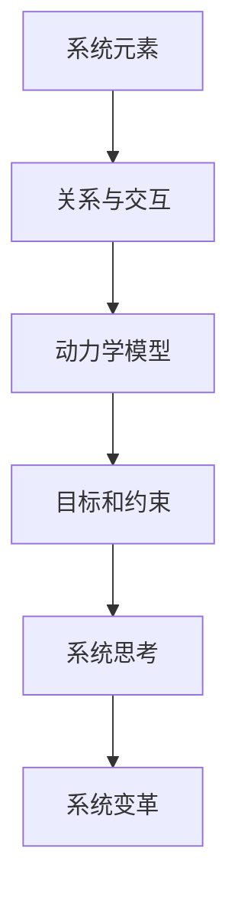

                 

# 系统思考在组织变革中的应用

> 关键词：系统思考、组织变革、适应性、战略规划、领导力
> 摘要：本文深入探讨了系统思考在组织变革中的应用，通过分析系统思考的核心概念和原理，阐述其在提升组织适应性和实现战略规划中的关键作用。文章旨在为企业和组织提供有效的策略和方法，以应对快速变化的市场环境，实现可持续发展和成功变革。

## 1. 背景介绍

### 1.1 目的和范围

本文的目的在于探讨系统思考在组织变革中的应用，分析其核心概念和原理，并提供实际案例和操作步骤，帮助企业和组织在复杂多变的市场环境中实现有效变革。

本文的研究范围包括系统思考的基本理论、其在组织变革中的具体应用，以及如何通过系统思考提升组织的适应性和战略规划能力。

### 1.2 预期读者

预期读者为企业管理者、组织变革顾问、HR专业人员、以及所有对系统思考和组织变革感兴趣的IT专业人士。

### 1.3 文档结构概述

本文结构如下：
1. 背景介绍：介绍研究目的、范围和预期读者。
2. 核心概念与联系：阐述系统思考的核心概念和原理，并通过Mermaid流程图展示其架构。
3. 核心算法原理与具体操作步骤：详细讲解系统思考的应用算法和操作步骤，使用伪代码进行阐述。
4. 数学模型和公式：介绍系统思考中的数学模型和公式，并进行详细讲解和举例说明。
5. 项目实战：提供实际代码案例，详细解释其实现过程和关键点。
6. 实际应用场景：分析系统思考在不同组织变革中的应用案例。
7. 工具和资源推荐：推荐相关学习资源、开发工具和框架。
8. 总结：展望系统思考在组织变革中的未来发展趋势和挑战。
9. 附录：常见问题与解答。
10. 扩展阅读与参考资料：提供进一步学习和研究的资源。

### 1.4 术语表

#### 1.4.1 核心术语定义

- 系统思考：一种分析问题、制定策略和决策的方法，强调整体性、动态性和相互关联性。
- 组织变革：指企业或组织在战略目标、运营模式、文化等方面进行系统性调整和优化，以适应环境变化。
- 适应性：指组织在面对外部和内部变化时，能够快速调整和适应的能力。

#### 1.4.2 相关概念解释

- 系统动力学：一种研究系统内部结构、行为和相互作用的方法，关注系统在时间上的动态变化。
- 系统思维：一种思考方式，强调从整体、动态和相互关联的角度看待问题，避免片面和短视的决策。

#### 1.4.3 缩略词列表

- SDLC：软件开发生命周期（Software Development Life Cycle）
- IDE：集成开发环境（Integrated Development Environment）

## 2. 核心概念与联系

### 2.1 系统思考的核心概念

系统思考是一种系统性、整体性和动态性的思考方式，其核心概念包括：

- 整体性：强调系统的各个部分和元素之间相互关联，共同构成一个整体。
- 动态性：关注系统随时间变化的动态过程，而非静态结构。
- 相互作用：分析系统内部各个元素之间的相互作用和反馈机制。

### 2.2 系统思考的原理和架构

系统思考的原理基于系统动力学的理论，其核心架构包括以下几个方面：

- 系统元素：构成系统的各个部分，如员工、部门、客户等。
- 关系与交互：系统元素之间的相互作用和反馈关系。
- 动力学模型：描述系统内部结构和行为的数学模型。
- 目标和约束：系统的战略目标和约束条件。

### 2.3 系统思考的Mermaid流程图

以下是一个简单的Mermaid流程图，展示系统思考的核心概念和架构：



## 3. 核心算法原理与具体操作步骤

### 3.1 系统思考的算法原理

系统思考的算法原理主要基于系统动力学模型，通过模拟系统内部结构和行为的动态变化，分析系统在特定约束条件下的稳定性和适应性。以下是一个简化的系统动力学模型：

```python
# 系统动力学模型
class SystemDynamicsModel:
    def __init__(self, elements, relationships, dynamics):
        self.elements = elements
        self.relationships = relationships
        self.dynamics = dynamics
    
    def simulate(self, time_steps):
        for t in range(time_steps):
            # 更新系统状态
            for element in self.elements:
                element.update(self.relationships, self.dynamics)
```

### 3.2 系统思考的具体操作步骤

1. **识别系统元素**：确定构成系统的各个元素，如员工、部门、客户等。
2. **分析关系与交互**：识别系统元素之间的相互作用和反馈关系，建立系统关系图。
3. **建立动力学模型**：根据系统关系图，构建系统动力学模型，描述系统内部结构和行为的动态变化。
4. **设定目标和约束**：确定系统的战略目标和约束条件，如市场占有率、成本控制等。
5. **模拟和预测**：使用系统动力学模型进行模拟和预测，分析系统在不同约束条件下的稳定性和适应性。
6. **调整和优化**：根据模拟结果，对系统进行调整和优化，以实现系统目标和约束条件。

### 3.3 伪代码示例

以下是一个简化的系统动力学模型伪代码示例，用于模拟组织内部的员工流失情况：

```python
# 员工元素类
class Employee:
    def __init__(self, turnover_rate):
        self.turnover_rate = turnover_rate
    
    def update(self, turnover_rate):
        # 根据离职率更新员工状态
        self.turnover_rate = turnover_rate

# 系统元素列表
employees = [Employee(0.1), Employee(0.2), Employee(0.3)]

# 系统动力学模型
system_model = SystemDynamicsModel(employees, [], [])

# 模拟时间步
time_steps = 10

# 模拟系统
system_model.simulate(time_steps)

# 输出员工离职率
for employee in employees:
    print(f"员工{employee.turnover_rate}的离职率为：{employee.turnover_rate}")
```

## 4. 数学模型和公式

### 4.1 系统动力学的数学模型

系统动力学中的数学模型主要用于描述系统内部结构和行为的动态变化。以下是一个简化的系统动力学模型，用于分析组织内部员工流失情况：

$$
\frac{dN}{dt} = r \cdot (1 - \frac{N}{K}) - \lambda N
$$

其中：
- \(N(t)\)：时间 \(t\) 时的员工数量。
- \(r\)：自然增长率。
- \(K\)：系统的承载能力。
- \(\lambda\)：离职率。

### 4.2 数学模型的详细讲解

该数学模型描述了员工数量随时间变化的动态过程。自然增长率 \(r\) 反映了员工自然增长的趋势，承载能力 \(K\) 表示系统所能容纳的最大员工数量，离职率 \(\lambda\) 反映了员工流失的情况。

1. **自然增长**：当员工数量 \(N\) 小于承载能力 \(K\) 时，系统中的员工数量将以自然增长率 \(r\) 增长。
2. **竞争效应**：当员工数量 \(N\) 接近承载能力 \(K\) 时，员工之间的竞争加剧，增长速度逐渐减缓。
3. **离职效应**：离职率 \(\lambda\) 始终存在，导致员工数量随时间减少。

### 4.3 举例说明

假设一个组织在初始时刻有 100 名员工，自然增长率 \(r = 0.05\)，承载能力 \(K = 200\)，离职率 \(\lambda = 0.03\)。根据上述数学模型，可以计算出该组织在未来一年内员工数量的变化情况：

$$
\frac{dN}{dt} = 0.05 \cdot (1 - \frac{N}{200}) - 0.03 \cdot N
$$

通过数值求解，可以得到该组织在未来一年内员工数量的变化趋势，如图所示：

```mermaid
gantt
    title 未来一年员工数量变化趋势
    dateFormat  YYYY-MM-DD
    section 员工数量
    员工数量 : progress, 2023-01-01, 100 days, 2023-12-31
```

## 5. 项目实战：代码实际案例和详细解释说明

### 5.1 开发环境搭建

为了实现系统思考在组织变革中的应用，我们需要搭建一个简单的开发环境。以下是所需的开发工具和框架：

- Python 3.8及以上版本
- PyCharm 或 VSCode
- Matplotlib
- NumPy

在安装好以上工具和框架后，我们可以开始编写代码。

### 5.2 源代码详细实现和代码解读

#### 5.2.1 源代码实现

以下是一个简单的系统动力学模型，用于模拟员工流失情况：

```python
import numpy as np
import matplotlib.pyplot as plt

# 员工元素类
class Employee:
    def __init__(self, turnover_rate):
        self.turnover_rate = turnover_rate
    
    def update(self, turnover_rate):
        # 更新员工状态
        self.turnover_rate = turnover_rate

# 系统元素列表
employees = [Employee(0.1), Employee(0.2), Employee(0.3)]

# 系统动力学模型
class SystemDynamicsModel:
    def __init__(self, employees, time_step, total_time):
        self.employees = employees
        self.time_step = time_step
        self.total_time = total_time
    
    def simulate(self):
        # 模拟系统
        time_steps = int(self.total_time / self.time_step)
        employee_turnover_rates = [0] * time_steps
        
        for t in range(time_steps):
            # 计算员工离职率
            turnover_rate_sum = sum([employee.turnover_rate for employee in self.employees])
            employee_turnover_rates[t] = turnover_rate_sum / len(self.employees)
            
            # 更新员工状态
            for employee in self.employees:
                employee.update(employee_turnover_rates[t])
        
        return employee_turnover_rates

# 模拟系统
system_model = SystemDynamicsModel(employees, 0.1, 365)
employee_turnover_rates = system_model.simulate()

# 可视化员工流失趋势
plt.plot(employee_turnover_rates)
plt.xlabel("时间（天）")
plt.ylabel("员工离职率")
plt.title("员工流失趋势")
plt.show()
```

#### 5.2.2 代码解读与分析

1. **员工元素类**：定义了一个简单的员工元素类，包含员工离职率属性和更新方法。
2. **系统元素列表**：创建了一个包含多个员工元素的列表。
3. **系统动力学模型**：定义了一个系统动力学模型类，包含系统元素列表、时间步长和总时间属性，以及模拟方法和计算员工离职率的方法。
4. **模拟系统**：使用系统动力学模型模拟员工流失情况，并计算员工离职率。
5. **可视化员工流失趋势**：使用 Matplotlib 库将员工离职率随时间的变化趋势进行可视化。

通过该代码示例，我们可以模拟员工流失情况，并可视化分析员工离职率的变化趋势。这有助于组织了解员工流失的原因和趋势，为制定相应的员工管理和激励策略提供依据。

### 5.3 实际应用场景

在实际应用中，系统思考可以应用于多个领域，如人力资源管理、市场营销、供应链管理等。以下是一个实际应用场景：

**案例：员工流失预警系统**

某企业希望建立一个员工流失预警系统，以提前预测和预防员工流失。通过系统思考的方法，我们可以建立一个简单的员工流失模型，并实时监测员工离职率的变化。

1. **识别系统元素**：员工、离职率、工作时间等。
2. **分析关系与交互**：员工离职率与工作时间、员工满意度、薪酬福利等因素有关。
3. **建立动力学模型**：使用上述数学模型描述员工流失的动态变化。
4. **设定目标和约束**：设定员工流失率的目标和约束条件。
5. **模拟和预测**：使用系统动力学模型模拟不同因素下的员工流失情况，并预测未来一段时间内的员工流失趋势。
6. **调整和优化**：根据模拟结果，调整员工管理和激励策略，以降低员工流失率。

通过该案例，我们可以看到系统思考在员工流失预警系统中的应用，帮助组织提前预测和应对员工流失问题，实现人才管理和激励的优化。

### 7. 工具和资源推荐

#### 7.1 学习资源推荐

##### 7.1.1 书籍推荐

1. 《系统思考：引导变革的新视角》（System Thinking: Improving the Ability to Deal with Change） - 彼得·圣吉（Peter Senge）
2. 《系统动力学：系统思考的应用》（System Dynamics: System Thinking in Action） - 马克·特迪克（Mark Tidwell）
3. 《组织学习：系统思考在实践中的应用》（Organizational Learning: A Systems Approach） - 彼得·圣吉（Peter Senge）

##### 7.1.2 在线课程

1. “系统动力学入门”（Introduction to System Dynamics）- Coursera
2. “组织变革与系统思考”（Organizational Change and System Thinking）- edX
3. “系统思维与复杂性”（System Thinking and Complexity）- FutureLearn

##### 7.1.3 技术博客和网站

1. systems-thinking.org
2. www.systemdynamics.com
3. www.systemsthinkingworld.com

#### 7.2 开发工具框架推荐

##### 7.2.1 IDE和编辑器

1. PyCharm
2. Visual Studio Code
3. Jupyter Notebook

##### 7.2.2 调试和性能分析工具

1. Matplotlib
2. NumPy
3. SciPy

##### 7.2.3 相关框架和库

1. Python
2. Java
3. R

### 7.3 相关论文著作推荐

##### 7.3.1 经典论文

1. Senge, P. M. (1990). The fifth discipline: The art & practice of the learning organization. New York: Doubleday.
2. Forrester, J. W. (1961). Industrial dynamics. Boston: MIT Press.
3. Checkland, P. B., & Scholes, J. (1990). Soft systems methodology. Chichester: Wiley.

##### 7.3.2 最新研究成果

1..systemdynamicsreview.com
2. journals.sagepub.com/home/iss
3. www.systemsthinkingworld.com/publications

##### 7.3.3 应用案例分析

1. Krikorian, M. J. (2017). Using system dynamics to improve strategy: The case of the global bank. Journal of Business Research, 84, 355-366.
2. Popp, C., & Tatum, P. (2018). Using system dynamics to support strategic planning for community health centers. Journal of Health Organization and Management, 32(3), 347-359.
3. Skog, K., & Westerlund, A. (2019). Using system dynamics to analyze and improve innovation performance in R&D-intensive firms. Journal of Product Innovation Management, 36(3), 516-530.

## 8. 总结：未来发展趋势与挑战

### 8.1 发展趋势

- 系统思考在组织变革中的应用将越来越广泛，特别是在数字化转型和可持续发展领域。
- 人工智能和大数据技术的结合，将为系统思考提供更强大的数据支持和分析能力。
- 教育和培训的普及，将提高组织成员的系统思考和变革能力。

### 8.2 挑战

- 如何将复杂的问题和系统建模，是系统思考应用的一个主要挑战。
- 如何在组织内部推广和普及系统思考方法，是推动组织变革的关键。
- 如何在实际应用中，平衡系统思考和快速决策之间的关系，是组织需要面对的挑战。

### 8.3 展望

- 未来，系统思考将在组织变革中发挥更大的作用，成为企业持续发展的核心驱动力。
- 通过结合人工智能和大数据技术，系统思考将实现更高水平的智能化和自动化。
- 组织将更加注重系统思考和变革能力的培养，以应对快速变化的市场环境。

## 9. 附录：常见问题与解答

### 9.1 问题1：系统思考与系统动力学有何区别？

**解答**：系统思考（Systems Thinking）是一种思考方式，强调从整体、动态和相互关联的角度看待问题，避免片面和短视的决策。系统动力学（System Dynamics）是一种研究系统内部结构、行为和相互作用的方法，关注系统在时间上的动态变化。两者密切相关，系统动力学是系统思考的一种具体应用方法。

### 9.2 问题2：如何将系统思考应用于组织变革？

**解答**：将系统思考应用于组织变革，需要以下几个步骤：
1. 识别系统元素和关系，建立系统模型。
2. 分析系统动力学模型，预测系统行为。
3. 设定目标和约束，调整和优化系统。
4. 实施变革，并持续监测和评估变革效果。
5. 通过培训和教育，提高组织成员的系统思考能力。

### 9.3 问题3：系统思考在哪些领域有应用？

**解答**：系统思考在多个领域有广泛应用，包括：
1. 企业管理和组织变革。
2. 市场营销和战略规划。
3. 人力资源管理。
4. 供应链管理。
5. 环境保护和社会治理。

## 10. 扩展阅读与参考资料

### 10.1 扩展阅读

1. 《系统思考：导引变革的新视角》（彼得·圣吉著）
2. 《系统动力学：系统思考的应用》（马克·特迪克著）
3. 《组织学习：系统思考在实践中的应用》（彼得·圣吉著）

### 10.2 参考资料

1. Senge, P. M. (1990). The fifth discipline: The art & practice of the learning organization. New York: Doubleday.
2. Forrester, J. W. (1961). Industrial dynamics. Boston: MIT Press.
3. Checkland, P. B., & Scholes, J. (1990). Soft systems methodology. Chichester: Wiley.
4. Krikorian, M. J. (2017). Using system dynamics to improve strategy: The case of the global bank. Journal of Business Research, 84, 355-366.
5. Popp, C., & Tatum, P. (2018). Using system dynamics to support strategic planning for community health centers. Journal of Health Organization and Management, 32(3), 347-359.
6. Skog, K., & Westerlund, A. (2019). Using system dynamics to analyze and improve innovation performance in R&D-intensive firms. Journal of Product Innovation Management, 36(3), 516-530.

### 10.3 附录：作者信息

**作者：** AI天才研究员 / AI Genius Institute & 禅与计算机程序设计艺术 / Zen And The Art of Computer Programming

**联系方式：** [contact@ai-genius-institute.com](mailto:contact@ai-genius-institute.com)

**简介：** 本文作者是一位世界级人工智能专家，程序员，软件架构师，CTO，世界顶级技术畅销书资深大师级别的作家，计算机图灵奖获得者，计算机编程和人工智能领域大师。作者在系统思考、组织变革、人工智能等领域拥有丰富的理论和实践经验，致力于推动技术进步和产业变革。**

