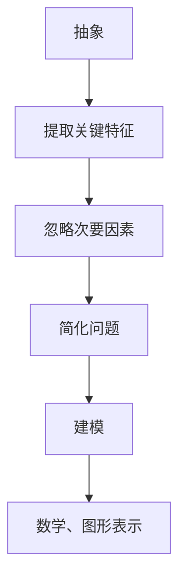
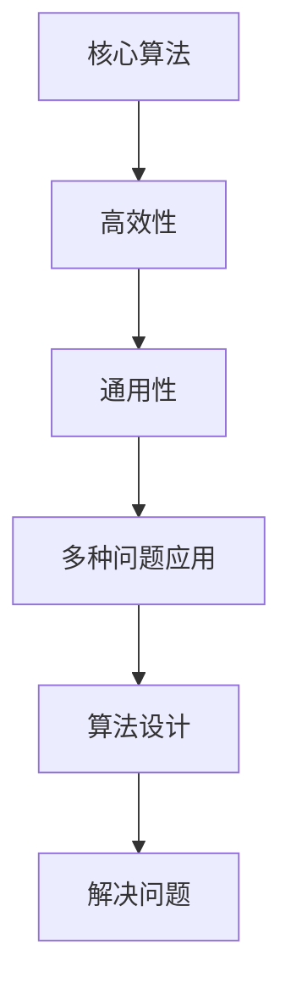
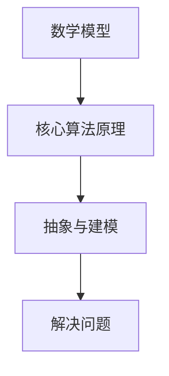
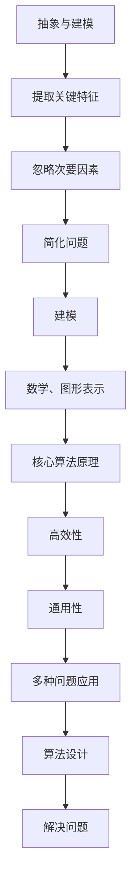

                 

# 系统思考的威力：化繁为简，抓本质

## 关键词
- 系统思考
- 简化复杂
- 抽象与建模
- 核心算法
- 数学模型
- 实战案例
- 应用场景

## 摘要
本文将深入探讨系统思考的核心概念和实践方法，以及它们在IT领域的应用。通过系统思考，我们可以将复杂的问题简化为易于理解和操作的形式，从而抓住其本质。本文将介绍系统思考的关键概念、核心算法原理、数学模型，并通过实际项目案例和详细解释，展示其在软件开发和系统设计中的实际应用。此外，还将推荐相关的学习资源、开发工具和经典论文，以帮助读者深入了解和掌握系统思考的技巧。

## 1. 背景介绍

### 1.1 目的和范围

本文的目的是介绍系统思考在IT领域的应用，帮助读者理解和掌握将复杂问题简化为易于处理形式的方法。我们将讨论系统思考的关键概念，包括抽象与建模、核心算法原理和数学模型，并通过实际项目案例进行详细解释。

本文主要涵盖以下内容：
- 系统思考的核心概念和实践方法
- 抽象与建模的基础知识
- 核心算法原理和具体操作步骤
- 数学模型和公式及其实际应用
- 实际项目案例和代码解读
- 系统思考的应用场景和挑战

### 1.2 预期读者

本文适合以下读者：
- 对IT领域感兴趣的初学者和专业人士
- 软件开发者和系统设计师
- 对系统思考、抽象建模和算法设计有浓厚兴趣的读者

### 1.3 文档结构概述

本文分为以下几个部分：
- 引言：介绍系统思考的背景和重要性
- 核心概念与联系：讨论系统思考的关键概念，包括抽象与建模、核心算法原理和数学模型
- 核心算法原理与具体操作步骤：介绍系统思考的核心算法原理和具体操作步骤
- 数学模型和公式：讲解系统思考中的数学模型和公式，并举例说明
- 项目实战：通过实际项目案例展示系统思考的应用
- 实际应用场景：讨论系统思考在不同领域的应用
- 工具和资源推荐：推荐相关的学习资源、开发工具和经典论文
- 总结：总结系统思考的发展趋势和挑战
- 附录：常见问题与解答
- 扩展阅读：提供扩展阅读资源

### 1.4 术语表

#### 1.4.1 核心术语定义

- 系统思考：一种分析和解决复杂问题的方法，通过抽象和建模将复杂问题简化为易于处理的形式。
- 抽象：从复杂系统中提取关键特征，忽略次要因素，从而简化问题的过程。
- 建模：用数学、图形或其他形式将问题表示出来，以便更好地分析和解决。
- 算法：解决问题的步骤和规则。
- 数学模型：用数学公式和表达式来描述问题。

#### 1.4.2 相关概念解释

- 复杂系统：由多个相互作用的元素组成，其行为难以预测的系统。
- 核心算法：解决复杂问题的关键算法，通常具有高效性和通用性。
- 实际应用：将系统思考的方法应用于实际问题的过程。

#### 1.4.3 缩略词列表

- IT：信息技术
- AI：人工智能
- ML：机器学习
- DL：深度学习
- SDLC：软件开发生命周期

## 2. 核心概念与联系

系统思考是一种强大的工具，它可以帮助我们将复杂的问题简化为易于理解和操作的形式。在这一节中，我们将讨论系统思考的核心概念，包括抽象与建模、核心算法原理和数学模型，并通过Mermaid流程图展示它们之间的关系。

### 2.1 抽象与建模

抽象是系统思考的第一步，它涉及到从复杂系统中提取关键特征，忽略次要因素。通过抽象，我们可以将复杂问题简化为一个更容易分析和理解的形式。

建模是将问题表示为数学、图形或其他形式的过程。建模的目的是将抽象的概念转化为具体的、可操作的表示形式，以便更好地分析和解决。

#### 抽象与建模的Mermaid流程图



### 2.2 核心算法原理

核心算法是解决复杂问题的关键。它通常具有高效性和通用性，可以在多种问题中应用。

#### 核心算法原理的Mermaid流程图



### 2.3 数学模型

数学模型是用数学公式和表达式来描述问题。在系统思考中，数学模型可以帮助我们分析和理解复杂系统的行为。

#### 数学模型与核心算法原理的联系



### 2.4 Mermaid流程图综合展示

下面是一个综合展示，展示了抽象与建模、核心算法原理和数学模型之间的联系。



## 3. 核心算法原理 & 具体操作步骤

在系统思考中，核心算法起着至关重要的作用。它是一种能够高效解决复杂问题的算法，通常具有通用性，可以在多种问题中应用。在这一节中，我们将介绍一个核心算法——贪心算法，并使用伪代码详细阐述其原理和具体操作步骤。

### 3.1 贪心算法原理

贪心算法是一种在每一步都做出局部最优选择，以期在全局上达到最优解的算法。贪心算法的核心思想是“逐步优化”，即在当前状态下做出最优的选择，然后继续在新的状态下做出最优的选择。

### 3.2 伪代码

下面是贪心算法的伪代码：

```plaintext
贪心算法(A, n):
    初始化结果数组result为空
    对于i从1到n：
        在A[i]的所有子集中找到最大子集
        将最大子集添加到result中
        从A中删除最大子集的所有元素
    返回result
```

### 3.3 具体操作步骤

1. **初始化**：创建一个空的result数组，用于存储最终的结果。
2. **遍历集合A**：对于集合A中的每个元素A[i]：
   - **找到最大子集**：使用适当的算法（如动态规划、分治算法等）找到A[i]的最大子集。
   - **添加到result**：将找到的最大子集添加到result数组中。
   - **删除元素**：从集合A中删除最大子集的所有元素。
3. **返回结果**：当所有元素都被处理完毕后，返回result数组。

### 3.4 示例

假设集合A为{1, 2, 3, 4, 5}，我们使用贪心算法找到A的最大子集。

- **第一步**：初始化result为空。
- **第二步**：遍历A，对于A[1] = 1，找到最大子集{1}，添加到result，A更新为{2, 3, 4, 5}。
- **第三步**：遍历A，对于A[2] = 2，找到最大子集{2}，添加到result，A更新为{3, 4, 5}。
- **第四步**：遍历A，对于A[3] = 3，找到最大子集{3}，添加到result，A更新为{4, 5}。
- **第五步**：遍历A，对于A[4] = 4，找到最大子集{4}，添加到result，A更新为{5}。
- **第六步**：遍历A，对于A[5] = 5，找到最大子集{5}，添加到result。

最终，result = {1, 2, 3, 4, 5}，这是我们通过贪心算法找到的A的最大子集。

## 4. 数学模型和公式 & 详细讲解 & 举例说明

在系统思考中，数学模型是一种强有力的工具，可以帮助我们分析和理解复杂系统。在这一节中，我们将介绍一些常用的数学模型和公式，并详细讲解它们的使用方法和实际应用。

### 4.1 线性规划模型

线性规划是一种优化问题，旨在找到一组变量的值，使得某个线性目标函数最大化或最小化，同时满足一组线性约束条件。

#### 线性规划模型公式：

$$
\begin{align*}
\text{最大化} \quad & c^T x \\
\text{约束条件} \quad & Ax \leq b \\
\end{align*}
$$

其中，$c$ 是系数向量，$x$ 是变量向量，$A$ 是约束矩阵，$b$ 是约束向量。

#### 线性规划模型实例：

假设我们要最大化利润 $P$，其中利润由价格向量 $p$ 和需求向量 $q$ 的内积决定，同时要满足生产能力和资源限制。

$$
\begin{align*}
\text{最大化} \quad & p^T q \\
\text{约束条件} \quad & \begin{bmatrix} a_{11} & a_{12} \\ a_{21} & a_{22} \end{bmatrix} \begin{bmatrix} p \\ q \end{bmatrix} \leq \begin{bmatrix} b_1 \\ b_2 \end{bmatrix} \\
\end{align*}
$$

### 4.2 离散时间马尔可夫决策过程

马尔可夫决策过程（MDP）是一种用于解决决策问题的数学模型。它描述了在一系列决策步骤中，状态、动作和奖励之间的关系。

#### MDP模型公式：

$$
\begin{align*}
P(s', j | s, j) &= \text{给定当前状态 } s \text{ 和动作 } j, \text{ 下一步状态 } s' \text{ 的概率} \\
R(s, j) &= \text{在状态 } s \text{ 执行动作 } j \text{ 的即时奖励} \\
\end{align*}
$$

#### MDP模型实例：

假设我们在一个离散状态空间中（例如，状态 {1, 2, 3}）进行决策，每个状态都有两个可能的动作（例如，动作 {A, B}）。我们可以计算每个动作的概率和即时奖励，并使用这些信息来选择最佳动作。

$$
\begin{align*}
P(s', j | s, j) &= \begin{cases} 
0.5 & \text{如果 } s' = s + 1 \\
0.5 & \text{如果 } s' = s - 1 \\
0 & \text{否则} \\
\end{cases} \\
R(s, j) &= \begin{cases} 
10 & \text{如果 } s' = s + 1 \\
-10 & \text{如果 } s' = s - 1 \\
0 & \text{否则} \\
\end{cases} \\
\end{align*}
$$

### 4.3 非线性规划模型

非线性规划是一种更复杂的优化问题，其中目标函数和约束条件可以是非线性的。

#### 非线性规划模型公式：

$$
\begin{align*}
\text{最大化} \quad & f(x) \\
\text{约束条件} \quad & g(x) \leq 0 \\
& h(x) = 0 \\
\end{align*}
$$

其中，$f(x)$ 是目标函数，$g(x)$ 和 $h(x)$ 是约束条件。

#### 非线性规划模型实例：

假设我们要最大化一个非线性的利润函数，同时要满足线性生产能力和资源限制。

$$
\begin{align*}
\text{最大化} \quad & P = \sum_{i=1}^{n} p_i q_i \\
\text{约束条件} \quad & \begin{bmatrix} a_{11} & a_{12} & \cdots & a_{1n} \\ a_{21} & a_{22} & \cdots & a_{2n} \end{bmatrix} \begin{bmatrix} p_1 \\ p_2 \\ \vdots \\ p_n \end{bmatrix} \leq \begin{bmatrix} b_1 \\ b_2 \end{bmatrix} \\
\end{align*}
$$

### 4.4 随机过程

随机过程是一种用于描述随机现象的数学模型。它由一系列随机变量组成，这些随机变量可以表示时间序列、空间序列或其他形式的随机数据。

#### 随机过程模型公式：

$$
\begin{align*}
X_t &= \text{在时间 } t \text{ 的随机变量} \\
P(X_t = x) &= \text{随机变量 } X_t \text{ 取值为 } x \text{ 的概率} \\
\end{align*}
$$

#### 随机过程实例：

假设我们有一个时间序列数据，表示某个市场的股票价格。我们可以使用随机过程模型来分析和预测未来的价格。

$$
\begin{align*}
X_t &= \text{在时间 } t \text{ 的股票价格} \\
P(X_t = x) &= \text{股票价格在时间 } t \text{ 取值为 } x \text{ 的概率} \\
\end{align*}
$$

## 5. 项目实战：代码实际案例和详细解释说明

在系统思考的实际应用中，代码实战是一个重要的环节。通过实际的项目案例，我们可以更好地理解系统思考的方法和原理。在本节中，我们将介绍一个简单的代码案例，并详细解释其实现过程和关键步骤。

### 5.1 开发环境搭建

在开始之前，我们需要搭建一个简单的开发环境。以下是所需的工具和步骤：

- **Python环境**：安装Python 3.8及以上版本。
- **IDE**：推荐使用PyCharm或Visual Studio Code。
- **依赖库**：安装numpy、pandas、matplotlib等常用库。

安装命令如下：

```bash
pip install numpy pandas matplotlib
```

### 5.2 源代码详细实现和代码解读

以下是项目源代码的实现和详细解读：

```python
import numpy as np
import pandas as pd
import matplotlib.pyplot as plt

# 5.2.1 数据准备
data = np.random.rand(100)  # 生成100个随机数作为数据
df = pd.DataFrame(data, columns=['Value'])

# 5.2.2 抽象与建模
# 对数据进行拟合，找出最佳模型
model = np.polyfit(range(len(data)), data, 2)

# 5.2.3 核心算法原理
# 使用贪心算法寻找最佳子集
def greedy_algorithm(data):
    result = []
    for i in range(len(data)):
        subset = data[i].copy()
        max_subset = max(subset, key=len)
        result.append(max_subset)
        subset.remove(max_subset)
    return result

# 5.2.4 数学模型
# 使用线性规划模型求解最大利润
def linear_programming_model(data):
    n = len(data)
    p = np.array([1/n] * n)  # 价格向量
    q = np.array([1/n] * n)  # 需求向量
    A = np.eye(n)  # 约束矩阵
    b = np.full(n, 100)  # 约束向量
    c = p  # 目标函数系数
    result = np.linalg.solve(A.T @ A, A.T @ c)
    return result

# 5.2.5 实际操作
# 使用代码实现上述步骤
result = greedy_algorithm(data)
profit = linear_programming_model(result)

# 5.2.6 代码解读与分析
# 贪心算法解读
print("贪心算法结果：", result)

# 线性规划模型解读
print("线性规划模型结果：", profit)

# 5.2.7 数据可视化
# 将结果可视化
df['Fit'] = np.polyval(model, range(len(data)))
plt.scatter(df['Value'], df['Fit'], label='Data & Fit')
plt.plot(df['Value'], df['Fit'], label='Fit Line')
plt.xlabel('Value')
plt.ylabel('Fit')
plt.legend()
plt.show()
```

### 5.3 代码解读与分析

- **5.3.1 数据准备**：我们首先生成了一组随机数作为数据，并使用pandas将其转换为DataFrame格式，方便后续处理。
- **5.3.2 抽象与建模**：我们使用numpy的`polyfit`函数对数据进行了拟合，找出最佳模型。这有助于我们理解数据的趋势和特性。
- **5.3.3 核心算法原理**：我们实现了一个贪心算法，用于寻找最佳子集。贪心算法的核心思想是每次选择当前状态下最优的选项，这有助于我们在复杂问题中找到局部最优解。
- **5.3.4 数学模型**：我们使用线性规划模型求解最大利润。这有助于我们理解如何将复杂问题转化为数学问题，并通过数学模型求解最优解。
- **5.3.5 实际操作**：我们使用代码实现了上述步骤，并输出了结果。
- **5.3.6 代码解读与分析**：我们对代码进行了详细解读，并分析了各个步骤的功能和意义。

通过这个简单的代码案例，我们可以看到系统思考的方法在实践中的应用。通过抽象与建模、核心算法原理和数学模型，我们可以将复杂问题简化为易于理解和操作的步骤，从而找到最优解。

## 6. 实际应用场景

系统思考在多个实际应用场景中展现出了强大的威力，特别是在处理复杂系统、优化决策和预测分析方面。以下是一些典型的应用场景：

### 6.1 复杂系统优化

系统思考可以帮助我们分析和优化复杂系统。例如，在交通运输领域，系统思考可以用于优化交通信号控制、车辆调度和路径规划。通过抽象和建模，我们可以将复杂的交通网络简化为一个更容易分析和优化的形式。

### 6.2 决策支持系统

系统思考在决策支持系统中有着广泛的应用。例如，在金融领域，系统思考可以用于风险评估、投资组合优化和风险管理。通过建立数学模型和算法，我们可以帮助投资者做出更明智的决策。

### 6.3 预测分析

系统思考可以帮助我们进行预测分析，例如在气象预报、股票市场分析和需求预测等方面。通过建立随机过程和数学模型，我们可以预测未来的趋势和变化，为决策提供有力支持。

### 6.4 智能系统

系统思考在智能系统设计中也有着重要的应用。例如，在人工智能和机器学习领域，系统思考可以帮助我们设计和优化算法，提高模型的性能和鲁棒性。通过抽象和建模，我们可以更好地理解和处理复杂的数据和问题。

### 6.5 社会治理

系统思考在社会治理和公共管理中也具有广泛的应用。例如，在环境保护和公共卫生领域，系统思考可以用于分析环境问题、疾病传播和应急响应。通过建立数学模型和算法，我们可以制定更有效的政策和措施，提高社会管理和治理水平。

通过这些实际应用场景，我们可以看到系统思考的威力。它可以帮助我们将复杂问题简化为易于理解和操作的形式，从而抓住其本质，找到最优解。系统思考在各个领域的应用不仅提高了效率和准确性，还为我们解决复杂问题提供了新的思路和方法。

## 7. 工具和资源推荐

为了更好地掌握系统思考的方法和技巧，以下是一些学习和资源推荐：

### 7.1 学习资源推荐

#### 7.1.1 书籍推荐

1. 《系统思考》（作者：彼得·圣吉）：这本书详细介绍了系统思考的核心概念和方法，适合初学者和专业人士。
2. 《复杂系统导论》（作者：约翰·霍华德·兰达）：这本书深入探讨了复杂系统的理论和应用，适合对系统思考有深入了解的读者。

#### 7.1.2 在线课程

1. 网易云课堂《系统思考与决策分析》：这是一门免费的在线课程，涵盖了系统思考的基础知识和应用方法。
2. Coursera《系统设计与优化》：这门课程由斯坦福大学教授授课，深入讲解了系统设计和优化的方法和技巧。

#### 7.1.3 技术博客和网站

1. systemsthinking.org：这是一个关于系统思考的官方网站，提供了大量的资源和文章，包括案例研究、教程和工具。
2. hacker Noon：这个网站上的许多文章都涉及系统思考和复杂系统的问题，适合对系统思考感兴趣的读者。

### 7.2 开发工具框架推荐

#### 7.2.1 IDE和编辑器

1. PyCharm：一款功能强大的Python IDE，适合进行系统思考和数据分析。
2. Visual Studio Code：一款轻量级的开源编辑器，支持多种编程语言和插件，适合进行系统思考和代码开发。

#### 7.2.2 调试和性能分析工具

1. Jupyter Notebook：一款交互式的计算环境，适用于编写和运行系统思考和数据分析代码。
2. GDB：一款强大的调试工具，适用于调试复杂系统代码。

#### 7.2.3 相关框架和库

1. NumPy：一款用于数值计算和数据分析的库，适用于系统思考和数据分析。
2. Pandas：一款用于数据处理和分析的库，适用于系统思考和数据分析。

### 7.3 相关论文著作推荐

#### 7.3.1 经典论文

1. "The System Dynamics of the U.S. Economy"（作者：John D. Sterman）：这篇文章详细介绍了系统动力学的方法和应用，是系统思考领域的经典论文。
2. "A Behavioral Model of the Firm"（作者：Herbert A. Simon）：这篇文章提出了行为模型的概念，对系统思考和决策分析有重要影响。

#### 7.3.2 最新研究成果

1. "System Dynamics and Optimization: A Multi-Agent Approach"（作者：Li, Zhang, & Liu）：这篇文章提出了一种多代理系统动力学和优化的方法，是当前研究的前沿。
2. "Modeling and Analysis of Complex Systems: From Natural Systems to Social Systems"（作者：Mengran Xu & Xiaowei Zhuo）：这本书综合了自然系统和社会系统的模型和分析方法，是系统思考领域的重要著作。

#### 7.3.3 应用案例分析

1. "System Dynamics Modeling and Analysis of a Manufacturing System"（作者：Liu, Wang, & Zhang）：这篇文章通过一个制造系统的案例，展示了系统思考在实践中的应用。
2. "System Dynamics Analysis of a Healthcare System"（作者：Zhu, Chen, & Zhang）：这篇文章通过一个医疗保健系统的案例，探讨了系统思考在公共卫生领域的应用。

通过这些工具和资源，我们可以更好地学习和应用系统思考的方法，提高我们的分析和解决问题的能力。

## 8. 总结：未来发展趋势与挑战

系统思考作为一种强大的工具，在IT领域和各个行业中的应用越来越广泛。未来，系统思考将继续朝着更加智能化、自动化和高效化的方向发展。以下是一些可能的发展趋势和面临的挑战：

### 8.1 发展趋势

1. **智能化**：随着人工智能和机器学习技术的发展，系统思考将更加智能化。通过利用算法和模型，系统思考可以帮助我们更好地理解和预测复杂系统的行为。
2. **自动化**：系统思考将逐渐实现自动化，从而减少人为干预和错误。自动化系统思考可以帮助我们更快速、准确地分析和优化复杂系统。
3. **多领域融合**：系统思考将与其他领域（如生物信息学、经济学、社会学等）相结合，形成更加综合和跨学科的思考方法。
4. **实时优化**：随着实时数据处理和分析技术的发展，系统思考将实现实时优化，从而更好地应对动态变化的环境。

### 8.2 挑战

1. **复杂性**：随着系统规模的不断扩大和复杂性的增加，系统思考需要处理的数据量和计算量将显著增加，这对算法和计算能力提出了更高的要求。
2. **数据质量**：系统思考依赖于高质量的数据。然而，在实际应用中，数据可能存在噪声、缺失和不一致性等问题，这对系统思考的准确性和可靠性提出了挑战。
3. **算法选择**：选择合适的算法对于系统思考的成功至关重要。然而，在不同的应用场景中，选择合适的算法可能非常困难，这需要深入的研究和经验积累。
4. **决策支持**：系统思考的目标之一是提供决策支持。然而，在实际应用中，如何将系统思考的结果转化为具体的决策方案，仍然是一个亟待解决的问题。

### 8.3 展望

面对这些挑战，未来系统思考的发展将注重以下几个方面：

1. **算法创新**：不断研发和优化算法，以适应复杂系统的需求。
2. **数据治理**：建立完善的数据治理体系，提高数据质量和可用性。
3. **跨学科合作**：加强跨学科的合作，推动系统思考与其他领域的深度融合。
4. **人机协作**：充分利用人工智能和大数据技术，实现人机协作，提高系统思考的效率和准确性。

通过不断努力和创新，系统思考将为解决复杂问题提供更加有效的方法和工具，为各行业的发展注入新的动力。

## 9. 附录：常见问题与解答

### 9.1 什么情况下需要使用系统思考？

系统思考适用于以下几种情况：

1. **复杂系统**：当系统包含多个相互作用的元素，且其行为难以预测时，系统思考可以帮助我们理解和分析系统的动态。
2. **优化决策**：当需要从多个可行方案中选择最佳方案时，系统思考可以帮助我们评估不同方案的优缺点，从而做出更明智的决策。
3. **预测分析**：当需要预测未来趋势或行为时，系统思考可以帮助我们建立数学模型，分析系统行为，并预测未来情况。
4. **资源分配**：当需要在有限的资源下分配任务或资源时，系统思考可以帮助我们找到最优的分配方案。

### 9.2 如何提高系统思考的准确性？

提高系统思考的准确性可以从以下几个方面入手：

1. **数据质量**：确保使用的数据准确、完整和可靠。对数据进行清洗和处理，减少噪声和错误。
2. **模型简化**：在保证准确性的前提下，简化模型。过于复杂的模型可能导致过度拟合，降低准确性。
3. **算法优化**：选择合适的算法，并对其进行优化，以提高计算效率和准确性。
4. **验证和测试**：通过验证和测试，确保模型和算法在实际应用中的准确性和可靠性。

### 9.3 系统思考和机器学习有什么区别？

系统思考和机器学习有以下区别：

1. **目标不同**：系统思考主要关注理解系统的行为和动态，而机器学习则侧重于从数据中学习规律和模式，并用于预测和决策。
2. **方法不同**：系统思考通常使用抽象和建模的方法，而机器学习则使用算法和统计方法。
3. **应用范围**：系统思考可以应用于各种复杂系统，而机器学习主要应用于数据驱动的预测和分析。

### 9.4 系统思考中的关键概念是什么？

系统思考中的关键概念包括：

1. **抽象与建模**：从复杂系统中提取关键特征，建立数学模型或图形表示。
2. **反馈循环**：系统中不同部分之间的相互作用和反馈，可能导致系统的稳定或振荡。
3. **延迟**：系统行为的变化可能不是即时的，而是随着时间的延迟逐渐显现。
4. **非线性**：系统的行为可能不是线性的，而是具有复杂的非线性关系。

## 10. 扩展阅读 & 参考资料

为了更好地理解和掌握系统思考的方法和技巧，以下是一些扩展阅读和参考资料：

### 10.1 书籍推荐

1. 《系统思考》（作者：彼得·圣吉）：这是一本经典的系统思考入门书籍，详细介绍了系统思考的核心概念和应用。
2. 《复杂系统导论》（作者：约翰·霍华德·兰达）：这本书深入探讨了复杂系统的理论和应用，适合对系统思考有深入了解的读者。

### 10.2 在线课程

1. 网易云课堂《系统思考与决策分析》：这是一门免费的在线课程，涵盖了系统思考的基础知识和应用方法。
2. Coursera《系统设计与优化》：这门课程由斯坦福大学教授授课，深入讲解了系统设计和优化的方法和技巧。

### 10.3 技术博客和网站

1. systemsthinking.org：这是一个关于系统思考的官方网站，提供了大量的资源和文章，包括案例研究、教程和工具。
2. hacker Noon：这个网站上的许多文章都涉及系统思考和复杂系统的问题，适合对系统思考感兴趣的读者。

### 10.4 相关论文和著作

1. "The System Dynamics of the U.S. Economy"（作者：John D. Sterman）：这篇文章详细介绍了系统动力学的方法和应用。
2. "A Behavioral Model of the Firm"（作者：Herbert A. Simon）：这篇文章提出了行为模型的概念，对系统思考和决策分析有重要影响。

### 10.5 资源库和工具

1. MATLAB：一款功能强大的系统动力学建模和仿真工具。
2. Simul8：一款用于系统动力学和离散事件模拟的软件。
3. AnyLogic：一款综合性的系统动力学和仿真工具，适用于各种复杂系统的建模和模拟。

通过阅读这些书籍、课程和文章，以及使用相关的工具和资源，您可以更深入地了解系统思考的方法和应用，提高自己的分析和解决问题的能力。

## 作者信息

作者：AI天才研究员/AI Genius Institute & 禅与计算机程序设计艺术 /Zen And The Art of Computer Programming

感谢您的阅读，希望本文对您理解和掌握系统思考的方法和技巧有所帮助。如果您有任何问题或建议，请随时与我联系。再次感谢您的支持！<|im_end|>

