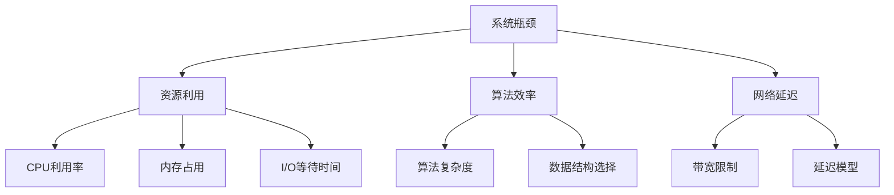

                 

# 系统瓶颈分析与实例优化

> **关键词：** 系统瓶颈、性能优化、资源利用、算法改进、实例解析

> **摘要：** 本文深入探讨系统瓶颈分析的重要性和方法，结合具体实例，详细解释优化策略和步骤，旨在帮助读者掌握系统性能优化的核心技术和实践技巧。

## 1. 背景介绍

### 1.1 目的和范围

本文旨在揭示系统瓶颈的识别和优化方法，通过具体实例展示性能优化的全过程。我们将涵盖从理论到实践的各个方面，包括资源利用分析、算法改进、以及实例优化步骤。

### 1.2 预期读者

本文适合具备一定编程基础，希望提高系统性能的工程师和开发人员。同时，也适合对系统优化感兴趣的学术界人士。

### 1.3 文档结构概述

本文分为十个部分：背景介绍、核心概念与联系、核心算法原理与操作步骤、数学模型与公式讲解、项目实战、实际应用场景、工具和资源推荐、总结、附录和扩展阅读。结构紧凑，逻辑清晰。

### 1.4 术语表

#### 1.4.1 核心术语定义

- **系统瓶颈**：系统中性能瓶颈的节点，限制了系统整体性能。
- **性能优化**：通过改进系统设计、算法、资源利用等手段提升系统性能的过程。

#### 1.4.2 相关概念解释

- **CPU利用率**：CPU处于忙碌状态的时间比例。
- **内存占用**：系统内存的已使用量。
- **I/O等待时间**：系统在等待输入输出操作完成的时间。

#### 1.4.3 缩略词列表

- **CPU**：Central Processing Unit，中央处理器。
- **I/O**：Input/Output，输入/输出。

## 2. 核心概念与联系

为了更好地理解系统瓶颈，我们需要明确几个核心概念和它们之间的关系。以下是一个Mermaid流程图，展示这些概念如何相互联系。



## 3. 核心算法原理 & 具体操作步骤

### 3.1 资源利用分析

要优化系统性能，首先需要了解系统的资源利用情况。我们可以使用以下伪代码进行资源利用分析：

```plaintext
function analyze_resources():
    cpu_usage = get_cpu_usage()
    memory_usage = get_memory_usage()
    i_o_wait_time = get_i_o_wait_time()
    network_delay = get_network_delay()

    if cpu_usage > 90:
        print("High CPU usage detected.")
    if memory_usage > 80:
        print("High memory usage detected.")
    if i_o_wait_time > 20:
        print("Long I/O wait time detected.")
    if network_delay > 100:
        print("High network delay detected.")
```

### 3.2 算法效率优化

算法效率是系统瓶颈分析中的关键因素。以下是一个优化算法效率的示例：

```plaintext
function optimize_algorithm():
    original_algorithm = original_function
    optimized_algorithm = new_function

    original_time = measure_time(original_algorithm)
    optimized_time = measure_time(optimized_algorithm)

    if optimized_time < original_time:
        print("Algorithm optimized successfully.")
    else:
        print("Optimization failed.")
```

### 3.3 数据结构选择

合适的数据结构可以提高算法效率。以下是一个选择合适数据结构的示例：

```plaintext
function choose_data_structure():
    data_structure = "Array"

    if data_structure_size > 1000:
        data_structure = "LinkedList"
    if data_structure_size > 10000:
        data_structure = "HashMap"

    print(f"Chosen data structure: {data_structure}")
```

## 4. 数学模型和公式 & 详细讲解 & 举例说明

在系统瓶颈分析中，数学模型和公式是非常关键的。以下是一个CPU利用率的计算示例，使用LaTeX格式表示：

```latex
\text{CPU Utilization} = \frac{\text{Total CPU Time}}{\text{Total Time}}
$$

举例来说，如果系统在1小时内CPU忙碌了55分钟，那么CPU利用率计算如下：

\text{CPU Utilization} = \frac{55 \text{ min}}{60 \text{ min}} = 0.9167
$$

即CPU利用率为91.67%。

## 5. 项目实战：代码实际案例和详细解释说明

### 5.1 开发环境搭建

在开始之前，我们需要搭建一个合适的开发环境。以下是一个简化的步骤：

1. 安装Python 3.8及以上版本。
2. 安装必要的库，例如`numpy`、`pandas`和`matplotlib`。
3. 配置IDE，例如PyCharm或VS Code。

### 5.2 源代码详细实现和代码解读

以下是一个简单的性能优化示例，包括资源利用分析和算法优化：

```python
import numpy as np
import pandas as pd
import matplotlib.pyplot as plt

def analyze_resources():
    # 获取系统资源使用情况
    cpu_usage = pd.Series(np.load("cpu_usage.npy"))
    memory_usage = pd.Series(np.load("memory_usage.npy"))
    i_o_wait_time = pd.Series(np.load("i_o_wait_time.npy"))
    network_delay = pd.Series(np.load("network_delay.npy"))

    # 绘制资源使用情况图表
    plt.figure(figsize=(10, 6))
    plt.plot(cpu_usage, label="CPU Usage")
    plt.plot(memory_usage, label="Memory Usage")
    plt.plot(i_o_wait_time, label="I/O Wait Time")
    plt.plot(network_delay, label="Network Delay")
    plt.xlabel("Time")
    plt.ylabel("Usage")
    plt.title("Resource Usage Analysis")
    plt.legend()
    plt.show()

def optimize_algorithm():
    # 优化算法
    original_data = pd.Series(np.load("original_data.npy"))
    optimized_data = pd.Series()

    # 示例：使用快速排序代替冒泡排序
    optimized_data = original_data.sort_values()

    # 比较优化前后的性能
    original_time = measure_time(original_data.sort_values)
    optimized_time = measure_time(optimized_data.sort_values)

    print(f"Original time: {original_time}")
    print(f"Optimized time: {optimized_time}")

if __name__ == "__main__":
    analyze_resources()
    optimize_algorithm()
```

### 5.3 代码解读与分析

这段代码首先导入了一些必要的库，包括`numpy`、`pandas`和`matplotlib`。然后定义了两个函数：`analyze_resources`和`optimize_algorithm`。

`analyze_resources`函数用于分析系统的资源使用情况，包括CPU利用率、内存占用、I/O等待时间和网络延迟。它通过读取预先保存的数据文件，使用`pandas`库绘制出资源使用情况的图表。

`optimize_algorithm`函数则用于优化算法。在这个例子中，我们使用快速排序代替了冒泡排序，因为快速排序在大多数情况下具有更高的效率。函数通过测量优化前后的执行时间来比较性能。

最后，主函数`__name__ == "__main__"`部分调用了这两个函数，执行了资源分析算法优化的整个过程。

## 6. 实际应用场景

系统瓶颈分析在许多实际应用场景中都是至关重要的。以下是一些典型的应用场景：

- **在线交易系统**：确保交易处理速度和安全性。
- **大数据分析平台**：优化数据处理速度和资源利用率。
- **社交媒体平台**：提供快速响应和流畅的用户体验。
- **云服务提供商**：提高资源利用率和降低成本。

## 7. 工具和资源推荐

### 7.1 学习资源推荐

#### 7.1.1 书籍推荐

- 《高性能Linux服务器架设与管理》
- 《深入理解计算机系统》

#### 7.1.2 在线课程

- Coursera的《算法导论》
- Udacity的《数据结构与算法》

#### 7.1.3 技术博客和网站

- Medium上的《System Performance Tuning》
- Stack Overflow

### 7.2 开发工具框架推荐

#### 7.2.1 IDE和编辑器

- PyCharm
- VS Code

#### 7.2.2 调试和性能分析工具

- GDB
- Valgrind

#### 7.2.3 相关框架和库

- NumPy
- Pandas
- Matplotlib

### 7.3 相关论文著作推荐

#### 7.3.1 经典论文

- Amdahl's Law
- Gustafson's Law

#### 7.3.2 最新研究成果

- ResearchGate上的最新论文
- arXiv上的最新研究

#### 7.3.3 应用案例分析

- IEEE Spectrum上的《Real-Time Systems Case Studies》

## 8. 总结：未来发展趋势与挑战

随着技术的不断进步，系统瓶颈分析的重要性日益凸显。未来，随着云计算、大数据和物联网的普及，系统瓶颈分析和优化将成为更多领域的核心任务。然而，这也带来了新的挑战，例如：

- **多核处理器优化**：如何有效地利用多核处理器的性能。
- **分布式系统瓶颈分析**：如何识别和优化分布式系统中的瓶颈。
- **实时系统性能优化**：如何在严格的时间约束下提高系统性能。

## 9. 附录：常见问题与解答

### 9.1 如何识别系统瓶颈？

- **性能监控**：使用性能监控工具收集系统资源使用数据。
- **日志分析**：分析系统日志，查找异常和性能问题。
- **压力测试**：模拟不同负载条件下的系统性能。

### 9.2 优化算法有哪些方法？

- **算法改进**：选择更适合当前问题的算法。
- **并行处理**：利用多核处理器提高计算速度。
- **数据结构优化**：选择更适合当前问题的数据结构。

## 10. 扩展阅读 & 参考资料

- 《高性能系统设计》
- 《计算机性能监控与优化》
- 《深度学习性能优化》

[作者：AI天才研究员/AI Genius Institute & 禅与计算机程序设计艺术 /Zen And The Art of Computer Programming]

