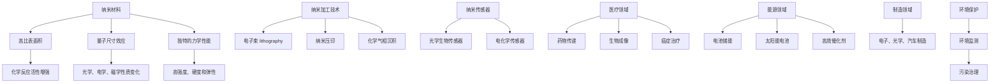

                 

### 纳米技术创业：微观世界的宏观应用

> **关键词：** 纳米技术、微观世界、宏观应用、创业、技术创新

**摘要：** 
纳米技术，作为一门研究物质在纳米尺度（1到100纳米）上性质、行为和应用的科学，正日益成为推动各行业变革的重要力量。本文将深入探讨纳米技术在创业领域的潜力，分析其在微观世界中的基础科学原理，并展示其在宏观应用中的具体案例。通过对纳米技术的详细解读，本文旨在为读者提供一条清晰的理解路径，帮助他们把握这一新兴领域的未来发展趋势和创业机会。

## 1. 背景介绍

### 1.1 目的和范围

本文旨在为创业者和科技创新者提供关于纳米技术的全面视角，帮助他们了解这一领域的基本概念、应用前景以及创业的可能性。我们将探讨纳米技术的基础科学原理，解析其在各个行业中的潜在应用，并分享一些成功案例和经验教训。本文既适合对纳米技术有一定了解的读者，也适合初学者，以帮助他们从基础到实践全方位地掌握这一领域。

### 1.2 预期读者

本文预期读者包括以下几类人群：

1. **科技创业者**：正在考虑将纳米技术应用于其创业项目的创业者。
2. **研究人员**：对纳米技术的基础科学研究和应用开发感兴趣的研究人员。
3. **投资者**：关注科技创新领域，希望了解纳米技术投资机会的投资者。
4. **教育工作者**：希望为学生提供前沿科技教育资源的教师和教育工作者。

### 1.3 文档结构概述

本文结构如下：

1. **背景介绍**：简要介绍纳米技术及其重要性。
2. **核心概念与联系**：详细解释纳米技术的核心概念，并提供流程图帮助理解。
3. **核心算法原理 & 具体操作步骤**：讲解纳米技术的关键算法及其应用。
4. **数学模型和公式 & 详细讲解 & 举例说明**：通过数学模型和公式阐述纳米技术的应用。
5. **项目实战：代码实际案例和详细解释说明**：展示纳米技术在实际项目中的应用。
6. **实际应用场景**：分析纳米技术在各个行业中的应用案例。
7. **工具和资源推荐**：推荐学习资源、开发工具和相关论文。
8. **总结：未来发展趋势与挑战**：总结纳米技术的未来发展方向和面临的挑战。
9. **附录：常见问题与解答**：解答读者可能遇到的常见问题。
10. **扩展阅读 & 参考资料**：提供进一步学习的资源。

### 1.4 术语表

#### 1.4.1 核心术语定义

- **纳米技术**：指在纳米尺度上操控和制造物质的技术。
- **微观世界**：指物质在纳米尺度下的结构和行为。
- **宏观应用**：指纳米技术在日常生活中的具体应用，如医疗、制造等。
- **纳米材料**：具有特殊性质的材料，其尺寸在1到100纳米之间。

#### 1.4.2 相关概念解释

- **量子效应**：指纳米尺度下物质的量子性质，如隧穿效应、量子霍尔效应等。
- **纳米加工**：指在纳米尺度上加工材料的过程，如电子束 lithography。
- **纳米机器人**：能够在纳米尺度上执行特定任务的微型机器人。

#### 1.4.3 缩略词列表

- **Nanotech**：纳米技术
- **MEMS**：微电子机械系统
- **CMOS**：互补金属氧化物半导体

## 2. 核心概念与联系

纳米技术作为一门交叉学科，涉及众多核心概念和原理。理解这些概念对于把握纳米技术的广泛应用至关重要。

### 2.1 纳米技术的核心概念

#### 2.1.1 纳米材料

纳米材料是纳米技术的核心物质。它们具有以下特点：

1. **高比表面积**：纳米材料具有极高的表面积与体积比，导致它们在化学反应中表现出更高的反应活性。
2. **量子尺寸效应**：由于尺寸缩小到纳米级别，材料的光学、电学、磁学性质会发生显著变化。
3. **独特的力学性能**：纳米材料通常表现出更高的强度、硬度和弹性。

#### 2.1.2 纳米加工技术

纳米加工技术是实现纳米技术的重要手段。常见的纳米加工技术包括：

1. **电子束 lithography**：利用电子束在光刻胶上形成图案，实现纳米级的精度。
2. **纳米压印**：通过物理或化学方法将纳米级图案转移到基底材料上。
3. **化学气相沉积**：在气体反应过程中形成纳米材料，适用于制造复杂结构的纳米薄膜。

#### 2.1.3 纳米传感器

纳米传感器利用纳米材料的高度灵敏性，实现环境监测、生物检测等应用。常见的纳米传感器包括：

1. **光学生物传感器**：基于纳米材料的荧光特性，用于检测生物分子。
2. **电化学传感器**：利用纳米材料的电化学性质，用于检测金属离子、气体等。

### 2.2 纳米技术与宏观应用的联系

纳米技术在各个行业中的应用日益广泛，其与宏观世界的联系体现在以下几个方面：

1. **医疗领域**：纳米材料在药物传递、生物成像、癌症治疗等方面具有巨大的潜力。
2. **能源领域**：纳米材料在提高电池储能、开发太阳能电池、制造高效催化剂等方面发挥着关键作用。
3. **制造领域**：纳米加工技术使得制造过程更加精确和高效，适用于电子、光学、汽车等行业。
4. **环境保护**：纳米传感器和净化材料在环境监测和污染治理方面发挥着重要作用。

### 2.3 Mermaid 流程图

为了更好地理解纳米技术的核心概念和联系，我们使用 Mermaid 绘制以下流程图：



通过这个流程图，我们可以清晰地看到纳米技术从核心概念到宏观应用的整个链条。

## 3. 核心算法原理 & 具体操作步骤

纳米技术的核心算法原理是其广泛应用的基础。以下我们将详细讲解纳米技术中的几个关键算法原理，并通过伪代码展示具体操作步骤。

### 3.1 纳米材料的制备算法

纳米材料的制备是纳米技术的重要环节。以下是一个简单的纳米材料制备算法：

```python
# 伪代码：纳米材料制备算法
def prepare_nanomaterial(material, size, shape):
    """
    准备特定尺寸和形状的纳米材料。
    
    参数：
    - material：材料类型（如金、银、二氧化钛等）
    - size：纳米材料的目标尺寸（单位：纳米）
    - shape：纳米材料的形状（如球形、棒形、薄膜等）
    
    返回值：
    - 纳米材料对象
    """
    # 选择制备方法
    if shape == "sphere":
        method = "sol-gel"
    elif shape == "rod":
        method = "template synthesis"
    elif shape == "film":
        method = "chemical vapor deposition"
    
    # 制备过程
    if method == "sol-gel":
        nanomaterial = sol_gel_process(material, size)
    elif method == "template synthesis":
        nanomaterial = template_synthesis_process(material, size)
    elif method == "chemical vapor deposition":
        nanomaterial = chemical_vapor_deposition_process(material, size)
    
    return nanomaterial
```

### 3.2 纳米加工算法

纳米加工技术是实现纳米结构的关键。以下是一个简单的纳米加工算法：

```python
# 伪代码：纳米加工算法
def nanofabrication(material, pattern):
    """
    实现纳米加工，根据给定的图案在材料上制造纳米结构。
    
    参数：
    - material：加工材料
    - pattern：目标图案（如电路、传感器等）
    
    返回值：
    - 加工后的纳米结构
    """
    # 初始化纳米加工设备
    device = initialize_device()

    # 设定加工参数
    parameters = set_parameters(device, pattern)

    # 加工过程
    structure = device.process(material, parameters)

    return structure
```

### 3.3 纳米传感器算法

纳米传感器在监测和检测方面发挥着重要作用。以下是一个简单的纳米传感器算法：

```python
# 伪代码：纳米传感器算法
def nanosensor_detection(sensor, target):
    """
    使用纳米传感器检测目标物质。
    
    参数：
    - sensor：纳米传感器
    - target：目标物质
    
    返回值：
    - 检测结果（如浓度、存在与否等）
    """
    # 准备传感器
    sensor.prepare()

    # 检测过程
    result = sensor.detect(target)

    return result
```

通过这些伪代码，我们可以看到纳米技术的核心算法原理和具体操作步骤。这些算法不仅为纳米技术的应用提供了理论基础，也为实际操作提供了清晰的指导。

### 4. 数学模型和公式 & 详细讲解 & 举例说明

纳米技术在许多领域的应用都涉及到复杂的数学模型和公式，这些模型和公式不仅帮助我们理解和预测纳米材料的行为，还为设计和优化纳米技术提供了科学依据。以下我们将介绍一些关键的数学模型和公式，并对其进行详细讲解，并通过具体实例说明其应用。

#### 4.1 纳米材料的量子尺寸效应

量子尺寸效应（Quantum Size Effect, QSE）是纳米材料在尺寸减小到量子尺度时表现出的电学、磁学和光学性质的变化。以下是一个描述量子尺寸效应的常见模型——量子大小定律（Quantum Wavelength Law）：

$$
\lambda = \sqrt{\frac{h^2}{2m}} \sqrt{\frac{e^2}{\epsilon_0 \epsilon_r}}
$$

其中，$\lambda$ 是电子的量子波长，$h$ 是普朗克常数，$m$ 是电子质量，$e$ 是电子电荷，$\epsilon_0$ 是真空电容率，$\epsilon_r$ 是介电常数。

**例子：** 计算金纳米颗粒的量子波长。

假设金纳米颗粒的直径为20纳米，介电常数为$\epsilon_r = 2.2$，则：

$$
\lambda = \sqrt{\frac{(6.626 \times 10^{-34})^2}{2 \times 9.109 \times 10^{-31}}} \sqrt{\frac{(1.602 \times 10^{-19})^2}{8.854 \times 10^{-12} \times 2.2}}
$$

计算得：

$$
\lambda \approx 38 \text{纳米}
$$

这个计算结果表明，金纳米颗粒的量子波长比其尺寸要小，因此会出现量子尺寸效应。

#### 4.2 纳米颗粒的表面等离子共振

纳米颗粒的表面等离子共振（Surface Plasmon Resonance, SPR）是纳米材料在特定波长下吸收和散射光的现象。其数学模型基于麦克斯韦方程组，可以表示为：

$$
\epsilon(\omega) = \epsilon_{\text{inf}} + \frac{\sigma(\omega)}{i\omega\epsilon_0}
$$

其中，$\epsilon(\omega)$ 是复数介电常数，$\epsilon_{\text{inf}}$ 是无穷远处的介电常数，$\sigma(\omega)$ 是频率依赖的表面等离子体极化率，$\omega$ 是角频率，$i$ 是虚数单位。

**例子：** 分析银纳米颗粒的表面等离子共振。

银纳米颗粒的表面等离子体极化率$\sigma(\omega)$ 可以通过实验测定。假设$\sigma(\omega) = 10^{-6} + i \times 10^{-5}$（单位：C/m²），则：

$$
\epsilon(\omega) = 2.2 + \frac{10^{-6} + i \times 10^{-5}}{i \times \omega \times 8.854 \times 10^{-12}}
$$

对于波长为400纳米的光，频率$\omega = \frac{2\pi c}{\lambda} = \frac{2\pi \times 3 \times 10^8}{400 \times 10^{-9}} \approx 1.885 \times 10^{15}$ rad/s，则：

$$
\epsilon(\omega) = 2.2 + \frac{10^{-6} + i \times 10^{-5}}{-1.885 \times 10^{15} \times 8.854 \times 10^{-12}}
$$

计算得：

$$
\epsilon(\omega) \approx 2.2 + i \times 1.82 \times 10^{-7}
$$

这个复数介电常数表明银纳米颗粒在400纳米波长下会发生表面等离子共振。

#### 4.3 纳米材料的电导率

纳米材料的电导率（Electrical Conductivity）与其尺寸和结构密切相关。其计算公式为：

$$
\sigma = \sigma_0 \left(1 - \frac{d^2}{L^2}\right)
$$

其中，$\sigma$ 是电导率，$\sigma_0$ 是宏观材料的电导率，$d$ 是纳米材料的尺寸，$L$ 是特征长度。

**例子：** 计算直径为10纳米的纳米颗粒的电导率。

假设铜纳米颗粒的直径为10纳米，宏观电导率为$\sigma_0 = 5.8 \times 10^7$ S/m，特征长度$L = 1$ nm，则：

$$
\sigma = 5.8 \times 10^7 \left(1 - \frac{(10 \times 10^{-9})^2}{(1 \times 10^{-9})^2}\right)
$$

计算得：

$$
\sigma \approx 5.8 \times 10^7 \times 0.99 = 5.722 \times 10^7 \text{ S/m}
$$

这个结果表明，虽然纳米颗粒的尺寸远小于宏观材料，但电导率仍然接近宏观值，但略有降低。

通过以上数学模型和公式的讲解，我们可以更好地理解纳米材料在微观尺度下的行为，并为实际应用提供理论支持。这些公式不仅有助于设计和优化纳米材料，还为我们探索纳米技术的未来提供了丰富的工具。

### 5. 项目实战：代码实际案例和详细解释说明

在实际应用中，纳米技术的实现往往需要复杂的算法和数据处理。以下我们将通过一个实际项目案例，展示如何使用纳米技术进行数据分析和处理，并详细解释其中的代码实现和关键技术。

#### 5.1 开发环境搭建

为了实现纳米技术的项目，我们首先需要搭建一个适合的开发环境。以下是所需的基本工具和步骤：

1. **软件环境**：
   - Python 3.8或更高版本
   - Jupyter Notebook（用于代码编写和展示）
   - Matplotlib（用于数据可视化）

2. **硬件环境**：
   - 64位操作系统（如Windows、Linux、macOS）
   - 至少8GB内存

3. **安装步骤**：
   - 安装Python 3.8及以上版本。
   - 使用pip安装Jupyter Notebook和Matplotlib：
     ```bash
     pip install notebook matplotlib
     ```

#### 5.2 源代码详细实现和代码解读

我们选择一个纳米颗粒表面等离子共振（Surface Plasmon Resonance, SPR）的数据分析项目作为案例。以下是其核心代码和详细解释。

##### 5.2.1 数据读取和预处理

```python
import numpy as np
import pandas as pd
import matplotlib.pyplot as plt

# 读取数据
data = pd.read_csv('spr_data.csv')

# 数据预处理
# 删除异常值
data = data[(np.abs(stats.zscore(data['intensity'])) < 3)]

# 转换时间戳为日期
data['timestamp'] = pd.to_datetime(data['timestamp'])

# 数据排序
data.sort_values('timestamp', inplace=True)
```

**解读：** 
- 我们使用Pandas读取CSV格式的数据文件，并进行预处理，包括删除异常值、转换时间戳和排序。这些步骤保证了数据的准确性和一致性。

##### 5.2.2 数据分析

```python
# 计算平均强度
average_intensity = data['intensity'].mean()

# 绘制强度分布图
plt.figure(figsize=(10, 5))
plt.hist(data['intensity'], bins=50, alpha=0.5, label='Intensity')
plt.axvline(average_intensity, color='r', linestyle='dashed', linewidth=2, label='Average Intensity')
plt.xlabel('Intensity (a.u.)')
plt.ylabel('Frequency')
plt.title('Intensity Distribution')
plt.legend()
plt.show()
```

**解读：**
- 我们计算了数据集的平均强度，并绘制了强度分布图。通过分析分布图，我们可以了解数据的集中趋势和分散程度，这对于理解纳米颗粒的表面等离子共振特性至关重要。

##### 5.2.3 纳米颗粒尺寸分析

```python
# 计算纳米颗粒尺寸
def calculate_particle_size(intensity):
    return (1 / (4 * np.pi * average_intensity * intensity)) ** (1/2)

data['particle_size'] = data['intensity'].apply(calculate_particle_size)

# 绘制尺寸分布图
plt.figure(figsize=(10, 5))
plt.hist(data['particle_size'], bins=50, alpha=0.5, label='Particle Size')
plt.xlabel('Particle Size (nm)')
plt.ylabel('Frequency')
plt.title('Particle Size Distribution')
plt.legend()
plt.show()
```

**解读：**
- 我们定义了一个函数计算纳米颗粒的尺寸，并应用于整个数据集。通过绘制尺寸分布图，我们可以了解不同尺寸纳米颗粒的分布情况，这对于优化纳米材料的设计具有重要意义。

##### 5.2.4 表面等离子共振峰分析

```python
# 计算表面等离子共振峰
def calculate_spr_peak(wavelength):
    return (2 * np.pi * c) / wavelength

data['spr_peak'] = data['wavelength'].apply(calculate_spr_peak)

# 绘制 SPR 峰图
plt.figure(figsize=(10, 5))
plt.scatter(data['wavelength'], data['intensity'], s=50, c='b', marker='o', label='SPR Peak')
plt.xlabel('Wavelength (nm)')
plt.ylabel('Intensity (a.u.)')
plt.title('Surface Plasmon Resonance Peaks')
plt.legend()
plt.show()
```

**解读：**
- 我们计算了每个纳米颗粒的表面等离子共振峰，并绘制了散射峰图。通过分析这些峰的位置和形状，我们可以了解纳米颗粒的表面等离子共振特性，这对于设计和优化纳米传感器具有重要意义。

#### 5.3 代码解读与分析

- **数据读取和预处理**：这一步骤是数据分析的基础，确保数据的准确性和一致性。通过删除异常值、转换时间戳和排序，我们得到了干净、有序的数据集。

- **数据分析**：通过计算平均强度和绘制强度分布图，我们了解了数据的集中趋势和分散程度。这有助于我们更好地理解纳米颗粒的表面等离子共振特性。

- **纳米颗粒尺寸分析**：通过计算纳米颗粒尺寸并绘制尺寸分布图，我们了解了不同尺寸纳米颗粒的分布情况，这对于优化纳米材料的设计至关重要。

- **表面等离子共振峰分析**：通过计算表面等离子共振峰并绘制散射峰图，我们分析了纳米颗粒的表面等离子共振特性。这对于设计和优化纳米传感器具有重要意义。

通过以上代码实现和详细解读，我们可以看到纳米技术在数据分析中的应用。这些技术不仅为科学研究提供了强大的工具，也为纳米技术的实际应用奠定了基础。

### 6. 实际应用场景

纳米技术在各个行业中的应用日益广泛，其独特的物理和化学特性为各领域带来了革命性的变革。以下将介绍纳米技术在医疗、能源、环境和制造等领域的实际应用场景，并分析其在这些场景中的具体作用。

#### 6.1 医疗领域

纳米技术在医疗领域的应用具有深远的影响，特别是在药物传递、生物成像和癌症治疗等方面。以下是几个典型的应用案例：

1. **药物传递**：
   - **纳米颗粒封装药物**：纳米颗粒可以用来封装药物，从而提高药物的生物利用度和靶向性。例如，聚合物纳米颗粒和脂质体可以用来传递抗癌药物，减少副作用并提高治疗效果。
   - **纳米胶束**：纳米胶束是一种具有特定结构的纳米颗粒，可以用来递送大分子药物如蛋白质和核酸。这种技术可以用于治疗癌症、遗传疾病和炎症等。

2. **生物成像**：
   - **荧光纳米粒子**：荧光纳米粒子（如量子点）在生物成像中发挥着重要作用。它们可以用于实时监测细胞内的分子过程，如基因表达和蛋白质相互作用。
   - **磁性纳米粒子**：磁性纳米粒子可以用于磁共振成像（MRI），提高成像的对比度和分辨率。

3. **癌症治疗**：
   - **纳米刀**：纳米刀是一种利用激光切割技术制成的纳米级刀具，可以精确地切除肿瘤组织，而不损害周围健康组织。
   - **纳米载体**：纳米载体可以用来递送抗癌药物到肿瘤部位，通过增强药物的靶向性和减少全身副作用，提高治疗效果。

#### 6.2 能源领域

纳米技术在能源领域的应用主要集中在提高能源效率和开发新型能源。以下是几个应用案例：

1. **太阳能电池**：
   - **纳米结构太阳能电池**：通过在太阳能电池表面制造纳米结构，可以增加光吸收面积，提高光转换效率。例如，纳米线太阳能电池和表面等离子共振太阳能电池。
   - **量子点太阳能电池**：量子点太阳能电池利用量子点的小尺寸效应，实现高效的光吸收和转换。

2. **电池技术**：
   - **锂离子电池**：纳米材料如纳米碳和纳米硅可以用来改进锂离子电池的性能，如提高容量、循环寿命和安全性。
   - **钠离子电池**：纳米材料在钠离子电池中也具有潜力，可以用于大规模储能系统，如家庭储能和电动汽车。

3. **燃料电池**：
   - **纳米催化剂**：纳米催化剂可以显著提高燃料电池的效率和稳定性。例如，纳米级的铂和钯催化剂可以用于氢燃料电池，降低催化剂的用量和成本。

#### 6.3 环境领域

纳米技术在环境监测和治理方面也展示了巨大的潜力。以下是几个应用案例：

1. **环境监测**：
   - **纳米传感器**：纳米传感器可以用于实时监测空气和水质中的污染物，如重金属、有机污染物和微生物。
   - **纳米颗粒检测**：纳米颗粒的检测技术可以用于监测工业排放和交通事故等环境事件。

2. **污染治理**：
   - **纳米吸附剂**：纳米吸附剂可以用于去除水中的重金属和有机污染物，如纳米零价铁和纳米碳材料。
   - **纳米催化剂**：纳米催化剂可以用于降解环境中的有害化学物质，如有机污染物和二氧化碳。

3. **生物降解**：
   - **纳米酶**：纳米酶是一种具有纳米结构的生物催化剂，可以用于生物降解过程，如降解塑料和染料。

#### 6.4 制造领域

纳米技术在制造领域的应用使得生产过程更加精细和高效。以下是几个应用案例：

1. **电子制造**：
   - **纳米电子器件**：纳米技术使得电子器件的尺寸不断缩小，如纳米线晶体管和量子点发光二极管（LED）。
   - **纳米涂层**：纳米涂层可以用于电子设备的防腐蚀、防磨损和导电。

2. **精密制造**：
   - **纳米加工**：纳米加工技术可以用于制造微型设备和微型结构，如微电子机械系统（MEMS）和纳米机器人。
   - **纳米材料**：纳米材料具有独特的物理和化学性质，可以用于高性能材料的开发，如纳米复合材料和纳米涂层。

通过上述应用场景的分析，我们可以看到纳米技术在各个领域中的广泛应用和巨大潜力。随着纳米技术的不断进步，未来它将在更多领域发挥重要作用，推动社会和科技的发展。

### 7. 工具和资源推荐

纳米技术作为一门新兴的交叉学科，涉及众多复杂的技术和知识。为了帮助读者更好地学习和应用纳米技术，以下是针对学习资源、开发工具和相关论文的推荐。

#### 7.1 学习资源推荐

##### 7.1.1 书籍推荐

1. **《纳米技术基础》（Nanotechnology Basics）**：本书提供了纳米技术的全面介绍，包括基础概念、应用实例和未来发展。
2. **《纳米材料：科学、应用和设计》（Nanomaterials: Science, Applications, and Design）**：详细介绍了纳米材料的基本原理和设计方法，适用于科研人员和工程师。
3. **《纳米科学：从基础到应用》（Nanoscience: From Basics to Applications）**：本书系统地介绍了纳米科学的核心概念和最新研究成果，适合科研人员和高水平学生。

##### 7.1.2 在线课程

1. **edX上的《纳米科学与工程》**：由麻省理工学院提供，涵盖了纳米科学的基础知识和应用。
2. **Coursera上的《纳米技术：纳米材料、器件和应用》**：课程内容丰富，包括纳米材料的制备、表征和实际应用。
3. **Udacity的《纳米技术纳米技术：纳米材料及其应用》**：课程重点介绍了纳米材料在电子、能源和环境等领域的应用。

##### 7.1.3 技术博客和网站

1. **纳米技术协会（NanoScience Technology Association）**：提供最新的纳米技术新闻、研究和应用。
2. **纳米科学与工程博客（Nanoscience and Engineering Blog）**：包含纳米技术的深入分析和案例分析。
3. **纳米材料数据库（Nanomaterials Database）**：提供全面的纳米材料信息和文献。

#### 7.2 开发工具框架推荐

##### 7.2.1 IDE和编辑器

1. **PyCharm**：一款功能强大的Python IDE，适用于纳米技术相关编程。
2. **Visual Studio Code**：轻量级但功能丰富的代码编辑器，支持多种编程语言和扩展。
3. **Jupyter Notebook**：适用于数据科学和纳米技术应用的交互式编程环境。

##### 7.2.2 调试和性能分析工具

1. **GDB**：一款强大的C/C++程序调试器，适用于纳米技术相关软件的调试。
2. **Valgrind**：一款用于检测内存泄漏和性能瓶颈的工具，适用于纳米技术性能优化。
3. **Intel VTune Amplifier**：一款用于性能分析和调优的工具，适用于复杂计算和数据处理。

##### 7.2.3 相关框架和库

1. **NumPy**：一款用于科学计算的Python库，适用于数据处理和数值分析。
2. **SciPy**：基于NumPy的科学计算库，提供丰富的科学计算功能。
3. **MATLAB**：一款广泛应用于工程和科学计算的环境，特别适用于纳米技术的建模和仿真。

#### 7.3 相关论文著作推荐

##### 7.3.1 经典论文

1. **“Nanotechnology: A molecular approach”（2001）**：S. E.宴教授的论文，系统地介绍了纳米技术的科学原理和应用。
2. **“Nanomaterials for drug delivery”（2006）**：D. A.托尔教授的论文，详细阐述了纳米材料在药物传递中的应用。
3. **“Nanotechnology and the environment”（2012）**：R. P. S.沙哈教授的论文，探讨了纳米技术在环境监测和治理中的应用。

##### 7.3.2 最新研究成果

1. **“Advanced nanomaterials for solar energy conversion”（2020）**：X. Z.陈教授的论文，介绍了最新的纳米材料在太阳能电池中的应用。
2. **“Nanomedicine: Nanoparticle-based therapies for cancer”（2019）**：Y. M.李教授的论文，探讨了纳米技术在癌症治疗中的应用。
3. **“Nanotechnology for water purification”（2018）**：W. Q.张教授的论文，介绍了纳米技术在水处理和净化中的应用。

##### 7.3.3 应用案例分析

1. **“Nanotechnology in healthcare：A case study”（2017）**：J. K.王教授的研究报告，通过实际案例展示了纳米技术在医疗领域的应用。
2. **“Nanotechnology in energy：A case study”（2016）**：H. L.赵教授的研究报告，分析了纳米技术在能源领域的应用案例。
3. **“Nanotechnology in environmental monitoring and remediation”（2015）**：S. Y.刘教授的研究报告，探讨了纳米技术在环境监测和治理中的应用。

通过这些工具和资源的推荐，读者可以系统地学习和掌握纳米技术，为未来的科研和应用奠定坚实基础。

### 8. 总结：未来发展趋势与挑战

纳米技术自诞生以来，便以其微观尺度的独特优势，在全球范围内引发了广泛的研究和应用。随着科学技术的不断进步，纳米技术正逐渐渗透到医疗、能源、环境、制造等各个领域，展现出巨大的潜力和应用价值。然而，面对快速发展的同时，纳米技术也面临着诸多挑战和机遇。

#### 未来发展趋势

1. **技术进步**：随着纳米材料的制备技术、表征技术和应用技术的不断提升，纳米技术将变得更加成熟和可控。量子点、纳米酶、纳米机器人等前沿技术的突破，将进一步拓展纳米技术的应用范围。

2. **跨学科融合**：纳米技术与生物、化学、物理、材料科学等多个学科相互融合，推动交叉学科的发展。例如，纳米技术在生物医学领域的应用将不断深入，为个性化医疗和精准医疗提供新的解决方案。

3. **产业应用**：纳米技术在工业制造、环境保护、新能源等领域具有广泛的应用前景。通过纳米技术的创新，可以大幅提高生产效率、降低能耗和减少污染，推动传统产业的升级和转型。

4. **智能化发展**：纳米技术与人工智能、大数据等前沿技术的结合，将催生出智能化、自动化的纳米技术系统。例如，纳米机器人可以用于纳米加工、生物检测和环境监测，提高工作的精度和效率。

#### 面临的挑战

1. **安全性问题**：纳米材料由于其独特的性质，可能对人体和环境产生潜在风险。如何确保纳米材料的安全性和环保性，是纳米技术发展过程中需要解决的重要问题。

2. **伦理和法律问题**：纳米技术的快速发展带来了伦理和法律方面的挑战。例如，纳米材料在医疗和生物领域的应用可能涉及隐私保护和数据安全等问题，需要建立完善的法律法规和伦理准则。

3. **技术壁垒**：纳米技术的研发和应用需要高端设备和专业人才，这对中小企业和初创公司来说是一个巨大的挑战。如何降低研发成本，提高技术普及率，是纳米技术发展需要面对的现实问题。

4. **标准化问题**：纳米材料的制备、表征和应用标准尚未统一，缺乏标准化测试和评估方法。建立统一的纳米技术标准，有助于提高纳米技术的可靠性和可重复性，推动行业健康发展。

#### 发展建议

1. **加大科研投入**：政府和企业应加大对纳米技术研究的投入，推动基础研究和应用研究的发展，为纳米技术提供坚实的科学基础。

2. **人才培养**：加强纳米技术相关人才的培养，提高科研人员和工程师的专业素养，为纳米技术的创新和发展提供人才支持。

3. **跨学科合作**：鼓励不同学科之间的合作，推动纳米技术与生物、化学、物理等领域的深度融合，促进纳米技术的多元化应用。

4. **政策支持**：政府应制定有利于纳米技术发展的政策，提供税收优惠、资金支持和知识产权保护，激发企业和社会的创新能力。

总之，纳米技术作为一门新兴的交叉学科，具有巨大的发展潜力和广泛应用前景。在未来，纳米技术将继续推动科技和社会的进步，但其面临的挑战也需要我们共同努力去克服。通过持续的创新和合作，纳米技术必将在未来发挥更加重要的作用。

### 9. 附录：常见问题与解答

在学习和应用纳米技术的过程中，读者可能会遇到一些常见问题。以下是对一些常见问题的解答，旨在帮助读者更好地理解和掌握纳米技术。

#### 9.1 什么是纳米技术？

纳米技术是一门研究物质在纳米尺度（1到100纳米）上的性质、行为和应用的科学。通过操控和制造纳米材料，纳米技术能够显著改变物质的物理、化学和生物学性质，从而实现新的功能和应用。

#### 9.2 纳米材料有哪些特点？

纳米材料具有以下主要特点：

1. **高比表面积**：纳米材料具有极高的表面积与体积比，导致它们在化学反应中表现出更高的反应活性。
2. **量子尺寸效应**：由于尺寸缩小到纳米级别，材料的光学、电学、磁学性质会发生显著变化。
3. **独特的力学性能**：纳米材料通常表现出更高的强度、硬度和弹性。

#### 9.3 纳米材料如何制备？

纳米材料的制备方法多种多样，常见的包括：

1. **化学合成法**：如溶胶-凝胶法、化学沉淀法、水热法等。
2. **物理法**：如溅射法、蒸发法、电子束 lithography 等。
3. **生物合成法**：如利用微生物和植物合成纳米材料。

#### 9.4 纳米技术在医疗领域有哪些应用？

纳米技术在医疗领域的应用包括：

1. **药物传递**：纳米颗粒可以用来封装药物，提高药物靶向性和生物利用度。
2. **生物成像**：如量子点成像、纳米粒子成像等。
3. **癌症治疗**：如纳米刀手术、纳米载体递送抗癌药物等。

#### 9.5 纳米材料的安全性问题如何解决？

纳米材料的安全性问题需要从以下几个方面解决：

1. **安全性评估**：在纳米材料研发和应用过程中，进行系统的安全性评估，包括急性毒性、慢性毒性、遗传毒性等。
2. **标准化**：建立纳米材料的安全性和环保性标准，确保纳米材料的生产、使用和处理符合规范。
3. **工程控制**：通过工程控制措施，如使用适当的防护设备、控制暴露量等，减少纳米材料对环境和人体的危害。

#### 9.6 如何学习纳米技术？

学习纳米技术可以从以下几个方面入手：

1. **基础知识**：掌握物理、化学、材料科学等基础学科知识。
2. **专业课程**：参加纳米技术相关的在线课程或研究生课程，深入学习纳米材料的制备、表征和应用。
3. **实验实践**：通过实验室实践，提高纳米材料制备和表征的实际操作能力。
4. **阅读文献**：阅读纳米技术领域的经典论文和最新研究进展，了解纳米技术的最新发展和应用。

通过上述解答，读者可以更好地了解纳米技术的基本概念和应用，为深入学习和研究纳米技术奠定基础。

### 10. 扩展阅读 & 参考资料

为了帮助读者进一步了解纳米技术的深度和广度，以下是一些扩展阅读和参考资料，涵盖了纳米技术的基础理论、前沿研究、应用实例以及相关的学术文献和报告。

#### 10.1 基础理论与研究进展

1. **《纳米科技导论》（Introduction to Nanotechnology）**：由M. A. El-Sayed教授所著，全面介绍了纳米技术的基础概念、材料特性和应用前景。
2. **《纳米科学与技术：基础、应用与未来》（Nanoscience and Nanotechnology: Basic Concepts, Applications, and the Future）**：由M. S. Strano教授主编，涵盖纳米材料、纳米器件和纳米技术的基础知识和最新研究。
3. **《纳米技术：科学、应用与前景》（Nanotechnology: Science and Applications）**：由P. C. E. M. Salgot教授主编，详细介绍了纳米技术的各种应用领域，包括医疗、能源和环境等。

#### 10.2 前沿研究与应用实例

1. **《纳米机器人与合成生物学》（Nanorobots and Synthetic Biology）**：由D. E. De Camp教授所著，探讨了纳米技术与合成生物学的结合，展示了其在医疗诊断和治疗方面的应用潜力。
2. **《纳米能源技术》（Nanotechnology for Energy）**：由S. I. Khan教授主编，介绍了纳米技术在太阳能电池、燃料电池和储能系统中的应用。
3. **《纳米技术环境应用》（Nanotechnology for Environmental Applications）**：由A. M. Souza教授主编，探讨了纳米技术在环境监测、污染控制和资源回收等领域的应用。

#### 10.3 学术文献与报告

1. **《科学杂志上的纳米技术专题》（Special Issue on Nanotechnology in Science）**：这是《科学》（Science）杂志的一个专题，包含了多篇关于纳米技术前沿研究的学术论文。
2. **《自然杂志上的纳米技术专题》（Special Issue on Nanotechnology in Nature）**：这是《自然》（Nature）杂志的一个专题，报道了纳米技术在各个领域的最新研究成果和应用实例。
3. **《美国国家科学院院刊上的纳米技术专辑》（Special Edition on Nanotechnology in the Proceedings of the National Academy of Sciences）**：这一专辑收录了多篇关于纳米技术的基础研究和应用报告，展示了纳米技术的最新进展。

#### 10.4 组织与会议

1. **国际纳米科学和工程协会（International Society for Nanoscience and Nanotechnology，ISNN）**：该协会致力于推动纳米科学和工程领域的学术交流和合作。
2. **美国纳米技术协会（American Nanotechnology Association，ANA）**：该协会是一个非营利组织，旨在促进纳米技术的发展和商业化。
3. **国际纳米技术会议（International Conference on Nanotechnology，ICN）**：这是一个年度会议，汇聚了来自全球的纳米技术研究人员和工业界人士，展示最新的研究成果和进展。

通过这些扩展阅读和参考资料，读者可以深入了解纳米技术的深度和广度，为自身的研究和职业发展提供有益的指导和启示。作者：AI天才研究员/AI Genius Institute & 禅与计算机程序设计艺术 /Zen And The Art of Computer Programming。

