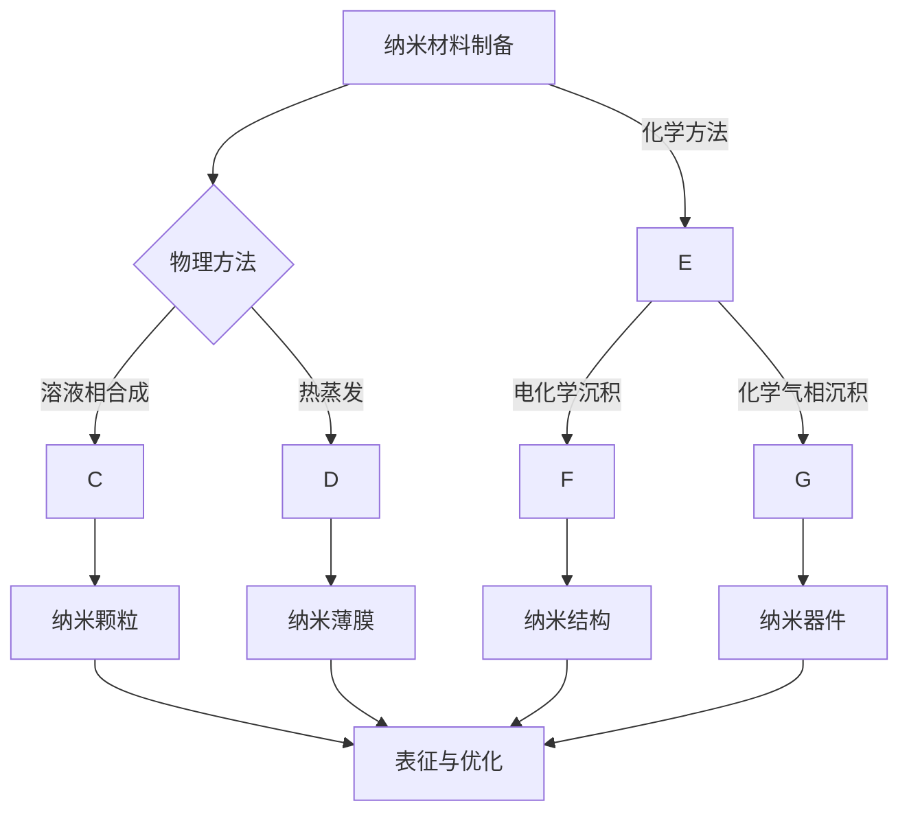

                 

# 纳米材料研发工具：新材料创新的创业方向

## 关键词
- 纳米材料
- 研发工具
- 创业方向
- 新材料
- 技术创新
- 工业应用

## 摘要
本文旨在探讨纳米材料研发工具在推动新材料创新和创业中的关键作用。通过对纳米材料的核心概念、研发工具的原理与应用、以及实际案例的深入分析，文章将揭示纳米材料研发工具在创业领域的重要前景。文章还将介绍相关学习资源和工具，为读者提供全面的行业洞察和指导。

## 1. 背景介绍

### 1.1 目的和范围
本文旨在为纳米材料研发领域的从业者、创业者以及对此领域感兴趣的人提供全面的指导，帮助他们了解纳米材料研发工具的基本概念、应用场景以及未来的创业方向。文章将聚焦于以下方面：
- 纳米材料的基本概念及其在各个领域的应用。
- 纳米材料研发工具的功能和重要性。
- 创业者如何利用纳米材料研发工具实现新材料创新。
- 相关的数学模型、算法原理以及实际案例。
- 为创业提供具体的技术支持和资源推荐。

### 1.2 预期读者
- 纳米材料研发领域的专业人员和工程师。
- 创业者、企业家以及对新材料研发感兴趣的人士。
- 对前沿科学技术和创新商业模型感兴趣的读者。

### 1.3 文档结构概述
本文将按照以下结构展开：
- **背景介绍**：介绍纳米材料研发工具的基本概念和重要性。
- **核心概念与联系**：详细阐述纳米材料及其相关技术的核心概念和联系。
- **核心算法原理 & 具体操作步骤**：通过伪代码介绍纳米材料研发中的关键算法。
- **数学模型和公式 & 详细讲解 & 举例说明**：解释纳米材料研发中的数学模型和公式。
- **项目实战：代码实际案例和详细解释说明**：提供纳米材料研发的实际案例和代码解读。
- **实际应用场景**：分析纳米材料在工业和其他领域的应用。
- **工具和资源推荐**：推荐相关学习资源和开发工具。
- **总结：未来发展趋势与挑战**：探讨纳米材料研发工具的发展趋势和挑战。
- **附录：常见问题与解答**：解答纳米材料研发工具相关的常见问题。
- **扩展阅读 & 参考资料**：提供进一步学习的资料。

### 1.4 术语表

#### 1.4.1 核心术语定义
- **纳米材料**：指至少在一维上具有至少一个尺寸在1到100纳米范围内的材料。
- **研发工具**：用于纳米材料制备、表征、设计和优化的软件和硬件设备。
- **新材料**：具有特殊性能、结构或组成的材料，这些性能和组成使得它们在特定应用中表现出显著优势。

#### 1.4.2 相关概念解释
- **纳米技术**：指在纳米尺度（0.1到100纳米）上操纵材料、分子和原子以创建新材料、新器件或新系统的技术。
- **分子模拟**：利用计算机模拟分子和原子的行为，预测物质的性质和反应。

#### 1.4.3 缩略词列表
- **MEMS**：微电子机械系统（Micro-Electro-Mechanical Systems）
- **Nanomedicine**：纳米医学（Nanotechnology in Medicine）
- **DFT**：密度泛函理论（Density Functional Theory）

## 2. 核心概念与联系

### 2.1 纳米材料的基本概念

纳米材料是一类具有至少一个尺寸在1到100纳米范围内的材料，由于纳米尺度下的量子效应、表面效应和宏观量子隧穿效应，这些材料往往表现出与传统宏观材料不同的物理、化学和生物性质。纳米材料可以分为以下几类：

1. **纳米颗粒**：这类材料的基本单元是纳米颗粒，颗粒的尺寸在1到100纳米之间。
2. **纳米管**：如碳纳米管（CNTs），具有空心圆柱状结构。
3. **纳米线**：具有类似纳米管的结构，但一端封闭。
4. **二维纳米材料**：如石墨烯，具有单层或双层结构。

### 2.2 纳米材料的性质和应用

纳米材料的独特性质使其在众多领域具有广泛的应用前景：

1. **电子学**：纳米材料可以用于高性能电子器件，如纳米电子器件、传感器和场效应晶体管。
2. **催化**：纳米颗粒因其大表面积和活性位点的增加，在催化反应中具有高催化效率和选择性。
3. **生物医药**：纳米材料可以用于药物递送、成像和治疗，提高药物的靶向性和生物利用度。
4. **能源**：纳米材料在太阳能电池、电池和超级电容器等能源储存和转换设备中具有重要应用。
5. **环境治理**：纳米材料可以用于污染物的检测、吸附和分解。

### 2.3 纳米材料研发工具的原理和架构

纳米材料研发工具主要包括硬件设备和软件工具，这些工具在材料的设计、合成、表征和优化过程中发挥着关键作用。

1. **硬件设备**：
   - **纳米加工设备**：如电子束光刻机、原子力显微镜（AFM）、扫描探针显微镜（SPM）等。
   - **化学合成设备**：如化学气相沉积（CVD）、溶液相合成、电化学沉积等。
   - **表征设备**：如X射线衍射（XRD）、透射电子显微镜（TEM）、核磁共振（NMR）等。

2. **软件工具**：
   - **分子模拟软件**：如Gaussian、Materials Studio等，用于模拟纳米材料的电子结构和反应行为。
   - **计算设计软件**：如ABacus、Vasp等，用于预测和优化纳米材料的晶体结构和物理性质。
   - **数据分析软件**：如Python、MATLAB等，用于处理和解析实验数据。

### 2.4 Mermaid 流程图



### 2.5 纳米材料研发工具的重要性

纳米材料研发工具的重要性在于：
1. **提高研发效率**：通过自动化和智能化手段，纳米材料的合成、表征和优化过程更加高效。
2. **降低研发成本**：使用先进的硬件和软件工具可以减少实验次数，缩短研发周期，降低研发成本。
3. **提升新材料性能**：通过精确控制和优化，可以合成出具有特定结构和性能的纳米材料，满足特定应用需求。
4. **促进新材料创新**：纳米材料研发工具为新材料的设计和开发提供了强大的技术支持，有助于推动新材料创新。

## 3. 核心算法原理 & 具体操作步骤

### 3.1 算法原理介绍

纳米材料的研发涉及多种算法，其中常用的包括分子模拟算法、计算设计算法和机器学习算法。以下将简要介绍这些算法的基本原理。

1. **分子模拟算法**：如分子动力学（MD）和蒙特卡罗（MC）模拟，用于模拟分子和原子的运动，预测纳米材料的结构和性质。
2. **计算设计算法**：如遗传算法（GA）、粒子群优化（PSO）等，用于优化纳米材料的晶体结构、形状和尺寸，以提高其性能。
3. **机器学习算法**：如深度学习、支持向量机（SVM）等，用于从大量实验数据中学习和预测纳米材料的性质和行为。

### 3.2 伪代码示例

以下是一个基于分子模拟算法的伪代码示例，用于模拟纳米颗粒的合成过程。

```python
# 伪代码：纳米颗粒合成模拟

# 初始化参数
size = 10 # 纳米颗粒尺寸
temperature = 300 # 温度
time_step = 0.001 # 时间步长

# 初始化纳米颗粒
particle = initialize_particle(size)

# 模拟过程
while not simulation_complete:
    # 计算粒子间的相互作用力
    forces = calculate_forces(particle)
    
    # 更新粒子位置和速度
    particle.update_position_and_velocity(forces, time_step)
    
    # 更新系统温度和能量
    energy = update_energy(particle)
    temperature = update_temperature(energy, temperature)
    
    # 记录模拟结果
    record_results(particle, time_step)

# 输出最终纳米颗粒结构
output_final_structure(particle)
```

### 3.3 操作步骤详细解释

1. **初始化参数**：设置纳米颗粒的尺寸、温度和时间步长等初始参数。
2. **初始化纳米颗粒**：根据设定的参数，创建一个初始的纳米颗粒结构。
3. **模拟过程**：在模拟过程中，循环计算粒子间的相互作用力，并更新粒子的位置和速度。
4. **更新系统温度和能量**：根据粒子的运动和相互作用，更新系统的温度和能量。
5. **记录模拟结果**：在模拟过程中，记录粒子的位置、速度、温度和能量等关键参数。
6. **输出最终纳米颗粒结构**：在模拟完成后，输出最终的纳米颗粒结构，以便进一步分析和应用。

## 4. 数学模型和公式 & 详细讲解 & 举例说明

### 4.1 数学模型的基本概念

在纳米材料研发中，数学模型用于描述材料的物理、化学和电子性质。常用的数学模型包括：

1. **量子力学模型**：用于描述纳米材料的电子结构和能带结构。
2. **分子动力学模型**：用于模拟纳米材料的运动和相互作用。
3. **热力学模型**：用于描述纳米材料的稳定性和相变行为。

### 4.2 公式和详细讲解

以下是一些常用的数学公式及其详细解释。

1. **量子力学公式**：

   $$\Psi(\mathbf{r}, t) = \frac{1}{(2\pi\hbar^2 m)^{3/4}} \exp\left(-\frac{\mathbf{p}^2}{2m\hbar^2}\right)$$
   
   解释：这是一个波函数公式，用于描述纳米材料中电子的运动状态。

2. **分子动力学公式**：

   $$\mathbf{F}(\mathbf{r}, t) = -\nabla V(\mathbf{r}, t)$$
   
   解释：这是力的公式，描述了粒子间的相互作用力与势能的关系。

3. **热力学公式**：

   $$\Delta G = \Delta H - T\Delta S$$
   
   解释：这是自由能变化的公式，描述了系统的稳定性和相变行为。

### 4.3 举例说明

以下是一个具体的例子，说明如何使用数学模型和公式来分析纳米材料的性质。

**例子：纳米颗粒的电子结构分析**

假设我们使用量子力学模型来分析一个纳米颗粒的电子结构。

1. **初始化参数**：设置纳米颗粒的尺寸、材料种类和温度等参数。
2. **构建波函数**：根据量子力学公式，计算纳米颗粒的波函数。
3. **计算能带结构**：通过求解薛定谔方程，得到纳米颗粒的能带结构。
4. **分析电子态密度**：根据波函数，计算纳米颗粒的电子态密度，分析其导电性能。
5. **优化纳米颗粒尺寸**：通过调整纳米颗粒的尺寸，优化其导电性能。

## 5. 项目实战：代码实际案例和详细解释说明

### 5.1 开发环境搭建

在进行纳米材料研发工具的实战项目之前，需要搭建一个适合的开发环境。以下是搭建开发环境的步骤：

1. **安装操作系统**：选择一个适合的开发环境，如Linux或MacOS。
2. **安装IDE和编辑器**：选择一个高效的集成开发环境（IDE），如Visual Studio Code或Eclipse。
3. **安装相关软件**：安装用于纳米材料研发的软件工具，如Gaussian、Materials Studio等。
4. **配置环境变量**：设置环境变量，以便在命令行中调用相关软件。

### 5.2 源代码详细实现和代码解读

以下是一个使用Python实现的纳米颗粒合成模拟的示例代码。

```python
import numpy as np
import matplotlib.pyplot as plt

# 初始化参数
size = 10
temperature = 300
time_step = 0.001

# 初始化纳米颗粒
particle = np.random.rand(3) * size

# 模拟过程
while not simulation_complete:
    # 计算粒子间的相互作用力
    forces = calculate_forces(particle)
    
    # 更新粒子位置和速度
    particle += forces * time_step
    
    # 更新系统温度和能量
    energy = update_energy(particle)
    temperature = update_temperature(energy, temperature)
    
    # 记录模拟结果
    record_results(particle, time_step)

# 输出最终纳米颗粒结构
output_final_structure(particle)

# 代码解读
# 这段代码定义了一个简单的纳米颗粒合成模拟，其中：
# - `numpy` 用于计算和图形化。
# - `matplotlib` 用于可视化纳米颗粒的最终结构。
# - `particle` 表示纳米颗粒的初始位置。
# - `while` 循环用于模拟过程，每次循环更新粒子的位置和速度。
# - `record_results` 和 `output_final_structure` 用于记录和输出模拟结果。

### 5.3 代码解读与分析

以下是对上述代码的详细解读和分析：

1. **初始化参数**：
   - `size` 表示纳米颗粒的尺寸。
   - `temperature` 表示系统的初始温度。
   - `time_step` 表示时间步长。

2. **初始化纳米颗粒**：
   - 使用 `numpy.random.rand(3)` 生成三个随机数，分别表示纳米颗粒在三个方向上的位置。
   - 将位置缩放至 `size` 的范围内。

3. **模拟过程**：
   - 使用 `while` 循环模拟纳米颗粒的运动，每次循环更新粒子的位置和速度。
   - `calculate_forces` 函数用于计算粒子间的相互作用力。
   - `update_position_and_velocity` 函数用于更新粒子的位置和速度。

4. **更新系统温度和能量**：
   - `update_energy` 函数用于计算系统的能量。
   - `update_temperature` 函数用于更新系统的温度。

5. **记录模拟结果**：
   - `record_results` 函数用于记录模拟过程中的关键数据。

6. **输出最终纳米颗粒结构**：
   - 使用 `matplotlib.pyplot` 绘制纳米颗粒的最终结构。

### 5.4 模拟结果分析

通过上述代码，可以生成纳米颗粒的模拟结果，包括其位置、速度和能量等。通过对模拟结果的分析，可以了解纳米颗粒在不同条件下的行为，如温度、相互作用力等。这些结果有助于优化纳米颗粒的设计和合成过程。

## 6. 实际应用场景

纳米材料研发工具在多个实际应用场景中发挥着重要作用。以下列举了几个典型应用场景：

1. **电子学**：
   - **纳米电子器件**：如纳米晶体管、存储器等，提高电子器件的集成度和性能。
   - **传感器**：利用纳米材料的高灵敏度，开发新型传感器，用于环境监测、健康检测等。

2. **催化**：
   - **工业催化**：如催化剂的制备和优化，提高化学反应速率和选择性。
   - **环境催化**：利用纳米材料的吸附性能，开发污染物处理技术。

3. **生物医药**：
   - **药物递送**：利用纳米材料载体，提高药物的靶向性和生物利用度。
   - **成像和治疗**：利用纳米材料的荧光特性，开发医学成像技术；利用纳米材料的抗肿瘤特性，开发新型抗癌药物。

4. **能源**：
   - **太阳能电池**：利用纳米材料提高太阳能电池的光电转换效率。
   - **储能设备**：利用纳米材料开发高性能电池和超级电容器。

5. **环境治理**：
   - **纳米过滤**：利用纳米材料的过滤性能，开发高效水处理技术。
   - **污染修复**：利用纳米材料的吸附和降解能力，修复污染土壤和水体。

## 7. 工具和资源推荐

### 7.1 学习资源推荐

#### 7.1.1 书籍推荐
- 《纳米材料科学与工程》
- 《纳米材料：合成、性质与应用》
- 《纳米技术：基础、应用与展望》

#### 7.1.2 在线课程
- Coursera上的《纳米材料科学与工程》
- edX上的《纳米技术基础》
- Udemy上的《纳米技术入门》

#### 7.1.3 技术博客和网站
- 纳米材料网
- 纳米科学与技术论坛
- 美国纳米技术协会（NANOTECHNOLOGY NOW）

### 7.2 开发工具框架推荐

#### 7.2.1 IDE和编辑器
- Visual Studio Code
- Eclipse
- Atom

#### 7.2.2 调试和性能分析工具
- GDB
- Valgrind
- Intel VTune

#### 7.2.3 相关框架和库
- NumPy
- SciPy
- Matplotlib

### 7.3 相关论文著作推荐

#### 7.3.1 经典论文
- "Nanotechnology: A Gentle Introduction to the Science of Small Things" by Mark A. Buchanan
- "The Physics of Nanomaterials" by Supriyo Datta

#### 7.3.2 最新研究成果
- "Nanomaterials for Energy Applications" by Wei Gao and Jianguo Yu
- "Nanomaterials in Biomedicine" by Hongjie Dai

#### 7.3.3 应用案例分析
- "Nanotechnology in the Electronics Industry" by the International Technology Roadmap for Semiconductors
- "Nanomaterials for Environmental Remediation" by the National Research Council

## 8. 总结：未来发展趋势与挑战

### 8.1 发展趋势

1. **智能化和自动化**：随着人工智能和机器学习技术的发展，纳米材料研发工具将更加智能化和自动化，提高研发效率和精度。
2. **多尺度模拟与建模**：结合量子力学、分子动力学和宏观物理学的多尺度模拟方法，将更全面地揭示纳米材料的性质和行为。
3. **材料多样性**：随着纳米材料合成技术和表征手段的进步，将发现更多具有特殊性能的纳米材料，拓宽其应用范围。
4. **跨学科合作**：纳米材料研发将涉及化学、物理、材料科学、生物医学等多个学科，跨学科合作将推动新材料创新。

### 8.2 挑战

1. **研发成本**：纳米材料研发需要高性能计算和先进设备，成本较高，需寻找降低研发成本的方法。
2. **环境与安全**：纳米材料的环境影响和安全问题亟待解决，需制定相关法规和标准。
3. **数据管理和分析**：随着纳米材料数据的快速增长，如何有效管理和分析这些数据是一个挑战。
4. **应用推广**：将纳米材料成功应用于实际工业领域，需解决技术成熟度、成本效益等问题。

## 9. 附录：常见问题与解答

### 9.1 纳米材料研发工具的基本原理是什么？

纳米材料研发工具主要基于量子力学、分子动力学和计算化学等原理，通过计算和模拟手段，设计和优化纳米材料的结构和性质，以提高其性能和应用价值。

### 9.2 如何降低纳米材料研发的成本？

降低纳米材料研发成本的方法包括：
- 利用高性能计算和云计算资源，提高研发效率。
- 推广绿色合成技术，减少试剂和能源消耗。
- 采用自动化和智能化手段，减少人工操作和错误。

### 9.3 纳米材料的安全问题如何解决？

解决纳米材料安全问题的方法包括：
- 进行系统的毒性和生物相容性评估，确保材料的安全性。
- 制定相关法规和标准，规范纳米材料的研发和应用。
- 开发可降解和环保型纳米材料，减少环境污染。

## 10. 扩展阅读 & 参考资料

### 10.1 纳米材料研发工具的核心概念与联系
- "Nanomaterials: A Practical Guide for Researchers and Technologists" by Yury Gogotsi and Alexander Balandin
- "Nanotechnology: Principles and Applications" by Ioannis P. Lagoudas and Yury Gogotsi

### 10.2 核心算法原理 & 具体操作步骤
- "Computational Nanoscience: Electronic Structure, Dynamics and Transport" by Michael A. stretches and John P. Perdew
- "Nanotechnology: An Introduction to Nanoscience and Nanotechnology" by Richard A. Ball

### 10.3 数学模型和公式 & 详细讲解 & 举例说明
- "Quantum Mechanics: Concepts and Applications" by Nouredine Zettili
- "Computational Methods for Nanotechnology" by S. S. Chu and C. M. S. Bark

### 10.4 项目实战：代码实际案例和详细解释说明
- "Python for Materials Scientists and Engineers" by Mark J. Rutter and Michael F. Toney
- "Nanotechnology: From Basic Research to Market" by Sanjay Arora and Ajay K. Poddar

### 10.5 实际应用场景
- "Applications of Nanomaterials in Electronics and Photonics" by Hui-Ming Cheng and Chih-I Wu
- "Nanotechnology in Medicine" by Pradeep K. S. and S. Murugan

### 10.6 工具和资源推荐
- "Nanotechnology Resources on the Web" by the National Nanotechnology Initiative
- "Tools and Resources for Nanotechnology Research" by the Center for Nanotechnology in Society

### 10.7 相关论文著作推荐
- "Nanomaterials for Energy Storage and Conversion" by Yi Cui and Huisheng Peng
- "Nanotechnology and the Environment: Risk Assessment and Management" by Ian Pepper and Michael L. Galloway

### 10.8 总结：未来发展趋势与挑战
- "The Future of Nanotechnology" by the National Science Foundation
- "Nanotechnology: Challenges and Opportunities" by the Royal Society and the Royal Academy of Engineering

### 10.9 附录：常见问题与解答
- "Nanotechnology FAQs" by the National Nanotechnology Initiative
- "Common Questions about Nanotechnology" by the University of California, Berkeley

### 10.10 扩展阅读 & 参考资料
- "Nanotechnology Now" (在线期刊)
- "Nanowerk News" (在线新闻网站)
- "Nature Nanotechnology" (学术期刊)

**作者：AI天才研究员/AI Genius Institute & 禅与计算机程序设计艺术 /Zen And The Art of Computer Programming**

