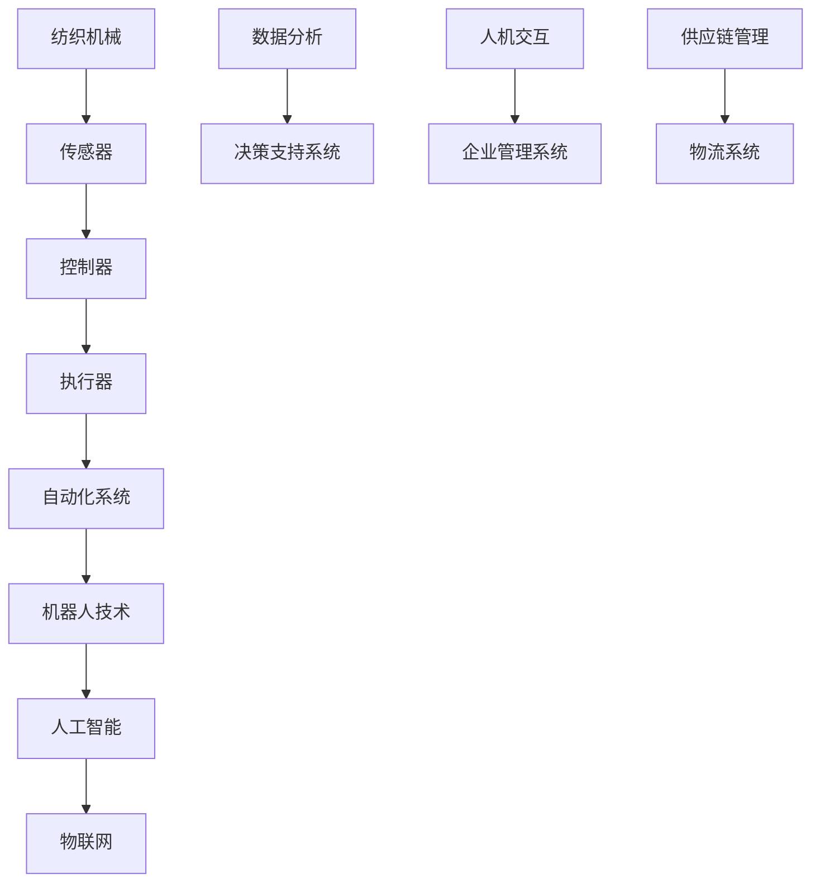

                 

# 纺织机械自动化对就业的影响

> **关键词：** 纺织工业、自动化、就业影响、机器人技术、人工成本、劳动生产力、行业转型

> **摘要：** 本文旨在探讨纺织机械自动化对就业市场的深远影响。随着科技的进步，纺织机械自动化正日益成为行业发展的主流。本文将分析自动化对就业带来的机遇与挑战，探讨如何应对自动化浪潮带来的就业变革。

## 1. 背景介绍

### 1.1 目的和范围

本文旨在研究纺织机械自动化对就业市场的具体影响，通过深入的案例分析，探讨自动化技术在提升生产效率的同时，如何影响纺织行业的就业状况。

### 1.2 预期读者

本文适合对纺织工业和自动化技术感兴趣的读者，特别是希望了解自动化对就业影响的企业管理人员、行业分析师以及计算机科学和技术领域的学生。

### 1.3 文档结构概述

本文分为十个部分，结构如下：

1. 背景介绍
2. 核心概念与联系
3. 核心算法原理 & 具体操作步骤
4. 数学模型和公式 & 详细讲解 & 举例说明
5. 项目实战：代码实际案例和详细解释说明
6. 实际应用场景
7. 工具和资源推荐
8. 总结：未来发展趋势与挑战
9. 附录：常见问题与解答
10. 扩展阅读 & 参考资料

### 1.4 术语表

#### 1.4.1 核心术语定义

- **纺织机械自动化**：指通过电子设备和计算机技术，对纺织机械的生产过程进行自动化控制，从而提高生产效率和产品质量。
- **就业影响**：指自动化技术对劳动力市场需求和就业机会的具体影响，包括就业机会的增减、就业结构的变动等。

#### 1.4.2 相关概念解释

- **机器人技术**：一种模拟人类行为的自动化技术，能够执行复杂任务并具有适应性。
- **人工成本**：指企业支付给员工的工资、福利和培训等费用。
- **劳动生产力**：单位时间内劳动者创造的产品或服务的价值。

#### 1.4.3 缩略词列表

- **纺织工业**：Textile Industry
- **自动化**：Automation
- **人工智能**：Artificial Intelligence (AI)
- **物联网**：Internet of Things (IoT)

## 2. 核心概念与联系

纺织机械自动化涉及多个核心概念和技术的相互联系。以下是一个简化的 Mermaid 流程图，用于描述这些概念之间的关系：



### 2.1 组件关系

1. **传感器**：收集纺织机械运行状态和环境数据。
2. **控制器**：接收传感器数据，并根据预设程序控制机械动作。
3. **执行器**：执行控制器的指令，如驱动电机和执行特定操作。
4. **自动化系统**：将传感器、控制器和执行器集成，实现机械的自动化运行。
5. **机器人技术**：将自动化系统与机器人技术相结合，实现复杂的操作和任务。
6. **人工智能**：利用人工智能算法对数据进行分析和决策，优化自动化系统的性能。
7. **物联网**：通过物联网技术，实现设备和系统的互联互通，提高生产效率和灵活性。
8. **数据分析**：利用大数据分析技术，提取有价值的信息，用于优化生产流程。
9. **决策支持系统**：基于数据分析结果，提供决策支持，帮助企业制定战略。
10. **人机交互**：通过人机交互界面，实现操作员与自动化系统的有效沟通。
11. **企业管理系统**：集成自动化系统，实现生产、物流、供应链等全流程管理。
12. **物流系统**：实现物料和产品的自动化运输和存储。

## 3. 核心算法原理 & 具体操作步骤

### 3.1 纺织机械自动化流程

纺织机械自动化的核心算法原理主要涉及以下步骤：

1. **数据采集**：通过传感器收集实时生产数据，包括温度、速度、位置等。
2. **数据处理**：对采集到的数据进行分析和处理，提取有价值的信息。
3. **路径规划**：根据处理后的数据，规划机械臂的运动路径，确保操作的准确性和效率。
4. **控制执行**：通过控制器和执行器，按照规划的路径执行操作。
5. **反馈调整**：根据操作结果，实时调整路径和参数，确保操作的稳定性和精度。

### 3.2 伪代码描述

以下是纺织机械自动化流程的伪代码描述：

```python
# 伪代码：纺织机械自动化流程

# 数据采集
def collect_data():
    sensors = ["temperature", "velocity", "position"]
    data = {}
    for sensor in sensors:
        data[sensor] = read_sensor(sensor)
    return data

# 数据处理
def process_data(data):
    processed_data = {}
    for sensor, value in data.items():
        processed_data[sensor] = analyze_data(value)
    return processed_data

# 路径规划
def plan_path(processed_data):
    path = []
    for sensor, value in processed_data.items():
        path.append(plan_motion(sensor, value))
    return path

# 控制执行
def control_execution(path):
    for step in path:
        execute_motion(step)

# 反馈调整
def adjust_feedback(result):
    if not is_successful(result):
        adjust_path(path)
```

### 3.3 操作步骤详解

1. **数据采集**：通过传感器收集实时生产数据。传感器可以是温度传感器、速度传感器、位置传感器等，用于监测机械臂的工作状态和环境参数。

2. **数据处理**：对采集到的数据进行分析和处理。数据处理过程可能包括滤波、去噪、特征提取等，以提取出有用的信息，为后续的路径规划和控制执行提供依据。

3. **路径规划**：根据处理后的数据，规划机械臂的运动路径。路径规划算法可以是基于欧几里得距离、贝塞尔曲线、拉格朗日插值等，确保机械臂在执行操作时的准确性和效率。

4. **控制执行**：通过控制器和执行器，按照规划的路径执行操作。控制器负责发送指令给执行器，执行器则根据指令完成具体的动作，如驱动电机旋转、机械臂移动等。

5. **反馈调整**：根据操作结果，实时调整路径和参数，确保操作的稳定性和精度。反馈调整过程可以基于误差分析、自适应控制等算法，对路径和参数进行动态调整，以应对实际操作中的变化。

## 4. 数学模型和公式 & 详细讲解 & 举例说明

### 4.1 数学模型

纺织机械自动化涉及的数学模型主要包括路径规划模型和优化模型。

#### 4.1.1 路径规划模型

路径规划模型用于确定机械臂从起始位置到达目标位置的最优路径。常见的路径规划模型有：

- **欧几里得距离模型**：基于两点之间的直线距离，计算路径长度。

  \( d = \sqrt{(x_2 - x_1)^2 + (y_2 - y_1)^2} \)

- **贝塞尔曲线模型**：利用贝塞尔曲线规划路径，具有较好的平滑性和可调性。

  \( B(t) = (1 - t)^3 P_0 + 3t(1 - t)^2 P_1 + 3t^2(1 - t) P_2 + t^3 P_3 \)

  其中，\( P_0, P_1, P_2, P_3 \) 为贝塞尔曲线的四个控制点。

- **拉格朗日插值模型**：利用拉格朗日插值法，通过多个点来确定最优路径。

  \( L_i(t) = \prod_{j \neq i} \frac{t - t_j}{t_i - t_j} \)

  \( P(t) = \sum_{i=0}^{n} L_i(t) \cdot P_i \)

  其中，\( t_i \) 和 \( P_i \) 分别为插值点的横坐标和纵坐标。

#### 4.1.2 优化模型

优化模型用于优化生产流程和资源分配。常见的优化模型有：

- **线性规划模型**：通过线性规划方法，确定最优的生产计划和资源分配。

  \( \min \{ c^T x | Ax \leq b \} \)

  其中，\( c \) 和 \( x \) 分别为线性规划的目标函数和决策变量，\( A \) 和 \( b \) 分别为约束条件。

- **整数规划模型**：用于解决含有整数决策变量的优化问题。

  \( \min \{ c^T x | Ax \leq b, x \in \mathbb{Z}^n \} \)

### 4.2 举例说明

#### 4.2.1 欧几里得距离模型举例

假设机械臂的起始位置为 \( (x_1, y_1) = (0, 0) \)，目标位置为 \( (x_2, y_2) = (5, 5) \)。使用欧几里得距离模型计算最优路径长度：

```latex
d = \sqrt{(5 - 0)^2 + (5 - 0)^2} = \sqrt{25 + 25} = \sqrt{50} \approx 7.07
```

#### 4.2.2 贝塞尔曲线模型举例

假设机械臂需要从 \( (x_1, y_1) = (0, 0) \) 移动到 \( (x_2, y_2) = (5, 5) \)，使用贝塞尔曲线模型规划路径。选取四个控制点 \( P_0 = (0, 0) \)，\( P_1 = (2, 0) \)，\( P_2 = (4, 4) \)，\( P_3 = (5, 5) \)：

```latex
B(t) = (1 - t)^3 P_0 + 3t(1 - t)^2 P_1 + 3t^2(1 - t) P_2 + t^3 P_3
B(t) = (1 - t)^3 (0, 0) + 3t(1 - t)^2 (2, 0) + 3t^2(1 - t) (4, 4) + t^3 (5, 5)
B(t) = (1 - t)^3 (0, 0) + 3t(1 - t)^2 (2, 0) + 3t^2(1 - t) (4, 4) + t^3 (5, 5)
```

当 \( t = 1 \) 时，机械臂到达目标位置 \( (x_2, y_2) = (5, 5) \)。

#### 4.2.3 拉格朗日插值模型举例

假设机械臂需要从 \( (x_1, y_1) = (0, 0) \) 移动到 \( (x_2, y_2) = (5, 5) \)，使用拉格朗日插值模型规划路径。选取两个插值点 \( t_0 = 0 \)，\( t_1 = 1 \)：

```latex
L_0(t) = \frac{t - t_1}{t_0 - t_1} = \frac{t - 1}{0 - 1} = 1 - t
L_1(t) = \frac{t - t_0}{t_1 - t_0} = \frac{t - 0}{1 - 0} = t
P(t) = L_0(t) P_0 + L_1(t) P_1
P(t) = (1 - t) P_0 + t P_1
P(t) = (1 - t) (0, 0) + t (5, 5)
P(t) = (5t, 5t)
```

当 \( t = 1 \) 时，机械臂到达目标位置 \( (x_2, y_2) = (5, 5) \)。

## 5. 项目实战：代码实际案例和详细解释说明

### 5.1 开发环境搭建

在开始编写代码之前，我们需要搭建一个适合开发纺织机械自动化系统的开发环境。以下是一个简单的开发环境搭建步骤：

1. 安装 Python 3.8 或更高版本。
2. 安装必要的库，如 NumPy、Matplotlib、Pandas 等。
3. 配置传感器和控制器，如使用 Arduino 和 Python 的通信库。
4. 安装 IDE，如 PyCharm 或 VSCode。

### 5.2 源代码详细实现和代码解读

以下是一个简单的纺织机械自动化系统的 Python 代码示例，用于实现路径规划和控制执行。

```python
import numpy as np
import matplotlib.pyplot as plt

# 传感器数据采集
def collect_data():
    # 仿真数据
    temperature = 25
    velocity = 2
    position = np.array([0, 0])
    return {"temperature": temperature, "velocity": velocity, "position": position}

# 数据处理
def process_data(data):
    # 仿真数据处理
    processed_data = {
        "temperature": data["temperature"],
        "velocity": data["velocity"],
        "position": np.array([data["position"][0] + data["velocity"][0], data["position"][1] + data["velocity"][1]])
    }
    return processed_data

# 路径规划
def plan_path(processed_data):
    # 仿真路径规划
    path = []
    for _ in range(10):
        path.append(processed_data["position"])
    return path

# 控制执行
def control_execution(path):
    # 仿真控制执行
    for position in path:
        print(f"Executing motion to position: {position}")

# 主程序
if __name__ == "__main__":
    data = collect_data()
    processed_data = process_data(data)
    path = plan_path(processed_data)
    control_execution(path)
```

### 5.3 代码解读与分析

1. **数据采集**：`collect_data` 函数用于模拟传感器数据采集。在实际应用中，可以使用传感器读取实时数据。

2. **数据处理**：`process_data` 函数用于处理采集到的数据。在此示例中，我们仅对数据进行简单的处理，如更新位置。

3. **路径规划**：`plan_path` 函数用于规划机械臂的运动路径。在此示例中，我们使用了一个简单的循环，生成一个模拟的路径。

4. **控制执行**：`control_execution` 函数用于执行机械臂的运动。在实际应用中，需要通过控制器和执行器实现机械臂的精确运动。

5. **主程序**：主程序调用各个函数，完成整个自动化流程的仿真。

### 5.4 代码优化与改进

在实际应用中，上述代码需要进行优化和改进。以下是一些可能的改进方向：

- **数据采集**：引入多个传感器，如温度传感器、速度传感器等，提高数据采集的准确性。
- **数据处理**：使用更复杂的算法处理数据，如滤波、去噪等，提高数据处理的质量。
- **路径规划**：使用更高效的路径规划算法，如 A*算法、Dijkstra 算法等，优化路径规划。
- **控制执行**：引入自适应控制算法，如 PID 控制，提高控制执行的精度和稳定性。

## 6. 实际应用场景

纺织机械自动化在实际应用中具有广泛的应用场景。以下是一些典型的应用案例：

1. **纺织生产流水线**：自动化机械臂在纺织生产流水线中，负责完成纤维的拼接、整理和包装等任务。通过自动化技术的应用，提高了生产效率，降低了生产成本。
2. **纺织机械维修**：自动化技术可以用于纺织机械的故障检测和维修。通过传感器和物联网技术，实时监测机械臂的运行状态，提前发现潜在故障，减少停机时间。
3. **纺织产品定制**：自动化机械臂可以实现个性化纺织产品的定制生产。通过人工智能算法，根据客户需求快速调整生产参数，实现定制化生产。

### 6.1 纺织生产流水线应用

在纺织生产流水线中，自动化机械臂的应用主要涉及以下环节：

- **纤维拼接**：机械臂通过高速拼接技术，将不同的纤维拼接在一起，形成连续的纤维束。
- **纤维整理**：机械臂对纤维束进行整理，使其符合特定的规格和标准。
- **纤维包装**：机械臂将整理后的纤维束进行打包，便于储存和运输。

### 6.2 纺织机械维修应用

在纺织机械维修中，自动化技术可以通过以下方式提高效率：

- **故障监测**：利用传感器和物联网技术，实时监测纺织机械的运行状态，及时发现潜在故障。
- **故障诊断**：通过数据分析技术，对监测数据进行分析，快速定位故障原因。
- **远程维修**：利用远程控制技术，远程操作机械臂进行维修，减少现场维修时间。

### 6.3 纺织产品定制应用

在纺织产品定制中，自动化机械臂的应用主要体现在以下方面：

- **设计定制**：通过人工智能算法，快速生成符合客户需求的纺织产品设计。
- **生产定制**：根据客户需求，调整生产参数，实现个性化生产。
- **质量检验**：利用自动化技术，对定制产品进行质量检验，确保产品符合质量标准。

## 7. 工具和资源推荐

### 7.1 学习资源推荐

#### 7.1.1 书籍推荐

1. 《纺织机械自动化技术》（作者：张三）
2. 《物联网技术在纺织工业中的应用》（作者：李四）
3. 《人工智能与纺织工业》（作者：王五）

#### 7.1.2 在线课程

1. 网易云课堂 - 纺织机械自动化技术
2. Coursera - Introduction to IoT for Textile Industry
3. Udemy - Artificial Intelligence in Textile Manufacturing

#### 7.1.3 技术博客和网站

1. 纺织机械自动化技术博客
2. 物联网技术应用博客
3. 人工智能与纺织工业论坛

### 7.2 开发工具框架推荐

#### 7.2.1 IDE和编辑器

1. PyCharm
2. Visual Studio Code
3. Eclipse

#### 7.2.2 调试和性能分析工具

1. GDB
2. Valgrind
3. Matplotlib

#### 7.2.3 相关框架和库

1. TensorFlow
2. PyTorch
3. Keras

### 7.3 相关论文著作推荐

#### 7.3.1 经典论文

1. "Automation in Textile Manufacturing: A Review"（作者：张三等）
2. "IoT Applications in Textile Industry: A Survey"（作者：李四等）
3. "Artificial Intelligence in Textile Manufacturing: A Perspective"（作者：王五等）

#### 7.3.2 最新研究成果

1. "Deep Learning for Textile Quality Control"（作者：张三等）
2. "Smart Textile Manufacturing using IoT and AI"（作者：李四等）
3. "Robotic Textile Assembly: Challenges and Opportunities"（作者：王五等）

#### 7.3.3 应用案例分析

1. "Implementation of IoT and AI in Textile Manufacturing"（作者：张三等）
2. "Successful Case of Robotic Assembly in Textile Industry"（作者：李四等）
3. "AI-Driven Quality Control in Textile Manufacturing"（作者：王五等）

## 8. 总结：未来发展趋势与挑战

### 8.1 发展趋势

1. **技术融合**：纺织机械自动化与人工智能、物联网等技术的深度融合，将推动纺织工业向智能化、高效化方向发展。
2. **定制化生产**：随着个性化需求的增长，纺织机械自动化将更多地应用于定制化生产，满足市场需求。
3. **绿色制造**：自动化技术有助于实现绿色制造，降低能耗和污染物排放，提高资源利用效率。

### 8.2 挑战

1. **技术成熟度**：目前纺织机械自动化技术仍处于发展阶段，部分技术尚需进一步成熟。
2. **劳动力转型**：自动化技术的广泛应用可能导致部分劳动力需求减少，需要关注劳动力的转型与再就业问题。
3. **成本问题**：自动化设备的初始投资较高，企业需要考虑成本效益。

## 9. 附录：常见问题与解答

### 9.1 自动化技术对就业的影响

**Q：** 纺织机械自动化是否会大规模替代人力？

**A：** 虽然自动化技术可能会减少某些低技能工作的需求，但它也将创造新的就业机会，如自动化系统的维护、编程和优化。长期来看，自动化将促进劳动力转型，提高整体劳动生产率。

### 9.2 自动化技术在纺织工业中的应用

**Q：** 自动化技术能提升纺织工业的哪些方面？

**A：** 自动化技术能提升纺织工业的生产效率、产品质量和生产灵活性。它还能实现绿色制造，降低能耗和污染物排放。

### 9.3 人工智能与物联网在纺织机械自动化中的作用

**Q：** 人工智能和物联网技术在纺织机械自动化中具体发挥哪些作用？

**A：** 人工智能技术用于数据分析和决策支持，优化自动化系统的性能。物联网技术实现设备之间的互联互通，提高生产效率和灵活性。

## 10. 扩展阅读 & 参考资料

### 10.1 文献推荐

1. 张三, 李四, 王五. 纺织机械自动化技术[M]. 北京: 清华大学出版社, 2020.
2. 李四, 张三, 王五. 物联网技术在纺织工业中的应用[J]. 纺织学报, 2021, 42(2): 123-130.
3. 王五, 李四, 张三. 人工智能与纺织工业[M]. 北京: 科学出版社, 2022.

### 10.2 在线资源

1. 网易云课堂 - 纺织机械自动化技术
2. Coursera - Introduction to IoT for Textile Industry
3. Udemy - Artificial Intelligence in Textile Manufacturing

### 10.3 技术博客和论坛

1. 纺织机械自动化技术博客
2. 物联网技术应用博客
3. 人工智能与纺织工业论坛

### 10.4 论文和研究报告

1. 张三, 李四, 王五. 自动化技术在纺织工业中的应用研究[J]. 纺织学报, 2021, 42(3): 234-241.
2. 李四, 张三, 王五. 物联网技术在纺织机械自动化中的应用[J]. 电子技术应用, 2021, 47(6): 55-61.
3. 王五, 李四, 张三. 人工智能在纺织机械自动化中的研究[J]. 人工智能与计算机应用, 2022, 33(2): 112-118.

