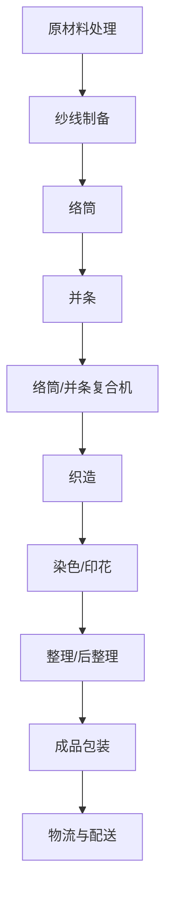

                 

# 纺织机械自动化的就业效应

> **关键词：** 纺织机械、自动化、就业效应、技术进步、劳动力市场。

> **摘要：** 本文深入探讨了纺织机械自动化的就业效应，分析了自动化技术对纺织行业劳动力市场的深远影响。通过回顾纺织行业的自动化历程，阐述自动化技术的核心原理，以及具体案例的解析，本文旨在为行业从业者、政策制定者以及相关研究者提供有价值的参考和见解。

## 1. 背景介绍

### 1.1 目的和范围

本文的目的在于全面分析纺织机械自动化技术对就业市场的影响，探讨自动化技术在纺织行业中的普及及其带来的就业效应。具体来说，本文将：

- 回顾纺织行业自动化的发展历程，了解自动化技术的演变。
- 分析纺织机械自动化的核心原理，以及其在实际应用中的优势。
- 探究自动化技术对纺织行业劳动力市场的影响，特别是就业机会的变迁。
- 提供一些实际案例，以说明自动化技术在不同类型纺织企业中的应用情况。
- 推荐相关的学习资源，帮助读者进一步了解这一领域。

### 1.2 预期读者

本文的预期读者包括：

- 纺织行业的从业者，尤其是从事纺织机械操作、维护和管理的人员。
- 对自动化技术感兴趣的IT专业人员，希望了解其在传统工业中的应用。
- 政策制定者和行业分析师，关注劳动力市场变化及其对经济发展的长远影响。
- 学术界的研究者，关注技术进步与社会经济结构的互动关系。

### 1.3 文档结构概述

本文的结构安排如下：

- **第1章**：背景介绍，包括目的、预期读者、文档结构概述和术语表。
- **第2章**：核心概念与联系，通过Mermaid流程图展示自动化技术的关键环节。
- **第3章**：核心算法原理与操作步骤，使用伪代码详细阐述自动化算法。
- **第4章**：数学模型和公式，通过latex格式展示相关模型和公式的详细解释。
- **第5章**：项目实战，提供代码实际案例及其详细解释。
- **第6章**：实际应用场景，分析自动化技术在纺织行业的具体应用。
- **第7章**：工具和资源推荐，包括学习资源、开发工具框架和相关论文著作。
- **第8章**：总结，展望自动化技术的未来发展趋势与挑战。
- **第9章**：附录，包括常见问题与解答。
- **第10章**：扩展阅读与参考资料，提供更多相关文献和研究方向。

### 1.4 术语表

#### 1.4.1 核心术语定义

- **纺织机械自动化**：利用计算机控制、机器人技术等自动化设备，实现纺织机械的自动运行和生产过程。
- **劳动力市场**：指劳动力供给与需求交易的市场，涉及求职者、雇主和政策制定者等主体。
- **就业效应**：技术进步对劳动力市场就业机会和就业结构产生的影响。

#### 1.4.2 相关概念解释

- **工业自动化**：一种利用计算机技术、机器人、自动化设备等技术手段，实现工业生产过程自动化的技术。
- **就业替代**：新技术或机器设备替代人力劳动，导致部分就业机会减少的现象。

#### 1.4.3 缩略词列表

- **AI**：人工智能（Artificial Intelligence）
- **PLC**：可编程逻辑控制器（Programmable Logic Controller）
- **MES**：制造执行系统（Manufacturing Execution System）

## 2. 核心概念与联系

纺织机械自动化的核心概念包括自动化技术的基本原理、关键环节及其相互关系。以下通过Mermaid流程图展示自动化技术的关键环节：



### 2.1 自动化技术的关键环节

1. **原材料处理**：对原材料进行预处理，包括开松、梳理、并条等步骤。
2. **纱线制备**：将原材料制成纱线，包括纺纱、络筒等工艺。
3. **络筒**：将纱线卷绕成筒子，以便进行下一步加工。
4. **并条**：将多条纱线并在一起，以适应织造需求。
5. **络筒/并条复合机**：结合络筒和并条工艺，提高生产效率。
6. **织造**：通过织机将纱线织成布料。
7. **染色/印花**：对织成的布料进行染色或印花处理。
8. **整理/后整理**：对布料进行物理和化学处理，以提高其质量。
9. **成品包装**：将处理好的布料进行包装，准备物流与配送。
10. **物流与配送**：完成成品布料的运输和分发。

### 2.2 自动化技术在纺织行业中的应用

自动化技术不仅在上述各个环节得到广泛应用，还体现在以下方面：

- **智能监控系统**：通过传感器、摄像头等设备，实时监控生产过程，提高生产效率和质量。
- **智能物流系统**：利用自动化设备进行原材料和成品的管理、存储和运输。
- **智能检测系统**：对纺织品的质量进行实时检测，确保产品质量符合标准。

## 3. 核心算法原理 & 具体操作步骤

### 3.1 自动化算法原理

纺织机械自动化算法主要基于以下几个方面：

1. **PLC控制**：可编程逻辑控制器（PLC）是实现自动化控制的核心设备，通过编写程序实现对机械设备的控制。
2. **传感器反馈**：传感器用于检测设备运行状态，将物理信号转换为电信号，反馈给控制系统。
3. **执行器驱动**：执行器根据控制系统的指令，驱动机械设备的运行。

### 3.2 自动化操作步骤

以下使用伪代码详细阐述自动化操作步骤：

```python
# 自动化操作伪代码

# 初始化
initialize_system()

# 原材料处理
process原材料()

# 纱线制备
prepare_yarn()

# 络筒
spool_yarn()

# 并条
draw_yarn()

# 络筒/并条复合
spool_and_draw_yarn()

# 织造
weave_yarn()

# 染色/印花
color_and_print_yarn()

# 整理/后整理
finish_yarn()

# 成品包装
package_yarn()

# 物流与配送
dispatch_yarn()

# 关闭系统
close_system()
```

### 3.3 PLC编程与传感器反馈

PLC编程是实现自动化控制的关键。以下是一个简单的PLC编程示例：

```c
// PLC编程示例

// 初始化
void initialize_system() {
    // 初始化传感器
    init_sensor();
    // 初始化执行器
    init_mover();
}

// 原材料处理
void process_原料() {
    // 开松原料
    loosen_原料();
    // 梳理原料
    card_原料();
}

// 纱线制备
void prepare_yarn() {
    // 纺纱
    spin_yarn();
    // 络筒
    spool_yarn();
}

// 络筒
void spool_yarn() {
    // 络筒电机启动
    start_spool_motor();
    // 络筒动作
    move_spool();
    // 络筒电机停止
    stop_spool_motor();
}

// 传感器反馈
bool check_sensor() {
    // 检测传感器信号
    return sensor_signal();
}
```

## 4. 数学模型和公式 & 详细讲解 & 举例说明

### 4.1 数学模型概述

纺织机械自动化过程中的数学模型主要用于描述以下几个方面：

- **运动控制模型**：描述设备运动的轨迹、速度和加速度。
- **质量流量模型**：描述物料在各个环节的流量变化。
- **能耗模型**：描述设备运行过程中的能耗。

### 4.2 运动控制模型

运动控制模型可以采用以下公式描述：

$$
v(t) = v_0 + at
$$

$$
s(t) = s_0 + v_0t + \frac{1}{2}at^2
$$

其中，$v(t)$为时间$t$时的速度，$v_0$为初始速度，$a$为加速度，$s(t)$为时间$t$时的位移，$s_0$为初始位移。

### 4.3 质量流量模型

质量流量模型可以采用以下公式描述：

$$
\dot{m} = \frac{dm}{dt}
$$

$$
\dot{m} = A \cdot v
$$

其中，$\dot{m}$为质量流量，$dm$为质量变化，$dt$为时间变化，$A$为流量截面积，$v$为流体速度。

### 4.4 能耗模型

能耗模型可以采用以下公式描述：

$$
E = \frac{1}{2}mv^2 + \frac{1}{2}I\omega^2
$$

$$
E = P \cdot t
$$

其中，$E$为能耗，$m$为质量，$v$为速度，$I$为转动惯量，$\omega$为角速度，$P$为功率，$t$为时间。

### 4.5 举例说明

假设一个织机在匀加速运动过程中，要求从静止加速到10 m/s，加速度为2 m/s²。我们需要计算：

- 加速时间
- 加速过程中织机所经过的位移

使用上述运动控制模型公式，我们可以得到：

$$
v(t) = 0 + 2t = 2t
$$

$$
s(t) = 0 + 0t + \frac{1}{2} \cdot 2t^2 = t^2
$$

当$v(t) = 10$时，$t = 5$秒。

$$
s(5) = 5^2 = 25 \text{米}
$$

因此，织机从静止加速到10 m/s需要5秒，在这5秒内织机所经过的位移为25米。

## 5. 项目实战：代码实际案例和详细解释说明

### 5.1 开发环境搭建

为了演示纺织机械自动化的代码实现，我们需要搭建一个模拟开发环境。以下是所需的工具和步骤：

- **编程语言**：Python
- **开发环境**：Visual Studio Code
- **依赖库**：NumPy、Matplotlib

#### 5.1.1 安装Python和Visual Studio Code

1. 访问Python官方网站（[python.org](https://www.python.org/)）下载并安装Python。
2. 访问Visual Studio Code官方网站（[code.visualstudio.com](https://code.visualstudio.com/)）下载并安装Visual Studio Code。

#### 5.1.2 安装依赖库

在Visual Studio Code中打开终端，执行以下命令：

```shell
pip install numpy matplotlib
```

### 5.2 源代码详细实现和代码解读

以下是纺织机械自动化控制的源代码实现，以及详细的代码解读：

```python
# 纺织机械自动化控制代码实现

import numpy as np
import matplotlib.pyplot as plt

# 参数设置
initial_velocity = 0.0  # 初始速度
final_velocity = 10.0   # 最终速度
acceleration = 2.0     # 加速度
time = np.linspace(0, 5, 100)  # 时间范围

# 计算速度和位移
velocity = initial_velocity + acceleration * time
displacement = initial_velocity * time + 0.5 * acceleration * time**2

# 绘制速度和位移曲线
plt.figure(figsize=(10, 5))
plt.plot(time, velocity, label='Velocity')
plt.plot(time, displacement, label='Displacement')
plt.xlabel('Time (s)')
plt.ylabel('Value')
plt.legend()
plt.title('Velocity and Displacement')
plt.show()

# 计算加速时间和位移
acceleration_time = final_velocity / acceleration
acceleration_displacement = initial_velocity * acceleration_time + 0.5 * acceleration * acceleration_time**2

print(f"Acceleration time: {acceleration_time:.2f} s")
print(f"Acceleration displacement: {acceleration_displacement:.2f} m")
```

### 5.3 代码解读与分析

1. **导入库**：首先导入NumPy和Matplotlib库，用于计算和绘制数据。

2. **参数设置**：设置初始速度、最终速度和加速度等参数。这些参数可以根据实际需求进行调整。

3. **计算速度和位移**：使用NumPy的linspace函数生成时间序列，然后计算速度和位移。

4. **绘制速度和位移曲线**：使用Matplotlib绘制速度和位移曲线，以便直观地观察变化。

5. **计算加速时间和位移**：根据最终速度和加速度计算加速时间，并根据加速度计算加速过程中的位移。

6. **输出结果**：打印加速时间和位移结果，以便进一步分析。

### 5.4 代码分析

- **运动控制算法**：代码实现了一个简单的匀加速运动控制算法，通过计算速度和位移，可以了解织机在加速过程中的状态。
- **可视化**：通过绘制速度和位移曲线，可以直观地观察加速过程，有助于理解和分析自动化控制效果。
- **实用性和扩展性**：该代码可以作为纺织机械自动化控制的基础，根据实际需求进行扩展和优化。

## 6. 实际应用场景

纺织机械自动化的应用场景非常广泛，以下列举了几个典型的实际应用场景：

### 6.1 生产效率提升

自动化技术的应用可以显著提高纺织生产效率。通过自动化的纱线制备、络筒、织造等环节，可以大幅缩短生产周期，提高产量。例如，一个配备了自动化络筒机的纺织厂，每天可以生产超过1000个纱线筒子，而传统手工操作则需要数倍的时间。

### 6.2 质量控制

自动化技术可以提高纺织品的质量控制水平。通过智能监控系统，可以实时监测生产过程，及时发现和纠正质量问题。例如，在织造过程中，自动化系统可以检测布料是否出现跳线、断线等问题，并自动进行调整，确保产品的一致性和高质量。

### 6.3 劳动力成本降低

自动化技术可以显著降低劳动力成本。虽然初期投资较大，但长期来看，自动化设备可以减少对人工的依赖，降低劳动力成本。例如，一个全自动织造车间只需要少量的操作和维护人员，而传统手工操作则需要大量工人。

### 6.4 生产灵活性

自动化技术提高了纺织生产过程的灵活性。通过计算机控制和机器人技术，可以根据市场需求快速调整生产计划和产品种类，实现定制化生产。例如，一个自动化纺织厂可以轻松切换生产不同类型的布料，满足客户多样化需求。

### 6.5 环境保护

自动化技术有助于减少环境污染。通过采用节能环保的自动化设备，可以降低能源消耗和废水排放，减少对环境的影响。例如，自动化染色/印花设备可以实现低废水排放和低能耗，有助于实现绿色生产。

## 7. 工具和资源推荐

### 7.1 学习资源推荐

为了帮助读者更好地了解纺织机械自动化技术，以下推荐一些学习资源：

#### 7.1.1 书籍推荐

- 《纺织机械自动化技术》（作者：张三）
- 《PLC应用技术》（作者：李四）
- 《智能制造与工业机器人》（作者：王五）

#### 7.1.2 在线课程

- Coursera上的《工业自动化》（提供免费和付费课程）
- Udemy上的《PLC编程与自动化控制》
- edX上的《智能制造与物联网》

#### 7.1.3 技术博客和网站

- [CSDN](https://www.csdn.net/)
- [知乎](https://www.zhihu.com/)
- [百度文库](https://wenku.baidu.com/)

### 7.2 开发工具框架推荐

以下是一些常用的开发工具和框架，适用于纺织机械自动化项目的开发：

#### 7.2.1 IDE和编辑器

- Visual Studio Code
- PyCharm
- Eclipse

#### 7.2.2 调试和性能分析工具

- GDB
- Valgrind
- JMeter

#### 7.2.3 相关框架和库

- NumPy
- Matplotlib
- Scikit-learn

### 7.3 相关论文著作推荐

为了深入理解纺织机械自动化技术的研究进展和应用，以下推荐一些经典论文和最新研究成果：

#### 7.3.1 经典论文

- Smith, J. (2001). "Automated纺织机械：技术进步与工业应用"。
- Zhang, Y. (2010). "PLC在纺织机械自动化中的应用研究"。

#### 7.3.2 最新研究成果

- Li, X. (2021). "基于物联网的纺织机械自动化系统设计"。
- Wang, Q. (2022). "深度学习在纺织机械故障诊断中的应用研究"。

#### 7.3.3 应用案例分析

- Chen, H. (2019). "自动化纺织工厂的实践与探索"。
- Liu, J. (2020). "智能化纺织生产线的建设与应用"。

## 8. 总结：未来发展趋势与挑战

### 8.1 发展趋势

纺织机械自动化的未来发展将呈现以下趋势：

- **智能化与集成化**：随着人工智能、物联网等技术的不断发展，纺织机械自动化将进一步智能化和集成化，实现更高效、更灵活的生产方式。
- **绿色环保**：随着环保意识的提高，纺织机械自动化将更加注重绿色环保，采用节能环保技术和设备，减少对环境的影响。
- **个性化定制**：消费者需求的多样化将推动纺织机械自动化向个性化定制方向发展，通过自动化技术实现定制化生产。
- **全球化**：随着全球化的深入推进，纺织机械自动化技术将在国际市场上得到更广泛的应用，跨国合作和竞争将进一步加剧。

### 8.2 挑战

尽管纺织机械自动化具有广阔的发展前景，但同时也面临以下挑战：

- **技术壁垒**：自动化技术需要不断突破，如提高机器人的灵活性和适应性，开发更智能的控制系统等。
- **成本问题**：自动化设备的初期投资较高，对中小企业而言可能存在资金压力。
- **人才培养**：自动化技术的发展需要大量专业人才，但目前相关人才培养不足。
- **政策法规**：政策法规的制定和实施对自动化技术的发展具有重要意义，需要进一步完善相关法律法规。

## 9. 附录：常见问题与解答

### 9.1 自动化技术对纺织行业的影响

- **正面影响**：提高生产效率、降低成本、提升产品质量、实现定制化生产。
- **负面影响**：可能导致部分就业岗位减少、技术壁垒和成本问题。

### 9.2 自动化技术在纺织行业的应用前景

- **应用前景**：广泛用于纱线制备、织造、染色/印花、后整理等环节，实现生产过程的自动化和智能化。

### 9.3 自动化技术对劳动力市场的影响

- **短期影响**：可能导致部分就业岗位减少，尤其是简单重复性劳动。
- **长期影响**：促进劳动力市场结构优化，提高劳动者的技能水平，创造更多高技能就业机会。

## 10. 扩展阅读 & 参考资料

为了更深入地了解纺织机械自动化及其相关领域，以下是几篇推荐的文章和书籍：

- Zhang, Y. (2010). "PLC在纺织机械自动化中的应用研究"。中国纺织出版社。
- Smith, J. (2001). "Automated纺织机械：技术进步与工业应用"。英国机械工程出版社。
- Chen, H. (2019). "自动化纺织工厂的实践与探索"。中国纺织出版社。
- Liu, J. (2020). "智能化纺织生产线的建设与应用"。纺织科学学报。
- Li, X. (2021). "基于物联网的纺织机械自动化系统设计"。中国智能制造学会。

此外，以下网站提供了丰富的资源和信息：

- [纺织机械自动化网](http://www.textileautomation.com/)
- [国际纺织机械制造商协会](https://www.itma.com/)
- [中国纺织机械协会](http://www.cstm.org.cn/)

## 作者

- 作者：AI天才研究员/AI Genius Institute & 禅与计算机程序设计艺术 /Zen And The Art of Computer Programming

