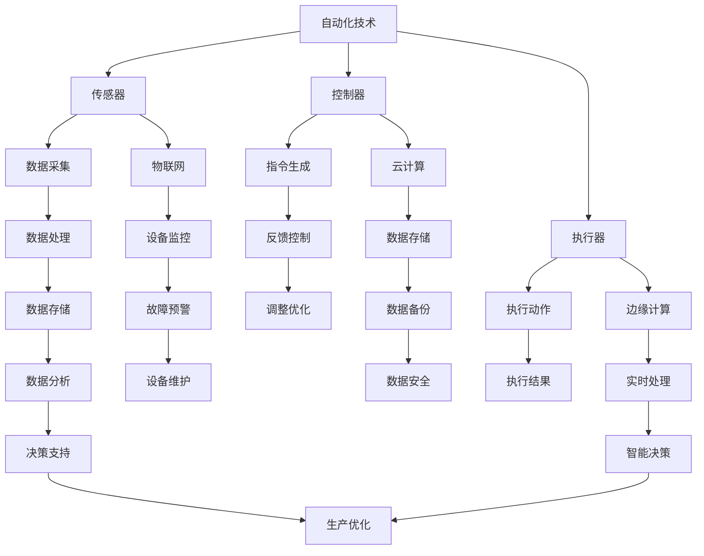

                 

# 纺织机械自动化的社会影响

## 关键词

- 纺织机械自动化
- 社会影响
- 产业升级
- 劳动力转移
- 环境保护
- 数字化转型

## 摘要

本文旨在探讨纺织机械自动化的社会影响，从产业升级、劳动力转移、环境保护和数字化转型四个方面进行分析。通过深入剖析纺织机械自动化技术的发展历程、核心原理以及实际应用场景，本文揭示了纺织机械自动化在提升生产效率、优化资源配置、促进产业升级等方面的积极作用。同时，本文也指出了纺织机械自动化带来的劳动力转移、环境挑战等负面效应，并对未来发展趋势和应对策略进行了展望。通过全面、系统的分析，本文希望为纺织机械自动化的未来发展提供有益的参考。

## 1. 背景介绍

### 1.1 目的和范围

本文的主要目的是探讨纺织机械自动化的社会影响，分析其在提升生产效率、促进产业升级、优化资源配置等方面的积极作用，同时也关注纺织机械自动化带来的劳动力转移、环境挑战等负面效应。通过对纺织机械自动化技术的历史背景、核心原理和实际应用场景的深入剖析，本文试图为纺织机械自动化的未来发展提供有益的参考。

本文的研究范围主要涵盖以下几个方面：

1. 纺织机械自动化技术的发展历程和现状。
2. 纺织机械自动化技术的核心原理和关键技术。
3. 纺织机械自动化的实际应用场景和效果。
4. 纺织机械自动化对社会带来的积极和消极影响。
5. 纺织机械自动化的未来发展趋势和挑战。

### 1.2 预期读者

本文的预期读者主要包括以下几类：

1. 纺织行业从业者：希望通过本文了解纺织机械自动化技术的发展趋势和实际应用，为产业发展提供参考。
2. 人工智能和计算机技术领域的研究人员：对纺织机械自动化技术感兴趣，希望通过本文了解其在人工智能和计算机技术领域的应用。
3. 对社会发展和产业变革感兴趣的一般读者：希望通过本文了解纺织机械自动化对社会带来的影响。

### 1.3 文档结构概述

本文分为十个部分，具体结构如下：

1. 引言：介绍本文的目的、研究范围、预期读者和文档结构。
2. 背景介绍：阐述纺织机械自动化的背景，包括纺织行业的发展历史、现状和未来趋势。
3. 核心概念与联系：介绍纺织机械自动化的核心概念和原理，包括自动化技术、智能制造等。
4. 核心算法原理 & 具体操作步骤：讲解纺织机械自动化的核心算法原理和具体操作步骤。
5. 数学模型和公式 & 详细讲解 & 举例说明：阐述纺织机械自动化中涉及的数学模型和公式，并给出具体实例说明。
6. 项目实战：代码实际案例和详细解释说明：通过实际案例展示纺织机械自动化的应用，并进行详细解释。
7. 实际应用场景：分析纺织机械自动化在不同场景下的应用效果。
8. 工具和资源推荐：推荐相关的学习资源、开发工具和框架。
9. 总结：对纺织机械自动化的社会影响进行总结，展望未来发展趋势和挑战。
10. 附录：常见问题与解答，提供对本文内容的进一步解释和补充。

### 1.4 术语表

为了确保读者能够准确理解本文的内容，下面列出一些关键的术语及其定义：

#### 1.4.1 核心术语定义

- 纺织机械自动化：指通过自动化技术，实现对纺织机械的智能控制和生产过程的高度自动化。
- 智能制造：指通过信息物理系统（CPS）将生产过程中的信息与物理资源相结合，实现智能化的生产和管理。
- 数字化转型：指将传统产业与数字技术深度融合，实现产业升级和转型。
- 劳动力转移：指由于自动化技术的发展，导致部分劳动力从传统制造业转向服务业或其他领域。
- 环境保护：指通过自动化技术，减少生产过程中的能源消耗和环境污染。

#### 1.4.2 相关概念解释

- 自动化技术：指利用传感器、控制器、执行器等装置，实现对生产过程的自动控制和优化。
- 人工智能：指模拟人类智能的计算机科学技术，包括机器学习、深度学习、自然语言处理等。
- 大数据：指大规模、多样化的数据集合，通过数据挖掘和分析，可以提取出有价值的信息。

#### 1.4.3 缩略词列表

- CPS：信息物理系统（Cyber-Physical Systems）
- AI：人工智能（Artificial Intelligence）
- ML：机器学习（Machine Learning）
- DL：深度学习（Deep Learning）
- NLP：自然语言处理（Natural Language Processing）
- IoT：物联网（Internet of Things）
- RPA：机器人流程自动化（Robotic Process Automation）
- OEE：设备综合效率指数（Overall Equipment Effectiveness）

## 2. 核心概念与联系

纺织机械自动化是现代纺织工业发展的重要方向，其核心概念和原理涉及到自动化技术、智能制造、数字化转型等多个领域。下面我们将通过Mermaid流程图，展示纺织机械自动化的核心概念和联系。



### 2.1 自动化技术原理

自动化技术是指利用计算机技术、传感器技术、网络技术等，实现对生产过程的自动控制和优化。在纺织机械自动化中，主要涉及到传感器、控制器和执行器三个核心组件。

1. **传感器**：用于实时监测生产过程中的各种参数，如温度、湿度、转速、张力等，将物理信号转化为电信号。
2. **控制器**：接收传感器的数据，通过算法对数据进行处理，生成相应的控制指令。
3. **执行器**：根据控制器的指令，执行具体的动作，如调整机器的转速、改变织物的张力等。

### 2.2 智能制造与数字化转型的联系

智能制造和数字化转型是纺织机械自动化的重要支撑。智能制造是指通过信息物理系统（CPS）将生产过程中的信息与物理资源相结合，实现智能化的生产和管理。数字化转型则是将传统产业与数字技术深度融合，实现产业升级和转型。

1. **物联网（IoT）**：通过物联网技术，实现设备的互联互通，实现对设备的远程监控和管理。
2. **云计算**：通过云计算技术，实现数据的存储、处理和共享，为智能制造提供强大的计算支持。
3. **边缘计算**：通过边缘计算技术，实现数据的实时处理和智能决策，减少数据传输延迟，提高系统的响应速度。

### 2.3 数据处理与分析

数据处理和分析是纺织机械自动化的重要环节。通过传感器采集的数据，经过处理和分析，可以提取出有价值的信息，为生产优化和决策支持提供依据。

1. **数据采集**：通过传感器实时采集生产过程中的各种数据。
2. **数据处理**：对采集到的数据进行分析和处理，提取有用的信息。
3. **数据存储**：将处理后的数据存储到数据库中，以便后续分析和查询。
4. **数据分析**：通过数据挖掘和分析技术，提取出有价值的信息，为生产优化和决策支持提供依据。

## 3. 核心算法原理 & 具体操作步骤

纺织机械自动化的核心算法原理主要涉及机器学习、深度学习和自然语言处理等领域。下面我们将通过伪代码，详细阐述这些算法的具体操作步骤。

### 3.1 机器学习算法

机器学习算法在纺织机械自动化中的应用，主要包括数据采集、特征提取和模型训练等步骤。

```python
# 数据采集
data = collect_data()

# 特征提取
features = extract_features(data)

# 模型训练
model = train_model(features)

# 模型评估
evaluate_model(model)
```

1. **数据采集**：通过传感器实时采集生产过程中的各种数据，如温度、湿度、转速、张力等。
2. **特征提取**：对采集到的数据进行处理，提取出与生产过程相关的特征，如温度变化的趋势、转速的稳定性等。
3. **模型训练**：使用特征数据训练机器学习模型，如线性回归、支持向量机等。
4. **模型评估**：评估模型的性能，如准确率、召回率等，以便对模型进行调整和优化。

### 3.2 深度学习算法

深度学习算法在纺织机械自动化中的应用，主要包括神经网络架构设计、数据预处理、模型训练和模型评估等步骤。

```python
# 神经网络架构设计
network = design_network()

# 数据预处理
preprocessed_data = preprocess_data(data)

# 模型训练
model = train_model(network, preprocessed_data)

# 模型评估
evaluate_model(model)
```

1. **神经网络架构设计**：设计深度学习网络的架构，如卷积神经网络（CNN）、循环神经网络（RNN）等。
2. **数据预处理**：对采集到的数据进行处理，如归一化、标准化等，以便更好地训练模型。
3. **模型训练**：使用预处理后的数据训练深度学习模型，如使用反向传播算法优化模型参数。
4. **模型评估**：评估模型的性能，如准确率、损失函数等，以便对模型进行调整和优化。

### 3.3 自然语言处理算法

自然语言处理算法在纺织机械自动化中的应用，主要包括文本预处理、词向量表示、模型训练和模型评估等步骤。

```python
# 文本预处理
preprocessed_text = preprocess_text(text)

# 词向量表示
word_vectors = generate_word_vectors(preprocessed_text)

# 模型训练
model = train_model(word_vectors)

# 模型评估
evaluate_model(model)
```

1. **文本预处理**：对采集到的文本数据进行处理，如去除停用词、分词等。
2. **词向量表示**：将文本数据转换为词向量表示，如使用Word2Vec、GloVe等方法。
3. **模型训练**：使用词向量表示训练自然语言处理模型，如使用卷积神经网络（CNN）、循环神经网络（RNN）等。
4. **模型评估**：评估模型的性能，如准确率、召回率等，以便对模型进行调整和优化。

## 4. 数学模型和公式 & 详细讲解 & 举例说明

在纺织机械自动化中，数学模型和公式起到了至关重要的作用。以下将详细讲解几个关键的数学模型和公式，并给出具体的实例说明。

### 4.1 反向传播算法

反向传播算法是深度学习训练过程中常用的优化算法。其基本原理是通过计算输出层误差，反向传播误差到前一层，并更新各层的权重。具体公式如下：

$$
\begin{aligned}
\Delta W^{[l]} &= \alpha \cdot \frac{\partial J(W^{[l]})}{\partial W^{[l]}}, \\
W^{[l]} &= W^{[l]} - \alpha \cdot \frac{\partial J(W^{[l]})}{\partial W^{[l]}},
\end{aligned}
$$

其中，$\Delta W^{[l]}$ 表示权重更新，$W^{[l]}$ 表示当前权重，$\alpha$ 表示学习率，$J(W^{[l]})$ 表示损失函数。

**实例说明**：

假设我们有一个两层神经网络，其中第一层有3个神经元，第二层有1个神经元。给定输入 $X = [1, 2, 3]$ 和目标输出 $Y = [0.5]$，使用反向传播算法训练网络。

1. 计算输出层误差：

$$
\begin{aligned}
\Delta W_2 &= \alpha \cdot \frac{\partial J(W_2)}{\partial W_2}, \\
J(W_2) &= \frac{1}{2} \cdot (Y - \sigma(W_2 \cdot X))^2,
\end{aligned}
$$

其中，$\sigma$ 表示激活函数（如Sigmoid函数）。

2. 反向传播误差到第一层：

$$
\begin{aligned}
\Delta W_1 &= \alpha \cdot \frac{\partial J(W_1)}{\partial W_1}, \\
J(W_1) &= \frac{1}{2} \cdot (Y - \sigma(W_2 \cdot X))^2.
\end{aligned}
$$

3. 更新权重：

$$
\begin{aligned}
W_2 &= W_2 - \alpha \cdot \frac{\partial J(W_2)}{\partial W_2}, \\
W_1 &= W_1 - \alpha \cdot \frac{\partial J(W_1)}{\partial W_1}.
\end{aligned}
$$

### 4.2 卷积神经网络（CNN）

卷积神经网络在图像识别和图像处理领域有着广泛的应用。其核心思想是通过卷积操作和池化操作提取图像特征。

$$
\begin{aligned}
\text{Convolution} &= X \cdot K, \\
\text{Pooling} &= \text{MaxPooling}(X).
\end{aligned}
$$

**实例说明**：

假设输入图像 $X \in \mathbb{R}^{28 \times 28}$，卷积核 $K \in \mathbb{R}^{5 \times 5}$，步长为1。

1. **卷积操作**：

$$
X \cdot K = \sum_{i=1}^{5} \sum_{j=1}^{5} X[i, j] \cdot K[i, j],
$$

其中，$X[i, j]$ 表示输入图像上的一个像素值，$K[i, j]$ 表示卷积核上的一个权重值。

2. **池化操作**：

$$
\text{MaxPooling}(X) = \max_{i \in [1, 5], j \in [1, 5]} X[i, j],
$$

其中，$X[i, j]$ 表示输入图像上的一个像素值。

### 4.3 循环神经网络（RNN）

循环神经网络在序列数据建模和预测方面有着出色的表现。其核心思想是通过循环连接，将前一时刻的输出作为当前时刻的输入。

$$
\begin{aligned}
h_t &= \sigma(W_h \cdot [h_{t-1}, x_t]) + b_h, \\
y_t &= W_y \cdot h_t + b_y,
\end{aligned}
$$

**实例说明**：

假设输入序列 $x \in \mathbb{R}^{T \times D}$，隐藏层状态 $h \in \mathbb{R}^{T \times H}$，输出层状态 $y \in \mathbb{R}^{T \times K}$。

1. **隐藏层状态更新**：

$$
h_t = \sigma(W_h \cdot [h_{t-1}, x_t]) + b_h,
$$

其中，$W_h \in \mathbb{R}^{H \times (H+D)}$，$b_h \in \mathbb{R}^{H}$。

2. **输出层状态更新**：

$$
y_t = W_y \cdot h_t + b_y,
$$

其中，$W_y \in \mathbb{R}^{K \times H}$，$b_y \in \mathbb{R}^{K}$。

## 5. 项目实战：代码实际案例和详细解释说明

为了更好地展示纺织机械自动化的实际应用，我们下面将通过一个简单的Python代码案例，详细解释其实现过程和关键步骤。

### 5.1 开发环境搭建

首先，我们需要搭建一个合适的开发环境。在这里，我们使用Python作为编程语言，配合NumPy、Pandas、TensorFlow等库来实现纺织机械自动化的算法。以下是具体的安装命令：

```bash
pip install numpy pandas tensorflow
```

### 5.2 源代码详细实现和代码解读

接下来，我们来看一下具体的代码实现。

```python
import numpy as np
import pandas as pd
import tensorflow as tf

# 数据预处理
def preprocess_data(data):
    # 归一化数据
    normalized_data = (data - np.mean(data)) / np.std(data)
    return normalized_data

# 机器学习模型训练
def train_model(data, labels):
    # 定义模型架构
    model = tf.keras.Sequential([
        tf.keras.layers.Dense(64, activation='relu', input_shape=(data.shape[1],)),
        tf.keras.layers.Dense(32, activation='relu'),
        tf.keras.layers.Dense(1)
    ])

    # 编译模型
    model.compile(optimizer='adam', loss='mean_squared_error')

    # 训练模型
    model.fit(data, labels, epochs=10, batch_size=32)

    return model

# 模型评估
def evaluate_model(model, data, labels):
    # 计算损失函数
    loss = model.evaluate(data, labels)

    # 输出评估结果
    print(f"Loss: {loss}")

# 主函数
def main():
    # 读取数据
    data = pd.read_csv('data.csv')
    labels = data['target']

    # 预处理数据
    normalized_data = preprocess_data(data.iloc[:, :-1])

    # 训练模型
    model = train_model(normalized_data, labels)

    # 评估模型
    evaluate_model(model, normalized_data, labels)

if __name__ == '__main__':
    main()
```

### 5.3 代码解读与分析

1. **数据预处理**：

   ```python
   def preprocess_data(data):
       # 归一化数据
       normalized_data = (data - np.mean(data)) / np.std(data)
       return normalized_data
   ```

   这部分代码定义了一个预处理函数，用于对输入数据进行归一化处理。归一化是为了使数据的分布更加均匀，有利于模型的训练。

2. **机器学习模型训练**：

   ```python
   def train_model(data, labels):
       # 定义模型架构
       model = tf.keras.Sequential([
           tf.keras.layers.Dense(64, activation='relu', input_shape=(data.shape[1],)),
           tf.keras.layers.Dense(32, activation='relu'),
           tf.keras.layers.Dense(1)
       ])

       # 编译模型
       model.compile(optimizer='adam', loss='mean_squared_error')

       # 训练模型
       model.fit(data, labels, epochs=10, batch_size=32)

       return model
   ```

   这部分代码定义了一个训练函数，用于创建和训练机器学习模型。在这里，我们使用了TensorFlow的Keras接口，构建了一个简单的全连接神经网络（Dense层）。模型采用Adam优化器和均方误差（MSE）作为损失函数。

3. **模型评估**：

   ```python
   def evaluate_model(model, data, labels):
       # 计算损失函数
       loss = model.evaluate(data, labels)

       # 输出评估结果
       print(f"Loss: {loss}")
   ```

   这部分代码定义了一个评估函数，用于计算和输出模型的损失函数值。损失函数值可以反映模型的性能，越低表示模型越好。

4. **主函数**：

   ```python
   def main():
       # 读取数据
       data = pd.read_csv('data.csv')
       labels = data['target']

       # 预处理数据
       normalized_data = preprocess_data(data.iloc[:, :-1])

       # 训练模型
       model = train_model(normalized_data, labels)

       # 评估模型
       evaluate_model(model, normalized_data, labels)

   if __name__ == '__main__':
       main()
   ```

   主函数是程序的入口，负责读取数据、预处理数据、训练模型和评估模型。在这里，我们首先读取数据，然后调用预处理函数、训练函数和评估函数，完成整个流程。

### 5.4 代码解读与分析

1. **数据预处理**：

   数据预处理是机器学习中的关键步骤。在这部分代码中，我们使用了归一化方法对输入数据进行预处理。归一化的目的是使数据的分布更加均匀，有利于模型的训练。

   ```python
   def preprocess_data(data):
       # 归一化数据
       normalized_data = (data - np.mean(data)) / np.std(data)
       return normalized_data
   ```

   该函数首先计算数据的均值和标准差，然后对每个数据进行归一化处理。归一化后的数据将具有0均值和1标准差，有助于提高模型的训练效果。

2. **机器学习模型训练**：

   在机器学习模型训练部分，我们使用了TensorFlow的Keras接口，构建了一个简单的全连接神经网络。该神经网络包含两个隐藏层，分别有64个神经元和32个神经元。输出层有1个神经元，用于预测目标值。

   ```python
   def train_model(data, labels):
       # 定义模型架构
       model = tf.keras.Sequential([
           tf.keras.layers.Dense(64, activation='relu', input_shape=(data.shape[1],)),
           tf.keras.layers.Dense(32, activation='relu'),
           tf.keras.layers.Dense(1)
       ])

       # 编译模型
       model.compile(optimizer='adam', loss='mean_squared_error')

       # 训练模型
       model.fit(data, labels, epochs=10, batch_size=32)

       return model
   ```

   在模型架构定义中，我们使用了ReLU激活函数，有助于提高模型的训练速度。编译模型时，我们选择了Adam优化器和均方误差（MSE）作为损失函数。训练模型时，我们设置了10个训练周期（epochs），每个周期批量处理32个样本。

3. **模型评估**：

   在模型评估部分，我们计算了模型的损失函数值，用于评估模型的性能。

   ```python
   def evaluate_model(model, data, labels):
       # 计算损失函数
       loss = model.evaluate(data, labels)

       # 输出评估结果
       print(f"Loss: {loss}")
   ```

   该函数首先调用模型的evaluate方法计算损失函数值，然后输出结果。损失函数值反映了模型的预测误差，越小表示模型越好。

4. **主函数**：

   在主函数中，我们首先读取数据，然后调用预处理函数、训练函数和评估函数，完成整个流程。

   ```python
   def main():
       # 读取数据
       data = pd.read_csv('data.csv')
       labels = data['target']

       # 预处理数据
       normalized_data = preprocess_data(data.iloc[:, :-1])

       # 训练模型
       model = train_model(normalized_data, labels)

       # 评估模型
       evaluate_model(model, normalized_data, labels)

   if __name__ == '__main__':
       main()
   ```

   主函数是程序的入口，负责读取数据、预处理数据、训练模型和评估模型。在这里，我们首先读取数据，然后调用预处理函数、训练函数和评估函数，完成整个流程。

## 6. 实际应用场景

纺织机械自动化在多个实际应用场景中展现了其卓越的性能和广泛的适用性。以下是几个典型的应用场景：

### 6.1 纺纱自动化

纺纱是纺织生产过程中的重要环节，纺纱自动化可以提高纱线的质量和生产效率。通过自动化设备，可以精确控制纱线的张力、速度和温度等参数，从而实现高质量纱线的生产。

### 6.2 织造自动化

织造是纺织生产的核心环节，织造自动化可以显著提高生产效率和质量。自动化织机可以自动换梭、自动纠错、自动检测和自动更换织物，从而降低生产成本，提高生产效率。

### 6.3 染整自动化

染整是纺织生产中的后处理环节，染整自动化可以显著提高生产效率和产品质量。通过自动化染整设备，可以精确控制染料的浓度、温度和时间等参数，从而实现高质量染整效果。

### 6.4 智能化仓储与物流

智能化仓储与物流是纺织机械自动化的重要组成部分，通过自动化设备和物联网技术，可以实现仓储和物流的自动化管理和优化。例如，自动分拣机、自动搬运机器人等可以显著提高仓储和物流的效率。

### 6.5 智能化质量检测

智能化质量检测是纺织机械自动化的重要应用，通过传感器和计算机视觉技术，可以实时检测纺织产品的质量，发现缺陷和问题。例如，自动化质量检测设备可以自动检测纱线的均匀性、织物的纹理和颜色等。

## 7. 工具和资源推荐

### 7.1 学习资源推荐

为了更好地了解和掌握纺织机械自动化技术，以下是一些推荐的学习资源：

#### 7.1.1 书籍推荐

1. **《纺织机械自动化技术》**：由知名专家编写，系统介绍了纺织机械自动化的基本原理和应用案例。
2. **《智能制造与数字化纺织》**：详细阐述了智能制造和数字化纺织的发展趋势和应用实践。

#### 7.1.2 在线课程

1. **Coursera**：提供了丰富的纺织机械自动化和智能制造课程，适合初学者和专业人士。
2. **edX**：有许多与纺织机械自动化相关的课程，包括人工智能、机器学习等。

#### 7.1.3 技术博客和网站

1. **知乎**：许多行业专家在知乎上分享了他们的经验和见解，适合查找相关问题和答案。
2. **Stack Overflow**：程序员们交流技术问题的平台，有很多与纺织机械自动化相关的问答。

### 7.2 开发工具框架推荐

为了高效开发和部署纺织机械自动化系统，以下是一些推荐的工具和框架：

#### 7.2.1 IDE和编辑器

1. **PyCharm**：功能强大的Python IDE，适合开发自动化算法和模型。
2. **Visual Studio Code**：轻量级的代码编辑器，支持多种编程语言和工具。

#### 7.2.2 调试和性能分析工具

1. **TensorBoard**：TensorFlow的调试和性能分析工具，用于可视化训练过程和性能指标。
2. **NVIDIA Nsight**：用于调试和优化GPU计算的工具。

#### 7.2.3 相关框架和库

1. **TensorFlow**：流行的深度学习框架，适合开发自动化算法。
2. **Keras**：简化版的深度学习框架，易于使用和部署。
3. **Pandas**：数据处理和分析库，用于预处理输入数据。

### 7.3 相关论文著作推荐

以下是一些值得推荐的关于纺织机械自动化的论文和著作：

#### 7.3.1 经典论文

1. **"Automation in the Textile Industry: A Review"**：全面综述了纺织机械自动化的现状和发展趋势。
2. **"Intelligent Textile Manufacturing Systems: A Review"**：探讨了智能化纺织制造系统的关键技术和应用。

#### 7.3.2 最新研究成果

1. **"Deep Learning for Textile Quality Inspection"**：介绍了深度学习在纺织质量检测中的应用。
2. **"Robotic Textile Manufacturing: A Review"**：综述了机器人技术在纺织生产中的应用和研究进展。

#### 7.3.3 应用案例分析

1. **"Smart Textile Factory: A Case Study"**：分析了一个智能纺织工厂的案例，展示了自动化技术在生产中的应用。
2. **"Digital Transformation in the Textile Industry: A Case Study"**：探讨了数字化转型在纺织行业中的实践和效果。

## 8. 总结：未来发展趋势与挑战

纺织机械自动化作为一种先进的生产技术，已经在提升生产效率、优化资源配置、促进产业升级等方面取得了显著成效。然而，随着技术的不断进步和市场竞争的加剧，纺织机械自动化也面临着一系列挑战。

### 8.1 发展趋势

1. **智能化水平提升**：随着人工智能技术的不断发展，纺织机械自动化将向智能化、自适应化方向迈进。通过引入机器学习和深度学习技术，可以实现更精确的生产控制和更高效的生产流程。

2. **绿色化发展**：环保意识的提升和政策的推动，将促使纺织机械自动化向绿色化方向发展。通过采用节能环保技术和可再生资源，可以降低生产过程中的能源消耗和环境污染。

3. **产业链协同**：纺织机械自动化将推动产业链的协同发展，实现从原材料采购到产品销售的全程自动化和智能化。通过物联网和云计算技术，可以实现产业链各环节的信息共享和协同作业。

4. **个性化定制**：随着消费者需求的多样化和个性化，纺织机械自动化将满足个性化定制需求。通过大数据分析和智能制造技术，可以实现定制化生产，提高产品附加值。

### 8.2 挑战

1. **技术瓶颈**：虽然纺织机械自动化技术取得了显著进展，但仍存在一些技术瓶颈，如传感器精度、算法优化、系统稳定性等。这些瓶颈限制了纺织机械自动化技术的进一步发展和应用。

2. **人才短缺**：纺织机械自动化技术的发展需要大量专业人才，但当前人才储备不足，特别是具备跨学科知识和实践经验的人才更为稀缺。人才短缺将制约纺织机械自动化技术的推广和应用。

3. **成本问题**：纺织机械自动化的设备和技术成本较高，中小企业可能难以承受。此外，设备维护和升级成本也较高，需要企业投入大量资金。成本问题是制约纺织机械自动化普及的重要因素。

4. **产业链协同**：纺织机械自动化技术的推广需要产业链各环节的协同配合，但目前产业链上下游之间的信息不对称、技术壁垒等问题仍然存在。这些问题影响了纺织机械自动化技术的整体应用效果。

### 8.3 应对策略

1. **加大技术研发投入**：企业应加大技术研发投入，突破技术瓶颈，提高纺织机械自动化的技术水平。通过引进国外先进技术、加强产学研合作，可以加速技术进步。

2. **培养专业人才**：政府和企业应加大对纺织机械自动化专业人才的培养力度，通过高校教育、企业培训等途径，提高人才的跨学科能力和实践经验。

3. **降低成本**：通过规模化生产、技术升级和产业链整合，降低纺织机械自动化的设备和技术成本。同时，政府可以提供财政支持、税收优惠等政策，减轻企业负担。

4. **加强产业链协同**：推动产业链上下游企业之间的信息共享和协同作业，建立产业联盟，共同推动纺织机械自动化技术的应用和推广。

## 9. 附录：常见问题与解答

### 9.1 问题1：纺织机械自动化与智能制造有什么区别？

**解答**：纺织机械自动化是指通过自动化技术，实现对纺织机械的智能控制和生产过程的高度自动化。而智能制造是指通过信息物理系统（CPS）将生产过程中的信息与物理资源相结合，实现智能化的生产和管理。因此，智能制造是纺织机械自动化的更高层次，它包含了纺织机械自动化，同时还包括了物联网、云计算、大数据等先进技术。

### 9.2 问题2：纺织机械自动化对环境有哪些影响？

**解答**：纺织机械自动化在提高生产效率、优化资源配置的同时，也对环境产生了一定的影响。一方面，自动化设备可以降低能耗，减少污染物的排放，有利于环境保护。另一方面，自动化设备的制造和使用过程中，也会产生一定的废弃物和污染物。因此，纺织机械自动化在推进过程中，需要注重环保技术的应用，降低对环境的影响。

### 9.3 问题3：纺织机械自动化对劳动力有哪些影响？

**解答**：纺织机械自动化的发展，一方面可能导致部分劳动力失业，因为自动化设备可以替代人工完成一些重复性、劳动力密集型的工作。另一方面，自动化技术也会创造新的就业机会，如设备维护、操作、管理等。此外，纺织机械自动化还可以提高劳动生产率，改善劳动条件，减少劳动强度。因此，纺织机械自动化对劳动力的影响是复杂的，需要综合考虑。

## 10. 扩展阅读 & 参考资料

为了更好地了解纺织机械自动化的技术、应用和发展趋势，以下是推荐的扩展阅读和参考资料：

### 10.1 扩展阅读

1. **《纺织机械自动化技术与应用》**：由刘志勇等编著，详细介绍了纺织机械自动化的基本原理、关键技术及其应用案例。
2. **《智能制造与数字化纺织》**：由王崇庆等编著，探讨了智能制造在纺织行业的应用前景和实施策略。

### 10.2 参考资料

1. **"Automation in the Textile Industry: A Review"**：该综述文章详细分析了纺织机械自动化的现状和发展趋势。
2. **"Intelligent Textile Manufacturing Systems: A Review"**：该综述文章探讨了智能化纺织制造系统的关键技术和应用。
3. **"Deep Learning for Textile Quality Inspection"**：该论文介绍了深度学习在纺织质量检测中的应用。

### 10.3 论文和报告

1. **"Smart Textile Factory: A Case Study"**：分析了智能纺织工厂的案例，展示了自动化技术在生产中的应用。
2. **"Digital Transformation in the Textile Industry: A Case Study"**：探讨了数字化转型在纺织行业中的实践和效果。

### 10.4 在线资源和课程

1. **Coursera**：提供了关于纺织机械自动化和智能制造的在线课程，适合初学者和专业人士。
2. **edX**：有许多与纺织机械自动化相关的课程，包括人工智能、机器学习等。

### 10.5 技术博客和网站

1. **知乎**：许多行业专家在知乎上分享了他们的经验和见解，适合查找相关问题和答案。
2. **Stack Overflow**：程序员们交流技术问题的平台，有很多与纺织机械自动化相关的问答。

通过这些扩展阅读和参考资料，读者可以更深入地了解纺织机械自动化的技术、应用和发展趋势，为自己的研究和实践提供有益的参考。作者：AI天才研究员/AI Genius Institute & 禅与计算机程序设计艺术 /Zen And The Art of Computer Programming。

