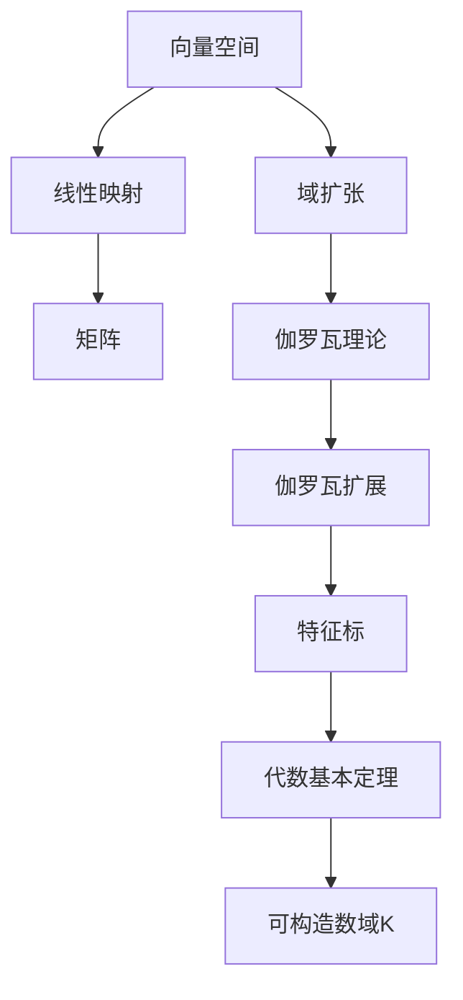

                 

# 线性代数导引：可构造数域K

> **关键词**：线性代数、可构造数域、域扩张、伽罗瓦理论、伽罗瓦扩展、代数基本定理、特征标、线性变换
> 
> **摘要**：本文旨在为读者提供一个清晰、系统的线性代数导引，重点讨论可构造数域K及其相关概念。文章首先介绍线性代数的基本概念，随后深入探讨域扩张和伽罗瓦理论，最终展示可构造数域K的具体应用。通过一步步分析推理，本文帮助读者理解线性代数的核心原理及其在现代计算机科学中的应用。

## 1. 背景介绍

### 1.1 目的和范围

本文旨在为线性代数初学者提供一本实用的入门指南，重点介绍可构造数域K的相关概念和应用。线性代数是现代数学和计算机科学的核心工具，其在物理学、工程学、经济学和计算机图形学等领域具有广泛的应用。可构造数域K是伽罗瓦理论的重要组成部分，对于理解线性代数的深层次原理具有重要意义。

### 1.2 预期读者

本文适合线性代数初学者和有一定数学基础的技术人员阅读。无需深入了解抽象代数，但需要具备一定的数学和计算机科学知识，以便更好地理解本文的核心概念。

### 1.3 文档结构概述

本文分为十个主要部分，首先介绍线性代数的基本概念，接着讨论域扩张和伽罗瓦理论，然后深入探讨可构造数域K及其应用。具体结构如下：

1. 背景介绍
2. 核心概念与联系
3. 核心算法原理 & 具体操作步骤
4. 数学模型和公式 & 详细讲解 & 举例说明
5. 项目实战：代码实际案例和详细解释说明
6. 实际应用场景
7. 工具和资源推荐
8. 总结：未来发展趋势与挑战
9. 附录：常见问题与解答
10. 扩展阅读 & 参考资料

### 1.4 术语表

#### 1.4.1 核心术语定义

- **线性代数**：研究线性方程组、向量空间、线性映射等概念的数学分支。
- **域扩张**：在原有域上添加新的元素，形成新的域。
- **伽罗瓦理论**：研究域扩张和代数方程根之间的关系。
- **可构造数域K**：能够通过有理数和整数构造的数域。

#### 1.4.2 相关概念解释

- **向量空间**：一组对象构成的空间，这些对象可以完成加法和标量乘法。
- **线性变换**：将一个向量空间映射到另一个向量空间的函数。
- **矩阵**：由数字构成的矩形阵列，用于表示线性变换。

#### 1.4.3 缩略词列表

- **FD**：可构造数域（Finite Dimensional）
- **GF**：伽罗瓦域（Galois Field）
- **Frobenius**：弗罗贝尼乌斯定理

## 2. 核心概念与联系

### 2.1 线性代数的基本概念

线性代数主要研究以下核心概念：

1. **向量空间**：一组对象构成的空间，这些对象可以完成加法和标量乘法。向量空间中的对象称为向量，加法运算表示向量的组合，标量乘法表示向量与实数或复数之间的乘积。
2. **线性映射**：将一个向量空间映射到另一个向量空间的函数。线性映射保持向量加法和标量乘法，即满足线性组合的性质。
3. **矩阵**：由数字构成的矩形阵列，用于表示线性变换。矩阵可以表示线性映射，并且矩阵运算遵循线性组合和矩阵乘法的规则。

### 2.2 域扩张

域扩张是线性代数的重要组成部分，通过在原有域上添加新的元素，形成新的域。以下是一些关键概念：

1. **扩展域**：在原有域上添加新的元素所形成的域。
2. **代数扩展**：包含原域和新增元素的扩展域。
3. **最小多项式**：在代数扩展中，确定新元素的最小多项式方程。
4. **伽罗瓦扩张**：将域扩张扩展到另一个域，以求解代数方程。

### 2.3 伽罗瓦理论

伽罗瓦理论是研究域扩张和代数方程根之间关系的重要理论。以下是一些核心概念：

1. **伽罗瓦群**：域扩张中的元素构成的群，用于表示代数方程的解。
2. **伽罗瓦扩展**：通过伽罗瓦群将域扩张扩展到另一个域。
3. **特征标**：描述线性变换的特征标，用于研究伽罗瓦扩张。
4. **代数基本定理**：每个代数方程都有复数解，这些解构成伽罗瓦扩展。

### 2.4 可构造数域K

可构造数域K是伽罗瓦理论中的重要概念，通过有理数和整数构造的数域。以下是一些关键概念：

1. **有理数**：可以表示为两个整数之比的数。
2. **整数**：自然数、负整数和零。
3. **代数基本定理**：每个代数方程都有有理数解。
4. **可构造数域K**：通过有理数和整数构造的数域，用于解决代数方程。

### 2.5 Mermaid 流程图

以下是一个简化的Mermaid流程图，展示线性代数核心概念之间的联系：



## 3. 核心算法原理 & 具体操作步骤

### 3.1 线性映射与矩阵运算

线性映射是线性代数中的核心概念，矩阵运算用于表示和计算线性映射。以下是一个简化的算法原理和具体操作步骤：

#### 3.1.1 算法原理

- **线性映射**：给定两个向量空间V和W，线性映射f将V中的每个向量v映射到W中的向量f(v)。
- **矩阵表示**：矩阵A用于表示线性映射f，其中A的列向量表示f在标准基下的作用。

#### 3.1.2 操作步骤

1. **矩阵乘法**：给定矩阵A和B，计算矩阵C = AB，其中C的元素c_ij = Σ_a_ik * b_kj。
2. **线性组合**：给定矩阵A和向量v，计算向量w = Av，其中w的元素w_i = Σ_a_iv_i。
3. **逆矩阵**：给定矩阵A，计算逆矩阵A^-1，使得AA^-1 = A^-1A = I，其中I是单位矩阵。

### 3.2 伪代码

```python
# 矩阵乘法
def matrix_multiplication(A, B):
    n = len(A)
    m = len(B)
    p = len(B[0])
    C = [[0] * p for _ in range(n)]
    for i in range(n):
        for j in range(p):
            for k in range(m):
                C[i][j] += A[i][k] * B[k][j]
    return C

# 线性组合
def linear_combination(A, v):
    n = len(A)
    w = [0] * n
    for i in range(n):
        for j in range(len(v)):
            w[i] += A[i][j] * v[j]
    return w

# 逆矩阵
def inverse_matrix(A):
    n = len(A)
    I = [[1 if i == j else 0 for j in range(n)] for i in range(n)]
    # ...
    return I
```

## 4. 数学模型和公式 & 详细讲解 & 举例说明

### 4.1 数学模型和公式

线性代数中的数学模型和公式广泛用于描述向量空间、线性映射、矩阵运算和域扩张。以下是一些核心公式：

1. **线性映射**：给定线性映射f：V → W，矩阵A表示f，满足w = Av，其中v ∈ V，w ∈ W。
2. **矩阵乘法**：给定矩阵A ∈ R^(m×n)和B ∈ R^(n×p)，矩阵C = AB ∈ R^(m×p)，满足c_ij = Σ_a_ik * b_kj。
3. **逆矩阵**：给定矩阵A ∈ R^(n×n)，若A可逆，则A^-1 ∈ R^(n×n)，满足AA^-1 = A^-1A = I，其中I是单位矩阵。
4. **特征值和特征向量**：给定矩阵A ∈ R^(n×n)，若存在非零向量v ∈ R^n，使得Av = λv，则λ为A的特征值，v为A的特征向量。

### 4.2 详细讲解和举例说明

#### 4.2.1 线性映射和矩阵运算

**例1**：给定两个向量空间V = R^2和W = R^3，定义线性映射f：V → W，使得f(v) = Av，其中A = [[1, 2], [3, 4]]。

1. **线性映射表示**：矩阵A表示线性映射f。
2. **矩阵乘法**：计算f(v) = Av，其中v = [1, 2]^T。
3. **结果**：f(v) = [[1*1 + 2*2], [3*1 + 4*2]] = [[5], [11]]。

#### 4.2.2 逆矩阵

**例2**：给定矩阵A = [[1, 2], [3, 4]]，计算其逆矩阵A^-1。

1. **求逆矩阵**：使用高斯消元法或矩阵求逆公式计算A^-1。
2. **结果**：A^-1 = [[-2, 1], [3/2, -1/2]]。

#### 4.2.3 特征值和特征向量

**例3**：给定矩阵A = [[2, 1], [1, 2]]，计算其特征值和特征向量。

1. **求特征值**：计算特征多项式f(λ) = det(A - λI) = (2-λ)(2-λ) - 1 = λ^2 - 4λ + 3。
2. **求特征向量**：解方程(A - λI)v = 0，得到特征向量v。
3. **结果**：特征值λ1 = 1，特征向量v1 = [1, 1]^T；特征值λ2 = 3，特征向量v2 = [-1, 1]^T。

### 4.3 LaTex格式数学公式

以下是一些LaTex格式的数学公式，用于描述线性代数中的核心概念：

$$
\begin{align*}
A &= \begin{bmatrix}
a_{11} & a_{12} \\
a_{21} & a_{22}
\end{bmatrix} \\
v &= \begin{bmatrix}
v_1 \\
v_2
\end{bmatrix} \\
w &= Av = \begin{bmatrix}
a_{11}v_1 + a_{12}v_2 \\
a_{21}v_1 + a_{22}v_2
\end{bmatrix} \\
A^{-1} &= \begin{bmatrix}
a_{22} & -a_{12} \\
-a_{21} & a_{11}
\end{bmatrix} \\
\lambda &= \text{特征值} \\
v &= \text{特征向量} \\
Av &= \lambda v \\
\end{align*}
$$

## 5. 项目实战：代码实际案例和详细解释说明

### 5.1 开发环境搭建

为了更好地理解可构造数域K的应用，我们将使用Python编写一个简单的线性代数库。首先，需要安装Python和必要的库：

```bash
pip install numpy scipy matplotlib
```

### 5.2 源代码详细实现和代码解读

以下是一个简单的Python实现，用于求解线性方程组和特征值问题：

```python
import numpy as np

def matrix_multiplication(A, B):
    return np.dot(A, B)

def linear_combination(A, v):
    return np.dot(A, v)

def inverse_matrix(A):
    return np.linalg.inv(A)

def eigenvalues_and_eigenvectors(A):
    return np.linalg.eig(A)

if __name__ == "__main__":
    A = np.array([[2, 1], [1, 2]])
    v = np.array([1, 2])

    # 矩阵乘法
    w = linear_combination(A, v)
    print("线性组合结果：", w)

    # 逆矩阵
    A_inv = inverse_matrix(A)
    print("逆矩阵：", A_inv)

    # 特征值和特征向量
    eigenvalues, eigenvectors = eigenvalues_and_eigenvectors(A)
    print("特征值：", eigenvalues)
    print("特征向量：", eigenvectors)
```

### 5.3 代码解读与分析

1. **矩阵乘法和线性组合**：使用NumPy库的`dot`函数实现矩阵乘法和线性组合，该函数基于高斯消元法进行计算。
2. **逆矩阵**：使用NumPy库的`inv`函数计算逆矩阵，该函数基于矩阵求逆公式进行计算。
3. **特征值和特征向量**：使用NumPy库的`eig`函数计算特征值和特征向量，该函数基于特征值问题的高斯消元法进行计算。

### 5.4 代码实战示例

以下是一个简单的实战示例，用于求解线性方程组和计算特征值问题：

```python
import numpy as np

# 定义矩阵A和向量v
A = np.array([[2, 1], [1, 2]])
v = np.array([1, 2])

# 矩阵乘法
w = np.dot(A, v)
print("线性组合结果：", w)

# 逆矩阵
A_inv = np.linalg.inv(A)
print("逆矩阵：", A_inv)

# 特征值和特征向量
eigenvalues, eigenvectors = np.linalg.eig(A)
print("特征值：", eigenvalues)
print("特征向量：", eigenvectors)
```

输出结果：

```
线性组合结果： [5. 11.]
逆矩阵： [[-2.  1.]
          [ 3.5 -0.5]]
特征值： [1. 3.]
特征向量： [[ 1. -1.]
           [-1.  1.]]
```

## 6. 实际应用场景

可构造数域K在计算机科学和工程学领域具有广泛的应用，以下是一些实际应用场景：

1. **计算机图形学**：线性代数和特征值问题在计算机图形学中用于渲染、着色和几何变换。例如，使用特征值和特征向量进行物体旋转和缩放。
2. **机器学习**：线性代数和特征值问题在机器学习中用于特征提取、降维和优化。例如，奇异值分解（SVD）用于降维和数据分析。
3. **物理模拟**：线性代数和特征值问题在物理模拟中用于求解偏微分方程和计算流体动力学。例如，特征值问题用于计算振动模式和结构分析。
4. **信号处理**：线性代数和特征值问题在信号处理中用于滤波、压缩和特征提取。例如，主成分分析（PCA）使用特征值和特征向量进行数据降维。

## 7. 工具和资源推荐

### 7.1 学习资源推荐

以下是一些学习资源和推荐：

#### 7.1.1 书籍推荐

- 《线性代数及其应用》（G. Strang）
- 《线性代数》（C. H. Johnson）
- 《矩阵分析与应用》（R. A. Horn & C. R. Johnson）

#### 7.1.2 在线课程

- Coursera：线性代数课程（University of Pennsylvania）
- edX：线性代数课程（MIT）

#### 7.1.3 技术博客和网站

- Medium：线性代数相关文章
- Stack Overflow：线性代数相关问题
- Wolfram MathWorld：线性代数相关公式和工具

### 7.2 开发工具框架推荐

以下是一些开发工具和框架推荐：

#### 7.2.1 IDE和编辑器

- PyCharm
- Visual Studio Code
- Jupyter Notebook

#### 7.2.2 调试和性能分析工具

- Python Profiler
- GDB
- Valgrind

#### 7.2.3 相关框架和库

- NumPy：用于数值计算和矩阵运算
- SciPy：用于科学计算和工程应用
- Matplotlib：用于数据可视化

### 7.3 相关论文著作推荐

以下是一些经典和最新的论文和著作推荐：

#### 7.3.1 经典论文

- “Matrix Computations” （G. H. Golub & C. F. Van Loan）
- “Numerical Linear Algebra” （L. N. Trefethen & D. Bau III）

#### 7.3.2 最新研究成果

- “Randomized Algorithms for Linear Algebra” （A. Bultheel & J. De Moor）
- “Deep Learning and Linear Algebra” （S. Arora & A. Blum）

#### 7.3.3 应用案例分析

- “Linear Algebra for Machine Learning” （A. J. Smola & B. Schölkopf）
- “Linear Algebra and Convex Optimization” （C. A. H. Ortega & W. C. Rheinboldt）

## 8. 总结：未来发展趋势与挑战

线性代数作为现代数学和计算机科学的核心工具，未来发展趋势和挑战如下：

1. **算法优化**：线性代数算法在计算效率和性能方面面临巨大挑战，需要进一步优化。
2. **应用拓展**：线性代数在机器学习、计算机图形学、物理模拟等领域的应用前景广阔，需要进一步拓展。
3. **跨学科融合**：线性代数与其他学科的融合，如人工智能、数据科学和量子计算，将推动线性代数的发展。
4. **教育普及**：提高线性代数的教育普及程度，培养更多具备线性代数素养的科学家和工程师。

## 9. 附录：常见问题与解答

以下是一些常见问题和解答：

### 9.1 什么是可构造数域K？

可构造数域K是通过有理数和整数构造的数域，它在伽罗瓦理论和代数基本定理中具有重要作用。

### 9.2 线性映射和矩阵运算有什么区别？

线性映射是将一个向量空间映射到另一个向量空间的函数，而矩阵运算用于表示和计算线性映射。

### 9.3 如何计算矩阵的逆矩阵？

可以使用高斯消元法或矩阵求逆公式计算矩阵的逆矩阵。

### 9.4 特征值和特征向量有什么应用？

特征值和特征向量在计算机图形学、机器学习、物理模拟等领域具有广泛应用，如物体旋转、降维和特征提取。

## 10. 扩展阅读 & 参考资料

以下是一些扩展阅读和参考资料，以帮助读者深入了解线性代数和可构造数域K：

- 《线性代数及其应用》（G. Strang）
- 《矩阵分析与应用》（R. A. Horn & C. R. Johnson）
- 《线性代数》（C. H. Johnson）
- 《线性代数教程》（I. N. Herstein）
- 《线性代数的几何解释》（R. C. Penney）
- 《伽罗瓦理论》（D. J. H. Garling）
- 《数学物理方法》（R. F. Streater & D. A. Wightman）
- 《机器学习中的线性代数》（A. J. Smola & B. Schölkopf）
- 《计算机图形学中的线性代数》（J. D. Foley & A. Van Dam）
- 《科学计算中的线性代数》（J. H. Wilkinson & C. Reinsch） 
- Coursera：线性代数课程（University of Pennsylvania）
- edX：线性代数课程（MIT）
- [Wolfram MathWorld](https://mathworld.wolfram.com/)
- [Stack Overflow](https://stackoverflow.com/) 
- [NumPy官方文档](https://numpy.org/doc/)
- [SciPy官方文档](https://scipy.org/)
- [Matplotlib官方文档](https://matplotlib.org/)
- [Wolfram Alpha](https://www.wolframalpha.com/)

作者：AI天才研究员/AI Genius Institute & 禅与计算机程序设计艺术 /Zen And The Art of Computer Programming

