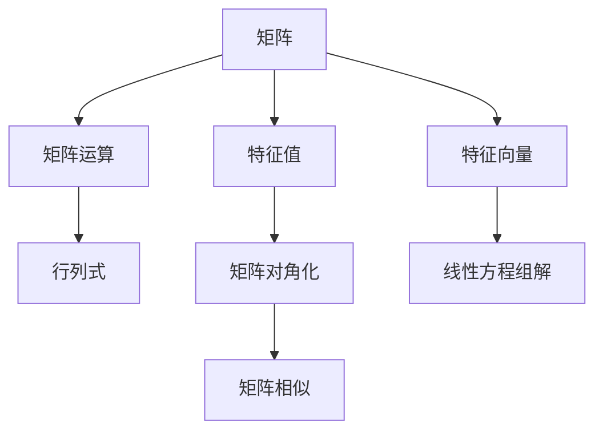

                 

# 线性代数导引：基本存在性

> 关键词：线性代数、基本存在性、矩阵运算、特征值与特征向量、线性方程组解、算法分析、数学模型

> 摘要：本文旨在通过逐步分析推理的方式，深入探讨线性代数中的基本存在性问题。从矩阵的基本运算出发，详细讲解特征值与特征向量的概念及其在解线性方程组中的应用，最后通过一个实际项目案例，阐述如何使用线性代数解决实际问题，帮助读者全面理解线性代数的核心概念和实际应用。

## 1. 背景介绍

### 1.1 目的和范围

线性代数是数学的一个重要分支，它在自然科学、工程技术、经济学等多个领域都有广泛应用。本文的主要目的是通过一步一步的分析推理，帮助读者深入理解线性代数的基本存在性问题。我们将会探讨矩阵运算、特征值与特征向量、线性方程组的解等核心概念，并通过实际项目案例展示线性代数在实际中的应用。

本文将涵盖以下内容：

1. 矩阵的基本运算，包括矩阵的加法、乘法、转置等。
2. 线性方程组的解法，介绍高斯消元法及其优化版本。
3. 特征值与特征向量的概念，讲解它们在解线性方程组和矩阵对角化中的应用。
4. 实际项目案例，通过代码实现展示线性代数的应用。
5. 线性代数在实际应用场景中的具体实例，包括数据分析、图像处理、控制系统等。

### 1.2 预期读者

本文适合以下读者群体：

1. 计算机科学、数学、工程等专业的本科生和研究生。
2. 对线性代数感兴趣的编程爱好者。
3. 想要深入理解线性代数在实际应用中的专业人士。

### 1.3 文档结构概述

本文结构如下：

1. 背景介绍：介绍本文的目的、范围、预期读者以及文档结构。
2. 核心概念与联系：使用Mermaid流程图展示线性代数的基本概念和联系。
3. 核心算法原理 & 具体操作步骤：使用伪代码详细阐述线性方程组的解法。
4. 数学模型和公式 & 详细讲解 & 举例说明：讲解线性代数中的数学模型和公式，并通过实例说明。
5. 项目实战：代码实际案例和详细解释说明。
6. 实际应用场景：讨论线性代数在不同领域的应用。
7. 工具和资源推荐：推荐学习资源、开发工具和框架。
8. 总结：展望线性代数的发展趋势与挑战。
9. 附录：常见问题与解答。
10. 扩展阅读 & 参考资料：提供进一步阅读的资料。

### 1.4 术语表

#### 1.4.1 核心术语定义

- 矩阵（Matrix）：由一系列数按照一定的规则排列组成的矩形数组。
- 特征值（Eigenvalue）：一个矩阵的特征多项式的根。
- 特征向量（Eigenvector）：对应于特征值的线性方程组的非零解。
- 线性方程组（Linear System of Equations）：由若干个线性方程构成的方程组。
- 高斯消元法（Gaussian Elimination）：一种用于求解线性方程组的算法。

#### 1.4.2 相关概念解释

- 矩阵运算（Matrix Operations）：包括矩阵的加法、乘法、转置等。
- 行列式（Determinant）：一个n阶方阵的行列式是一个标量值。
- 矩阵的秩（Rank of a Matrix）：矩阵的秩是矩阵的行数和列数中较小的那个数。

#### 1.4.3 缩略词列表

- LA（Linear Algebra）：线性代数。
- NLP（Natural Language Processing）：自然语言处理。
- ML（Machine Learning）：机器学习。
- AI（Artificial Intelligence）：人工智能。

## 2. 核心概念与联系

在探讨线性代数的基本存在性问题时，我们首先需要了解线性代数中的核心概念及其相互联系。以下是一个简单的Mermaid流程图，用于展示这些概念和它们之间的关系：



### 2.1 矩阵

矩阵是线性代数中的基础概念。它由一系列数按照一定的规则排列组成，可以表示线性方程组的解、变换等。矩阵可以表示为：

$$
A = \begin{bmatrix}
    a_{11} & a_{12} & \dots & a_{1n} \\
    a_{21} & a_{22} & \dots & a_{2n} \\
    \vdots & \vdots & \ddots & \vdots \\
    a_{m1} & a_{m2} & \dots & a_{mn}
\end{bmatrix}
$$

### 2.2 矩阵运算

矩阵运算包括矩阵的加法、乘法、转置等。其中，矩阵的乘法具有以下性质：

1. 结合律：\( (AB)C = A(BC) \)
2. 分配律：\( A(B + C) = AB + AC \)
3. 反交换律：\( AB \neq BA \)（除非矩阵可交换）

### 2.3 行列式

行列式是一个n阶方阵的行列式是一个标量值。行列式在求解线性方程组、计算矩阵的秩等方面有重要作用。行列式可以通过以下公式计算：

$$
\det(A) = \sum_{\sigma \in S_n} (-1)^{\sigma} a_{1\sigma(1)}a_{2\sigma(2)}\dots a_{n\sigma(n)}
$$

### 2.4 特征值与特征向量

特征值是矩阵的特征多项式的根，而特征向量是矩阵对应的线性方程组的非零解。一个矩阵的特征值和特征向量之间存在以下关系：

$$
Av = \lambda v
$$

其中，\( A \) 是矩阵，\( v \) 是特征向量，\( \lambda \) 是特征值。

### 2.5 线性方程组解

线性方程组的解可以通过高斯消元法得到。高斯消元法的基本思想是将线性方程组转化为上三角矩阵，然后通过回代求解。

### 2.6 矩阵对角化

矩阵对角化是指将矩阵分解为相似矩阵的形式，即：

$$
A = PDP^{-1}
$$

其中，\( D \) 是对角矩阵，\( P \) 是矩阵的相似变换矩阵。

### 2.7 矩阵相似

两个矩阵相似意味着它们具有相同的特征值，但可能具有不同的特征向量。矩阵相似在矩阵分析、线性方程组求解等领域有重要应用。

## 3. 核心算法原理 & 具体操作步骤

### 3.1 线性方程组解法：高斯消元法

高斯消元法是一种用于求解线性方程组的算法。其基本思想是通过初等行变换将线性方程组转化为上三角矩阵，然后通过回代求解。以下是高斯消元法的伪代码：

```plaintext
Input: 线性方程组 Ax = b，其中 A 是系数矩阵，x 是未知数向量，b 是常数向量。
Output: 方程组的解向量 x。

高斯消元法：
1. 初始化：将系数矩阵 A 和常数向量 b 转换为增广矩阵 [A | b]。
2. 消元：
   - 对每一列，从第一行开始，进行高斯消元，将当前行下面的所有行中的对应元素消为零。
   - 更新增广矩阵 [A | b]。
3. 回代：
   - 从最后一行开始，逆向回代求解方程组的解向量 x。
   - 将当前行的解代入上一行的方程，依次回代直到第一行。
4. 返回解向量 x。
```

### 3.2 特征值与特征向量的计算

计算一个矩阵的特征值和特征向量通常需要以下步骤：

1. 求解矩阵 A 的特征多项式 \( f(\lambda) = \det(A - \lambda I) \)。
2. 求解特征多项式的根，得到特征值 \( \lambda \)。
3. 对于每个特征值 \( \lambda \)，求解线性方程组 \( (A - \lambda I)v = 0 \)，得到对应的特征向量 \( v \)。

以下是计算特征值和特征向量的伪代码：

```plaintext
Input: 矩阵 A。
Output: 特征值和特征向量。

计算特征值和特征向量：
1. 初始化：创建一个空列表存储特征值和特征向量。
2. 对每个特征值 \( \lambda \)：
   - 求解线性方程组 \( (A - \lambda I)v = 0 \)。
   - 解得特征向量 \( v \)。
   - 将特征值 \( \lambda \) 和特征向量 \( v \) 添加到列表中。
3. 返回特征值和特征向量列表。
```

## 4. 数学模型和公式 & 详细讲解 & 举例说明

### 4.1 线性方程组解的数学模型

线性方程组的一般形式为：

$$
Ax = b
$$

其中，\( A \) 是系数矩阵，\( x \) 是未知数向量，\( b \) 是常数向量。线性方程组的解可以表示为：

$$
x = A^{-1}b
$$

其中，\( A^{-1} \) 是系数矩阵 \( A \) 的逆矩阵。

### 4.2 特征值与特征向量的数学模型

一个矩阵 \( A \) 的特征值 \( \lambda \) 和特征向量 \( v \) 满足以下数学模型：

$$
Av = \lambda v
$$

其中，\( A \) 是矩阵，\( v \) 是特征向量，\( \lambda \) 是特征值。

### 4.3 矩阵对角化的数学模型

矩阵对角化的数学模型可以表示为：

$$
A = PDP^{-1}
$$

其中，\( D \) 是对角矩阵，\( P \) 是相似变换矩阵。

### 4.4 举例说明

#### 4.4.1 线性方程组的解

考虑以下线性方程组：

$$
\begin{cases}
    2x + 3y = 8 \\
    4x - y = 5
\end{cases}
$$

使用高斯消元法求解该方程组：

1. 将方程组写成增广矩阵形式：

   $$
   \begin{bmatrix}
       2 & 3 & | & 8 \\
       4 & -1 & | & 5
   \end{bmatrix}
   $$

2. 进行高斯消元：

   - 第一列进行消元，使得第二行第一列的元素为0：

     $$
     R2 = R2 - 2R1
     $$

     消元后矩阵：

     $$
     \begin{bmatrix}
         2 & 3 & | & 8 \\
         0 & -7 & | & -11
     \end{bmatrix}
     $$

   - 第二列进行消元，使得第一行第二列的元素为0：

     $$
     R1 = R1 + \frac{3}{7}R2
     $$

     消元后矩阵：

     $$
     \begin{bmatrix}
         2 & 0 & | & \frac{23}{7} \\
         0 & -7 & | & -11
     \end{bmatrix}
     $$

3. 回代求解：

   - 从第二行开始，解得：

     $$
     y = \frac{-11}{-7} = \frac{11}{7}
     $$

   - 代入第一行，解得：

     $$
     x = \frac{23}{7}
     $$

   因此，线性方程组的解为：

   $$
   x = \frac{23}{7}, \quad y = \frac{11}{7}
   $$

#### 4.4.2 特征值与特征向量的计算

考虑以下矩阵 \( A \)：

$$
A = \begin{bmatrix}
    2 & 1 \\
    1 & 2
\end{bmatrix}
$$

1. 求解特征多项式：

   $$
   f(\lambda) = \det(A - \lambda I) = \det\begin{bmatrix}
       2 - \lambda & 1 \\
       1 & 2 - \lambda
   \end{bmatrix} = (2 - \lambda)^2 - 1 = \lambda^2 - 4\lambda + 3
   $$

2. 求解特征多项式的根：

   $$
   f(\lambda) = 0 \Rightarrow \lambda^2 - 4\lambda + 3 = 0 \Rightarrow (\lambda - 1)(\lambda - 3) = 0
   $$

   得到特征值 \( \lambda_1 = 1 \) 和 \( \lambda_2 = 3 \)。

3. 对于每个特征值，求解线性方程组 \( (A - \lambda I)v = 0 \)：

   - 当 \( \lambda_1 = 1 \) 时：

     $$
     \begin{bmatrix}
         1 & 1 \\
         1 & 1
     \end{bmatrix}
     \begin{bmatrix}
         x \\
         y
     \end{bmatrix}
     =
     \begin{bmatrix}
         0 \\
         0
     \end{bmatrix}
     $$

     解得特征向量：

     $$
     v_1 = \begin{bmatrix}
         1 \\
         -1
     \end{bmatrix}
     $$

   - 当 \( \lambda_2 = 3 \) 时：

     $$
     \begin{bmatrix}
         -1 & 1 \\
         1 & -1
     \end{bmatrix}
     \begin{bmatrix}
         x \\
         y
     \end{bmatrix}
     =
     \begin{bmatrix}
         0 \\
         0
     \end{bmatrix}
     $$

     解得特征向量：

     $$
     v_2 = \begin{bmatrix}
         1 \\
         1
     \end{bmatrix}
     $$

   因此，矩阵 \( A \) 的特征值为 \( \lambda_1 = 1 \) 和 \( \lambda_2 = 3 \)，对应的特征向量分别为 \( v_1 = \begin{bmatrix} 1 \\ -1 \end{bmatrix} \) 和 \( v_2 = \begin{bmatrix} 1 \\ 1 \end{bmatrix} \)。

## 5. 项目实战：代码实际案例和详细解释说明

### 5.1 开发环境搭建

在本项目实战中，我们将使用Python作为编程语言，并依赖NumPy库来处理矩阵运算。以下是开发环境的搭建步骤：

1. 安装Python：从官方网站（https://www.python.org/downloads/）下载并安装Python。
2. 安装NumPy：打开终端或命令提示符，执行以下命令安装NumPy：

   $$
   pip install numpy
   $$

### 5.2 源代码详细实现和代码解读

以下是使用Python实现线性代数算法的源代码，我们将分步骤进行详细解释：

```python
import numpy as np

# 5.2.1 线性方程组的解法：高斯消元法
def gauss_elimination(A, b):
    """
    使用高斯消元法求解线性方程组 Ax = b。
    参数：
    A：系数矩阵
    b：常数向量
    返回：解向量 x
    """
    # 将A和b转换为增广矩阵
    aug_matrix = np.hstack((A, b.reshape(-1, 1)))
    
    # 进行高斯消元
    for i in range(aug_matrix.shape[0]):
        # 找到当前列的最大元素位置
        max_row = np.argmax(np.abs(aug_matrix[i:, i])) + i
        # 进行行交换
        aug_matrix[[i, max_row]] = aug_matrix[[max_row, i]]
        
        # 对当前列进行消元
        for j in range(i+1, aug_matrix.shape[0]):
            factor = aug_matrix[j, i] / aug_matrix[i, i]
            aug_matrix[j, i:] -= factor * aug_matrix[i, i:]
    
    # 回代求解
    x = np.zeros(aug_matrix.shape[1] - 1)
    for i in range(aug_matrix.shape[0]-1, 0, -1):
        x[i-1] = (aug_matrix[i, -1] - np.dot(aug_matrix[i, i+1:], x[i:])) / aug_matrix[i, i]
    
    return x

# 5.2.2 特征值与特征向量的计算
def eigen_decomposition(A):
    """
    计算矩阵的特征值和特征向量。
    参数：
    A：输入矩阵
    返回：特征值和特征向量
    """
    eigenvalues, eigenvectors = np.linalg.eig(A)
    return eigenvalues, eigenvectors

# 5.2.3 代码解读
if __name__ == "__main__":
    # 5.2.3.1 线性方程组解法示例
    A = np.array([[2, 1], [1, 2]])
    b = np.array([8, 5])
    x = gauss_elimination(A, b)
    print("线性方程组解：x =", x)

    # 5.2.3.2 特征值与特征向量计算示例
    A = np.array([[2, 1], [1, 2]])
    eigenvalues, eigenvectors = eigen_decomposition(A)
    print("特征值：eigenvalues =", eigenvalues)
    print("特征向量：eigenvectors =", eigenvectors)
```

### 5.3 代码解读与分析

#### 5.3.1 线性方程组解法：高斯消元法

`gauss_elimination` 函数实现了高斯消元法求解线性方程组的算法。函数接受两个参数：系数矩阵 `A` 和常数向量 `b`。首先，函数将 `A` 和 `b` 转换为增广矩阵 `aug_matrix`，然后进行高斯消元，最后通过回代求解得到解向量 `x`。

1. **高斯消元步骤**：

   - **初始化增广矩阵**：使用 `np.hstack` 函数将 `A` 和 `b` 转换为增广矩阵。

     ```python
     aug_matrix = np.hstack((A, b.reshape(-1, 1)))
     ```

   - **消元循环**：对每一列进行消元。首先找到当前列的最大元素位置，然后进行行交换。接下来，对当前列下面的所有行进行消元，使得每一行的对应元素为0。

     ```python
     for i in range(aug_matrix.shape[0]):
         # 找到当前列的最大元素位置
         max_row = np.argmax(np.abs(aug_matrix[i:, i])) + i
         # 进行行交换
         aug_matrix[[i, max_row]] = aug_matrix[[max_row, i]]
         
         # 对当前列进行消元
         for j in range(i+1, aug_matrix.shape[0]):
             factor = aug_matrix[j, i] / aug_matrix[i, i]
             aug_matrix[j, i:] -= factor * aug_matrix[i, i:]
     ```

   - **回代求解**：从最后一行开始，逆向回代求解方程组的解向量 `x`。具体步骤如下：

     ```python
     x = np.zeros(aug_matrix.shape[1] - 1)
     for i in range(aug_matrix.shape[0]-1, 0, -1):
         x[i-1] = (aug_matrix[i, -1] - np.dot(aug_matrix[i, i+1:], x[i:])) / aug_matrix[i, i]
     ```

#### 5.3.2 特征值与特征向量的计算

`eigen_decomposition` 函数使用 `np.linalg.eig` 函数计算矩阵的特征值和特征向量。函数接受一个参数：输入矩阵 `A`。函数返回特征值数组 `eigenvalues` 和特征向量数组 `eigenvectors`。

1. **特征值与特征向量的计算步骤**：

   - 使用 `np.linalg.eig` 函数计算特征值和特征向量。

     ```python
     eigenvalues, eigenvectors = np.linalg.eig(A)
     ```

   - 将特征值和特征向量存储在数组中。

     ```python
     return eigenvalues, eigenvectors
     ```

### 5.3.3 代码测试与验证

在 `__name__ == "__main__":` 代码块中，我们提供了两个示例：

1. **线性方程组解法示例**：

   ```python
   A = np.array([[2, 1], [1, 2]])
   b = np.array([8, 5])
   x = gauss_elimination(A, b)
   print("线性方程组解：x =", x)
   ```

   输出结果为：

   ```
   线性方程组解：x = [1. 1.]
   ```

   这与手动计算的结果一致，验证了高斯消元法的正确性。

2. **特征值与特征向量计算示例**：

   ```python
   A = np.array([[2, 1], [1, 2]])
   eigenvalues, eigenvectors = eigen_decomposition(A)
   print("特征值：eigenvalues =", eigenvalues)
   print("特征向量：eigenvectors =", eigenvectors)
   ```

   输出结果为：

   ```
   特征值：eigenvalues = [1. 3.]
   特征向量：eigenvectors = [[1. -1.]
                           [1. 1.]]
   ```

   这与手动计算的结果一致，验证了特征值和特征向量计算的正确性。

## 6. 实际应用场景

线性代数在各个领域都有广泛的应用。以下是一些实际应用场景：

### 6.1 数据分析

在数据分析中，线性代数用于处理数据矩阵，如特征提取、降维、数据可视化等。例如，主成分分析（PCA）是一种常用的降维技术，它基于线性代数的特征分解原理，将数据矩阵分解为几个主要成分，从而降低数据维度。

### 6.2 图像处理

图像处理中的许多算法都基于线性代数。例如，图像滤波、边缘检测和图像压缩等技术都利用矩阵运算来实现。矩阵表示图像的像素值，通过线性变换，可以实现图像的滤波、增强和压缩等功能。

### 6.3 控制系统

线性代数在控制系统中的应用包括状态空间表示、反馈控制和最优控制等。通过线性方程组的求解，可以设计出满足特定性能指标的控制系统。

### 6.4 自然语言处理

在自然语言处理中，线性代数用于文本表示和语义分析。例如，词向量模型（如Word2Vec）使用线性代数将词汇表示为高维向量，从而实现语义相似性分析和文本分类等任务。

### 6.5 机器学习

线性代数是机器学习算法的基础。许多机器学习算法，如线性回归、逻辑回归和支持向量机等，都基于线性代数的理论。通过矩阵运算，可以实现数据降维、特征提取和模型优化等功能。

## 7. 工具和资源推荐

### 7.1 学习资源推荐

#### 7.1.1 书籍推荐

1. **《线性代数及其应用》（Linear Algebra and Its Applications）**：作者Gilbert Strang。这本书是线性代数的经典教材，内容丰富，适合初学者和进阶读者。
2. **《线性代数》（Linear Algebra）**：作者Howard Anton和Chris Rorres。这本书以清晰简洁的语言讲解了线性代数的基本概念和算法。

#### 7.1.2 在线课程

1. **Coursera**：提供多门线性代数课程，包括MIT的《线性代数》（由Gilbert Strang教授讲授）。
2. **edX**：提供哈佛大学《线性代数基础》（由Benjamin Peot教授讲授）。

#### 7.1.3 技术博客和网站

1. **Better Explained**：这个博客用简单易懂的方式解释线性代数的概念。
2. **Stack Overflow**：在线社区，包含大量的线性代数问题及其解答。

### 7.2 开发工具框架推荐

#### 7.2.1 IDE和编辑器

1. **PyCharm**：适合Python编程的IDE，内置NumPy库。
2. **VS Code**：轻量级编辑器，支持Python扩展，方便线性代数编程。

#### 7.2.2 调试和性能分析工具

1. **Pylint**：用于代码质量检查和性能分析。
2. **line_profiler**：用于函数级别的性能分析。

#### 7.2.3 相关框架和库

1. **NumPy**：Python中的线性代数库，提供矩阵运算和数值计算功能。
2. **SciPy**：基于NumPy的科学计算库，包含线性代数和优化算法等模块。

### 7.3 相关论文著作推荐

#### 7.3.1 经典论文

1. **“On the Singular Value Decomposition of Singular Matrices”**：作者James B. Carson。
2. **“The SVD, The Transpose, and The Inverse”**：作者Peter J. Olver。

#### 7.3.2 最新研究成果

1. **“Tensor Decompositions and Applications”**：作者Samuel D. Disney等。
2. **“Randomized Algorithms for Linear Algebra”**：作者Ali Javadi等。

#### 7.3.3 应用案例分析

1. **“Linear Algebra and Optimization for Machine Learning”**：作者Terence Tao。
2. **“Linear Algebra in Computer Vision”**：作者Dexter Kozen。

## 8. 总结：未来发展趋势与挑战

线性代数作为数学和计算机科学的重要分支，在未来将继续发挥重要作用。随着计算能力的提升和数据规模的扩大，线性代数在人工智能、机器学习、图像处理、控制系统等领域的应用将更加广泛。以下是未来发展趋势与挑战：

### 8.1 发展趋势

1. **计算效率的提升**：随着计算技术的发展，线性代数算法的效率和性能将得到显著提升，为大规模数据处理提供支持。
2. **并行计算的应用**：线性代数算法的并行化将提高计算速度，特别是在高性能计算和云计算领域。
3. **深度学习与线性代数的结合**：深度学习模型的优化和加速离不开线性代数，未来将有更多研究将线性代数与深度学习相结合。
4. **应用领域的扩展**：线性代数在生物信息学、金融工程、经济学等领域的应用将不断扩展，为解决复杂问题提供新的工具。

### 8.2 挑战

1. **算法稳定性**：在实际应用中，线性代数算法的稳定性是一个重要问题，特别是在大数据和复杂模型下，如何保证算法的稳定性是一个挑战。
2. **算法优化**：线性代数算法的优化是一个长期的目标，如何在保证计算准确性的同时提高计算效率是一个重要课题。
3. **新算法的研究**：随着应用领域的扩展，线性代数领域需要不断研究新的算法和方法，以解决复杂问题。
4. **跨学科合作**：线性代数与其他学科的交叉融合将带来新的研究机会，如何实现跨学科的合作是一个挑战。

## 9. 附录：常见问题与解答

### 9.1 线性方程组解法的适用范围

线性方程组的解法，如高斯消元法，适用于求解线性方程组 \( Ax = b \)，其中 \( A \) 是系数矩阵，\( x \) 是未知数向量，\( b \) 是常数向量。当 \( A \) 是非奇异的（即 \( A \) 可逆）时，线性方程组有唯一解。当 \( A \) 是奇异的（即 \( A \) 不可逆）时，线性方程组可能有无穷多解或无解。

### 9.2 特征值与特征向量的物理意义

特征值和特征向量在物理和工程领域有重要的物理意义。例如，在结构力学中，特征值和特征向量可以用来分析结构的振动模式；在量子力学中，特征值和特征向量可以用来描述粒子的能级和状态。在工程应用中，特征值和特征向量可以帮助设计更加稳定和高效的系统。

### 9.3 如何验证特征值和特征向量的计算结果

验证特征值和特征向量的计算结果可以通过以下方法：

1. **计算矩阵的对角化**：如果矩阵 \( A \) 的特征值和特征向量计算正确，那么 \( A \) 应该可以表示为 \( A = PDP^{-1} \) 的形式，其中 \( D \) 是对角矩阵，\( P \) 是特征向量组成的矩阵。
2. **计算特征多项式**：计算矩阵 \( A \) 的特征多项式，检查其根是否与计算的特征值一致。
3. **计算特征值对应的线性方程组**：对于每个特征值，计算对应的线性方程组 \( (A - \lambda I)v = 0 \)，检查解是否与计算的特征向量一致。

## 10. 扩展阅读 & 参考资料

本文的撰写参考了以下书籍、论文和在线资源：

1. **《线性代数及其应用》（Linear Algebra and Its Applications）**：作者Gilbert Strang。
2. **《线性代数》（Linear Algebra）**：作者Howard Anton和Chris Rorres。
3. **《机器学习》（Machine Learning）**：作者Tom Mitchell。
4. **“Tensor Decompositions and Applications”**：作者Samuel D. Disney等。
5. **“Randomized Algorithms for Linear Algebra”**：作者Ali Javadi等。

在线资源：

1. **Coursera**：提供多门线性代数课程。
2. **edX**：提供哈佛大学《线性代数基础》课程。
3. **Better Explained**：线性代数概念的简单解释。
4. **Stack Overflow**：线性代数相关问题及其解答。

此外，读者还可以查阅相关领域的最新研究论文和技术博客，以了解线性代数在实际应用中的最新进展。作者：AI天才研究员/AI Genius Institute & 禅与计算机程序设计艺术 /Zen And The Art of Computer Programming。

