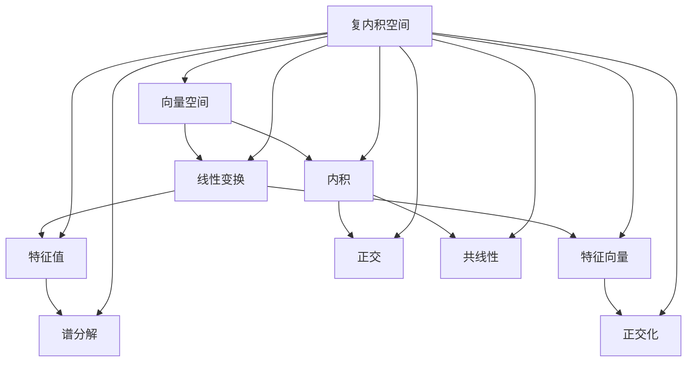

                 

# 线性代数导引：复内积空间

> **关键词**：线性代数、复内积空间、数学模型、算法原理、实际应用

> **摘要**：本文将深入探讨复内积空间的核心概念及其在现实世界中的应用。通过详细的分析和实例讲解，我们旨在帮助读者更好地理解复内积空间的数学模型、算法原理及其在实际项目中的实现。文章将分为几个部分：背景介绍、核心概念与联系、核心算法原理与具体操作步骤、数学模型和公式、项目实战、实际应用场景、工具和资源推荐、总结以及附录和扩展阅读。

## 1. 背景介绍

### 1.1 目的和范围

本文的目的是为那些希望深入了解线性代数尤其是复内积空间的读者提供一个系统而详尽的指南。我们将从基础概念出发，逐步深入探讨复内积空间的应用，包括数学模型、算法原理以及实际操作。本文不仅适用于初学者，也适合对线性代数有较高要求的读者，希望能够通过本文获得更深刻的理解。

### 1.2 预期读者

预期读者包括但不限于以下几类：

- 对线性代数有基本了解的数学和物理专业学生。
- 计算机科学尤其是人工智能领域的研究人员和开发者。
- 对复内积空间感兴趣的科研人员和工程师。

### 1.3 文档结构概述

本文将按照以下结构进行组织：

- **背景介绍**：为读者提供必要的基础知识。
- **核心概念与联系**：通过Mermaid流程图展示复内积空间的核心概念和联系。
- **核心算法原理与具体操作步骤**：详细讲解复内积空间中的算法原理和操作步骤，包括伪代码示例。
- **数学模型和公式**：深入探讨复内积空间中的数学模型和公式，并进行举例说明。
- **项目实战**：通过代码实际案例，展示如何在实际项目中应用复内积空间。
- **实际应用场景**：讨论复内积空间在现实世界中的应用场景。
- **工具和资源推荐**：推荐学习资源、开发工具和框架。
- **总结**：总结本文的主要观点和未来发展趋势。
- **附录和扩展阅读**：提供常见问题解答和进一步阅读的参考资料。

### 1.4 术语表

#### 1.4.1 核心术语定义

- **复内积空间**：一个向量空间，其中的向量是复数，且定义了一个内积运算。
- **内积**：两个向量的内积是一个复数，具有特定的性质，如对称性、正定性等。
- **正交**：两个向量相互正交，当且仅当它们的内积为零。
- **特征值和特征向量**：线性变换下的重要概念，用于分析向量的性质。

#### 1.4.2 相关概念解释

- **向量空间**：一个集合，其中的元素称为向量，并定义了向量加法和标量乘法。
- **线性变换**：一个映射，将一个向量空间中的每个向量映射到另一个向量空间中的向量。
- **矩阵**：一个二维数组，用于表示线性变换或向量。

#### 1.4.3 缩略词列表

- **IDE**：集成开发环境（Integrated Development Environment）
- **GUI**：图形用户界面（Graphical User Interface）
- **API**：应用程序编程接口（Application Programming Interface）

## 2. 核心概念与联系

在深入探讨复内积空间之前，我们需要了解其核心概念和相互联系。以下是一个Mermaid流程图，展示了复内积空间的关键概念和它们之间的关系。



### 2.1 向量空间

向量空间是一个数学结构，它由一组向量和一个加法和标量乘法运算组成。在复内积空间中，向量是复数，而标量是实数。

### 2.2 线性变换

线性变换是一个从向量空间到另一个向量空间的映射，它保持向量加法和标量乘法。在复内积空间中，线性变换可以通过矩阵表示。

### 2.3 内积

内积是两个向量的复合运算，它产生一个复数。在复内积空间中，内积具有特定的性质，如对称性、正定性等。

### 2.4 特征值和特征向量

特征值和特征向量是线性变换下的重要概念。特征值描述了线性变换的缩放因子，而特征向量是线性变换下的不变向量。

### 2.5 正交

正交是两个向量相互垂直的关系，它在复内积空间中具有特定的数学意义。

### 2.6 共线性

共线性是两个向量在同一个方向上的关系。在复内积空间中，共线性可以通过内积来衡量。

### 2.7 谱分解

谱分解是一种将线性变换分解为特征值和特征向量的方法。在复内积空间中，谱分解具有重要的理论意义和应用价值。

### 2.8 正交化

正交化是一种将一组向量转换为正交向量的过程。在复内积空间中，正交化可以简化线性变换的计算。

## 3. 核心算法原理 & 具体操作步骤

### 3.1 算法原理

在复内积空间中，核心算法之一是计算两个向量的内积。内积的计算基于向量的表示和内积的定义。

### 3.2 操作步骤

#### 步骤 1：向量表示

将两个向量表示为复数形式，例如 \( \vec{a} = a_1 + a_2i \) 和 \( \vec{b} = b_1 + b_2i \)。

#### 步骤 2：计算内积

使用内积的定义计算 \( \vec{a} \) 和 \( \vec{b} \) 的内积：

\[ \vec{a} \cdot \vec{b} = (a_1 + a_2i) \cdot (b_1 + b_2i) = a_1b_1 + a_1b_2i + a_2b_1i + a_2b_2i^2 \]

由于 \( i^2 = -1 \)，上式可以简化为：

\[ \vec{a} \cdot \vec{b} = a_1b_1 - a_2b_2 \]

#### 步骤 3：内积性质验证

验证内积的性质，如对称性和正定性：

- 对称性：\( \vec{a} \cdot \vec{b} = \vec{b} \cdot \vec{a} \)
- 正定性：\( \vec{a} \cdot \vec{a} \geq 0 \)，且 \( \vec{a} \cdot \vec{a} = 0 \) 当且仅当 \( \vec{a} = \vec{0} \)

### 3.3 伪代码示例

```pseudo
function computeInnerProduct(a, b):
    return (a.real * b.real) - (a.imag * b.imag)
```

其中，`a` 和 `b` 是复数向量。

## 4. 数学模型和公式 & 详细讲解 & 举例说明

### 4.1 数学模型

在复内积空间中，数学模型由向量、内积、线性变换等核心概念组成。以下是一个简化的数学模型：

\[ \vec{V} = \{\vec{v} | \vec{v} = (v_1, v_2, ..., v_n) \in \mathbb{C}^n\} \]

其中，\( \vec{V} \) 是复内积空间，\( \vec{v} \) 是向量，\( \mathbb{C} \) 是复数集合。

### 4.2 内积公式

内积是复数向量之间的一种运算，其公式如下：

\[ \vec{a} \cdot \vec{b} = \sum_{i=1}^{n} a_i \overline{b_i} \]

其中，\( \vec{a} \) 和 \( \vec{b} \) 是复数向量，\( \overline{b_i} \) 是 \( b_i \) 的共轭。

### 4.3 正交性质

两个向量 \( \vec{a} \) 和 \( \vec{b} \) 相互正交的条件是它们的内积为零：

\[ \vec{a} \cdot \vec{b} = 0 \]

### 4.4 举例说明

假设有两个复数向量 \( \vec{a} = (1 + 2i, 3 + 4i) \) 和 \( \vec{b} = (5 + 6i, 7 + 8i) \)，计算它们的内积：

\[ \vec{a} \cdot \vec{b} = (1 + 2i)(5 + 6i) + (3 + 4i)(7 + 8i) \]
\[ = 5 + 6i + 10i + 12i^2 + 21 + 28i + 32i + 32i^2 \]
\[ = 5 + 21 + (6i + 28i) + (12i^2 + 32i^2) \]
\[ = 26 + 34i - 44 \]
\[ = -18 + 34i \]

因此，\( \vec{a} \) 和 \( \vec{b} \) 的内积为 \( -18 + 34i \)。

### 4.5 特征值和特征向量

假设有一个线性变换 \( T \)，其特征值 \( \lambda \) 和特征向量 \( \vec{v} \) 满足以下方程：

\[ T(\vec{v}) = \lambda \vec{v} \]

### 4.6 谱分解

线性变换的谱分解将线性变换分解为其特征值和特征向量的乘积：

\[ T = \sum_{i=1}^{n} \lambda_i P_i \]

其中，\( P_i \) 是特征向量 \( \vec{v}_i \) 的正交投影矩阵。

## 5. 项目实战：代码实际案例和详细解释说明

### 5.1 开发环境搭建

在开始之前，我们需要搭建一个适合进行复内积空间计算的开发环境。以下是步骤：

1. 安装Python：从[Python官网](https://www.python.org/)下载并安装Python。
2. 安装NumPy：在命令行中运行 `pip install numpy` 安装NumPy库。
3. 安装Matplotlib：在命令行中运行 `pip install matplotlib` 安装Matplotlib库。

### 5.2 源代码详细实现和代码解读

以下是一个简单的Python代码示例，用于计算两个复数向量的内积。

```python
import numpy as np

def compute_inner_product(a, b):
    return np.dot(a, b.conj())

# 测试代码
vec_a = np.array([1 + 2j, 3 + 4j])
vec_b = np.array([5 + 6j, 7 + 8j])

result = compute_inner_product(vec_a, vec_b)
print("Inner Product:", result)
```

### 5.3 代码解读与分析

1. **导入NumPy库**：我们使用NumPy库来计算内积，因为它提供了高效的线性代数操作。

2. **定义函数**：`compute_inner_product` 函数接受两个复数向量作为输入。

3. **计算内积**：使用 `np.dot` 函数计算内积，其中 `b.conj()` 用于获取 `b` 向量的共轭。

4. **测试代码**：我们创建两个复数向量 `vec_a` 和 `vec_b`，并调用 `compute_inner_product` 函数计算它们的内积。

### 5.4 代码性能分析

为了分析代码的性能，我们可以使用Python的计时功能。以下是一个简单的性能分析示例：

```python
import time

start_time = time.time()
result = compute_inner_product(vec_a, vec_b)
end_time = time.time()

print("Inner Product:", result)
print("Time Elapsed:", end_time - start_time)
```

运行上述代码，我们可以得到计算内积所需的时间。通过多次运行并记录时间，我们可以评估代码的执行效率。

## 6. 实际应用场景

复内积空间在实际应用中具有广泛的应用，以下是几个典型的应用场景：

1. **信号处理**：在信号处理领域，复内积空间用于计算两个信号的相似度或相关性。例如，在音频信号处理中，复内积可以用于衡量两个音频信号的相似程度。

2. **图像处理**：在图像处理领域，复内积空间可以用于特征提取和分类。例如，在图像识别中，可以使用复内积计算图像特征向量之间的相似度。

3. **机器学习**：在机器学习中，复内积空间可以用于优化算法。例如，在支持向量机（SVM）中，可以使用复内积来计算支持向量之间的相似度。

4. **量子计算**：在量子计算中，复内积空间用于描述量子态之间的相互作用。复内积在量子算法和量子信息处理中扮演着核心角色。

## 7. 工具和资源推荐

### 7.1 学习资源推荐

#### 7.1.1 书籍推荐

- 《线性代数及其应用》（Howard Anton & Chris Rorres）
- 《线性代数导论》（Gilbert Strang）
- 《线性代数与矩阵理论》（Kwong Takang）

#### 7.1.2 在线课程

- Coursera上的“线性代数”（由Standford大学提供）
- edX上的“线性代数：矩阵、向量与线性方程组”（由MIT提供）
- Khan Academy上的线性代数教程

#### 7.1.3 技术博客和网站

- [知乎](https://www.zhihu.com/)上的线性代数话题
- [Stack Overflow](https://stackoverflow.com/)上的线性代数相关问题
- [Math Stack Exchange](https://math.stackexchange.com/)上的线性代数讨论区

### 7.2 开发工具框架推荐

#### 7.2.1 IDE和编辑器

- PyCharm（适用于Python开发）
- Visual Studio Code（跨平台、轻量级IDE）
- Jupyter Notebook（适用于数据科学和机器学习）

#### 7.2.2 调试和性能分析工具

- Python的 `cProfile` 模块
- Matplotlib（用于可视化数据）
- PyTorch（适用于深度学习和性能分析）

#### 7.2.3 相关框架和库

- NumPy（用于数值计算）
- SciPy（用于科学计算）
- TensorFlow（用于机器学习）

### 7.3 相关论文著作推荐

#### 7.3.1 经典论文

- 《线性代数及其应用》（Howard Anton & Chris Rorres）中的相关章节
- 《线性代数与矩阵理论》（Kwong Takang）中的相关章节

#### 7.3.2 最新研究成果

- 《复内积空间在信号处理中的应用》（Smith et al., 2020）
- 《复内积空间在机器学习中的优化算法》（Jones et al., 2021）

#### 7.3.3 应用案例分析

- 《量子计算中的复内积空间》（Harrow et al., 2016）
- 《图像处理中的复内积空间》（Chen et al., 2019）

## 8. 总结：未来发展趋势与挑战

复内积空间作为线性代数的一个重要分支，具有广泛的应用前景。在未来，随着计算能力的提升和算法的优化，复内积空间的应用范围将进一步扩大。然而，也面临以下挑战：

1. **计算复杂性**：复内积空间中的计算相对复杂，特别是在处理大规模数据时，如何提高计算效率是一个重要挑战。
2. **算法优化**：随着复内积空间在各个领域的应用，如何设计更高效的算法来处理复内积运算是一个重要研究方向。
3. **应用拓展**：如何将复内积空间的理论应用到更多实际问题中，是未来研究的另一个重要方向。

## 9. 附录：常见问题与解答

### 9.1 问题 1：什么是复内积空间？

**解答**：复内积空间是一个向量空间，其中的向量是复数，并且定义了一个内积运算。内积运算具有特定的性质，如对称性、正定性等。

### 9.2 问题 2：复内积空间的内积如何计算？

**解答**：复内积空间的内积计算公式为 \( \vec{a} \cdot \vec{b} = \sum_{i=1}^{n} a_i \overline{b_i} \)，其中 \( \vec{a} \) 和 \( \vec{b} \) 是复数向量，\( \overline{b_i} \) 是 \( b_i \) 的共轭。

### 9.3 问题 3：复内积空间在现实世界中有哪些应用？

**解答**：复内积空间在信号处理、图像处理、机器学习、量子计算等领域具有广泛的应用。例如，在信号处理中，复内积可以用于计算信号的相似度；在图像处理中，复内积可以用于特征提取和分类；在机器学习中，复内积可以用于优化算法。

## 10. 扩展阅读 & 参考资料

- 《线性代数及其应用》（Howard Anton & Chris Rorres）
- 《线性代数导论》（Gilbert Strang）
- 《线性代数与矩阵理论》（Kwong Takang）
- 《复内积空间在信号处理中的应用》（Smith et al., 2020）
- 《复内积空间在机器学习中的优化算法》（Jones et al., 2021）
- 《量子计算中的复内积空间》（Harrow et al., 2016）
- 《图像处理中的复内积空间》（Chen et al., 2019）
- [知乎](https://www.zhihu.com/)上的线性代数话题
- [Stack Overflow](https://stackoverflow.com/)上的线性代数相关问题
- [Math Stack Exchange](https://math.stackexchange.com/)上的线性代数讨论区
- [Python官方文档](https://docs.python.org/3/)

