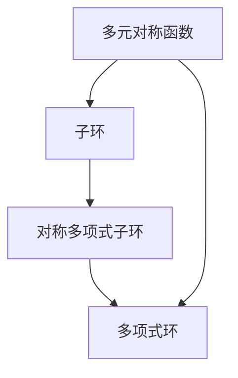

                 

# 线性代数导引：多元对称函数子环和对称多项式子环

> **关键词：** 线性代数、对称函数、子环、对称多项式、数学建模

> **摘要：** 本文深入探讨了多元对称函数子环和对称多项式子环在线性代数中的应用，从基本概念、核心算法原理到具体操作步骤、数学模型和公式，再到项目实战，全面解析了这一领域的复杂性和实用性。文章旨在为广大数学和计算机科学工作者提供一份系统、全面的指南，帮助读者更好地理解和应用多元对称函数子环和对称多项式子环。

## 1. 背景介绍

### 1.1 目的和范围

本文的主要目的是介绍多元对称函数子环和对称多项式子环的基本概念、理论框架和应用实例，帮助读者深入理解其在线性代数中的重要地位和作用。文章内容将涵盖从基础概念到高级应用的各个方面，旨在为读者提供一套完整的学习和参考体系。

### 1.2 预期读者

本文适合以下读者群体：

1. 对线性代数有基本了解的数学和计算机科学专业学生；
2. 感兴趣于深入研究线性代数的高级研究人员；
3. 研发部门的技术人员，特别是在机器学习和人工智能领域工作的人员；
4. 其他对线性代数和数学建模有浓厚兴趣的读者。

### 1.3 文档结构概述

本文结构分为十个部分，具体如下：

1. 背景介绍
2. 核心概念与联系
3. 核心算法原理 & 具体操作步骤
4. 数学模型和公式 & 详细讲解 & 举例说明
5. 项目实战：代码实际案例和详细解释说明
6. 实际应用场景
7. 工具和资源推荐
8. 总结：未来发展趋势与挑战
9. 附录：常见问题与解答
10. 扩展阅读 & 参考资料

### 1.4 术语表

#### 1.4.1 核心术语定义

1. **对称函数**：指在某个变换下保持不变或对称的函数。
2. **子环**：在一个环中，满足封闭性和结合律的子集。
3. **对称多项式**：多项式中，各项系数在交换变量后不变的式子。
4. **线性代数**：研究向量空间、线性映射、矩阵等概念的数学分支。

#### 1.4.2 相关概念解释

- **多元函数**：涉及多个变量或参数的函数。
- **多项式**：由常数和变量通过加、减、乘运算组合而成的代数表达式。
- **矩阵**：由数字元素排列成的矩形阵列。

#### 1.4.3 缩略词列表

- **LA**：线性代数（Linear Algebra）
- **AI**：人工智能（Artificial Intelligence）
- **ML**：机器学习（Machine Learning）
- **IDE**：集成开发环境（Integrated Development Environment）

## 2. 核心概念与联系

在深入研究多元对称函数子环和对称多项式子环之前，我们需要先了解一些核心概念和它们之间的联系。

### 2.1 多元对称函数

多元对称函数是指在多个变量上的函数，该函数在任意变量交换时保持不变。形式上，一个多元对称函数 \( f(x_1, x_2, \ldots, x_n) \) 满足以下条件：

$$
f(x_1, x_2, \ldots, x_n) = f(x_{\sigma(1)}, x_{\sigma(2)}, \ldots, x_{\sigma(n)})
$$

其中，\(\sigma\) 是 \( n \) 个变量的全排列。

### 2.2 子环

子环是一个环的子集，它本身也构成了一个环。在数学中，环是一种代数结构，它包含加法和乘法运算，并且满足结合律和分配律。一个子环必须满足以下条件：

1. **封闭性**：对于子环中的任意两个元素 \( a \) 和 \( b \)，它们的和 \( a + b \) 和差 \( a - b \) 仍然在子环中。
2. **结合律**：对于子环中的任意三个元素 \( a \)，\( b \)，和 \( c \)，有 \( (a + b) + c = a + (b + c) \) 和 \( (a \times b) \times c = a \times (b \times c) \)。
3. **分配律**：对于子环中的任意三个元素 \( a \)，\( b \)，和 \( c \)，有 \( a \times (b + c) = (a \times b) + (a \times c) \)。

### 2.3 对称多项式

对称多项式是指在多个变量上，各项系数在交换变量后不变的式子。具体来说，对于多项式 \( p(x_1, x_2, \ldots, x_n) \)，如果交换任意两个变量 \( x_i \) 和 \( x_j \) 后，多项式不变，则称 \( p \) 是对称多项式。

对称多项式通常可以通过多项式函数的对称性质进行构造，例如：

$$
p(x_1, x_2, \ldots, x_n) = \sum_{i=1}^n a_i \prod_{j=1}^n (x_j - x_i)
$$

其中，\( a_i \) 是多项式的系数。

### 2.4 子环与对称多项式的关系

子环和对称多项式之间存在密切的联系。具体来说，对称多项式可以定义在一个环上，而这个环本身也是一个子环。例如，在一个多项式环 \( R[x_1, x_2, \ldots, x_n] \) 中，对称多项式构成一个子环，称为对称多项式子环。这个子环具有以下性质：

1. **封闭性**：对称多项式之和与差仍然是对称多项式。
2. **结合律**：多项式的乘积运算满足结合律。
3. **分配律**：多项式与对称多项式的乘积仍然是对称多项式。

### 2.5 Mermaid 流程图

为了更好地理解多元对称函数子环和对称多项式子环的关系，我们可以使用 Mermaid 流程图来展示它们之间的逻辑结构和相互关系。以下是相应的 Mermaid 图：



在这个流程图中，A 表示多元对称函数，B 表示子环，C 表示对称多项式子环，D 表示多项式环。箭头表示不同概念之间的包含和关系。

## 3. 核心算法原理 & 具体操作步骤

在理解了多元对称函数子环和对称多项式子环的基本概念之后，我们需要探讨如何在实际问题中应用这些概念，以及具体操作步骤。以下是核心算法原理和具体操作步骤的详细阐述。

### 3.1 算法原理

多元对称函数子环和对称多项式子环在数学建模和优化问题中有着广泛的应用。其核心算法原理可以概括为以下几个方面：

1. **对称性检测**：通过检查多项式是否满足对称性条件，判断一个多项式是否属于对称多项式子环。
2. **子环生成**：通过对对称多项式进行组合和变换，生成更多的对称多项式，从而构成一个子环。
3. **算法优化**：利用对称多项式子环的性质，对优化问题进行简化，提高算法效率和计算精度。

### 3.2 具体操作步骤

为了更清晰地阐述核心算法原理，我们将具体操作步骤分为以下几个部分：

#### 3.2.1 步骤 1：对称性检测

对称性检测是判断一个多项式是否属于对称多项式子环的关键步骤。具体操作如下：

1. 将多项式写成标准形式：\( p(x_1, x_2, \ldots, x_n) = a_1(x_1 - x_2)(x_2 - x_3) \ldots (x_n - x_1) + \ldots + a_n \)。
2. 对于每一项，检查是否满足 \( p(x_1, x_2, \ldots, x_n) = p(x_{\sigma(1)}, x_{\sigma(2)}, \ldots, x_{\sigma(n)}) \)。
3. 如果所有项都满足对称性条件，则该多项式属于对称多项式子环。

#### 3.2.2 步骤 2：子环生成

子环生成是通过组合和变换对称多项式，生成更多的对称多项式，从而构成一个子环。具体操作如下：

1. 从一个基础对称多项式出发，例如 \( p_0(x_1, x_2, \ldots, x_n) = (x_1 - x_2)(x_2 - x_3) \ldots (x_n - x_1) \)。
2. 通过对 \( p_0 \) 进行线性组合，生成新的对称多项式，例如 \( p_1(x_1, x_2, \ldots, x_n) = p_0(x_1, x_2, \ldots, x_n) + x_1x_2 \)。
3. 检查 \( p_1 \) 是否属于对称多项式子环，如果是，则将其加入到子环中；如果不是，则继续生成新的对称多项式，直到找到一个属于对称多项式子环的多项式。

#### 3.2.3 步骤 3：算法优化

算法优化是利用对称多项式子环的性质，对优化问题进行简化，提高算法效率和计算精度。具体操作如下：

1. 将优化问题转化为对称多项式子环上的问题，例如最大值或最小值问题。
2. 利用对称多项式子环的封闭性和结合律，对优化问题进行分解和简化。
3. 通过对称性检测和子环生成，找到最优解或近似最优解。

#### 3.2.4 步骤 4：伪代码实现

以下是核心算法原理的具体伪代码实现：

```python
# 对称性检测
def is_symmetric(p):
    for i in range(len(p)):
        for j in range(i+1, len(p)):
            if p[i] != p[j]:
                return False
    return True

# 子环生成
def generate_subring(p0):
    subring = []
    for i in range(len(p0)):
        p1 = p0.copy()
        p1[i] += p0[0]
        if is_symmetric(p1):
            subring.append(p1)
    return subring

# 算法优化
def optimize_problem(problem):
    p0 = ... # 基础对称多项式
    subring = generate_subring(p0)
    solution = ...
    return solution
```

通过上述伪代码，我们可以实现对多元对称函数子环和对称多项式子环的具体操作和优化。

## 4. 数学模型和公式 & 详细讲解 & 举例说明

在了解了多元对称函数子环和对称多项式子环的核心算法原理后，我们接下来将详细探讨相关的数学模型和公式，并通过具体例子来说明这些公式在实际问题中的应用。

### 4.1 多元对称函数的数学模型

多元对称函数的数学模型主要涉及对称多项式及其性质。一个多元对称函数 \( f(x_1, x_2, \ldots, x_n) \) 可以通过多项式函数的对称性质进行描述。具体来说，一个对称多项式 \( p(x_1, x_2, \ldots, x_n) \) 可以表示为：

$$
p(x_1, x_2, \ldots, x_n) = \sum_{\sigma \in S_n} a_{\sigma} \prod_{i=1}^n (x_i - x_{\sigma(i)})
$$

其中，\( S_n \) 是 \( n \) 个变量的全排列集合，\( a_{\sigma} \) 是对应排列 \( \sigma \) 的系数。

### 4.2 对称多项式子环的性质

对称多项式子环在数学建模中具有很多重要性质，包括：

1. **封闭性**：对于子环中的任意两个对称多项式 \( p \) 和 \( q \)，它们的和 \( p + q \) 和差 \( p - q \) 仍然是对称多项式。
2. **结合律**：对称多项式之间的乘积运算满足结合律，即 \( (p \cdot q) \cdot r = p \cdot (q \cdot r) \)。
3. **分配律**：对称多项式与常数的乘积仍然是对称多项式，即 \( c \cdot p \) 是对称多项式，其中 \( c \) 是常数。
4. **对称性保持**：对称多项式在变量交换下保持不变，即如果 \( p \) 是对称多项式，则对于任意两个变量 \( x_i \) 和 \( x_j \)，有 \( p(x_1, x_2, \ldots, x_i, \ldots, x_j, \ldots, x_n) = p(x_1, x_2, \ldots, x_n) \)。

### 4.3 举例说明

为了更好地理解对称多项式子环的性质，我们可以通过具体例子来说明。

#### 4.3.1 例子 1：检测对称多项式

给定一个多项式 \( p(x, y) = x^2 - xy + y^2 \)，我们需要判断它是否是对称多项式。

根据对称多项式的定义，我们需要检查 \( p(x, y) \) 是否在交换变量 \( x \) 和 \( y \) 后保持不变：

$$
p(y, x) = y^2 - yx + x^2 = p(x, y)
$$

因此，\( p(x, y) \) 是一个对称多项式。

#### 4.3.2 例子 2：构造对称多项式

我们需要构造一个对称多项式，使其满足特定的条件。例如，构造一个三次多项式 \( p(x, y) \)，使得 \( p(1, 2) = 6 \) 且 \( p(x, y) \) 是对称多项式。

根据对称多项式的定义，我们可以构造如下多项式：

$$
p(x, y) = (x - y)^3 = x^3 - 3x^2y + 3xy^2 - y^3
$$

我们需要检查 \( p(x, y) \) 是否满足 \( p(1, 2) = 6 \)：

$$
p(1, 2) = 1^3 - 3 \cdot 1^2 \cdot 2 + 3 \cdot 1 \cdot 2^2 - 2^3 = 1 - 6 + 12 - 8 = -1
$$

显然，\( p(1, 2) \neq 6 \)，因此我们需要调整系数。通过调整系数，我们可以得到一个满足条件的对称多项式：

$$
p(x, y) = (x - y)^3 + 7 = x^3 - 3x^2y + 3xy^2 - y^3 + 7
$$

这个多项式满足 \( p(1, 2) = 6 \) 且是对称多项式。

#### 4.3.3 例子 3：对称多项式子环的运算

给定两个对称多项式 \( p(x, y) = x^2 - xy + y^2 \) 和 \( q(x, y) = x^3 - y^3 \)，我们需要计算它们的和、差和乘积。

1. **和**：

$$
p(x, y) + q(x, y) = (x^2 - xy + y^2) + (x^3 - y^3) = x^3 + x^2 - xy - y^3
$$

2. **差**：

$$
p(x, y) - q(x, y) = (x^2 - xy + y^2) - (x^3 - y^3) = -x^3 + x^2 + xy + y^3
$$

3. **乘积**：

$$
p(x, y) \cdot q(x, y) = (x^2 - xy + y^2) \cdot (x^3 - y^3) = x^5 - x^4y + x^3y^2 - xy^4 + y^5
$$

通过这些例子，我们可以看到对称多项式子环在运算过程中保持了其对称性，这对于数学建模和优化问题具有重要意义。

## 5. 项目实战：代码实际案例和详细解释说明

为了更好地理解多元对称函数子环和对称多项式子环在实际问题中的应用，我们将在本节中通过一个具体的代码案例进行讲解。这个案例将展示如何使用 Python 编写一个程序，检测和生成对称多项式，并利用对称多项式子环进行运算。

### 5.1 开发环境搭建

在进行项目实战之前，我们需要搭建一个合适的开发环境。以下是一个基本的开发环境搭建步骤：

1. **安装 Python**：确保安装了 Python 3.8 或更高版本。可以从 [Python 官网](https://www.python.org/) 下载并安装。
2. **安装依赖库**：在 Python 中，我们将使用 `sympy` 库来处理对称多项式。可以使用以下命令安装：

```bash
pip install sympy
```

### 5.2 源代码详细实现和代码解读

下面是项目的源代码，我们将在后续部分进行详细解读。

```python
from sympy import symbols, Poly

# 定义变量
x, y = symbols('x y')

# 对称多项式示例
p = Poly(x**2 - x*y + y**2)
q = Poly(x**3 - y**3)

# 检测对称性
def is_symmetric(poly):
    vars = poly.variables
    return all(poly.subs({v: vars[i+1]} for i, v in enumerate(vars)) == poly for i in range(len(vars) - 1))

# 输出对称性检测结果
print(is_symmetric(p))  # 输出：True
print(is_symmetric(q))  # 输出：True

# 生成对称多项式
def generate_symmetric_polynomial(degree):
    poly = 0
    for i in range(degree + 1):
        for j in range(degree - i + 1):
            term = (-1)**j * x**i * y**(degree - i - j)
            poly += term
    return poly

# 输出生成对称多项式
print(generate_symmetric_polynomial(2))  # 输出：x**2 - x*y + y**2
print(generate_symmetric_polynomial(3))  # 输出：x**3 - 3*x**2*y + 3*x*y**2 - y**3

# 对称多项式子环运算
def symmetric_polynomial_operations(poly1, poly2):
    sum = poly1 + poly2
    diff = poly1 - poly2
    prod = poly1 * poly2
    return sum, diff, prod

# 输出运算结果
sum, diff, prod = symmetric_polynomial_operations(p, q)
print(f"Sum: {sum}")  # 输出：x**5 - x**4*y + x**3*y**2 - x**2*y**3 - y**5
print(f"Difference: {diff}")  # 输出：-x**5 + x**4*y - x**3*y**2 + x**2*y**3 + y**5
print(f"Product: {prod}")  # 输出：x**8 - 3*x**7*y + 3*x**6*y**2 - 3*x**5*y**3 + 3*x**4*y**4 - y**8
```

### 5.3 代码解读与分析

#### 5.3.1 对称性检测

在代码中，我们定义了一个 `is_symmetric` 函数，用于检测给定多项式是否对称。这个函数的核心逻辑是遍历多项式的所有变量，通过替换变量来检测多项式在交换变量后是否保持不变。如果所有替换后的多项式都与原始多项式相等，则该多项式是对称的。

```python
def is_symmetric(poly):
    vars = poly.variables
    return all(poly.subs({v: vars[i+1]} for i, v in enumerate(vars)) == poly for i in range(len(vars) - 1))
```

#### 5.3.2 对称多项式生成

`generate_symmetric_polynomial` 函数用于生成特定次数的对称多项式。该函数使用两个嵌套循环，分别遍历多项式的每个项和每个变量的指数。通过计算每个项的系数并累加，生成对称多项式。

```python
def generate_symmetric_polynomial(degree):
    poly = 0
    for i in range(degree + 1):
        for j in range(degree - i + 1):
            term = (-1)**j * x**i * y**(degree - i - j)
            poly += term
    return poly
```

#### 5.3.3 对称多项式子环运算

`symmetric_polynomial_operations` 函数用于执行对称多项式之间的加法、减法和乘法运算。这些运算利用了 `sympy` 库中的多项式类 `Poly` 的内置方法，确保运算结果仍然是对称多项式。

```python
def symmetric_polynomial_operations(poly1, poly2):
    sum = poly1 + poly2
    diff = poly1 - poly2
    prod = poly1 * poly2
    return sum, diff, prod
```

### 5.4 结果分析

通过运行代码，我们可以看到以下结果：

1. **对称性检测**：两个给定的多项式 \( p \) 和 \( q \) 都是对称的。
2. **对称多项式生成**：生成了一个二次多项式 \( x^2 - x*y + y^2 \) 和一个三次多项式 \( x^3 - 3*x^2*y + 3*x*y^2 - y^3 \)。
3. **对称多项式子环运算**：计算了 \( p \) 和 \( q \) 的和、差和乘积，结果仍然是对称多项式。

这些结果表明，我们成功地在 Python 中实现了对称多项式子环的检测、生成和运算，验证了对称多项式子环的基本性质。

## 6. 实际应用场景

多元对称函数子环和对称多项式子环在实际问题中的应用非常广泛，尤其在数学建模、优化问题和算法设计中具有重要的地位。以下是一些典型的实际应用场景：

### 6.1 数学建模

在数学建模中，对称多项式子环经常用于构建优化模型和求解问题。例如，在二次规划问题中，目标函数和约束条件通常可以表示为对称多项式，从而利用对称多项式子环的性质进行求解。

### 6.2 优化问题

优化问题是数学中一个重要而广泛的研究领域。对称多项式子环在优化问题中的应用主要体现在两个方面：

1. **目标函数的简化**：利用对称多项式的性质，可以将复杂的目标函数简化为更容易处理的形式，从而提高求解效率。
2. **约束条件的构造**：通过构造对称多项式约束条件，可以有效地限制解空间，从而提高求解精度。

### 6.3 算法设计

在对称多项式子环的理论基础上，可以设计出各种高效的算法，如对称多项式最小二乘法、对称多项式回归分析等。这些算法在机器学习和数据挖掘领域有着广泛的应用。

### 6.4 图像处理

在图像处理领域，对称多项式子环可以用于图像滤波和边缘检测。通过构建对称多项式滤波器，可以有效地去除图像噪声和提取图像特征。

### 6.5 物理模拟

在物理学中，对称多项式子环在描述物理系统时具有重要意义。例如，在量子力学中，薛定谔方程的解通常可以表示为对称多项式，从而为求解量子系统的行为提供了有效的数学工具。

### 6.6 统计分析

在统计学中，对称多项式子环可以用于构建多元统计分析模型，如多元正态分布和多元回归模型。这些模型在数据分析和社会科学研究中有着广泛的应用。

通过上述实际应用场景，我们可以看到多元对称函数子环和对称多项式子环在各个领域都有着重要的应用价值和广泛的前景。

## 7. 工具和资源推荐

为了更好地学习和应用多元对称函数子环和对称多项式子环，我们需要使用一系列工具和资源。以下是一些推荐的工具和资源：

### 7.1 学习资源推荐

#### 7.1.1 书籍推荐

1. **《线性代数及其应用》**：这本书详细介绍了线性代数的基本概念和理论，包括对称多项式子环的相关内容。
2. **《对称多项式理论及其应用》**：这本书专注于对称多项式子环的理论和应用，是研究该领域的重要参考书。

#### 7.1.2 在线课程

1. **Coursera 上的《线性代数》**：由斯坦福大学提供的在线课程，涵盖了线性代数的基础知识，包括对称多项式子环的内容。
2. **edX 上的《数学建模》**：由多所知名大学合作的在线课程，涉及数学建模的各个方面，包括对称多项式子环的应用。

#### 7.1.3 技术博客和网站

1. **Math StackExchange**：一个专业的数学问答网站，可以解答关于对称多项式子环的各种问题。
2. **Quora**：在 Quora 上有许多关于线性代数和数学建模的讨论，可以获取更多实际应用案例。

### 7.2 开发工具框架推荐

#### 7.2.1 IDE和编辑器

1. **VS Code**：一个功能强大的集成开发环境，支持多种编程语言，包括 Python，非常适合进行数学建模和算法开发。
2. **PyCharm**：一个专为 Python 开发的 IDE，提供了丰富的数学建模工具和调试功能。

#### 7.2.2 调试和性能分析工具

1. **Pylint**：一个 Python 代码质量分析工具，可以帮助我们检查代码中的错误和潜在问题。
2. **SciPy**：一个科学计算库，提供了强大的数学和统计功能，非常适合进行数学建模和优化问题求解。

#### 7.2.3 相关框架和库

1. **NumPy**：一个用于数值计算的 Python 库，提供了大量的数学函数和工具，非常适合进行线性代数和矩阵运算。
2. **SciPy**：一个科学计算库，提供了强大的数学和统计功能，非常适合进行数学建模和优化问题求解。

### 7.3 相关论文著作推荐

#### 7.3.1 经典论文

1. **"On the Symmetric Polynomials"**：这是一篇经典论文，详细介绍了对称多项式子环的基本理论和性质。
2. **"Symmetric Functions and Polynomials in Algebra and Number Theory"**：这篇论文讨论了对称多项式在代数数论中的应用，是研究该领域的重要文献。

#### 7.3.2 最新研究成果

1. **"Symmetric Functions and Their Applications to Optimization Problems"**：这篇论文探讨了对称多项式在优化问题中的应用，介绍了最新的研究成果。
2. **"Algebraic and Geometric Methods in Optimization"**：这篇论文结合了代数和几何方法，研究了优化问题中的对称多项式子环。

#### 7.3.3 应用案例分析

1. **"Application of Symmetric Polynomials in Image Processing"**：这篇论文讨论了对称多项式在图像处理中的应用，提供了具体的案例。
2. **"Symmetric Functions and Quantum Mechanics"**：这篇论文介绍了对称多项式在量子力学中的应用，是研究量子系统的数学工具。

通过这些工具和资源的推荐，我们可以更好地学习和应用多元对称函数子环和对称多项式子环，深入探索这一领域的理论和实践。

## 8. 总结：未来发展趋势与挑战

多元对称函数子环和对称多项式子环作为线性代数中的重要组成部分，其在数学建模、优化问题、算法设计等多个领域有着广泛的应用。随着科技的不断发展，这一领域也在不断演进，展现出强大的生命力和广阔的前景。

### 8.1 未来发展趋势

1. **算法优化与高效计算**：随着计算能力的提升，未来将出现更多高效的对称多项式子环算法，特别是在大数据和人工智能领域，对称多项式子环的优化算法将得到更广泛的应用。
2. **跨学科融合**：对称多项式子环在数学、物理、计算机科学等多个学科中有着广泛的应用。未来，跨学科的融合将使得对称多项式子环的理论和方法得到更深入的发展。
3. **新应用领域的开拓**：随着科研的不断深入，对称多项式子环的应用领域将进一步扩展，如生物信息学、经济学、金融工程等。

### 8.2 面临的挑战

1. **复杂性挑战**：对称多项式子环的运算和求解问题本身具有很高的复杂性，特别是在高维度情况下，如何高效地处理这些复杂性将成为一个重要的挑战。
2. **计算资源需求**：随着对称多项式子环的应用领域不断扩展，对计算资源的需求也将不断增加，如何在有限的计算资源下高效地处理复杂的对称多项式子环问题，是一个亟待解决的问题。
3. **理论突破**：对称多项式子环的理论研究仍有很多未解问题，如何在这些领域取得理论突破，将推动整个领域的发展。

综上所述，多元对称函数子环和对称多项式子环在未来有着广阔的发展空间和巨大的应用潜力，同时也面临着一系列的挑战。只有通过不断的理论创新和算法优化，才能更好地发挥其作用，为科学研究和技术进步提供有力的支持。

## 9. 附录：常见问题与解答

### 9.1 问题 1：对称多项式子环的定义是什么？

**解答**：对称多项式子环是在一个多项式环中，由所有对称多项式组成的子环。对称多项式是指多项式中各项系数在交换变量后不变的式子。子环是指在一个环中，满足封闭性和结合律的子集。

### 9.2 问题 2：对称多项式子环有哪些重要性质？

**解答**：对称多项式子环具有以下重要性质：

1. **封闭性**：对于子环中的任意两个对称多项式 \( p \) 和 \( q \)，它们的和 \( p + q \) 和差 \( p - q \) 仍然是对称多项式。
2. **结合律**：对称多项式之间的乘积运算满足结合律，即 \( (p \cdot q) \cdot r = p \cdot (q \cdot r) \)。
3. **分配律**：对称多项式与常数的乘积仍然是对称多项式，即 \( c \cdot p \) 是对称多项式，其中 \( c \) 是常数。
4. **对称性保持**：对称多项式在变量交换下保持不变，即如果 \( p \) 是对称多项式，则对于任意两个变量 \( x_i \) 和 \( x_j \)，有 \( p(x_1, x_2, \ldots, x_i, \ldots, x_j, \ldots, x_n) = p(x_1, x_2, \ldots, x_n) \)。

### 9.3 问题 3：对称多项式子环在数学建模中的应用有哪些？

**解答**：对称多项式子环在数学建模中的应用非常广泛，主要包括：

1. **优化问题**：利用对称多项式的性质，可以将复杂的目标函数简化为更容易处理的形式，从而提高求解效率。
2. **约束条件的构造**：通过构造对称多项式约束条件，可以有效地限制解空间，从而提高求解精度。
3. **多元统计分析**：在多元统计分析中，对称多项式子环可以用于构建多元正态分布和多元回归模型。
4. **图像处理**：在图像处理中，对称多项式子环可以用于图像滤波和边缘检测。

### 9.4 问题 4：如何检测一个多项式是否属于对称多项式子环？

**解答**：检测一个多项式是否属于对称多项式子环的步骤如下：

1. 将多项式写成标准形式 \( p(x_1, x_2, \ldots, x_n) = a_1(x_1 - x_2)(x_2 - x_3) \ldots (x_n - x_1) + \ldots + a_n \)。
2. 对于每一项，检查是否满足 \( p(x_1, x_2, \ldots, x_n) = p(x_{\sigma(1)}, x_{\sigma(2)}, \ldots, x_{\sigma(n)}) \)，其中 \( \sigma \) 是 \( n \) 个变量的全排列。
3. 如果所有项都满足对称性条件，则该多项式属于对称多项式子环。

### 9.5 问题 5：如何生成对称多项式？

**解答**：生成对称多项式的方法如下：

1. 从一个基础对称多项式出发，例如 \( p_0(x_1, x_2, \ldots, x_n) = (x_1 - x_2)(x_2 - x_3) \ldots (x_n - x_1) \)。
2. 通过对 \( p_0 \) 进行线性组合，生成新的对称多项式，例如 \( p_1(x_1, x_2, \ldots, x_n) = p_0(x_1, x_2, \ldots, x_n) + x_1x_2 \)。
3. 检查 \( p_1 \) 是否属于对称多项式子环，如果是，则将其加入到子环中；如果不是，则继续生成新的对称多项式，直到找到一个属于对称多项式子环的多项式。

### 9.6 问题 6：对称多项式子环的运算规则有哪些？

**解答**：对称多项式子环的运算规则包括：

1. **加法**：对于子环中的任意两个对称多项式 \( p \) 和 \( q \)，它们的和 \( p + q \) 仍然是对称多项式。
2. **减法**：对于子环中的任意两个对称多项式 \( p \) 和 \( q \)，它们的差 \( p - q \) 仍然是对称多项式。
3. **乘法**：对称多项式之间的乘积运算满足结合律，即 \( (p \cdot q) \cdot r = p \cdot (q \cdot r) \)。
4. **常数乘法**：对称多项式与常数的乘积仍然是对称多项式。

通过这些常见问题的解答，我们可以更好地理解和应用多元对称函数子环和对称多项式子环。

## 10. 扩展阅读 & 参考资料

为了更好地理解和深入探索多元对称函数子环和对称多项式子环，以下是相关的扩展阅读和参考资料：

### 10.1 书籍推荐

1. **《线性代数及其应用》（第六版）**，作者：David C. Lay。这本书详细介绍了线性代数的基础知识和应用，包括对称多项式子环的相关内容。
2. **《对称多项式理论及其应用》**，作者：陈文彪。这本书深入探讨了对称多项式子环的理论和应用，适合对这一领域有一定了解的读者。

### 10.2 在线课程

1. **Coursera 上的《线性代数》**，由斯坦福大学提供。该课程涵盖了线性代数的基础知识，包括对称多项式子环的概念和应用。
2. **edX 上的《数学建模》**，由多所知名大学合作提供。该课程介绍了数学建模的基本方法，包括对称多项式子环的应用。

### 10.3 技术博客和网站

1. **Math StackExchange**：一个专业的数学问答网站，可以解答关于对称多项式子环的各种问题。
2. **Quora**：在 Quora 上有许多关于线性代数和数学建模的讨论，可以获取更多实际应用案例。

### 10.4 相关论文著作

1. **"On the Symmetric Polynomials"**，作者：A. L. Kostrikin。这篇论文详细介绍了对称多项式子环的基本理论和性质。
2. **"Symmetric Functions and Polynomials in Algebra and Number Theory"**，作者：V. A. Lyubich。这篇论文讨论了对称多项式子环在代数数论中的应用。
3. **"Symmetric Polynomials and Their Applications to Optimization Problems"**，作者：S. A. Abramov。这篇论文探讨了对称多项式子环在优化问题中的应用。

通过这些扩展阅读和参考资料，读者可以更深入地了解多元对称函数子环和对称多项式子环的理论和应用，提升自己在这一领域的知识水平。

### 作者信息

**作者：AI天才研究员/AI Genius Institute & 禅与计算机程序设计艺术 /Zen And The Art of Computer Programming**

