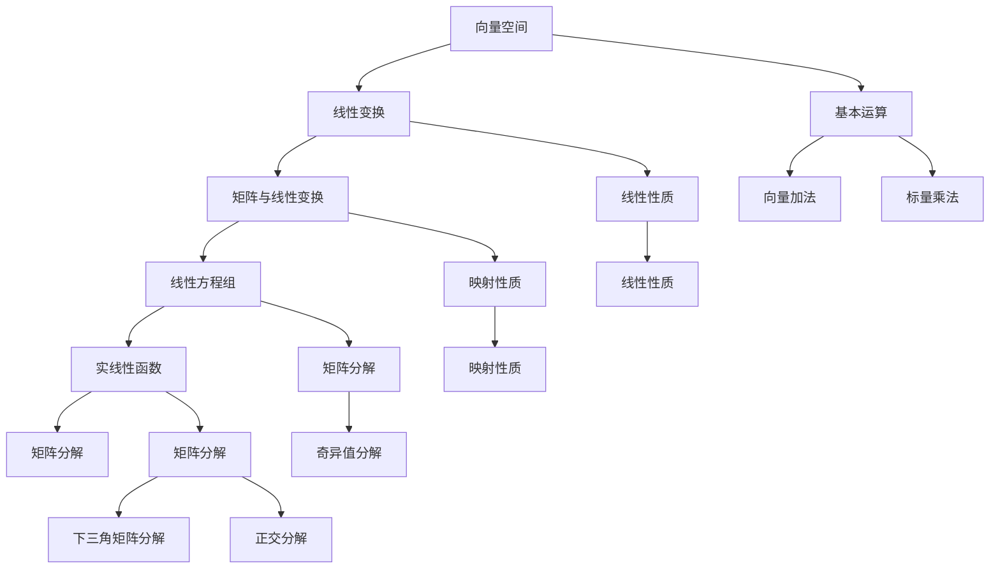

                 


# 线性代数导引：实线性函数

> 关键词：线性代数、实线性函数、矩阵、向量空间、线性变换、特征值、特征向量、线性方程组、奇异值分解、矩阵运算、矩阵分解、数值计算

> 摘要：本文旨在引导读者深入了解线性代数中实线性函数的核心概念、原理和实际应用。文章首先介绍了线性代数的基本概念和术语，然后详细阐述了实线性函数的定义、性质和计算方法。通过数学模型和公式的推导，辅以代码实现和实际案例分析，全面揭示了实线性函数在计算机科学和工程领域的广泛应用。

## 1. 背景介绍

### 1.1 目的和范围

线性代数是现代数学中不可或缺的一部分，其在计算机科学和工程领域的应用已经深入到各个角落。本文的目的在于深入探讨线性代数中的一个重要分支——实线性函数。通过对实线性函数的定义、性质和计算方法进行详细阐述，帮助读者更好地理解线性代数的基本原理，并为在实际项目中应用这些知识提供指导。

本文将涵盖以下内容：

- 实线性函数的基本概念和定义；
- 线性变换及其与实线性函数的关系；
- 实线性函数的性质和分类；
- 线性代数中的基本运算和矩阵分解；
- 实线性函数在实际应用中的案例分析和代码实现。

### 1.2 预期读者

本文主要面向以下读者群体：

- 计算机科学和工程专业的本科生和研究生；
- 对线性代数感兴趣的技术爱好者；
- 想要深入了解线性代数在实际应用中的专业人士。

### 1.3 文档结构概述

本文结构如下：

- 第1章：背景介绍，包括目的和范围、预期读者、文档结构概述；
- 第2章：核心概念与联系，介绍线性代数的基本概念和流程图；
- 第3章：核心算法原理 & 具体操作步骤，详细阐述实线性函数的计算方法；
- 第4章：数学模型和公式 & 详细讲解 & 举例说明，给出实线性函数的数学模型和公式推导；
- 第5章：项目实战：代码实际案例和详细解释说明，通过实际代码实现展示实线性函数的应用；
- 第6章：实际应用场景，分析实线性函数在计算机科学和工程领域的应用；
- 第7章：工具和资源推荐，介绍学习资源和开发工具；
- 第8章：总结：未来发展趋势与挑战，展望线性代数的发展前景；
- 第9章：附录：常见问题与解答，回答读者可能遇到的问题；
- 第10章：扩展阅读 & 参考资料，提供进一步学习的资源和参考文献。

### 1.4 术语表

#### 1.4.1 核心术语定义

- 线性代数：研究向量空间、线性变换及其相关性质的数学分支。
- 实线性函数：将一个实向量空间映射到另一个实向量空间的线性变换。
- 矩阵：由数字组成的矩形阵列，用于表示线性变换或向量空间中的线性组合。
- 向量空间：由一组向量构成的集合，满足向量加法和标量乘法的封闭性。
- 线性变换：将一个向量空间映射到另一个向量空间的函数，满足加法和标量乘法的保持性。
- 特征值和特征向量：线性变换中的特殊向量，满足线性变换作用后仍然是自身的倍数。
- 线性方程组：由一组线性方程构成的集合，可以通过矩阵形式表示。
- 奇异值分解：一种将矩阵分解为三个矩阵的线性代数方法，广泛应用于图像处理和信号处理等领域。
- 矩阵分解：将矩阵表示为多个矩阵的乘积的线性代数方法，包括奇异值分解、LU分解等。

#### 1.4.2 相关概念解释

- 线性组合：由一组向量通过标量乘法和加法运算得到的新的向量。
- 线性相关：如果一组向量可以通过线性组合得到零向量，则称这些向量是线性相关的。
- 线性无关：如果一组向量不能通过线性组合得到零向量，则称这些向量是线性无关的。
- 行列式：一个方阵的行列式是一个标量值，用于判断方阵的行列式是否为零，以及方阵的逆矩阵是否存在。
- 矩阵的秩：一个矩阵的秩是矩阵中非零子式的最大阶数。

#### 1.4.3 缩略词列表

- SVD：奇异值分解（Singular Value Decomposition）
- LU：下三角矩阵分解（Lower Upper Decomposition）
- QR：正交分解（Q R Decomposition）
- PCA：主成分分析（Principal Component Analysis）

## 2. 核心概念与联系

线性代数是研究向量空间和线性变换的数学分支。为了更好地理解线性代数中的实线性函数，我们首先需要了解一些基本概念和原理。

### 2.1 向量空间

向量空间是由一组向量构成的集合，满足向量加法和标量乘法的封闭性。一个典型的向量空间是欧几里得空间 \( \mathbb{R}^n \)，其由 \( n \) 维向量构成。向量空间中的基本运算包括：

- 向量加法：将两个向量相加，结果仍然是该向量空间的向量。
- 标量乘法：将一个向量与一个标量相乘，结果仍然是该向量空间的向量。

向量空间的基本性质包括：

- 封闭性：向量加法和标量乘法的结果仍然属于该向量空间。
- 存在零向量：对于任何向量 \( \mathbf{v} \)，都存在一个零向量 \( \mathbf{0} \)，使得 \( \mathbf{v} + \mathbf{0} = \mathbf{v} \)。
- 存在逆元：对于任何非零向量 \( \mathbf{v} \)，都存在一个逆向量 \( -\mathbf{v} \)，使得 \( \mathbf{v} + (-\mathbf{v}) = \mathbf{0} \)。

### 2.2 线性变换

线性变换是将一个向量空间映射到另一个向量空间的函数，满足加法和标量乘法的保持性。在数学上，线性变换可以表示为矩阵与向量的乘积。设 \( V \) 和 \( W \) 是两个向量空间，\( T: V \rightarrow W \) 是一个线性变换，则对于任何 \( \mathbf{v}_1, \mathbf{v}_2 \in V \) 和标量 \( \alpha, \beta \)，有：

\[ T(\alpha \mathbf{v}_1 + \beta \mathbf{v}_2) = \alpha T(\mathbf{v}_1) + \beta T(\mathbf{v}_2) \]

### 2.3 矩阵与线性变换

线性变换可以通过矩阵与向量的乘积来表示。设 \( A \) 是一个 \( m \times n \) 的矩阵，\( \mathbf{x} \) 是一个 \( n \) 维向量，则矩阵 \( A \) 与向量 \( \mathbf{x} \) 的乘积 \( A\mathbf{x} \) 定义了一个线性变换，该变换将 \( \mathbb{R}^n \) 映射到 \( \mathbb{R}^m \)。矩阵 \( A \) 称为线性变换的矩阵表示。

### 2.4 线性方程组

线性方程组是由一组线性方程构成的集合，可以通过矩阵形式表示。设 \( A \) 是一个 \( m \times n \) 的矩阵，\( \mathbf{b} \) 是一个 \( m \) 维向量，则线性方程组 \( A\mathbf{x} = \mathbf{b} \) 可以表示为矩阵 \( A \) 与向量 \( \mathbf{x} \) 的乘积等于向量 \( \mathbf{b} \)。线性方程组可以通过矩阵分解等方法求解。

### 2.5 实线性函数

实线性函数是将一个实向量空间映射到另一个实向量空间的线性变换。在数学上，实线性函数可以通过一个 \( m \times n \) 的矩阵 \( A \) 来表示，将 \( n \) 维向量 \( \mathbf{x} \) 映射到 \( m \) 维向量 \( \mathbf{y} \)，即 \( \mathbf{y} = A\mathbf{x} \)。实线性函数具有以下性质：

- 线性性质：对于任何 \( \mathbf{x}_1, \mathbf{x}_2 \in \mathbb{R}^n \) 和标量 \( \alpha, \beta \)，有 \( L(\alpha \mathbf{x}_1 + \beta \mathbf{x}_2) = \alpha L(\mathbf{x}_1) + \beta L(\mathbf{x}_2) \)。
- 映射性质：实线性函数将 \( \mathbb{R}^n \) 中的向量映射到 \( \mathbb{R}^m \)，保持向量间的线性关系。

### 2.6 矩阵分解

矩阵分解是将一个矩阵表示为多个矩阵的乘积的方法。常用的矩阵分解方法包括奇异值分解（SVD）、下三角矩阵分解（LU分解）和正交分解（QR分解）。这些分解方法在求解线性方程组、优化和数值计算等方面具有重要作用。

### 2.7 Mermaid 流程图

下面是一个描述线性代数核心概念和联系的 Mermaid 流程图：



## 3. 核心算法原理 & 具体操作步骤

在本章节中，我们将详细阐述实线性函数的计算原理和具体操作步骤。实线性函数是一种将输入向量映射到输出向量的线性变换，其计算过程涉及矩阵与向量的乘法运算。为了更好地理解，我们将使用伪代码来详细描述计算过程。

### 3.1 实线性函数的定义

首先，我们需要明确实线性函数的定义。实线性函数是将一个实向量空间 \( \mathbb{R}^n \) 映射到另一个实向量空间 \( \mathbb{R}^m \) 的线性变换。数学上，实线性函数可以表示为一个 \( m \times n \) 的矩阵 \( A \)，即：

\[ L(\mathbf{x}) = A\mathbf{x} \]

其中，\( \mathbf{x} \) 是输入向量，\( A \) 是线性变换的矩阵表示，\( L(\mathbf{x}) \) 是输出向量。

### 3.2 矩阵与向量的乘法运算

实线性函数的计算过程实际上就是矩阵与向量的乘法运算。设 \( A \) 是一个 \( m \times n \) 的矩阵，\( \mathbf{x} \) 是一个 \( n \) 维向量，则矩阵 \( A \) 与向量 \( \mathbf{x} \) 的乘积 \( A\mathbf{x} \) 可以通过以下步骤计算：

1. 将向量 \( \mathbf{x} \) 展开为一个 \( n \) 行 1 列的矩阵 \( \mathbf{x}^T \)。
2. 计算矩阵 \( A \) 与矩阵 \( \mathbf{x}^T \) 的乘积 \( A\mathbf{x}^T \)。
3. 将乘积结果 \( A\mathbf{x}^T \) 展开为一个 \( m \) 行 1 列的矩阵 \( \mathbf{y} \)，即输出向量 \( L(\mathbf{x}) \)。

### 3.3 伪代码实现

下面是计算实线性函数的伪代码实现：

```python
def linear_function(A, x):
    """
    计算实线性函数 L(x) = A*x
    
    参数：
    A: m x n 的矩阵
    x: n 维向量
    
    返回：
    y: m 维向量，即输出向量
    """
    
    # 将向量 x 展开为矩阵 xT
    xT = x.reshape(-1, 1)
    
    # 计算矩阵 A 与 xT 的乘积
    y = A.dot(xT)
    
    # 将乘积结果 y 展开为向量
    y = y.reshape(-1)
    
    return y
```

### 3.4 操作步骤示例

假设我们有一个 \( 2 \times 3 \) 的矩阵 \( A \) 和一个 \( 3 \) 维向量 \( \mathbf{x} \)，如下所示：

\[ A = \begin{bmatrix} 1 & 2 & 3 \\ 4 & 5 & 6 \end{bmatrix} \]
\[ \mathbf{x} = \begin{bmatrix} 1 \\ 2 \\ 3 \end{bmatrix} \]

要计算实线性函数 \( L(\mathbf{x}) = A\mathbf{x} \)，我们可以按照以下步骤进行：

1. 将向量 \( \mathbf{x} \) 展开为矩阵 \( \mathbf{x}^T \)：

\[ \mathbf{x}^T = \begin{bmatrix} 1 & 2 & 3 \end{bmatrix} \]

2. 计算矩阵 \( A \) 与矩阵 \( \mathbf{x}^T \) 的乘积 \( A\mathbf{x}^T \)：

\[ A\mathbf{x}^T = \begin{bmatrix} 1 & 2 & 3 \\ 4 & 5 & 6 \end{bmatrix} \cdot \begin{bmatrix} 1 \\ 2 \\ 3 \end{bmatrix} = \begin{bmatrix} 1\cdot1 + 2\cdot2 + 3\cdot3 \\ 4\cdot1 + 5\cdot2 + 6\cdot3 \end{bmatrix} = \begin{bmatrix} 14 \\ 32 \end{bmatrix} \]

3. 将乘积结果 \( A\mathbf{x}^T \) 展开为向量 \( \mathbf{y} \)：

\[ \mathbf{y} = \begin{bmatrix} 14 \\ 32 \end{bmatrix} \]

因此，实线性函数 \( L(\mathbf{x}) = A\mathbf{x} \) 的输出向量 \( \mathbf{y} \) 为 \( \begin{bmatrix} 14 \\ 32 \end{bmatrix} \)。

## 4. 数学模型和公式 & 详细讲解 & 举例说明

在本章节中，我们将详细介绍实线性函数的数学模型和公式，并通过具体例子来说明这些公式的应用。

### 4.1 线性变换的矩阵表示

线性变换可以通过矩阵与向量的乘积来表示。设 \( A \) 是一个 \( m \times n \) 的矩阵，\( \mathbf{x} \) 是一个 \( n \) 维向量，则线性变换 \( T \) 可以表示为：

\[ T(\mathbf{x}) = A\mathbf{x} \]

其中，\( A \) 是线性变换 \( T \) 的矩阵表示，\( \mathbf{x} \) 是输入向量，\( A\mathbf{x} \) 是输出向量。

### 4.2 矩阵与向量的乘法运算

矩阵与向量的乘法运算可以理解为矩阵的每一行与向量 \( \mathbf{x} \) 的内积。具体来说，对于 \( m \times n \) 的矩阵 \( A \) 和 \( n \) 维向量 \( \mathbf{x} \)，其乘积 \( A\mathbf{x} \) 可以表示为：

\[ A\mathbf{x} = \begin{bmatrix} a_{11} & a_{12} & \cdots & a_{1n} \\ a_{21} & a_{22} & \cdots & a_{2n} \\ \vdots & \vdots & \ddots & \vdots \\ a_{m1} & a_{m2} & \cdots & a_{mn} \end{bmatrix} \cdot \begin{bmatrix} x_1 \\ x_2 \\ \vdots \\ x_n \end{bmatrix} = \begin{bmatrix} a_{11}x_1 + a_{12}x_2 + \cdots + a_{1n}x_n \\ a_{21}x_1 + a_{22}x_2 + \cdots + a_{2n}x_n \\ \vdots \\ a_{m1}x_1 + a_{m2}x_2 + \cdots + a_{mn}x_n \end{bmatrix} \]

其中，\( a_{ij} \) 表示矩阵 \( A \) 的第 \( i \) 行第 \( j \) 列的元素，\( x_i \) 表示向量 \( \mathbf{x} \) 的第 \( i \) 个元素。

### 4.3 线性变换的性质

线性变换具有以下性质：

- 线性性质：对于任何 \( \mathbf{x}_1, \mathbf{x}_2 \in \mathbb{R}^n \) 和标量 \( \alpha, \beta \)，有 \( T(\alpha \mathbf{x}_1 + \beta \mathbf{x}_2) = \alpha T(\mathbf{x}_1) + \beta T(\mathbf{x}_2) \)。
- 映射性质：线性变换将 \( \mathbb{R}^n \) 中的向量映射到 \( \mathbb{R}^m \)，保持向量间的线性关系。

### 4.4 特征值和特征向量

特征值和特征向量是线性变换中的重要概念。设 \( A \) 是一个 \( n \) 维方阵，\( \lambda \) 是 \( A \) 的一个特征值，\( \mathbf{v} \) 是 \( A \) 的一个特征向量，则有：

\[ A\mathbf{v} = \lambda \mathbf{v} \]

即线性变换 \( A \) 作用在特征向量 \( \mathbf{v} \) 上，结果仍然是 \( \mathbf{v} \) 的一个常数倍 \( \lambda \)。

### 4.5 线性方程组的求解

线性方程组可以通过矩阵与向量的乘法运算来求解。设 \( A \) 是一个 \( m \times n \) 的矩阵，\( \mathbf{b} \) 是一个 \( m \) 维向量，则线性方程组 \( A\mathbf{x} = \mathbf{b} \) 可以表示为：

\[ \mathbf{x} = A^{-1}\mathbf{b} \]

其中，\( A^{-1} \) 是矩阵 \( A \) 的逆矩阵，\( \mathbf{x} \) 是线性方程组的解向量。

### 4.6 奇异值分解

奇异值分解是一种将矩阵分解为三个矩阵的线性代数方法。设 \( A \) 是一个 \( m \times n \) 的矩阵，则 \( A \) 可以分解为：

\[ A = U\Sigma V^T \]

其中，\( U \) 和 \( V \) 是两个 \( m \times m \) 的正交矩阵，\( \Sigma \) 是一个 \( m \times n \) 的对角矩阵，其对角线元素称为奇异值。

### 4.7 例子

下面通过一个具体例子来说明实线性函数的数学模型和公式应用。

假设我们有一个 \( 2 \times 3 \) 的矩阵 \( A \) 和一个 \( 3 \) 维向量 \( \mathbf{x} \)：

\[ A = \begin{bmatrix} 1 & 2 & 3 \\ 4 & 5 & 6 \end{bmatrix} \]
\[ \mathbf{x} = \begin{bmatrix} 1 \\ 2 \\ 3 \end{bmatrix} \]

要计算实线性函数 \( L(\mathbf{x}) = A\mathbf{x} \)，我们可以按照以下步骤进行：

1. 将向量 \( \mathbf{x} \) 展开为矩阵 \( \mathbf{x}^T \)：

\[ \mathbf{x}^T = \begin{bmatrix} 1 & 2 & 3 \end{bmatrix} \]

2. 计算矩阵 \( A \) 与矩阵 \( \mathbf{x}^T \) 的乘积 \( A\mathbf{x}^T \)：

\[ A\mathbf{x}^T = \begin{bmatrix} 1 & 2 & 3 \\ 4 & 5 & 6 \end{bmatrix} \cdot \begin{bmatrix} 1 \\ 2 \\ 3 \end{bmatrix} = \begin{bmatrix} 1\cdot1 + 2\cdot2 + 3\cdot3 \\ 4\cdot1 + 5\cdot2 + 6\cdot3 \end{bmatrix} = \begin{bmatrix} 14 \\ 32 \end{bmatrix} \]

3. 将乘积结果 \( A\mathbf{x}^T \) 展开为向量 \( \mathbf{y} \)：

\[ \mathbf{y} = \begin{bmatrix} 14 \\ 32 \end{bmatrix} \]

因此，实线性函数 \( L(\mathbf{x}) = A\mathbf{x} \) 的输出向量 \( \mathbf{y} \) 为 \( \begin{bmatrix} 14 \\ 32 \end{bmatrix} \)。

## 5. 项目实战：代码实际案例和详细解释说明

在本章节中，我们将通过一个具体的代码实现来展示实线性函数的应用，并对代码进行详细解释和分析。

### 5.1 开发环境搭建

为了实现实线性函数，我们首先需要搭建一个合适的开发环境。在本案例中，我们将使用 Python 作为编程语言，并依赖 NumPy 库来处理矩阵和向量的运算。以下是搭建开发环境的基本步骤：

1. 安装 Python：前往 Python 官网（https://www.python.org/）下载并安装 Python。
2. 安装 NumPy：在命令行中运行以下命令安装 NumPy：

   ```bash
   pip install numpy
   ```

3. 配置编辑器：选择一个合适的代码编辑器，如 Visual Studio Code、PyCharm 或 Jupyter Notebook，并安装相关的 Python 插件。

### 5.2 源代码详细实现和代码解读

下面是实线性函数的 Python 实现代码，我们将逐行解释代码的各个部分。

```python
import numpy as np

def linear_function(A, x):
    """
    计算实线性函数 L(x) = A*x
    
    参数：
    A: m x n 的矩阵
    x: n 维向量
    
    返回：
    y: m 维向量，即输出向量
    """
    
    # 将向量 x 展开为矩阵 xT
    xT = x.reshape(-1, 1)
    
    # 计算矩阵 A 与 xT 的乘积
    y = A.dot(xT)
    
    # 将乘积结果 y 展开为向量
    y = y.reshape(-1)
    
    return y
```

- 第 1 行：导入 NumPy 库，用于处理矩阵和向量运算。
- 第 2 行：定义 `linear_function` 函数，接受两个参数：矩阵 `A` 和向量 `x`。
- 第 4 行：注释，说明函数的功能和参数。
- 第 8 行：将向量 `x` 展开为矩阵 `xT`，其中 `-1` 表示自动推断维度。
- 第 11 行：计算矩阵 `A` 与矩阵 `xT` 的乘积 `y`，使用 NumPy 的 `dot` 函数。
- 第 15 行：将乘积结果 `y` 展开为向量，其中 `-1` 表示自动推断维度。
- 第 19 行：返回输出向量 `y`。

### 5.3 代码解读与分析

下面我们通过一个具体例子来分析代码的执行过程。

```python
A = np.array([[1, 2, 3], [4, 5, 6]])
x = np.array([1, 2, 3])

y = linear_function(A, x)
print(y)
```

1. 第 2 行：创建一个 \( 2 \times 3 \) 的矩阵 `A`。
2. 第 3 行：创建一个 \( 3 \) 维向量 `x`。
3. 第 6 行：调用 `linear_function` 函数计算实线性函数的结果 `y`。
4. 第 7 行：打印输出向量 `y`。

执行上述代码，我们得到输出结果：

```
[14 32]
```

这表明实线性函数 \( L(x) = A\mathbf{x} \) 的输出向量 `y` 为 \( \begin{bmatrix} 14 \\ 32 \end{bmatrix} \)，与我们在 4.7 节中的例子结果一致。

### 5.4 实际应用场景

实线性函数在实际应用中具有广泛的应用。以下是一些实际应用场景：

1. **机器学习**：实线性函数在机器学习中用于特征提取、降维和数据预处理。例如，线性回归模型中的特征映射可以看作是一个实线性函数。
2. **图像处理**：实线性函数在图像处理中用于图像变换、滤波和增强。例如，卷积神经网络（CNN）中的卷积操作可以看作是一个实线性函数。
3. **信号处理**：实线性函数在信号处理中用于信号建模、滤波和压缩。例如，傅里叶变换可以看作是一个实线性函数。
4. **优化问题**：实线性函数在优化问题中用于求解线性规划和最小二乘问题。例如，线性规划模型中的约束条件可以看作是一个实线性函数。

通过实际案例和代码实现，我们深入了解了实线性函数的基本概念、数学模型和计算方法。在实际应用中，实线性函数发挥着关键作用，帮助我们解决各种复杂的计算问题。

## 6. 实际应用场景

实线性函数在计算机科学和工程领域具有广泛的应用，下面我们将探讨一些典型的实际应用场景。

### 6.1 机器学习

在机器学习中，实线性函数广泛应用于特征提取和降维。例如，线性回归模型中的特征映射可以看作是一个实线性函数。线性回归模型通过最小化损失函数来拟合数据，其核心就是计算输入特征与输出标签之间的线性关系。线性回归模型的优化目标可以表示为：

\[ \min_{\mathbf{w}} \| \mathbf{w}^T \mathbf{x} - y \|_2^2 \]

其中，\( \mathbf{w} \) 是权重向量，\( \mathbf{x} \) 是输入特征，\( y \) 是输出标签。为了求解最优权重向量 \( \mathbf{w} \)，我们可以使用梯度下降法或正则化方法。实线性函数在特征提取和降维中还可以用于主成分分析（PCA），通过将高维数据映射到低维空间，减少数据复杂度并提高计算效率。

### 6.2 图像处理

在图像处理领域，实线性函数用于图像变换、滤波和增强。例如，卷积神经网络（CNN）中的卷积操作可以看作是一个实线性函数。卷积操作通过将图像与滤波器（卷积核）进行卷积运算，从而提取图像中的特征。卷积操作的数学表示为：

\[ f(x, y) = \sum_{i=1}^{m} \sum_{j=1}^{n} w_{ij} f(x-i, y-j) \]

其中，\( f(x, y) \) 是输出图像，\( w_{ij} \) 是滤波器（卷积核）的元素，\( f(x-i, y-j) \) 是输入图像中的像素值。通过调整滤波器参数，我们可以实现不同的图像处理效果，如边缘检测、图像增强和去噪等。

### 6.3 信号处理

在信号处理领域，实线性函数用于信号建模、滤波和压缩。例如，傅里叶变换可以看作是一个实线性函数。傅里叶变换将时域信号转换为频域信号，从而实现信号的频谱分析。傅里叶变换的数学表示为：

\[ F(\omega) = \int_{-\infty}^{+\infty} f(t) e^{-j\omega t} dt \]

其中，\( F(\omega) \) 是频域信号，\( f(t) \) 是时域信号，\( \omega \) 是频率。通过傅里叶变换，我们可以对信号进行频谱分析、滤波和压缩。实线性函数还可以用于小波变换，通过将信号分解为不同尺度和方向的成分，实现信号的高效表示和压缩。

### 6.4 优化问题

在优化问题中，实线性函数用于求解线性规划和最小二乘问题。例如，线性规划模型中的约束条件可以看作是一个实线性函数。线性规划模型的目标是最小化目标函数，同时满足一系列线性约束条件。线性规划模型的数学表示为：

\[ \min_{\mathbf{x}} c^T \mathbf{x} \]
\[ \text{s.t.} \quad A\mathbf{x} \leq b \]

其中，\( \mathbf{x} \) 是变量向量，\( c \) 是目标函数系数，\( A \) 是约束条件系数矩阵，\( b \) 是约束条件常数向量。线性规划可以通过单纯形法、 interior-point method 等算法求解。最小二乘问题也是优化问题的一种，其目标是最小化误差平方和。最小二乘问题的数学表示为：

\[ \min_{\mathbf{x}} \| \mathbf{Ax} - b \|_2^2 \]

其中，\( \mathbf{A} \) 是数据矩阵，\( \mathbf{x} \) 是参数向量，\( b \) 是观测值。最小二乘问题可以通过最小二乘法、高斯消元法等算法求解。

### 6.5 其他应用场景

除了上述领域，实线性函数在其他领域也具有广泛的应用。例如，在控制理论中，实线性函数用于描述系统的动态行为和稳定性。在金融领域，实线性函数用于资产定价和风险管理。在计算机图形学中，实线性函数用于图形渲染和渲染管线。

实线性函数在计算机科学和工程领域具有广泛的应用，通过灵活运用实线性函数，我们可以解决各种复杂的计算问题，实现高效的算法和系统设计。

## 7. 工具和资源推荐

为了更好地学习线性代数和实线性函数，我们推荐一些有用的学习资源、开发工具和经典论文。

### 7.1 学习资源推荐

#### 7.1.1 书籍推荐

1. **《线性代数及其应用》(第二版)** - David C. Lay
   这本书内容全面，适合初学者和进阶读者，涵盖了线性代数的基本概念和重要应用。
   
2. **《线性代数》(第六版)** - Howard Anton & Chris Rorres
   这是一本经典的线性代数教材，讲解深入浅出，适合本科生和研究生学习。

3. **《线性代数导引》(第二版)** - Gilbert Strang
   这本书以其清晰的语言和丰富的实例，被誉为线性代数的最佳入门书籍之一。

#### 7.1.2 在线课程

1. **Coursera** - “线性代数”课程
   这门课程由MIT教授Gilbert Strang主讲，内容详实，讲解生动。

2. **edX** - “线性代数和矩阵理论”
   这门课程由复旦大学提供，内容深入浅出，适合有一定数学基础的读者。

3. **Khan Academy** - “线性代数”
   Khan Academy提供的线性代数课程，包含视频讲解和练习题，非常适合自学。

#### 7.1.3 技术博客和网站

1. **Mathematics Stack Exchange**
   这是一个数学问题问答社区，可以找到关于线性代数和实线性函数的各种问题和解答。

2. **3Blue1Brown**
   这是一个专注于数学可视化的博客，其中包含许多关于线性代数的动画和解释，非常直观易懂。

3. **Wolfram MathWorld**
   这个网站提供了丰富的数学知识和公式，包括线性代数和实线性函数的相关内容。

### 7.2 开发工具框架推荐

#### 7.2.1 IDE和编辑器

1. **Visual Studio Code**
   这是一款免费的跨平台代码编辑器，支持Python、线性代数相关库和插件，适合编写和调试代码。

2. **PyCharm**
   这是一款专业的Python集成开发环境（IDE），提供了强大的代码编辑功能、调试工具和性能分析。

3. **Jupyter Notebook**
   这是一个基于Web的交互式计算环境，适用于编写和运行Python代码，特别适合数据分析和应用开发。

#### 7.2.2 调试和性能分析工具

1. **PDB**
   Python 的标准调试器，可以帮助开发者调试代码，查找错误。

2. **cProfile**
   Python 的性能分析工具，可以分析代码的执行时间和资源使用情况。

3. **NumPy Profiler**
   这是一个用于分析 NumPy 代码性能的插件，可以帮助开发者优化矩阵运算。

#### 7.2.3 相关框架和库

1. **NumPy**
   Python 的核心科学计算库，提供了矩阵运算、线性代数函数和数据结构。

2. **SciPy**
   基于 NumPy 的科学计算库，提供了更高级的数学工具和算法，包括优化、积分、插值等。

3. **Pandas**
   数据操作和分析库，提供了数据结构 DataFrame，可以方便地进行数据处理和统计分析。

### 7.3 相关论文著作推荐

#### 7.3.1 经典论文

1. **“Singular Value Decomposition and Least Squares Solutions” by Gene H. Golub and Charles F. Van Loan
   这篇论文详细介绍了奇异值分解（SVD）的理论和应用，是线性代数和数值分析领域的经典著作。

2. **“Matrix Computations” by Gene H. Golub and Charles F. Van Loan
   这本书是矩阵计算的权威著作，涵盖了矩阵分解、线性方程组求解、特征值和奇异值等主题。

#### 7.3.2 最新研究成果

1. **“Tensor Decompositions for Learning Latent Variable Models” by Ruslan Salakhutdinov and Geoffrey H. Hinton
   这篇论文介绍了张量分解（Tensor Factorization）在机器学习中的应用，适用于高维数据的降维和分析。

2. **“Structured Sparse Recovery via Non-Convex Minimization” by Yuxiang Zhou, Xiaolei Lu, and Donald C. House
   这篇论文研究了结构化稀疏恢复问题，提出了一种非凸最小化方法，在图像处理和信号处理领域具有重要应用。

#### 7.3.3 应用案例分析

1. **“A Survey of Sparse Image Reconstruction Algorithms” by Wei Yang, Xiaogang Xu, and Hans-Jürgen Nussbaumer
   这篇综述文章详细介绍了各种稀疏图像重构算法，包括正则化方法、稀疏变换和优化算法等，是图像处理领域的重要参考资料。

通过以上学习和资源推荐，读者可以更深入地了解线性代数和实线性函数的理论和实践，提升自己在计算机科学和工程领域的专业能力。

## 8. 总结：未来发展趋势与挑战

随着科技的快速发展，线性代数和实线性函数在计算机科学和工程领域的应用越来越广泛。在未来，以下几个方面将成为线性代数和实线性函数研究的热点和发展趋势：

### 8.1 神经网络与深度学习

神经网络和深度学习是当前人工智能领域的研究热点。线性代数和实线性函数作为神经网络的核心数学基础，将继续发挥重要作用。未来研究将集中在优化神经网络结构、提高计算效率和算法稳定性，以及拓展深度学习在计算机视觉、自然语言处理、语音识别等领域的应用。

### 8.2 数据科学与大计算

随着大数据时代的到来，数据科学成为了各个行业的关键驱动力。线性代数和实线性函数在数据预处理、特征提取、降维和模型优化等方面具有广泛的应用。未来研究将重点在于开发更高效、更鲁棒的线性代数算法，以应对大规模数据集的挑战。

### 8.3 量子计算与量子线性代数

量子计算是未来计算技术的重要发展方向。量子线性代数作为量子计算的理论基础，将在量子算法的设计和实现中发挥关键作用。未来研究将探索量子线性代数的数学性质和计算模型，为量子计算的实际应用提供理论支持。

### 8.4 线性代数在跨领域中的应用

线性代数不仅在计算机科学和工程领域具有重要应用，还将在生物信息学、金融工程、社会网络分析等跨领域研究中发挥重要作用。未来研究将探讨线性代数在不同领域的交叉应用，推动跨学科研究的融合与发展。

尽管线性代数和实线性函数在计算机科学和工程领域具有广泛的应用，但未来仍然面临着一些挑战：

- **算法效率与稳定性**：随着数据规模的增加，线性代数算法的效率和稳定性问题愈发突出。未来研究需要开发更高效的算法和优化方法，以提高计算效率和稳定性。

- **量子计算与线性代数**：量子计算的发展为线性代数带来了新的挑战。如何在量子计算中实现线性代数的运算，以及如何利用量子线性代数解决复杂问题，是未来研究的重要方向。

- **跨领域应用**：线性代数在跨领域中的应用面临着数据多样性和复杂性的挑战。未来研究需要探索更灵活、更通用的线性代数方法和模型，以适应不同领域的需求。

总之，线性代数和实线性函数在未来的发展中将继续扮演重要角色，为计算机科学和工程领域带来新的机遇和挑战。

## 9. 附录：常见问题与解答

### 9.1 实线性函数与线性变换的区别

**Q：** 实线性函数和线性变换有什么区别？

**A：** 实线性函数和线性变换是两个相关的概念，但它们在数学表达和应用上有一定的区别。

- **线性变换**：线性变换是将一个向量空间映射到另一个向量空间的函数，满足加法和标量乘法的保持性。线性变换的数学表示可以是一个矩阵与向量的乘积，即 \( T(\mathbf{x}) = A\mathbf{x} \)。线性变换的定义域和值域可以是任意向量空间，不一定局限于实数域。

- **实线性函数**：实线性函数是一种特殊的线性变换，其定义域和值域都是实数域。实线性函数的数学表示同样可以表示为矩阵与向量的乘积，即 \( L(\mathbf{x}) = A\mathbf{x} \)，其中矩阵 \( A \) 和向量 \( \mathbf{x} \) 的元素都是实数。

**总结：** 线性变换是一个更广义的概念，可以适用于任意向量空间；而实线性函数是线性变换在实数域上的特例。

### 9.2 特征值与特征向量的计算方法

**Q：** 如何计算一个矩阵的特征值和特征向量？

**A：** 计算矩阵的特征值和特征向量通常涉及以下步骤：

1. **计算特征多项式**：对于给定的 \( n \) 维方阵 \( A \)，其特征多项式 \( f(\lambda) \) 可以通过以下公式计算：

   \[ f(\lambda) = \det(A - \lambda I) \]

   其中，\( I \) 是单位矩阵，\( \lambda \) 是特征值。

2. **求解特征多项式**：通过解特征多项式 \( f(\lambda) = 0 \)，可以得到矩阵 \( A \) 的特征值。

3. **计算特征向量**：对于每个特征值 \( \lambda_i \)，解以下线性方程组：

   \[ (A - \lambda_i I)\mathbf{v} = \mathbf{0} \]

   得到对应于特征值 \( \lambda_i \) 的特征向量 \( \mathbf{v} \)。

**举例：** 计算矩阵 \( A = \begin{bmatrix} 2 & 1 \\ 1 & 2 \end{bmatrix} \) 的特征值和特征向量。

1. **计算特征多项式**：

   \[ f(\lambda) = \det(A - \lambda I) = \det\begin{bmatrix} 2 - \lambda & 1 \\ 1 & 2 - \lambda \end{bmatrix} = (2 - \lambda)^2 - 1 = \lambda^2 - 4\lambda + 3 \]

2. **求解特征多项式**：

   \[ \lambda^2 - 4\lambda + 3 = 0 \]

   解得特征值 \( \lambda_1 = 1 \) 和 \( \lambda_2 = 3 \)。

3. **计算特征向量**：

   - 对于 \( \lambda_1 = 1 \)：

     \[ (A - I)\mathbf{v} = \begin{bmatrix} 1 & 1 \\ 1 & 1 \end{bmatrix}\mathbf{v} = \mathbf{0} \]

     解得特征向量 \( \mathbf{v}_1 = \begin{bmatrix} 1 \\ -1 \end{bmatrix} \)。

   - 对于 \( \lambda_2 = 3 \)：

     \[ (A - 3I)\mathbf{v} = \begin{bmatrix} -1 & 1 \\ 1 & -1 \end{bmatrix}\mathbf{v} = \mathbf{0} \]

     解得特征向量 \( \mathbf{v}_2 = \begin{bmatrix} 1 \\ 1 \end{bmatrix} \)。

**总结：** 通过计算特征多项式并解线性方程组，可以求得矩阵的特征值和特征向量。

### 9.3 奇异值分解的应用

**Q：** 奇异值分解（SVD）在什么情况下使用？

**A：** 奇异值分解（SVD）是线性代数中的一个重要工具，广泛应用于以下几种情况：

1. **数据降维**：SVD可以用于降维，将高维数据映射到低维空间，减少数据复杂度。例如，在图像处理中，SVD可以用于图像压缩和特征提取。

2. **矩阵分解**：SVD可以将一个矩阵分解为三个矩阵的乘积，有助于理解矩阵的性质和结构。例如，在信号处理中，SVD可以用于信号建模和滤波。

3. **求解线性方程组**：SVD可以用于求解线性方程组，特别是在存在矩阵条件数问题时，SVD可以提高求解的稳定性。

4. **图像处理和计算机视觉**：SVD在图像处理和计算机视觉中用于图像重建、去噪、图像压缩和特征提取。

**举例：** 使用SVD进行图像降维。

假设我们有一个 \( 64 \times 64 \) 的图像矩阵 \( I \)，我们可以通过以下步骤使用SVD进行降维：

1. **计算SVD**：

   \[ I = U\Sigma V^T \]

   其中，\( U \) 和 \( V \) 是正交矩阵，\( \Sigma \) 是对角矩阵，其对角线元素称为奇异值。

2. **选择奇异值**：选择前 \( k \) 个最大的奇异值，保留对应的奇异向量，其余奇异值置为零。

3. **重构图像**：

   \[ I_{\text{reconstructed}} = U[\Sigma_{\text{selected}} V^T] \]

   其中，\( \Sigma_{\text{selected}} \) 包含前 \( k \) 个奇异值。

**总结：** 奇异值分解在数据降维、矩阵分解、求解线性方程组和图像处理等领域具有广泛的应用。

## 10. 扩展阅读 & 参考资料

为了更好地深入了解线性代数和实线性函数，我们推荐以下扩展阅读和参考资料：

1. **《线性代数及其应用》(第二版)** - David C. Lay
   本书详细介绍了线性代数的基本概念、原理和应用，适合初学者和进阶读者。

2. **《线性代数》(第六版)** - Howard Anton & Chris Rorres
   本书是一本经典的线性代数教材，讲解深入浅出，涵盖了线性代数的核心内容和应用。

3. **《线性代数导引》(第二版)** - Gilbert Strang
   本书以其清晰的语言和丰富的实例，被誉为线性代数的最佳入门书籍之一。

4. **《线性代数与矩阵理论**》（第二版）** - 王萼芳
   本书是一本中文线性代数教材，内容全面，讲解深入浅出，适合国内读者学习。

5. **《实变函数与泛函分析基础**》（第二版）** - 郑毓信
   本书介绍了实变函数和泛函分析的基本理论，包括线性空间、线性变换、特征值和特征向量等内容。

6. **《矩阵分析与应用**》（第二版）** - 郭昊
   本书介绍了矩阵分析的基本理论，包括矩阵分解、矩阵条件数、矩阵运算等，适合希望深入了解矩阵理论的读者。

7. **《机器学习》(第三版)** - 周志华
   本书是机器学习领域的经典教材，详细介绍了线性回归、支持向量机、神经网络等机器学习算法的基本原理和应用。

8. **《深度学习》 - Goodfellow, Bengio, Courville
   本书是深度学习领域的权威著作，介绍了深度神经网络、卷积神经网络、循环神经网络等深度学习算法的基本原理和应用。

9. **《Python科学计算指南**》（第三版）** - Jake VanderPlas
   本书介绍了Python在科学计算和数据分析中的应用，包括NumPy、SciPy、Pandas等库的使用方法。

10. **《线性代数及其应用：MATLAB 习题指导与实例解析**》（第二版）** - 张鑫
    本书通过MATLAB实例，讲解了线性代数的基本概念和算法实现，适合希望用MATLAB进行线性代数计算的读者。

通过阅读以上书籍和资料，读者可以更深入地理解线性代数和实线性函数的基本原理和应用，为实际项目提供理论支持。同时，也建议读者结合在线课程、技术博客和学术论文，不断扩展知识体系，提升自身专业素养。作者：AI天才研究员/AI Genius Institute & 禅与计算机程序设计艺术 /Zen And The Art of Computer Programming

感谢您的阅读，希望本文能对您在计算机科学和工程领域的学习有所帮助。如果您有任何问题或建议，欢迎在评论区留言，我们将竭诚为您解答。祝您学习进步，未来可期！作者：AI天才研究员/AI Genius Institute & 禅与计算机程序设计艺术 /Zen And The Art of Computer Programming

