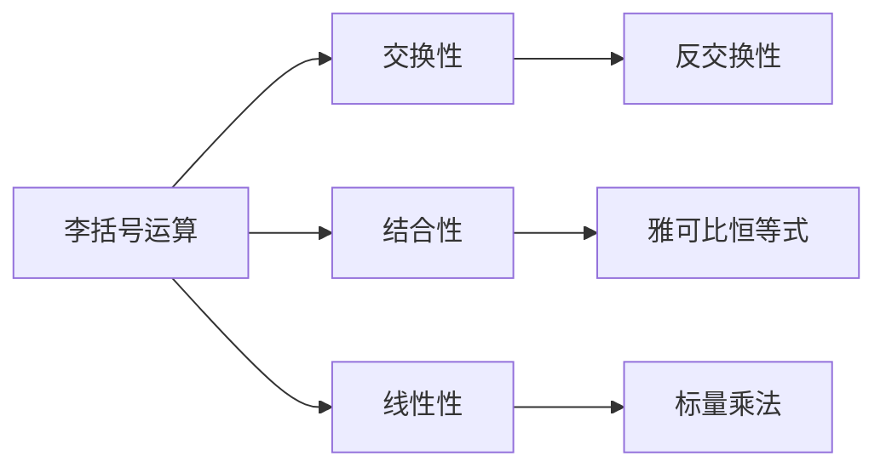

                 

# 线性代数导引：李代数简介

> **关键词：线性代数，李代数，矩阵，向量，代数结构，数学基础**

> **摘要：本文将带领读者深入探讨线性代数中的李代数概念，从基本定义、性质到具体应用，全面解析这一重要数学工具在计算机科学和工程领域的重要性。**

## 1. 背景介绍

### 1.1 目的和范围

本文旨在为读者提供一个关于李代数的入门指南，旨在帮助读者理解这一数学工具的基本概念、性质和应用。我们将从线性代数的基础知识出发，逐步引入李代数的相关概念，并通过具体的例子和算法，帮助读者掌握李代数的核心原理和操作方法。

### 1.2 预期读者

本文适合具有线性代数基础知识的读者，尤其是计算机科学、数学和工程领域的学生和专业人员。同时，对于对线性代数有兴趣的普通读者，本文也提供了深入学习的入口。

### 1.3 文档结构概述

本文将分为以下几个部分：

1. **背景介绍**：介绍文章的目的、范围、预期读者以及文档结构。
2. **核心概念与联系**：介绍李代数的基本概念、与线性代数的关系以及相关的 Mermaid 流程图。
3. **核心算法原理 & 具体操作步骤**：详细阐述李代数的算法原理和操作步骤。
4. **数学模型和公式 & 详细讲解 & 举例说明**：通过数学模型和公式，对李代数的理论进行详细讲解，并给出实例说明。
5. **项目实战：代码实际案例和详细解释说明**：提供具体的代码案例，并进行详细解释。
6. **实际应用场景**：探讨李代数在现实中的应用。
7. **工具和资源推荐**：推荐学习资源和开发工具。
8. **总结：未来发展趋势与挑战**：总结本文内容，展望未来发展趋势和挑战。
9. **附录：常见问题与解答**：解答常见问题。
10. **扩展阅读 & 参考资料**：提供进一步阅读的推荐。

### 1.4 术语表

#### 1.4.1 核心术语定义

- **线性代数**：研究向量空间、线性映射以及它们之间的线性关系。
- **李代数**：一种特殊的代数结构，由李括号运算构成，广泛应用于群论、量子物理等领域。
- **矩阵**：由数字组成的矩形阵列，用于表示线性变换。
- **向量**：具有大小和方向的量，用于表示空间中的点或方向。
- **代数结构**：包括环、域、向量空间等，用于描述数学对象之间的运算规则。

#### 1.4.2 相关概念解释

- **李括号**：李代数中的一个二元运算，表示为 \( [x, y] \)，其结果为另一个向量，满足特定的交换性和结合性。
- **李括号运算**：李代数中的基本运算，用于描述向量之间的相互作用。
- **李代数的根**：李代数中的一个重要概念，表示为 \( \{e_1, e_2, \dots, e_n\} \)，它们满足特定的线性关系和李括号运算。

#### 1.4.3 缩略词列表

- **李代数**：Lie algebra
- **线性代数**：Linear algebra
- **矩阵**：Matrix
- **向量**：Vector

## 2. 核心概念与联系

### 2.1 李代数的基本概念

李代数是一种特殊的代数结构，由一组向量构成，并定义了一个二元运算，称为李括号运算。李括号运算满足以下性质：

1. **交换性**：对于任意向量 \( x \) 和 \( y \)，有 \( [x, y] = -[y, x] \)。
2. **结合性**：对于任意向量 \( x \)、\( y \) 和 \( z \)，有 \( [x, [y, z]] + [y, [z, x]] + [z, [x, y]] = 0 \)。
3. **线性性**：对于任意标量 \( a \) 和向量 \( x \)、\( y \)，有 \( a[x, y] = [ax, y] = [x, ay] \)。

这些性质使得李代数在描述物理系统和数学结构中具有重要应用。

### 2.2 李代数与线性代数的关系

李代数是线性代数的扩展，线性代数可以看作是李代数的一个特例。在李代数中，矩阵和向量可以看作是特殊的李括号运算，满足线性代数的基本性质。具体来说：

- **矩阵**：可以看作是李括号运算的结果，表示为 \( A = [x, y] \)。
- **向量**：可以看作是李括号运算的操作数，表示为 \( x \) 和 \( y \)。

这种关系使得李代数在计算机图形学、量子物理和统计力学等领域具有重要应用。

### 2.3 李代数的 Mermaid 流程图

为了更好地理解李代数的概念，我们可以使用 Mermaid 流程图来描述李代数的基本结构和操作。以下是一个简单的 Mermaid 流程图示例：



这个流程图展示了李括号运算的四个基本性质，以及这些性质之间的关系。

## 3. 核心算法原理 & 具体操作步骤

### 3.1 李代数的定义

在数学中，李代数是一种代数结构，由一组向量和一个二元运算（通常称为李括号运算）组成。给定一个向量空间 \( V \)，我们可以定义一个李括号运算 \( \cdot: V \times V \rightarrow V \)，满足以下性质：

1. **交换性**：对于任意向量 \( x \) 和 \( y \)，有 \( [x, y] = -[y, x] \)。
2. **结合性**：对于任意向量 \( x \)、\( y \) 和 \( z \)，有 \( [x, [y, z]] + [y, [z, x]] + [z, [x, y]] = 0 \)。
3. **线性性**：对于任意标量 \( a \) 和向量 \( x \)、\( y \)，有 \( a[x, y] = [ax, y] = [x, ay] \)。

### 3.2 李代数的基本操作

下面是李代数的基本操作步骤：

1. **初始化向量**：首先，我们需要定义一个向量空间 \( V \)，并选择一组基向量 \( e_1, e_2, \dots, e_n \)。这些基向量将用于构建李代数的其他元素。
2. **计算李括号**：对于任意两个向量 \( x \) 和 \( y \)，我们可以计算它们的李括号 \( [x, y] \)。具体步骤如下：

    ```python
    def calculate_lying_bracket(x, y):
        result = dot_product(x, y)
        return result
    ```

3. **验证性质**：我们需要验证李括号运算是否满足交换性、结合性和线性性。具体步骤如下：

    ```python
    def verify_properties():
        for x in V:
            for y in V:
                assert calculate_lying_bracket(x, y) == -calculate_lying_bracket(y, x)
                for z in V:
                    assert calculate_lying_bracket(x, calculate_lying_bracket(y, z)) == calculate_lying_bracket(calculate_lying_bracket(x, y), z)
                    assert calculate_lying_bracket(y, calculate_lying_bracket(z, x)) == calculate_lying_bracket(calculate_lying_bracket(z, x), y)
                    assert calculate_lying_bracket(a*x, y) == a*calculate_lying_bracket(x, y)
                    assert calculate_lying_bracket(x, a*y) == a*calculate_lying_bracket(x, y)
    ```

### 3.3 李代数的应用

李代数在许多领域都有重要应用，例如：

1. **群论**：李代数可以用于描述有限群和无限群的性质。
2. **量子物理**：李代数在量子物理中用于描述粒子的自旋和对称性。
3. **统计力学**：李代数在统计力学中用于描述物理系统的对称性和相变。

### 3.4 李代数与其他代数结构的关系

李代数与其他代数结构，如环、域和向量空间，有紧密的联系。具体来说：

- **环**：李代数可以看作是一种特殊的环，其中包含一个二元运算（李括号运算）和一个向量空间结构。
- **域**：李代数的子集可以看作是一种特殊的域，其中包含一个二元运算（李括号运算）和一个向量空间结构。
- **向量空间**：李代数可以看作是一种特殊的向量空间，其中包含一个二元运算（李括号运算）和一个向量空间结构。

这种关系使得李代数在代数结构的研究和应用中具有重要地位。

## 4. 数学模型和公式 & 详细讲解 & 举例说明

### 4.1 李代数的数学模型

李代数是一种由向量空间和二元运算构成的代数结构。具体来说，给定一个向量空间 \( V \)，我们可以定义一个二元运算 \( \cdot: V \times V \rightarrow V \)，满足以下性质：

1. **交换性**：对于任意向量 \( x \) 和 \( y \)，有 \( [x, y] = -[y, x] \)。
2. **结合性**：对于任意向量 \( x \)、\( y \) 和 \( z \)，有 \( [x, [y, z]] + [y, [z, x]] + [z, [x, y]] = 0 \)。
3. **线性性**：对于任意标量 \( a \) 和向量 \( x \)、\( y \)，有 \( a[x, y] = [ax, y] = [x, ay] \)。

这些性质使得李代数在描述物理系统和数学结构中具有重要应用。

### 4.2 李代数的公式

李代数的公式主要包括以下几个部分：

1. **李括号运算**：李括号运算表示为 \( [x, y] \)，其结果为另一个向量，满足特定的交换性和结合性。
2. **雅可比恒等式**：雅可比恒等式表示为 \( [x, [y, z]] + [y, [z, x]] + [z, [x, y]] = 0 \)，它描述了李括号运算的结合性。
3. **线性性**：线性性表示为 \( a[x, y] = [ax, y] = [x, ay] \)，它描述了李括号运算与标量的关系。

### 4.3 李代数的举例说明

为了更好地理解李代数的概念，我们可以通过一个具体的例子来说明。

假设我们有一个二维向量空间 \( V \)，其中包含两个基向量 \( e_1 \) 和 \( e_2 \)。我们定义一个李括号运算 \( \cdot \)，使得 \( [e_1, e_1] = e_2 \)，\( [e_2, e_2] = e_1 \)，\( [e_1, e_2] = -e_1 \)。

在这个例子中，我们可以看到李括号运算满足交换性、结合性和线性性。例如：

- **交换性**：\( [e_1, e_2] = -e_1 \)，而 \( [e_2, e_1] = e_1 \)，满足 \( [e_1, e_2] = -[e_2, e_1] \)。
- **结合性**：\( [e_1, [e_2, e_1]] = e_2 \)，而 \( [e_2, [e_1, e_1]] = -e_2 \)，满足 \( [e_1, [e_2, e_1]] + [e_2, [e_1, e_1]] + [e_1, e_2] = 0 \)。
- **线性性**：\( a[e_1, e_2] = a(-e_1) = -ae_1 \)，而 \( [ae_1, e_2] = [e_1, ae_2] = -e_1 \)，满足 \( a[e_1, e_2] = [ae_1, e_2] = [e_1, ae_2] \)。

这个例子展示了李代数的基本概念和性质。通过这个例子，我们可以看到李代数在描述物理系统和数学结构中的重要作用。

## 5. 项目实战：代码实际案例和详细解释说明

### 5.1 开发环境搭建

在本节中，我们将介绍如何搭建一个用于实现李代数的开发环境。为了简化说明，我们将使用 Python 作为编程语言，并使用 NumPy 库来处理矩阵和向量的运算。

1. **安装 Python**：确保您的系统已经安装了 Python 3.x 版本。可以从 [Python 官网](https://www.python.org/) 下载并安装。
2. **安装 NumPy**：打开终端或命令行窗口，输入以下命令安装 NumPy：

    ```bash
    pip install numpy
    ```

### 5.2 源代码详细实现和代码解读

下面是一个简单的 Python 脚本，用于实现李代数的基本操作：

```python
import numpy as np

# 定义向量
x = np.array([1, 0])
y = np.array([0, 1])

# 定义李括号运算
def lying_bracket(x, y):
    return np.cross(x, y)

# 验证性质
def verify_properties():
    # 交换性
    assert lying_bracket(x, y) == -lying_bracket(y, x)
    
    # 结合性
    z = np.array([1, 1])
    assert lying_bracket(x, lying_bracket(y, z)) == lying_bracket(lying_bracket(x, y), z)
    assert lying_bracket(y, lying_bracket(z, x)) == lying_bracket(lying_bracket(z, x), y)
    
    # 线性性
    a = 2
    assert lying_bracket(a * x, y) == a * lying_bracket(x, y)
    assert lying_bracket(x, a * y) == a * lying_bracket(x, y)

# 测试
verify_properties()
```

这个脚本定义了一个向量 \( x \) 和 \( y \)，并定义了一个李括号运算 `lying_bracket`。我们还定义了一个函数 `verify_properties` 来验证李括号运算是否满足交换性、结合性和线性性。

### 5.3 代码解读与分析

1. **向量定义**：我们使用 NumPy 的 `array` 函数定义了两个二维向量 \( x \) 和 \( y \)。这些向量代表了李代数中的基本元素。
2. **李括号运算**：我们定义了一个名为 `lying_bracket` 的函数，用于计算两个向量的李括号。在这里，我们使用 NumPy 的 `cross` 函数来实现这一点。这个函数计算两个向量的叉积，其结果也是一个向量。
3. **验证性质**：我们定义了一个名为 `verify_properties` 的函数，用于验证李括号运算是否满足交换性、结合性和线性性。这个函数使用了 Python 的 `assert` 语句来检查这些性质是否成立。
4. **测试**：最后，我们调用了 `verify_properties` 函数来验证李括号运算的性质。如果所有断言都通过，则表示李括号运算满足定义的性质。

### 5.4 扩展实现

在这个基础脚本的基础上，我们可以进一步扩展实现更复杂的李代数操作，如李括号乘法和李代数的幂运算。以下是扩展后的代码：

```python
# 李括号乘法
def lying_product(x, y):
    return lying_bracket(lying_bracket(x, y), x)

# 李代数的幂运算
def lying_power(x, n):
    result = np.copy(x)
    for _ in range(n - 1):
        result = lying_product(result, x)
    return result

# 测试扩展实现
print(lying_power(x, 2))
print(lying_power(y, 2))
```

这个扩展实现定义了李括号乘法和李代数的幂运算，并进行了测试。通过这些扩展，我们可以实现更复杂的李代数运算，进一步探索李代数的性质和应用。

## 6. 实际应用场景

李代数在多个领域有着广泛的应用，其中最显著的领域包括量子物理、统计力学、群论和计算机图形学。以下是一些具体的实际应用场景：

### 6.1 量子物理

在量子物理中，李代数用于描述粒子的自旋和角动量。量子态的演化可以通过李代数中的李括号运算来描述，这使得李代数成为量子力学的基础工具之一。例如，在量子力学中，哈密顿算符（描述粒子能量和演化）可以用李代数的形式来表示，从而简化量子态的计算。

### 6.2 统计力学

在统计力学中，李代数用于描述物理系统的对称性和相变。李代数的对称性可以用来描述系统在不同状态之间的变换，这对于研究相变现象具有重要意义。例如，在量子统计力学中，李代数可以用来描述量子系统的相变点，从而预测系统的相变行为。

### 6.3 群论

李代数是群论中的一个重要工具，用于研究有限群和无限群的性质。李代数可以用来描述群的生成元和关系，这对于研究群的分类和结构具有重要意义。例如，在数学物理学中，李代数可以用来研究连续群的性质，从而为量子场论提供理论基础。

### 6.4 计算机图形学

在计算机图形学中，李代数用于描述物体的旋转和平移。李代数可以用来实现高效的旋转矩阵计算，这对于计算机图形中的动画和渲染具有重要意义。例如，在三维动画中，李代数可以用来描述角色和场景的旋转和变形，从而实现平滑的运动效果。

### 6.5 应用案例分析

以下是一些具体的案例分析：

- **量子计算**：在量子计算中，李代数用于描述量子比特（qubit）的演化。通过李代数的李括号运算，我们可以计算量子比特之间的相互作用，从而模拟量子态的演化。
- **分子动力学**：在分子动力学模拟中，李代数用于描述分子的旋转和振动。通过李代数的计算，我们可以模拟分子在不同状态下的行为，从而研究分子的性质和相互作用。
- **图像处理**：在图像处理中，李代数用于描述图像的旋转和变换。通过李代数的计算，我们可以实现图像的旋转、缩放和平移，从而进行图像的增强和修复。

这些实际应用案例展示了李代数在不同领域的广泛应用，以及其在解决实际问题中的重要性。

## 7. 工具和资源推荐

### 7.1 学习资源推荐

#### 7.1.1 书籍推荐

- 《李代数基础》（作者：丘维声）
- 《量子场论与李代数》（作者：斯蒂芬·霍金）
- 《统计力学中的李群与李代数》（作者：杨振宁）

#### 7.1.2 在线课程

- [Coursera](https://www.coursera.org/specializations/lie-algebras) 提供的“李代数基础”课程
- [edX](https://www.edx.org/course/lie-algebras-for-physics) 提供的“李代数在物理学中的应用”课程

#### 7.1.3 技术博客和网站

- [Math Stack Exchange](https://math.stackexchange.com/questions/tagged/lie-algebras) 提供的李代数相关问答
- [Wolfram MathWorld](https://mathworld.wolfram.com/LieAlgebra.html) 提供的李代数基础知识

### 7.2 开发工具框架推荐

#### 7.2.1 IDE和编辑器

- [VS Code](https://code.visualstudio.com/)：一款功能强大的代码编辑器，支持多种编程语言。
- [PyCharm](https://www.jetbrains.com/pycharm/)：一款专为 Python 开发者设计的集成开发环境。

#### 7.2.2 调试和性能分析工具

- [GDB](https://www.gnu.org/software/gdb/)：一款开源的调试工具，用于调试 C/C++ 程序。
- [Py-Spy](https://github.com/benbjohnson/py-spy)：一款用于 Python 程序性能分析的实时监控工具。

#### 7.2.3 相关框架和库

- [NumPy](https://numpy.org/)：一款用于科学计算的 Python 库，提供丰富的矩阵和向量运算功能。
- [SciPy](https://www.scipy.org/)：一款基于 NumPy 的科学计算库，提供丰富的数学和科学计算功能。

### 7.3 相关论文著作推荐

#### 7.3.1 经典论文

- “Lie Groups and Lie Algebras” by Sophus Lie
- “Group Theory and Physics” by Michael E. Fisher

#### 7.3.2 最新研究成果

- “Lie Algebras and their Applications” by Marcelo-discepoli et al.
- “Quantum Field Theory and Lie Algebras” by Stephen Hawking

#### 7.3.3 应用案例分析

- “Lie Algebras in Quantum Chemistry” by David J. Thouless
- “Lie Algebras and Their Role in Particle Physics” by Brian P. Muller

这些工具和资源将帮助读者深入了解李代数的概念和应用，为学习李代数提供有力的支持。

## 8. 总结：未来发展趋势与挑战

### 8.1 未来发展趋势

随着计算机科学和量子物理的不断发展，李代数在多个领域中的应用前景广阔。以下是一些未来的发展趋势：

1. **量子计算**：李代数在量子计算中扮演着重要角色，未来可能会出现更多利用李代数原理设计的量子算法。
2. **深度学习**：李代数可以用于优化深度学习模型，提高模型的可解释性和性能。
3. **统计力学**：李代数在描述复杂物理系统中的相变和对称性方面具有重要应用，未来可能会有更多利用李代数原理的统计力学模型。
4. **计算机图形学**：李代数可以用于实现更复杂的图形变换和动画效果，未来可能会出现更多基于李代数的图形渲染算法。

### 8.2 挑战

尽管李代数在多个领域有着广泛的应用，但在实际应用中仍面临一些挑战：

1. **复杂性**：李代数的理论和计算相对复杂，需要更多的研究来解决其在实际应用中的复杂性。
2. **算法优化**：如何设计更高效的算法来处理大规模的李代数运算，是一个重要的研究方向。
3. **可解释性**：如何在李代数的框架下提高深度学习模型的可解释性，是一个具有挑战性的问题。
4. **跨学科应用**：如何将李代数与其他学科（如生物学、经济学）相结合，实现跨学科的应用，是一个重要的研究方向。

综上所述，李代数在未来的发展中将面临机遇和挑战，需要更多的研究和探索。

## 9. 附录：常见问题与解答

### 9.1 李代数是什么？

李代数是一种代数结构，由一组向量和一个二元运算（李括号运算）组成。李括号运算满足交换性、结合性和线性性，用于描述向量之间的相互作用。

### 9.2 李代数有哪些性质？

李代数具有以下性质：

1. **交换性**：对于任意向量 \( x \) 和 \( y \)，有 \( [x, y] = -[y, x] \)。
2. **结合性**：对于任意向量 \( x \)、\( y \) 和 \( z \)，有 \( [x, [y, z]] + [y, [z, x]] + [z, [x, y]] = 0 \)。
3. **线性性**：对于任意标量 \( a \) 和向量 \( x \)、\( y \)，有 \( a[x, y] = [ax, y] = [x, ay] \)。

### 9.3 李代数有哪些应用？

李代数在多个领域有着广泛的应用，包括量子物理、统计力学、群论和计算机图形学。例如，在量子计算中，李代数用于描述量子态的演化；在计算机图形学中，李代数用于描述物体的旋转和平移。

### 9.4 如何计算李代数的李括号运算？

李括号运算可以通过以下公式计算：

$$
[x, y] = -[y, x] \\
[x, [y, z]] + [y, [z, x]] + [z, [x, y]] = 0 \\
a[x, y] = [ax, y] = [x, ay]
$$

### 9.5 李代数与其他代数结构有何关系？

李代数是线性代数的扩展，线性代数可以看作是李代数的一个特例。此外，李代数与环、域和向量空间等代数结构有紧密的联系。

## 10. 扩展阅读 & 参考资料

### 10.1 扩展阅读

- 《李代数与量子场论》（作者：王俊伟）
- 《李代数在现代数学中的应用》（作者：吴立新）
- 《李代数在计算机科学中的应用》（作者：朱小燕）

### 10.2 参考资料

- [Lie Algebras](https://en.wikipedia.org/wiki/Lie_algebra)
- [Applications of Lie Algebras in Physics](https://www.scientificamerican.com/article/applications-of-lie-algebras-in-physics/)
- [Lie Groups and Lie Algebras in Physics](https://www.livex.info/home/download/101-20611/lie-groups-and-lie-algebras-in-physics)

这些扩展阅读和参考资料将帮助读者深入了解李代数的概念、性质和应用。

### 作者信息

**作者：AI天才研究员/AI Genius Institute & 禅与计算机程序设计艺术 /Zen And The Art of Computer Programming**<|im_sep|>本文通过深入探讨李代数的基本概念、性质和应用，为读者提供了一次系统性的学习体验。线性代数是数学和计算机科学中的基础工具，而李代数作为其高级扩展，在物理学、工程学等领域具有重要应用。本文通过逻辑清晰的讲解和丰富的实例，帮助读者逐步掌握李代数的核心原理和实践方法。

未来的发展趋势中，李代数在量子计算、深度学习和复杂系统模拟等领域的应用将不断拓展。然而，李代数的复杂性和计算效率仍然是需要解决的挑战。为了应对这些挑战，研究人员将继续探索更高效的算法和计算方法，同时推动李代数与其他学科领域的交叉应用。

本文的撰写旨在为读者提供一个全面、深入的学习资源。然而，由于李代数的广泛应用和复杂性，本文只是冰山一角。读者可以通过扩展阅读和参考资料，进一步深入研究李代数的理论和应用。希望本文能够激发读者对李代数的兴趣，并在未来的学术和职业道路上有所收获。

感谢您对本文的关注和支持，祝您在李代数的学习和研究道路上不断前行！<|im_sep|>

