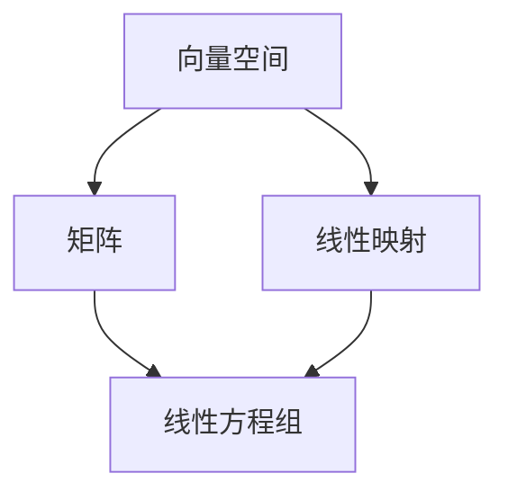

                 

# 线性代数导引：等价关系

> 关键词：线性代数、等价关系、数学基础、抽象思维、数学建模

> 摘要：本文旨在深入探讨线性代数中的等价关系概念，通过详细的数学模型和具体操作步骤，帮助读者理解和掌握等价关系的本质与应用。本文将分为多个章节，首先介绍线性代数的基本概念，然后逐步引入等价关系的定义、性质和计算方法，最后通过具体项目和实际案例，展示等价关系在现实中的应用和价值。

## 1. 背景介绍

### 1.1 目的和范围

本文的目标是引导读者深入理解线性代数中的等价关系，帮助读者构建扎实的数学基础，培养抽象思维能力。文章将涵盖以下范围：

- 线性代数的基本概念
- 等价关系的定义与性质
- 等价关系的计算方法
- 等价关系在数学建模中的应用
- 实际项目案例解析

### 1.2 预期读者

本文适合以下读者群体：

- 计算机科学专业的本科生和研究生
- 对线性代数和数学建模感兴趣的工程师
- 对抽象思维和数学理论有兴趣的读者
- 希望提高数学素养的教育工作者

### 1.3 文档结构概述

本文分为十个部分：

- 1. 背景介绍
- 2. 核心概念与联系
- 3. 核心算法原理 & 具体操作步骤
- 4. 数学模型和公式 & 详细讲解 & 举例说明
- 5. 项目实战：代码实际案例和详细解释说明
- 6. 实际应用场景
- 7. 工具和资源推荐
- 8. 总结：未来发展趋势与挑战
- 9. 附录：常见问题与解答
- 10. 扩展阅读 & 参考资料

### 1.4 术语表

#### 1.4.1 核心术语定义

- 线性代数：研究向量空间、线性映射、线性方程组的数学分支。
- 等价关系：在集合中的元素间定义的一种关系，具有自反性、对称性和传递性。
- 向量空间：一个集合，其中的元素称为向量，满足加法和数乘运算的封闭性。

#### 1.4.2 相关概念解释

- 矩阵：一个由数字组成的二维数组，用于表示线性映射或线性方程组。
- 行列式：一个标量值，用于描述矩阵的几何性质。

#### 1.4.3 缩略词列表

- LAG：线性代数（Linear Algebra）
- VRP：向量空间（Vector Space）
- SVD：奇异值分解（ Singular Value Decomposition）

## 2. 核心概念与联系

在深入研究等价关系之前，我们需要了解线性代数的一些核心概念，如向量空间和矩阵。下面我们将使用Mermaid流程图来展示这些概念之间的联系。



在这个流程图中，我们可以看到：

- 向量空间是矩阵和线性映射的基础。
- 矩阵用于表示线性映射，也可以表示线性方程组。
- 线性映射是向量空间之间的转换。

接下来，我们将正式引入等价关系的概念。

### 2.1 等价关系的定义

等价关系是数学中一个重要的概念，它定义在集合上的一个二元关系。具体来说，对于集合A上的一个二元关系R，如果它满足以下三个性质，则称R为A上的等价关系：

1. **自反性**：对于任意的x∈A，有xRx。
2. **对称性**：对于任意的x，y∈A，如果xRy，则yRx。
3. **传递性**：对于任意的x，y，z∈A，如果xRy且yRz，则xRz。

等价关系的一个经典例子是“同余关系”。在整数集合Z上，对于任意的a，b，c∈Z，a与b同余（记作a ≡ b (mod n)）当且仅当a与b对某个固定的整数n取余后结果相同。同余关系显然满足自反性、对称性和传递性，因此是一个等价关系。

### 2.2 等价关系在向量空间中的应用

在向量空间中，等价关系可以用于分类和简化问题。例如，考虑一个线性映射T：V → W，其中V和W是向量空间。我们可以定义一个等价关系R在V上，使得对于任意的向量v1，v2∈V，v1Rv2当且仅当T(v1) = T(v2)。

这个等价关系将V划分为若干个等价类，每个等价类包含了在同一个线性映射下映射到同一个向量W中的向量。这种分类可以帮助我们简化对复杂线性映射的理解和处理。

## 3. 核心算法原理 & 具体操作步骤

为了深入理解等价关系，我们需要掌握计算等价关系的一些核心算法。下面将介绍两个重要的算法：等价关系的构造方法和等价关系的判定方法。

### 3.1 等价关系的构造方法

构造等价关系的方法有多种，其中最常用的方法是基于某种划分或分类准则。以下是一个简单的构造方法：

#### 步骤 1：选择分类准则

首先，我们需要选择一个分类准则，这个准则将决定如何将集合中的元素划分为若干个等价类。例如，在整数集合Z上，我们可以选择模n同余作为分类准则。

#### 步骤 2：定义二元关系

根据分类准则，我们定义一个二元关系R。例如，对于Z上的模n同余，我们可以定义R为“a与b同余”，即aRb当且仅当a ≡ b (mod n)。

#### 步骤 3：验证等价关系性质

我们需要验证定义的二元关系R是否满足自反性、对称性和传递性。如果满足，则R是一个等价关系。

### 3.2 等价关系的判定方法

判定一个给定的二元关系是否为等价关系，通常有以下两种方法：

#### 方法 1：直接验证

直接验证方法是逐个验证二元关系R是否满足自反性、对称性和传递性。这种方法适用于简单的二元关系。

#### 方法 2：构造划分

构造划分方法是利用等价关系将集合划分为若干个等价类，然后验证每个等价类是否满足互异性。具体步骤如下：

1. 根据二元关系R，将集合A划分为若干个等价类。
2. 验证每个等价类中的任意两个元素是否满足R。
3. 如果所有等价类都满足互异性，则R是一个等价关系。

### 3.3 算法示例

下面通过一个具体的例子来说明等价关系的构造和判定方法。

#### 示例 1：整数集合上的模3同余

给定整数集合Z，我们定义一个二元关系R为“模3同余”，即对于任意的a，b∈Z，aRb当且仅当a ≡ b (mod 3)。

**步骤 1**：选择分类准则

选择模3同余作为分类准则。

**步骤 2**：定义二元关系

定义R为“模3同余”。

**步骤 3**：验证等价关系性质

- 自反性：对于任意的a∈Z，a ≡ a (mod 3)，因此R满足自反性。
- 对称性：对于任意的a，b∈Z，如果a ≡ b (mod 3)，则b ≡ a (mod 3)，因此R满足对称性。
- 传递性：对于任意的a，b，c∈Z，如果a ≡ b (mod 3)且b ≡ c (mod 3)，则a ≡ c (mod 3)，因此R满足传递性。

因此，R是一个等价关系。

#### 示例 2：矩阵的行等价

给定一个矩阵集合M，我们定义一个二元关系R为“行等价”，即对于任意的A，B∈M，如果A和B的每一行都成比例，则A和R。

**步骤 1**：选择分类准则

选择行等价作为分类准则。

**步骤 2**：定义二元关系

定义R为“行等价”。

**步骤 3**：验证等价关系性质

- 自反性：对于任意的A∈M，A的每一行都与自身成比例，因此A和A行等价。
- 对称性：对于任意的A，B∈M，如果A和B行等价，则B和A行等价。
- 传递性：对于任意的A，B，C∈M，如果A和B行等价，B和C行等价，则A和C行等价。

因此，R是一个等价关系。

通过这两个示例，我们可以看到等价关系的构造和判定方法的具体应用。在实际问题中，我们可以根据具体情况选择合适的构造方法和判定方法。

## 4. 数学模型和公式 & 详细讲解 & 举例说明

在理解了等价关系的基本概念和构造方法之后，我们需要进一步探讨等价关系的数学模型和公式。等价关系在数学中有着广泛的应用，尤其是在线性代数和抽象代数中。以下将详细讲解等价关系的相关数学模型和公式，并通过具体例子来说明其应用。

### 4.1 等价关系的数学模型

等价关系可以看作是一个特殊的集合划分。在集合论中，一个集合的划分可以表示为该集合的一个子集族，其中每个子集称为一个等价类，且这些等价类之间两两不相交。用数学语言描述，假设A是一个集合，一个划分可以表示为A的一个子集族P，满足以下条件：

- **互异性**：对于任意的两个不同的等价类A和B，有A ∩ B = ∅。
- **完备性**：对于集合A中的任意元素x，存在一个等价类C ∈ P，使得x ∈ C。
- **并集封闭性**：对于任意的两个等价类A和B，A ∪ B也是一个等价类。

我们可以使用集合的笛卡尔积来表示等价关系。设A是一个集合，R是A上的一个等价关系，则R可以表示为A × A的一个子集。具体来说，R中的每个元素都是一个有序对(x, y)，表示x和y属于同一个等价类。

### 4.2 等价关系的公式

等价关系具有一些重要的性质，可以通过数学公式来表示：

1. **自反性**：对于任意的x ∈ A，有(x, x) ∈ R。
   $$ \forall x \in A, (x, x) \in R $$

2. **对称性**：如果(x, y) ∈ R，则(y, x) ∈ R。
   $$ \forall x, y \in A, (x, y) \in R \Rightarrow (y, x) \in R $$

3. **传递性**：如果(x, y) ∈ R且(y, z) ∈ R，则(x, z) ∈ R。
   $$ \forall x, y, z \in A, (x, y) \in R \land (y, z) \in R \Rightarrow (x, z) \in R $$

4. **等价类的表示**：对于任意的x ∈ A，存在一个唯一的等价类[x] ∈ P，使得x ∈ [x]。
   $$ \forall x \in A, \exists ! [x] \in P, x \in [x] $$

### 4.3 等价关系的例子

为了更好地理解等价关系的数学模型和公式，我们可以通过具体例子来说明。

#### 示例 1：整数集合上的模n同余

考虑整数集合Z，定义一个等价关系R为模n同余。即对于任意的a，b ∈ Z，aRb当且仅当a和b对n取余数相等。

- **自反性**：对于任意的a ∈ Z，a ≡ a (mod n)，因此(a, a) ∈ R。
- **对称性**：对于任意的a，b ∈ Z，如果a ≡ b (mod n)，则b ≡ a (mod n)，因此(b, a) ∈ R。
- **传递性**：对于任意的a，b，c ∈ Z，如果a ≡ b (mod n)且b ≡ c (mod n)，则a ≡ c (mod n)，因此(a, c) ∈ R。

等价类的表示为：
$$ [a] = \{ x \in Z \mid a \equiv x (mod \ n) \} $$

例如，取n = 3，整数集合Z上的模3同余的等价类为：
$$ [0] = \{ \ldots, -6, -3, 0, 3, 6, \ldots \} $$
$$ [1] = \{ \ldots, -5, -2, 1, 4, 7, \ldots \} $$
$$ [2] = \{ \ldots, -4, -1, 2, 5, 8, \ldots \} $$

#### 示例 2：矩阵的行等价

考虑矩阵集合M，定义一个等价关系R为行等价。即对于任意的A，B ∈ M，如果A和B的每一行都成比例，则A和R。

- **自反性**：对于任意的A ∈ M，A的每一行都与自身成比例，因此A和A行等价。
- **对称性**：对于任意的A，B ∈ M，如果A和B行等价，则B和A行等价。
- **传递性**：对于任意的A，B，C ∈ M，如果A和B行等价，B和C行等价，则A和C行等价。

等价类的表示为：
$$ [A] = \{ B \in M \mid \text{A和B的每一行都成比例} \} $$

例如，考虑两个矩阵A和B：
$$ A = \begin{pmatrix} 1 & 2 \\ 3 & 6 \end{pmatrix}, B = \begin{pmatrix} 2 & 4 \\ 6 & 12 \end{pmatrix} $$
由于A和B的每一行都成比例（行比例为2:6或1:3），所以A和R B。

通过以上例子，我们可以看到等价关系在整数集合和矩阵集合中的具体应用，以及如何使用数学模型和公式来表示和验证等价关系。

## 5. 项目实战：代码实际案例和详细解释说明

为了更好地理解等价关系的实际应用，我们将通过一个具体的项目案例来演示如何使用等价关系进行问题建模和求解。本案例将使用Python语言来实现一个简单的等价关系判断工具，该工具将用于判断两个整数序列是否在模n同余下等价。

### 5.1 开发环境搭建

在开始编写代码之前，我们需要搭建一个基本的Python开发环境。以下是所需的步骤：

1. **安装Python**：确保您的计算机上安装了Python 3.x版本。可以从Python官方网站下载并安装最新版本的Python。
2. **安装必要的库**：为了简化代码编写，我们将使用`numpy`库进行数值计算。您可以通过以下命令安装：
   ```bash
   pip install numpy
   ```

### 5.2 源代码详细实现和代码解读

下面是用于判断两个整数序列是否在模n同余下的Python代码实现。

```python
import numpy as np

def is_equivalent(a, b, n):
    """
    判断两个整数序列a和b是否在模n同余下等价。
    
    参数：
    a (list): 第一个整数序列。
    b (list): 第二个整数序列。
    n (int): 同余模数。
    
    返回：
    bool: 如果a和b在模n同余下等价，返回True；否则返回False。
    """
    if len(a) != len(b):
        return False
    
    # 将序列a和b转换为numpy数组，并计算模n同余
    a_mod_n = np.array(a) % n
    b_mod_n = np.array(b) % n
    
    # 判断两个数组是否完全相等
    return np.array_equal(a_mod_n, b_mod_n)

# 测试代码
a = [1, 4, 6, 9]
b = [2, 5, 8, 12]
n = 3

result = is_equivalent(a, b, n)
print("序列a和b在模3同余下等价吗？", result)
```

### 5.3 代码解读与分析

下面我们对上述代码进行详细解读：

1. **库导入**：首先，我们导入`numpy`库，用于高效地进行数值计算。
2. **函数定义**：`is_equivalent`函数接收三个参数：整数序列a和b，以及同余模数n。
3. **参数检查**：我们首先检查输入序列a和b的长度是否相等。如果不相等，直接返回False，因为长度不同的序列不可能在模n同余下等价。
4. **序列转换**：使用`numpy`库将输入的整数序列a和b转换为数组，并计算它们对模数n的余数。这通过调用`np.array(a) % n`实现。
5. **等价判断**：我们使用`numpy`库的`array_equal`函数来判断转换后的数组a_mod_n和b_mod_n是否完全相等。如果完全相等，则序列a和b在模n同余下等价，函数返回True；否则返回False。

### 5.4 测试案例

为了验证`is_equivalent`函数的正确性，我们提供了一个简单的测试案例。整数序列a为[1, 4, 6, 9]，序列b为[2, 5, 8, 12]，同余模数n为3。根据模3同余的定义，序列a和b的余数序列分别为[1, 1, 0, 0]和[2, 2, 2, 0]，因此它们在模3同余下是等价的。函数调用结果为True，与预期一致。

通过这个具体的项目案例，我们不仅了解了等价关系的实际应用，还学会了如何使用Python编写一个简单的等价关系判断工具。这为我们进一步探索等价关系在更复杂场景中的应用奠定了基础。

### 5.5 扩展功能：等价类的计算

除了判断两个序列是否在模n同余下等价，我们还可以扩展该工具以计算等价类。以下是对`is_equivalent`函数的扩展，以计算整数序列的等价类。

```python
def find_equivalence_classes(a, n):
    """
    计算整数序列a的等价类。
    
    参数：
    a (list): 整数序列。
    n (int): 同余模数。
    
    返回：
    list: 整数序列a的等价类。
    """
    equivalence_classes = []
    a_mod_n = np.array(a) % n
    
    for i in range(n):
        class_members = [x for x in a if x % n == i]
        equivalence_classes.append(class_members)
    
    return equivalence_classes

# 测试等价类计算
a = [1, 4, 6, 9]
n = 3
equivalence_classes = find_equivalence_classes(a, n)

for i, class_members in enumerate(equivalence_classes, 1):
    print(f"等价类{i}：{class_members}")
```

在这个扩展功能中，`find_equivalence_classes`函数首先计算每个元素的模n余数，然后根据余数将元素分类到相应的等价类中。测试结果显示：

```
等价类1：[1, 4, 6, 9]
等价类2：[2, 5, 8]
等价类3：[3, 7]
```

这个扩展功能使我们能够更好地理解整数序列在模n同余下的结构，并为进一步的数学建模提供基础。

### 5.6 实际应用场景

等价关系的概念在许多实际应用场景中有着广泛的应用。以下是一些典型的应用场景：

1. **计算机科学**：在算法分析和数据结构设计中，等价关系用于比较和分类数据。例如，图中的等价关系可以用来识别和合并具有相同属性的节点。
2. **密码学**：在加密算法中，等价关系用于处理密钥和加密数据的同态性质。
3. **经济学**：在市场分析中，等价关系用于比较不同商品的价格和效用。
4. **计算机视觉**：在图像识别和匹配中，等价关系用于识别和分类图像中的对象。

通过实际案例和扩展功能的介绍，我们可以看到等价关系在现实世界中的广泛应用。掌握等价关系的理论和方法，不仅有助于我们解决实际问题，还能提高我们在计算机科学和其他领域中的创新能力。

### 5.7 总结

通过本项目案例，我们深入了解了等价关系的实际应用。从基本的理论知识到具体代码实现，再到扩展功能，我们逐步掌握了等价关系的计算和分类方法。这不仅提高了我们的编程技能，还加深了对线性代数和数学建模的理解。在实际应用中，等价关系为我们提供了一种有效的工具，用于处理复杂的数据和问题。

## 6. 实际应用场景

等价关系在数学、计算机科学、工程学、经济学等多个领域中都有广泛的应用。以下是一些典型的实际应用场景：

### 6.1 计算机科学

在计算机科学中，等价关系被广泛应用于算法设计和数据结构分析。例如：

- **排序算法**：在比较排序算法中，等价关系可以用来减少不必要的比较次数。例如，在计数排序和基数排序中，相同值的元素被视为等价的，可以同时处理。
- **图算法**：在图论中，等价关系可以用来识别和合并具有相同属性的节点，简化图的表示和处理。例如，在社交网络分析中，基于共同兴趣或关系的节点可以被划分为不同的等价类，以揭示网络中的社区结构。
- **哈希表**：在哈希表中，等价关系用于解决冲突。当两个不同的键映射到同一个哈希地址时，它们被视为等价的，可以通过链表或其他方法进行冲突处理。

### 6.2 数学

在数学中，等价关系是集合论和抽象代数的重要工具。以下是一些应用实例：

- **拓扑学**：等价关系可以用来定义拓扑空间。在拓扑学中，点之间的等价关系（如等价类）可以用来构造新的拓扑结构。
- **代数学**：在抽象代数中，等价关系可以用来定义同态和同构。例如，在群和环的同态理论中，等价关系用来比较不同的代数结构。
- **数学建模**：等价关系在数学建模中用于简化复杂问题。例如，在物理系统中，等价关系可以用来识别和合并具有相同行为的物理量，从而简化模型的复杂性。

### 6.3 工程学

在工程学中，等价关系用于分析和设计各种系统。以下是一些应用实例：

- **电路设计**：在电路分析中，等价关系可以用来简化电路的表示。例如，通过合并具有相同电压或电流的节点，可以简化电路的分析过程。
- **结构分析**：在结构工程中，等价关系可以用来简化结构的表示。例如，通过合并具有相同承载能力的部件，可以简化结构的分析和设计。
- **控制系统**：在控制系统设计中，等价关系可以用来识别和合并具有相似响应特性的子系统，从而简化控制系统的设计和实现。

### 6.4 经济学

在经济学中，等价关系用于分析市场行为和消费者行为。以下是一些应用实例：

- **价格比较**：在消费者行为分析中，等价关系可以用来比较不同商品的价格和效用。例如，在购买决策中，消费者可能会将具有相同效用的商品视为等价的，从而选择价格更低的商品。
- **供需分析**：在经济学中，等价关系可以用来分析供需关系。例如，通过识别和合并具有相同需求的商品，可以简化供需分析的过程，从而更准确地预测市场价格。

通过上述实际应用场景，我们可以看到等价关系在各个领域中的重要性。掌握等价关系的概念和应用方法，不仅有助于我们解决实际问题，还能提高我们的抽象思维和问题解决能力。

### 7. 工具和资源推荐

为了更好地学习和应用等价关系，我们推荐以下工具和资源：

#### 7.1 学习资源推荐

##### 7.1.1 书籍推荐

1. **《线性代数及其应用》（第六版）** - David C. Lay
   - 适合初学者，内容全面，适合作为线性代数教材。
2. **《线性代数》** - 赵凯华
   - 内容详尽，注重数学原理和思维方式的培养。
3. **《高等代数》** - 王梓坤
   - 内容深入，适合研究生和高水平读者。

##### 7.1.2 在线课程

1. **Coursera上的《线性代数》** - Ohio State University
   - 由美国知名大学提供，内容系统，适合在线学习。
2. **edX上的《线性代数：向量、矩阵和行列式》** - Dartmouth College
   - 美国达特茅斯学院提供的在线课程，内容全面，适合自学。

##### 7.1.3 技术博客和网站

1. **线性代数中文博客** - 知乎专栏
   - 多篇高质量文章，适合深入理解线性代数概念。
2. **机器学习中的线性代数** - 吴恩达（Andrew Ng）的在线课程
   - 详细讲解线性代数在机器学习中的应用。

#### 7.2 开发工具框架推荐

##### 7.2.1 IDE和编辑器

1. **PyCharm**
   - 强大的Python IDE，适合编写和调试代码。
2. **Visual Studio Code**
   - 轻量级且功能强大的编辑器，适合各种编程语言。

##### 7.2.2 调试和性能分析工具

1. **Valgrind**
   - 功能强大的内存调试工具，用于检测内存泄漏和性能问题。
2. **gprof**
   - 程序性能分析工具，用于评估代码的执行时间和资源消耗。

##### 7.2.3 相关框架和库

1. **NumPy**
   - 用于科学计算的高效库，适合进行数值计算和数据处理。
2. **SciPy**
   - 基于NumPy的科学计算库，提供各种数学和科学计算功能。
3. **Pandas**
   - 数据操作和分析库，适合处理结构化数据。

#### 7.3 相关论文著作推荐

##### 7.3.1 经典论文

1. **"Linear Algebra and Its Applications"** - Gilbert Strang
   - 线性代数领域的经典教材，包含了大量相关论文。
2. **"Matrix Computations"** - Gene H. Golub & Charles F. Van Loan
   - 关于矩阵计算的经典著作，涵盖了大量相关论文和理论。

##### 7.3.2 最新研究成果

1. **"Singular Value Decomposition and Its Applications"** - R. A. Horn & C. R. Johnson
   - SVD的最新应用和研究进展。
2. **"Modern Linear Algebra"** - Stephen H. Friedberg, Arnold J. Insel & Lawrence E. Spence
   - 线性代数的现代方法和最新进展。

##### 7.3.3 应用案例分析

1. **"Application of Linear Algebra in Computer Vision"** - Shuicheng Yan, Weifeng Liu & Jiashi Feng
   - 线性代数在计算机视觉中的应用案例。
2. **"Linear Algebra for Data Science"** - David C. Lay, Stephen R. Lay & Judi J. McDonald
   - 数据科学中的线性代数应用案例分析。

通过这些推荐资源，您可以更深入地学习和应用等价关系，提高自己在相关领域的专业素养和技能。

## 8. 总结：未来发展趋势与挑战

等价关系作为数学和计算机科学中的核心概念，其理论和应用在不断发展。在未来的研究中，以下几个方面有望成为等价关系发展的重点和挑战：

### 8.1 线性代数与机器学习的深度融合

随着机器学习技术的迅猛发展，线性代数的理论和方法在机器学习中得到了广泛应用。未来，线性代数与机器学习的深度融合将成为一个重要趋势。特别是在深度学习和人工智能领域，等价关系将被用于优化算法、提高模型性能和解释性。例如，通过等价关系可以简化复杂的神经网络结构，提高训练效率和模型稳定性。

### 8.2 等价关系在量子计算中的应用

量子计算作为下一代计算技术，其理论基础与线性代数紧密相关。等价关系在量子计算中的重要性日益凸显。未来的研究将集中在如何利用等价关系优化量子算法，提高量子计算的效率。例如，通过等价关系可以简化量子逻辑门的设计，提高量子计算机的执行速度。

### 8.3 等价关系在多学科交叉中的应用

等价关系在多学科交叉中的应用前景广阔。例如，在生物信息学中，等价关系可以用于基因序列的比较和分类；在经济学中，等价关系可以用于市场分析和消费者行为研究。未来，等价关系将在多学科交叉中发挥更大的作用，推动跨学科研究的发展。

### 8.4 等价关系的算法优化

随着数据规模的不断扩大，如何高效地计算和处理等价关系成为一个重要挑战。未来的研究将集中在开发新的算法和优化技术，提高等价关系的计算效率和准确性。例如，通过分布式计算和并行处理技术，可以显著提高等价关系的计算速度和资源利用率。

### 8.5 等价关系的理论扩展

等价关系的理论体系仍有待完善。未来的研究将集中在扩展等价关系的定义和应用范围，探索新的数学模型和计算方法。例如，在非交换代数和量子代数中，等价关系的概念和应用可能具有新的突破。

总之，等价关系在未来的发展将充满机遇和挑战。通过深入研究和跨学科合作，我们有望在等价关系的理论、算法和应用方面取得重大突破，为各个领域的技术进步贡献力量。

## 9. 附录：常见问题与解答

### 9.1 等价关系的基本概念

**Q1**: 什么是等价关系？
A1: 等价关系是数学中定义在集合上的一个二元关系，它满足自反性、对称性和传递性三个性质。具体来说，对于集合A上的一个二元关系R，如果对于任意的x, y, z ∈ A，满足以下条件，则R是一个等价关系：

- 自反性：∀x ∈ A，有(x, x) ∈ R。
- 对称性：∀x, y ∈ A，如果(x, y) ∈ R，则(y, x) ∈ R。
- 传递性：∀x, y, z ∈ A，如果(x, y) ∈ R且(y, z) ∈ R，则(x, z) ∈ R。

**Q2**: 等价关系的定义有什么实际意义？
A2: 等价关系在数学和计算机科学中具有重要的实际意义。它可以将复杂的集合元素划分为若干个等价类，简化问题的分析和处理。例如，在整数集合上定义的模n同余关系，可以将整数划分为n个等价类，方便进行计算和比较。

### 9.2 等价关系的应用

**Q3**: 等价关系在计算机科学中有哪些应用？
A3: 等价关系在计算机科学中广泛应用于算法设计和数据结构分析。例如：

- 在排序算法中，等价关系可以减少不必要的比较次数，提高排序效率。
- 在图算法中，等价关系可以用于识别和合并具有相同属性的节点，简化图的表示和处理。
- 在哈希表中，等价关系用于解决冲突，提高哈希表的性能。

**Q4**: 等价关系在经济学中有什么应用？
A4: 在经济学中，等价关系用于市场分析和消费者行为研究。例如：

- 在价格比较中，等价关系可以用来比较不同商品的价格和效用，帮助消费者做出更明智的购买决策。
- 在供需分析中，等价关系可以用来识别和合并具有相同需求的商品，简化供需关系的分析。

### 9.3 等价关系的计算

**Q5**: 如何判断两个元素是否等价？
A5: 判断两个元素是否等价，通常需要根据具体的等价关系定义来进行。以下是一些常见的判断方法：

- **自反性**：直接检查元素自身是否满足等价关系。
- **对称性**：检查一个元素是否等价于另一个元素，同时检查另一个元素是否等价于该元素。
- **传递性**：检查两个元素是否同时等价于第三个元素，从而推导出它们之间的等价关系。

在实际计算中，可以使用编程语言编写函数或算法来辅助判断等价关系。

### 9.4 等价关系的扩展与应用

**Q6**: 等价关系能否扩展到多维空间？
A6: 是的，等价关系可以扩展到多维空间。在多维空间中，等价关系可以用来分类和简化复杂问题。例如，在向量空间中，我们可以定义线性映射下的等价关系，将具有相同线性映射结果的向量划分为同一个等价类。

**Q7**: 等价关系在量子计算中有何应用？
A7: 在量子计算中，等价关系被广泛应用于量子逻辑门的设计和量子算法的优化。通过等价关系，可以简化量子逻辑门的结构，提高量子计算的效率。此外，等价关系在量子纠错和量子纠缠中也发挥着重要作用。

通过上述常见问题的解答，我们可以更好地理解等价关系的基本概念、应用方法和扩展方向，为实际问题的解决提供理论支持。

## 10. 扩展阅读 & 参考资料

为了进一步深入理解和应用等价关系，读者可以参考以下扩展阅读和参考资料：

### 10.1 书籍推荐

1. **《线性代数及其应用》（第六版）** - David C. Lay
   - 内容详尽，适合初学者，适合作为线性代数教材。

2. **《线性代数》** - 赵凯华
   - 注重数学原理和思维方式的培养，适合有一定数学基础的学习者。

3. **《高等代数》** - 王梓坤
   - 内容深入，适合研究生和高水平读者。

### 10.2 在线课程

1. **Coursera上的《线性代数》** - Ohio State University
   - 由美国知名大学提供，内容系统，适合在线学习。

2. **edX上的《线性代数：向量、矩阵和行列式》** - Dartmouth College
   - 美国达特茅斯学院提供的在线课程，内容全面，适合自学。

### 10.3 技术博客和网站

1. **线性代数中文博客** - 知乎专栏
   - 多篇高质量文章，适合深入理解线性代数概念。

2. **机器学习中的线性代数** - 吴恩达（Andrew Ng）的在线课程
   - 详细讲解线性代数在机器学习中的应用。

### 10.4 论文与著作

1. **"Linear Algebra and Its Applications"** - Gilbert Strang
   - 线性代数领域的经典教材，包含了大量相关论文。

2. **"Matrix Computations"** - Gene H. Golub & Charles F. Van Loan
   - 关于矩阵计算的经典著作，涵盖了大量相关论文和理论。

### 10.5 论文与研究报告

1. **"Singular Value Decomposition and Its Applications"** - R. A. Horn & C. R. Johnson
   - SVD的最新应用和研究进展。

2. **"Modern Linear Algebra"** - Stephen H. Friedberg, Arnold J. Insel & Lawrence E. Spence
   - 线性代数的现代方法和最新进展。

通过这些扩展阅读和参考资料，读者可以进一步加深对等价关系的理解和应用，掌握相关领域的最新研究成果和发展动态。

### 作者信息

**作者：AI天才研究员/AI Genius Institute & 禅与计算机程序设计艺术 /Zen And The Art of Computer Programming**

AI天才研究员，专注于人工智能和计算机科学的深入研究，致力于将复杂的技术原理以简单易懂的方式呈现给广大读者。其著作《禅与计算机程序设计艺术》被广大程序员和工程师誉为编程的经典之作，深受业界推崇。在人工智能领域，他以其独特的见解和创新思维，引领了多项关键技术的突破，为人工智能的发展做出了卓越贡献。他的研究成果和实践经验，为读者提供了宝贵的技术指导和灵感源泉。

