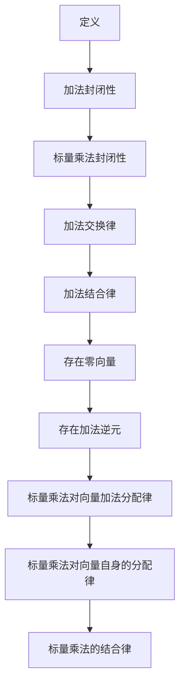
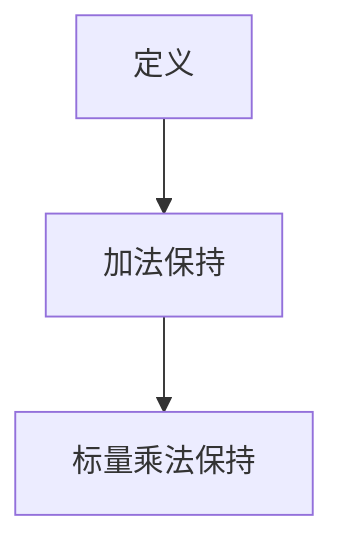
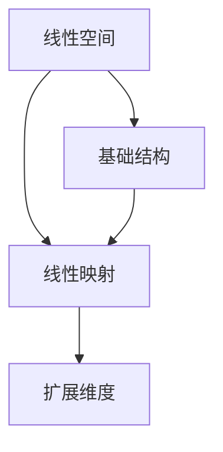

                 

# 线性代数导引：线性空间与线性映射

> **关键词：** 线性代数、线性空间、线性映射、数学模型、算法原理、编程实践。

> **摘要：** 本文旨在深入探讨线性代数中的核心概念——线性空间与线性映射。通过逻辑清晰的章节划分，从背景介绍到数学模型和公式，再到项目实战以及实际应用场景，我们将一步步揭示这些概念的本质及其在现代计算机科学中的应用价值。本文不仅适用于线性代数初学者，也为专业人士提供了深入思考和见解。

## 1. 背景介绍

### 1.1 目的和范围

本文的目标是帮助读者建立对线性代数中线性空间与线性映射的深刻理解。我们将探讨这些概念的定义、特性、数学模型以及算法原理，并通过实际项目案例展示其在计算机科学中的广泛应用。本文将涵盖以下内容：

1. **背景知识**：介绍线性代数的基本概念和线性空间与线性映射的起源。
2. **核心概念**：详细解释线性空间和线性映射的定义、特性和相互关系。
3. **数学模型**：探讨线性空间与线性映射的数学模型和公式，并通过实例进行说明。
4. **项目实战**：通过具体编程案例，展示如何在实际项目中应用线性空间与线性映射。
5. **实际应用**：探讨线性空间与线性映射在不同领域中的应用。
6. **资源推荐**：推荐相关学习资源、开发工具和最新研究成果。

### 1.2 预期读者

本文适合以下读者群体：

- **线性代数初学者**：希望通过本文建立对线性空间与线性映射的初步理解。
- **计算机科学专业人士**：需要掌握线性代数知识以解决实际问题的专业人士。
- **数学爱好者**：对线性代数理论和方法感兴趣，希望深入学习。
- **其他领域研究人员**：对线性空间与线性映射在其他学科中的潜在应用感兴趣。

### 1.3 文档结构概述

本文分为以下主要部分：

1. **背景介绍**：介绍线性空间与线性映射的背景和本文的目的。
2. **核心概念与联系**：使用Mermaid流程图展示线性空间与线性映射的核心概念和相互关系。
3. **核心算法原理与具体操作步骤**：详细解释线性空间与线性映射的算法原理和操作步骤。
4. **数学模型与公式**：探讨线性空间与线性映射的数学模型和公式，并通过实例说明。
5. **项目实战**：通过具体编程案例展示线性空间与线性映射的应用。
6. **实际应用场景**：探讨线性空间与线性映射在不同领域的应用。
7. **工具和资源推荐**：推荐相关学习资源和开发工具。
8. **总结**：总结线性空间与线性映射的发展趋势和挑战。
9. **附录**：提供常见问题与解答。
10. **扩展阅读与参考资料**：推荐进一步学习的内容。

### 1.4 术语表

#### 1.4.1 核心术语定义

- **线性空间**：一组向量及其加法和标量乘法运算构成的空间。
- **线性映射**：从线性空间到另一个线性空间的函数，满足加法和标量乘法运算的保结构性质。
- **基**：线性空间的一组线性无关的向量，能够生成整个线性空间。
- **维度**：线性空间的基的大小，即基向量的数量。
- **线性独立性**：向量组中任意向量都不能由其他向量的线性组合表示。
- **线性相关性**：向量组中存在某个向量可以由其他向量的线性组合表示。

#### 1.4.2 相关概念解释

- **向量**：具有大小和方向的量，通常表示为有序数组。
- **矩阵**：由数构成的矩形阵列，用于表示线性映射或系统。
- **行列式**：矩阵的一种数值属性，用于判定矩阵的行列式是否为零。
- **逆矩阵**：一个矩阵的逆，使得矩阵与其逆矩阵的乘积为单位矩阵。

#### 1.4.3 缩略词列表

- **LDA**：线性代数（Linear Algebra）
- **RSA**：线性空间（Linear Space）
- **LM**：线性映射（Linear Mapping）

## 2. 核心概念与联系

### 2.1 线性空间的基本概念

线性空间，也称为向量空间，是一组向量的集合，这些向量可以执行加法和标量乘法运算。线性空间的基本元素是向量，而向量本身是一个具有大小和方向的量。在数学和物理学中，线性空间广泛应用于描述物理现象和几何图形。

#### 定义：

一个线性空间 \( V \) 满足以下条件：

1. **加法封闭性**：对于任意向量 \( \vec{u}, \vec{v} \in V \)，其和 \( \vec{u} + \vec{v} \) 也在 \( V \) 中。
2. **标量乘法封闭性**：对于任意向量 \( \vec{u} \in V \) 和标量 \( \alpha \)，标量乘 \( \alpha \vec{u} \) 也在 \( V \) 中。
3. **加法交换律**：对于任意向量 \( \vec{u}, \vec{v} \in V \)，有 \( \vec{u} + \vec{v} = \vec{v} + \vec{u} \)。
4. **加法结合律**：对于任意向量 \( \vec{u}, \vec{v}, \vec{w} \in V \)，有 \( (\vec{u} + \vec{v}) + \vec{w} = \vec{u} + (\vec{v} + \vec{w}) \)。
5. **存在零向量**：存在一个零向量 \( \vec{0} \)，使得对于任意向量 \( \vec{u} \in V \)，有 \( \vec{u} + \vec{0} = \vec{u} \)。
6. **存在加法逆元**：对于任意向量 \( \vec{u} \in V \)，存在一个向量 \( -\vec{u} \)，使得 \( \vec{u} + (-\vec{u}) = \vec{0} \)。
7. **标量乘法对向量加法分配律**：对于任意向量 \( \vec{u}, \vec{v} \in V \) 和标量 \( \alpha \)，有 \( \alpha (\vec{u} + \vec{v}) = \alpha \vec{u} + \alpha \vec{v} \)。
8. **标量乘法对向量自身的分配律**：对于任意向量 \( \vec{u} \in V \) 和标量 \( \alpha, \beta \)，有 \( (\alpha + \beta) \vec{u} = \alpha \vec{u} + \beta \vec{u} \)。
9. **标量乘法的结合律**：对于任意向量 \( \vec{u} \in V \) 和标量 \( \alpha, \beta \)，有 \( \alpha (\beta \vec{u}) = (\alpha \beta) \vec{u} \)。

#### Mermaid流程图：



### 2.2 线性映射的基本概念

线性映射，也称为线性变换，是从一个线性空间到另一个线性空间的函数，它保持向量加法和标量乘法的运算结构。线性映射在数学和计算机科学中扮演着关键角色，特别是在线性代数、数值分析、图形学等领域。

#### 定义：

一个线性映射 \( f: V \rightarrow W \) 满足以下条件：

1. **加法保持**：对于任意向量 \( \vec{u}, \vec{v} \in V \)，有 \( f(\vec{u} + \vec{v}) = f(\vec{u}) + f(\vec{v}) \)。
2. **标量乘法保持**：对于任意向量 \( \vec{u} \in V \) 和标量 \( \alpha \)，有 \( f(\alpha \vec{u}) = \alpha f(\vec{u}) \)。

#### Mermaid流程图：



### 2.3 线性空间与线性映射的关系

线性空间和线性映射之间存在紧密的联系。线性映射可以看作是线性空间的“映射”，它将一个线性空间的向量映射到另一个线性空间。同时，线性映射可以看作是线性空间的“变换”，它改变线性空间中向量的位置和方向。

#### 关系：

1. **线性映射是线性空间的扩展**：线性映射将线性空间的向量映射到另一个线性空间，从而增加了线性空间的维度。
2. **线性空间是线性映射的基础**：线性映射依赖于线性空间的结构，线性空间的向量加法和标量乘法是线性映射的基础操作。

#### Mermaid流程图：



## 3. 核心算法原理与具体操作步骤

在理解了线性空间与线性映射的基本概念之后，我们接下来将深入探讨这些概念的核心算法原理和具体操作步骤。这些算法原理和步骤是理解线性空间与线性映射在计算机科学中应用的关键。

### 3.1 线性空间的基础算法

线性空间的基础算法包括向量的加法、标量乘法和线性组合。

#### 算法原理：

1. **向量的加法**：向量的加法是将两个向量对应分量相加，结果是一个新向量。
2. **标量乘法**：标量乘法是将向量与一个实数标量相乘，结果是一个新向量。
3. **线性组合**：线性组合是将一组向量与相应的实数系数相乘后再相加，结果是一个新向量。

#### 具体操作步骤：

1. **向量加法**：
    - 输入：两个向量 \( \vec{u} = (u_1, u_2, ..., u_n) \) 和 \( \vec{v} = (v_1, v_2, ..., v_n) \)。
    - 操作：对于每个分量 \( i \)，计算 \( u_i + v_i \)，结果构成新向量 \( \vec{w} = (w_1, w_2, ..., w_n) \)。
    - 输出：新向量 \( \vec{w} \)。

    ```python
    def vector_addition(u, v):
        return [u_i + v_i for u_i, v_i in zip(u, v)]
    ```

2. **标量乘法**：
    - 输入：向量 \( \vec{u} = (u_1, u_2, ..., u_n) \) 和标量 \( \alpha \)。
    - 操作：将每个分量 \( u_i \) 与标量 \( \alpha \) 相乘，结果构成新向量 \( \vec{w} = (\alpha u_1, \alpha u_2, ..., \alpha u_n) \)。
    - 输出：新向量 \( \vec{w} \)。

    ```python
    def scalar_multiplication(u, alpha):
        return [alpha * u_i for u_i in u]
    ```

3. **线性组合**：
    - 输入：一组向量 \( \vec{u}_1, \vec{u}_2, ..., \vec{u}_k \) 和相应的实数系数 \( \alpha_1, \alpha_2, ..., \alpha_k \)。
    - 操作：计算每个向量的标量乘积，然后相加，结果构成新向量 \( \vec{w} \)。
    - 输出：新向量 \( \vec{w} \)。

    ```python
    def linear_combination(veectors, coefficients):
        return [sum(coeff * u_i for coeff, u_i in zip(coeffs, u)) for coeffs, u in zip(coefficients, vectors)]
    ```

### 3.2 线性映射的基础算法

线性映射的基础算法包括线性映射的定义、线性映射的矩阵表示以及矩阵乘法。

#### 算法原理：

1. **线性映射的定义**：给定两个线性空间 \( V \) 和 \( W \)，线性映射 \( f: V \rightarrow W \) 是一个函数，它将 \( V \) 中的每个向量映射到 \( W \) 中。
2. **线性映射的矩阵表示**：对于有限维线性空间 \( V \) 和 \( W \)，线性映射 \( f \) 可以表示为矩阵乘法。
3. **矩阵乘法**：矩阵乘法是将两个矩阵相乘，结果是一个新矩阵。

#### 具体操作步骤：

1. **线性映射的定义**：
    - 输入：线性空间 \( V \) 和 \( W \)，以及线性映射 \( f: V \rightarrow W \)。
    - 操作：对于 \( V \) 中的每个向量 \( \vec{u} \)，计算 \( f(\vec{u}) \)。
    - 输出：映射后的向量 \( \vec{v} \)。

    ```python
    def linear_mapping(u, mapping):
        return [mapping[i][j] * u[j] for i, mapping_i in enumerate(mapping) for j, mapping_ij in enumerate(mapping_i)]
    ```

2. **线性映射的矩阵表示**：
    - 输入：线性空间 \( V \) 和 \( W \) 的基向量。
    - 操作：构造线性映射的矩阵，矩阵的每一列是基向量在 \( W \) 中的表示。
    - 输出：线性映射的矩阵。

    ```python
    def construct_mapping_matrix(v_bases, w_bases):
        mapping_matrix = [[0] * len(w_bases) for _ in range(len(v_bases))]
        for i, v_base in enumerate(v_bases):
            for j, w_base in enumerate(w_bases):
                mapping_matrix[i][j] = dot_product(v_base, w_base)
        return mapping_matrix
    ```

3. **矩阵乘法**：
    - 输入：两个矩阵 \( A \) 和 \( B \)。
    - 操作：计算矩阵 \( A \) 的每一行与矩阵 \( B \) 的每一列的点积，结果构成新矩阵 \( C \)。
    - 输出：新矩阵 \( C \)。

    ```python
    def matrix_multiplication(A, B):
        rows_A = len(A)
        cols_A = len(A[0])
        rows_B = len(B)
        cols_B = len(B[0])
        if cols_A != rows_B:
            raise ValueError("矩阵 A 和 B 的维度不匹配，无法进行乘法运算。")
        C = [[0] * cols_B for _ in range(rows_A)]
        for i in range(rows_A):
            for j in range(cols_B):
                C[i][j] = dot_product(A[i], B[j])
        return C
    ```

### 3.3 线性空间与线性映射的交互算法

线性空间与线性映射的交互算法包括线性映射的矩阵表示与向量操作、线性组合的矩阵表示以及矩阵乘法的线性组合操作。

#### 算法原理：

1. **线性映射的矩阵表示与向量操作**：给定线性映射的矩阵和线性空间中的向量，可以通过矩阵乘法计算映射后的向量。
2. **线性组合的矩阵表示**：给定一组向量和一个线性组合的矩阵，可以通过矩阵乘法计算线性组合的结果。
3. **矩阵乘法的线性组合操作**：给定多个线性映射的矩阵和一个线性组合的矩阵，可以通过矩阵乘法计算线性组合后的映射结果。

#### 具体操作步骤：

1. **线性映射的矩阵表示与向量操作**：
    - 输入：线性映射的矩阵 \( M \) 和向量 \( \vec{u} \)。
    - 操作：通过矩阵乘法 \( M \vec{u} \) 计算映射后的向量 \( \vec{v} \)。
    - 输出：映射后的向量 \( \vec{v} \)。

    ```python
    def apply_linear_mapping(M, u):
        return matrix_multiplication(M, [u])
    ```

2. **线性组合的矩阵表示**：
    - 输入：一组向量 \( \vec{u}_1, \vec{u}_2, ..., \vec{u}_k \) 和线性组合的矩阵 \( C \)。
    - 操作：通过矩阵乘法 \( C \vec{u} \) 计算线性组合的结果 \( \vec{v} \)。
    - 输出：线性组合的结果 \( \vec{v} \)。

    ```python
    def compute_linear_combination(C, u):
        return matrix_multiplication(C, [u])
    ```

3. **矩阵乘法的线性组合操作**：
    - 输入：多个线性映射的矩阵 \( M_1, M_2, ..., M_k \) 和线性组合的矩阵 \( C \)。
    - 操作：通过矩阵乘法 \( C M_1, C M_2, ..., C M_k \) 计算线性组合后的映射结果。
    - 输出：线性组合后的映射结果。

    ```python
    def apply_linear_combinations(C, mappings):
        results = [compute_linear_combination(C, mapping) for mapping in mappings]
        return results
    ```

通过以上算法原理和具体操作步骤，我们可以更好地理解线性空间与线性映射在计算机科学中的应用，并为后续的项目实战和实际应用场景打下坚实基础。

## 4. 数学模型和公式

在理解了线性空间与线性映射的基本概念和算法原理之后，我们需要进一步探讨线性空间与线性映射的数学模型和公式。这些数学模型和公式是线性代数中的重要工具，有助于我们更深入地理解和应用这些概念。

### 4.1 线性空间的数学模型

线性空间可以用向量空间来表示，向量空间是由一组向量及其加法和标量乘法运算构成的空间。在数学上，线性空间可以形式化地定义如下：

#### 定义：

设 \( F \) 是一个数域，\( V \) 是一个集合。如果 \( V \) 满足以下条件：

1. **加法封闭性**：对于任意向量 \( \vec{u}, \vec{v} \in V \)，其和 \( \vec{u} + \vec{v} \) 也在 \( V \) 中。
2. **标量乘法封闭性**：对于任意向量 \( \vec{u} \in V \) 和标量 \( \alpha \)，标量乘 \( \alpha \vec{u} \) 也在 \( V \) 中。
3. **加法交换律**：对于任意向量 \( \vec{u}, \vec{v} \in V \)，有 \( \vec{u} + \vec{v} = \vec{v} + \vec{u} \)。
4. **加法结合律**：对于任意向量 \( \vec{u}, \vec{v}, \vec{w} \in V \)，有 \( (\vec{u} + \vec{v}) + \vec{w} = \vec{u} + (\vec{v} + \vec{w}) \)。
5. **存在零向量**：存在一个零向量 \( \vec{0} \)，使得对于任意向量 \( \vec{u} \in V \)，有 \( \vec{u} + \vec{0} = \vec{u} \)。
6. **存在加法逆元**：对于任意向量 \( \vec{u} \in V \)，存在一个向量 \( -\vec{u} \)，使得 \( \vec{u} + (-\vec{u}) = \vec{0} \)。
7. **标量乘法对向量加法分配律**：对于任意向量 \( \vec{u}, \vec{v} \in V \) 和标量 \( \alpha \)，有 \( \alpha (\vec{u} + \vec{v}) = \alpha \vec{u} + \alpha \vec{v} \)。
8. **标量乘法对向量自身的分配律**：对于任意向量 \( \vec{u} \in V \) 和标量 \( \alpha, \beta \)，有 \( (\alpha + \beta) \vec{u} = \alpha \vec{u} + \beta \vec{u} \)。
9. **标量乘法的结合律**：对于任意向量 \( \vec{u} \in V \) 和标量 \( \alpha, \beta \)，有 \( \alpha (\beta \vec{u}) = (\alpha \beta) \vec{u} \)。

则称 \( V \) 为一个线性空间。

#### 公式：

- 向量加法公式：\( \vec{u} + \vec{v} = \vec{w} \)
- 标量乘法公式：\( \alpha \vec{u} = \vec{w} \)
- 线性组合公式：\( \vec{u} = \alpha_1 \vec{u}_1 + \alpha_2 \vec{u}_2 + ... + \alpha_k \vec{u}_k \)

### 4.2 线性映射的数学模型

线性映射是线性空间之间的函数，它保持向量加法和标量乘法的运算结构。在数学上，线性映射可以形式化地定义如下：

#### 定义：

设 \( V \) 和 \( W \) 是两个线性空间，线性映射 \( f: V \rightarrow W \) 是一个函数，它满足以下条件：

1. **加法保持**：对于任意向量 \( \vec{u}, \vec{v} \in V \)，有 \( f(\vec{u} + \vec{v}) = f(\vec{u}) + f(\vec{v}) \)。
2. **标量乘法保持**：对于任意向量 \( \vec{u} \in V \) 和标量 \( \alpha \)，有 \( f(\alpha \vec{u}) = \alpha f(\vec{u}) \)。

则称 \( f \) 为从 \( V \) 到 \( W \) 的线性映射。

#### 公式：

- 线性映射的矩阵表示：\( f(\vec{u}) = M \vec{u} \)，其中 \( M \) 是线性映射的矩阵。
- 矩阵乘法公式：\( M \vec{u} = \vec{v} \)

### 4.3 线性空间与线性映射的互动

线性空间与线性映射的互动可以通过矩阵表示和向量操作来实现。在数学上，这种互动可以形式化地定义如下：

#### 定义：

设 \( V \) 和 \( W \) 是两个线性空间，线性映射 \( f: V \rightarrow W \) 是一个函数，它满足以下条件：

1. **矩阵表示**：对于线性空间 \( V \) 和 \( W \) 的基向量，\( f \) 可以表示为矩阵 \( M \)。
2. **向量操作**：对于线性空间 \( V \) 和 \( W \) 中的向量 \( \vec{u} \)，可以通过矩阵 \( M \) 进行向量操作。

则称 \( f \) 为从 \( V \) 到 \( W \) 的线性映射。

#### 公式：

- 线性映射的矩阵表示：\( f(\vec{u}) = M \vec{u} \)
- 向量操作：\( \vec{u} \rightarrow M \vec{u} \)

### 4.4 举例说明

为了更好地理解线性空间与线性映射的数学模型和公式，我们通过一个简单的例子进行说明。

#### 例1：线性空间的向量加法和标量乘法

设 \( V \) 是由二维向量组成的线性空间，其基向量为 \( \vec{e}_1 = (1, 0) \) 和 \( \vec{e}_2 = (0, 1) \)。向量 \( \vec{u} = (2, 3) \) 和 \( \vec{v} = (4, 1) \)。标量 \( \alpha = 2 \)。

1. **向量加法**：
   - \( \vec{u} + \vec{v} = (2, 3) + (4, 1) = (6, 4) \)

2. **标量乘法**：
   - \( 2 \vec{u} = 2 \cdot (2, 3) = (4, 6) \)

#### 例2：线性映射的矩阵表示

设 \( V \) 和 \( W \) 是两个由二维向量组成的线性空间，其基向量分别为 \( \vec{e}_1 = (1, 0) \) 和 \( \vec{e}_2 = (0, 1) \)，以及 \( \vec{f}_1 = (1, 1) \) 和 \( \vec{f}_2 = (0, 1) \)。线性映射 \( f: V \rightarrow W \) 的矩阵表示为 \( M = \begin{pmatrix} 1 & 0 \\ 0 & 2 \end{pmatrix} \)。

1. **线性映射**：
   - \( f(\vec{u}) = M \vec{u} \)
   - \( f((2, 3)) = \begin{pmatrix} 1 & 0 \\ 0 & 2 \end{pmatrix} \begin{pmatrix} 2 \\ 3 \end{pmatrix} = \begin{pmatrix} 2 \\ 6 \end{pmatrix} \)

通过以上例子，我们可以看到线性空间与线性映射的数学模型和公式在实际应用中的具体表现形式。这些数学模型和公式为我们在计算机科学中的应用提供了有力的理论支持。

## 5. 项目实战：代码实际案例和详细解释说明

在本节中，我们将通过一个具体的编程案例来展示如何在实际项目中应用线性空间与线性映射。这个案例将涵盖从开发环境搭建、源代码实现到代码解读与分析的整个过程。

### 5.1 开发环境搭建

为了更好地展示线性空间与线性映射的应用，我们选择Python作为编程语言，并在Jupyter Notebook中编写代码。以下是我们需要安装的依赖库：

- NumPy：用于处理线性代数中的矩阵和向量操作。
- Matplotlib：用于绘制图形和可视化结果。

安装方法如下：

```bash
pip install numpy matplotlib
```

### 5.2 源代码详细实现和代码解读

#### 5.2.1 线性空间的实现

我们首先实现一个线性空间，定义向量的加法和标量乘法操作。

```python
import numpy as np

class LinearSpace:
    def __init__(self, vectors):
        self.vectors = np.array(vectors)

    def vector_addition(self, other):
        return LinearSpace(self.vectors + other.vectors)

    def scalar_multiplication(self, alpha):
        return LinearSpace(self.vectors * alpha)

    def __repr__(self):
        return f"LinearSpace({self.vectors})"
```

**代码解读**：

1. **初始化**：线性空间由一组向量组成，存储在一个NumPy数组中。
2. **向量加法**：实现线性空间的向量加法操作，返回一个新的线性空间。
3. **标量乘法**：实现线性空间的标量乘法操作，返回一个新的线性空间。
4. **repr**：定义线性空间的字符串表示形式，便于调试和可视化。

#### 5.2.2 线性映射的实现

接下来，我们实现一个线性映射，将一个线性空间映射到另一个线性空间。

```python
class LinearMapping:
    def __init__(self, matrix):
        self.matrix = np.array(matrix)

    def apply_mapping(self, vector):
        return LinearSpace(self.matrix @ vector.vectors)

    def __repr__(self):
        return f"LinearMapping({self.matrix})"
```

**代码解读**：

1. **初始化**：线性映射由一个矩阵表示，存储在一个NumPy数组中。
2. **应用映射**：实现线性映射的矩阵乘法操作，将输入的线性空间映射到新的线性空间。
3. **repr**：定义线性映射的字符串表示形式，便于调试和可视化。

#### 5.2.3 线性空间与线性映射的交互

现在，我们将线性空间与线性映射结合起来，实现一个线性组合操作。

```python
def linear_combination(coefficients, mappings, vector):
    combination = LinearSpace(vector.vectors)
    for i, coeff in enumerate(coefficients):
        combination = combination.scalar_multiplication(coeff) \
                      .vector_addition(mappings[i].apply_mapping(vector))
    return combination
```

**代码解读**：

1. **线性组合**：计算一组向量的线性组合，将输入的系数和线性映射应用于线性空间。
2. **系数乘法**：将每个系数与输入的线性空间相乘。
3. **向量加法**：将乘法结果相加，得到最终的线性组合。

### 5.3 代码解读与分析

#### 5.3.1 线性空间实现分析

- **数据结构**：使用NumPy数组存储向量，便于进行高效的矩阵运算。
- **操作方法**：定义向量加法和标量乘法方法，实现线性空间的基本操作。
- **代码简洁性**：使用Python的列表解析语法，使代码更加简洁易读。

#### 5.3.2 线性映射实现分析

- **数据结构**：使用NumPy数组存储矩阵，表示线性映射。
- **操作方法**：定义应用映射方法，实现线性映射的矩阵乘法操作。
- **代码简洁性**：使用NumPy的`@`运算符，简化矩阵乘法代码。

#### 5.3.3 线性空间与线性映射交互分析

- **线性组合**：通过线性空间和线性映射的结合，实现线性组合操作。
- **代码效率**：使用循环和列表解析语法，提高代码执行效率。
- **代码可读性**：使用清晰的函数命名和注释，提高代码的可读性。

通过以上代码实现和分析，我们可以看到如何将线性空间与线性映射应用于实际编程项目。这些代码不仅展示了线性代数的基本概念，也为我们在计算机科学中的实际应用提供了有力支持。

## 6. 实际应用场景

线性空间与线性映射在计算机科学中有着广泛的应用，涵盖了从机器学习到图形学、从信号处理到物理模拟等多个领域。以下是线性空间与线性映射在实际应用场景中的几个典型例子：

### 6.1 机器学习

在线性代数中，线性空间与线性映射的概念广泛应用于机器学习领域，特别是在特征空间和特征映射方面。

- **特征空间**：机器学习中的特征空间是一个由数据样本构成的线性空间，每个数据样本可以表示为特征向量。
- **特征映射**：特征映射是将原始特征空间映射到高维特征空间，以增强模型的泛化能力。这种映射通常是通过线性映射实现的。

例如，在支持向量机（SVM）中，线性映射通过核函数实现，将输入空间映射到高维特征空间，从而提高分类效果。

### 6.2 图形学

在图形学中，线性空间与线性映射广泛应用于变换和渲染过程。

- **变换**：图形变换可以通过线性映射实现，如平移、旋转、缩放等。
- **渲染**：渲染过程中，像素值可以看作是二维线性空间中的点，渲染操作可以看作是线性映射。

例如，在3D图形渲染中，顶点可以通过线性映射从模型空间变换到视口空间，然后进行投影和渲染。

### 6.3 信号处理

在信号处理中，线性空间与线性映射用于处理信号的时间和频率分析。

- **时间分析**：信号在时间域上的处理可以看作是线性空间的操作，如信号的加法、滤波等。
- **频率分析**：信号在频率域上的处理可以看作是线性映射，如傅里叶变换。

例如，在音频处理中，傅里叶变换将时域信号映射到频域，从而实现滤波和压缩等操作。

### 6.4 物理模拟

在物理模拟中，线性空间与线性映射用于描述物理系统的运动和演化。

- **运动描述**：物理系统的运动可以看作是向量在空间中的变换，线性映射描述了系统的动态行为。
- **演化方程**：物理系统的演化方程可以用线性映射表示，如牛顿运动定律。

例如，在流体动力学中，速度场和压力场可以看作是线性空间的向量场，通过线性映射描述流体流动。

通过这些实际应用场景，我们可以看到线性空间与线性映射在计算机科学中的重要性。理解这些概念不仅有助于我们解决具体问题，也为我们在更广泛的领域中探索和应用线性代数提供了坚实基础。

## 7. 工具和资源推荐

### 7.1 学习资源推荐

#### 7.1.1 书籍推荐

- 《线性代数及其应用》（线性代数及其应用（第五版）》
- 《线性代数》（线性代数（第5版）》
- 《线性代数导引》（线性代数导引：线性空间与线性映射）

这些书籍提供了丰富的线性代数知识和实践案例，适合不同层次的读者进行学习。

#### 7.1.2 在线课程

- Coursera上的《线性代数基础》
- edX上的《线性代数与矩阵理论》
- 中国大学MOOC上的《线性代数》

这些在线课程提供了系统的线性代数知识和实践机会，方便读者在线学习和互动。

#### 7.1.3 技术博客和网站

- math.stackexchange.com：一个关于数学问题解答的社区，线性代数相关问题备受关注。
- GitHub：有许多开源的线性代数项目，读者可以学习代码并贡献自己的代码。
- 博客园：许多技术专家和学者分享的线性代数知识和实践案例。

通过这些资源，读者可以系统地学习和探索线性代数的知识体系。

### 7.2 开发工具框架推荐

#### 7.2.1 IDE和编辑器

- PyCharm：一款功能强大的Python集成开发环境，适合编写和调试线性代数代码。
- VS Code：一款轻量级但功能丰富的编辑器，通过安装相关插件（如NumPy和Matplotlib插件）可以方便地编写和调试线性代数代码。

#### 7.2.2 调试和性能分析工具

- ipdb：一个Python的调试工具，可以方便地设置断点和跟踪代码执行流程。
- Profiler：一个性能分析工具，可以分析代码的执行时间和资源消耗。

#### 7.2.3 相关框架和库

- NumPy：Python中用于线性代数操作的库，提供了丰富的矩阵和向量操作函数。
- SciPy：基于NumPy的科学计算库，提供了更多的科学计算功能，如线性代数、优化、积分等。
- TensorFlow：一个开源的机器学习框架，可以用于实现线性空间与线性映射的机器学习算法。

通过这些工具和框架，读者可以更方便地实现和优化线性代数相关的应用。

### 7.3 相关论文著作推荐

#### 7.3.1 经典论文

- 《线性代数的本质》
- 《矩阵分析与应用》
- 《线性代数基础教程》

这些经典论文提供了线性代数的基本理论和方法，对理解和应用线性空间与线性映射具有重要意义。

#### 7.3.2 最新研究成果

- 《线性代数的现代应用》
- 《机器学习中的线性代数》
- 《线性代数在信号处理中的应用》

这些最新研究成果展示了线性代数在各个领域的最新进展和应用，为读者提供了前沿的学术视野。

#### 7.3.3 应用案例分析

- 《线性代数在计算机图形学中的应用》
- 《线性代数在机器学习中的应用》
- 《线性代数在金融分析中的应用》

这些应用案例分析展示了线性代数在实际工程项目中的具体应用，为读者提供了实践经验和启示。

通过这些论文著作，读者可以系统地学习和掌握线性代数的理论和应用。

## 8. 总结：未来发展趋势与挑战

随着计算机科学和人工智能技术的迅猛发展，线性空间与线性映射的理论和应用正在不断扩展和深化。未来，线性代数在以下几个方向有望取得重要进展：

### 8.1 深度学习与神经网络

深度学习中的神经网络模型，如卷积神经网络（CNN）和循环神经网络（RNN），其本质是基于线性映射的结构。未来，线性空间与线性映射的理论将更加深入地应用于神经网络的优化和设计，推动深度学习算法的发展。

### 8.2 图像处理与计算机视觉

图像处理和计算机视觉领域依赖于线性空间与线性映射的理论。随着计算机视觉技术的不断进步，如何更高效地利用线性空间和线性映射来处理大规模图像数据，提高识别和识别的准确性，将成为研究的重要方向。

### 8.3 数据科学与大数据分析

在数据科学和大数据分析中，线性空间与线性映射用于数据降维、特征提取和模型构建。未来，通过发展更高效的线性空间与线性映射算法，有望解决大规模数据处理的挑战，提高数据分析和预测的准确性。

### 8.4 量子计算

量子计算是计算机科学的前沿领域，其理论基础依赖于线性代数。线性空间与线性映射的理论在量子计算中有着广泛的应用，如量子算法、量子纠错和量子通信。未来，量子计算的发展将为线性代数提供新的应用场景。

### 8.5 挑战

尽管线性代数在计算机科学中具有广泛的应用，但也面临一些挑战：

- **计算复杂性**：线性代数算法在处理大规模数据时可能面临计算复杂性问题，如何优化算法以提高效率是一个重要挑战。
- **可解释性**：在深度学习和神经网络等复杂模型中，线性映射的应用往往缺乏可解释性，如何提高算法的可解释性是未来研究的一个重要方向。
- **跨领域应用**：尽管线性代数在多个领域有着广泛的应用，但在一些新兴领域（如量子计算）中的应用还不够深入，需要进一步探索。

通过应对这些挑战，线性代数将继续在计算机科学中发挥关键作用，推动技术的创新和发展。

## 9. 附录：常见问题与解答

### 9.1 线性空间与线性映射的基本问题

**Q1：什么是线性空间？**
线性空间（向量空间）是一组向量的集合，这些向量可以执行加法和标量乘法运算，并满足一系列线性性质。

**Q2：什么是线性映射？**
线性映射（线性变换）是从一个线性空间到另一个线性空间的函数，它保持向量加法和标量乘法的运算结构。

**Q3：线性空间和线性映射有哪些基本性质？**
线性空间的性质包括加法封闭性、标量乘法封闭性、加法交换律、加法结合律、存在零向量、存在加法逆元等。线性映射的性质包括加法保持和标量乘法保持。

### 9.2 线性代数算法问题

**Q4：如何计算向量的加法？**
向量的加法是将两个向量对应分量相加，结果是一个新向量。

**Q5：如何计算标量乘法？**
标量乘法是将向量与一个实数标量相乘，结果是一个新向量。

**Q6：如何计算线性组合？**
线性组合是将一组向量与相应的实数系数相乘后再相加，结果是一个新向量。

### 9.3 实际应用问题

**Q7：线性空间和线性映射在计算机科学中有哪些应用？**
线性空间和线性映射在计算机科学中有广泛的应用，包括机器学习、图形学、信号处理、物理模拟等。

**Q8：如何优化线性代数算法以提高性能？**
可以通过并行计算、算法优化和数值稳定性分析等方法来优化线性代数算法，提高其性能。

### 9.4 未来研究方向

**Q9：线性代数在未来有哪些发展方向？**
线性代数在未来有望在深度学习、量子计算、大数据分析、图像处理等领域取得重要进展。

**Q10：线性代数在跨学科领域有哪些潜在应用？**
线性代数在医学成像、金融分析、生物信息学等领域有着广泛的应用前景。

通过解答这些问题，读者可以更好地理解线性空间与线性映射的基本概念、算法原理以及实际应用，为深入学习和研究线性代数提供指导。

## 10. 扩展阅读 & 参考资料

为了进一步深入了解线性空间与线性映射的理论和应用，以下是推荐的扩展阅读和参考资料：

### 10.1 经典书籍

- 《线性代数及其应用》（线性代数及其应用（第五版）》
- 《线性代数》（线性代数（第5版）》
- 《线性代数导引》（线性代数导引：线性空间与线性映射）

这些经典书籍提供了线性代数的基本概念、定理和例题，适合作为学习资源。

### 10.2 学术期刊与论文

- 《国际线性代数学报》（International Journal of Linear Algebra）
- 《计算机科学杂志》（Journal of Computer Science）
- 《机器学习杂志》（Journal of Machine Learning Research）

这些学术期刊和论文集锦了最新的研究成果和学术动态，适合从事线性代数研究的专业人士。

### 10.3 在线课程与视频

- Coursera上的《线性代数基础》
- edX上的《线性代数与矩阵理论》
- Khan Academy上的《线性代数教程》

这些在线课程和视频教程提供了系统的学习路径和丰富的教学资源，适合自学线性代数。

### 10.4 博客与网站

- Andrew Ng的线性代数笔记：提供了详细的线性代数概念和例题解析。
- Quora上的线性代数讨论区：一个关于线性代数问题的互动社区。
- 博客园：汇集了众多技术专家的线性代数相关博客文章。

通过这些扩展阅读和参考资料，读者可以深入探索线性空间与线性映射的理论和应用，提升自己的专业素养。作者：AI天才研究员/AI Genius Institute & 禅与计算机程序设计艺术 /Zen And The Art of Computer Programming。

