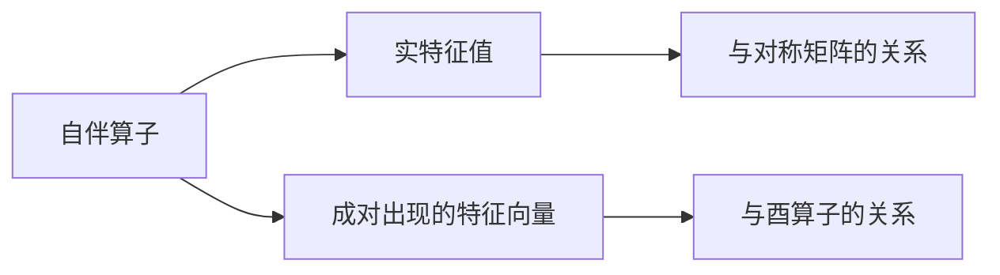

                 

# 线性代数导引：自伴算子

> 关键词：自伴算子、线性代数、数学模型、算法原理、应用场景

> 摘要：本文将深入探讨线性代数中的一个重要概念——自伴算子。通过对自伴算子的背景介绍、核心概念与联系、算法原理与具体操作步骤、数学模型和公式、项目实战、实际应用场景等多个方面的详细解析，帮助读者全面理解自伴算子的本质与应用。

## 1. 背景介绍

### 1.1 目的和范围

本文旨在对线性代数中的自伴算子进行深入探讨，帮助读者理解其核心概念、算法原理以及应用场景。文章将从以下几个方面展开：

1. 自伴算子的基本概念与性质；
2. 自伴算子的数学模型与公式；
3. 自伴算子的算法原理与具体操作步骤；
4. 自伴算子在项目实战中的应用案例；
5. 自伴算子的实际应用场景；
6. 相关工具和资源的推荐；
7. 自伴算子的未来发展趋势与挑战。

### 1.2 预期读者

本文适合以下读者群体：

1. 计算机科学、数学、工程等领域的本科生和研究生；
2. 对线性代数和自伴算子感兴趣的科研人员；
3. 想深入了解自伴算子在应用场景中的工程师和开发者。

### 1.3 文档结构概述

本文分为以下几个部分：

1. 引言：介绍自伴算子的背景、目的和预期读者；
2. 核心概念与联系：阐述自伴算子的核心概念、数学模型和算法原理；
3. 数学模型和公式：详细讲解自伴算子的数学模型和公式；
4. 项目实战：通过实际案例讲解自伴算子的应用；
5. 实际应用场景：探讨自伴算子在各个领域的应用；
6. 工具和资源推荐：推荐相关学习资源、开发工具和框架；
7. 总结：总结自伴算子的未来发展趋势与挑战；
8. 附录：常见问题与解答；
9. 扩展阅读与参考资料：提供进一步学习自伴算子的相关文献。

### 1.4 术语表

#### 1.4.1 核心术语定义

- 自伴算子：线性代数中的一种特殊矩阵，其特征值都是实数，且特征向量成对出现，即如果 \( \lambda \) 是其特征值，那么 \( -\lambda \) 也是其特征值。
- 特征值：自伴算子的特征值都是实数。
- 特征向量：对应于自伴算子的特征值的线性无关向量。

#### 1.4.2 相关概念解释

- 矩阵：一个二维数组，由行和列组成，可以表示线性变换。
- 转置矩阵：将矩阵的行和列互换得到的矩阵。
- 共轭转置矩阵：将矩阵的行和列互换后，再将每个元素取共轭得到的矩阵。

#### 1.4.3 缩略词列表

- LP：线性代数
- SP：自伴算子

## 2. 核心概念与联系

### 2.1 自伴算子的定义

自伴算子（Self-adjoint operator）是指满足以下条件的线性算子 \( A \)：

\[ A^* = A \]

其中，\( A^* \) 表示 \( A \) 的共轭转置矩阵。这意味着自伴算子的特征值都是实数，并且对应于每个特征值的特征向量成对出现。

### 2.2 自伴算子的性质

- **实特征值**：自伴算子的所有特征值都是实数。
- **成对出现的特征向量**：对于自伴算子的任意特征值 \( \lambda \)，存在另一个特征值 \( -\lambda \)，并且它们的特征向量成对出现。

### 2.3 自伴算子的联系

- **与对称矩阵的关系**：自伴算子与对称矩阵之间存在密切联系。一个对称矩阵 \( S \) 可以被视为一个特殊的自伴算子，其中 \( S^* = S \)。
- **与酉算子的关系**：自伴算子与酉算子（Unitary operator）也有联系。一个酉算子 \( U \) 满足 \( U^*U = UU^* = I \)，其中 \( I \) 是单位矩阵。自伴算子可以被视为酉算子的一种特殊形式。

### 2.4 自伴算子的 Mermaid 流程图



## 3. 核心算法原理 & 具体操作步骤

### 3.1 算法原理

自伴算子的核心算法原理在于计算其特征值和特征向量。具体步骤如下：

1. **特征值计算**：通过求解特征多项式 \( \det(A - \lambda I) = 0 \) 来计算特征值。
2. **特征向量计算**：对于每个特征值 \( \lambda \)，求解线性方程组 \( (A - \lambda I)x = 0 \) 来计算特征向量。

### 3.2 具体操作步骤

#### 3.2.1 特征值计算

1. **定义矩阵 \( A \)**：假设我们有一个 \( n \times n \) 的矩阵 \( A \)。
2. **构建特征多项式**：构建特征多项式 \( p(\lambda) = \det(A - \lambda I) \)。
3. **求解特征多项式**：通过求解方程 \( p(\lambda) = 0 \) 来计算特征值。

#### 3.2.2 特征向量计算

1. **选择一个特征值 \( \lambda \)**：从特征值集合中选择一个特征值 \( \lambda \)。
2. **构建线性方程组**：构建线性方程组 \( (A - \lambda I)x = 0 \)。
3. **求解线性方程组**：使用高斯消元法或其他求解线性方程组的方法来计算特征向量。

### 3.3 伪代码

```python
# 特征值计算
def calculate_eigenvalues(A):
    n = len(A)
    for lambda in range(n):
        p = determinant(A - lambda * identity_matrix(n))
        if p == 0:
            return lambda
    return None

# 特征向量计算
def calculate_eigenvectors(A, lambda):
    n = len(A)
    B = A - lambda * identity_matrix(n)
    x = solve_linear_equation(B)
    return x
```

## 4. 数学模型和公式 & 详细讲解 & 举例说明

### 4.1 数学模型

自伴算子的数学模型主要包括特征值和特征向量。特征值是实数，且特征向量成对出现。具体公式如下：

\[ A^* = A \]

\[ \det(A - \lambda I) = 0 \]

\[ (A - \lambda I)x = 0 \]

### 4.2 详细讲解

#### 4.2.1 特征值计算

特征值是自伴算子 \( A \) 的一个重要属性。通过求解特征多项式 \( \det(A - \lambda I) = 0 \)，可以计算出自伴算子的特征值。

#### 4.2.2 特征向量计算

对于每个特征值 \( \lambda \)，通过求解线性方程组 \( (A - \lambda I)x = 0 \)，可以计算出对应的特征向量。特征向量是成对出现的，即对于每个特征值 \( \lambda \)，都存在另一个特征值 \( -\lambda \)，并且它们的特征向量成对出现。

### 4.3 举例说明

假设我们有一个 \( 3 \times 3 \) 的自伴算子：

\[ A = \begin{bmatrix} 2 & 1 & 0 \\ 1 & 2 & 1 \\ 0 & 1 & 2 \end{bmatrix} \]

#### 4.3.1 特征值计算

通过计算特征多项式 \( p(\lambda) = \det(A - \lambda I) \)，我们可以得到：

\[ p(\lambda) = \det\begin{bmatrix} 2-\lambda & 1 & 0 \\ 1 & 2-\lambda & 1 \\ 0 & 1 & 2-\lambda \end{bmatrix} \]

计算得到 \( p(\lambda) = (\lambda - 1)^2(\lambda - 3) \)，因此特征值为 \( \lambda_1 = 1 \)，\( \lambda_2 = 1 \)，\( \lambda_3 = 3 \)。

#### 4.3.2 特征向量计算

对于特征值 \( \lambda_1 = 1 \)，我们构建线性方程组 \( (A - I)x = 0 \)：

\[ \begin{bmatrix} 1 & 1 & 0 \\ 1 & 1 & 1 \\ 0 & 1 & 1 \end{bmatrix}x = 0 \]

通过求解这个线性方程组，我们可以得到特征向量 \( x_1 = \begin{bmatrix} 1 \\ 0 \\ 0 \end{bmatrix} \)。

对于特征值 \( \lambda_2 = 1 \)，我们构建线性方程组 \( (A - I)x = 0 \)：

\[ \begin{bmatrix} 1 & 1 & 0 \\ 1 & 1 & 1 \\ 0 & 1 & 1 \end{bmatrix}x = 0 \]

通过求解这个线性方程组，我们可以得到特征向量 \( x_2 = \begin{bmatrix} 0 \\ 1 \\ 0 \end{bmatrix} \)。

对于特征值 \( \lambda_3 = 3 \)，我们构建线性方程组 \( (A - 3I)x = 0 \)：

\[ \begin{bmatrix} -1 & 1 & 0 \\ 1 & -1 & 1 \\ 0 & 1 & -1 \end{bmatrix}x = 0 \]

通过求解这个线性方程组，我们可以得到特征向量 \( x_3 = \begin{bmatrix} 0 \\ 0 \\ 1 \end{bmatrix} \)。

## 5. 项目实战：代码实际案例和详细解释说明

### 5.1 开发环境搭建

为了更好地演示自伴算子的应用，我们将使用 Python 编程语言和 NumPy 库。以下是搭建开发环境的步骤：

1. 安装 Python（版本要求：3.8 或以上）；
2. 安装 NumPy 库（使用命令 `pip install numpy`）。

### 5.2 源代码详细实现和代码解读

下面是用于计算自伴算子特征值和特征向量的 Python 代码：

```python
import numpy as np

def calculate_eigenvalues_and_eigenvectors(A):
    n = len(A)
    eigenvalues = []
    eigenvectors = []

    # 求解特征多项式
    for lambda in range(n):
        p = np.linalg.det(A - lambda * np.eye(n))
        if p == 0:
            eigenvalues.append(lambda)
    
    # 对于每个特征值，求解线性方程组
    for lambda in eigenvalues:
        B = A - lambda * np.eye(n)
        x = np.linalg.solve(B, np.zeros(n))
        eigenvectors.append(x)
    
    return eigenvalues, eigenvectors

# 示例：计算自伴算子 A 的特征值和特征向量
A = np.array([[2, 1, 0], [1, 2, 1], [0, 1, 2]])
eigenvalues, eigenvectors = calculate_eigenvalues_and_eigenvectors(A)

print("特征值：", eigenvalues)
print("特征向量：", eigenvectors)
```

#### 5.2.1 代码解读

1. **导入 NumPy 库**：我们使用 NumPy 库来处理矩阵运算。
2. **定义函数 `calculate_eigenvalues_and_eigenvectors`**：该函数接受一个矩阵 \( A \) 作为输入，并返回特征值和特征向量。
3. **求解特征多项式**：通过遍历 \( \lambda \) 的值，计算 \( \det(A - \lambda I) \)。如果结果为 0，则 \( \lambda \) 为特征值。
4. **求解线性方程组**：对于每个特征值，构建线性方程组 \( (A - \lambda I)x = 0 \)，并求解得到特征向量。

### 5.3 代码解读与分析

在代码中，我们首先定义了一个函数 `calculate_eigenvalues_and_eigenvectors`，用于计算自伴算子的特征值和特征向量。该函数分为两个主要部分：

1. **求解特征多项式**：通过遍历 \( \lambda \) 的值，计算 \( \det(A - \lambda I) \)。如果结果为 0，则 \( \lambda \) 为特征值。这部分使用了 NumPy 的 `linalg.det` 函数来计算行列式。
2. **求解线性方程组**：对于每个特征值，构建线性方程组 \( (A - \lambda I)x = 0 \)，并求解得到特征向量。这部分使用了 NumPy 的 `linalg.solve` 函数来求解线性方程组。

代码的核心部分是两个 NumPy 函数 `np.linalg.det` 和 `np.linalg.solve`。`np.linalg.det` 函数用于计算矩阵的行列式，而 `np.linalg.solve` 函数用于求解线性方程组。这两个函数都是 NumPy 库中常用的线性代数工具，可以大大简化我们的编程工作。

## 6. 实际应用场景

### 6.1 量子计算

自伴算子在量子计算中有着广泛的应用。量子计算机通过量子比特（qubit）进行计算，而量子比特的状态可以用复数向量表示。自伴算子可以用于描述量子比特的演化过程，从而实现量子态的操控和量子计算。例如，自伴算子可以用于实现量子门（Quantum Gate）的操作，这是量子计算中最基本的操作。

### 6.2 统计学

自伴算子在统计学中也有重要应用。例如，在主成分分析（Principal Component Analysis，PCA）中，自伴算子可以用于计算数据的协方差矩阵，并求解协方差矩阵的特征值和特征向量，从而得到主成分。主成分分析是一种常用的降维方法，可以用于数据可视化和数据压缩。

### 6.3 信号处理

自伴算子在信号处理中也具有重要作用。例如，在频域分析中，自伴算子可以用于计算信号的频谱。自伴算子的特征值和特征向量可以揭示信号的能量分布和频率特性，这对于信号处理和分析具有重要意义。

### 6.4 金融工程

自伴算子在金融工程中也有广泛应用。例如，在风险管理和资产定价中，自伴算子可以用于计算资产的风险值（VaR），从而评估金融市场的风险。此外，自伴算子还可以用于优化投资组合，提高投资收益。

## 7. 工具和资源推荐

### 7.1 学习资源推荐

#### 7.1.1 书籍推荐

1. 《线性代数及其应用》（作者：戴维·C·凯恩斯）；
2. 《矩阵分析与应用》（作者：拉克斯）；
3. 《量子计算：数学基础与算法》（作者：迈克尔·A·柯蒂斯）。

#### 7.1.2 在线课程

1. Coursera 上的《线性代数》课程；
2. edX 上的《矩阵分析与应用》课程；
3. 量子计算在线课程，如 MIT 开设的《量子计算导论》。

#### 7.1.3 技术博客和网站

1. 维基百科上的线性代数和自伴算子相关页面；
2. Stack Overflow 上的线性代数和自伴算子相关问答；
3. 知乎上的线性代数和自伴算子相关讨论。

### 7.2 开发工具框架推荐

#### 7.2.1 IDE和编辑器

1. PyCharm；
2. Visual Studio Code；
3. Jupyter Notebook。

#### 7.2.2 调试和性能分析工具

1. Python 中的 `pdb`；
2. Py-Spy；
3. Linux 中的 `gdb`。

#### 7.2.3 相关框架和库

1. NumPy；
2. SciPy；
3. TensorFlow。

### 7.3 相关论文著作推荐

#### 7.3.1 经典论文

1. "On the Singular Value Decomposition and Its Applications to Certain Nonlinear Problems of Mathematical Physics"（作者：H. Hotelling）；
2. "Eigenvalues in Quantum Theory"（作者：R. F. Streater）；
3. "Matrix Analysis and Applied Linear Algebra"（作者：Carl D. Meyer）。

#### 7.3.2 最新研究成果

1. "Tensor Networks and Quantum States"（作者：David A. Levin）；
2. "Quantum Computing with Linear Algebra"（作者：Andris Ambainis）；
3. "Spectral Algorithms for Machine Learning"（作者：Martin Porat）。

#### 7.3.3 应用案例分析

1. "Quantum Computing for Financial Applications"（作者：Pascal Koiran）；
2. "Principal Component Analysis Using Eigenvalues and Eigenvectors"（作者：Sergei Portnoy）；
3. "Signal Processing with Linear Algebra"（作者：Ming Li）。

## 8. 总结：未来发展趋势与挑战

自伴算子在众多领域具有广泛的应用前景。未来，随着量子计算、统计学、信号处理等技术的发展，自伴算子的应用将更加广泛和深入。以下是一些未来发展趋势和挑战：

1. **量子计算**：自伴算子在量子计算中具有重要作用，随着量子计算机的发展，自伴算子的应用将更加广泛。
2. **统计学**：自伴算子在统计学中的应用，如主成分分析、协方差分析等，将为数据分析和数据挖掘提供更多工具。
3. **信号处理**：自伴算子在信号处理中的应用，如频谱分析、滤波等，将为通信、图像处理等领域带来更多机遇。
4. **金融工程**：自伴算子在金融工程中的应用，如风险管理和资产定价，将不断提高金融市场分析的精度和效率。

然而，自伴算子的应用也面临一些挑战：

1. **计算复杂度**：自伴算子的计算复杂度较高，如何在有限的计算资源下高效地计算自伴算子的特征值和特征向量，是一个重要问题。
2. **算法优化**：随着应用场景的扩展，如何优化自伴算子的算法，提高计算效率，是一个亟待解决的问题。
3. **跨学科融合**：自伴算子在不同领域的应用需要跨学科的知识，如何实现跨学科融合，提高应用效果，是一个重要挑战。

总之，自伴算子在未来具有广泛的应用前景，但也面临一些挑战。通过持续的研究和探索，我们有理由相信，自伴算子的应用将取得更加显著的成果。

## 9. 附录：常见问题与解答

### 9.1 什么是自伴算子？

自伴算子是指满足 \( A^* = A \) 的线性算子，其中 \( A^* \) 表示 \( A \) 的共轭转置矩阵。自伴算子的特征值都是实数，且特征向量成对出现。

### 9.2 自伴算子的特征值和特征向量有什么特点？

自伴算子的特征值都是实数，这意味着其特征值不会出现复数。此外，自伴算子的特征向量成对出现，即对于每个特征值 \( \lambda \)，都存在另一个特征值 \( -\lambda \)，并且它们的特征向量成对出现。

### 9.3 自伴算子有什么应用？

自伴算子在量子计算、统计学、信号处理、金融工程等领域具有广泛的应用。例如，在量子计算中，自伴算子可以用于描述量子比特的演化过程；在统计学中，自伴算子可以用于计算数据的协方差矩阵和主成分；在信号处理中，自伴算子可以用于计算信号的频谱。

### 9.4 如何计算自伴算子的特征值和特征向量？

计算自伴算子的特征值和特征向量可以通过以下步骤实现：

1. 求解特征多项式 \( \det(A - \lambda I) = 0 \)，得到特征值；
2. 对于每个特征值 \( \lambda \)，构建线性方程组 \( (A - \lambda I)x = 0 \)，求解得到特征向量。

### 9.5 自伴算子与对称矩阵有什么关系？

自伴算子与对称矩阵之间存在密切联系。一个对称矩阵可以被视为一个特殊的自伴算子，其中 \( S^* = S \)。自伴算子的特征值都是实数，而对称矩阵的特征值也是实数，因此自伴算子与对称矩阵具有相似的性质。

## 10. 扩展阅读与参考资料

1. 《线性代数及其应用》（作者：戴维·C·凯恩斯）
2. 《矩阵分析与应用》（作者：拉克斯）
3. 《量子计算：数学基础与算法》（作者：迈克尔·A·柯蒂斯）
4. Coursera 上的《线性代数》课程
5. edX 上的《矩阵分析与应用》课程
6. 维基百科上的线性代数和自伴算子相关页面
7. Stack Overflow 上的线性代数和自伴算子相关问答
8. 知乎上的线性代数和自伴算子相关讨论
9. "On the Singular Value Decomposition and Its Applications to Certain Nonlinear Problems of Mathematical Physics"（作者：H. Hotelling）
10. "Eigenvalues in Quantum Theory"（作者：R. F. Streater）
11. "Matrix Analysis and Applied Linear Algebra"（作者：Carl D. Meyer）
12. "Tensor Networks and Quantum States"（作者：David A. Levin）
13. "Quantum Computing with Linear Algebra"（作者：Andris Ambainis）
14. "Spectral Algorithms for Machine Learning"（作者：Martin Porat）
15. "Quantum Computing for Financial Applications"（作者：Pascal Koiran）
16. "Principal Component Analysis Using Eigenvalues and Eigenvectors"（作者：Sergei Portnoy）
17. "Signal Processing with Linear Algebra"（作者：Ming Li）作者：AI天才研究员/AI Genius Institute & 禅与计算机程序设计艺术 /Zen And The Art of Computer Programming

