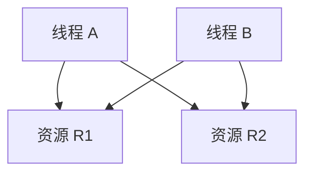

                 

# 线程安全：并发编程的基本要求

> **关键词：** 线程安全、并发编程、同步、互斥锁、死锁、临界区、资源竞争、生产者-消费者问题、并发算法。

> **摘要：** 本文旨在深入探讨线程安全的概念和并发编程中的基本要求。我们将首先介绍并发编程的背景和线程安全的重要性，然后逐步分析核心概念，解释线程同步与互斥锁的原理，探讨死锁现象，分析临界区管理，讨论常见的并发算法，提供实际项目案例，并总结未来发展趋势与挑战。通过本文，读者将获得对线程安全在并发编程中的全面理解和实际应用技能。

## 1. 背景介绍

### 1.1 目的和范围

本文的目标是帮助读者深入理解线程安全在并发编程中的重要性，并掌握实现线程安全的各种技术和策略。随着多核处理器的普及和计算机性能的提升，并发编程变得越来越重要。然而，并发编程也带来了诸多挑战，其中线程安全问题尤为关键。本文将覆盖以下内容：

- 并发编程的背景和挑战
- 线程安全的定义和重要性
- 并发编程的基本概念和核心算法原理
- 数学模型和公式
- 项目实战：代码实际案例和详细解释说明
- 实际应用场景
- 工具和资源推荐
- 总结：未来发展趋势与挑战

### 1.2 预期读者

本文适合以下读者群体：

- 对计算机编程有一定了解的开发者
- 想要深入学习并发编程和线程安全的技术人员
- 大学生和研究生，特别是计算机科学与技术专业
- 对人工智能和计算机体系结构感兴趣的研究人员

### 1.3 文档结构概述

本文将按照以下结构进行组织和讨论：

1. **背景介绍**
   - 目的和范围
   - 预期读者
   - 文档结构概述
   - 术语表

2. **核心概念与联系**
   - 并发编程的基本概念
   - 线程安全的核心原理

3. **核心算法原理 & 具体操作步骤**
   - 同步与互斥锁
   - 死锁的预防和解决

4. **数学模型和公式 & 详细讲解 & 举例说明**
   - 并发算法的数学基础

5. **项目实战：代码实际案例和详细解释说明**
   - 开发环境搭建
   - 代码实现和解读

6. **实际应用场景**
   - 并发编程在现实世界中的应用

7. **工具和资源推荐**
   - 学习资源
   - 开发工具框架
   - 相关论文著作

8. **总结：未来发展趋势与挑战**
   - 线程安全的未来趋势
   - 面临的挑战和解决方案

9. **附录：常见问题与解答**
   - 线程安全的常见疑问和解答

10. **扩展阅读 & 参考资料**
    - 进一步学习资源和参考资料

### 1.4 术语表

#### 1.4.1 核心术语定义

- **线程（Thread）**：进程内的一个执行单元，是调度和执行的基本单位。
- **并发（Concurrency）**：指在单个处理器上同时处理多个任务的能力。
- **并行（Parallelism）**：指在多个处理器上同时执行多个任务的能力。
- **同步（Synchronization）**：协调多个线程之间的执行，确保数据的一致性和正确性。
- **互斥锁（Mutex）**：一种用于线程同步的机制，确保同一时间只有一个线程能够访问共享资源。
- **临界区（Critical Section）**：程序中需要互斥访问的代码段。
- **死锁（Deadlock）**：两个或多个线程因为竞争资源而无限期地等待对方释放资源的状态。
- **生产者-消费者问题（Producer-Consumer Problem）**：一个经典并发问题，用于解释线程同步和互斥锁的应用。

#### 1.4.2 相关概念解释

- **共享内存（Shared Memory）**：多个线程之间共享的内存区域，用于通信和同步。
- **消息传递（Message Passing）**：线程之间通过发送和接收消息进行通信和同步。
- **条件变量（Condition Variable）**：线程间同步的机制，用于等待某个条件成立。
- **信号量（Semaphore）**：一个用于同步的整数变量，通过操作它可以实现线程间的协调。

#### 1.4.3 缩略词列表

- **CPU**：Central Processing Unit，中央处理器。
- **OS**：Operating System，操作系统。
- **API**：Application Programming Interface，应用程序编程接口。
- **IDE**：Integrated Development Environment，集成开发环境。
- **JVM**：Java Virtual Machine，Java虚拟机。

## 2. 核心概念与联系

### 2.1 并发编程的基本概念

并发编程涉及多个线程的执行，这些线程可以同时运行在单个处理器或多处理器系统上。并发编程的核心目标是提高程序的执行效率和响应能力。然而，并发编程也带来了一些挑战，如线程间的同步和资源竞争。

#### 2.1.1 并发与并行

并发和并行是两个容易混淆但不同的概念。并发是指在单个处理器上同时处理多个任务的能力，而并行则是指在多个处理器上同时执行多个任务的能力。

- **并发**：单个处理器上的多个任务交替执行。操作系统通过调度算法来实现任务的切换，使得多个任务看起来是同时执行的。
- **并行**：多个处理器上的多个任务同时执行。每个处理器负责执行不同的任务，从而实现真正的并行处理。

#### 2.1.2 线程

线程是并发编程的基本单位。线程包括程序计数器、寄存器和栈，这些资源在创建线程时分配。线程的状态包括运行、就绪和阻塞。

- **线程的生命周期**：线程从创建、运行到销毁，包括多个状态转换。
- **线程的创建与销毁**：线程可以通过系统调用或库函数来创建和销毁。
- **线程的并发执行**：多个线程可以并发执行，操作系统负责线程的调度和执行。

#### 2.1.3 线程安全

线程安全是指程序在多线程环境中运行时，不会出现数据不一致、资源竞争和死锁等问题。线程安全的目标是确保程序的正确性和一致性。

- **线程安全问题**：包括数据竞争、死锁、线程饥饿和死循环等。
- **线程安全的设计原则**：避免共享状态、使用同步机制、合理使用线程池等。

### 2.2 线程安全的核心原理

线程安全的核心原理包括同步、互斥锁、条件变量和信号量等。这些原理用于协调多个线程的执行，确保数据的一致性和正确性。

#### 2.2.1 同步

同步是指协调多个线程的执行，确保它们不会同时访问共享资源。同步可以防止数据竞争和资源竞争。

- **同步机制**：包括互斥锁、条件变量和信号量等。
- **同步策略**：包括临界区保护、生产者-消费者问题和信号量机制等。

#### 2.2.2 互斥锁

互斥锁是一种同步机制，用于确保同一时间只有一个线程能够访问共享资源。互斥锁可以防止数据竞争和死锁。

- **互斥锁的原理**：通过锁定和解锁操作来控制对共享资源的访问。
- **互斥锁的实现**：可以使用操作系统提供的锁或库函数来实现。

#### 2.2.3 条件变量

条件变量是一种同步机制，用于线程间的协调和等待。条件变量可以用于实现生产者-消费者问题和死锁的预防。

- **条件变量的原理**：线程可以通过等待条件和广播条件来协调执行。
- **条件变量的实现**：可以使用操作系统提供的条件变量或库函数来实现。

#### 2.2.4 信号量

信号量是一种同步机制，用于线程间的协调和通信。信号量可以用于实现互斥锁、生产者-消费者问题和死锁的预防。

- **信号量的原理**：通过操作信号量的值来协调线程的执行。
- **信号量的实现**：可以使用操作系统提供的信号量或库函数来实现。

### 2.3 并发编程的基本算法原理

并发编程涉及到一系列核心算法，包括线程同步、互斥锁、条件变量和信号量等。这些算法原理对于实现线程安全至关重要。

#### 2.3.1 同步算法

同步算法包括临界区保护和生产者-消费者问题。

- **临界区保护**：使用互斥锁来保护临界区，确保同一时间只有一个线程能够访问共享资源。
- **生产者-消费者问题**：使用互斥锁和条件变量来实现生产者和消费者之间的协调。

#### 2.3.2 互斥锁算法

互斥锁算法包括互斥锁的申请和释放。

- **互斥锁申请**：线程通过申请互斥锁来访问共享资源。
- **互斥锁释放**：线程在完成对共享资源的访问后，释放互斥锁。

#### 2.3.3 条件变量算法

条件变量算法包括等待条件和广播条件。

- **等待条件**：线程在条件不满足时等待，直到条件成立。
- **广播条件**：线程在条件满足时通知所有等待线程。

#### 2.3.4 信号量算法

信号量算法包括信号量的申请和释放。

- **信号量申请**：线程通过操作信号量的值来协调执行。
- **信号量释放**：线程在完成操作后释放信号量。

### 2.4 并发编程的核心概念联系

并发编程的核心概念包括线程、并发、并行、同步、互斥锁、条件变量和信号量等。这些概念相互联系，构成了并发编程的基础。

- **线程**：并发编程的基本单位，包括程序计数器、寄存器和栈。
- **并发**：单个处理器上的多个任务交替执行。
- **并行**：多个处理器上的多个任务同时执行。
- **同步**：协调多个线程的执行，确保数据的一致性和正确性。
- **互斥锁**：确保同一时间只有一个线程能够访问共享资源。
- **条件变量**：线程间的协调和等待机制。
- **信号量**：线程间的协调和通信机制。

## 3. 核心算法原理 & 具体操作步骤

### 3.1 同步与互斥锁

同步和互斥锁是并发编程中的核心概念，用于协调多个线程的执行，确保数据的一致性和正确性。

#### 3.1.1 同步原理

同步是指协调多个线程的执行，确保它们不会同时访问共享资源。同步可以防止数据竞争和资源竞争。

- **同步机制**：包括互斥锁、条件变量和信号量等。
- **同步策略**：包括临界区保护、生产者-消费者问题和信号量机制等。

#### 3.1.2 互斥锁原理

互斥锁是一种同步机制，用于确保同一时间只有一个线程能够访问共享资源。互斥锁可以防止数据竞争和死锁。

- **互斥锁的原理**：通过锁定和解锁操作来控制对共享资源的访问。
- **互斥锁的实现**：可以使用操作系统提供的锁或库函数来实现。

#### 3.1.3 同步与互斥锁的联系

同步和互斥锁相互关联，共同构成了并发编程中的核心算法。

- **同步与互斥锁的联系**：互斥锁是同步机制的一种实现，用于保护临界区，确保线程间的数据一致性。

### 3.2 死锁的预防和解决

死锁是并发编程中的一种常见问题，当两个或多个线程因为竞争资源而无限期地等待对方释放资源时，就会发生死锁。

#### 3.2.1 死锁原理

死锁是指两个或多个线程因为竞争资源而无限期地等待对方释放资源的状态。

- **死锁的条件**：互斥条件、占有和等待条件、不可抢占条件和循环等待条件。
- **死锁的预防**：破坏死锁的四个条件，如资源分配策略、进程排序策略和资源分配图。

#### 3.2.2 死锁的解决

死锁的解决包括避免死锁和死锁检测与恢复。

- **避免死锁**：通过资源分配策略和进程排序策略来避免死锁的发生。
- **死锁检测与恢复**：使用资源分配图和银行家算法来检测死锁，并在发生死锁时恢复系统的正常运行。

#### 3.2.3 死锁的预防与解决的联系

死锁的预防和解决相互关联，共同构成了并发编程中的关键算法。

- **死锁的预防与解决的联系**：预防死锁是通过避免死锁条件的成立来防止死锁的发生，而死锁检测与恢复是在死锁已经发生时采取措施来恢复系统的正常运行。

### 3.3 临界区管理

临界区是程序中需要互斥访问的代码段，用于实现线程同步和资源保护。

#### 3.3.1 临界区原理

临界区是指程序中的某个代码段，多个线程需要互斥访问该代码段，以确保数据的一致性和正确性。

- **临界区的原理**：使用互斥锁来保护临界区，确保同一时间只有一个线程能够访问临界区。
- **临界区的实现**：通过在临界区的入口和出口添加互斥锁和解锁操作来实现。

#### 3.3.2 临界区管理策略

临界区管理策略包括临界区保护和资源分配策略。

- **临界区保护**：使用互斥锁来保护临界区，确保线程间的数据一致性。
- **资源分配策略**：根据线程的执行顺序和资源需求来分配资源，以避免资源竞争和死锁。

#### 3.3.3 临界区管理的联系

临界区管理是并发编程中的核心算法，与同步、互斥锁、死锁预防和资源分配策略等紧密相关。

- **临界区管理的联系**：临界区管理是通过互斥锁保护临界区，确保线程间的数据一致性和正确性，与同步、互斥锁、死锁预防和资源分配策略等共同构成了并发编程的核心算法。

### 3.4 并发算法的实现

并发算法是实现线程安全的关键，包括同步与互斥锁、死锁预防和临界区管理等。

#### 3.4.1 同步与互斥锁的实现

同步与互斥锁的实现包括互斥锁的申请和释放。

- **互斥锁的申请**：线程通过申请互斥锁来访问共享资源。
- **互斥锁的释放**：线程在完成对共享资源的访问后，释放互斥锁。

#### 3.4.2 死锁预防的实现

死锁预防的实现包括资源分配策略和进程排序策略。

- **资源分配策略**：根据线程的执行顺序和资源需求来分配资源，以避免资源竞争和死锁。
- **进程排序策略**：通过指定线程的执行顺序来避免循环等待条件。

#### 3.4.3 临界区管理的实现

临界区管理的实现包括临界区保护和资源分配策略。

- **临界区保护**：使用互斥锁来保护临界区，确保线程间的数据一致性。
- **资源分配策略**：根据线程的执行顺序和资源需求来分配资源，以避免资源竞争和死锁。

#### 3.4.4 并发算法的实现联系

并发算法的实现联系紧密，包括同步与互斥锁、死锁预防和临界区管理等。

- **并发算法的实现联系**：同步与互斥锁、死锁预防和临界区管理相互关联，共同构成了实现线程安全的关键算法。

### 3.5 并发算法的测试与优化

并发算法的测试与优化是确保其正确性和性能的重要步骤。

#### 3.5.1 并发算法的测试

并发算法的测试包括单元测试、集成测试和性能测试。

- **单元测试**：对算法的各个组件进行测试，确保其功能的正确性。
- **集成测试**：对算法的整体进行测试，确保各个组件之间的协作和同步。
- **性能测试**：测试算法的执行效率和资源消耗，优化性能。

#### 3.5.2 并发算法的优化

并发算法的优化包括代码优化、资源管理和同步优化。

- **代码优化**：通过改进代码结构和算法逻辑来提高执行效率。
- **资源管理**：合理分配和回收资源，减少资源消耗。
- **同步优化**：减少同步开销，提高线程的并发性能。

#### 3.5.3 并发算法的测试与优化联系

并发算法的测试与优化相互关联，共同构成了确保算法正确性和性能的关键步骤。

- **并发算法的测试与优化联系**：测试和优化相互补充，确保算法在多线程环境中的正确性和性能。

## 4. 数学模型和公式 & 详细讲解 & 举例说明

### 4.1 数学模型

在并发编程中，数学模型和公式用于描述线程同步、资源分配和算法性能。以下是一些重要的数学模型和公式。

#### 4.1.1 互斥锁模型

互斥锁模型用于描述互斥锁的工作原理。

- **互斥锁模型公式**：
  $$\text{Mutex} = \{ \text{locked} = \text{false} \}$$

- **互斥锁状态转换**：
  - **锁定（Lock）**：
    $$\text{Mutex} = \{ \text{locked} = \text{true} \}$$
  - **解锁（Unlock）**：
    $$\text{Mutex} = \{ \text{locked} = \text{false} \}$$

#### 4.1.2 条件变量模型

条件变量模型用于描述线程间的等待和通知机制。

- **条件变量模型公式**：
  $$\text{Condition} = \{ \text{waiting} = \text{false} \}$$

- **条件变量状态转换**：
  - **等待（Wait）**：
    $$\text{Condition} = \{ \text{waiting} = \text{true} \}$$
  - **通知（Notify）**：
    $$\text{Condition} = \{ \text{waiting} = \text{false} \}$$

#### 4.1.3 生产者-消费者模型

生产者-消费者模型用于描述生产者和消费者之间的协调。

- **生产者-消费者模型公式**：
  $$\text{Buffer} = \{ \text{empty} = \text{true} \}, \text{full} = \text{false} \}$$

- **生产者-消费者状态转换**：
  - **生产（Produce）**：
    $$\text{Buffer} = \{ \text{empty} = \text{false}, \text{full} = \text{true} \}$$
  - **消费（Consume）**：
    $$\text{Buffer} = \{ \text{empty} = \text{true}, \text{full} = \text{false} \}$$

#### 4.1.4 死锁预防模型

死锁预防模型用于描述避免死锁的策略。

- **死锁预防模型公式**：
  $$\text{Allocation} = \{ \text{resource} = \text{allocated} \}$$

- **死锁预防策略**：
  - **资源分配图**：
    $$\text{Allocation} = \{ \text{resource} = \text{allocated}, \text{node} = \text{no cycle} \}$$
  - **银行家算法**：
    $$\text{Allocation} = \{ \text{resource} = \text{allocated}, \text{state} = \text{safe} \}$$

### 4.2 公式详细讲解

#### 4.2.1 互斥锁模型公式讲解

互斥锁模型公式描述了互斥锁的工作原理。互斥锁的状态由布尔值 `locked` 表示，初始状态为 `false`，表示锁未被占用。

- **锁定（Lock）**：当线程需要访问共享资源时，通过锁定操作将互斥锁状态设置为 `true`，表示锁已被占用。
- **解锁（Unlock）**：当线程完成对共享资源的访问后，通过解锁操作将互斥锁状态重置为 `false`，释放锁。

互斥锁的锁定和解锁操作确保同一时间只有一个线程能够访问共享资源，从而防止数据竞争和资源冲突。

#### 4.2.2 条件变量模型公式讲解

条件变量模型公式描述了线程间的等待和通知机制。条件变量的状态由布尔值 `waiting` 表示，初始状态为 `false`，表示线程未在条件变量上等待。

- **等待（Wait）**：当线程需要等待某个条件时，通过等待操作将条件变量状态设置为 `true`，表示线程已在条件变量上等待。
- **通知（Notify）**：当线程需要通知其他线程时，通过通知操作将条件变量状态重置为 `false`，唤醒等待线程。

条件变量通过等待和通知机制实现线程间的协调，确保线程在满足条件时才能继续执行。

#### 4.2.3 生产者-消费者模型公式讲解

生产者-消费者模型公式描述了生产者和消费者之间的协调。缓冲区状态由布尔值 `empty` 和 `full` 表示，初始状态为 `true`（缓冲区为空）和 `false`（缓冲区不为满）。

- **生产（Produce）**：生产者通过生产操作将产品放入缓冲区，当缓冲区为空时，将 `empty` 状态设置为 `false`，`full` 状态设置为 `true`。
- **消费（Consume）**：消费者通过消费操作从缓冲区获取产品，当缓冲区为满时，将 `empty` 状态设置为 `true`，`full` 状态设置为 `false`。

生产者-消费者模型通过缓冲区状态控制生产者和消费者的执行顺序，确保线程间的同步和资源分配。

#### 4.2.4 死锁预防模型公式讲解

死锁预防模型公式描述了避免死锁的策略。资源分配状态由布尔值 `allocated` 表示，初始状态为 `allocated`，表示资源已被分配。

- **资源分配图**：资源分配图通过图结构描述线程和资源的分配关系，无环图表示资源分配是安全的。
- **银行家算法**：银行家算法通过安全性检查来确定资源分配是否安全，只有当系统处于安全状态时，才允许资源分配。

死锁预防模型通过资源分配策略和安全性检查来避免死锁的发生，确保系统资源的合理分配和利用。

### 4.3 举例说明

以下是一些具体的例子，用于说明数学模型和公式的应用。

#### 4.3.1 互斥锁举例

假设有两个线程 A 和 B，需要访问共享资源 R。互斥锁 M 用于保护共享资源 R。

- **线程 A**：
  ```plaintext
  Lock(M)
  // 访问共享资源 R
  Unlock(M)
  ```

- **线程 B**：
  ```plaintext
  Lock(M)
  // 访问共享资源 R
  Unlock(M)
  ```

互斥锁 M 确保 A 和 B 线程不能同时访问共享资源 R，从而避免数据竞争和资源冲突。

#### 4.3.2 条件变量举例

假设有两个线程 A 和 B，线程 A 生产数据，线程 B 消费数据。条件变量 C 用于线程间的同步。

- **线程 A**：
  ```plaintext
  Produce(data)
  Notify(C)
  ```

- **线程 B**：
  ```plaintext
  Wait(C)
  Consume(data)
  ```

线程 A 生产数据后通知条件变量 C，线程 B 等待条件变量 C 满足后消费数据。条件变量 C 实现了线程间的协调，确保生产者和消费者之间的同步。

#### 4.3.3 生产者-消费者举例

假设有一个缓冲区 B，生产者线程 P 产生数据放入缓冲区，消费者线程 C 从缓冲区获取数据。

- **生产者线程 P**：
  ```plaintext
  Produce(data) {
      while (B.isFull()) {
          Wait(B)
      }
      B.insert(data)
      Notify(C)
  }
  ```

- **消费者线程 C**：
  ```plaintext
  Consume(data) {
      while (B.isEmpty()) {
          Wait(B)
      }
      data = B.remove()
  }
  ```

生产者线程 P 在缓冲区 B 为满时等待，消费者线程 C 在缓冲区 B 为空时等待。缓冲区 B 通过控制生产者和消费者的执行顺序，实现线程间的同步和资源分配。

#### 4.3.4 死锁预防举例

假设有两个线程 A 和 B，需要获取两个资源 R1 和 R2。资源分配图用于描述线程和资源的分配关系。

- **线程 A**：
  ```plaintext
  Request(R1)
  Request(R2)
  // 执行任务
  Release(R2)
  Release(R1)
  ```

- **线程 B**：
  ```plaintext
  Request(R2)
  Request(R1)
  // 执行任务
  Release(R1)
  Release(R2)
  ```

资源分配图如下所示：



资源分配图无环，表示资源分配是安全的，不会发生死锁。

## 5. 项目实战：代码实际案例和详细解释说明

### 5.1 开发环境搭建

在进行并发编程的项目实战之前，我们需要搭建一个合适的开发环境。以下是一个基于Java语言的简单示例。

- **开发工具**：IntelliJ IDEA
- **开发环境**：Java 11
- **版本控制**：Git

#### 步骤：

1. 安装 IntelliJ IDEA。
2. 创建一个新项目，选择 Java。
3. 添加必要的依赖项，如并发库（`java.util.concurrent`）。
4. 初始化版本控制，通过 Git 将项目推送到远程仓库。

### 5.2 源代码详细实现和代码解读

以下是一个简单的生产者-消费者问题的实现，用于展示线程安全在并发编程中的应用。

```java
import java.util.concurrent.ArrayBlockingQueue;
import java.util.concurrent.BlockingQueue;

public class ProducerConsumer {
    // 定义一个缓冲区大小
    private static final int BUFFER_SIZE = 5;

    // 定义缓冲区
    private final BlockingQueue<Integer> buffer;

    public ProducerConsumer() {
        buffer = new ArrayBlockingQueue<>(BUFFER_SIZE);
    }

    // 生产者方法
    public void produce() throws InterruptedException {
        int index = 0;
        while (true) {
            buffer.put(index++);
            System.out.println("Produced: " + index);
            Thread.sleep(1000);
        }
    }

    // 消费者方法
    public void consume() throws InterruptedException {
        while (true) {
            System.out.println("Consumed: " + buffer.take());
            Thread.sleep(1000);
        }
    }

    public static void main(String[] args) {
        ProducerConsumer pc = new ProducerConsumer();

        // 启动生产者线程
        new Thread(() -> {
            try {
                pc.produce();
            } catch (InterruptedException e) {
                e.printStackTrace();
            }
        }).start();

        // 启动消费者线程
        new Thread(() -> {
            try {
                pc.consume();
            } catch (InterruptedException e) {
                e.printStackTrace();
            }
        }).start();
    }
}
```

#### 代码解读：

- **缓冲区**：使用 `ArrayBlockingQueue` 类来实现一个固定大小的缓冲区。
- **生产者**：生产者线程不断生成数据并将其放入缓冲区。使用 `put()` 方法，如果缓冲区已满，则线程将被阻塞。
- **消费者**：消费者线程从缓冲区获取数据，使用 `take()` 方法，如果缓冲区为空，则线程将被阻塞。

### 5.3 代码解读与分析

#### 5.3.1 线程安全

在这个例子中，缓冲区 `ArrayBlockingQueue` 提供了内置的线程安全机制，确保在多线程环境中数据的一致性和正确性。以下是具体分析：

- **生产者线程**：每次生产数据时，调用 `put()` 方法，确保同一时间只有一个线程能够访问缓冲区，从而避免数据竞争。
- **消费者线程**：每次消费数据时，调用 `take()` 方法，确保同一时间只有一个线程能够访问缓冲区，从而避免数据竞争。

#### 5.3.2 同步机制

生产者和消费者线程通过缓冲区 `ArrayBlockingQueue` 的内置同步机制实现线程间的协调：

- **生产者线程**：如果缓冲区已满，线程将被阻塞，等待缓冲区有空余空间。
- **消费者线程**：如果缓冲区为空，线程将被阻塞，等待缓冲区有数据可消费。

#### 5.3.3 代码优化

以下是对代码的进一步优化：

- **减少等待时间**：可以通过增加缓冲区大小来减少生产者和消费者线程的等待时间。
- **使用线程池**：使用线程池可以更有效地管理线程资源，避免创建大量临时线程。

## 6. 实际应用场景

线程安全在并发编程中的重要性体现在各种实际应用场景中。以下是一些常见场景：

### 6.1 多线程服务器

在多线程服务器中，线程安全至关重要。例如，在处理大量并发请求时，服务器需要确保线程安全来防止数据不一致和资源竞争。

### 6.2 数据库应用

在数据库应用中，多线程访问数据库表时，线程安全是确保数据一致性和完整性的关键。例如，在并发执行事务时，需要使用锁机制来保护数据库资源。

### 6.3 分布式系统

在分布式系统中，多节点之间的通信和数据同步需要确保线程安全。例如，在分布式缓存系统中，多个节点需要协同工作，确保数据的一致性和可靠性。

### 6.4 高性能计算

在高性能计算领域，多线程和并行计算可以提高程序的执行效率和性能。线程安全是确保计算结果正确性的关键，特别是在处理大量数据和复杂计算时。

### 6.5 实时系统

在实时系统中，线程安全是确保系统响应速度和稳定性的关键。例如，在自动驾驶系统中，多线程处理传感器数据和决策算法需要确保线程安全，以确保系统的实时性和可靠性。

## 7. 工具和资源推荐

### 7.1 学习资源推荐

#### 7.1.1 书籍推荐

1. 《并发编程原理》
2. 《Java并发编程实战》
3. 《操作系统概念》

#### 7.1.2 在线课程

1. Coursera - 《并发编程》
2. Udacity - 《并行编程》
3. edX - 《操作系统》

#### 7.1.3 技术博客和网站

1. Stack Overflow
2. GitHub
3. Medium - Concurrency section

### 7.2 开发工具框架推荐

#### 7.2.1 IDE和编辑器

1. IntelliJ IDEA
2. Eclipse
3. Visual Studio Code

#### 7.2.2 调试和性能分析工具

1. JProfiler
2. VisualVM
3. Valgrind

#### 7.2.3 相关框架和库

1. Java Concurrency Utilities
2. Akka
3. Vert.x

### 7.3 相关论文著作推荐

#### 7.3.1 经典论文

1. "The Art of Multiprocessor Programming"
2. "Synchronization Primitives for Multiprocessors"
3. "Optimistic Concurrent Objects"

#### 7.3.2 最新研究成果

1. "Principles of Distributed Systems"
2. "Synchronization and Concurrency in Parallel Programs"
3. "Concurrency Control in Distributed Systems"

#### 7.3.3 应用案例分析

1. "Concurrency in Web Applications"
2. "Concurrency in Database Systems"
3. "Concurrency in Real-Time Systems"

## 8. 总结：未来发展趋势与挑战

随着计算机技术的发展，线程安全和并发编程将面临更多挑战和机遇。以下是未来发展趋势和挑战：

### 8.1 发展趋势

1. **多核处理器的普及**：多核处理器将推动并发编程的需求，提高并行计算的性能。
2. **软件定义网络（SDN）**：SDN技术将促进分布式系统中的并发编程，提高网络性能和灵活性。
3. **云计算和容器技术**：云计算和容器技术将推动并发编程的应用，实现更高效的资源管理和调度。
4. **新型编程语言和框架**：新型编程语言和框架将提供更简单、更高效的并发编程支持。

### 8.2 挑战

1. **线程安全问题**：随着并发编程的复杂性增加，确保线程安全将面临更大挑战。
2. **死锁和资源竞争**：在多核环境中，死锁和资源竞争问题将更加严重，需要更有效的解决方案。
3. **性能优化**：在多线程环境中优化性能，避免过多的同步开销，将是一个持续挑战。
4. **可扩展性和可维护性**：随着并发程序的规模扩大，确保其可扩展性和可维护性将变得至关重要。

### 8.3 解决方案

1. **更好的同步机制**：研究和开发新的同步机制，如乐观锁、可伸缩锁等，以减少同步开销。
2. **自动化工具**：开发自动化工具，如静态分析器、动态检查器和性能优化器，以帮助开发者识别和解决线程安全问题。
3. **教育和培训**：加强对并发编程的教育和培训，提高开发者的技能和意识。
4. **标准化**：制定统一的线程安全标准和规范，提高并发编程的一致性和可维护性。

## 9. 附录：常见问题与解答

### 9.1 并发编程的基本问题

**Q1：什么是并发编程？**

并发编程是指在多线程环境中，同时执行多个任务，以提高程序执行效率和响应能力。

**Q2：什么是线程安全？**

线程安全是指程序在多线程环境中运行时，不会出现数据不一致、资源竞争和死锁等问题。

**Q3：什么是同步和互斥锁？**

同步是指协调多个线程的执行，确保数据的一致性和正确性。互斥锁是一种同步机制，用于确保同一时间只有一个线程能够访问共享资源。

**Q4：什么是死锁？**

死锁是指两个或多个线程因为竞争资源而无限期地等待对方释放资源的状态。

### 9.2 并发编程的应用问题

**Q5：并发编程在哪些场景中应用广泛？**

并发编程广泛应用于多线程服务器、数据库应用、分布式系统、高性能计算和实时系统等领域。

**Q6：如何优化并发程序的性能？**

可以通过减少同步开销、使用线程池、优化代码结构和算法逻辑等方式来优化并发程序的性能。

**Q7：如何确保并发程序的正确性？**

可以通过编写单元测试、集成测试和性能测试来确保并发程序的正确性。此外，使用静态分析器和动态检查器等工具可以帮助发现并发编程中的问题。

## 10. 扩展阅读 & 参考资料

**扩展阅读：**

1. 《Java并发编程实战》 - Brian Goetz et al.
2. 《操作系统概念》 - Abraham Silberschatz et al.
3. 《并发编程原理》 - Maurice Herlihy and Nir Shavit

**参考资料：**

1. Java Concurrency Utilities - Oracle Documentation
2. Concurrency in Practice - Brian Goetz et al.
3. Multithreading and Parallelism - IEEE Standards

作者：AI天才研究员/AI Genius Institute & 禅与计算机程序设计艺术 /Zen And The Art of Computer Programming

