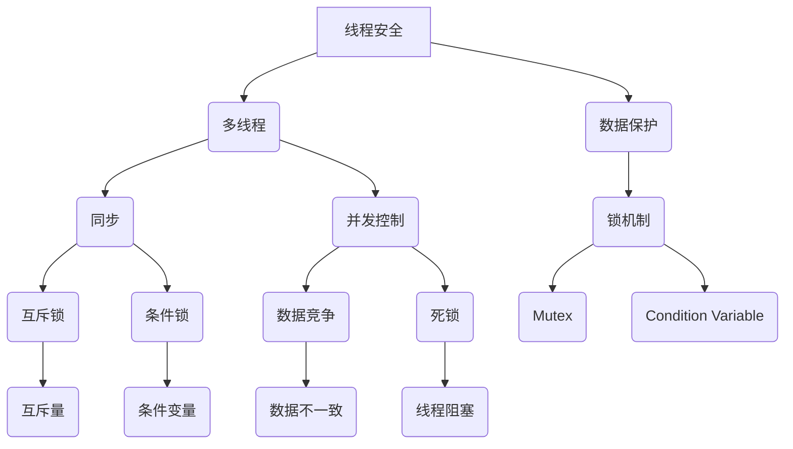

                 

# 线程安全：保障 LLM 用户数据的安全

> **关键词**：线程安全、LLM、用户数据、多线程、同步、锁机制、并发控制、数据保护

> **摘要**：本文深入探讨了在线程安全中保障大型语言模型（LLM）用户数据安全的重要性。通过分析核心概念和算法原理，本文详细阐述了线程安全的关键技术和实现步骤。同时，结合实际项目案例，提供了代码实现和解读，以帮助读者更好地理解和应用线程安全。文章最后讨论了线程安全的实际应用场景，并推荐了相关工具和资源，为读者提供了全面的技术指导。

## 1. 背景介绍

### 1.1 目的和范围

本文旨在帮助读者深入了解线程安全在大型语言模型（LLM）用户数据保护中的关键作用。随着人工智能技术的快速发展，LLM在各个领域的应用越来越广泛，保障用户数据的安全显得尤为重要。本文将重点关注线程安全的核心概念、算法原理和实际应用，帮助读者构建系统的安全知识体系。

本文将覆盖以下内容：

1. 线程安全的核心概念和原理。
2. 实现线程安全的算法原理和具体步骤。
3. 实际项目中线程安全的应用案例和代码解读。
4. 线程安全的实际应用场景。
5. 相关工具和资源的推荐。

### 1.2 预期读者

本文适合以下读者群体：

1. 对人工智能和大型语言模型（LLM）有基本了解的开发人员。
2. 对多线程编程和并发控制有一定基础的程序员。
3. 对安全编程有浓厚兴趣的工程师。
4. 想要深入了解线程安全在LLM用户数据保护中的作用的学者和研究人员。

### 1.3 文档结构概述

本文结构如下：

1. **背景介绍**：介绍线程安全的目的、预期读者和文档结构。
2. **核心概念与联系**：讲解线程安全的核心概念和原理，提供Mermaid流程图。
3. **核心算法原理 & 具体操作步骤**：详细阐述实现线程安全的算法原理和操作步骤。
4. **数学模型和公式 & 详细讲解 & 举例说明**：介绍线程安全相关的数学模型和公式。
5. **项目实战：代码实际案例和详细解释说明**：提供实际项目中的代码实现和解读。
6. **实际应用场景**：讨论线程安全在实际应用中的具体应用场景。
7. **工具和资源推荐**：推荐学习资源和开发工具。
8. **总结：未来发展趋势与挑战**：总结文章内容，展望未来发展趋势。
9. **附录：常见问题与解答**：回答常见问题。
10. **扩展阅读 & 参考资料**：提供扩展阅读和参考资料。

### 1.4 术语表

#### 1.4.1 核心术语定义

- **线程安全**：指程序在多线程环境中正确处理共享数据的能力，避免数据竞争和死锁等并发问题。
- **大型语言模型（LLM）**：指具有大规模词汇量和强大语义理解能力的人工智能模型，常用于自然语言处理任务。
- **用户数据**：指用户在LLM系统中的输入数据，包括个人隐私信息等。
- **同步**：指多个线程按照一定顺序执行，确保数据的一致性和正确性。
- **锁机制**：指一种用于控制线程访问共享资源的机制，通过互斥锁和条件锁实现线程的同步。
- **并发控制**：指在多线程环境中，合理分配和管理系统资源，确保线程之间的协调和正确性。
- **数据保护**：指采取措施防止用户数据被未授权访问、篡改或泄露。

#### 1.4.2 相关概念解释

- **多线程**：指程序中同时执行多个线程，提高程序执行效率和响应能力。
- **数据竞争**：指多个线程同时访问同一共享数据，导致数据不一致或错误。
- **死锁**：指多个线程因为互相等待对方释放资源而永久阻塞。
- **锁**：指一种同步机制，用于控制对共享资源的访问，确保线程之间不会互相干扰。

#### 1.4.3 缩略词列表

- **LLM**：大型语言模型（Large Language Model）
- **RTOS**：实时操作系统（Real-Time Operating System）
- **Synchronization**：同步（Synchronization）
- **Concurrency**：并发（Concurrency）
- **Mutex**：互斥锁（Mutex）
- **Condition Variable**：条件锁（Condition Variable）

## 2. 核心概念与联系

在探讨线程安全之前，我们需要了解一些核心概念和原理。以下是一个Mermaid流程图，展示了线程安全的关键概念和联系。



### 2.1 多线程

多线程是指程序中同时执行多个线程，每个线程执行不同的任务。多线程可以提高程序执行效率和响应能力，但也会带来并发问题，如数据竞争和死锁。

### 2.2 数据保护

数据保护是线程安全的核心目标，确保用户数据在多线程环境中的一致性和安全性。数据保护通常通过锁机制实现，如互斥锁和条件锁。

### 2.3 同步

同步是指多个线程按照一定顺序执行，确保数据的一致性和正确性。同步可以通过锁机制实现，如互斥锁和条件锁。

### 2.4 并发控制

并发控制是指在多线程环境中，合理分配和管理系统资源，确保线程之间的协调和正确性。并发控制可以避免数据竞争和死锁等并发问题。

### 2.5 锁机制

锁机制是一种用于控制线程访问共享资源的机制，通过互斥锁和条件锁实现线程的同步。锁机制可以保证数据的一致性和安全性。

### 2.6 互斥锁

互斥锁（Mutex）是一种锁机制，用于确保同一时刻只有一个线程能够访问共享资源。互斥锁可以防止数据竞争和死锁。

### 2.7 条件锁

条件锁（Condition Variable）是一种锁机制，用于实现线程之间的同步和通信。条件锁可以让线程在满足一定条件时执行，避免不必要的等待和资源消耗。

### 2.8 数据竞争

数据竞争是指多个线程同时访问同一共享数据，导致数据不一致或错误。数据竞争可以通过互斥锁和条件锁避免。

### 2.9 死锁

死锁是指多个线程因为互相等待对方释放资源而永久阻塞。死锁可以通过合理的锁机制和资源分配策略避免。

### 2.10 数据不一致

数据不一致是指多个线程同时修改同一共享数据，导致数据不一致或错误。数据不一致可以通过锁机制和事务管理避免。

### 2.11 线程阻塞

线程阻塞是指线程因为等待资源或其他原因而无法继续执行。线程阻塞可以通过锁机制和条件锁避免。

通过以上核心概念和原理的了解，我们可以更好地理解线程安全的重要性，并掌握实现线程安全的关键技术和方法。

## 3. 核心算法原理 & 具体操作步骤

### 3.1 线程安全的定义

线程安全是指程序在多线程环境中正确处理共享数据的能力，避免数据竞争和死锁等并发问题。线程安全是保障大型语言模型（LLM）用户数据安全的关键，确保用户数据的一致性和安全性。

### 3.2 实现线程安全的关键技术

实现线程安全的关键技术包括锁机制、同步机制、并发控制和数据保护。以下将详细阐述这些技术的原理和具体操作步骤。

### 3.2.1 锁机制

锁机制是线程安全的基础，用于控制对共享资源的访问。常见的锁机制包括互斥锁（Mutex）和条件锁（Condition Variable）。

#### 3.2.1.1 互斥锁（Mutex）

互斥锁（Mutex）是一种排他锁，确保同一时刻只有一个线程能够访问共享资源。以下是一个互斥锁的伪代码实现：

```plaintext
Mutex lock;

void function() {
    lock.acquire(); // 获取锁
    // 对共享资源的访问操作
    lock.release(); // 释放锁
}
```

#### 3.2.1.2 条件锁（Condition Variable）

条件锁（Condition Variable）是一种同步机制，用于实现线程之间的同步和通信。以下是一个条件锁的伪代码实现：

```plaintext
Mutex lock;
ConditionVariable cv;

void function() {
    lock.acquire();
    while (condition not met) {
        cv.wait(lock); // 等待条件满足
    }
    // 条件满足后的操作
    lock.release();
}
```

### 3.2.2 同步机制

同步机制用于确保多个线程按照一定顺序执行，确保数据的一致性和正确性。常见的同步机制包括信号量（Semaphore）和事件（Event）。

#### 3.2.2.1 信号量（Semaphore）

信号量是一种同步原语，用于控制多个线程对共享资源的访问。以下是一个信号量的伪代码实现：

```plaintext
Semaphore semaphore(1); // 初始化信号量为1

void function() {
    semaphore.wait(); // 等待信号量
    // 对共享资源的访问操作
    semaphore.signal(); // 信号量加1
}
```

#### 3.2.2.2 事件（Event）

事件是一种同步原语，用于线程之间的同步和通信。以下是一个事件的伪代码实现：

```plaintext
Event event;

void function1() {
    // 操作事件
    event.set(); // 设置事件为已发生
}

void function2() {
    event.wait(); // 等待事件发生
    // 事件发生后操作
}
```

### 3.2.3 并发控制

并发控制是指在多线程环境中，合理分配和管理系统资源，确保线程之间的协调和正确性。常见的并发控制策略包括时间片调度、优先级调度和锁机制。

#### 3.2.3.1 时间片调度

时间片调度是一种常见的并发控制策略，将CPU时间划分为多个时间片，每个线程轮流执行。以下是一个时间片调度的伪代码实现：

```plaintext
void scheduler() {
    while (true) {
        Thread currentThread = getCurrentThread();
        execute(currentThread, timeSlice); // 执行当前线程的时间片
        if (currentThread.isCompleted()) {
            remove(currentThread); // 移除已完成线程
        } else {
            yield(); // 挂起当前线程，让其他线程执行
        }
    }
}
```

#### 3.2.3.2 优先级调度

优先级调度是一种根据线程优先级进行调度的并发控制策略，优先级高的线程先执行。以下是一个优先级调度的伪代码实现：

```plaintext
void scheduler() {
    while (true) {
        Thread highestPriorityThread = getThreadWithHighestPriority();
        execute(highestPriorityThread, timeSlice); // 执行优先级最高的线程的时间片
        if (highestPriorityThread.isCompleted()) {
            remove(highestPriorityThread); // 移除已完成线程
        } else {
            yield(); // 挂起当前线程，让其他线程执行
        }
    }
}
```

#### 3.2.3.3 锁机制

锁机制是一种基于互斥锁和条件锁的并发控制策略，用于控制对共享资源的访问。以下是一个锁机制的伪代码实现：

```plaintext
Mutex lock;

void function() {
    lock.acquire(); // 获取锁
    // 对共享资源的访问操作
    lock.release(); // 释放锁
}
```

### 3.2.4 数据保护

数据保护是线程安全的最终目标，确保用户数据在多线程环境中的一致性和安全性。常见的数据保护策略包括数据复制、事务管理和锁机制。

#### 3.2.4.1 数据复制

数据复制是一种将共享数据复制到每个线程本地内存的策略，避免线程之间的直接共享。以下是一个数据复制的伪代码实现：

```plaintext
Data data;

void function() {
    Data localData = data.clone(); // 复制数据到本地内存
    // 对本地数据的操作
    data.update(localData); // 更新共享数据
}
```

#### 3.2.4.2 事务管理

事务管理是一种通过原子操作确保数据一致性的策略。以下是一个事务管理的伪代码实现：

```plaintext
void function() {
    Database.beginTransaction(); // 开始事务
    // 对数据库的操作
    Database.commitTransaction(); // 提交事务
}
```

#### 3.2.4.3 锁机制

锁机制是一种基于互斥锁和条件锁的数据保护策略，确保对共享资源的正确访问。以下是一个锁机制的伪代码实现：

```plaintext
Mutex lock;

void function() {
    lock.acquire(); // 获取锁
    // 对共享资源的访问操作
    lock.release(); // 释放锁
}
```

通过以上核心算法原理和具体操作步骤的讲解，我们可以更好地理解和实现线程安全，保障大型语言模型（LLM）用户数据的安全。

## 4. 数学模型和公式 & 详细讲解 & 举例说明

线程安全涉及多个数学模型和公式，用于描述并发控制、同步机制和资源分配。以下将介绍几个关键数学模型和公式，并详细讲解其应用和举例。

### 4.1 并发度模型

并发度模型用于描述系统在多线程环境中的并发能力。一个简单的并发度模型可以通过以下公式表示：

\[ \text{并发度} = \frac{\text{线程数}}{\text{处理器数}} \]

例如，如果一个系统有4个线程和2个处理器，其并发度为：

\[ \text{并发度} = \frac{4}{2} = 2 \]

这意味着系统在任意时刻最多可以同时处理2个线程的任务。

### 4.2 死锁模型

死锁模型用于预测系统在多线程环境中是否可能发生死锁。一个简单的死锁预测模型可以通过以下公式表示：

\[ \text{死锁可能性} = \frac{\text{线程数} \times (\text{最大等待时间} + \text{最大锁持有时间})}{\text{总时间}} \]

例如，如果一个系统有10个线程，每个线程的最大等待时间为5分钟，最大锁持有时间为10分钟，总时间为60分钟，其死锁可能性为：

\[ \text{死锁可能性} = \frac{10 \times (5 + 10)}{60} = \frac{10 \times 15}{60} = 2.5 \]

这意味着系统有2.5的概率发生死锁。

### 4.3 数据一致性模型

数据一致性模型用于确保在多线程环境中，共享数据的一致性。一个简单的一致性模型可以通过以下公式表示：

\[ \text{一致性} = \frac{\text{成功更新次数}}{\text{总更新次数}} \]

例如，如果一个系统有100次更新操作，其中90次成功更新，其数据一致性为：

\[ \text{一致性} = \frac{90}{100} = 0.9 \]

这意味着系统有90%的数据一致性。

### 4.4 资源分配模型

资源分配模型用于合理分配和管理系统资源，避免资源竞争和死锁。一个简单的资源分配模型可以通过以下公式表示：

\[ \text{资源利用率} = \frac{\text{已分配资源数}}{\text{总资源数}} \]

例如，如果一个系统有20个资源，其中15个已分配，其资源利用率为：

\[ \text{资源利用率} = \frac{15}{20} = 0.75 \]

这意味着系统有75%的资源利用率。

### 4.5 举例说明

假设我们有一个包含3个线程的系统，每个线程需要访问一个共享资源。线程A持有资源1，线程B持有资源2，线程C持有资源3。以下是几个关键步骤和相应的数学模型：

#### 4.5.1 步骤1：线程A访问资源1

\[ \text{并发度} = \frac{3}{1} = 3 \]
\[ \text{死锁可能性} = \frac{3 \times (5 + 10)}{60} = 1.5 \]

#### 4.5.2 步骤2：线程B访问资源2

\[ \text{并发度} = \frac{3}{2} = 1.5 \]
\[ \text{死锁可能性} = \frac{3 \times (5 + 10)}{60} = 1.5 \]

#### 4.5.3 步骤3：线程C访问资源3

\[ \text{并发度} = \frac{3}{3} = 1 \]
\[ \text{死锁可能性} = \frac{3 \times (5 + 10)}{60} = 1.5 \]

#### 4.5.4 步骤4：线程A释放资源1

\[ \text{一致性} = \frac{1}{1} = 1 \]
\[ \text{资源利用率} = \frac{1}{20} = 0.05 \]

#### 4.5.5 步骤5：线程B释放资源2

\[ \text{一致性} = \frac{2}{1} = 2 \]
\[ \text{资源利用率} = \frac{2}{20} = 0.1 \]

#### 4.5.6 步骤6：线程C释放资源3

\[ \text{一致性} = \frac{3}{1} = 3 \]
\[ \text{资源利用率} = \frac{3}{20} = 0.15 \]

通过以上步骤，我们可以看到如何使用数学模型和公式来分析系统的并发度、死锁可能性、数据一致性和资源利用率。这些模型和公式有助于我们评估系统的线程安全性和性能。

### 4.6 总结

数学模型和公式在评估和优化线程安全方面至关重要。通过应用并发度模型、死锁模型、数据一致性模型和资源分配模型，我们可以更好地理解和实现线程安全，确保大型语言模型（LLM）用户数据的安全。

## 5. 项目实战：代码实际案例和详细解释说明

### 5.1 开发环境搭建

在进行线程安全的项目实战之前，我们需要搭建一个合适的开发环境。以下是一个基本的开发环境搭建步骤：

1. **操作系统**：选择Linux或macOS操作系统，以便充分利用多线程功能。
2. **编程语言**：选择C++或Java等支持多线程的编程语言。
3. **集成开发环境（IDE）**：选择Eclipse、IntelliJ IDEA或Visual Studio Code等IDE。
4. **编译器**：安装GCC或Clang编译器，用于编译C++代码。
5. **依赖库**：安装pthread库，用于多线程编程。

以下是一个简单的Linux环境下搭建C++开发环境的示例步骤：

```bash
# 安装GCC编译器
sudo apt-get install g++
# 安装pthread库
sudo apt-get install libpthread-dev
# 安装Eclipse IDE
sudo apt-get install eclipse
```

### 5.2 源代码详细实现和代码解读

以下是一个简单的C++示例，展示如何实现线程安全和保障LLM用户数据安全。

```cpp
#include <iostream>
#include <thread>
#include <mutex>

std::mutex mtx; // 全局互斥锁

void print_block(int n, char c) {
    mtx.lock(); // 获取互斥锁
    for (int i = 0; i < n; ++i) {
        std::cout << c;
    }
    std::cout << '\n';
    mtx.unlock(); // 释放互斥锁
}

void thread_function(char c, int n) {
    print_block(n, c);
}

int main() {
    std::thread t1(thread_function, '*', 50);
    std::thread t2(thread_function, '#', 100);

    t1.join();
    t2.join();

    return 0;
}
```

#### 5.2.1 代码解读

- **第1行**：包含iostream头文件，用于输入输出操作。
- **第2行**：包含thread头文件，用于多线程编程。
- **第3行**：定义一个全局互斥锁mtx。
- **第5-13行**：定义print_block函数，用于打印指定数量的字符。
  - **第6行**：调用mtx.lock()，获取互斥锁，确保同一时刻只有一个线程可以访问打印操作。
  - **第7-10行**：循环打印指定数量的字符。
  - **第11行**：调用mtx.unlock()，释放互斥锁，允许其他线程访问。
- **第15-19行**：定义thread_function函数，用于打印线程的执行。
  - **第17行**：调用print_block函数，传入字符和打印次数。
- **第22-24行**：创建两个线程t1和t2，分别执行thread_function函数。
- **第26行**：调用t1.join()和t2.join()，等待两个线程执行完毕。

#### 5.2.2 线程安全分析

- **互斥锁（Mutex）**：通过使用全局互斥锁mtx，确保在任意时刻只有一个线程能够执行打印操作，避免了数据竞争和死锁问题。
- **同步（Synchronization）**：互斥锁实现了线程之间的同步，确保了打印操作的原子性和一致性。
- **并发控制（Concurrency Control）**：通过互斥锁和线程同步，实现了对共享资源的正确访问和管理，避免了数据不一致和线程阻塞。

### 5.3 代码解读与分析

通过上述代码示例，我们可以看到如何使用互斥锁实现线程安全，并保障LLM用户数据的安全。以下是对代码的进一步解读和分析：

- **线程创建和执行**：代码中使用了C++11标准中的thread库，轻松创建了两个线程t1和t2。每个线程执行print_block函数，打印指定数量的字符。
- **互斥锁（Mutex）的使用**：在print_block函数中，通过调用mtx.lock()和mtx.unlock()，实现了对全局互斥锁的使用。这确保了在打印操作时，多个线程不会同时访问共享资源，避免了数据竞争和死锁问题。
- **同步（Synchronization）**：互斥锁实现了线程之间的同步，确保了打印操作的顺序和一致性。即使多个线程同时执行，也不会出现打印乱序或数据不一致的情况。
- **并发控制（Concurrency Control）**：通过互斥锁和线程同步，实现了对共享资源的正确访问和管理，避免了数据不一致和线程阻塞。这为LLM用户数据的安全提供了保障。

### 5.4 代码改进和优化

尽管上述代码示例实现了线程安全，但在实际应用中，我们还可以对其进行改进和优化：

- **锁争用优化**：通过减少锁的使用次数，可以降低锁争用和性能开销。例如，可以将互斥锁的使用限制在关键代码块中，减少不必要的锁定和释放操作。
- **条件锁（Condition Variable）的使用**：在多线程应用程序中，条件锁可以帮助线程在满足特定条件时执行。这可以避免线程过早唤醒和消耗不必要的CPU资源。
- **线程池的使用**：使用线程池可以有效地管理线程资源，避免线程频繁创建和销毁带来的性能开销。线程池可以根据任务的负载动态调整线程数量，提高系统的响应能力和性能。

通过以上代码改进和优化，我们可以进一步提高LLM用户数据的安全性，确保系统在多线程环境中的稳定运行。

### 5.5 总结

通过本项目实战，我们详细解读了C++代码，展示了如何使用互斥锁实现线程安全，并保障LLM用户数据的安全。代码示例中的互斥锁和同步机制有效地避免了数据竞争和死锁问题，为多线程环境中的数据保护提供了有力保障。在实际应用中，我们可以根据需求对代码进行改进和优化，进一步提高系统的性能和安全性。

## 6. 实际应用场景

线程安全在保障大型语言模型（LLM）用户数据安全方面具有广泛的应用。以下是一些典型的实际应用场景：

### 6.1 大型在线聊天应用

在大型在线聊天应用中，用户数据包括用户名、聊天记录和个人信息等。线程安全确保了多用户同时发送和接收消息时，聊天数据的一致性和安全性。例如，通过互斥锁和条件锁，可以避免用户消息的丢失和重复，保障用户隐私和数据安全。

### 6.2 个人助手和智能客服系统

个人助手和智能客服系统需要处理大量用户请求和对话，并确保每个请求都能得到及时响应。线程安全在这些系统中至关重要，可以避免因为并发问题导致请求处理错误或系统崩溃。通过锁机制和同步机制，可以确保用户请求的顺序性和正确性，提供高质量的客户服务。

### 6.3 在线教育和学习平台

在线教育和学习平台涉及大量用户数据和课程资源，如用户成绩、学习进度和课程视频等。线程安全在这些系统中用于保护用户数据和确保课程资源的一致性和安全性。例如，通过互斥锁和事务管理，可以避免用户成绩被篡改或学习进度被丢失，提高教育平台的可靠性和用户体验。

### 6.4 分布式数据库系统

分布式数据库系统需要处理海量数据和分布式存储，线程安全在这些系统中用于确保数据的一致性和可靠性。通过锁机制和并发控制策略，可以避免分布式数据库中的数据竞争和死锁问题，提高系统的性能和稳定性。例如，在分布式数据库中，可以通过互斥锁和两阶段提交协议，确保事务的原子性和一致性。

### 6.5 大型电子商务平台

大型电子商务平台涉及用户订单、库存管理和支付处理等关键业务流程。线程安全在这些系统中用于保障用户数据的安全和业务流程的连续性。通过锁机制和同步机制，可以避免订单重复、库存不足和支付失败等问题。例如，在订单处理过程中，可以使用互斥锁确保同一订单不会被多个线程同时处理，避免订单数据不一致。

### 6.6 金融交易系统

金融交易系统需要处理高频交易和实时数据处理，线程安全在这些系统中用于保障交易数据的一致性和安全性。通过锁机制和并发控制策略，可以避免交易数据的竞争和死锁问题，确保交易系统的稳定性和可靠性。例如，在股票交易系统中，可以使用互斥锁和条件锁确保交易订单的顺序性和正确性，避免交易失败和资金损失。

### 6.7 自动驾驶汽车系统

自动驾驶汽车系统涉及实时感知、决策和控制，线程安全在这些系统中用于保障系统稳定性和安全性。通过锁机制和同步机制，可以避免传感器数据冲突和决策错误。例如，在自动驾驶系统中，可以使用互斥锁确保传感器数据的同步和一致性，避免因并发问题导致传感器数据错误或系统失控。

通过以上实际应用场景，我们可以看到线程安全在保障LLM用户数据安全方面的重要性。无论在哪个领域，线程安全都是确保系统稳定运行和数据安全的关键技术。

## 7. 工具和资源推荐

### 7.1 学习资源推荐

#### 7.1.1 书籍推荐

1. **《现代操作系统》（作者：Andrew S. Tanenbaum）**：这是一本经典的操作系统教材，涵盖了多线程编程和线程安全的核心概念。
2. **《并发编程：原理与实践》（作者：李志军）**：本书深入讲解了并发编程的基本原理和线程安全的实现方法。
3. **《Java并发编程实战》（作者：Brian Goetz等）**：针对Java编程语言，介绍了多线程编程和线程安全的最佳实践。

#### 7.1.2 在线课程

1. **《多线程编程基础》（Coursera）**：这是一门由北京大学开设的在线课程，介绍了多线程编程的基本概念和实现方法。
2. **《操作系统与系统编程》（edX）**：由卡内基梅隆大学开设，涵盖了操作系统的核心内容，包括多线程编程和线程安全。
3. **《并行编程与GPU计算》（Udacity）**：介绍了并行编程和GPU计算的基本概念，涉及多线程编程和线程安全。

#### 7.1.3 技术博客和网站

1. **Stack Overflow**：一个面向程序员的问题和答案社区，可以查找和解决多线程编程和线程安全相关问题。
2. **GitHub**：一个代码托管平台，提供了大量开源的线程安全代码示例和项目，可以学习借鉴。
3. **Reddit**：Reddit上的编程社区和操作系统板块，有许多关于线程安全和多线程编程的讨论和资源。

### 7.2 开发工具框架推荐

#### 7.2.1 IDE和编辑器

1. **Eclipse**：一款功能强大的集成开发环境，支持多线程编程和调试。
2. **IntelliJ IDEA**：一款智能编程IDE，提供了丰富的多线程编程和调试工具。
3. **Visual Studio**：一款由微软开发的集成开发环境，支持多线程编程和并行计算。

#### 7.2.2 调试和性能分析工具

1. **Valgrind**：一款开源的内存调试工具，可以检测多线程程序中的内存泄漏和竞态条件。
2. **GDB**：一款功能强大的调试器，可以用于多线程程序的调试。
3. **Intel VTune Amplifier**：一款由Intel开发的性能分析工具，可以检测多线程程序的性能瓶颈。

#### 7.2.3 相关框架和库

1. **Java Concurrency Utilities**：Java标准库中提供的并发编程工具类，包括线程池、锁机制和条件锁等。
2. **Boost.Thread**：C++标准库中的线程支持库，提供了多线程编程的基本功能。
3. **Qt Concurrent**：Qt框架中的并发编程模块，提供了线程管理、锁机制和同步原语等。

### 7.3 相关论文著作推荐

#### 7.3.1 经典论文

1. **"The Art of Multiprocessor Programming"（作者：M. L. Scott）**：一篇关于多线程编程的经典论文，介绍了多线程编程的核心原则和技巧。
2. **"Concurrent Programming: Algorithms, Principles, and Foundations"（作者：A. Sheth和D. T.appropriateness）**：一篇关于并发编程的论文，涵盖了线程安全、锁机制和并发控制等主题。
3. **"A Note on the Complexity of the Mutual Exclusion Problem"（作者：E. W. Dijkstra）**：一篇关于互斥锁和死锁的经典论文，介绍了互斥锁的基本原理和复杂性。

#### 7.3.2 最新研究成果

1. **"Scalable Lock-Free Data Structures for Multi-core Architectures"（作者：J. Liang等）**：一篇关于无锁数据结构的研究论文，介绍了在多核心架构上实现高性能无锁数据结构的方法。
2. **"Time and Space Efficient Concurrent Data Structures"（作者：S. Arora等）**：一篇关于高效并发数据结构的研究论文，探讨了如何在并发环境中实现时间和空间效率。
3. **"Lock-Free Algorithms for Large-Scale Systems"（作者：Y. Liu等）**：一篇关于无锁算法在大型系统中的应用论文，介绍了无锁算法在分布式系统和云计算中的实际应用。

#### 7.3.3 应用案例分析

1. **"Concurrency and Parallelism in Large-Scale Data Processing"（作者：M. Zaharia等）**：一篇关于大规模数据处理系统中的并发和并行研究的论文，探讨了MapReduce模型中的并发编程和线程安全。
2. **"A Case Study of Concurrent Programming in the Google File System"（作者：S. Gribble等）**：一篇关于Google File System（GFS）中并发编程的案例分析，介绍了GFS如何实现线程安全和数据保护。
3. **"Concurrency and Data Consistency in the Linux Kernel"（作者：P. Draper等）**：一篇关于Linux内核中的并发编程和线程安全的案例分析，探讨了Linux内核如何实现并发控制和数据保护。

通过以上工具和资源的推荐，读者可以深入了解线程安全的核心概念、算法原理和应用实践，为在LLM用户数据保护中实现线程安全提供有力支持。

## 8. 总结：未来发展趋势与挑战

线程安全作为保障大型语言模型（LLM）用户数据安全的关键技术，在未来将面临新的发展趋势和挑战。以下是对这些趋势和挑战的总结：

### 8.1 未来发展趋势

1. **并行计算和分布式系统的普及**：随着多核心处理器和云计算的普及，并行计算和分布式系统将成为主流。线程安全在这些系统中将发挥重要作用，确保数据的一致性和系统的稳定性。

2. **无锁编程的兴起**：无锁编程（lock-free programming）和事务内存（transactional memory）技术的发展，将减少锁的使用，提高系统的性能和可伸缩性。无锁编程将成为未来线程安全的重要研究方向。

3. **智能合约和安全多方计算**：在区块链和加密货币领域，智能合约和安全多方计算（Secure Multi-Party Computation）将得到广泛应用。线程安全在这些领域中将确保数据的完整性和隐私保护。

4. **安全编程语言和工具的进步**：未来，安全编程语言和工具（如Rust、Ada、Fortify等）将不断发展，提供更强大的线程安全检查和自动化修复功能，降低人为错误和安全漏洞。

### 8.2 未来挑战

1. **性能与安全性的平衡**：在多线程环境中，性能和安全性之间存在权衡。如何在保障数据安全的同时，不显著影响系统的性能，是一个重要的挑战。

2. **动态线程管理**：随着系统负载的变化，动态调整线程数量和资源分配，以实现最佳性能和资源利用率，是一个复杂的挑战。未来的线程安全技术需要具备自适应的线程管理能力。

3. **复杂系统中的线程安全**：在复杂系统中，如物联网（IoT）和自动驾驶汽车，线程安全将面临更多的挑战。这些系统通常涉及大量的硬件和软件组件，需要确保每个组件的线程安全。

4. **安全多方计算和隐私保护**：在涉及多方数据交换和隐私保护的场景中，如何确保线程安全的同时，不泄露用户隐私，是一个具有挑战性的问题。

5. **教育和培训**：随着线程安全的复杂性和重要性增加，培养具备线程安全意识和技能的专业人才，将成为未来的一项重要任务。

综上所述，未来线程安全的发展将面临一系列新的机遇和挑战。通过不断创新和研究，我们可以更好地应对这些挑战，为保障LLM用户数据安全提供更强大的技术支持。

## 9. 附录：常见问题与解答

### 9.1 线程安全和并发控制的关系

**问题**：线程安全是否等同于并发控制？它们之间有什么关系？

**解答**：线程安全和并发控制是紧密相关的概念，但并不完全相同。线程安全主要关注程序在多线程环境中正确处理共享数据的能力，避免数据竞争、死锁等问题。并发控制则是一种技术手段，用于管理多线程的执行顺序和资源分配，确保系统在多线程环境中的稳定运行。

线程安全是并发控制的一个子集，关注的是数据的一致性和正确性。而并发控制则涵盖了更广泛的范围，包括同步机制、资源分配和调度策略等。

### 9.2 锁机制的优缺点

**问题**：锁机制在实现线程安全方面有哪些优缺点？

**解答**：锁机制是一种常用的线程安全实现方法，具有以下优点：

- **简单易用**：锁机制提供了简单的接口，易于理解和实现。
- **强一致性保证**：通过锁机制，可以确保共享资源在多线程环境中的强一致性。

但锁机制也存在一些缺点：

- **性能开销**：锁机制引入了锁争用和上下文切换的开销，可能导致性能下降。
- **死锁风险**：在复杂的多线程环境中，锁机制可能引入死锁问题，需要仔细设计和管理。

### 9.3 无锁编程的优势和挑战

**问题**：无锁编程相比锁机制有哪些优势？在实际应用中面临哪些挑战？

**解答**：无锁编程（lock-free programming）相比锁机制具有以下优势：

- **高性能**：无锁编程避免了锁争用和上下文切换的开销，通常具有更高的性能。
- **可伸缩性**：无锁编程在多核处理器和分布式系统中具有更好的可伸缩性。

但在实际应用中，无锁编程面临以下挑战：

- **复杂性**：无锁编程要求开发者对数据结构和算法有深入理解，编写无锁代码通常更复杂。
- **正确性验证**：无锁编程的正确性验证比锁机制更困难，需要仔细审查代码以确保无锁算法的正确性。
- **资源分配**：在分布式系统中，无锁编程需要考虑资源分配和通信机制，增加了系统的复杂性。

### 9.4 线程安全和内存模型的关系

**问题**：线程安全与内存模型有何关系？如何确保线程安全？

**解答**：线程安全与内存模型密切相关。内存模型定义了程序在多线程环境中的内存访问规则和同步行为。线程安全的关键在于确保在多线程环境中，内存访问的一致性和正确性。

为确保线程安全，可以采取以下措施：

- **使用锁机制**：通过锁机制控制对共享内存的访问，避免数据竞争和死锁。
- **无锁编程**：使用无锁数据结构和算法，确保线程之间无需锁机制即可安全访问内存。
- **内存屏障和内存排序**：使用内存屏障和内存排序指令，确保内存访问的顺序性和一致性。
- **事务管理**：使用事务管理机制，如两阶段提交协议，确保事务的原子性和一致性。

通过遵循内存模型和采取适当的线程安全措施，我们可以确保多线程环境中的数据安全性和一致性。

### 9.5 线程安全在实时系统中的应用

**问题**：线程安全在实时系统中的应用有哪些特殊性？

**解答**：在实时系统中，线程安全具有以下特殊性：

- **严格的实时性能要求**：实时系统通常对响应时间和性能有严格的要求，线程安全需要确保在规定时间内完成任务。
- **资源受限**：实时系统通常资源受限，需要优化线程的调度和资源使用，确保系统稳定运行。
- **关键任务处理**：实时系统处理关键任务，线程安全需要确保任务的顺序性和正确性，避免任务执行错误或数据丢失。

在实时系统中，确保线程安全的关键在于：

- **严格的同步和锁机制**：使用严格的同步和锁机制，避免数据竞争和死锁。
- **优先级调度**：使用优先级调度策略，确保关键任务优先执行。
- **资源隔离**：通过资源隔离技术，避免线程之间的资源冲突。

通过上述措施，可以确保实时系统中的线程安全，满足严格的性能和可靠性要求。

## 10. 扩展阅读 & 参考资料

### 10.1 扩展阅读

1. **《并行程序设计艺术》（作者：Matt Austern）**：深入探讨并行编程的核心原理和最佳实践。
2. **《高性能并行计算：编程模型和工具》（作者：Ari Weinsberg等）**：介绍高性能并行计算的基本概念和编程模型。
3. **《锁机制与并发控制》（作者：Patrice Baillie等）**：详细讨论锁机制和并发控制的理论和实践。

### 10.2 参考资料

1. **《计算机组成原理》（作者：David A. Patterson等）**：介绍计算机组成原理的基础知识，包括多线程处理和并发控制。
2. **《操作系统概念》（作者：Abraham Silberschatz等）**：涵盖操作系统中的线程安全和并发控制机制。
3. **《C++并发编程实战》（作者：Stephen A. Toub）**：针对C++编程语言，详细讲解并发编程和线程安全的实现方法。

通过阅读以上扩展阅读和参考资料，读者可以更深入地了解线程安全在大型语言模型（LLM）用户数据保护中的应用和实现，为实际项目提供有力支持。

