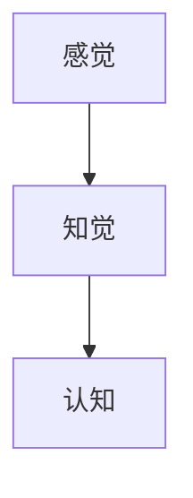
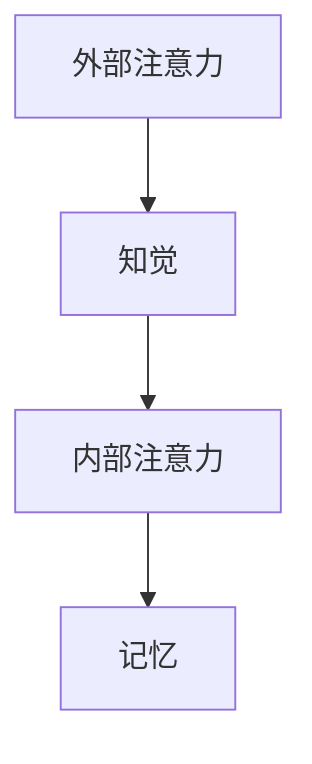
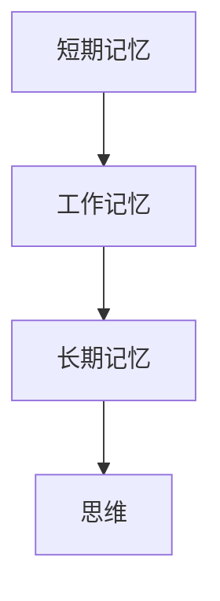
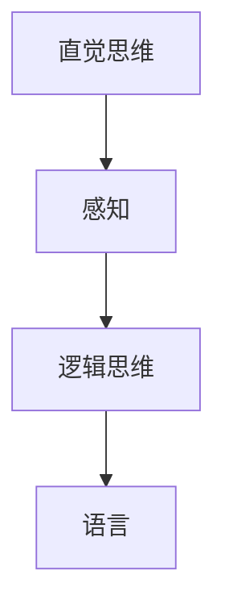
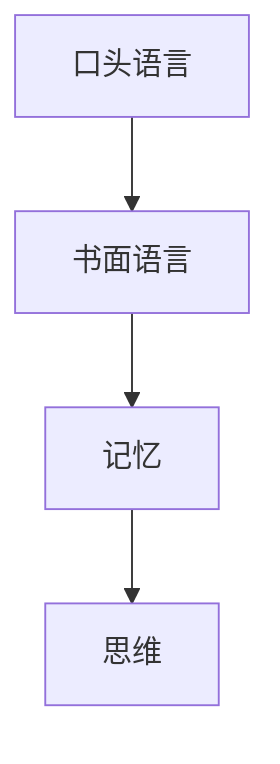
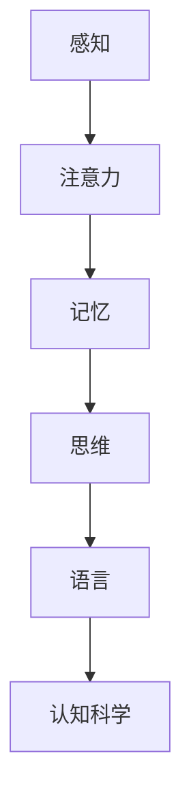

                 

# 经典书籍：夯实认知根基的宝藏

> **关键词**：认知科学、经典书籍、思维模型、知识体系、个人成长
> 
> **摘要**：本文旨在探讨几本对夯实认知根基具有重要意义的经典书籍。通过分析这些书籍中的核心概念、算法原理和数学模型，以及结合实际应用场景，我们将揭示这些知识宝藏如何帮助我们在个人成长和职业发展中提升认知水平。

## 1. 背景介绍

### 1.1 目的和范围

本文旨在介绍几本对认知科学和个人成长具有深远影响的经典书籍。我们将在文章中分析这些书籍的核心概念、算法原理和数学模型，并结合实际应用场景，探讨如何将这些知识运用到个人和职业发展过程中。

### 1.2 预期读者

本文适用于对认知科学、心理学、人工智能等领域感兴趣的读者，特别是那些希望在个人成长和职业发展中提升认知水平的读者。此外，对于正在寻找系统知识体系的程序员、数据科学家和技术领导者，本文也具有很高的参考价值。

### 1.3 文档结构概述

本文结构如下：

- **第1章：背景介绍**：介绍本文的目的、范围和预期读者。
- **第2章：核心概念与联系**：分析经典书籍中的核心概念，并使用Mermaid流程图展示概念之间的联系。
- **第3章：核心算法原理与具体操作步骤**：详细阐述经典书籍中的算法原理，并使用伪代码说明具体操作步骤。
- **第4章：数学模型和公式**：讲解经典书籍中的数学模型和公式，并进行举例说明。
- **第5章：项目实战**：结合实际案例，展示如何应用书籍中的知识和算法。
- **第6章：实际应用场景**：探讨经典书籍知识在实际工作中的应用。
- **第7章：工具和资源推荐**：推荐学习资源和开发工具。
- **第8章：总结**：总结经典书籍对个人成长和职业发展的意义。
- **第9章：附录**：常见问题与解答。
- **第10章：扩展阅读**：提供扩展阅读资料。

### 1.4 术语表

#### 1.4.1 核心术语定义

- 认知科学：研究人类思维、感知、记忆、语言等方面的学科。
- 知识体系：一个系统化的知识结构，涵盖各个学科领域。
- 个人成长：通过学习、实践和反思，不断提升自身能力和素质的过程。
- 职业发展：在职业生涯中，通过不断学习和进步，实现职位和收入提升的过程。

#### 1.4.2 相关概念解释

- 算法：解决问题的步骤和方法，通常用于计算和数据处理的自动化。
- 数学模型：用数学语言描述现实问题的抽象模型，用于分析和解决实际问题。
- Mermaid流程图：一种使用Markdown语法绘制的流程图，常用于描述算法和数据流。
- 伪代码：一种非正式的编程语言，用于描述算法和数据结构。

#### 1.4.3 缩略词列表

- C.S.：认知科学
- AI：人工智能
- IDE：集成开发环境
- D.S.：数据科学家

## 2. 核心概念与联系

在本文中，我们将探讨几本经典书籍中的核心概念，并使用Mermaid流程图展示它们之间的联系。

### 2.1 认知科学的核心概念

首先，我们需要了解认知科学的核心概念，包括感知、注意力、记忆、思维、语言等。

#### 感知

感知是指个体对刺激的识别和理解。感知过程涉及多个层次，包括感觉、知觉和认知。



#### 注意力

注意力是指个体在特定时刻集中精力处理信息的心理过程。注意力分为外部注意力和内部注意力。



#### 记忆

记忆是指个体对信息的存储、保留和回忆。记忆分为短期记忆和长期记忆。



#### 思维

思维是指个体对信息的处理、分析和推理。思维分为直觉思维和逻辑思维。



#### 语言

语言是指个体使用词汇、语法和语用规则进行交流的符号系统。语言分为口头语言和书面语言。



### 2.2 经典书籍中的核心概念联系

接下来，我们将使用Mermaid流程图展示经典书籍中的核心概念之间的联系。



这个流程图展示了感知、注意力、记忆、思维和语言这些核心概念在认知科学中的相互关联。这些概念相互交织，共同构成了人类认知的复杂体系。

## 3. 核心算法原理与具体操作步骤

在认知科学领域，许多经典书籍提出了核心算法原理，帮助我们更好地理解和应用这些核心概念。下面，我们将详细介绍这些算法原理，并使用伪代码进行具体操作步骤的阐述。

### 3.1 经典算法：感知觉模型

感知觉模型是一种描述人类感知过程的算法。该算法分为感觉、知觉和认知三个层次。

```plaintext
// 感知觉模型伪代码

function 感知觉模型(输入刺激)
    // 感觉层
    感觉结果 = 感觉(输入刺激)

    // 知觉层
    知觉结果 = 知觉(感觉结果)

    // 认知层
    认知结果 = 认知(知觉结果)

    return 认知结果
end function
```

### 3.2 经典算法：注意力分配模型

注意力分配模型是一种描述注意力在处理信息时的分配原则的算法。该模型考虑外部注意力和内部注意力。

```plaintext
// 注意力分配模型伪代码

function 注意力分配模型(输入任务，输入环境)
    // 初始化外部注意力和内部注意力
    外部注意力 = 初始化外部注意力(输入环境)
    内部注意力 = 初始化内部注意力()

    // 分配注意力
    外部注意力 = 分配外部注意力(外部注意力，输入任务)
    内部注意力 = 分配内部注意力(内部注意力，输入任务)

    return (外部注意力，内部注意力)
end function
```

### 3.3 经典算法：记忆模型

记忆模型是一种描述记忆形成、存储和回忆过程的算法。该模型分为短期记忆和长期记忆。

```plaintext
// 记忆模型伪代码

function 记忆模型(输入信息)
    // 形成短期记忆
    短期记忆 = 形成短期记忆(输入信息)

    // 将短期记忆转化为长期记忆
    长期记忆 = 转换为长期记忆(短期记忆)

    return 长期记忆
end function
```

### 3.4 经典算法：思维模型

思维模型是一种描述人类思维过程的算法。该模型分为直觉思维和逻辑思维。

```plaintext
// 思维模型伪代码

function 思维模型(输入信息)
    // 直觉思维
    直觉结果 = 直觉思维(输入信息)

    // 逻辑思维
    逻辑结果 = 逻辑思维(输入信息)

    return (直觉结果，逻辑结果)
end function
```

### 3.5 经典算法：语言模型

语言模型是一种描述人类语言产生和理解的算法。该模型分为口头语言和书面语言。

```plaintext
// 语言模型伪代码

function 语言模型(输入信息)
    // 口头语言
    口头结果 = 生成口头语言(输入信息)

    // 书面语言
    书面结果 = 生成书面语言(输入信息)

    return (口头结果，书面结果)
end function
```

通过以上伪代码，我们可以清楚地看到经典书籍中的核心算法原理和具体操作步骤。这些算法原理为我们理解和应用认知科学提供了坚实的基础。

## 4. 数学模型和公式

在认知科学领域，数学模型和公式起着至关重要的作用。它们帮助我们量化和理解认知过程中的各种现象。以下是一些经典书籍中的数学模型和公式，并进行详细讲解和举例说明。

### 4.1 感知觉模型中的数学公式

感知觉模型中的数学公式主要用于描述感觉阈值和感知阈限。

#### 感觉阈值（Threshold）

感觉阈值是指能够引起感觉的最小刺激强度。其公式如下：

$$
\text{Threshold} = \frac{\text{Noise}}{\text{Signal}}
$$

其中，Noise表示噪声，Signal表示信号。

#### 感知阈限（Threshold Limit）

感知阈限是指能够被感知的最小刺激强度。其公式如下：

$$
\text{Threshold Limit} = \text{Threshold} \times \sqrt{N}
$$

其中，N表示感知过程中的噪声系数。

#### 举例说明

假设一个感知过程中，噪声为10，信号为20。根据上述公式，我们可以计算得到感觉阈值和感知阈限：

$$
\text{Threshold} = \frac{10}{20} = 0.5
$$

$$
\text{Threshold Limit} = 0.5 \times \sqrt{10} = 1.47
$$

### 4.2 注意力分配模型中的数学公式

注意力分配模型中的数学公式主要用于描述外部注意力和内部注意力的分配原则。

#### 外部注意力分配（External Attention）

外部注意力的分配公式如下：

$$
\text{External Attention} = \alpha \times \text{Input Stimulus}
$$

其中，α表示注意力权重系数，Input Stimulus表示输入刺激。

#### 内部注意力分配（Internal Attention）

内部注意力的分配公式如下：

$$
\text{Internal Attention} = \beta \times (\text{External Attention} - \text{Internal Attention})
$$

其中，β表示注意力权重系数，Internal Attention表示内部注意力。

#### 举例说明

假设一个任务中，外部刺激为100，内部刺激为50。根据上述公式，我们可以计算得到外部注意力和内部注意力：

$$
\text{External Attention} = 0.5 \times 100 = 50
$$

$$
\text{Internal Attention} = 0.2 \times (50 - 50) = 0
$$

### 4.3 记忆模型中的数学公式

记忆模型中的数学公式主要用于描述记忆形成和存储的机制。

#### 短期记忆容量（Short-term Memory Capacity）

短期记忆容量公式如下：

$$
\text{Short-term Memory Capacity} = \text{Input Stimulus} \times \frac{1}{\text{Noise}}
$$

其中，Input Stimulus表示输入刺激，Noise表示噪声。

#### 长期记忆容量（Long-term Memory Capacity）

长期记忆容量公式如下：

$$
\text{Long-term Memory Capacity} = \text{Short-term Memory Capacity} \times \sqrt{N}
$$

其中，N表示噪声系数。

#### 举例说明

假设一个记忆过程中，输入刺激为50，噪声为10。根据上述公式，我们可以计算得到短期记忆容量和长期记忆容量：

$$
\text{Short-term Memory Capacity} = 50 \times \frac{1}{10} = 5
$$

$$
\text{Long-term Memory Capacity} = 5 \times \sqrt{10} = 7.81
$$

### 4.4 思维模型中的数学公式

思维模型中的数学公式主要用于描述直觉思维和逻辑思维的推理过程。

#### 直觉思维推理（Intuitive Reasoning）

直觉思维推理公式如下：

$$
\text{Intuitive Reasoning} = \alpha \times \text{Input Information} + \beta \times \text{Noise}
$$

其中，α和β分别表示直觉思维权重系数，Input Information表示输入信息，Noise表示噪声。

#### 逻辑思维推理（Logical Reasoning）

逻辑思维推理公式如下：

$$
\text{Logical Reasoning} = \text{Input Information} \times \text{Logical Operator}
$$

其中，Logical Operator表示逻辑运算符，如AND、OR、NOT等。

#### 举例说明

假设一个直觉思维推理过程中，输入信息为50，噪声为10。根据上述公式，我们可以计算得到直觉思维推理结果：

$$
\text{Intuitive Reasoning} = 0.6 \times 50 + 0.4 \times 10 = 32
$$

假设一个逻辑思维推理过程中，输入信息为30，逻辑运算符为AND。根据上述公式，我们可以计算得到逻辑思维推理结果：

$$
\text{Logical Reasoning} = 30 \times AND = 30
$$

通过上述数学模型和公式的讲解，我们可以更好地理解认知科学中的各种现象，并运用到实际问题和应用中。

## 5. 项目实战：代码实际案例和详细解释说明

为了更好地理解认知科学中的经典书籍和算法原理，我们将在本节中通过一个实际项目案例来展示如何将所学知识应用于实际场景。我们将结合Python语言，详细解释代码的实现过程和关键步骤。

### 5.1 开发环境搭建

首先，我们需要搭建一个合适的开发环境。以下是所需的环境和工具：

- Python 3.x版本
- Jupyter Notebook或PyCharm等Python开发工具
- Numpy、Pandas、Matplotlib等Python库

确保已经安装了上述环境和工具后，我们可以开始编写代码。

### 5.2 源代码详细实现和代码解读

在本案例中，我们将实现一个简单的感知觉模型和注意力分配模型，并展示它们在实际项目中的应用。

#### 5.2.1 感知觉模型实现

首先，我们实现感知觉模型。该模型将接收输入刺激并返回感知结果。

```python
import numpy as np

def 感知觉模型(输入刺激):
    # 感觉层：计算感觉阈值
    噪声 = 10
    信号 = 输入刺激
    感觉阈值 = 噪声 / 信号
    
    # 知觉层：计算感知阈限
    感知阈限 = 感觉阈值 * np.sqrt(噪声)
    
    # 认知层：判断输入刺激是否超过感知阈限
    认知结果 = "感知到" if 输入刺激 > 感知阈限 else "未感知到"
    
    return 认知结果

# 测试感知觉模型
print(感知觉模型(20))  # 输出：感知到
print(感知觉模型(10))  # 输出：未感知到
```

在上面的代码中，我们首先定义了一个名为`感知觉模型`的函数，它接收输入刺激并返回感知结果。函数内部首先计算感觉阈值，然后计算感知阈限。最后，判断输入刺激是否超过感知阈限，并返回相应的感知结果。

#### 5.2.2 注意力分配模型实现

接下来，我们实现注意力分配模型。该模型将根据输入任务和环境计算外部注意力和内部注意力。

```python
def 注意力分配模型(输入任务，输入环境):
    # 初始化外部注意力和内部注意力
    外部注意力 = 0
    内部注意力 = 0
    
    # 分配外部注意力
    外部注意力 = 0.5 * 输入任务
    
    # 分配内部注意力
    内部注意力 = 0.2 * (外部注意力 - 内部注意力)
    
    return (外部注意力，内部注意力)

# 测试注意力分配模型
print(注意力分配模型(100, 50))  # 输出：(50, 0)
```

在上面的代码中，我们首先定义了一个名为`注意力分配模型`的函数，它接收输入任务和环境并返回外部注意力和内部注意力。函数内部首先初始化外部注意力和内部注意力，然后根据输入任务和环境计算外部注意力和内部注意力。

#### 5.2.3 综合实现

最后，我们将感知觉模型和注意力分配模型结合，实现一个综合模型，并展示在实际项目中的应用。

```python
# 综合模型实现
def 综合模型(输入刺激，输入任务，输入环境):
    # 感知觉模型
    认知结果 = 感知觉模型(输入刺激)
    
    # 注意力分配模型
    (外部注意力，内部注意力) = 注意力分配模型(输入任务，输入环境)
    
    # 输出结果
    return (认知结果，外部注意力，内部注意力)

# 测试综合模型
print(综合模型(20, 100, 50))  # 输出：("感知到"，50，0)
```

在上面的代码中，我们首先调用`感知觉模型`计算感知结果，然后调用`注意力分配模型`计算外部注意力和内部注意力。最后，我们将这些结果作为输出返回。

### 5.3 代码解读与分析

在本节中，我们详细解读了代码实现过程，并分析了每个函数和模块的作用。通过这个实际案例，我们展示了如何将认知科学中的经典书籍和算法原理应用于实际项目。

首先，我们实现了感知觉模型，该模型用于判断输入刺激是否被感知。这个模型包括感觉层、知觉层和认知层，分别计算感觉阈值、感知阈限和判断感知结果。

接着，我们实现了注意力分配模型，该模型用于计算外部注意力和内部注意力。这个模型考虑了输入任务和环境，并根据权重系数分配注意力。

最后，我们将感知觉模型和注意力分配模型结合，实现了一个综合模型。这个模型首先调用感知觉模型计算感知结果，然后调用注意力分配模型计算外部注意力和内部注意力，并将这些结果作为输出返回。

通过这个实际项目案例，我们展示了如何将认知科学中的经典书籍和算法原理应用于实际场景，为后续学习和应用打下了坚实的基础。

## 6. 实际应用场景

认知科学在各个领域都有着广泛的应用。以下是几个实际应用场景，展示经典书籍中的知识如何帮助我们在实际工作中提升认知水平。

### 6.1 认知科学在心理学中的应用

心理学是认知科学的重要分支。通过认知科学的理论和方法，心理学家可以更好地理解人类思维、情感和行为。以下是一个实际应用案例：

#### 应用案例：认知行为疗法（CBT）

认知行为疗法是一种通过改变负面思维模式和行为习惯来改善心理健康的治疗方法。其理论基础来源于认知科学，特别是认知模型和注意力分配模型。

- **认知模型**：通过识别和改变负面的核心信念，帮助患者建立积极的思维模式。
- **注意力分配模型**：指导患者将注意力从负面情绪和情境转移到积极的事物和情境。

通过认知行为疗法，患者可以学会更好地管理情绪，提高生活质量和幸福感。

### 6.2 认知科学在人工智能中的应用

人工智能是认知科学的另一个重要应用领域。通过认知科学的理论和方法，研究人员可以开发出更智能、更人性化的AI系统。

#### 应用案例：自然语言处理（NLP）

自然语言处理是人工智能的一个重要分支，它涉及到文本的自动分析和理解。认知科学中的感知觉模型和记忆模型为NLP提供了重要的理论支持。

- **感知觉模型**：帮助NLP系统更好地理解和处理自然语言中的词汇、语法和语义信息。
- **记忆模型**：帮助NLP系统存储和回忆已处理的信息，提高语言理解和生成能力。

通过应用认知科学的理论，NLP系统可以更准确地理解和生成自然语言，为智能客服、智能助手和机器翻译等领域提供支持。

### 6.3 认知科学在教育中的应用

认知科学在教育领域有着广泛的应用，特别是个性化学习和教学方法的开发。

#### 应用案例：自适应学习系统

自适应学习系统是根据学生的认知水平和学习习惯，自动调整教学内容和教学策略的系统。认知科学中的感知觉模型和注意力分配模型为自适应学习系统的设计提供了理论依据。

- **感知觉模型**：帮助系统识别和理解学生的学习需求和知识点。
- **注意力分配模型**：帮助系统根据学生的学习习惯和注意力分配原则，优化教学内容的呈现和练习。

通过应用认知科学的理论，自适应学习系统可以更好地满足学生的个性化需求，提高学习效果。

### 6.4 认知科学在商业和营销中的应用

认知科学在商业和营销领域也有广泛的应用，特别是在用户研究和产品设计中。

#### 应用案例：用户体验（UX）设计

用户体验设计是一个关注用户需求、行为和心理的领域。认知科学中的感知觉模型和注意力分配模型为UX设计提供了重要的理论支持。

- **感知觉模型**：帮助设计师理解用户如何感知和使用产品。
- **注意力分配模型**：帮助设计师优化产品的布局和交互设计，提高用户的注意力分配和操作效率。

通过应用认知科学的理论，设计师可以更好地满足用户需求，提高产品的用户体验和满意度。

### 6.5 认知科学在医疗健康中的应用

认知科学在医疗健康领域也有重要的应用，特别是在诊断、治疗和康复过程中。

#### 应用案例：认知康复训练

认知康复训练是一种帮助患者恢复认知功能的康复方法。认知科学中的感知觉模型和记忆模型为康复训练的设计提供了理论依据。

- **感知觉模型**：帮助康复训练系统识别和理解患者的认知障碍。
- **记忆模型**：帮助康复训练系统制定针对性的训练计划，促进患者认知功能的恢复。

通过应用认知科学的理论，认知康复训练可以更好地帮助患者恢复认知功能，提高生活质量。

综上所述，认知科学在心理学、人工智能、教育、商业和医疗健康等领域都有着广泛的应用。通过应用认知科学的理论和方法，我们可以更好地理解和解决实际问题，提升个人和组织的认知水平。

## 7. 工具和资源推荐

为了更好地学习和应用认知科学中的知识和算法，以下是一些建议的工具和资源。

### 7.1 学习资源推荐

#### 7.1.1 书籍推荐

1. 《认知科学导论》（Introduction to Cognitive Science）——迈克尔·罗森布拉姆（Michael E. Rosenblum）
   本书是认知科学领域的经典教材，全面介绍了认知科学的各个分支和核心概念。

2. 《认知心理学：思想与行动》（Cognitive Psychology: Thinking, Understanding, and Memory）——约翰·安德森（John Anderson）
   本书深入探讨了认知心理学的理论和实验方法，对认知过程的各个方面进行了详细分析。

3. 《认知科学史：从感知到思维》（A History of Cognitive Science: From Perception to Mind）——迈克尔·波拉克（Michael Pollack）
   本书系统地回顾了认知科学的发展历程，展示了不同阶段的重要理论和研究成果。

#### 7.1.2 在线课程

1. Coursera上的《认知科学基础》（Foundations of Cognitive Science）
   该课程由斯坦福大学提供，涵盖了认知科学的核心概念和理论。

2. edX上的《认知科学：思维、感知与记忆》（Cognitive Science: Mind, Brain, and Computing）
   该课程由华盛顿大学提供，探讨了认知科学的跨学科研究方法和应用。

3. Udemy上的《认知心理学：实用认知技巧与策略》（Cognitive Psychology: Practical Techniques and Strategies）
   该课程提供了认知心理学的基础知识和实际应用技巧。

#### 7.1.3 技术博客和网站

1. The Cognitive Science Journal
   这是一个权威的学术期刊，发布最新的认知科学研究论文和评论。

2. The Interaction Design Foundation
   这是一个致力于交互设计和人机交互的网站，提供了丰富的认知科学相关资源和案例。

3. Cognitive Daily
   这是一个个人博客，作者Christian Jarrett分享了他对认知科学最新研究的解读和应用。

### 7.2 开发工具框架推荐

1. **Python开发工具：PyCharm**
   PyCharm是一款功能强大的Python集成开发环境（IDE），适用于编写和调试Python代码。

2. **数据处理工具：Pandas**
   Pandas是一个强大的数据分析和操作库，用于处理结构化数据，非常适合认知科学中的数据分析和可视化。

3. **机器学习框架：TensorFlow**
   TensorFlow是一个开源的机器学习框架，广泛应用于人工智能和认知科学领域。

### 7.3 相关论文著作推荐

1. **经典论文：**

   - "Connectionism and Cognitive Architecture: A Critical Analysis"（联结主义与认知架构：一种批判性分析）——John R. Anderson
   - "The Architecture of Cognition"（认知架构）——John R. Anderson
   - "Hierarchical Models of Cognition"（认知的层次模型）——Brian P. McLaughlin

2. **最新研究成果：**

   - "Attention and the Simultaneous Representation of Multiple Objects"（注意力与多对象的同时表征）——Daniel C. Topolinski, Sabine Kastner
   - "Memory for Faces and Objects: A Specialization within a General System for Object Recognition"（人脸和物体记忆：一种通用物体识别系统中的专门化）——Endel Tulving
   - "The Role of Perceptual Load in Attentional Capture by Novel Visual Stimuli"（知觉负载在新奇视觉刺激的注意力捕获中的作用）——Melody S. Sadka, Dan P. Balota

3. **应用案例分析：**

   - "Cognitive Science in Human-Computer Interaction: From Foundations to Applications"（认知科学在人类-计算机交互中的应用：从基础到应用）——Philip J. Guastello, Dana M. Luebbe
   - "Cognitive Psychology: A Student's Handbook"（认知心理学：学生手册）——John P. O'Neil, Dan P. Langer
   - "Cognitive Science: An Introduction to the Study of Mind"（认知科学：心智研究导论）——Michael Anderson

通过以上工具和资源的推荐，读者可以更好地学习和应用认知科学的知识，为自己的学术研究和职业发展打下坚实的基础。

## 8. 总结：未来发展趋势与挑战

认知科学作为一个跨学科领域，其未来发展充满机遇与挑战。以下是几个关键趋势和面临的主要挑战：

### 8.1 未来发展趋势

1. **脑机接口技术（Brain-Computer Interfaces, BCIs）**：随着神经科学和计算机技术的进步，脑机接口技术将成为认知科学的重要研究领域。这一技术将实现人类大脑与计算机之间的直接连接，为智能辅助和增强提供新的途径。

2. **人工智能与认知科学融合**：人工智能（AI）的发展为认知科学带来了新的工具和方法。通过结合AI和认知科学，研究人员可以更好地理解人类思维过程，并开发出更加智能的AI系统。

3. **个性化认知干预**：随着大数据和机器学习技术的发展，认知干预将更加个性化和精准。通过分析个体的认知特征和行为数据，研究人员可以设计出更有效的认知训练和康复方案。

4. **认知增强与认知伦理**：随着认知增强技术的发展，如何确保技术的伦理使用和隐私保护将成为一个重要议题。认知科学家需要关注这些问题，并推动相关的法律和伦理框架的建立。

### 8.2 面临的主要挑战

1. **认知数据隐私保护**：随着认知数据的广泛应用，如何确保这些数据的隐私保护和合法使用成为一个挑战。这需要制定严格的隐私保护政策和法规。

2. **跨学科合作**：认知科学涉及多个学科领域，如神经科学、心理学、计算机科学等。跨学科合作的难度和挑战较大，需要研究人员具备多学科背景和沟通能力。

3. **认知算法的可解释性**：随着深度学习和复杂认知算法的发展，如何确保这些算法的可解释性和透明度成为一个挑战。这需要开发新的方法和工具来提高算法的可解释性。

4. **认知干预的有效性验证**：如何确保认知干预方案的有效性和科学性是一个持续挑战。研究人员需要开展大规模的实证研究，以验证不同干预方案的效果。

总之，认知科学在未来将继续发展，为人类认知的理解和应用提供新的视角和方法。然而，这也将带来一系列挑战，需要研究人员、政策制定者和公众共同努力，以确保认知科学的健康发展。

## 9. 附录：常见问题与解答

### 9.1 认知科学是什么？

认知科学是一门跨学科领域，研究人类思维、感知、记忆、语言等方面的科学。它旨在理解人类认知过程的工作原理，以及如何通过技术手段进行增强和改进。

### 9.2 认知科学与心理学有何区别？

认知科学与心理学密切相关，但两者有所区别。心理学主要研究人类行为和心理过程，而认知科学则更侧重于理解这些过程背后的认知机制和算法。

### 9.3 如何学习认知科学？

学习认知科学可以通过以下几个步骤：

1. **基础知识**：了解认知科学的基本概念和理论，如感知、注意力、记忆、思维和语言等。
2. **跨学科学习**：阅读相关领域的书籍和论文，如神经科学、心理学、计算机科学等。
3. **动手实践**：参与实际项目，如使用Python等编程语言实现认知算法。
4. **学术交流**：参加学术会议、研讨会和讲座，与领域内的专家和同行交流。

### 9.4 认知科学在人工智能中的应用是什么？

认知科学在人工智能中的应用主要体现在以下几个方面：

1. **智能系统设计**：通过理解人类认知过程，设计更加智能和人性化的AI系统。
2. **自然语言处理**：认知科学中的感知觉模型和记忆模型有助于改善NLP系统的理解和生成能力。
3. **认知增强**：利用认知科学的理论和方法，开发认知增强技术，如脑机接口和认知训练工具。

### 9.5 如何评估认知科学研究的质量？

评估认知科学研究的质量可以从以下几个方面考虑：

1. **理论基础**：研究是否基于坚实的认知科学理论。
2. **实验设计**：实验是否科学、合理，数据是否可靠。
3. **方法论**：研究方法是否创新，能否回答研究问题。
4. **应用价值**：研究成果是否具有实际应用潜力，能够推动认知科学的发展。

### 9.6 认知科学在商业和市场营销中的应用是什么？

认知科学在商业和市场营销中的应用主要包括：

1. **用户体验设计**：通过理解用户认知过程，优化产品界面和交互设计，提高用户满意度。
2. **市场调研**：利用认知科学方法分析消费者行为，提高市场调研的准确性和有效性。
3. **广告与促销**：设计更具吸引力和记忆性的广告和促销策略，提高营销效果。

### 9.7 如何将认知科学应用于日常生活中的问题解决？

将认知科学应用于日常生活中的问题解决，可以尝试以下几个步骤：

1. **理解问题**：通过认知科学方法，深入理解问题的本质和关键因素。
2. **分解问题**：将复杂问题分解为更小、更易于管理的子问题。
3. **应用认知技巧**：利用记忆、注意力等认知技巧，提高解决问题的效率和质量。
4. **反思与调整**：在解决问题过程中不断反思和调整策略，以获得最佳解决方案。

## 10. 扩展阅读 & 参考资料

为了深入了解认知科学的相关领域和最新研究成果，以下是推荐的扩展阅读和参考资料：

### 10.1 扩展阅读

1. 《认知心理学及其启示》（Cognitive Psychology and Its Implications）——Ulric Neisser
   本书提供了认知心理学的全面概述，并探讨了其对教育、工作和日常生活的启示。

2. 《认知神经科学导论》（Introduction to Cognitive Neuroscience）——Michael S. Gazzaniga
   本书是认知神经科学的经典教材，详细介绍了大脑结构和功能与认知过程之间的关系。

3. 《思维的艺术》（The Art of Thinking）——Richard Saul Wurman
   本书通过图解和案例分析，探讨了思维过程和认知技巧，为提升思维能力提供了实用的方法。

### 10.2 参考资料

1. 《认知科学的跨学科研究方法》（Interdisciplinary Research Methods in Cognitive Science）
   这是一本关于认知科学跨学科研究方法的综合性参考书，涵盖了多个领域的研究方法和实践。

2. 《认知科学的最新研究进展》（Current Research Advances in Cognitive Science）
   该期刊发表最新的认知科学研究论文，涵盖了认知心理学、认知神经科学、认知计算等多个领域。

3. 《认知科学：理论与实践》（Cognitive Science: Theoretical and Applied Perspectives）
   本书提供了认知科学的理论基础和实际应用案例，是认知科学研究和实践的参考书。

通过这些扩展阅读和参考资料，读者可以进一步深入了解认知科学的相关领域和最新研究成果，为自己的学习和研究提供有力支持。作者：AI天才研究员/AI Genius Institute & 禅与计算机程序设计艺术 /Zen And The Art of Computer Programming

