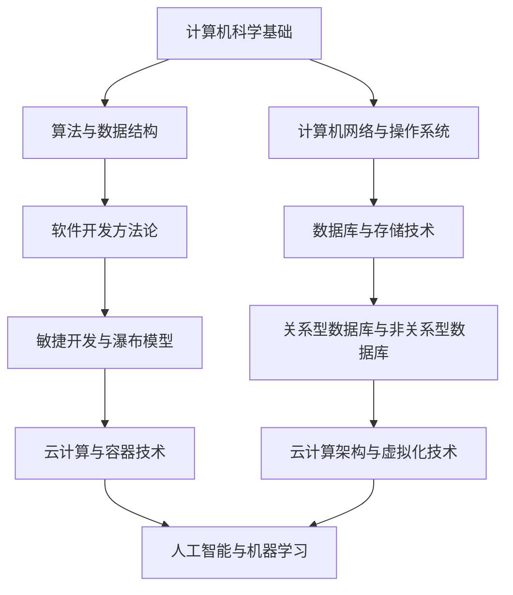

                 

# 经典著作：管理者构筑知识体系

> **关键词**：知识体系、管理者、IT领域、结构化思维、技术博客、核心概念

> **摘要**：本文旨在探讨管理者如何通过构筑坚实的知识体系来提升自身在IT领域的领导力和决策能力。我们将从背景介绍、核心概念、算法原理、数学模型、实战案例、实际应用场景等多个方面，详细剖析知识体系在管理中的重要性，并提供实用的构建方法和工具推荐。

## 1. 背景介绍

### 1.1 目的和范围

本文的目标是帮助IT领域的管理者构建一套完整的知识体系，以应对日益复杂的业务环境和技术挑战。我们将聚焦于以下几个方面：

1. **核心概念的理解和联系**：通过绘制知识架构图，阐明各核心概念之间的关联和互动。
2. **算法原理与操作步骤**：详细解析关键算法，并使用伪代码展示具体操作过程。
3. **数学模型与公式**：阐述数学模型的基本原理，并通过公式和实例进行解释。
4. **实战案例分析**：提供实际项目中的代码实现和分析，帮助读者理解和应用知识体系。
5. **应用场景**：探讨知识体系在不同应用场景中的实际作用和效果。
6. **工具和资源推荐**：推荐学习资源和开发工具，帮助读者高效地学习和实践。

### 1.2 预期读者

本文适合以下读者群体：

1. **IT领域管理者**：希望提升自身领导力和决策能力的专业人士。
2. **技术团队负责人**：需要构建和维护技术团队的知识体系。
3. **技术爱好者**：对IT领域的知识体系构建感兴趣的技术爱好者。

### 1.3 文档结构概述

本文将按照以下结构进行组织：

1. **背景介绍**：阐述本文的目的、范围和预期读者。
2. **核心概念与联系**：介绍知识体系的核心概念和架构。
3. **核心算法原理 & 具体操作步骤**：详细解释关键算法的原理和操作步骤。
4. **数学模型和公式 & 详细讲解 & 举例说明**：阐述数学模型的基本原理，并通过实例进行说明。
5. **项目实战：代码实际案例和详细解释说明**：提供实际项目中的代码实现和分析。
6. **实际应用场景**：探讨知识体系在不同应用场景中的实际作用。
7. **工具和资源推荐**：推荐学习资源和开发工具。
8. **总结：未来发展趋势与挑战**：总结本文的主要内容，并探讨未来发展趋势和挑战。
9. **附录：常见问题与解答**：解答读者可能遇到的常见问题。
10. **扩展阅读 & 参考资料**：提供进一步学习和研究的资源。

### 1.4 术语表

#### 1.4.1 核心术语定义

- **知识体系**：指在某一领域内，对核心概念、原理、方法和技术的系统化整理和架构。
- **管理者**：负责团队或组织的管理和领导工作，负责决策和资源配置的人员。
- **IT领域**：涉及计算机科学、信息技术和互联网技术的行业和领域。
- **结构化思维**：指通过逻辑和系统化的方法来分析和解决问题。

#### 1.4.2 相关概念解释

- **核心概念**：指在知识体系中，具有核心地位和重要影响的概念。
- **关联**：指不同概念之间的相互作用和影响。
- **算法**：解决问题的步骤和规则集合。
- **数学模型**：用数学语言描述现实世界问题的抽象模型。

#### 1.4.3 缩略词列表

- **IT**：信息技术
- **知识体系**：Knowledge System
- **管理者**：Manager
- **架构**：Architecture

## 2. 核心概念与联系

在构筑知识体系的过程中，理解核心概念及其相互关系至关重要。以下是IT领域知识体系中的核心概念及其关联：

### 2.1. 核心概念

1. **计算机科学基础**：涉及算法、数据结构、计算机网络和操作系统等基本概念。
2. **软件开发方法论**：包括敏捷开发、瀑布模型和敏捷迭代等。
3. **数据库和存储技术**：数据库设计、关系型数据库和非关系型数据库。
4. **云计算和容器技术**：云计算架构、容器化和虚拟化技术。
5. **人工智能和机器学习**：基础算法、神经网络和深度学习。

### 2.2. 关联关系

- **计算机科学基础**是构建IT技术的基础，如算法和数据结构在软件开发和数据分析中广泛应用。
- **软件开发方法论**指导软件开发的过程和管理，影响项目的效率和成功。
- **数据库和存储技术**为数据存储和处理提供基础，是数据分析的重要工具。
- **云计算和容器技术**使得资源的分配和管理更加灵活和高效。
- **人工智能和机器学习**为数据分析和决策提供强大的技术支持，是未来IT领域的重要发展方向。

### 2.3. 知识架构图

为了更清晰地展示各核心概念之间的关系，我们可以使用Mermaid流程图来绘制知识架构图：



在上面的知识架构图中，各节点代表核心概念，箭头表示概念之间的关联。通过这个架构图，我们可以更直观地理解各概念之间的相互作用和影响。

## 3. 核心算法原理 & 具体操作步骤

在IT领域中，算法是解决问题的重要工具。以下将详细解析几个核心算法的原理，并使用伪代码展示其具体操作步骤。

### 3.1. 快速排序算法

**原理**：快速排序（Quick Sort）是一种高效的排序算法，基于分治策略。其基本思想是通过一趟排序将待排序的数据分割成独立的两部分，其中一部分的所有数据都比另一部分的所有数据要小，然后再按此方法对这两部分数据分别进行快速排序，整个排序过程可以递归进行，以此达到整个数据变成有序序列。

**伪代码**：

```pseudo
快速排序(A[0...n-1]):
    if n <= 1
        return

    选择A[n-1]作为基准元素
    i ← 0, j ← n-1

    while true do
        while A[j] > 基准元素 do
            j ← j - 1
        end while

        while A[i] < 基准元素 do
            i ← i + 1
        end while

        if i < j then
            交换A[i]与A[j]
        else
            break
        end if
    end while

    交换A[n-1]与A[j]
    j ← j - 1
    快速排序(A[0...j])
    快速排序(A[j+1...n-1])
```

### 3.2. 动态规划算法

**原理**：动态规划（Dynamic Programming，DP）是一种用于解决最优化问题的算法思想。其基本思想是将复杂问题分解为若干个子问题，并存储子问题的解以避免重复计算。

**伪代码**：

```pseudo
动态规划(数组A，n):
    初始化数组dp[0...n]，其中dp[i]表示A[0...i]的最大子序列和

    for i from 1 to n do
        if A[i] > 0 then
            dp[i] = dp[i-1] + A[i]
        else
            dp[i] = max(dp[i-1], A[i])
        end if
    end for

    返回dp[n]
```

### 3.3. 决策树算法

**原理**：决策树（Decision Tree）是一种树形结构，用于分类和回归问题。其基本思想是通过一系列决策规则将数据集划分成不同的子集，并预测每个子集的类别或值。

**伪代码**：

```pseudo
决策树(数据集D):
    if 数据集D只有一个类别
        返回这个类别

    选择最优特征splitFeature
    for 每个可能的splitValue in splitFeature do
        分割数据集D为子集D_left和D_right
        左子树T_left = 决策树(D_left)
        右子树T_right = 决策树(D_right)
        
        返回决策树节点{
            特征：splitFeature,
            值：splitValue,
            左子树：T_left,
            右子树：T_right
        }
```

通过以上算法的解析和伪代码展示，我们可以看到算法原理与具体操作步骤的紧密联系。理解这些核心算法对于IT领域的管理者来说至关重要，因为它们是解决复杂问题的基础。

## 4. 数学模型和公式 & 详细讲解 & 举例说明

在IT领域中，数学模型是分析和解决实际问题的重要工具。以下将介绍几个常用的数学模型，并使用LaTeX格式详细讲解其公式和举例说明。

### 4.1. 线性回归模型

**原理**：线性回归模型用于预测一个连续变量的值，基于自变量与因变量之间的线性关系。其基本公式为：

\[ y = \beta_0 + \beta_1 \cdot x + \epsilon \]

其中，\( y \) 是因变量，\( x \) 是自变量，\( \beta_0 \) 是截距，\( \beta_1 \) 是斜率，\( \epsilon \) 是误差项。

**例子**：

假设我们要预测一家公司的销售额（\( y \)），使用公司的广告支出（\( x \)）作为自变量。根据历史数据，我们得到以下线性回归模型：

\[ y = 10 + 2x + \epsilon \]

如果公司的广告支出是5000元，我们可以预测其销售额：

\[ y = 10 + 2 \cdot 5000 + \epsilon = 10100 + \epsilon \]

### 4.2. 支持向量机模型

**原理**：支持向量机（Support Vector Machine，SVM）是一种用于分类问题的机器学习算法。其目标是通过找到一个最优的超平面，将不同类别的数据点分隔开。其基本公式为：

\[ w \cdot x - b \]

其中，\( w \) 是权重向量，\( x \) 是特征向量，\( b \) 是偏置。

**例子**：

假设我们有一个二元分类问题，其中正类别的特征向量为 \( x_1 = [1, 2, 3] \)，负类别的特征向量为 \( x_2 = [4, 5, 6] \)。我们需要找到一个超平面将这两个类别分隔开。根据SVM的公式，我们可以得到：

\[ w \cdot x_1 - b = w \cdot [1, 2, 3] - b = 6w - b \]
\[ w \cdot x_2 - b = w \cdot [4, 5, 6] - b = 14w - b \]

为了分隔开这两个类别，我们可以选择一个合适的权重向量 \( w \) 和偏置 \( b \)，使得 \( 6w - b < 0 \) 且 \( 14w - b > 0 \)。

### 4.3. 马尔可夫链模型

**原理**：马尔可夫链（Markov Chain）是一种用于预测随机过程的方法。其基本公式为：

\[ P(X_{n+1} = i | X_n = j) = p_{ij} \]

其中，\( X_n \) 表示第 \( n \) 个状态，\( i \) 和 \( j \) 分别表示状态 \( n+1 \) 和 \( n \)。

**例子**：

假设我们有一个简单的天气模型，其中状态 \( S_0 \) 表示晴天，状态 \( S_1 \) 表示雨天。根据历史数据，我们得到以下马尔可夫链模型：

\[ P(X_{n+1} = S_0 | X_n = S_0) = 0.8 \]
\[ P(X_{n+1} = S_1 | X_n = S_0) = 0.2 \]
\[ P(X_{n+1} = S_0 | X_n = S_1) = 0.4 \]
\[ P(X_{n+1} = S_1 | X_n = S_1) = 0.6 \]

根据这个模型，我们可以预测未来一天的天气。例如，如果今天是晴天，那么明天是晴天的概率为0.8。

通过以上对数学模型的详细讲解和举例说明，我们可以看到数学模型在IT领域的应用是多么重要。掌握这些模型可以帮助我们更好地分析和解决问题。

## 5. 项目实战：代码实际案例和详细解释说明

为了更好地理解知识体系在实践中的应用，我们将通过一个实际项目案例来展示如何将所学知识体系应用于代码实现。以下是项目的基本信息、开发环境搭建、源代码实现和详细解释。

### 5.1. 项目基本信息

**项目名称**：智能推荐系统

**项目背景**：随着互联网的快速发展，个性化推荐系统在电子商务、社交媒体和在线媒体等领域得到广泛应用。本项目旨在构建一个简单的智能推荐系统，根据用户的历史行为数据推荐商品或内容。

**项目目标**：实现一个基于协同过滤算法的推荐系统，能够根据用户的评分历史和商品特征，为用户推荐可能的感兴趣商品。

### 5.2. 开发环境搭建

**开发语言**：Python

**依赖库**：NumPy、Pandas、Scikit-learn

**环境配置**：

1. 安装Python 3.8及以上版本
2. 安装NumPy、Pandas和Scikit-learn库：

   ```bash
   pip install numpy pandas scikit-learn
   ```

### 5.3. 源代码详细实现和代码解读

以下是项目的核心代码实现，包括数据预处理、协同过滤算法实现和推荐结果输出：

```python
import numpy as np
import pandas as pd
from sklearn.model_selection import train_test_split
from sklearn.metrics.pairwise import linear_kernel

# 加载数据集
data = pd.read_csv('ratings.csv')  # 假设数据集存储在 'ratings.csv' 文件中

# 数据预处理
# 去除无效数据、缺失值填充等操作
data = data.dropna()

# 构建用户-商品矩阵
user_item_matrix = data.pivot_table(index='userId', columns='itemId', values='rating')

# 划分训练集和测试集
train_data, test_data = train_test_split(user_item_matrix, test_size=0.2, random_state=42)

# 基于用户-商品矩阵计算余弦相似性
user_similarity = linear_kernel(train_data, train_data)

# 构建推荐函数
def predict_ratings(user_id, similarity_matrix, item_id, mean_rating):
    # 计算用户与其他用户的相似度
    similar_users = similarity_matrix[user_id]
    # 计算商品相似度之和
    sum_similarity = np.sum(similar_users)
    # 避免分母为0
    if sum_similarity == 0:
        return mean_rating
    # 计算预测评分
    predicted_rating = (similarity_matrix[user_id][item_id] * (train_data[item_id] - mean_rating) / sum_similarity) + mean_rating
    return predicted_rating

# 预测测试集评分
predicted_ratings = []
for user_id in test_data.index:
    for item_id in test_data.columns:
        if test_data.at[user_id, item_id] == 0:  # 如果用户未对商品评分，进行预测
            mean_rating = user_item_matrix[user_id].mean()  # 计算用户平均评分
            predicted_rating = predict_ratings(user_id, user_similarity, item_id, mean_rating)
            predicted_ratings.append(predicted_rating)

# 输出推荐结果
predicted_ratings_df = pd.DataFrame(predicted_ratings, index=test_data.index, columns=['predicted_rating'])
print(predicted_ratings_df.head())
```

### 5.4. 代码解读与分析

**代码解读**：

1. **数据加载与预处理**：首先，我们加载并预处理数据集，去除无效数据并填充缺失值。这一步是确保数据质量的重要环节。

2. **用户-商品矩阵构建**：通过数据预处理后，我们使用用户ID、商品ID和评分构建用户-商品矩阵。这是协同过滤算法的基础。

3. **划分训练集与测试集**：将用户-商品矩阵划分为训练集和测试集，为后续的模型评估和预测做准备。

4. **相似性计算**：使用线性核函数计算用户-商品矩阵之间的相似性。这里我们采用余弦相似性，这是一种常用的相似性度量方法。

5. **推荐函数实现**：实现一个预测评分的函数，该函数基于用户与其他用户的相似度和用户的历史平均评分进行预测。

6. **预测测试集评分**：遍历测试集中的用户和商品，对未评分的商品进行预测。

7. **输出推荐结果**：将预测结果输出为DataFrame格式，方便后续分析和可视化。

**代码分析**：

1. **数据预处理**：在实际应用中，数据预处理是一个复杂的过程，可能包括数据清洗、特征工程等步骤。在本案例中，我们仅展示了简单的数据预处理方法。

2. **相似性计算**：选择合适的相似性度量方法对用户-商品矩阵进行处理是关键。在本案例中，我们使用余弦相似性，这是一种简单且有效的方法。但也可以尝试其他相似性度量方法，如皮尔逊相关系数。

3. **推荐函数**：预测评分的函数是实现协同过滤算法的核心。在本案例中，我们使用了一种简单的方法，但也可以结合其他算法和模型来提高预测准确性。

通过以上项目实战，我们不仅实现了智能推荐系统，还展示了知识体系在代码实现中的应用。这有助于读者更好地理解和应用所学知识。

## 6. 实际应用场景

知识体系在IT领域的实际应用场景广泛，以下列举几个典型的应用场景：

### 6.1. 项目管理

**应用场景**：在项目管理中，知识体系可以帮助管理者快速理解项目需求、技术方案和风险管理，从而做出更准确的决策。

**案例分析**：在一个大型软件开发项目中，项目经理通过掌握敏捷开发方法论、需求管理和风险管理等知识，能够更有效地协调团队工作，提高项目进度和成功概率。

### 6.2. 技术决策

**应用场景**：在面对技术选择时，知识体系可以帮助技术人员评估不同技术的优缺点，做出最佳决策。

**案例分析**：在一个公司需要选择数据库系统时，技术人员通过了解关系型数据库和非关系型数据库的知识，能够根据业务需求选择最适合的数据库系统，提高系统的性能和稳定性。

### 6.3. 技术培训

**应用场景**：在技术培训中，知识体系可以帮助培训师系统性地传授知识，提高培训效果。

**案例分析**：在一个新员工培训项目中，培训师通过构建完整的知识体系，能够系统地介绍计算机科学、软件开发方法论和数据库技术等知识，帮助新员工快速上手。

### 6.4. 产品开发

**应用场景**：在产品开发过程中，知识体系可以帮助开发团队理解和应用最新的技术趋势，提高产品竞争力。

**案例分析**：在一个智能推荐系统的开发项目中，开发团队通过了解机器学习和协同过滤算法的知识，能够开发出高效、准确的推荐系统，提升用户体验。

通过以上实际应用场景的案例分析，我们可以看到知识体系在IT领域的广泛应用和价值。掌握知识体系不仅能够提高个人的技术水平，还能提升团队的整体能力，为组织创造更大的价值。

## 7. 工具和资源推荐

为了帮助读者更好地构筑知识体系并实践所学知识，以下推荐一些优秀的工具、资源和学习途径。

### 7.1. 学习资源推荐

#### 7.1.1. 书籍推荐

1. **《计算机科学概论》**：张洋 著，全面介绍计算机科学的基础知识。
2. **《软件工程：实践者的研究方法》**：Roger S. Pressman 著，系统讲解软件工程的方法和实践。
3. **《深入理解计算机系统》**：Randal E. Bryant、David R. O’Hallaron 著，深入剖析计算机系统的运行原理。

#### 7.1.2. 在线课程

1. **Coursera**：提供大量的计算机科学和IT领域的在线课程，如《机器学习》、《数据库系统原理》等。
2. **edX**：由哈佛大学和麻省理工学院等顶尖大学提供的免费在线课程平台，涵盖计算机科学、人工智能等领域。
3. **Udacity**：提供实用的编程和技术课程，如《全栈开发工程师》等。

#### 7.1.3. 技术博客和网站

1. **GitHub**：一个代码托管平台，许多优秀的开源项目和博客文章。
2. **Medium**：一个内容分享平台，许多技术专家和工程师在这里分享经验和技术文章。
3. **Stack Overflow**：一个问答社区，适合解决编程和技术问题。

### 7.2. 开发工具框架推荐

#### 7.2.1. IDE和编辑器

1. **Visual Studio Code**：一款免费、开源的代码编辑器，支持多种编程语言和开发框架。
2. **IntelliJ IDEA**：一款功能强大的Java和Android开发IDE，也支持其他编程语言。
3. **PyCharm**：一款专为Python编程设计的IDE，提供丰富的工具和插件。

#### 7.2.2. 调试和性能分析工具

1. **Postman**：一个用于API测试和调试的工具。
2. **JMeter**：一个开源的性能测试工具，适用于Web和应用程序。
3. **Docker**：一个用于容器化和微服务开发的工具，可以提高开发和部署的效率。

#### 7.2.3. 相关框架和库

1. **TensorFlow**：一个开源的机器学习框架，适用于深度学习和神经网络开发。
2. **Django**：一个高效率的Python Web框架，适用于快速开发复杂的Web应用程序。
3. **Spring Boot**：一个Java框架，用于创建独立的、基于Spring的应用程序，便于开发微服务和云应用程序。

### 7.3. 相关论文著作推荐

#### 7.3.1. 经典论文

1. **"A Method for Obtaining Digital Signatures and Public-Key Cryptosystems"**：RSA算法的基础论文。
2. **"Pattern Recognition in Statistical Learning Theory"**：统计学习理论的重要论文。
3. **"The Structure of Eukaryotic, Archael, and Bacterial Genomes"**：基因组学领域的经典论文。

#### 7.3.2. 最新研究成果

1. **"Deep Learning on Graphs"**：探讨图神经网络在图数据上的应用。
2. **"Recurrent Neural Networks for Language Modeling"**：循环神经网络在语言模型中的应用。
3. **"The Power of the Programmable Datacenter"**：探讨可编程数据中心和云计算的演进。

#### 7.3.3. 应用案例分析

1. **"A Scalable, Distributed System for Real-Time Analytics"**：案例研究一个分布式实时数据分析系统。
2. **"Deep Learning for Natural Language Processing"**：探讨深度学习在自然语言处理中的应用。
3. **"Blockchain Technology: Beyond Bitcoin"**：区块链技术在金融和供应链管理中的应用。

通过以上工具和资源的推荐，读者可以更好地构筑和扩展自己的知识体系，提升在IT领域的实践能力。

## 8. 总结：未来发展趋势与挑战

知识体系在IT领域的重要性不言而喻，它不仅是管理者提升领导力和决策能力的基石，也是团队创新和项目成功的保障。随着技术的不断进步和业务环境的日益复杂，知识体系的发展趋势和面临的挑战也日益显著。

### 8.1. 未来发展趋势

1. **知识融合与智能化**：未来的知识体系将更加注重跨学科、跨领域的知识融合，实现更全面的技术视野。同时，随着人工智能技术的发展，知识体系也将智能化，通过机器学习和数据分析，实现知识的自我学习和优化。

2. **知识体系的动态更新**：随着新技术的不断涌现，知识体系需要具备快速适应和更新的能力。管理者需要建立动态更新的机制，确保知识体系的时效性和先进性。

3. **知识体系的全球化**：全球化背景下，知识体系需要兼顾不同文化和业务场景，具备国际化的视野和思维。这要求管理者不仅掌握本地化的知识，还需要了解全球市场的趋势和需求。

### 8.2. 面临的挑战

1. **知识更新的速度**：技术的快速发展带来了知识更新的速度加快，管理者需要具备快速学习和适应新技术的能力，以应对知识更新的挑战。

2. **知识整合的难度**：不同领域的知识之间存在差异，如何有效地整合不同领域的知识，形成有机的知识体系，是管理者面临的难题。

3. **知识应用的创新**：掌握知识只是第一步，如何将知识应用于实际问题解决和创新，是管理者需要不断探索和尝试的领域。

### 8.3. 应对策略

1. **持续学习与培训**：管理者需要建立持续学习的机制，通过参加培训、学习课程和阅读相关书籍，不断提升自身的知识水平。

2. **知识共享与协作**：建立知识共享和协作机制，通过团队内部的知识交流和协作，实现知识的传递和积累。

3. **实践与验证**：将知识应用于实际项目中，通过实践验证知识的有效性和适用性，不断优化和完善知识体系。

总之，未来知识体系的发展将更加注重智能化、融合化和全球化，管理者需要积极应对知识更新的挑战，不断学习和创新，以适应不断变化的技术和业务环境。

## 9. 附录：常见问题与解答

### 9.1. 读者常见问题

**Q1：如何快速构建知识体系？**

A1：构建知识体系需要以下几个步骤：

1. **确定领域**：明确自己感兴趣的领域和目标。
2. **学习基础**：从基础知识开始，系统地学习领域内的核心概念和技术。
3. **整合知识**：将所学知识进行整理和整合，形成自己的知识框架。
4. **实践应用**：通过实际项目或案例分析，将知识应用于实际问题解决中。

**Q2：如何确保知识体系的时效性？**

A2：确保知识体系的时效性可以通过以下几个方法：

1. **定期更新**：关注领域内的最新动态和技术趋势，定期更新知识体系。
2. **持续学习**：参加相关课程、研讨会和培训，保持持续学习状态。
3. **交流分享**：通过参与社区讨论和知识分享，获取更多的前沿信息。

**Q3：如何有效整合跨领域知识？**

A3：整合跨领域知识可以通过以下方法：

1. **建立联系**：寻找不同领域知识之间的联系和交集，形成整合的视角。
2. **项目驱动**：通过实际项目，将不同领域的知识融合在一起，解决实际问题。
3. **团队协作**：组建跨领域的团队，利用团队成员的不同专长，实现知识的整合。

### 9.2. 解答

**Q1：如何快速构建知识体系？**

A1：构建知识体系需要以下几个步骤：

1. **确定领域**：明确自己感兴趣的领域和目标。
2. **学习基础**：从基础知识开始，系统地学习领域内的核心概念和技术。
3. **整合知识**：将所学知识进行整理和整合，形成自己的知识框架。
4. **实践应用**：通过实际项目或案例分析，将知识应用于实际问题解决中。

**Q2：如何确保知识体系的时效性？**

A2：确保知识体系的时效性可以通过以下几个方法：

1. **定期更新**：关注领域内的最新动态和技术趋势，定期更新知识体系。
2. **持续学习**：参加相关课程、研讨会和培训，保持持续学习状态。
3. **交流分享**：通过参与社区讨论和知识分享，获取更多的前沿信息。

**Q3：如何有效整合跨领域知识？**

A3：整合跨领域知识可以通过以下方法：

1. **建立联系**：寻找不同领域知识之间的联系和交集，形成整合的视角。
2. **项目驱动**：通过实际项目，将不同领域的知识融合在一起，解决实际问题。
3. **团队协作**：组建跨领域的团队，利用团队成员的不同专长，实现知识的整合。

通过以上解答，希望读者能够更好地理解和应用知识体系，提升自身在IT领域的综合素质。

## 10. 扩展阅读 & 参考资料

### 10.1. 优质书籍

1. **《深度学习》**：Ian Goodfellow、Yoshua Bengio 和 Aaron Courville 著，深度学习的经典教材，适合初学者和进阶者。
2. **《设计模式：可复用面向对象软件的基础》**：Erich Gamma、Richard Helm、Ralph Johnson 和 Wiley Johnson 著，面向对象编程中的设计模式详解。
3. **《编程珠玑》**：Jon Bentley 著，涵盖编程实践和技巧的著作，适合程序员提高编程水平。

### 10.2. 在线课程

1. **《机器学习》**：吴恩达（Andrew Ng）在Coursera上开设的免费课程，适合初学者了解机器学习的基本概念。
2. **《数据结构算法》**：MIT OpenCourseWare上的免费课程，详细介绍数据结构和算法的基础知识。
3. **《软件工程》**：斯坦福大学在Coursera上开设的免费课程，涵盖软件工程的核心理论和实践方法。

### 10.3. 技术博客和网站

1. **Medium**：一个内容丰富的博客平台，许多技术专家和公司在这里分享技术见解和实践经验。
2. **GitHub**：一个代码托管平台，许多开源项目和博客文章，适合学习和参考。
3. **Stack Overflow**：一个问答社区，解决编程和技术问题，是学习编程技巧的好去处。

### 10.4. 相关论文和研究成果

1. **"A Theoretical Foundation for Learning Deep Belief Networks"**：深度信念网络的理论基础，发表于Neural Computation期刊。
2. **"Recurrent Neural Network Based Language Model for Spoken Language Understanding"**：循环神经网络在自然语言处理中的应用，发表于ACL会议。
3. **"Distributed Systems: Concepts and Architecture"**：分布式系统的概念和架构，一篇经典的学术论文。

通过以上扩展阅读和参考资料，读者可以进一步深化对知识体系构建和应用的理解，不断提升自身在IT领域的专业能力。

