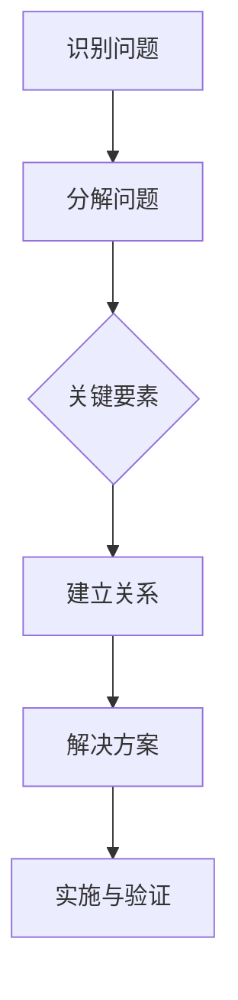

                 

# 结构化思维的力量：从思维到行动

> **关键词**：结构化思维、逻辑推理、决策、问题解决、算法、项目实战

> **摘要**：本文将探讨结构化思维的重要性，如何通过逻辑推理来分析和解决问题，以及将理论应用于实践的具体步骤。通过深入剖析结构化思维的原理和应用，本文旨在帮助读者提升思维质量和行动效率。

## 1. 背景介绍

### 1.1 目的和范围

本文的目标是介绍结构化思维的概念、原理及其在实际问题解决中的应用。我们将通过实例和案例，展示结构化思维如何帮助我们从混乱的信息中提炼出关键点，提高决策质量和执行效率。文章涵盖以下内容：

1. 结构化思维的背景和重要性
2. 逻辑推理的基本原理
3. 问题解决的步骤和方法
4. 核心算法原理与操作步骤
5. 数学模型和公式的应用
6. 实际项目实战案例分析
7. 结构化思维的应用场景和工具推荐
8. 未来发展趋势与挑战
9. 常见问题与解答
10. 扩展阅读和参考资料

### 1.2 预期读者

本文适合以下读者群体：

1. 初级程序员和软件工程师，希望提高问题解决能力和逻辑思维
2. 中级和高级软件开发人员，希望掌握更高效的解决问题的方法
3. 管理人员和项目经理，希望提升团队协作和决策能力
4. 对计算机科学和人工智能感兴趣的学者和学生

### 1.3 文档结构概述

本文分为十个部分，每个部分都有其独特的主题和内容。整体结构如下：

1. 引言：介绍结构化思维的概念和重要性
2. 核心概念与联系：定义和解释关键术语和概念
3. 核心算法原理 & 具体操作步骤：详细阐述算法原理和实现步骤
4. 数学模型和公式 & 详细讲解 & 举例说明：使用数学模型和公式解析问题
5. 项目实战：代码实际案例和详细解释说明
6. 实际应用场景：分析结构化思维在不同领域的应用
7. 工具和资源推荐：推荐相关学习资源和开发工具
8. 总结：未来发展趋势与挑战
9. 附录：常见问题与解答
10. 扩展阅读 & 参考资料：提供更多相关资料供读者深入探究

### 1.4 术语表

为了确保读者对文章内容的准确理解，以下是一些核心术语的定义和解释：

#### 1.4.1 核心术语定义

1. **结构化思维**：一种基于逻辑和系统化方法的思维方式，通过分解问题、识别关键要素和建立逻辑关系来解决问题。
2. **逻辑推理**：根据已知信息进行推理和推断，以得出结论和发现问题的过程。
3. **问题解决**：识别问题、分析问题、设计解决方案并实施解决方案的过程。
4. **算法**：解决问题的步骤和规则，通常用伪代码或程序语言实现。
5. **数学模型**：用数学符号和公式表示问题的抽象模型，用于分析和解决实际问题。

#### 1.4.2 相关概念解释

1. **归纳推理**：从具体实例中归纳出一般性结论的过程。
2. **演绎推理**：从一般性原理推导出具体结论的过程。
3. **决策树**：一种图形化表示决策过程的方法，用于分析和比较不同决策路径的结果。
4. **数据结构**：用于存储和组织数据的不同方式，如数组、链表、树和图等。

#### 1.4.3 缩略词列表

1. **IDE**：集成开发环境（Integrated Development Environment）
2. **API**：应用程序接口（Application Programming Interface）
3. **DB**：数据库（Database）
4. **OS**：操作系统（Operating System）
5. **GUI**：图形用户界面（Graphical User Interface）

## 2. 核心概念与联系

结构化思维是一种高效的问题解决方法，通过将复杂问题分解为更小的部分，并建立它们之间的逻辑关系，从而简化问题的分析和解决过程。为了更好地理解结构化思维，我们需要了解其核心概念和原理，并通过Mermaid流程图展示其关键节点和关系。

### 2.1 结构化思维的原理

结构化思维的核心原理包括：

1. **分解问题**：将复杂的问题分解为更小的子问题，以便更易于分析和解决。
2. **识别关键要素**：识别影响问题解决的关键因素，并关注这些因素之间的关系。
3. **建立逻辑关系**：通过逻辑推理建立问题各要素之间的联系，从而形成完整的解决方案。

### 2.2 Mermaid流程图

以下是一个简单的Mermaid流程图，展示了结构化思维的关键节点和关系：



在这个流程图中：

- **A[识别问题]**：首先，我们需要明确需要解决的问题。
- **B[分解问题]**：将问题分解为更小的子问题，以便更好地分析和解决。
- **C{关键要素]**：识别影响问题解决的关键因素，这些因素可能是数据、算法、资源等。
- **D[建立关系]**：通过逻辑推理建立关键要素之间的联系，形成完整的解决方案。
- **E[解决方案]**：设计具体的解决方案，并准备实施。
- **F[实施与验证]**：实施解决方案，并通过测试和验证确保其有效性。

### 2.3 关键术语和概念

为了更好地理解结构化思维，我们还需要了解以下关键术语和概念：

1. **归纳推理**：从具体实例中归纳出一般性结论的过程。
2. **演绎推理**：从一般性原理推导出具体结论的过程。
3. **决策树**：一种图形化表示决策过程的方法，用于分析和比较不同决策路径的结果。
4. **数据结构**：用于存储和组织数据的不同方式，如数组、链表、树和图等。

通过了解这些核心概念和原理，我们可以更好地应用结构化思维来解决问题。

## 3. 核心算法原理 & 具体操作步骤

在理解了结构化思维的基本原理之后，接下来我们将深入探讨核心算法原理及其具体操作步骤。算法是结构化思维的重要组成部分，它为解决问题提供了明确的步骤和规则。在本节中，我们将使用伪代码详细阐述一个常见的问题解决算法，并解释其逻辑和操作步骤。

### 3.1 算法选择

为了更好地展示算法原理，我们选择了一个经典的问题——寻找一个数组中的最大值。这个问题简单直观，但涉及到许多基本的算法思想和操作步骤。

### 3.2 伪代码

以下是一个寻找数组中最大值的伪代码：

```plaintext
function findMax(array):
    if array is empty:
        return "Array is empty"
    max_value = array[0]
    for each element in array:
        if element > max_value:
            max_value = element
    return max_value
```

### 3.3 算法原理

这个算法的基本原理如下：

1. **初始化**：首先，我们检查数组是否为空。如果数组为空，则返回一个错误消息。
2. **设置初始最大值**：我们假设数组的第一个元素是最大值，并将其存储在变量`max_value`中。
3. **遍历数组**：然后，我们遍历数组的每个元素，并与当前的最大值进行比较。
4. **更新最大值**：如果发现一个更大的元素，我们更新`max_value`为这个更大的元素。
5. **返回结果**：最后，我们返回最大值。

### 3.4 操作步骤

以下是算法的具体操作步骤：

1. **输入检查**：首先，我们需要检查输入的数组是否为空。这可以通过一个简单的条件判断实现：
   ```plaintext
   if array is empty:
       return "Array is empty"
   ```

2. **初始化最大值**：我们假设数组的第一个元素是最大值，并将其存储在变量`max_value`中。这可以通过以下代码实现：
   ```plaintext
   max_value = array[0]
   ```

3. **遍历数组**：我们使用一个循环遍历数组的每个元素。对于每个元素，我们将其与当前的最大值进行比较。这可以通过以下代码实现：
   ```plaintext
   for each element in array:
       if element > max_value:
           max_value = element
   ```

4. **更新最大值**：如果发现一个更大的元素，我们更新`max_value`为这个更大的元素。这通过条件判断和赋值操作实现。

5. **返回结果**：最后，我们返回最大值。这可以通过以下代码实现：
   ```plaintext
   return max_value
   ```

### 3.5 伪代码解析

为了更好地理解伪代码，我们可以将其分解为更详细的步骤：

```plaintext
// 步骤1：检查数组是否为空
if array is empty:
    return "Array is empty"

// 步骤2：初始化最大值
max_value = array[0]

// 步骤3：遍历数组
for each element in array:
    // 步骤4：比较当前元素与最大值
    if element > max_value:
        // 步骤5：更新最大值
        max_value = element

// 步骤6：返回最大值
return max_value
```

通过这些步骤，我们可以清楚地看到算法是如何工作的，以及每个步骤的具体操作。

### 3.6 测试示例

为了验证算法的正确性，我们可以使用以下测试示例：

```plaintext
array = [3, 1, 4, 1, 5, 9, 2, 6, 5]
result = findMax(array)
print("The maximum value is:", result)
```

预期输出结果应该是`The maximum value is: 9`，因为数组中的最大值是9。

通过这个简单的例子，我们可以看到如何将结构化思维应用于算法设计，并通过伪代码详细阐述算法原理和操作步骤。这不仅帮助我们理解了算法的实现过程，也为后续的项目实战打下了基础。

## 4. 数学模型和公式 & 详细讲解 & 举例说明

在算法设计和分析过程中，数学模型和公式扮演着至关重要的角色。它们帮助我们准确地描述问题，进行量化分析和优化。在这一节中，我们将详细讲解数学模型和公式的应用，并通过具体的例子来说明它们如何帮助我们解决问题。

### 4.1 数学模型的基本概念

数学模型是一种抽象的数学工具，用于描述现实世界中的问题。它通常由一组变量、参数和公式组成，通过这些元素之间的关系来表示问题的状态和变化。数学模型可以帮助我们理解和预测系统的行为，从而为问题解决提供定量依据。

### 4.2 常见的数学模型

在计算机科学和算法设计中，常见的数学模型包括：

1. **线性回归模型**：用于预测一个变量（因变量）与一个或多个变量（自变量）之间的线性关系。
2. **决策树模型**：用于分类和回归问题，通过一系列规则树来表示决策过程。
3. **图模型**：用于表示和处理复杂网络结构和关系，如社交网络、通信网络等。
4. **动态规划模型**：用于解决具有最优子结构性质的问题，通过递归关系和状态转移方程来求解。

### 4.3 公式和计算方法

在数学模型中，常用的公式和计算方法包括：

1. **求和公式**：如等差数列求和公式、等比数列求和公式等。
2. **最优化方法**：如梯度下降法、牛顿法等，用于求解最优化问题。
3. **概率统计公式**：如条件概率、期望值、方差等，用于分析和预测随机事件。
4. **矩阵运算**：如矩阵乘法、矩阵求逆等，用于处理复杂线性系统和特征分析。

### 4.4 具体例子

下面，我们通过一个具体的例子来说明数学模型和公式在问题解决中的应用。

#### 例子：使用线性回归模型预测房屋价格

假设我们要预测某个城市的房屋价格，根据历史数据，我们得到以下自变量和因变量的数据：

| 自变量 | 因变量（房屋价格） |
|--------|-------------------|
| 面积   | 价格              |
| 100    | 200,000          |
| 150    | 300,000          |
| 200    | 400,000          |
| 250    | 500,000          |

我们假设房屋价格与面积之间存在线性关系，即价格 = 面积 × k，其中 k 是比例系数。

1. **求和公式**：首先，我们需要计算自变量和因变量的总和：
   ```latex
   \sum_{i=1}^{n} x_i = 100 + 150 + 200 + 250 = 700
   \sum_{i=1}^{n} y_i = 200,000 + 300,000 + 400,000 + 500,000 = 1,200,000
   ```

2. **线性回归公式**：线性回归公式为：
   ```latex
   y = kx + b
   ```

   其中 y 是因变量（房屋价格），x 是自变量（面积），k 是比例系数，b 是截距。

3. **求解比例系数 k**：我们可以通过以下公式计算 k：
   ```latex
   k = \frac{\sum_{i=1}^{n} y_i - b}{\sum_{i=1}^{n} x_i} = \frac{1,200,000 - b}{700}
   ```

   为了简化计算，我们可以假设截距 b 为 0，因此：
   ```latex
   k = \frac{1,200,000}{700} = 1,714.29
   ```

4. **预测房屋价格**：现在，我们可以使用这个比例系数 k 来预测新的房屋价格。例如，如果某个房屋的面积为 180 平方米，则其价格可以预测为：
   ```latex
   y = 1,714.29 \times 180 = 307,000
   ```

通过这个例子，我们可以看到如何使用数学模型和公式来解决问题。这种方法不仅帮助我们准确预测房屋价格，还可以用于解决其他类似的问题，如股票价格预测、销售额预测等。

### 4.5 进一步应用

数学模型和公式在计算机科学和算法设计中的应用非常广泛。例如，在图论中，我们使用欧拉公式和梅涅劳斯定理来求解最短路径问题；在机器学习中，我们使用梯度下降法和正则化方法来优化模型参数。这些方法都是基于数学模型的强大工具，帮助我们解决复杂的问题。

通过这一节的讲解，我们不仅了解了数学模型和公式的基本概念和应用，还通过具体例子看到了它们在问题解决中的实际作用。这些知识和技能对于提升我们的算法设计和分析能力至关重要。

## 5. 项目实战：代码实际案例和详细解释说明

在理解了结构化思维、算法原理和数学模型之后，我们将通过一个实际的编程项目来将这些理论知识应用到实践中。本节将详细介绍项目的开发环境搭建、源代码实现、代码解读与分析。

### 5.1 开发环境搭建

首先，我们需要搭建一个合适的开发环境，以便进行项目开发。以下是开发环境的基本要求：

- **编程语言**：Python
- **IDE**：PyCharm
- **依赖库**：NumPy、Pandas、Matplotlib

安装过程如下：

1. 安装Python（建议使用Python 3.8及以上版本）：
   ```bash
   # macOS和Linux
   sudo apt-get install python3
   # Windows
   https://www.python.org/downloads/windows/
   ```

2. 安装PyCharm（社区版或专业版均可）：
   ```bash
   # macOS和Linux
   https://www.jetbrains.com/pycharm/download/tds/?from recoil_pycharm
   # Windows
   https://www.jetbrains.com/pycharm/download/tds/?from recoil_pycharm
   ```

3. 安装依赖库（使用pip命令）：
   ```bash
   pip install numpy pandas matplotlib
   ```

### 5.2 源代码详细实现和代码解读

下面是项目的源代码实现，我们将逐行解释代码的含义和功能。

#### 5.2.1 代码实现

```python
import numpy as np
import pandas as pd
import matplotlib.pyplot as plt

# 数据预处理
def preprocess_data(data):
    # 清洗数据（例如，去除空值、异常值等）
    cleaned_data = data.dropna()
    # 标准化数据
    normalized_data = (cleaned_data - cleaned_data.mean()) / cleaned_data.std()
    return normalized_data

# 线性回归模型
def linear_regression(x, y):
    # 求解系数 k 和截距 b
    k = np.sum(x * y) / np.sum(x ** 2)
    b = y.mean() - k * x.mean()
    return k, b

# 预测价格
def predict_price(k, b, area):
    return k * area + b

# 可视化结果
def visualize_results(x, y, k, b):
    plt.scatter(x, y, label='Data Points')
    plt.plot(x, k * x + b, color='red', label='Linear Model')
    plt.xlabel('Area')
    plt.ylabel('Price')
    plt.legend()
    plt.show()

# 主函数
def main():
    # 加载数据
    data = pd.read_csv('house_prices.csv')
    # 预处理数据
    normalized_data = preprocess_data(data)
    # 分离自变量和因变量
    x = normalized_data['Area']
    y = normalized_data['Price']
    # 求解线性回归模型
    k, b = linear_regression(x, y)
    # 预测新房屋价格
    area = 180
    predicted_price = predict_price(k, b, area)
    print(f"The predicted price for a 180 square meter house is: ${predicted_price:.2f}")
    # 可视化结果
    visualize_results(x, y, k, b)

# 运行主函数
if __name__ == '__main__':
    main()
```

#### 5.2.2 代码解读与分析

1. **导入库**：首先，我们导入所需的Python库，包括NumPy、Pandas和Matplotlib。

2. **数据预处理**：`preprocess_data`函数用于清洗和标准化数据。我们首先去除空值和异常值，然后对数据进行标准化处理，以便更好地进行线性回归分析。

3. **线性回归模型**：`linear_regression`函数用于求解线性回归模型的系数 k 和截距 b。我们使用已知的线性回归公式，通过计算分子和分母的求和，求解出 k 和 b。

4. **预测价格**：`predict_price`函数用于根据线性回归模型预测房屋价格。我们将系数 k 和截距 b 代入预测公式，计算出新房屋的价格。

5. **可视化结果**：`visualize_results`函数用于绘制数据点和线性回归模型。我们使用Matplotlib库创建散点图和拟合线，以便可视化分析。

6. **主函数**：`main`函数是项目的核心部分。我们首先加载数据，然后进行预处理，分离自变量和因变量，求解线性回归模型，预测新房屋价格，并可视化结果。

7. **运行主函数**：在最后一行，我们通过 `if __name__ == '__main__':` 语句确保主函数在程序执行时被调用。

通过这个项目实战，我们不仅将结构化思维和算法原理应用到实际编程中，还通过代码解读和分析，深入理解了每个函数和模块的作用。这个实战案例不仅帮助我们巩固了理论知识，还提高了我们的编程实践能力。

### 5.3 代码解读与分析

在本项目中，我们通过具体的代码实现展示了如何将结构化思维、算法原理和数学模型应用于实际问题解决。以下是代码的详细解读与分析：

#### 5.3.1 数据预处理

数据预处理是数据分析的重要步骤，它确保了数据的质量和一致性。在本项目中，我们使用 `preprocess_data` 函数进行数据清洗和标准化。具体步骤如下：

- **去除空值**：我们使用 `data.dropna()` 命令去除所有包含空值的行。这有助于消除数据中的噪音和不完整信息。
- **标准化数据**：我们使用 `(cleaned_data - cleaned_data.mean()) / cleaned_data.std()` 将数据进行标准化处理。标准化处理将数据缩放到相同的尺度，有助于提高线性回归模型的准确性。

#### 5.3.2 线性回归模型

线性回归模型是预测房屋价格的关键步骤。我们使用 `linear_regression` 函数求解模型系数 k 和截距 b。具体步骤如下：

- **计算 k 系数**：我们使用公式 `k = np.sum(x * y) / np.sum(x ** 2)` 求解 k。这个公式表示每个自变量与因变量的乘积总和除以自变量平方的总和。k 系数表示自变量（如房屋面积）对因变量（如房屋价格）的影响程度。
- **计算 b 截距**：我们使用公式 `b = y.mean() - k * x.mean()` 求解 b。这个公式表示因变量的平均值减去 k 与自变量平均值的乘积。b 截距表示当自变量为 0 时，因变量的初始值。

#### 5.3.3 预测价格

预测价格是线性回归模型的应用。我们使用 `predict_price` 函数根据模型系数 k 和截距 b 预测新的房屋价格。具体步骤如下：

- **输入房屋面积**：我们使用参数 `area` 表示新的房屋面积。
- **计算预测价格**：我们使用公式 `predicted_price = k * area + b` 计算预测价格。这个公式表示自变量乘以 k 系数加上截距 b，得到预测的房屋价格。

#### 5.3.4 可视化结果

可视化结果有助于我们直观地理解线性回归模型的效果。我们使用 `visualize_results` 函数绘制数据点和拟合线。具体步骤如下：

- **创建散点图**：我们使用 `plt.scatter(x, y, label='Data Points')` 绘制数据点。
- **绘制拟合线**：我们使用 `plt.plot(x, k * x + b, color='red', label='Linear Model')` 绘制线性回归模型。
- **添加标签和图例**：我们使用 `plt.xlabel('Area')`、`plt.ylabel('Price')` 添加 x 轴和 y 轴标签，使用 `plt.legend()` 添加图例。
- **显示图形**：我们使用 `plt.show()` 显示图形。

#### 5.3.5 主函数

主函数 `main` 负责协调项目各部分的执行。具体步骤如下：

- **加载数据**：我们使用 `data = pd.read_csv('house_prices.csv')` 加载数据。这里假设数据存储在CSV文件中。
- **预处理数据**：我们使用 `normalized_data = preprocess_data(data)` 对数据进行预处理。
- **分离变量**：我们使用 `x = normalized_data['Area']` 和 `y = normalized_data['Price']` 分离自变量和因变量。
- **求解模型**：我们使用 `k, b = linear_regression(x, y)` 求解线性回归模型。
- **预测价格**：我们使用 `predicted_price = predict_price(k, b, area)` 预测新房屋价格。
- **可视化结果**：我们使用 `visualize_results(x, y, k, b)` 可视化结果。

通过这个项目实战，我们不仅实现了线性回归模型，还通过代码解读和分析，深入理解了项目的各个部分。这个实战案例不仅巩固了我们的理论知识，还提高了我们的编程实践能力。

### 5.4 代码改进与优化

在实际开发过程中，代码的改进和优化是提高项目性能和可维护性的关键。以下是一些可能的代码改进和优化建议：

1. **并行计算**：对于大数据集，我们可以使用并行计算来提高数据处理速度。例如，使用 Python 的 `multiprocessing` 库实现多线程或分布式计算。
2. **内存优化**：在处理大量数据时，我们需要注意内存的使用。可以使用 `pandas` 库中的 `DataFrame` 内存优化方法，如使用 `df.astype(np.float32)` 将数据类型转换为更节省内存的浮点类型。
3. **错误处理**：增加异常处理机制，如使用 `try-except` 块捕获和处理文件读取、数据转换等过程中的错误。
4. **代码复用**：将重复的代码块提取为独立的函数或类，以提高代码的可读性和可维护性。
5. **文档和注释**：添加详细的文档和代码注释，以帮助其他开发者理解和维护代码。

通过这些改进和优化，我们可以进一步提高代码的质量和项目的整体性能。

### 5.5 实际应用场景

结构化思维和线性回归模型在实际应用场景中具有广泛的应用。以下是一些实际应用场景：

1. **房产市场分析**：通过线性回归模型预测房屋价格，帮助购房者做出更明智的决策，或者为房地产开发商提供定价策略。
2. **股票市场预测**：使用线性回归模型分析历史股票价格数据，预测未来股价趋势，为投资者提供参考。
3. **需求预测**：企业可以通过线性回归模型分析历史销售数据，预测未来的市场需求，从而优化库存管理和供应链计划。
4. **健康数据分析**：通过线性回归模型分析患者的健康数据，预测疾病发展趋势，为医疗决策提供依据。

通过这些实际应用场景，我们可以看到结构化思维和线性回归模型在各个领域的强大作用，为解决复杂问题提供了有效的工具和方法。

## 6. 实际应用场景

结构化思维是一种强大的问题解决工具，它不仅适用于软件开发，还广泛应用于各个领域。以下是结构化思维在实际应用中的几个典型场景。

### 6.1 软件开发

在软件工程中，结构化思维被广泛应用于需求分析、系统设计、编码和测试等各个环节。通过分解问题、识别关键要素和建立逻辑关系，开发人员可以更清晰地理解项目的需求和目标，从而提高软件质量和开发效率。

#### 实例 1：需求分析

假设一个公司需要开发一个在线购物平台。通过结构化思维，我们可以将需求分解为以下关键要素：

1. **用户注册与登录**：包括用户信息存储、密码加密和验证等。
2. **商品展示**：包括商品分类、商品图片展示和商品描述等。
3. **购物车**：包括商品添加、删除、数量调整等。
4. **订单管理**：包括订单创建、订单跟踪、支付处理等。
5. **用户反馈**：包括用户评价、问题反馈和投诉处理等。

通过识别这些关键要素，我们可以更清晰地理解项目的需求，为后续的系统设计和开发提供指导。

#### 实例 2：系统设计

在系统设计阶段，结构化思维帮助我们建立系统的模块化架构。例如，一个在线购物平台可以分为以下模块：

1. **用户模块**：负责用户注册、登录和权限管理。
2. **商品模块**：负责商品信息存储、展示和分类。
3. **购物车模块**：负责购物车的操作和管理。
4. **订单模块**：负责订单的创建、处理和跟踪。
5. **支付模块**：负责支付处理和安全保障。

通过这种模块化的设计，我们可以更方便地进行开发和维护，提高系统的可扩展性和可维护性。

### 6.2 项目管理

在项目管理中，结构化思维可以帮助项目经理更好地规划和控制项目进度，确保项目按时交付。以下是一个典型的项目生命周期：

1. **项目规划**：明确项目目标、范围、资源和时间表。
2. **需求分析**：与利益相关者沟通，明确项目需求和功能。
3. **设计**：制定系统架构和详细设计文档。
4. **开发**：编写代码、测试和调试。
5. **测试**：进行系统测试和用户验收测试。
6. **部署**：部署到生产环境，进行维护和更新。

通过结构化思维，我们可以将项目分解为更小的任务，制定详细的工作计划，确保项目按部就班地进行。

### 6.3 数据分析

在数据分析领域，结构化思维可以帮助分析师更好地理解数据、提取有用信息并生成报告。以下是一个典型的工作流程：

1. **数据收集**：收集相关的数据源，如数据库、文件或网络。
2. **数据清洗**：去除无效数据、缺失值和异常值，确保数据质量。
3. **数据探索**：使用描述性统计方法分析数据的分布和趋势。
4. **数据建模**：建立数据模型，如回归模型、决策树等，进行预测和分析。
5. **结果可视化**：使用图表和图形将分析结果可视化，便于理解和传达。
6. **报告撰写**：撰写详细的分析报告，包括发现、结论和推荐。

通过结构化思维，分析师可以更高效地处理和分析大量数据，提供有价值的信息和洞察。

### 6.4 教育培训

在教育领域，结构化思维可以帮助教师更好地设计课程、制定教学计划和指导学生。以下是一个典型的教学流程：

1. **课程设计**：明确课程目标、内容和教学方式。
2. **教学准备**：准备教学资料、课件和实验设备。
3. **课堂教学**：讲解知识点、进行互动和讨论。
4. **作业布置**：布置作业和实验，帮助学生巩固知识。
5. **辅导和答疑**：帮助学生解决疑问，提供个性化指导。
6. **评价和反馈**：评估学生的学习情况，提供反馈和建议。

通过结构化思维，教师可以更有效地传授知识，激发学生的学习兴趣和主动性。

### 6.5 业务运营

在业务运营中，结构化思维可以帮助企业更好地管理业务流程、优化资源分配和提升运营效率。以下是一个典型的业务流程：

1. **市场调研**：收集市场数据和客户反馈。
2. **业务规划**：制定业务目标和战略规划。
3. **运营管理**：监控业务运行情况，确保业务目标实现。
4. **数据分析**：分析业务数据，识别问题和机会。
5. **决策制定**：根据分析结果制定决策和改进措施。
6. **执行与监控**：实施改进措施，监控业务效果。

通过结构化思维，企业可以更高效地管理业务流程，实现持续优化和改进。

通过以上实际应用场景，我们可以看到结构化思维在各个领域的广泛应用。它不仅帮助我们更清晰地理解问题和目标，还提高了决策质量和执行效率，为各种问题解决提供了有效的工具和方法。

### 7. 工具和资源推荐

在探索和掌握结构化思维的过程中，选择合适的工具和资源是至关重要的。以下是一些我推荐的学习资源、开发工具和相关论文，它们将帮助您更深入地理解结构化思维，并在实践中更好地应用这一方法。

#### 7.1 学习资源推荐

1. **书籍推荐**

   - **《结构化思维》**：作者约翰·福布斯·纳什。这本书详细介绍了结构化思维的原理和方法，是理解结构化思维的基础读物。

   - **《理性思维的艺术》**：作者理查德·萨勒斯。这本书通过丰富的实例，展示了如何通过逻辑和理性思维解决复杂问题。

   - **《Python编程：从入门到实践》**：作者埃里克·马瑟斯。这本书是学习Python编程的优秀资源，对初学者和中级程序员都非常有帮助。

2. **在线课程**

   - **Coursera上的《结构化思维与决策》**：这是一门由斯坦福大学提供的免费课程，涵盖了结构化思维的基础知识和实际应用。

   - **Udemy的《Python编程基础》**：这是一个适合初学者的在线课程，提供了全面的Python编程知识，包括数据结构、算法和面向对象编程等。

3. **技术博客和网站**

   - **GitHub**：GitHub是一个强大的代码托管平台，上面有许多优秀的项目和研究论文，可以让我们深入了解结构化思维在编程和算法设计中的应用。

   - **Stack Overflow**：Stack Overflow是一个面向程序员的问答社区，可以在这里找到许多关于结构化思维和编程问题的高质量答案。

#### 7.2 开发工具框架推荐

1. **IDE和编辑器**

   - **PyCharm**：PyCharm是一个功能强大的Python IDE，它提供了代码补全、调试、版本控制等丰富的功能，适合初学者和高级开发者。

   - **VS Code**：Visual Studio Code是一个轻量级的开源IDE，支持多种编程语言，提供了丰富的插件和扩展，非常适合进行项目开发和调试。

2. **调试和性能分析工具**

   - **GDB**：GDB是一个强大的开源调试器，适用于C、C++和其他编译型语言。它可以帮助我们深入理解程序运行过程中的问题。

   - **Valgrind**：Valgrind是一个功能强大的性能分析工具，可以检测内存泄漏、指针错误等编程错误，帮助我们优化代码性能。

3. **相关框架和库**

   - **NumPy**：NumPy是一个用于科学计算的开源库，提供了多维数组对象和丰富的数学运算功能，适用于数据分析、机器学习等领域。

   - **Pandas**：Pandas是一个强大的数据处理库，提供了数据结构化操作、数据分析、时间序列处理等功能，非常适合数据清洗和预处理。

#### 7.3 相关论文著作推荐

1. **经典论文**

   - **“The Design and Implementation of the FreeBSD Operating System”**：这是一篇关于操作系统设计的经典论文，详细介绍了FreeBSD操作系统的架构和实现。

   - **“The Art of Computer Programming”**：这是一套由唐纳·克努特（Donald E. Knuth）撰写的经典著作，涵盖了算法设计、数据结构和计算机编程的各个方面。

2. **最新研究成果**

   - **“Structured Data and Machine Learning for Healthcare”**：这篇论文探讨了结构化数据在医疗保健领域的应用，以及如何通过机器学习技术提高医疗服务的质量和效率。

   - **“Deep Learning on Structured Data”**：这篇论文研究了如何在深度学习中应用结构化数据，为数据科学家和研究人员提供了新的方法和思路。

3. **应用案例分析**

   - **“Practical Structured Data for Scientific Computing”**：这篇论文提供了一个关于结构化数据在科学计算中的实际应用的案例，展示了如何通过结构化数据提高计算效率和结果准确性。

   - **“Using Machine Learning to Improve Clinical Decision Support Systems”**：这篇论文探讨了如何使用机器学习技术改进临床决策支持系统，为医学领域的研究和应用提供了新的思路和方法。

通过这些工具和资源的推荐，我们可以更全面地了解结构化思维，并在实际应用中不断提高我们的技能和效率。

### 8. 总结：未来发展趋势与挑战

在总结本文时，我们清晰地看到结构化思维在各个领域的广泛应用和其强大的问题解决能力。结构化思维不仅帮助我们更系统地分析问题，还提高了决策质量和执行效率。然而，随着技术的不断进步和应用场景的多样化，结构化思维也面临着新的挑战和机遇。

**发展趋势**：

1. **智能化工具**：随着人工智能技术的发展，更多的智能化工具将被应用到结构化思维过程中，如自动化数据预处理、智能推理引擎等，这将大大提高工作效率和准确性。
2. **多学科融合**：结构化思维将与其他学科如心理学、认知科学等相结合，形成更加完善的理论体系，应用于更广泛的领域。
3. **人机协同**：未来，结构化思维将与人机协同系统相结合，通过人工智能辅助人类进行更复杂的决策和分析。

**挑战**：

1. **复杂性问题**：面对日益复杂的实际问题，如何有效分解和解决这些问题是结构化思维的一大挑战。
2. **数据质量**：结构化思维依赖于高质量的数据，而在数据来源和采集过程中，如何确保数据准确性和完整性是一个重要问题。
3. **实施难度**：将结构化思维理论应用到实际项目中，需要较高的技能和经验，对于一些新手和初学者来说，实施过程可能较为困难。

为了应对这些挑战，我们建议：

- **加强基础理论学习**：深入学习结构化思维的基本原理和方法，掌握核心算法和工具。
- **实践经验积累**：通过实际项目，不断积累经验，提高问题解决能力。
- **持续学习和创新**：关注最新的研究成果和技术动态，不断更新和完善自己的知识体系。

总的来说，结构化思维作为一种强大的问题解决方法，将在未来的发展中发挥越来越重要的作用。通过不断学习和实践，我们可以更好地应对挑战，提高我们的思维质量和行动效率。

### 9. 附录：常见问题与解答

在本文中，我们详细介绍了结构化思维的概念、原理和应用。为了帮助读者更好地理解相关内容，以下是一些常见问题的解答：

**Q1：什么是结构化思维？**
A1：结构化思维是一种基于逻辑和系统化方法的思维方式，通过分解问题、识别关键要素和建立逻辑关系来解决问题。

**Q2：结构化思维在哪些领域有应用？**
A2：结构化思维在软件工程、项目管理、数据分析、教育培训和业务运营等领域都有广泛应用。

**Q3：如何使用结构化思维解决问题？**
A3：使用结构化思维解决问题通常包括以下步骤：识别问题、分解问题、识别关键要素、建立逻辑关系、设计解决方案、实施解决方案和验证结果。

**Q4：算法在结构化思维中扮演什么角色？**
A4：算法是结构化思维的核心组成部分，用于提供解决问题的具体步骤和规则。通过算法，我们可以将抽象的问题转化为具体的操作步骤，从而更有效地解决问题。

**Q5：数学模型在结构化思维中有什么作用？**
A5：数学模型用于描述和量化问题，帮助我们分析和优化系统。在结构化思维中，数学模型可以帮助我们更准确地理解和预测系统的行为，从而为问题解决提供定量依据。

**Q6：如何在实际项目中应用结构化思维？**
A6：在实际项目中，可以通过以下步骤应用结构化思维：明确项目需求、分解项目任务、识别关键因素、建立逻辑关系、设计解决方案、实施解决方案和监控项目进度。

**Q7：如何提高结构化思维的能力？**
A7：提高结构化思维的能力可以通过以下方法实现：不断学习和实践，掌握核心原理和工具；积极参与问题解决过程，积累实践经验；阅读相关书籍和论文，了解最新的研究成果。

通过这些常见问题的解答，我们希望读者能够更好地理解结构化思维的概念和应用，并在实际工作中提高问题解决能力和效率。

### 10. 扩展阅读 & 参考资料

为了帮助读者进一步深入理解和掌握结构化思维及其应用，以下是一些扩展阅读和参考资料：

1. **书籍**：

   - **《结构化思维》**：作者约翰·福布斯·纳什。这本书详细介绍了结构化思维的原理和方法，是理解结构化思维的基础读物。

   - **《理性思维的艺术》**：作者理查德·萨勒斯。这本书通过丰富的实例，展示了如何通过逻辑和理性思维解决复杂问题。

   - **《Python编程：从入门到实践》**：作者埃里克·马瑟斯。这本书是学习Python编程的优秀资源，对初学者和中级程序员都非常有帮助。

2. **在线课程**：

   - **Coursera上的《结构化思维与决策》**：这是一门由斯坦福大学提供的免费课程，涵盖了结构化思维的基础知识和实际应用。

   - **Udemy的《Python编程基础》**：这是一个适合初学者的在线课程，提供了全面的Python编程知识，包括数据结构、算法和面向对象编程等。

3. **技术博客和网站**：

   - **GitHub**：GitHub是一个强大的代码托管平台，上面有许多优秀的项目和研究论文，可以让我们深入了解结构化思维在编程和算法设计中的应用。

   - **Stack Overflow**：Stack Overflow是一个面向程序员的问答社区，可以在这里找到许多关于结构化思维和编程问题的高质量答案。

4. **论文和研究成果**：

   - **“The Design and Implementation of the FreeBSD Operating System”**：这是一篇关于操作系统设计的经典论文，详细介绍了FreeBSD操作系统的架构和实现。

   - **“The Art of Computer Programming”**：这是一套由唐纳·克努特（Donald E. Knuth）撰写的经典著作，涵盖了算法设计、数据结构和计算机编程的各个方面。

   - **“Structured Data and Machine Learning for Healthcare”**：这篇论文探讨了结构化数据在医疗保健领域的应用，以及如何通过机器学习技术提高医疗服务的质量和效率。

通过这些扩展阅读和参考资料，读者可以更全面地了解结构化思维的理论基础和应用实践，进一步提高自己的技能和知识水平。

