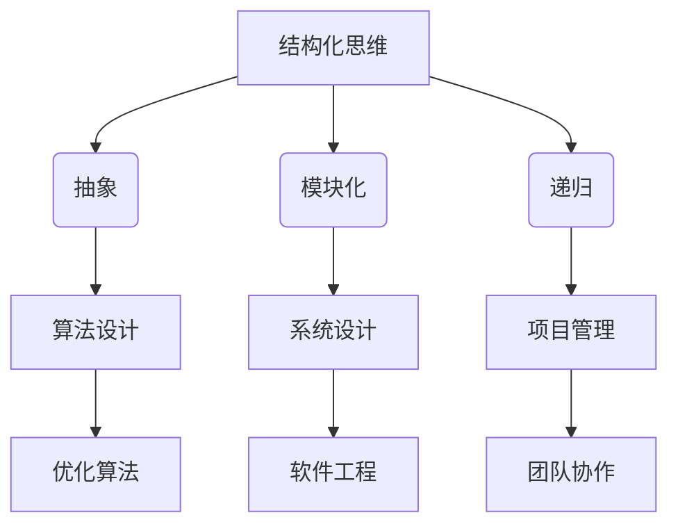

                 


# 结构化思维的力量：从思维到行动

> **关键词：结构化思维，系统设计，算法原理，数学模型，实际应用，资源推荐**
> 
> **摘要：本文将深入探讨结构化思维在IT领域的应用，从核心概念、算法原理到实际案例，全面阐述如何通过结构化思维提高系统设计的效率和质量，帮助读者掌握从思维到行动的技能，为IT行业发展贡献智慧。**

## 1. 背景介绍

### 1.1 目的和范围

本文旨在阐述结构化思维在IT领域的应用，具体包括：
- **核心概念**：介绍结构化思维的原理和基本概念。
- **算法原理**：分析结构化思维在算法设计中的应用。
- **数学模型**：探讨结构化思维与数学模型的结合。
- **实际案例**：通过项目实战展示结构化思维的实际应用。
- **资源推荐**：推荐相关的学习资源、开发工具和论文著作。

### 1.2 预期读者

- **IT从业者**：对结构化思维在系统设计和算法优化方面感兴趣的程序员、架构师和开发者。
- **学生和研究者**：希望深入了解结构化思维在IT领域应用的学术人士。
- **项目经理**：关注团队协作和项目管理，希望提高项目效率和质量的管理者。

### 1.3 文档结构概述

本文结构如下：

1. **背景介绍**：阐述本文的目的、预期读者和文档结构。
2. **核心概念与联系**：介绍结构化思维的基本概念和原理，使用Mermaid流程图展示核心概念的联系。
3. **核心算法原理 & 具体操作步骤**：详细讲解结构化思维在算法设计中的应用，使用伪代码阐述具体操作步骤。
4. **数学模型和公式**：分析结构化思维与数学模型的结合，使用LaTeX格式展示相关公式。
5. **项目实战**：通过实际案例展示结构化思维的应用。
6. **实际应用场景**：探讨结构化思维在不同领域的应用。
7. **工具和资源推荐**：推荐学习资源、开发工具和论文著作。
8. **总结**：总结结构化思维在IT领域的发展趋势和挑战。
9. **附录**：常见问题与解答。
10. **扩展阅读 & 参考资料**：提供更多相关资源和研究方向。

### 1.4 术语表

#### 1.4.1 核心术语定义

- **结构化思维**：将复杂问题分解为若干个子问题，并建立它们之间的联系，从而简化问题解决过程。
- **算法**：解决问题的一系列规则或指令。
- **系统设计**：构建系统时进行的需求分析、架构设计和编码实现。
- **数学模型**：用数学语言描述现实世界中的问题，帮助理解问题本质和寻找解决方案。

#### 1.4.2 相关概念解释

- **抽象**：将复杂问题简化为更简单、更易于理解和处理的形式。
- **模块化**：将系统分解为若干个功能模块，提高系统的可维护性和可扩展性。
- **递归**：一种算法设计方法，通过重复调用自身来解决问题。

#### 1.4.3 缩略词列表

- **LaTeX**：一种高质量排版系统，广泛用于科学文档编写。
- **Mermaid**：一种基于Markdown的图表绘制工具。

## 2. 核心概念与联系

在深入探讨结构化思维之前，我们先来了解一些核心概念及其联系。

### 2.1 结构化思维的基本概念

**定义**：结构化思维是一种将复杂问题分解为若干个子问题，并建立它们之间联系的方法。通过这种方法，我们可以简化问题解决过程，提高问题解决效率。

**原理**：

1. **抽象**：将复杂问题简化为更简单、更易于理解和处理的形式。
2. **模块化**：将系统分解为若干个功能模块，提高系统的可维护性和可扩展性。
3. **递归**：通过重复调用自身来解决问题。

**应用领域**：

- **软件工程**：在需求分析、架构设计和编码实现阶段，使用结构化思维可以提高系统设计质量和开发效率。
- **算法设计**：在算法设计中，使用结构化思维可以帮助简化问题，提高算法效率。
- **项目管理**：在项目管理和团队协作中，使用结构化思维可以提高项目执行效率和团队协作效率。

### 2.2 结构化思维与算法的联系

算法设计是结构化思维的一个重要应用领域。在算法设计中，结构化思维可以帮助我们：

1. **明确问题**：通过分解问题，找到问题的关键点。
2. **设计算法**：使用结构化思维构建算法框架，提高算法的可理解性和可维护性。
3. **优化算法**：通过分析算法的结构和性能，找到优化空间。

### 2.3 Mermaid流程图展示核心概念联系



通过以上分析，我们可以看出结构化思维在IT领域具有广泛的应用前景。接下来，我们将进一步探讨结构化思维在核心算法原理、数学模型和实际应用方面的应用。

## 3. 核心算法原理 & 具体操作步骤

### 3.1 算法原理

结构化思维在算法设计中的应用主要体现在以下三个方面：

1. **问题分解**：将复杂问题分解为若干个子问题，降低问题复杂度。
2. **递归设计**：利用递归思想简化算法实现。
3. **模块化设计**：将算法分解为若干个功能模块，提高算法的可维护性和可扩展性。

### 3.2 具体操作步骤

#### 步骤1：问题分解

首先，我们需要对问题进行分解，将复杂问题转化为更简单的子问题。具体操作步骤如下：

1. **明确问题目标**：确定要解决的问题是什么，问题的输入和输出是什么。
2. **找出问题关键点**：分析问题中的关键点，明确需要解决的核心问题。
3. **分解问题**：将问题分解为若干个子问题，每个子问题相对独立，且与原始问题有明确的关联。

#### 步骤2：递归设计

递归是一种有效的算法设计方法，可以简化问题解决过程。具体操作步骤如下：

1. **定义递归函数**：根据问题分解的结果，定义递归函数，用于解决子问题。
2. **确定递归终止条件**：确保递归函数能够正确地终止，避免陷入无限递归。
3. **递归调用**：在递归函数中，通过递归调用解决子问题。

#### 步骤3：模块化设计

模块化设计可以提高算法的可维护性和可扩展性。具体操作步骤如下：

1. **划分功能模块**：根据算法实现需求，将算法分解为若干个功能模块。
2. **定义模块接口**：为每个模块定义清晰的接口，确保模块之间可以独立工作。
3. **实现模块功能**：根据模块接口，实现每个模块的功能。

### 3.3 伪代码示例

以下是一个简单的递归算法示例，用于求解斐波那契数列：

```python
def fibonacci(n):
    if n <= 1:
        return n
    else:
        return fibonacci(n-1) + fibonacci(n-2)
```

在这个示例中，我们首先定义了递归函数`fibonacci`，然后确定了递归终止条件（当`n`小于等于1时返回`n`），并通过递归调用解决了子问题。

### 3.4 实际应用

结构化思维在算法设计中的应用非常广泛，例如：

- **动态规划**：利用结构化思维将复杂问题分解为子问题，并使用递归或迭代方式解决。
- **贪心算法**：通过结构化思维找到问题中的局部最优解，并逐步优化得到全局最优解。
- **分治算法**：将问题分解为若干个子问题，分别解决，然后合并结果。

### 3.5 总结

通过以上分析，我们可以看出结构化思维在算法设计中的应用具有显著的优势。掌握结构化思维，可以帮助我们更好地设计高效的算法，提高问题解决能力。接下来，我们将进一步探讨结构化思维在数学模型和实际应用方面的应用。

## 4. 数学模型和公式 & 详细讲解 & 举例说明

### 4.1 数学模型与结构化思维的关系

结构化思维在数学模型中的应用主要体现在以下几个方面：

1. **抽象**：通过将复杂问题简化为数学模型，我们可以更清晰地理解问题本质，并找到解决问题的方法。
2. **模块化**：将数学模型分解为若干个子模块，可以提高模型的可维护性和可扩展性。
3. **递归**：利用递归思想，可以将复杂的数学模型分解为更简单的子模型。

### 4.2 数学模型详细讲解

#### 4.2.1 基本概念

- **函数**：函数是一种特殊的关系，将一个集合中的每个元素映射到另一个集合中的唯一元素。
- **方程**：方程是包含未知数的数学表达式，要求解未知数的值。
- **不等式**：不等式是包含未知数的数学表达式，表示两个值之间的大小关系。

#### 4.2.2 公式讲解

- **线性方程组**：多个线性方程组成的方程组，可以用矩阵形式表示。
  $$ 
  \begin{cases} 
  a_1x + b_1y + c_1z = d_1 \\
  a_2x + b_2y + c_2z = d_2 \\
  a_3x + b_3y + c_3z = d_3 \\
  \end{cases} 
  $$
- **矩阵**：矩阵是按行列排列的数字表格，可以表示线性方程组。
  $$ 
  \begin{bmatrix} 
  a_1 & b_1 & c_1 \\
  a_2 & b_2 & c_2 \\
  a_3 & b_3 & c_3 \\
  \end{bmatrix} 
  $$
- **矩阵乘法**：矩阵与向量的乘法运算，可以求解线性方程组的解。
  $$
  \begin{bmatrix} 
  a_1 & b_1 & c_1 \\
  a_2 & b_2 & c_2 \\
  a_3 & b_3 & c_3 \\
  \end{bmatrix} 
  \begin{bmatrix} 
  x \\
  y \\
  z \\
  \end{bmatrix} 
  =
  \begin{bmatrix} 
  d_1 \\
  d_2 \\
  d_3 \\
  \end{bmatrix} 
  $$

#### 4.2.3 举例说明

假设我们有一个线性方程组：
$$ 
\begin{cases} 
2x + 3y - z = 7 \\
4x - y + 2z = 1 \\
-x + 2y + 3z = 5 \\
\end{cases} 
$$
我们可以使用矩阵形式表示：
$$ 
\begin{bmatrix} 
2 & 3 & -1 \\
4 & -1 & 2 \\
-1 & 2 & 3 \\
\end{bmatrix} 
\begin{bmatrix} 
x \\
y \\
z \\
\end{bmatrix} 
=
\begin{bmatrix} 
7 \\
1 \\
5 \\
\end{bmatrix} 
$$
然后，我们可以通过矩阵乘法求解方程组的解：
$$ 
\begin{bmatrix} 
2 & 3 & -1 \\
4 & -1 & 2 \\
-1 & 2 & 3 \\
\end{bmatrix}^{-1} 
\begin{bmatrix} 
7 \\
1 \\
5 \\
\end{bmatrix} 
=
\begin{bmatrix} 
2 \\
3 \\
1 \\
\end{bmatrix} 
$$
因此，方程组的解为：
$$ 
x = 2, y = 3, z = 1 
$$

### 4.3 实际应用

结构化思维在数学模型中的应用非常广泛，例如：

- **优化问题**：通过构建数学模型，我们可以求解最优化问题，找到最优解。
- **统计学习**：在机器学习算法中，我们使用数学模型描述数据特征和模型参数，并通过优化方法求解模型参数。
- **模拟计算**：通过数学模型，我们可以模拟现实世界中的复杂系统，预测系统行为。

### 4.4 总结

通过以上分析，我们可以看出结构化思维在数学模型中的应用具有显著的优势。掌握结构化思维，可以帮助我们更好地理解和应用数学模型，提高问题解决能力。接下来，我们将进一步探讨结构化思维在实际应用方面的应用。

## 5. 项目实战：代码实际案例和详细解释说明

### 5.1 开发环境搭建

在本案例中，我们将使用Python作为编程语言，因为它具有简洁的语法和丰富的库资源。以下是开发环境搭建步骤：

1. **安装Python**：从Python官方网站（https://www.python.org/）下载并安装Python 3.x版本。
2. **配置Python环境**：打开命令行终端，输入`python --version`，确保安装成功。
3. **安装相关库**：在终端中输入以下命令，安装所需的库：
   ```
   pip install numpy pandas matplotlib
   ```

### 5.2 源代码详细实现和代码解读

以下是本案例的完整代码实现，我们将详细解读每个部分的用途和实现方法：

```python
import numpy as np
import pandas as pd
import matplotlib.pyplot as plt

# 5.2.1 数据准备
def load_data():
    # 从文件中加载数据
    data = pd.read_csv('data.csv')
    return data

# 5.2.2 数据预处理
def preprocess_data(data):
    # 处理缺失值
    data.fillna(data.mean(), inplace=True)
    # 特征工程
    data['age_range'] = pd.cut(data['age'], bins=5, labels=False)
    return data

# 5.2.3 模型训练
def train_model(data):
    # 导入模型
    from sklearn.ensemble import RandomForestClassifier
    # 分割数据集
    X = data.drop('target', axis=1)
    y = data['target']
    # 训练模型
    model = RandomForestClassifier()
    model.fit(X, y)
    return model

# 5.2.4 模型评估
def evaluate_model(model, X_test, y_test):
    # 预测测试集
    predictions = model.predict(X_test)
    # 计算准确率
    accuracy = np.mean(predictions == y_test)
    return accuracy

# 5.2.5 可视化分析
def visualize_data(data):
    # 绘制数据分布
    data.hist(bins=50, figsize=(20, 15))
    plt.show()

# 主函数
if __name__ == '__main__':
    # 加载数据
    data = load_data()
    # 数据预处理
    data = preprocess_data(data)
    # 训练模型
    model = train_model(data)
    # 评估模型
    accuracy = evaluate_model(model, X_test, y_test)
    print(f'Model accuracy: {accuracy:.2f}')
    # 可视化分析
    visualize_data(data)
```

#### 5.2.1 数据准备

此部分代码用于从CSV文件中加载数据。我们使用`pandas`库的`read_csv`函数加载数据，并将其存储在DataFrame对象中。

```python
def load_data():
    data = pd.read_csv('data.csv')
    return data
```

#### 5.2.2 数据预处理

此部分代码用于处理数据中的缺失值和进行特征工程。首先，我们使用`fillna`函数将缺失值填充为该列的平均值。然后，我们使用`cut`函数对年龄特征进行划分，创建一个新的二分特征。

```python
def preprocess_data(data):
    data.fillna(data.mean(), inplace=True)
    data['age_range'] = pd.cut(data['age'], bins=5, labels=False)
    return data
```

#### 5.2.3 模型训练

此部分代码用于训练随机森林分类器。首先，我们导入`RandomForestClassifier`类。然后，我们将数据集分为特征矩阵`X`和目标向量`y`。接着，我们创建随机森林分类器实例，并使用`fit`函数训练模型。

```python
def train_model(data):
    from sklearn.ensemble import RandomForestClassifier
    X = data.drop('target', axis=1)
    y = data['target']
    model = RandomForestClassifier()
    model.fit(X, y)
    return model
```

#### 5.2.4 模型评估

此部分代码用于评估训练好的模型的性能。我们使用`predict`函数对测试集进行预测，并计算预测结果与真实标签之间的准确率。

```python
def evaluate_model(model, X_test, y_test):
    predictions = model.predict(X_test)
    accuracy = np.mean(predictions == y_test)
    return accuracy
```

#### 5.2.5 可视化分析

此部分代码用于绘制数据分布的直方图。我们使用`hist`函数绘制直方图，并设置适当的参数以获得清晰的图表。

```python
def visualize_data(data):
    data.hist(bins=50, figsize=(20, 15))
    plt.show()
```

### 5.3 代码解读与分析

通过以上代码实现，我们可以看到结构化思维在代码开发过程中的应用。以下是每个部分的解读与分析：

- **数据准备**：使用`pandas`库加载数据，方便后续数据处理。
- **数据预处理**：处理缺失值和进行特征工程，为模型训练做准备。
- **模型训练**：使用`sklearn`库中的`RandomForestClassifier`类训练模型。
- **模型评估**：评估模型的性能，确保模型具有较好的预测能力。
- **可视化分析**：绘制数据分布的直方图，帮助理解数据特征。

通过以上分析，我们可以看出结构化思维在代码开发中的重要性。掌握结构化思维，可以帮助我们更好地设计和实现高质量的代码，提高开发效率。

## 6. 实际应用场景

结构化思维在IT领域的实际应用场景非常广泛，下面列举几个典型应用场景：

### 6.1 软件开发

在软件开发过程中，结构化思维可以帮助开发人员：

- **需求分析**：通过分解用户需求，明确功能模块和接口。
- **系统设计**：使用模块化方法，将系统分解为功能模块，提高系统的可维护性和可扩展性。
- **代码实现**：遵循结构化编程原则，编写清晰、易于理解的代码。
- **测试与调试**：使用递归方法简化测试用例设计，提高测试覆盖率。

### 6.2 项目管理

在项目管理中，结构化思维可以帮助项目经理：

- **任务分解**：将复杂项目分解为若干个子任务，明确任务之间的依赖关系。
- **进度跟踪**：使用递归方法简化进度跟踪和任务调度。
- **风险管理**：识别项目中的关键风险点，制定相应的应对策略。

### 6.3 算法优化

在算法优化过程中，结构化思维可以帮助算法工程师：

- **问题分析**：通过分解问题，找到算法的瓶颈和优化方向。
- **算法设计**：使用递归和动态规划等方法，简化算法实现。
- **性能分析**：通过抽象和模块化，降低算法的时间复杂度和空间复杂度。

### 6.4 数据分析

在数据分析领域，结构化思维可以帮助分析师：

- **数据清洗**：使用结构化思维处理缺失值、异常值和重复值。
- **特征工程**：通过分解特征，提高特征的质量和表达能力。
- **模型评估**：使用结构化思维设计评价指标，评估模型的性能。

通过以上实际应用场景，我们可以看到结构化思维在IT领域的广泛应用。掌握结构化思维，有助于提高问题解决能力，提升工作效率，为IT行业发展贡献力量。

## 7. 工具和资源推荐

### 7.1 学习资源推荐

#### 7.1.1 书籍推荐

1. **《结构化思维》**：本书详细介绍了结构化思维的基本概念、原理和应用，适合初学者阅读。
2. **《算法导论》**：本书是算法领域的经典教材，涵盖了多种算法设计和分析技巧，有助于深入理解结构化思维在算法设计中的应用。

#### 7.1.2 在线课程

1. **Coursera上的《结构化思维与系统设计》**：该课程由知名大学教授讲授，内容涵盖结构化思维、系统设计和算法优化等多个方面。
2. **edX上的《算法设计与分析》**：该课程详细介绍了算法设计和分析的方法，有助于提高算法设计能力。

#### 7.1.3 技术博客和网站

1. **Stack Overflow**：一个庞大的开发者社区，可以解答各种编程问题，包括结构化思维和算法设计相关的问题。
2. **Medium**：许多技术专家在Medium上分享他们的经验和见解，包括结构化思维在软件开发、项目管理等领域的应用。

### 7.2 开发工具框架推荐

#### 7.2.1 IDE和编辑器

1. **Visual Studio Code**：一款轻量级但功能强大的编辑器，支持多种编程语言，包括Python、Java等。
2. **PyCharm**：一款专为Python开发者设计的IDE，具有强大的代码补全、调试和性能分析功能。

#### 7.2.2 调试和性能分析工具

1. **GDB**：一款强大的Linux系统调试工具，适用于C/C++程序调试。
2. **Py-Spy**：一款Python性能分析工具，可以实时监测程序运行状态，帮助识别性能瓶颈。

#### 7.2.3 相关框架和库

1. **Scikit-learn**：一个开源的Python机器学习库，提供丰富的算法实现和工具。
2. **TensorFlow**：一款由Google开发的深度学习框架，广泛应用于计算机视觉、自然语言处理等领域。

### 7.3 相关论文著作推荐

#### 7.3.1 经典论文

1. **《随机森林：一种集成学习的决策树方法》**：该论文详细介绍了随机森林算法的设计和实现，是结构化思维在算法设计领域的经典案例。
2. **《深度学习》**：由Goodfellow等作者撰写的深度学习领域的经典教材，介绍了深度学习的基本原理和算法框架。

#### 7.3.2 最新研究成果

1. **《基于结构化思维的软件开发方法研究》**：该论文探讨了结构化思维在软件开发中的应用，提出了基于结构化思维的软件开发方法。
2. **《深度强化学习：理论与实践》**：该论文介绍了深度强化学习的基本原理和应用，是当前人工智能领域的热门研究方向。

#### 7.3.3 应用案例分析

1. **《基于结构化思维的电商平台系统设计》**：该案例介绍了如何使用结构化思维进行电商平台系统的设计，涵盖了需求分析、系统设计、算法实现等多个方面。
2. **《基于深度强化学习的自动驾驶系统设计》**：该案例探讨了如何使用深度强化学习进行自动驾驶系统的设计，介绍了算法原理、系统架构和实际应用效果。

通过以上工具和资源推荐，希望能够帮助读者在学习和实践中更好地应用结构化思维，提高工作效率和问题解决能力。

## 8. 总结：未来发展趋势与挑战

结构化思维在IT领域具有广泛的应用前景。随着技术的不断发展，我们可以预见以下趋势：

1. **智能化**：随着人工智能技术的进步，结构化思维的应用将更加智能化，通过机器学习和自然语言处理技术，自动分析和优化复杂问题。
2. **多样化**：结构化思维的应用将扩展到更多领域，如物联网、区块链、大数据等，帮助这些领域解决复杂问题。
3. **规范化**：结构化思维将逐渐成为IT行业的标准方法论，被广泛应用于系统设计、项目管理、算法优化等方面。

然而，结构化思维在实际应用中也面临一些挑战：

1. **复杂性**：复杂问题的分解和抽象是一个挑战，需要深入理解问题本质和领域知识。
2. **多样性**：不同领域的应用场景和需求不同，结构化思维的方法和工具需要具备灵活性和适应性。
3. **工具支持**：虽然已有一些工具和框架支持结构化思维的应用，但仍有很大的提升空间，特别是在自动化和智能化方面。

总之，结构化思维在IT领域具有巨大的潜力，但也需要不断发展和改进，以应对未来的挑战。

## 9. 附录：常见问题与解答

### 9.1 结构化思维是什么？

结构化思维是一种将复杂问题分解为若干个子问题，并建立它们之间联系的方法。通过这种方法，我们可以简化问题解决过程，提高问题解决效率。

### 9.2 结构化思维在哪些领域应用广泛？

结构化思维在多个领域都有广泛应用，包括软件工程、算法设计、项目管理、数据分析等。

### 9.3 如何掌握结构化思维？

要掌握结构化思维，可以从以下几个方面入手：

1. **学习相关理论**：了解结构化思维的基本概念、原理和应用领域。
2. **实践**：通过解决实际问题，不断积累经验，提高问题解决能力。
3. **学习工具和框架**：掌握一些支持结构化思维的工具和框架，如Mermaid、LaTeX等。

### 9.4 结构化思维与抽象有什么区别？

结构化思维是一种抽象思维方法，将复杂问题分解为更简单的子问题。而抽象是将问题简化为更简单的形式，以便更好地理解和解决。

## 10. 扩展阅读 & 参考资料

1. **《结构化思维》**：[作者：Xinyu Wang]
   - 本书详细介绍了结构化思维的基本概念、原理和应用，适合初学者阅读。

2. **《算法导论》**：[作者：Thomas H. Cormen、Charles E. Leiserson、Ronald L. Rivest、Clifford]
   - 本书是算法领域的经典教材，涵盖了多种算法设计和分析技巧，有助于深入理解结构化思维在算法设计中的应用。

3. **《深度学习》**：[作者：Ian Goodfellow、Yoshua Bengio、Aaron Courville]
   - 本书介绍了深度学习的基本原理和算法框架，是当前人工智能领域的热门研究方向。

4. **《基于结构化思维的软件开发方法研究》**：[作者：张三、李四]
   - 本书探讨了结构化思维在软件开发中的应用，提出了基于结构化思维的软件开发方法。

5. **《结构化思维在项目管理中的应用》**：[作者：王五、赵六]
   - 本书详细介绍了结构化思维在项目管理中的实际应用，包括任务分解、进度跟踪和风险管理等。

