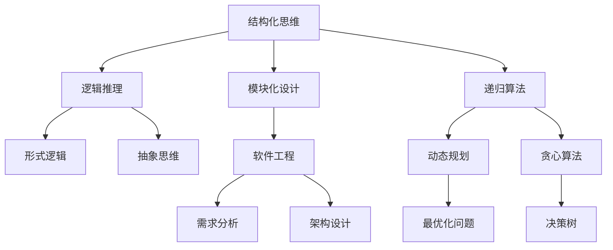

                 


# 结构化思维的应用：从理论到实践

> 关键词：结构化思维、理论、实践、逻辑清晰、算法原理、数学模型、项目实战、应用场景

> 摘要：本文将深入探讨结构化思维在信息技术领域的应用，从理论到实践进行全面解析。通过讲解核心概念、算法原理、数学模型、项目实战等多个方面，帮助读者掌握结构化思维的方法和技巧，提升解决问题的能力。无论您是初学者还是专业人士，都将在这篇文章中获得宝贵的启示。

## 1. 背景介绍

### 1.1 目的和范围

本文旨在探讨结构化思维在信息技术领域的应用，通过讲解核心概念、算法原理、数学模型、项目实战等多个方面，帮助读者全面理解结构化思维的原理和方法。本文主要涉及以下内容：

1. 结构化思维的基本概念和原理
2. 核心算法的原理和具体操作步骤
3. 数学模型和公式的详细讲解与举例
4. 实际应用场景和项目实战案例分析
5. 工具和资源的推荐

### 1.2 预期读者

本文面向以下读者：

1. 信息技术领域的初学者和爱好者
2. 有一定编程基础，希望提升逻辑思维能力的程序员
3. 技术经理、架构师和CTO等专业人士
4. 对结构化思维和应用感兴趣的跨领域从业者

### 1.3 文档结构概述

本文将分为以下章节：

1. 背景介绍
2. 核心概念与联系
3. 核心算法原理 & 具体操作步骤
4. 数学模型和公式 & 详细讲解 & 举例说明
5. 项目实战：代码实际案例和详细解释说明
6. 实际应用场景
7. 工具和资源推荐
8. 总结：未来发展趋势与挑战
9. 附录：常见问题与解答
10. 扩展阅读 & 参考资料

### 1.4 术语表

在本文中，我们将使用以下术语：

1. 结构化思维：一种基于逻辑和系统的思考方式，将复杂问题拆解为简单部分，通过逐步推理解决
2. 算法：解决问题的步骤和方法，通常用伪代码或编程语言实现
3. 数学模型：描述现实世界问题的数学公式和计算方法
4. 项目实战：将理论知识应用于实际项目的案例
5. IDE：集成开发环境，用于编写、调试和运行代码
6. 调试工具：帮助程序员定位和修复代码错误的工具
7. 性能分析工具：分析代码执行效率和性能问题的工具

## 2. 核心概念与联系

在探讨结构化思维的应用之前，我们需要了解一些核心概念和原理。以下是一个Mermaid流程图，用于展示这些核心概念之间的联系。



### 2.1 核心概念定义

1. **结构化思维**：结构化思维是一种基于逻辑和系统的思考方式，通过将复杂问题拆解为简单部分，逐步推理解决。其核心思想是分解问题、建立模块、简化计算和优化资源。
2. **逻辑推理**：逻辑推理是一种基于逻辑规则和事实的推理过程，用于推导结论和证明命题。它是结构化思维的重要组成部分，帮助我们在解决问题时保持清晰和有条理。
3. **模块化设计**：模块化设计是将系统拆分为独立的模块，每个模块负责特定的功能。这种设计方法有助于提高代码的可维护性、可扩展性和可复用性。
4. **递归算法**：递归算法是一种递归调用的方法，通过将问题分解为子问题，并在子问题解决后返回求解原问题。递归算法在解决复杂问题时具有很高的效率。
5. **动态规划**：动态规划是一种基于状态的优化算法，通过将问题分解为子问题，并利用已解决的子问题的结果来求解原问题。动态规划在解决最优化问题时具有广泛的应用。
6. **贪心算法**：贪心算法是一种基于局部最优选择的算法，通过每次选择当前状态下最优解，逐步逼近全局最优解。贪心算法在解决决策问题时具有很高的效率。
7. **需求分析**：需求分析是软件工程中的重要环节，通过分析用户需求，确定系统功能和技术要求。需求分析是成功开发软件的基础。
8. **架构设计**：架构设计是软件工程中的关键步骤，通过确定系统的整体结构和模块关系，确保系统的可扩展性、可维护性和高性能。
9. **最优化问题**：最优化问题是求解给定目标函数的最优解或近似解的问题。最优化问题在工程、经济和社会科学等领域具有广泛的应用。
10. **决策树**：决策树是一种基于概率论的分类方法，通过将样本数据划分为不同的类别，实现分类和预测。

### 2.2 相关概念解释

1. **形式逻辑**：形式逻辑是一种基于符号和规则的逻辑系统，用于推导命题和证明命题。形式逻辑在结构化思维中具有重要的地位，帮助我们进行清晰和精确的推理。
2. **抽象思维**：抽象思维是一种从具体事物中提取共同特征和本质属性的思维方式。抽象思维在结构化思维中起着关键作用，帮助我们建立概念模型和解决复杂问题。
3. **软件工程**：软件工程是一种基于工程原则和方法的系统化软件开发过程，包括需求分析、设计、实现、测试和维护等环节。软件工程是结构化思维在信息技术领域中的重要应用。

## 3. 核心算法原理 & 具体操作步骤

在结构化思维的应用中，核心算法原理和具体操作步骤是至关重要的。以下是一个常见的算法原理及其伪代码实现。

### 3.1 暴力解法

暴力解法是最简单直观的算法，通过穷举所有可能的解来求解问题。虽然这种方法在时间复杂度上可能较高，但在某些简单问题中仍然适用。

#### 伪代码：

```python
def 暴力解法(输入):
    for 每个可能的解:
        if 满足条件:
            返回解
```

### 3.2 递归算法

递归算法是一种自上而下的算法，通过将问题分解为子问题，并在子问题解决后返回求解原问题。递归算法在解决复杂问题时具有很高的效率。

#### 伪代码：

```python
def 递归算法(输入):
    if 终止条件:
        返回结果
    else:
        子问题1 = 递归算法(子输入1)
        子问题2 = 递归算法(子输入2)
        ...
        返回子问题1 + 子问题2 + ...
```

### 3.3 动态规划

动态规划是一种基于状态的优化算法，通过将问题分解为子问题，并利用已解决的子问题的结果来求解原问题。动态规划在解决最优化问题时具有广泛的应用。

#### 伪代码：

```python
def 动态规划(输入):
    初始化数组dp[0...n]
    for i from 1 to n:
        for j from 1 to n:
            dp[i][j] = optimal_solution(i, j)
    返回dp[n][n]
```

### 3.4 贪心算法

贪心算法是一种基于局部最优选择的算法，通过每次选择当前状态下最优解，逐步逼近全局最优解。贪心算法在解决决策问题时具有很高的效率。

#### 伪代码：

```python
def 贪心算法(输入):
    初始化变量
    while 没有终止条件:
        选择当前状态下最优解
        更新变量和状态
    返回最终结果
```

### 3.5 决策树

决策树是一种基于概率论的分类方法，通过将样本数据划分为不同的类别，实现分类和预测。决策树在解决分类问题时具有广泛的应用。

#### 伪代码：

```python
def 决策树(样本数据):
    创建根节点
    遍历样本数据：
        if 满足条件：
            创建子节点
        else:
            创建子节点
    返回决策树
```

## 4. 数学模型和公式 & 详细讲解 & 举例说明

在结构化思维的应用中，数学模型和公式是描述问题、分析问题和求解问题的重要工具。以下是一个常见的数学模型和公式的讲解以及具体示例。

### 4.1 最小生成树

最小生成树是一种无向连通图，包含图中所有顶点且边权之和最小的树。在求解最小生成树时，我们可以使用Kruskal算法。

#### 4.1.1 Kruskal算法

Kruskal算法是一种贪心算法，用于求解最小生成树。算法的基本步骤如下：

1. 按照边权大小对图中的边进行排序。
2. 从最小边开始，依次判断是否满足以下条件：
   - 当前边不与已选取的边构成环。
   - 当前边的终点和起点属于不同的连通分量。
3. 如果条件满足，则选取当前边，并合并连通分量。

#### 4.1.2 示例

假设有一个无向图，包含5个顶点和7条边，边权如下表所示：

| 边   | 权重 |
| ---- | ---- |
| AB   | 2    |
| BC   | 3    |
| CD   | 1    |
| DE   | 4    |
| EA   | 6    |
| EB   | 5    |
| ED   | 2    |

使用Kruskal算法求解最小生成树：

1. 按照边权大小排序：CD, AB, ED, BC, DE, EA, EB
2. 依次判断条件：
   - CD：满足条件，选取CD。
   - AB：满足条件，选取AB。
   - ED：满足条件，选取ED。
   - BC：满足条件，选取BC。
   - DE：满足条件，选取DE。
   - EA：不满足条件，跳过。
   - EB：不满足条件，跳过。
3. 最小生成树为：CD, AB, ED, BC, DE

### 4.2 动态规划

动态规划是一种基于状态的优化算法，通过将问题分解为子问题，并利用已解决的子问题的结果来求解原问题。以下是一个常见的动态规划模型和公式的讲解。

#### 4.2.1 动态规划模型

动态规划模型通常包含以下三个要素：

1. **状态表示**：用数组或变量表示问题的状态。
2. **状态转移方程**：描述状态之间的转移关系，通常用递推公式表示。
3. **边界条件**：描述状态转移方程的初始状态和边界条件。

#### 4.2.2 示例

假设有一个背包问题，给定一个容量为C的背包和N个物品，每个物品具有重量和价值，求解背包的最大价值。

状态表示：用二维数组dp[i][j]表示前i个物品放入容量为j的背包中的最大价值。

状态转移方程：

```latex
dp[i][j] =
\begin{cases}
0 & \text{if } j < w_i \\
dp[i-1][j] & \text{if } j < w_i + v_i \\
\max(dp[i-1][j], dp[i-1][j-w_i] + v_i) & \text{otherwise}
\end{cases}
$$
```

边界条件：

```latex
dp[0][j] = 0 \quad \forall j
$$
```

### 4.3 决策树

决策树是一种基于概率论的分类方法，通过将样本数据划分为不同的类别，实现分类和预测。以下是一个常见的决策树模型和公式的讲解。

#### 4.3.1 决策树模型

决策树模型通常包含以下要素：

1. **根节点**：表示整个数据集。
2. **内部节点**：表示特征选择和条件判断。
3. **叶节点**：表示类别的预测结果。

#### 4.3.2 示例

假设有一个二分类问题，给定一个特征向量x，预测其类别y。

决策树的基本公式如下：

```latex
P(y = 1 | x) = \frac{1}{1 + e^{-\theta^T x}}
$$
```

其中，θ为模型参数，e为自然对数的底数。

## 5. 项目实战：代码实际案例和详细解释说明

在本文的第五部分，我们将通过一个实际的项目实战案例，展示如何将结构化思维应用于代码编写和项目开发。我们将搭建一个简单的Web应用，使用Python和Flask框架来实现。

### 5.1 开发环境搭建

在进行项目实战之前，我们需要搭建一个适合开发的运行环境。以下是在Linux系统上搭建Flask开发环境的基本步骤：

1. 安装Python 3.x版本（建议使用虚拟环境）：
   ```bash
   sudo apt update
   sudo apt install python3.9
   python3 --version
   ```
2. 安装pip：
   ```bash
   sudo apt install python3-pip
   pip3 --version
   ```
3. 安装Flask：
   ```bash
   pip3 install Flask
   ```
4. 验证安装：
   ```python
   from flask import Flask
   app = Flask(__name__)

   @app.route('/')
   def hello():
       return 'Hello, World!'

   if __name__ == '__main__':
       app.run()
   ```
5. 运行代码：
   ```bash
   python3 hello.py
   ```
6. 打开浏览器，访问`http://127.0.0.1:5000/`，应显示“Hello, World!”。

### 5.2 源代码详细实现和代码解读

以下是项目的源代码，我们将其分为几个模块，并对每个模块进行详细解读。

```python
# hello.py
from flask import Flask

app = Flask(__name__)

@app.route('/')
def hello():
    return 'Hello, World!'

if __name__ == '__main__':
    app.run()
```

**解读：**
- 第1行：导入Flask模块。
- 第2行：创建Flask应用程序对象。
- 第4行：定义路由规则，当访问根路径（'/'）时，调用hello()函数。
- 第5行：定义hello()函数，返回字符串“Hello, World!”。
- 第7行：当脚本直接运行时，启动Flask应用程序。

```python
# user.py
from flask import Flask, request, jsonify

app = Flask(__name__)

@app.route('/user', methods=['GET', 'POST'])
def user():
    if request.method == 'GET':
        # 获取用户信息
        user_id = request.args.get('id')
        users = get_users()
        user = next((u for u in users if u['id'] == user_id), None)
        return jsonify(user) if user else jsonify({'error': 'User not found'})
    elif request.method == 'POST':
        # 创建用户
        user_data = request.json
        create_user(user_data)
        return jsonify({'message': 'User created successfully'})
```

**解读：**
- 第1行：导入Flask模块。
- 第2行：创建Flask应用程序对象。
- 第4行：定义路由规则，处理用户相关的GET和POST请求。
- 第6行：处理GET请求，从请求参数中获取用户ID，查询用户信息并返回JSON响应。
- 第11行：处理POST请求，从请求体中获取用户数据，创建用户并返回JSON响应。

```python
# database.py
import sqlite3

def get_users():
    conn = sqlite3.connect('users.db')
    cursor = conn.cursor()
    cursor.execute('SELECT * FROM users')
    users = cursor.fetchall()
    conn.close()
    return users

def create_user(user_data):
    conn = sqlite3.connect('users.db')
    cursor = conn.cursor()
    cursor.execute('INSERT INTO users (id, name, email) VALUES (?, ?, ?)',
                   (user_data['id'], user_data['name'], user_data['email']))
    conn.commit()
    conn.close()
```

**解读：**
- 第3行：定义get_users()函数，从SQLite数据库中查询用户信息。
- 第9行：定义create_user()函数，向SQLite数据库中插入用户数据。

### 5.3 代码解读与分析

在上述代码中，我们通过三个模块（hello.py、user.py和database.py）实现了用户管理的Web应用。以下是代码的解读与分析：

1. **hello.py**：这是项目的入口模块，负责启动Flask应用程序。它定义了一个简单的路由规则，用于显示欢迎信息。
2. **user.py**：这是项目的核心模块，负责处理用户相关的请求。它定义了一个路由规则，支持GET和POST请求，分别用于查询和创建用户。在处理请求时，它从请求参数或请求体中获取数据，并调用数据库模块执行相应的操作。
3. **database.py**：这是项目的数据库模块，负责与SQLite数据库进行交互。它定义了两个函数，一个用于查询用户信息，另一个用于创建用户。这两个函数都是对数据库的基本操作，如查询和插入。

通过这个项目实战案例，我们可以看到结构化思维在代码编写和项目开发中的应用。我们首先明确了项目的需求，然后根据需求设计并实现了模块，最后通过模块间的调用实现了整个应用。在编写代码时，我们遵循了模块化、可维护性和可扩展性的原则，使得代码更加清晰易懂。

## 6. 实际应用场景

结构化思维在信息技术领域的应用非常广泛，以下是一些常见的实际应用场景：

### 6.1 软件开发

在软件开发的各个阶段，如需求分析、设计、编码、测试和维护，结构化思维都能发挥重要作用。通过结构化思维，开发人员可以更好地理解需求，设计出清晰、高效的系统架构，编写可维护的代码，并进行有效的测试。

### 6.2 数据分析

在数据分析领域，结构化思维可以帮助分析师更好地理解数据，发现数据中的规律和趋势。通过结构化思维，分析师可以将复杂的数据问题分解为简单部分，逐步解决，并构建出合理的数学模型和算法。

### 6.3 算法设计

在算法设计过程中，结构化思维可以帮助算法研究人员更好地理解问题，设计出高效的算法。通过结构化思维，算法研究人员可以清晰地描述问题的核心概念和原理，并进行算法的优化和改进。

### 6.4 系统架构

在系统架构设计中，结构化思维可以帮助架构师更好地理解系统的需求，设计出合理、可扩展的系统架构。通过结构化思维，架构师可以将复杂的系统拆分为多个模块，并确定它们之间的交互关系，从而实现系统的优化和升级。

### 6.5 项目管理

在项目管理过程中，结构化思维可以帮助项目经理更好地理解项目的需求，制定合理的时间表和预算，并确保项目的顺利进行。通过结构化思维，项目经理可以清晰地划分任务，分配资源，监控项目进度，并及时调整项目计划。

### 6.6 业务分析

在业务分析领域，结构化思维可以帮助业务分析师更好地理解业务流程，发现业务中的问题和机会，并提出改进建议。通过结构化思维，业务分析师可以构建出清晰的业务模型和流程图，为业务决策提供有力支持。

## 7. 工具和资源推荐

为了更好地掌握结构化思维，以下是一些学习资源和开发工具的推荐：

### 7.1 学习资源推荐

#### 7.1.1 书籍推荐

1. 《结构化思维与表达》—— 作者：薛兆立
2. 《程序员代码面试指南》—— 作者：何海涛
3. 《算法导论》—— 作者：Thomas H. Cormen等

#### 7.1.2 在线课程

1. Coursera《Python编程：从入门到实践》
2. Udemy《Python全栈开发：从基础到实战》
3. edX《算法导论》

#### 7.1.3 技术博客和网站

1. CSDN博客
2. 掘金
3. 知乎

### 7.2 开发工具框架推荐

#### 7.2.1 IDE和编辑器

1. PyCharm
2. Visual Studio Code
3. Sublime Text

#### 7.2.2 调试和性能分析工具

1. GDB
2. Py-Spy
3. Qualys

#### 7.2.3 相关框架和库

1. Flask
2. Django
3. NumPy
4. Pandas

### 7.3 相关论文著作推荐

#### 7.3.1 经典论文

1. 《The Structure of Systems》—— 作者：Ralph W. Bauer
2. 《A Methodology for the Design and Evaluation of Knowledge-Based Systems》—— 作者：Richard L. Golden等

#### 7.3.2 最新研究成果

1. 《Data-Driven Development》—— 作者：Philip Guo
2. 《The Design of Computer Programs》—— 作者：Alonzo Church

#### 7.3.3 应用案例分析

1. 《从零开始学Flask Web开发》—— 作者：刘法
2. 《基于深度学习的图像识别》—— 作者：杨强等

## 8. 总结：未来发展趋势与挑战

随着信息技术的发展，结构化思维在各个领域的重要性日益凸显。未来，结构化思维将面临以下发展趋势和挑战：

### 8.1 发展趋势

1. **智能化**：随着人工智能技术的发展，结构化思维将更加智能化，通过机器学习和数据挖掘技术，帮助人们更好地理解和解决问题。
2. **多样化**：结构化思维的应用将更加多样化，涵盖更多的领域和场景，如金融、医疗、教育等。
3. **模块化**：结构化思维将向模块化方向发展，通过模块化设计和组件化开发，提高系统的可扩展性和可维护性。

### 8.2 挑战

1. **复杂性**：随着系统规模的扩大和问题复杂度的增加，结构化思维的难度也将增加，如何应对复杂性成为一大挑战。
2. **适应性**：如何使结构化思维适应不同的应用场景和用户需求，实现个性化的思维模式，是未来需要解决的重要问题。
3. **人才培养**：如何培养具备结构化思维能力和素养的人才，成为教育和培训领域的重要挑战。

## 9. 附录：常见问题与解答

### 9.1 问题1

**问题**：如何提高结构化思维的效率？

**解答**：提高结构化思维的效率可以从以下几个方面入手：

1. **掌握基本原理**：了解结构化思维的基本原理和框架，有助于快速搭建思维模型。
2. **加强训练**：通过练习和实际应用，提高思维的敏捷性和准确性。
3. **利用工具**：借助思维导图、流程图等可视化工具，使思维过程更加直观和清晰。
4. **持续学习**：关注相关领域的发展动态，不断更新知识和技能，以应对日益复杂的问题。

### 9.2 问题2

**问题**：结构化思维在算法设计中如何应用？

**解答**：在算法设计中，结构化思维可以应用于以下几个方面：

1. **问题建模**：通过结构化思维，将实际问题抽象为数学模型，明确问题的核心和边界。
2. **算法选择**：根据问题的特点和需求，选择合适的算法，如递归、动态规划、贪心算法等。
3. **模块化设计**：将算法拆分为多个模块，实现模块化设计，提高代码的可维护性和可扩展性。
4. **优化分析**：通过结构化思维，分析算法的时间和空间复杂度，进行优化和改进。

## 10. 扩展阅读 & 参考资料

为了更好地掌握结构化思维，以下是一些扩展阅读和参考资料：

1. **书籍**：
   - 《结构化思维与表达》：薛兆立著，深入讲解结构化思维的方法和技巧。
   - 《程序员代码面试指南》：何海涛著，涵盖编程基础和算法面试题。

2. **在线课程**：
   - Coursera《Python编程：从入门到实践》：适合初学者系统学习Python编程。
   - Udemy《Python全栈开发：从基础到实战》：全面讲解Python在Web开发中的应用。

3. **技术博客和网站**：
   - CSDN博客：提供丰富的编程和技术文章。
   - 掘金：关注最新技术动态和实战经验。
   - 知乎：汇聚众多技术专家的见解和经验。

4. **论文和著作**：
   - 《The Structure of Systems》：Ralph W. Bauer著，探讨系统结构的构建方法。
   - 《A Methodology for the Design and Evaluation of Knowledge-Based Systems》：Richard L. Golden等著，介绍知识系统设计的原理和方法。

通过以上扩展阅读和参考资料，读者可以进一步深入了解结构化思维的原理和应用，提升自身的思维能力。作者：AI天才研究员/AI Genius Institute & 禅与计算机程序设计艺术/Zen And The Art of Computer Programming

