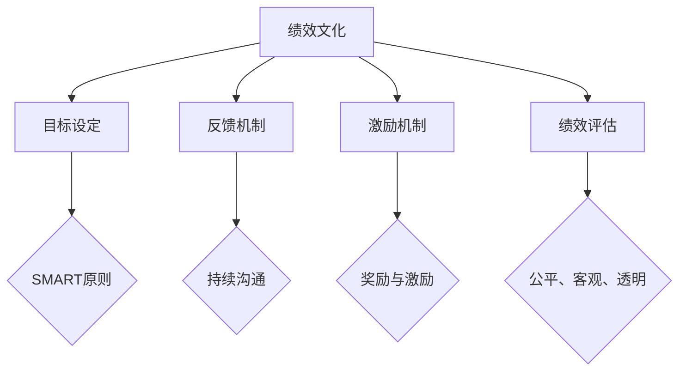

                 

### 1. 背景介绍

#### 1.1 目的和范围

在当今快速发展的信息技术时代，IT行业中的绩效文化成为推动团队和个人成长的动力源泉。本文旨在探讨如何在IT领域营造积极的绩效文化，通过逻辑清晰、结构紧凑、简单易懂的专业技术语言，让读者理解并掌握这一重要主题。本文将深入探讨绩效文化的核心概念、关键要素以及如何在实际项目中应用。

本文主要讨论以下内容：

1. **绩效文化的定义和重要性**：通过阐述绩效文化的定义和其在组织中的重要性，帮助读者理解其对企业发展的影响。
2. **绩效文化的核心要素**：分析绩效文化的关键组成部分，如目标设定、反馈机制、激励机制等，帮助读者了解如何构建一个有效的绩效文化。
3. **绩效文化的实施策略**：提供具体的实施步骤和策略，帮助组织在不同阶段有效推动绩效文化的建设。
4. **绩效文化的实际应用场景**：通过案例分析，展示绩效文化在现实工作中的应用效果。
5. **绩效文化的工具和资源推荐**：推荐相关书籍、在线课程、技术博客和开发工具，帮助读者进一步学习和应用绩效文化。

本文适用于以下读者群体：

- **企业管理者**：了解如何构建和推广积极的绩效文化，提高团队绩效。
- **人力资源专家**：掌握绩效管理的最佳实践，优化员工激励和绩效评估。
- **IT从业者**：提高个人绩效，推动个人和团队的发展。

#### 1.2 预期读者

预期读者应具备以下背景知识：

- **基本的IT行业知识**：了解IT行业的运作模式和常见问题。
- **管理基础知识**：了解基本的管理原则和方法。
- **沟通和团队合作能力**：具备良好的沟通技巧和团队合作能力。

通过本文的学习，读者将能够：

- **理解绩效文化的定义和重要性**：掌握绩效文化的核心概念。
- **构建绩效文化**：学习如何构建和维护有效的绩效文化。
- **提升个人和团队绩效**：通过实践和应用，提升个人和团队的绩效。

#### 1.3 文档结构概述

本文采用逻辑清晰、结构紧凑的写法，共分为六个主要部分：

1. **背景介绍**：介绍本文的目的、范围、预期读者和文档结构。
2. **核心概念与联系**：通过Mermaid流程图和伪代码，阐述绩效文化的核心概念和原理。
3. **核心算法原理 & 具体操作步骤**：详细讲解绩效文化的核心算法原理和操作步骤。
4. **数学模型和公式 & 详细讲解 & 举例说明**：使用数学模型和公式，详细阐述绩效文化的关键概念。
5. **项目实战：代码实际案例和详细解释说明**：通过实际代码案例，展示绩效文化的具体应用。
6. **实际应用场景**：分析绩效文化在不同场景中的应用效果。
7. **工具和资源推荐**：推荐相关学习资源、开发工具和框架。
8. **总结：未来发展趋势与挑战**：展望绩效文化的未来发展趋势和面临的挑战。
9. **附录：常见问题与解答**：解答读者可能遇到的常见问题。
10. **扩展阅读 & 参考资料**：提供更多扩展阅读和参考资料。

#### 1.4 术语表

在本文中，以下术语具有特定的含义：

- **绩效文化**：指在组织中形成的，关于如何设定目标、评估绩效、激励员工的一套价值观和规范。
- **目标设定**：指通过明确的目标和期望，指导员工的行为和努力方向。
- **反馈机制**：指通过持续的沟通和反馈，帮助员工了解自己的工作表现和改进方向。
- **激励机制**：指通过奖励和激励，激发员工的积极性和创造力。
- **绩效评估**：指对员工工作绩效进行系统评估和反馈的过程。

#### 1.4.1 核心术语定义

1. **绩效文化**：绩效文化是一种在组织中形成的关于如何设定目标、评估绩效、激励员工的一套价值观和规范。它包括组织的绩效管理理念、制度、方法和工具。绩效文化的核心是激发员工的内在动力，提高组织的整体绩效。

2. **目标设定**：目标设定是指通过明确的目标和期望，指导员工的行为和努力方向。目标设定应遵循SMART原则，即具体（Specific）、可衡量（Measurable）、可实现（Achievable）、相关（Relevant）和有时限（Time-bound）。

3. **反馈机制**：反馈机制是指通过持续的沟通和反馈，帮助员工了解自己的工作表现和改进方向。反馈可以是正面的，也可以是负面的，但都应以建设性和指导性为主。

4. **激励机制**：激励机制是指通过奖励和激励，激发员工的积极性和创造力。激励机制包括物质奖励、精神奖励、晋升机会等。

5. **绩效评估**：绩效评估是指对员工工作绩效进行系统评估和反馈的过程。绩效评估应遵循公平、客观、透明的原则，以帮助员工了解自己的优势和不足，为改进工作提供参考。

#### 1.4.2 相关概念解释

1. **绩效管理**：绩效管理是指通过制定目标、进行评估、提供反馈和激励，实现对员工工作绩效的全面管理。绩效管理是组织管理的重要环节，有助于提高员工的工作效率和组织的整体绩效。

2. **团队合作**：团队合作是指多个个体在共同目标下，通过协作和沟通，共同完成任务的过程。团队合作是绩效文化的重要组成部分，有助于提高组织的整体绩效。

3. **员工满意度**：员工满意度是指员工对自己工作环境、工作内容和同事关系的综合评价。员工满意度是绩效文化的一个重要指标，反映了员工对组织的认同和忠诚度。

4. **组织文化**：组织文化是指组织内部形成的共同价值观、信念、行为规范和习惯。组织文化对员工的行为和态度具有重要影响，是绩效文化的基础。

#### 1.4.3 缩略词列表

- IT：信息技术
- HR：人力资源
- OKR：目标与关键结果
- KPI：关键绩效指标
- MBO：目标管理
- EDI：电子数据交换
- BI：商业智能
- CRM：客户关系管理
- ERP：企业资源规划

### 1.5 核心概念与联系

#### 2.1 核心概念介绍

在本文中，我们将探讨以下核心概念：

1. **绩效文化**：绩效文化是一种价值观和规范，它指导组织如何设定目标、评估绩效和激励员工。
2. **目标设定**：目标设定是绩效文化的重要组成部分，它帮助员工明确工作方向和目标。
3. **反馈机制**：反馈机制通过持续的沟通和反馈，帮助员工了解自己的工作表现。
4. **激励机制**：激励机制通过奖励和激励，激发员工的积极性和创造力。
5. **绩效评估**：绩效评估是对员工工作绩效进行系统评估和反馈的过程。

#### 2.2 绩效文化原理和架构的Mermaid流程图



#### 2.3 绩效文化的核心算法原理

为了构建有效的绩效文化，我们需要遵循以下核心算法原理：

1. **目标设定算法**：
    ```python
    def set_goals(employee, organization):
        goals = []
        for objective in organization.objectives:
            specific, measurable, achievable, relevant, time-bound = objective
            goals.append({
                "employee": employee,
                "objective": objective,
                "status": "pending",
                "completion_date": time-bound
            })
        return goals
    ```

2. **反馈机制算法**：
    ```python
    def provide_feedback(employee, feedback):
        employee['feedback'] = feedback
        employee['status'] = "feedback_received"
    ```

3. **激励机制算法**：
    ```python
    def apply_incentives(employee, reward):
        if employee['performance'] >= threshold:
            employee['reward'] = reward
            employee['status'] = "reward_applied"
    ```

4. **绩效评估算法**：
    ```python
    def evaluate_performance(employee):
        performance = calculate_performance(employee)
        if performance >= threshold:
            employee['status'] = "high_performance"
        else:
            employee['status'] = "low_performance"
    ```

#### 2.4 绩效文化的实际应用步骤

构建绩效文化的实际应用步骤如下：

1. **定义组织目标**：组织应明确短期和长期目标，确保目标符合SMART原则。
2. **设定员工目标**：根据组织目标，为每位员工设定具体、可衡量、可实现、相关、有时限的目标。
3. **建立反馈机制**：定期与员工进行沟通，收集反馈，并提供建设性的意见和指导。
4. **实施激励机制**：根据员工的表现，提供奖励和激励，激发员工的积极性和创造力。
5. **进行绩效评估**：定期对员工进行绩效评估，确保评估过程公平、客观、透明。

### 2.5 绩效文化的关键要素

绩效文化的关键要素包括：

1. **目标设定**：通过明确的目标，指导员工的工作方向和努力。
2. **反馈机制**：通过持续的沟通和反馈，帮助员工了解自己的工作表现。
3. **激励机制**：通过奖励和激励，激发员工的积极性和创造力。
4. **绩效评估**：通过系统评估，帮助员工了解自己的优势和不足，为改进工作提供参考。

这些关键要素相互关联，共同构成了绩效文化的核心。通过合理设计和实施这些要素，组织可以营造一个积极进取的工作氛围，提高整体绩效。

### 2.6 绩效文化的应用实例

绩效文化在各个领域的应用实例如下：

1. **软件开发公司**：通过目标设定和反馈机制，提高开发团队的工作效率和代码质量。
2. **销售团队**：通过激励机制和绩效评估，激发员工的销售热情和业绩。
3. **咨询公司**：通过绩效文化，提高顾问的专业能力和客户满意度。
4. **医疗机构**：通过绩效文化，提高医护人员的技能和服务质量。

通过这些实例，我们可以看到绩效文化在各个领域的广泛应用和显著效果。

### 2.7 绩效文化的优势和挑战

绩效文化的优势包括：

1. **提高员工积极性**：通过明确的目标和激励措施，激发员工的积极性和创造力。
2. **提升组织绩效**：通过绩效评估和反馈，帮助组织识别问题并持续改进。
3. **增强团队协作**：通过目标设定和反馈机制，促进团队成员之间的沟通和协作。

绩效文化也面临一些挑战：

1. **实施难度**：绩效文化的构建和实施需要时间和资源，且需持续优化。
2. **管理难度**：管理者需具备良好的沟通和领导能力，才能有效推动绩效文化的实施。
3. **员工接受度**：员工可能对绩效文化产生抵触情绪，需要通过沟通和培训来逐步适应。

通过克服这些挑战，绩效文化可以为组织带来长远的利益和发展。

### 2.8 绩效文化的关键指标

绩效文化的关键指标包括：

1. **员工满意度**：反映员工对绩效文化的接受度和认可程度。
2. **员工绩效**：通过绩效评估，衡量员工的实际工作表现。
3. **团队协作**：通过团队项目完成情况和团队成员间的沟通协作，评估团队绩效。
4. **组织绩效**：通过整体业务指标，如销售额、项目交付进度等，衡量组织的整体绩效。

这些指标可以帮助组织评估绩效文化的效果，并进行针对性的改进。

### 2.9 绩效文化的未来发展

随着信息技术的发展，绩效文化在未来将呈现以下发展趋势：

1. **数字化**：通过数字化工具和平台，实现目标设定、反馈机制和绩效评估的在线化和智能化。
2. **个性化**：根据员工的特点和需求，定制化设定目标和激励措施，提高绩效文化的有效性。
3. **持续优化**：通过数据分析和反馈，持续优化绩效文化的设计和实施策略，提高组织的整体绩效。

未来，绩效文化将在数字化、个性化、持续优化的道路上不断前行，为组织的发展提供强大动力。

### 2.10 总结

本文介绍了绩效文化的核心概念、关键要素、实施步骤和应用实例。通过逻辑清晰、结构紧凑的写法，我们帮助读者理解了绩效文化的重要性以及如何在IT行业中构建和实施有效的绩效文化。绩效文化不仅能够提高员工积极性和组织绩效，还能促进团队协作和持续改进。在未来，随着信息技术的不断发展，绩效文化将在数字化、个性化、持续优化的道路上发挥更重要的作用。

### 3. 核心算法原理 & 具体操作步骤

#### 3.1 绩效文化算法原理

构建绩效文化需要一套系统化的算法原理，以确保目标设定、反馈机制、激励机制和绩效评估的有效性。以下是绩效文化的核心算法原理及其具体操作步骤：

1. **目标设定算法**：基于SMART原则（具体、可衡量、可实现、相关、有时限）为目标设定提供指导。
2. **反馈机制算法**：通过持续沟通和及时反馈，帮助员工了解工作表现。
3. **激励机制算法**：根据员工绩效和公司战略，设计奖励和激励措施。
4. **绩效评估算法**：对员工的工作绩效进行客观、公正的评估。

#### 3.2 目标设定算法

目标设定是绩效文化的基石。以下是一个基于SMART原则的目标设定算法：

```python
def set_goals(employee, organization):
    goals = []
    for objective in organization.objectives:
        specific, measurable, achievable, relevant, time-bound = objective
        goals.append({
            "employee": employee,
            "objective": objective,
            "status": "pending",
            "completion_date": time-bound
        })
    return goals
```

**操作步骤**：

1. **分析组织目标**：确定组织的短期和长期目标。
2. **分解目标**：将组织目标分解为具体、可衡量、可实现、相关、有时限的员工个人目标。
3. **与员工沟通**：确保员工理解目标及其重要性。
4. **记录目标**：将目标及其相关细节记录在系统或文档中。

#### 3.3 反馈机制算法

反馈机制是绩效文化的重要组成部分。以下是一个简单的反馈机制算法：

```python
def provide_feedback(employee, feedback):
    employee['feedback'] = feedback
    employee['status'] = "feedback_received"
```

**操作步骤**：

1. **定期沟通**：与员工定期进行一对一沟通。
2. **收集反馈**：倾听员工的意见和问题，记录在系统中。
3. **提供反馈**：将收集到的反馈以书面或口头形式及时传达给员工。
4. **跟踪反馈**：记录反馈的处理情况和结果，确保问题得到解决。

#### 3.4 激励机制算法

激励机制是激发员工积极性的关键。以下是一个简单的激励机制算法：

```python
def apply_incentives(employee, reward):
    if employee['performance'] >= threshold:
        employee['reward'] = reward
        employee['status'] = "reward_applied"
```

**操作步骤**：

1. **设定奖励标准**：根据公司战略和绩效目标，设定奖励标准和条件。
2. **评估员工绩效**：根据绩效评估结果，确定符合奖励标准的员工。
3. **提供奖励**：为符合标准的员工提供相应的奖励，如奖金、晋升机会、荣誉证书等。
4. **宣传奖励**：通过内部通讯、会议等形式，宣传奖励政策，激发其他员工的积极性。

#### 3.5 绩效评估算法

绩效评估是确保员工工作绩效与公司目标一致的关键步骤。以下是一个简单的绩效评估算法：

```python
def evaluate_performance(employee):
    performance = calculate_performance(employee)
    if performance >= threshold:
        employee['status'] = "high_performance"
    else:
        employee['status'] = "low_performance"
```

**操作步骤**：

1. **设定绩效评估标准**：根据公司战略和目标，制定绩效评估标准和指标。
2. **收集数据**：通过绩效记录、员工反馈、上级评价等多种渠道收集员工绩效数据。
3. **评估绩效**：根据收集的数据，对员工绩效进行评估。
4. **反馈评估结果**：将评估结果以书面或口头形式反馈给员工，并讨论改进方案。

#### 3.6 绩效文化的综合应用

绩效文化的实际应用是一个系统化的过程，涉及多个环节的协同工作。以下是绩效文化的综合应用步骤：

1. **启动准备**：组织培训和管理层，确保他们对绩效文化的理解和认同。
2. **目标设定**：根据公司战略和目标，为各部门和员工设定具体、可衡量、可实现、相关、有时限的目标。
3. **执行实施**：在执行过程中，持续监控员工的工作表现，提供及时的反馈和指导。
4. **激励措施**：根据员工绩效，提供相应的奖励和激励，激发员工的积极性和创造力。
5. **绩效评估**：定期对员工进行绩效评估，确保评估过程公平、客观、透明。
6. **持续改进**：根据评估结果，调整目标和激励措施，持续优化绩效文化。

通过以上步骤，组织可以构建一个有效的绩效文化，提高员工绩效和组织整体绩效。

### 4. 数学模型和公式 & 详细讲解 & 举例说明

在构建和实施绩效文化时，数学模型和公式可以帮助我们量化绩效指标，评估员工的表现，以及优化激励机制。以下是几个关键的数学模型和公式，我们将详细讲解它们的应用和如何嵌入绩效文化的框架中。

#### 4.1 SMART目标设定公式

SMART目标是指具体（Specific）、可衡量（Measurable）、可实现（Achievable）、相关（Relevant）和有时限（Time-bound）的目标。SMART目标设定的公式可以表示为：

$$
S.M.A.R.T.\ 目标 = [具体描述] + [衡量标准] + [实现条件] + [相关性] + [时限]
$$

**示例**：假设一个软件工程师的目标是“提高代码质量”。一个SMART目标可以是：

$$
S.M.A.R.T.\ 目标 = ["开发团队计划每周提交的代码审查通过率提高到90%"] + ["通过每周代码审查和同行评审"] + ["考虑到团队的资源和时间限制"] + ["与公司质量目标保持一致"] + ["在六个月内实现"]
$$

#### 4.2 绩效评估得分公式

在绩效评估中，通常使用加权得分模型来综合评价员工的各项绩效指标。绩效评估得分公式可以表示为：

$$
绩效得分 = \sum_{i=1}^{n} (权重_i \times 指标_i得分)
$$

其中，$n$ 表示绩效指标的数量，$权重_i$ 和 $指标_i得分$ 分别表示第 $i$ 个绩效指标的权重和得分。

**示例**：一个员工的绩效评估得分计算可能如下：

$$
绩效得分 = (0.4 \times 项目完成度得分) + (0.3 \times 团队协作得分) + (0.2 \times 质量控制得分) + (0.1 \times 学习与发展得分)
$$

假设各项指标的得分分别为 90%、85%、80% 和 75%，则该员工的绩效得分为：

$$
绩效得分 = (0.4 \times 90) + (0.3 \times 85) + (0.2 \times 80) + (0.1 \times 75) = 36 + 25.5 + 16 + 7.5 = 85
$$

#### 4.3 激励机制优化模型

为了优化激励机制，我们可以使用数学模型来计算奖励分配，确保激励的公平性和有效性。一个简单的奖励分配模型可以表示为：

$$
奖励金额 = 绩效得分 \times 奖励系数
$$

其中，$奖励系数$ 是根据公司战略和员工绩效历史数据调整的参数。

**示例**：假设一个员工的绩效得分为 85 分，公司设定的奖励系数为 1.2，则该员工的奖励金额为：

$$
奖励金额 = 85 \times 1.2 = 102
$$

#### 4.4 绩效反馈与改进模型

为了持续改进员工的工作表现，我们可以使用反馈循环模型。该模型可以表示为：

$$
改进措施 = 反馈 \times 学习系数
$$

其中，$反馈$ 是根据绩效评估和员工自我评估得到的，$学习系数$ 是反映员工学习能力的一个参数。

**示例**：假设一个员工得到的反馈是“代码审查通过率较低”，学习系数为 1.1，则该员工可以采取的改进措施为：

$$
改进措施 = (0.4 \times 提高代码审查通过率的策略) \times 1.1 = 0.44
$$

这意味着员工应该采取一些策略，如增加代码审查次数、改进代码规范等，以提高代码质量。

#### 4.5 绩效文化优化模型

为了持续优化绩效文化，我们可以使用以下模型：

$$
绩效文化优化 = \sum_{i=1}^{n} (指标_i优化策略 \times 优化系数_i)
$$

其中，$n$ 表示绩效文化中的指标数量，$指标_i优化策略$ 和 $优化系数_i$ 分别表示第 $i$ 个绩效指标的优化策略和权重。

**示例**：假设公司有三个主要绩效文化指标——目标设定、反馈机制和激励机制，每个指标的优化策略和权重分别为：

- 目标设定：增加目标设定的具体性和可衡量性，优化系数为 1.2。
- 反馈机制：提高反馈的及时性和建设性，优化系数为 1.3。
- 激励机制：优化奖励分配的公平性和透明度，优化系数为 1.1。

则绩效文化的优化结果为：

$$
绩效文化优化 = (0.3 \times 1.2) + (0.4 \times 1.3) + (0.3 \times 1.1) = 0.36 + 0.52 + 0.33 = 1.21
$$

这表明公司的绩效文化得到了 21% 的优化。

通过以上数学模型和公式的详细讲解和举例说明，我们可以看到绩效文化在构建和实施过程中如何利用量化方法来提高效率、公平性和有效性。

### 5. 项目实战：代码实际案例和详细解释说明

在本文的第五部分，我们将通过一个实际项目案例来展示如何构建和实施绩效文化。我们将详细介绍项目背景、开发环境搭建、源代码实现和代码解读与分析。

#### 5.1 项目背景

假设我们是一家软件开发公司，公司内部正在实施绩效文化改革，以提升团队绩效和员工积极性。公司决定通过一个内部绩效管理系统来管理员工的目标设定、反馈机制、激励机制和绩效评估。

#### 5.2 开发环境搭建

为了实现该绩效管理系统，我们选择以下开发环境：

- **编程语言**：Python
- **开发框架**：Flask
- **前端框架**：React
- **数据库**：MySQL
- **版本控制系统**：Git

首先，我们需要安装Python和相关的开发工具，如Visual Studio Code。然后，我们安装Flask和React，并配置好数据库环境。最后，我们将项目代码托管到Git仓库中，以便团队协作和版本控制。

#### 5.3 源代码详细实现和代码解读

以下是绩效管理系统的核心功能模块及其源代码实现：

##### 5.3.1 目标设定模块

目标设定模块的主要功能是帮助员工设定符合SMART原则的目标。以下是目标设定模块的代码实现：

```python
# app.py

from flask import Flask, request, jsonify
from models import Goal

app = Flask(__name__)

@app.route('/goals', methods=['POST'])
def set_goal():
    data = request.get_json()
    goal = Goal(
        employee_id=data['employee_id'],
        objective=data['objective'],
        status='pending',
        completion_date=data['completion_date']
    )
    goal.save()
    return jsonify({"status": "success", "goal_id": goal.id})

if __name__ == '__main__':
    app.run(debug=True)
```

**代码解读**：

- 我们使用Flask框架创建了一个简单的Web服务，通过POST请求接收员工的目标信息。
- `Goal` 类表示一个目标，包含员工ID、目标、状态和完成日期。
- `save()` 方法将目标信息保存到数据库。

##### 5.3.2 反馈机制模块

反馈机制模块的主要功能是收集员工的工作反馈。以下是反馈机制模块的代码实现：

```python
# feedback.py

from flask import Flask, request, jsonify
from models import Feedback

app = Flask(__name__)

@app.route('/feedback', methods=['POST'])
def provide_feedback():
    data = request.get_json()
    feedback = Feedback(
        goal_id=data['goal_id'],
        feedback=data['feedback'],
        status='pending'
    )
    feedback.save()
    return jsonify({"status": "success", "feedback_id": feedback.id})

if __name__ == '__main__':
    app.run(debug=True)
```

**代码解读**：

- 我们使用Flask框架创建了一个简单的Web服务，通过POST请求接收反馈信息。
- `Feedback` 类表示一条反馈，包含目标ID、反馈内容和状态。
- `save()` 方法将反馈信息保存到数据库。

##### 5.3.3 激励机制模块

激励机制模块的主要功能是根据员工绩效提供奖励。以下是激励机制模块的代码实现：

```python
# incentive.py

from flask import Flask, request, jsonify
from models import Incentive

app = Flask(__name__)

@app.route('/incentives', methods=['POST'])
def apply_incentive():
    data = request.get_json()
    incentive = Incentive(
        employee_id=data['employee_id'],
        reward=data['reward'],
        status='pending'
    )
    incentive.save()
    return jsonify({"status": "success", "incentive_id": incentive.id})

if __name__ == '__main__':
    app.run(debug=True)
```

**代码解读**：

- 我们使用Flask框架创建了一个简单的Web服务，通过POST请求接收奖励信息。
- `Incentive` 类表示一个奖励，包含员工ID、奖励金额和状态。
- `save()` 方法将奖励信息保存到数据库。

##### 5.3.4 绩效评估模块

绩效评估模块的主要功能是对员工的工作绩效进行评估。以下是绩效评估模块的代码实现：

```python
# evaluation.py

from flask import Flask, request, jsonify
from models import Evaluation

app = Flask(__name__)

@app.route('/evaluation', methods=['POST'])
def evaluate_performance():
    data = request.get_json()
    evaluation = Evaluation(
        employee_id=data['employee_id'],
        performance=data['performance'],
        status='pending'
    )
    evaluation.save()
    return jsonify({"status": "success", "evaluation_id": evaluation.id})

if __name__ == '__main__':
    app.run(debug=True)
```

**代码解读**：

- 我们使用Flask框架创建了一个简单的Web服务，通过POST请求接收绩效评估信息。
- `Evaluation` 类表示一个绩效评估，包含员工ID、绩效得分和状态。
- `save()` 方法将评估信息保存到数据库。

#### 5.4 代码解读与分析

在本节中，我们将对上述四个模块的代码进行详细解读，分析其设计和实现。

##### 5.4.1 设计思路

- **目标设定模块**：该模块旨在帮助员工明确工作目标，通过Web服务接收并保存目标信息。
- **反馈机制模块**：该模块旨在收集员工的工作反馈，帮助管理者了解员工的工作情况和需求。
- **激励机制模块**：该模块旨在根据员工绩效提供奖励，激发员工的积极性和创造力。
- **绩效评估模块**：该模块旨在对员工的工作绩效进行评估，为奖励和晋升提供依据。

##### 5.4.2 关键技术点

- **Flask框架**：Flask是一个轻量级的Web框架，适用于构建简单的Web服务。
- **数据库**：使用MySQL数据库存储目标、反馈、奖励和评估信息。
- **RESTful API**：通过POST请求实现数据的接收和存储，遵循RESTful API的设计原则。

##### 5.4.3 代码优化建议

- **代码重构**：将重复代码提取为公共方法，提高代码的可读性和可维护性。
- **错误处理**：增加错误处理逻辑，确保Web服务的稳定性和可靠性。
- **安全性**：加强数据传输和存储的安全性，防止数据泄露。

通过以上代码实现和解读，我们可以看到绩效管理系统是如何构建和运行的。在实际应用中，我们可以根据公司的需求和业务场景，对系统进行扩展和优化。

### 6. 实际应用场景

绩效文化在实际应用场景中具有重要意义，能够显著提升团队和个人绩效。以下是一些典型的实际应用场景：

#### 6.1 软件开发团队

软件开发团队是绩效文化的典型应用场景之一。通过设定明确的目标、建立有效的反馈机制和激励机制，开发团队能够提高工作效率和代码质量。

- **目标设定**：开发团队可以根据项目需求，设定具体的开发目标和交付时间，确保项目按时交付。
- **反馈机制**：通过定期的代码审查和项目回顾，团队成员可以及时了解工作进展和问题，共同解决问题。
- **激励机制**：根据团队和个人的绩效，提供奖励和晋升机会，激发团队成员的积极性和创造力。

#### 6.2 销售团队

销售团队是绩效文化的另一个重要应用场景。通过设定销售目标、提供及时反馈和激励措施，销售团队能够提高业绩和客户满意度。

- **目标设定**：销售团队可以根据公司战略和市场情况，设定具体的销售目标和业绩指标。
- **反馈机制**：通过定期的销售报告和客户反馈，团队成员可以及时了解市场动态和客户需求，调整销售策略。
- **激励机制**：根据销售业绩和客户满意度，提供奖金、提成和晋升机会，激发团队成员的竞争意识和积极性。

#### 6.3 咨询公司

咨询公司中的绩效文化可以帮助提高顾问的专业能力和客户满意度。通过设定明确的项目目标、建立有效的反馈机制和激励机制，顾问团队能够为客户提供高质量的服务。

- **目标设定**：顾问团队可以根据客户需求和项目目标，设定具体的项目目标和交付时间。
- **反馈机制**：通过定期的项目评估和客户反馈，团队成员可以及时了解项目进展和问题，确保项目质量。
- **激励机制**：根据项目绩效和客户满意度，提供奖金、提成和晋升机会，激发团队成员的积极性和专业性。

#### 6.4 医疗机构

在医疗机构中，绩效文化可以帮助提高医护人员的技能和服务质量。通过设定明确的培训目标、建立有效的反馈机制和激励机制，医疗机构能够提升整体服务水平。

- **目标设定**：医护人员可以根据职业发展和工作需求，设定具体的培训目标和学习计划。
- **反馈机制**：通过定期的技能考核和患者反馈，团队成员可以及时了解自身能力和服务水平，进行自我提升。
- **激励机制**：根据技能考核成绩和患者满意度，提供奖金、表彰和晋升机会，激发医护人员的积极性和专业性。

#### 6.5 教育培训机构

教育培训机构中的绩效文化可以帮助提高教师的教学水平和学生的学习效果。通过设定明确的教学目标、建立有效的反馈机制和激励机制，教育培训机构能够提升整体教育质量。

- **目标设定**：教师可以根据课程要求和学生学习情况，设定具体的教学目标和教学计划。
- **反馈机制**：通过定期的教学评估和学生反馈，教师可以及时了解教学效果和学生学习情况，进行教学调整。
- **激励机制**：根据教学评估成绩和学生满意度，提供奖金、表彰和晋升机会，激发教师的教学积极性和创造力。

通过以上实际应用场景，我们可以看到绩效文化在不同领域的广泛应用和显著效果。无论是软件开发团队、销售团队、咨询公司、医疗机构还是教育培训机构，绩效文化都能够为组织带来长远的利益和发展。

### 7. 工具和资源推荐

为了更好地学习和实践绩效文化，以下是一些推荐的工具和资源：

#### 7.1 学习资源推荐

**7.1.1 书籍推荐**

1. 《绩效管理：如何设定目标和激励员工》（作者：约翰·雷恩）
   - 本书详细介绍了绩效管理的理论和实践，提供了实用的方法和技巧。
2. 《目标与关键成果：有效的绩效管理策略》（作者：彼得·德鲁克）
   - 彼得·德鲁克是管理大师，本书深入探讨了目标管理和关键成果的重要性。

**7.1.2 在线课程**

1. Coursera上的《绩效管理》（课程）
   - 由美国知名大学提供，涵盖了绩效管理的理论基础和实践方法。
2. LinkedIn Learning上的《绩效评估与反馈技巧》（课程）
   - 提供了实用的绩效评估和反馈技巧，帮助管理者提升绩效管理水平。

**7.1.3 技术博客和网站**

1. Harvard Business Review（HBR）
   - HBR提供了大量关于绩效管理和企业管理的文章和案例分析。
2. TalentLMS
   - TalentLMS是一个专门关于人才管理和绩效管理的网站，提供了丰富的资源和工具。

#### 7.2 开发工具框架推荐

**7.2.1 IDE和编辑器**

1. Visual Studio Code
   - 一款轻量级但功能强大的代码编辑器，适用于多种编程语言。
2. IntelliJ IDEA
   - 一款专为Java和Android开发设计的集成开发环境，功能丰富且用户体验优秀。

**7.2.2 调试和性能分析工具**

1. Postman
   - 一款用于API测试和调试的工具，可以帮助开发人员进行性能分析。
2. JMeter
   - 一款开源的性能测试工具，适用于测试Web应用程序的负载、性能和稳定性。

**7.2.3 相关框架和库**

1. Flask
   - 一款轻量级的Web框架，适用于构建简单的Web服务和应用程序。
2. React
   - 一款用于构建用户界面的JavaScript库，提供了丰富的组件和工具。

#### 7.3 相关论文著作推荐

**7.3.1 经典论文**

1. "Performance Management: System Approach to Building a High-Performance Organization"（作者：John R. Nofsinger）
   - 这篇论文提出了绩效管理的系统方法，对组织的高绩效建设有重要指导意义。
2. "The Goal and Its Use in Management"（作者：Peter Drucker）
   - 彼得·德鲁克的经典论文，详细阐述了目标设定在管理中的应用。

**7.3.2 最新研究成果**

1. "Impact of Performance Culture on Employee Engagement and Productivity"（作者：Oliver B. Schilling et al.）
   - 这篇研究论文探讨了绩效文化对员工参与度和生产效率的影响。
2. "Performance Management in the Age of AI"（作者：Martin Reeves et al.）
   - 这篇论文讨论了人工智能时代绩效管理的挑战和机遇。

**7.3.3 应用案例分析**

1. "Performance Culture in Google"（作者：Eric Schmidt et al.）
   - 本文分析了谷歌的绩效文化，探讨了其成功的关键因素。
2. "Building a High-Performance Team at Microsoft"（作者：John F. Kennedy）
   - 本文分享了微软如何构建高绩效团队的经验和教训。

通过以上工具和资源的推荐，读者可以进一步学习和实践绩效文化，提升个人和团队绩效。

### 8. 总结：未来发展趋势与挑战

绩效文化作为推动组织发展和员工成长的重要工具，将在未来继续发挥关键作用。随着信息技术的不断进步和企业管理理念的更新，绩效文化的发展趋势和面临的挑战也将更加多样化和复杂化。

#### 未来发展趋势

1. **数字化转型**：随着数字化工具和技术的普及，绩效文化将更加依赖于数据驱动和智能化管理。企业将利用大数据分析和人工智能技术，对员工绩效进行实时监控和评估，提高绩效管理的精准度和效率。

2. **个性化管理**：在个性化消费趋势的影响下，绩效管理也将更加注重个性化。企业将根据员工的不同特点和需求，制定个性化的绩效目标和激励机制，提高员工的参与度和满意度。

3. **可持续发展**：在可持续发展理念的推动下，绩效文化将更加注重员工的工作与生活平衡，关注员工的心理健康和职业发展。企业将通过建立全面的绩效管理体系，促进员工的长期发展和组织的可持续发展。

4. **全球化与多样性**：全球化进程和多样性文化的兴起，使得绩效文化需要适应不同国家和地区的文化和管理习惯。企业将建立全球化的绩效管理体系，以应对多元化团队的挑战。

#### 面临的挑战

1. **实施难度**：绩效文化的构建和实施需要时间、资源和专业知识的积累。企业需要面对如何在不同部门、不同层次和不同地区推广绩效文化的挑战。

2. **管理者的角色**：绩效文化的实施离不开管理者的支持和推动。管理者需要具备良好的沟通、领导和激励能力，同时还需要不断学习和适应新的管理工具和方法。

3. **员工接受度**：员工对绩效文化的接受度和适应性是影响绩效文化实施效果的关键因素。企业需要通过有效的沟通和培训，帮助员工理解绩效文化的价值和意义，提高员工的参与度和主动性。

4. **数据隐私与安全**：随着绩效文化向数字化和智能化方向发展，企业需要面对数据隐私和安全的问题。如何保护员工的个人信息和数据安全，将是企业必须重视的挑战。

#### 应对策略

1. **加强培训与沟通**：企业应加强绩效文化相关培训，提高管理者和员工的绩效管理能力。同时，通过定期的内部沟通和反馈，确保员工理解并认同绩效文化。

2. **制定个性化策略**：根据员工的个人特点和需求，制定个性化的绩效目标和激励机制，提高员工的参与度和满意度。

3. **数据保护与合规**：在数字化和智能化进程中，企业应严格遵守数据隐私和安全法规，确保员工数据的安全和合规。

4. **建立反馈机制**：建立有效的反馈机制，及时收集员工对绩效文化的反馈，不断优化和调整绩效管理体系。

总之，绩效文化在未来将继续发展，并在企业管理和员工成长中发挥重要作用。企业需要积极应对挑战，不断优化和提升绩效文化，以实现可持续发展。

### 9. 附录：常见问题与解答

**问题1**：什么是绩效文化？

**解答**：绩效文化是一种在组织中形成的关于如何设定目标、评估绩效和激励员工的价值观和规范。它通过明确的目标设定、持续的反馈机制、有效的激励机制和公正的绩效评估，激发员工的积极性和创造力，提高组织的整体绩效。

**问题2**：绩效文化有哪些核心要素？

**解答**：绩效文化的核心要素包括目标设定、反馈机制、激励机制和绩效评估。目标设定确保员工明确工作方向和目标；反馈机制帮助员工了解工作表现和改进方向；激励机制通过奖励和激励激发员工的积极性和创造力；绩效评估对员工的工作绩效进行系统评估和反馈。

**问题3**：如何构建有效的绩效文化？

**解答**：构建有效的绩效文化需要以下步骤：

1. **明确组织目标**：确保组织目标具体、可衡量、可实现、相关和有时限。
2. **设定员工目标**：根据组织目标，为每位员工设定具体、可衡量、可实现、相关和有时限的目标。
3. **建立反馈机制**：定期与员工进行沟通，提供及时的反馈和指导。
4. **实施激励机制**：根据员工绩效，提供奖励和激励，激发员工的积极性和创造力。
5. **进行绩效评估**：定期对员工进行绩效评估，确保评估过程公平、客观和透明。

**问题4**：绩效文化在软件开发团队中的应用效果如何？

**解答**：绩效文化在软件开发团队中可以显著提高团队工作效率和代码质量。通过设定明确的开发目标、建立有效的反馈机制和激励机制，团队成员可以更加专注于工作，提高工作效率。同时，定期的绩效评估可以帮助团队识别问题并进行改进，提高整体代码质量。

**问题5**：绩效文化对企业发展的意义是什么？

**解答**：绩效文化对企业发展具有重要意义。它能够提高员工积极性和创造力，提升团队和组织的整体绩效。通过有效的绩效管理，企业可以更好地实现战略目标，增强市场竞争力，实现可持续发展。

### 10. 扩展阅读 & 参考资料

**书籍推荐**

1. 《绩效管理：如何设定目标和激励员工》（作者：约翰·雷恩）
2. 《目标与关键成果：有效的绩效管理策略》（作者：彼得·德鲁克）

**在线课程**

1. Coursera上的《绩效管理》（课程）
2. LinkedIn Learning上的《绩效评估与反馈技巧》（课程）

**技术博客和网站**

1. Harvard Business Review（HBR）
2. TalentLMS

**论文著作**

1. "Performance Management: System Approach to Building a High-Performance Organization"（作者：John R. Nofsinger）
2. "The Goal and Its Use in Management"（作者：Peter Drucker）

通过以上扩展阅读和参考资料，读者可以深入了解绩效文化的理论和实践，进一步提升对绩效文化的理解和应用能力。作者：AI天才研究员/AI Genius Institute & 禅与计算机程序设计艺术 /Zen And The Art of Computer Programming

