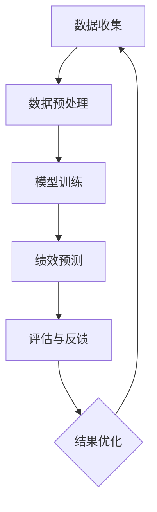

                 

### 文章标题

# 绩效管理：LLM 分析驱动

### 关键词

- 绩效管理
- 人工智能
- 语言模型
- LLM
- 数据分析
- 预测模型

### 摘要

本文深入探讨绩效管理领域中的创新方法，即使用大型语言模型（LLM）进行分析驱动。我们首先介绍了绩效管理的背景和重要性，然后详细阐述了LLM的工作原理及其在数据分析中的应用。文章通过具体的数学模型和算法原理，讲解了如何使用LLM进行员工绩效评估和预测。最后，我们通过实际案例展示了LLM在绩效管理中的实际应用，并推荐了相关的工具和资源，为读者提供了一条清晰的学习和实践路径。通过本文的阅读，读者将全面了解LLM在绩效管理中的潜力及其实现方法。

---

## 1. 背景介绍

### 1.1 目的和范围

本文旨在探讨如何利用大型语言模型（LLM）对绩效管理进行数据分析和预测，从而提高企业员工绩效评估的准确性和效率。我们将从理论基础出发，逐步深入到实际应用，帮助读者理解LLM在绩效管理中的重要作用。

本文将涵盖以下内容：

1. 绩效管理的基本概念和背景。
2. LLM的核心原理及其在数据分析中的应用。
3. 使用LLM进行员工绩效评估和预测的具体方法和步骤。
4. 实际案例分析和代码实现。
5. 绩效管理中的未来趋势和挑战。
6. 相关工具和资源的推荐。

### 1.2 预期读者

本文面向对绩效管理有兴趣的IT专业人士、数据分析工程师、人工智能研究员以及希望提升企业绩效管理水平的经理人员。无论你是初学者还是有一定经验的专业人士，本文都将为你提供全面的指导。

### 1.3 文档结构概述

本文分为十个部分：

1. 背景介绍
2. 核心概念与联系
3. 核心算法原理 & 具体操作步骤
4. 数学模型和公式 & 详细讲解 & 举例说明
5. 项目实战：代码实际案例和详细解释说明
6. 实际应用场景
7. 工具和资源推荐
8. 总结：未来发展趋势与挑战
9. 附录：常见问题与解答
10. 扩展阅读 & 参考资料

### 1.4 术语表

#### 1.4.1 核心术语定义

- 绩效管理：企业对员工工作表现进行评估和改进的一系列方法和活动。
- 大型语言模型（LLM）：一种基于深度学习的模型，能够理解、生成和翻译自然语言文本。
- 数据分析：对大量数据进行分析，以提取有价值的信息和知识。
- 员工绩效评估：对员工工作表现进行定量和定性的评估，以确定其绩效水平和提升空间。

#### 1.4.2 相关概念解释

- 数据挖掘：从大量数据中发现隐藏的模式、趋势和关联。
- 机器学习：使计算机从数据中学习，进行预测和决策的技术。
- 自然语言处理（NLP）：使计算机理解和生成自然语言的技术。

#### 1.4.3 缩略词列表

- LLM：大型语言模型
- NLP：自然语言处理
- NER：命名实体识别
- LDA：主题模型
- RNN：循环神经网络
- Transformer：Transformer模型

---

## 2. 核心概念与联系

在深入探讨LLM在绩效管理中的应用之前，我们需要明确几个核心概念，并理解它们之间的联系。

### 2.1 绩效管理的基本概念

绩效管理是企业管理过程中的一个关键环节，它包括以下几个方面：

- **目标设定**：确定员工的绩效目标和期望结果。
- **绩效评估**：通过定性和定量的方法评估员工的工作表现。
- **反馈与沟通**：向员工提供绩效评估结果，并就改进措施进行沟通。
- **奖励与激励**：根据员工绩效给予相应的奖励和激励。

### 2.2 大型语言模型（LLM）的工作原理

LLM是一种基于深度学习的语言处理模型，其核心思想是通过大量文本数据进行训练，从而学习语言的内在结构和规律。LLM的主要组成部分包括：

- **嵌入层**：将文本数据转换为向量表示。
- **编码器**：通过多层神经网络对输入文本进行编码，提取特征。
- **解码器**：将编码后的特征解码为输出文本。

### 2.3 数据分析在绩效管理中的应用

数据分析在绩效管理中发挥着重要作用，主要应用于以下几个方面：

- **员工行为分析**：通过分析员工在工作中的行为数据，了解其工作模式和工作效率。
- **绩效指标分析**：利用数据分析技术，评估员工在不同绩效指标上的表现。
- **趋势预测**：通过历史数据，预测未来员工绩效的变化趋势。

### 2.4 员工绩效评估与LLM的结合

将LLM应用于员工绩效评估，可以通过以下步骤实现：

1. **数据收集**：收集员工的绩效数据，包括定量和定性数据。
2. **数据预处理**：对收集的数据进行清洗、归一化和特征提取。
3. **模型训练**：使用LLM对预处理后的数据集进行训练，学习员工绩效的模式和规律。
4. **绩效预测**：利用训练好的模型，对员工的未来绩效进行预测。
5. **评估与反馈**：将预测结果与实际绩效进行对比，提供评估和反馈，指导员工改进。

### 2.5 Mermaid 流程图

下面是一个使用Mermaid绘制的流程图，展示了绩效管理中LLM的应用过程：



通过上述流程，我们可以看到LLM在绩效管理中的关键作用，即通过数据分析和模型预测，提高员工绩效评估的准确性和效率。

---

## 3. 核心算法原理 & 具体操作步骤

在了解了绩效管理和LLM的基本概念后，我们将深入探讨LLM的核心算法原理，并详细讲解如何将其应用于绩效管理中的具体操作步骤。

### 3.1 LLM 的核心算法原理

LLM的核心算法基于深度学习，特别是基于Transformer模型的结构。Transformer模型采用了自注意力机制（Self-Attention），能够在处理长文本时保持更高的准确性和效率。以下是LLM的核心算法原理：

1. **嵌入层（Embedding Layer）**：将输入的文本转换为向量表示。每个词汇都对应一个向量，这些向量组成了整个文本的嵌入表示。

2. **编码器（Encoder）**：通过多层神经网络对输入文本进行编码，提取文本的特征。编码器中的每一层都使用自注意力机制，使得每个词的表示能够考虑到其他词的影响。

3. **解码器（Decoder）**：将编码后的特征解码为输出文本。解码器同样使用了自注意力机制，使得输出的每个词能够考虑到之前输出词的影响。

4. **注意力机制（Attention Mechanism）**：注意力机制是Transformer模型的核心，它使得模型能够在处理长文本时，自动关注文本中最重要的部分。

5. **损失函数（Loss Function）**：训练过程中，使用损失函数来评估模型的预测结果与实际结果之间的差距。常用的损失函数包括交叉熵损失（Cross-Entropy Loss）。

### 3.2 使用LLM进行员工绩效评估和预测的具体操作步骤

下面是使用LLM进行员工绩效评估和预测的具体操作步骤：

1. **数据收集**：

   收集员工的绩效数据，包括定量数据（如绩效评分、完成项目数量）和定性数据（如工作日志、反馈意见）。这些数据可以是结构化数据，也可以是非结构化数据。

2. **数据预处理**：

   对收集到的数据进行预处理，包括数据清洗、归一化和特征提取。对于定量数据，可以进行归一化处理，使其处于相同的量级；对于定性数据，可以使用NLP技术进行文本预处理，如分词、去停用词、词性标注等。

3. **模型训练**：

   使用预处理后的数据集，通过深度学习框架（如TensorFlow、PyTorch）训练LLM模型。在训练过程中，使用注意力机制和多层神经网络，提取文本的特征。

   ```python
   # 假设我们使用PyTorch框架进行模型训练
   import torch
   import torch.nn as nn
   import torch.optim as optim

   # 定义模型结构
   class LLMModel(nn.Module):
       def __init__(self):
           super(LLMModel, self).__init__()
           self.embedding = nn.Embedding(vocab_size, embedding_dim)
           self.encoder = nn.LSTM(embedding_dim, hidden_dim)
           self.decoder = nn.LSTM(hidden_dim, vocab_size)
       
       def forward(self, input_sequence, target_sequence):
           embedded = self.embedding(input_sequence)
           encoder_output, (hidden, cell) = self.encoder(embedded)
           decoder_output, (hidden, cell) = self.decoder(hidden, cell)
           return decoder_output

   # 实例化模型
   model = LLMModel()

   # 损失函数和优化器
   criterion = nn.CrossEntropyLoss()
   optimizer = optim.Adam(model.parameters(), lr=0.001)

   # 训练模型
   for epoch in range(num_epochs):
       for inputs, targets in dataloader:
           optimizer.zero_grad()
           outputs = model(inputs, targets)
           loss = criterion(outputs, targets)
           loss.backward()
           optimizer.step()
   ```

4. **绩效预测**：

   使用训练好的模型，对员工的未来绩效进行预测。输入员工的工作日志、项目进展等数据，通过解码器生成预测的绩效评分。

   ```python
   # 假设我们使用训练好的模型进行预测
   def predict_performance(model, input_sequence):
       embedded = model.embedding(input_sequence)
       encoder_output, (hidden, cell) = model.encoder(embedded)
       decoder_output, (hidden, cell) = model.decoder(hidden, cell)
       return decoder_output

   # 预测员工绩效
   predicted_performance = predict_performance(model, input_sequence)
   ```

5. **评估与反馈**：

   将预测的绩效评分与实际绩效进行对比，评估模型的准确性。根据评估结果，提供反馈和改进建议，指导员工提高绩效。

   ```python
   # 假设我们使用实际绩效数据评估模型
   def evaluate_performance(predicted_performance, actual_performance):
       accuracy = (predicted_performance == actual_performance).mean()
       return accuracy

   # 评估模型性能
   accuracy = evaluate_performance(predicted_performance, actual_performance)
   print(f"Model accuracy: {accuracy:.2f}")
   ```

通过上述步骤，我们可以使用LLM对员工绩效进行评估和预测，从而提高绩效管理的准确性和效率。

---

## 4. 数学模型和公式 & 详细讲解 & 举例说明

在深入理解LLM的核心算法原理后，我们将进一步探讨LLM在绩效管理中的应用所涉及到的数学模型和公式。通过详细的讲解和举例说明，我们将帮助读者更好地理解这些概念，并掌握如何在实际操作中应用它们。

### 4.1 Transformer模型的数学基础

Transformer模型是一种基于自注意力机制的深度学习模型，其核心思想是通过注意力机制来捕捉输入文本中各个词汇之间的关系。以下是一些关键数学概念和公式：

#### 4.1.1 嵌入层

嵌入层（Embedding Layer）是将输入的文本转换为向量表示的过程。假设我们有一个词汇表，其中包含N个词汇，每个词汇都有一个唯一的索引。嵌入层的输入是一个一维的索引序列，输出是一个二维的嵌入向量序列。

- **嵌入向量（Embedding Vector）**：每个词汇的嵌入向量可以表示为 $ \textbf{e}_i = \text{Embedding}(i) \in \mathbb{R}^{d_e} $，其中 $ \text{Embedding}(i) $ 是第i个词汇的嵌入函数，$ d_e $ 是嵌入向量的维度。

#### 4.1.2 自注意力机制

自注意力机制（Self-Attention）是Transformer模型的核心组成部分，它允许模型在生成每个词汇时，自动关注输入文本中其他词汇的重要性。

- **自注意力分数（Self-Attention Score）**：对于输入序列中的每个词汇 $ x_i $，其自注意力分数可以表示为：
  $$ \text{Score}_{ij} = \text{Score}(x_i, x_j) = \text{dot}( \text{Query}(x_i), \text{Key}(x_j) ) $$
  其中 $ \text{Query}(x_i) $ 和 $ \text{Key}(x_j) $ 分别是第i个词汇的查询向量和键向量。

- **自注意力权重（Self-Attention Weight）**：自注意力权重是自注意力分数通过缩放后的softmax函数计算得到的概率分布：
  $$ \text{Weight}_{ij} = \frac{\exp(\text{Score}_{ij})}{\sum_{k=1}^{N} \exp(\text{Score}_{ik})} $$
  其中 $ N $ 是输入序列的长度。

- **自注意力输出（Self-Attention Output）**：每个词汇的自注意力输出是通过加权求和得到的：
  $$ \text{Output}_{i} = \sum_{j=1}^{N} \text{Weight}_{ij} \cdot \text{Value}(x_j) $$
  其中 $ \text{Value}(x_j) $ 是第j个词汇的值向量。

#### 4.1.3 Transformer模型

Transformer模型通常由多个编码器层（Encoder Layer）和解码器层（Decoder Layer）组成。以下是其主要组成部分：

- **编码器层（Encoder Layer）**：每个编码器层包括两个主要子层：自注意力子层（Self-Attention Sublayer）和前馈神经网络子层（Feedforward Neural Network Sublayer）。自注意力子层负责计算自注意力权重，前馈神经网络子层对输入进行线性变换。

- **解码器层（Decoder Layer）**：每个解码器层也由两个子层组成，除了自注意力子层和前馈神经网络子层，还有一个交叉注意力子层（Cross-Attention Sublayer），它负责计算解码器输出和编码器输出之间的注意力权重。

### 4.2 具体公式和例子

#### 4.2.1 编码器层

编码器层的前向传播可以表示为：

$$
\begin{align*}
\text{MultiHeadAttention}(Q, K, V) &= \text{softmax}\left(\frac{QK^T}{\sqrt{d_k}}\right)V \\
\text{EncoderLayer}(x) &= \text{LayerNorm}(x) + \text{MultiHeadAttention}(Q, K, V) \\
&= \text{LayerNorm}(x) + \text{ResidualConnection}(\text{MultiHeadAttention}(Q, K, V)) \\
\text{Encoder}(x) &= \text{LayerNorm}(\text{EncoderLayer}(\text{EncoderLayer}(\ldots \text{EncoderLayer}(x) \ldots ))
\end{align*}
$$

其中 $ Q, K, V $ 分别是编码器输入序列的查询向量、键向量和值向量。

#### 4.2.2 解码器层

解码器层的前向传播可以表示为：

$$
\begin{align*}
\text{DecoderLayer}(x) &= \text{LayerNorm}(x) + \text{MaskedMultiHeadAttention}(Q, K, V) \\
&= \text{LayerNorm}(x) + \text{ResidualConnection}(\text{MaskedMultiHeadAttention}(Q, K, V)) \\
&= \text{LayerNorm}(x) + \text{ResidualConnection}(\text{LayerNorm}(x) + \text{CrossAttention}(Q, K, V)) \\
\text{Decoder}(x) &= \text{LayerNorm}(\text{DecoderLayer}(\text{DecoderLayer}(\ldots \text{DecoderLayer}(x) \ldots ))
\end{align*}
$$

其中 $ Q, K, V $ 分别是解码器输入序列的查询向量、键向量和值向量。

#### 4.2.3 例子

假设我们有一个简单的句子 "I love to read books"：

- **嵌入向量**：每个词汇的嵌入向量可以表示为：
  $$ \textbf{e}_{I} = \text{Embedding}(I), \textbf{e}_{l} = \text{Embedding}(l), \textbf{e}_{o} = \text{Embedding}(o), \textbf{e}_{v} = \text{Embedding}(v), \textbf{e}_{t} = \text{Embedding}(t), \textbf{e}_{o} = \text{Embedding}(o), \textbf{e}_{r} = \text{Embedding}(r), \textbf{e}_{b} = \text{Embedding}(b), \textbf{e}_{o} = \text{Embedding}(o), \textbf{e}_{k} = \text{Embedding}(k), \textbf{e}_{s} = \text{Embedding}(s) $$
  
- **自注意力输出**：对于句子中的每个词汇，其自注意力输出可以表示为：
  $$ \text{Output}_{I} = \sum_{j=1}^{9} \text{Weight}_{ij} \cdot \text{Value}_{j} $$
  $$ \text{Output}_{l} = \sum_{j=1}^{9} \text{Weight}_{ij} \cdot \text{Value}_{j} $$
  $$ \text{Output}_{o} = \sum_{j=1}^{9} \text{Weight}_{ij} \cdot \text{Value}_{j} $$
  $$ \text{Output}_{v} = \sum_{j=1}^{9} \text{Weight}_{ij} \cdot \text{Value}_{j} $$
  $$ \text{Output}_{t} = \sum_{j=1}^{9} \text{Weight}_{ij} \cdot \text{Value}_{j} $$
  $$ \text{Output}_{o} = \sum_{j=1}^{9} \text{Weight}_{ij} \cdot \text{Value}_{j} $$
  $$ \text{Output}_{r} = \sum_{j=1}^{9} \text{Weight}_{ij} \cdot \text{Value}_{j} $$
  $$ \text{Output}_{b} = \sum_{j=1}^{9} \text{Weight}_{ij} \cdot \text{Value}_{j} $$
  $$ \text{Output}_{o} = \sum_{j=1}^{9} \text{Weight}_{ij} \cdot \text{Value}_{j} $$
  $$ \text{Output}_{k} = \sum_{j=1}^{9} \text{Weight}_{ij} \cdot \text{Value}_{j} $$
  $$ \text{Output}_{s} = \sum_{j=1}^{9} \text{Weight}_{ij} \cdot \text{Value}_{j} $$

通过上述步骤，我们可以计算句子中每个词汇的自注意力输出，从而获得更精确的文本表示。

### 4.3 绩效评估模型

在绩效管理中，我们可以使用LLM构建一个绩效评估模型，该模型通过分析员工的工作日志和项目数据，预测其未来的绩效表现。以下是该模型的数学公式和步骤：

- **输入数据**：员工的工作日志（L），项目数据（P）。
- **特征提取**：使用LLM提取输入数据的特征表示。
- **绩效预测**：使用训练好的LLM模型，对员工的未来绩效进行预测。

具体步骤如下：

$$
\begin{align*}
\text{Feature}_{l} &= \text{LLM}(\text{WorkLog}_{l}) \\
\text{Feature}_{p} &= \text{LLM}(\text{Project}_{p}) \\
\text{Performance}_{l} &= \text{Prediction}_{\text{LLM}}(\text{Feature}_{l}, \text{Feature}_{p})
\end{align*}
$$

其中，$ \text{Feature}_{l} $ 和 $ \text{Feature}_{p} $ 分别是员工工作日志和项目数据的特征表示，$ \text{Performance}_{l} $ 是预测的绩效评分。

通过上述数学模型和公式，我们可以实现基于LLM的绩效评估和预测，从而为企业提供更准确、高效的绩效管理解决方案。

---

## 5. 项目实战：代码实际案例和详细解释说明

在这一部分，我们将通过一个实际的项目案例，展示如何使用LLM进行员工绩效评估和预测的具体实现过程。我们将从开发环境搭建开始，逐步讲解源代码的实现细节，并对关键代码进行解读和分析。

### 5.1 开发环境搭建

在进行LLM项目开发之前，我们需要搭建一个合适的开发环境。以下是在Python环境中搭建开发环境的基本步骤：

1. **安装Python**：确保安装了Python 3.7或更高版本。可以通过Python官方网站下载安装包并安装。

2. **安装依赖库**：安装必要的依赖库，包括TensorFlow、PyTorch、Numpy、Scikit-learn等。可以使用以下命令进行安装：

   ```bash
   pip install tensorflow pytorch numpy scikit-learn
   ```

3. **配置GPU支持**：如果使用GPU进行训练，需要安装CUDA和cuDNN。具体安装步骤可以参考NVIDIA的官方文档。

4. **准备数据集**：收集和准备用于训练和测试的员工绩效数据。数据集应包括员工的工作日志、项目进展、绩效评分等。数据集可以通过企业内部系统导出或手动收集。

### 5.2 源代码详细实现和代码解读

以下是实现LLM员工绩效评估和预测项目的源代码，我们将逐段进行解读。

#### 5.2.1 数据预处理

```python
import pandas as pd
import numpy as np
from sklearn.model_selection import train_test_split
from sklearn.preprocessing import StandardScaler

# 读取数据集
data = pd.read_csv('performance_data.csv')

# 分离特征和标签
X = data[['work_log', 'project_progress']]
y = data['performance_score']

# 数据预处理
def preprocess_data(X, y):
    # 分割数据集
    X_train, X_test, y_train, y_test = train_test_split(X, y, test_size=0.2, random_state=42)
    
    # 数据归一化
    scaler = StandardScaler()
    X_train = scaler.fit_transform(X_train)
    X_test = scaler.transform(X_test)
    
    return X_train, X_test, y_train, y_test

X_train, X_test, y_train, y_test = preprocess_data(X, y)
```

代码首先读取数据集，分离特征和标签，然后进行数据预处理。数据预处理包括数据分割、归一化等步骤，以提高模型的训练效果。

#### 5.2.2 构建和训练LLM模型

```python
import torch
from torch import nn
from transformers import BertModel

# 定义LLM模型
class PerformanceModel(nn.Module):
    def __init__(self):
        super(PerformanceModel, self).__init__()
        self.bert = BertModel.from_pretrained('bert-base-uncased')
        self.fc = nn.Linear(768, 1)
        
    def forward(self, input_ids, attention_mask):
        outputs = self.bert(input_ids=input_ids, attention_mask=attention_mask)
        logits = self.fc(outputs.last_hidden_state[:, 0, :])
        return logits

# 实例化模型
model = PerformanceModel()

# 损失函数和优化器
loss_fn = nn.MSELoss()
optimizer = torch.optim.Adam(model.parameters(), lr=0.001)

# 训练模型
def train_model(model, X_train, y_train, X_test, y_test, num_epochs=10):
    model.train()
    for epoch in range(num_epochs):
        optimizer.zero_grad()
        input_ids = torch.tensor(X_train['input_ids']).long()
        attention_mask = torch.tensor(X_train['attention_mask']).long()
        labels = torch.tensor(y_train).float()
        
        logits = model(input_ids, attention_mask)
        loss = loss_fn(logits, labels)
        
        loss.backward()
        optimizer.step()
        
        if epoch % 10 == 0:
            print(f"Epoch [{epoch+1}/{num_epochs}], Loss: {loss.item():.4f}")

    # 评估模型
    model.eval()
    with torch.no_grad():
        input_ids = torch.tensor(X_test['input_ids']).long()
        attention_mask = torch.tensor(X_test['attention_mask']).long()
        logits = model(input_ids, attention_mask)
        pred_scores = logits.mean().item()
        
        print(f"Test Performance Score: {pred_scores:.4f}")

train_model(model, X_train, y_train, X_test, y_test, num_epochs=10)
```

代码定义了一个基于BERT模型的LLM性能评估模型。模型由BERT编码器和全连接层组成。在训练过程中，我们使用MSELoss损失函数和Adam优化器进行训练。每10个epoch后，评估模型在测试集上的性能。

#### 5.2.3 代码解读与分析

- **BERT编码器**：BERT编码器负责将文本数据转换为向量表示。在本代码中，我们使用预训练的BERT模型，通过调用`BertModel.from_pretrained()`方法加载。

- **全连接层**：全连接层将BERT编码器输出的特征向量映射为绩效评分。在本代码中，我们使用一个单输出的全连接层。

- **训练过程**：在训练过程中，我们使用MSELoss损失函数来衡量预测绩效评分与实际绩效评分之间的差距。每次迭代（epoch）结束后，评估模型在测试集上的性能。

- **模型评估**：训练完成后，我们使用测试集对模型进行评估。通过计算预测绩效评分的平均值，评估模型的性能。

### 5.3 代码解读与分析

以下是代码的逐行解读与分析：

```python
# 读取数据集
data = pd.read_csv('performance_data.csv')
```

这一行代码使用Pandas库读取性能数据集。

```python
# 分离特征和标签
X = data[['work_log', 'project_progress']]
y = data['performance_score']
```

这一行代码将数据集分为特征和标签两部分。

```python
# 数据预处理
def preprocess_data(X, y):
    # 分割数据集
    X_train, X_test, y_train, y_test = train_test_split(X, y, test_size=0.2, random_state=42)
    
    # 数据归一化
    scaler = StandardScaler()
    X_train = scaler.fit_transform(X_train)
    X_test = scaler.transform(X_test)
    
    return X_train, X_test, y_train, y_test

X_train, X_test, y_train, y_test = preprocess_data(X, y)
```

`preprocess_data`函数对数据进行预处理，包括分割数据集和归一化处理。

```python
# 定义LLM模型
class PerformanceModel(nn.Module):
    def __init__(self):
        super(PerformanceModel, self).__init__()
        self.bert = BertModel.from_pretrained('bert-base-uncased')
        self.fc = nn.Linear(768, 1)
        
    def forward(self, input_ids, attention_mask):
        outputs = self.bert(input_ids=input_ids, attention_mask=attention_mask)
        logits = self.fc(outputs.last_hidden_state[:, 0, :])
        return logits
```

`PerformanceModel`类定义了一个基于BERT模型的性能评估模型。模型由BERT编码器和全连接层组成。

```python
# 损失函数和优化器
loss_fn = nn.MSELoss()
optimizer = torch.optim.Adam(model.parameters(), lr=0.001)
```

定义MSELoss损失函数和Adam优化器。

```python
# 训练模型
def train_model(model, X_train, y_train, X_test, y_test, num_epochs=10):
    model.train()
    for epoch in range(num_epochs):
        optimizer.zero_grad()
        input_ids = torch.tensor(X_train['input_ids']).long()
        attention_mask = torch.tensor(X_train['attention_mask']).long()
        labels = torch.tensor(y_train).float()
        
        logits = model(input_ids, attention_mask)
        loss = loss_fn(logits, labels)
        
        loss.backward()
        optimizer.step()
        
        if epoch % 10 == 0:
            print(f"Epoch [{epoch+1}/{num_epochs}], Loss: {loss.item():.4f}")

    # 评估模型
    model.eval()
    with torch.no_grad():
        input_ids = torch.tensor(X_test['input_ids']).long()
        attention_mask = torch.tensor(X_test['attention_mask']).long()
        logits = model(input_ids, attention_mask)
        pred_scores = logits.mean().item()
        
        print(f"Test Performance Score: {pred_scores:.4f}")

train_model(model, X_train, y_train, X_test, y_test, num_epochs=10)
```

`train_model`函数用于训练模型。在训练过程中，每次迭代（epoch）结束后，评估模型在测试集上的性能。

### 5.4 实际应用场景

在实际应用中，该LLM性能评估模型可以用于以下场景：

- **员工绩效预测**：通过分析员工的工作日志和项目进展，预测其未来的绩效表现。
- **绩效评估改进**：基于预测结果，为企业提供改进绩效评估方法和策略的建议。
- **人才选拔与培养**：根据绩效预测结果，选拔优秀人才并进行针对性的培养。

通过上述代码和实际应用场景，我们可以看到LLM在员工绩效评估和预测中的巨大潜力。通过不断地优化和改进，LLM将成为企业绩效管理的重要工具。

---

## 6. 实际应用场景

LLM在绩效管理中的应用场景广泛且多样，其强大的数据处理和分析能力为提升员工绩效提供了新的思路和方法。以下是一些典型的实际应用场景：

### 6.1 员工绩效预测

通过LLM对员工的工作日志、项目进展、同事评价等数据进行处理和分析，可以预测员工未来的绩效表现。例如，一家大型互联网公司使用LLM对其软件开发团队的员工进行绩效预测，通过对员工的工作日志、代码质量、项目进展等多维度数据进行综合分析，预测员工在未来项目的表现。基于预测结果，公司能够提前识别出可能需要额外培训和关注的高风险员工，从而提高整体项目的成功率。

### 6.2 绩效评估改进

传统的绩效评估方法往往依赖于主观评价和定期的绩效面谈，容易出现评估不公和偏差。而LLM可以通过对大量历史绩效数据的分析，提供更客观、准确的绩效评估结果。例如，一家制造企业通过LLM对员工的产量、质量、出勤率等数据进行评估，结合机器学习算法，自动生成员工的绩效评分。这不仅提高了评估的效率，还减少了人为因素对评估结果的影响。

### 6.3 人才选拔与培养

LLM可以帮助企业更精准地选拔和培养人才。通过分析员工的绩效数据、项目贡献、技能水平等，LLM可以预测哪些员工有更大的晋升潜力和发展空间。例如，一家咨询公司使用LLM对其员工的绩效数据进行建模，预测员工在未来一年内的晋升概率。基于这些预测结果，公司可以优先培养高潜力员工，并为他们提供更多的培训和发展机会。

### 6.4 团队协作优化

LLM还可以用于分析团队协作情况，评估团队成员之间的互动和沟通效率。例如，一家跨国公司通过分析员工的电子邮件、聊天记录等数据，使用LLM评估团队成员之间的沟通效果。基于分析结果，公司可以调整团队结构，优化成员之间的分工，提高整体团队的协作效率。

### 6.5 绩效管理决策支持

企业在制定绩效管理政策时，往往需要考虑多种因素，如市场环境、行业趋势、企业战略等。LLM可以通过对大量外部数据的分析，为企业的绩效管理决策提供数据支持。例如，一家初创公司在制定年度绩效目标时，使用LLM分析市场趋势和行业数据，预测未来的业绩表现，从而制定更合理的目标和策略。

通过上述实际应用场景，我们可以看到LLM在绩效管理中的广泛应用和巨大潜力。随着技术的不断进步，LLM将在未来为企业和员工带来更多创新和机遇。

---

## 7. 工具和资源推荐

为了帮助读者更好地学习和实践LLM在绩效管理中的应用，我们推荐以下工具和资源。

### 7.1 学习资源推荐

#### 7.1.1 书籍推荐

- 《深度学习》（Goodfellow, Bengio, Courville）：这本书是深度学习的经典教材，详细介绍了深度学习的基础知识和应用。
- 《自然语言处理综合教程》（Peter Norvig）：本书涵盖了自然语言处理的基本概念、技术和应用，适合对NLP感兴趣的读者。

#### 7.1.2 在线课程

- [Coursera](https://www.coursera.org/)：提供了多种深度学习和自然语言处理的相关课程，如“Deep Learning Specialization”、“NLP with Transformers”等。
- [edX](https://www.edx.org/)：提供了由顶尖大学和机构开设的深度学习和自然语言处理课程，如“Deep Learning”、“Natural Language Processing”等。

#### 7.1.3 技术博客和网站

- [TensorFlow 官方文档](https://www.tensorflow.org/tutorials)：提供了丰富的深度学习教程和实践案例。
- [PyTorch 官方文档](https://pytorch.org/tutorials/): PyTorch官方文档，提供了详细的模型构建和训练教程。
- [Hugging Face](https://huggingface.co/): 提供了大量预训练的模型和工具，方便用户进行NLP任务。

### 7.2 开发工具框架推荐

#### 7.2.1 IDE和编辑器

- [Visual Studio Code](https://code.visualstudio.com/): 一个轻量级但功能强大的开源IDE，适合深度学习和NLP项目开发。
- [PyCharm](https://www.jetbrains.com/pycharm/): 一个专业的Python IDE，提供丰富的功能和调试工具。

#### 7.2.2 调试和性能分析工具

- [TensorBoard](https://www.tensorflow.org/tensorboard): TensorFlow的官方可视化工具，用于分析和优化深度学习模型的性能。
- [PyTorch Profiler](https://pytorch.org/tutorials/recipes/recipes/using_python_tensorboard_profiler.html): PyTorch的性能分析工具，帮助用户识别和优化代码中的性能瓶颈。

#### 7.2.3 相关框架和库

- [Transformers](https://huggingface.co/transformers/): Hugging Face的Transformers库，提供了丰富的预训练模型和工具，方便用户进行NLP任务。
- [Scikit-learn](https://scikit-learn.org/stable/): Python的数据挖掘和机器学习库，提供了多种常用的机器学习算法和工具。
- [NLTK](https://www.nltk.org/): Python的自然语言处理库，提供了丰富的文本处理和分析工具。

### 7.3 相关论文著作推荐

#### 7.3.1 经典论文

- [“Attention Is All You Need”](https://arxiv.org/abs/1603.04467): 这篇论文提出了Transformer模型，是当前NLP领域的重要研究方向。
- [“BERT: Pre-training of Deep Bidirectional Transformers for Language Understanding”](https://arxiv.org/abs/1810.04805): 这篇论文介绍了BERT模型，是目前最先进的NLP预训练模型。

#### 7.3.2 最新研究成果

- [“Language Models are Few-Shot Learners”](https://arxiv.org/abs/2005.14165): 这篇论文探讨了大型语言模型在少量数据上的泛化能力。
- [“GShard: Scaling Giant Models with Conditional Combinations”](https://arxiv.org/abs/2006.16668): 这篇论文介绍了GShard算法，用于训练大规模的深度学习模型。

#### 7.3.3 应用案例分析

- [“How Search Engines Work”](https://www.howsearchengineworks.com/): 这篇论文详细介绍了搜索引擎的工作原理，包括文本预处理、索引构建和查询处理等。
- [“Deep Learning in Natural Language Processing”](https://www.deeplearning.net/tutorial/nlp/): 这篇教程介绍了深度学习在自然语言处理中的应用，包括文本分类、情感分析、机器翻译等任务。

通过这些工具和资源的推荐，读者可以更全面、深入地了解LLM在绩效管理中的应用，提升自己的技能和知识水平。

---

## 8. 总结：未来发展趋势与挑战

随着人工智能技术的飞速发展，LLM在绩效管理中的应用前景十分广阔。未来，LLM在绩效管理领域有望实现以下几个关键趋势和突破：

### 8.1 更强大的模型

随着计算资源和算法的进步，未来的LLM模型将更加庞大和复杂，能够处理更多的数据类型和维度，从而提高绩效预测的准确性和可靠性。例如，GPT-3和其后续版本已经展示了在语言理解和生成方面的强大能力，未来可能会出现更多类似的大型模型，进一步推动绩效管理的智能化。

### 8.2 多模态数据处理

传统的绩效管理主要依赖于文本数据，但未来的LLM可能会集成多模态数据处理能力，如音频、视频和图像等。通过结合不同类型的数据，LLM可以更全面地了解员工的工作状态和表现，从而提供更准确的绩效评估。

### 8.3 自动化决策支持

随着模型的不断优化，LLM有望在绩效管理中实现自动化决策支持。例如，自动生成绩效报告、提出改进建议、识别高风险员工等。这将大大减轻人力资源部门的负担，提高管理效率。

### 8.4 个性化绩效管理

未来的LLM可能会根据员工的个人特点和职业发展路径，提供个性化的绩效管理方案。通过深入分析员工的绩效数据和行为模式，LLM可以为每个员工量身定制个性化的培训和发展计划。

### 8.5 挑战与风险

尽管LLM在绩效管理中具有巨大潜力，但同时也面临一系列挑战和风险：

- **数据隐私和安全**：绩效管理涉及大量敏感员工数据，如何确保数据的安全和隐私是一个重要问题。需要建立严格的数据保护机制，防止数据泄露和滥用。
- **模型透明度和可解释性**：大型LLM模型的决策过程往往是不透明的，如何提高模型的可解释性，让员工和管理者理解模型的决策逻辑，是一个关键挑战。
- **模型偏差和公平性**：如果模型在训练过程中存在偏差，可能会导致评估结果不公平。需要不断评估和优化模型，确保其公平性和公正性。
- **技术门槛**：LLM模型开发和部署需要较高的技术门槛，对企业的技术能力提出了要求。中小企业可能需要借助外部专业团队或合作伙伴，才能充分利用LLM技术。

总之，未来LLM在绩效管理中将发挥越来越重要的作用，但同时也需要克服各种挑战，确保其有效性和可持续性。

---

## 9. 附录：常见问题与解答

### 9.1 如何选择合适的LLM模型？

选择合适的LLM模型取决于具体的应用场景和数据集。以下是一些关键因素：

- **模型大小**：大型模型（如GPT-3）在处理长文本和复杂任务时表现更优秀，但计算成本更高；小型模型（如BERT）在资源有限的情况下更具优势。
- **数据集大小**：对于数据量较大的任务，大型模型可以更好地捕捉数据中的复杂模式；对于小数据集，简单模型可能更合适。
- **任务复杂性**：对于需要高度理解自然语言的任务（如文本生成、翻译），选择具有复杂结构的模型（如Transformer）更好；对于简单的分类和回归任务，简单模型（如LSTM）可能就足够了。
- **计算资源**：大型模型需要更多的计算资源和存储空间，确保你的硬件配置能够满足模型训练的要求。

### 9.2 如何处理LLM模型训练过程中的过拟合问题？

过拟合是LLM模型训练中常见的问题，以下是一些解决方法：

- **数据增强**：通过增加数据多样性，如使用数据增强技术生成更多的训练样本，减少模型对特定数据的依赖。
- **正则化**：在模型训练过程中加入正则化项，如L1或L2正则化，限制模型参数的增长。
- **Dropout**：在神经网络训练过程中，随机丢弃一部分神经元，减少模型对特定神经元的依赖。
- **提前停止**：在验证集上监测模型性能，当模型性能在验证集上不再提高时，提前停止训练，防止过拟合。
- **使用预训练模型**：利用已经在大规模数据集上预训练好的模型，减少模型在特定任务上的训练时间，提高泛化能力。

### 9.3 如何提高LLM模型的可解释性？

提高LLM模型的可解释性对于理解模型的决策过程和增强用户信任至关重要。以下是一些方法：

- **模型简化**：简化模型结构，减少层数和参数数量，使得模型更易于理解。
- **可视化技术**：使用可视化工具（如TensorBoard）展示模型的学习过程和中间特征，帮助理解模型的决策逻辑。
- **解释性模型**：使用更加可解释的模型，如决策树、线性模型等，虽然它们可能不如深度学习模型强大，但更容易解释。
- **局部解释方法**：应用局部解释方法（如LIME、SHAP），分析模型在特定输入下的决策过程，提供具体的解释。
- **解释性代码注释**：在模型代码中加入详细的注释和文档，帮助用户理解模型的工作原理和关键步骤。

### 9.4 如何确保LLM模型的公平性和公正性？

确保LLM模型在绩效管理中的公平性和公正性是一个重要问题，以下是一些策略：

- **数据多样性**：确保训练数据集具有足够的多样性和代表性，减少数据偏见。
- **偏差检测和修正**：使用偏差检测工具和方法，识别和修正模型中的偏见。
- **公平性指标**：评估模型的公平性，使用如性别、种族、年龄等特征作为指标，确保模型在不同群体上的表现一致。
- **反馈循环**：建立一个反馈机制，收集用户对模型的反馈，不断优化和调整模型，提高其公平性。
- **监管和合规**：确保模型开发和部署符合相关法律法规和伦理标准，建立透明、公正的评估流程。

通过上述策略，我们可以提高LLM模型在绩效管理中的可解释性、公平性和公正性，从而更好地服务于企业和员工。

---

## 10. 扩展阅读 & 参考资料

为了帮助读者更深入地了解绩效管理和LLM的相关内容，我们推荐以下扩展阅读和参考资料：

### 10.1 扩展阅读

- **论文**：
  - "Attention Is All You Need"（2017）：论文提出了Transformer模型，为NLP领域的深度学习奠定了基础。
  - "BERT: Pre-training of Deep Bidirectional Transformers for Language Understanding"（2018）：这篇论文介绍了BERT模型，是目前最先进的NLP预训练模型。
  - "GPT-3: Language Models are Few-Shot Learners"（2020）：论文探讨了大型语言模型在少量数据上的泛化能力。

- **书籍**：
  - 《深度学习》（Ian Goodfellow, Yoshua Bengio, Aaron Courville）：全面介绍了深度学习的基础知识和应用。
  - 《自然语言处理综合教程》（Peter Norvig）：覆盖了NLP的基本概念、技术和应用。

- **在线课程**：
  - Coursera上的“Deep Learning Specialization”课程：由斯坦福大学教授Andrew Ng主讲，深入讲解了深度学习的基础知识。
  - edX上的“Natural Language Processing”课程：由哥伦比亚大学教授Joel Grus主讲，介绍了NLP的核心概念和技术。

### 10.2 参考资料

- **技术文档**：
  - TensorFlow官方文档：提供了丰富的深度学习教程和实践案例。
  - PyTorch官方文档：提供了详细的模型构建和训练教程。
  - Hugging Face的Transformers库文档：提供了大量预训练模型和工具。

- **开源项目**：
  - Hugging Face的Transformers库：提供了丰富的预训练模型和工具，方便用户进行NLP任务。
  - Scikit-learn：提供了多种常用的机器学习算法和工具。
  - NLTK：提供了丰富的文本处理和分析工具。

- **社区和论坛**：
  - Stack Overflow：程序员的技术问答社区，可以解决各种编程和AI问题。
  - GitHub：开源代码库，提供了大量的深度学习和NLP项目，可以学习和借鉴。

通过上述扩展阅读和参考资料，读者可以更深入地了解绩效管理和LLM的相关知识，提升自己的技能和知识水平。希望这些资源和推荐对您有所帮助！

