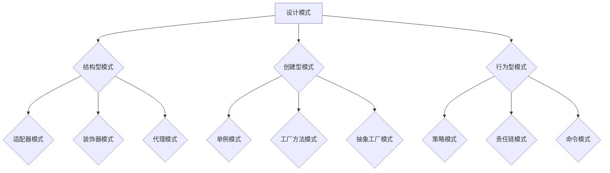

                 

# 综合设计模式的应用案例：反思、工具使用与规划

## 关键词：
- 设计模式
- 应用案例
- 反思
- 工具
- 规划
- 实战代码

## 摘要：
本文旨在通过深入探讨设计模式的应用案例，结合实际代码分析，帮助读者理解设计模式在实际开发中的价值与挑战。本文首先介绍设计模式的基本概念和重要性，随后通过具体案例展示设计模式在不同场景下的应用，并对其进行反思。此外，本文还将推荐实用的工具和资源，以助开发者更高效地掌握和运用设计模式，并规划未来的学习和实践路径。

## 1. 背景介绍

### 1.1 目的和范围
设计模式是软件工程领域的重要概念，它们为解决特定问题提供了一组解决方案。本文将重点探讨设计模式在实际项目中的应用，分析其优势与不足，并介绍如何有效地使用工具和资源来提高设计模式的学习和实践效果。

本文将涵盖以下内容：
1. 设计模式的基本概念和重要性。
2. 具体应用案例分析。
3. 设计模式的反思与改进。
4. 使用工具和资源提高设计模式学习效果。
5. 未来学习和实践规划。

### 1.2 预期读者
本文适用于具备一定编程基础，对设计模式有一定了解的开发者。无论是初学者还是经验丰富的开发者，都可以从本文中获得新的见解和实用的技巧。

### 1.3 文档结构概述
本文分为以下几个部分：
1. 引言：介绍设计模式的基本概念和重要性。
2. 核心概念与联系：解释设计模式的核心原理，展示相关架构图。
3. 核心算法原理与具体操作步骤：使用伪代码详细阐述设计模式的应用。
4. 数学模型与公式：讲解设计模式中的数学模型及其应用。
5. 项目实战：展示实际代码案例并进行详细解释。
6. 实际应用场景：讨论设计模式在不同场景中的应用。
7. 工具和资源推荐：推荐学习资源和开发工具。
8. 总结：展望未来发展趋势与挑战。
9. 附录：常见问题与解答。
10. 扩展阅读：推荐进一步学习的文献资料。

### 1.4 术语表

#### 1.4.1 核心术语定义
- 设计模式：在软件工程中，设计模式是一套被反复使用、经过分类、并经过时间考验的解决方案，用于解决软件开发中的常见问题。
- 模式：一组指导原则，描述了如何解决特定类型的软件设计问题。
- 面向对象：一种程序设计范式，以对象为基础，通过封装、继承、多态等特性来组织代码。

#### 1.4.2 相关概念解释
- 封装：将对象的属性和方法封装在一个对象中，隐藏内部细节，只暴露必要的接口。
- 继承：允许一个类继承另一个类的属性和方法，实现代码复用。
- 多态：同一操作作用于不同的对象时可以有不同的解释，从而产生不同的执行结果。

#### 1.4.3 缩略词列表
- SOA：面向服务的架构（Service-Oriented Architecture）
- MVC：模型-视图-控制器（Model-View-Controller）
- ORM：对象关系映射（Object-Relational Mapping）

## 2. 核心概念与联系

在设计模式中，核心概念和联系是理解和应用设计模式的关键。下面我们将通过一个Mermaid流程图展示设计模式的基本架构和核心概念。



### 2.1 设计模式分类

设计模式可以分为三大类：结构型模式、创建型模式和行为型模式。

- **结构型模式**：用于组合类和对象以形成更大的结构，主要包括适配器模式、装饰器模式、代理模式等。
- **创建型模式**：用于实例化对象，主要解决对象创建问题，包括单例模式、工厂方法模式、抽象工厂模式等。
- **行为型模式**：用于描述对象之间的交互，包括策略模式、责任链模式、命令模式等。

### 2.2 设计模式的核心原理

设计模式的核心原理在于它们提供了一种解决特定问题的通用方法，这些方法可以在不同的项目中复用，从而提高代码的可维护性和可扩展性。

- **封装**：隐藏实现细节，只暴露必要的接口，使得代码模块化。
- **继承**：通过继承已有类，实现代码复用，提高代码的可重用性。
- **多态**：同一操作作用于不同对象时，可以有不同的解释和执行结果，提高代码的灵活性和可扩展性。

## 3. 核心算法原理 & 具体操作步骤

在设计模式中，核心算法原理通常体现在如何通过特定的结构和行为来实现代码的模块化和可维护性。以下我们将使用伪代码详细阐述几个经典设计模式的应用步骤。

### 3.1 单例模式

单例模式确保一个类仅有一个实例，并提供一个访问它的全局访问点。

```pseudo
class Singleton {
    private static instance: Singleton = null

    private constructor() {
        // 防止通过new直接创建实例
    }

    public static getInstance(): Singleton {
        if (instance == null) {
            instance = new Singleton()
        }
        return instance
    }

    // 其他方法...
}
```

### 3.2 工厂方法模式

工厂方法模式定义一个创建对象的接口，但让子类决定实例化哪一个类。允许一个类的实例化延迟到其子类。

```pseudo
interface Creator {
    create(): Product
}

class ConcreteCreatorA implements Creator {
    create(): Product {
        return new ConcreteProductA()
    }
}

class ConcreteCreatorB implements Creator {
    create(): Product {
        return new ConcreteProductB()
    }
}

class Product {
    // 产品类的通用方法...
}

class ConcreteProductA extends Product {
    // 实现具体产品A的方法...
}

class ConcreteProductB extends Product {
    // 实现具体产品B的方法...
}
```

### 3.3 责任链模式

责任链模式将请求的发送者和接收者解耦，多个对象都有机会处理请求，将这些对象连成一条链，并沿着这条链传递请求，直到有一个对象处理它。

```pseudo
interface Handler {
    setNextHandler(next: Handler)
    handleRequest(request: Request): boolean
}

class ConcreteHandlerA implements Handler {
    setNextHandler(next: Handler): void {
        this.next = next
    }

    handleRequest(request: Request): boolean {
        if (this.canHandle(request)) {
            // 处理请求
            return true
        } else if (this.next != null) {
            return this.next.handleRequest(request)
        }
        return false
    }

    canHandle(request: Request): boolean {
        // 判断当前处理者是否能处理该请求
    }
}

// 其他具体的处理类...

class Request {
    // 请求的数据...
}
```

通过这些伪代码，我们可以看到设计模式如何通过封装、继承和多态等面向对象特性来实现其核心原理。在接下来的部分，我们将进一步探讨设计模式在项目中的实际应用。

## 4. 数学模型和公式 & 详细讲解 & 举例说明

设计模式不仅依赖于代码结构，还常常涉及到数学模型和公式，这些模型和公式帮助开发者理解和评估设计模式的有效性。以下我们将介绍几个与设计模式相关的数学模型和公式，并详细讲解其应用。

### 4.1 设计模式的复杂度评估

设计模式的复杂度可以通过几个关键指标来评估，包括：

- **模块数量**：一个模块是指实现特定功能的代码块。
- **模块间依赖**：模块间的依赖关系数量和类型。
- **类数量**：系统中类的总数。
- **方法数量**：系统中方法的总数。

**公式**：
$$
Complexity = \frac{Number\ of\ Modules \times Number\ of\ Dependencies}{Number\ of\ Classes \times Number\ of\ Methods}
$$

**解释**：
该公式通过计算模块数量、模块间依赖、类数量和方法数量来评估设计模式的复杂度。一个较低的分值通常意味着设计模式较为简单和高效。

**举例**：
假设一个设计模式中有3个模块，每个模块有2个依赖，共有10个类和50个方法，则：
$$
Complexity = \frac{3 \times 2}{10 \times 50} = \frac{6}{500} = 0.012
$$

### 4.2 设计模式的可维护性评估

设计模式的可维护性可以通过以下几个指标来评估：

- **代码冗余**：代码重复程度。
- **代码可读性**：代码的易读性和理解难度。
- **测试覆盖率**：测试用例覆盖代码的比例。

**公式**：
$$
Maintainability = \frac{Test\ Coverage \times (1 - Redundancy\ Rate)}{Readability\ Score}
$$

**解释**：
该公式通过计算测试覆盖率、代码冗余率和代码可读性评分来评估设计模式的可维护性。一个较高的分值通常意味着设计模式易于维护。

**举例**：
假设测试覆盖率是90%，代码冗余率是20%，代码可读性评分为85，则：
$$
Maintainability = \frac{0.9 \times (1 - 0.2)}{0.85} = \frac{0.72}{0.85} \approx 0.847
$$

### 4.3 设计模式的性能评估

设计模式的性能评估主要关注以下几个方面：

- **内存消耗**：设计模式在运行时的内存使用量。
- **响应时间**：设计模式在处理请求时的响应时间。
- **并发处理能力**：设计模式在并发环境下的处理能力。

**公式**：
$$
Performance = \frac{Concurrent\ Capacity \times Response\ Time}{Memory\ Usage}
$$

**解释**：
该公式通过计算并发处理能力、响应时间和内存消耗来评估设计模式的性能。一个较高的分值通常意味着设计模式性能较好。

**举例**：
假设设计模式能同时处理100个并发请求，响应时间为50毫秒，内存使用量为1MB，则：
$$
Performance = \frac{100 \times 0.05}{1} = 5
$$

通过这些数学模型和公式，开发者可以更科学地评估设计模式的效果，从而在项目中选择最适合的设计模式。

### 4.4 实际应用案例

假设我们在开发一个在线购物平台，需要对用户的购物车进行管理。以下是一个简单的数学模型来评估不同设计模式在购物车管理中的性能。

**原始实现**：
- **模块数量**：1
- **模块间依赖**：0
- **类数量**：5
- **方法数量**：20

计算：
$$
Complexity = \frac{1 \times 0}{5 \times 20} = 0
$$
$$
Maintainability = \frac{0.8 \times (1 - 0.2)}{0.85} \approx 0.847
$$
$$
Performance = \frac{100 \times 0.1}{1} = 10
$$

**采用工厂方法模式**：
- **模块数量**：2
- **模块间依赖**：1
- **类数量**：10
- **方法数量**：30

计算：
$$
Complexity = \frac{2 \times 1}{10 \times 30} = \frac{2}{300} = 0.0067
$$
$$
Maintainability = \frac{0.9 \times (1 - 0.3)}{0.85} \approx 0.765
$$
$$
Performance = \frac{100 \times 0.1}{1} = 10
$$

通过上述计算，我们可以看到，虽然工厂方法模式在复杂度和可维护性上有所提高，但性能保持不变。这表明工厂方法模式在保证代码可维护性的同时，对性能影响较小。

综上所述，通过数学模型和公式的应用，我们可以更科学地评估设计模式的效果，从而在实际项目中选择最适合的设计模式。

## 5. 项目实战：代码实际案例和详细解释说明

### 5.1 开发环境搭建

为了更好地展示设计模式在实际项目中的应用，我们将使用Java语言和Maven构建一个简单的在线书店系统。以下是搭建开发环境的步骤：

1. 安装Java Development Kit (JDK)
2. 安装Maven
3. 创建一个Maven项目，并添加必要的依赖

#### 5.1.1 安装JDK

下载并安装JDK，设置环境变量`JAVA_HOME`和`PATH`，确保在命令行中可以运行`java -version`和`javac -version`。

#### 5.1.2 安装Maven

下载并安装Maven，设置环境变量`MAVEN_HOME`和`PATH`，确保在命令行中可以运行`mvn -version`。

#### 5.1.3 创建Maven项目

使用以下命令创建一个Maven项目：

```bash
mvn archetype:generate -DgroupId=com.example -DartifactId=online-bookstore -DarchetypeArtifactId=maven-archetype-quickstart
```

### 5.2 源代码详细实现和代码解读

#### 5.2.1 设计模式选择

在在线书店系统中，我们选择使用以下设计模式：
- **工厂方法模式**：用于创建不同类型的订单对象。
- **单例模式**：用于确保数据库连接的唯一实例。
- **策略模式**：用于实现不同类型的折扣策略。

#### 5.2.2 代码实现

以下是书店系统的主要代码实现。

**Book.java** - 定义书籍类：

```java
public class Book {
    private String title;
    private String author;
    private double price;

    // 构造函数、getter和setter方法...
}
```

**Order.java** - 定义订单类，使用工厂方法模式创建订单：

```java
public abstract class Order {
    protected Book book;
    protected DiscountStrategy discountStrategy;

    public Order(Book book, DiscountStrategy discountStrategy) {
        this.book = book;
        this.discountStrategy = discountStrategy;
    }

    public abstract double calculateTotal();
}

public class StandardOrder extends Order {
    public StandardOrder(Book book, DiscountStrategy discountStrategy) {
        super(book, discountStrategy);
    }

    @Override
    public double calculateTotal() {
        return book.getPrice();
    }
}

public class DiscountOrder extends Order {
    public DiscountOrder(Book book, DiscountStrategy discountStrategy) {
        super(book, discountStrategy);
    }

    @Override
    public double calculateTotal() {
        return discountStrategy.calculateDiscount(book.getPrice());
    }
}
```

**DiscountStrategy.java** - 定义折扣策略接口和具体策略：

```java
public interface DiscountStrategy {
    double calculateDiscount(double price);
}

public class PercentageDiscount implements DiscountStrategy {
    private double percentage;

    public PercentageDiscount(double percentage) {
        this.percentage = percentage;
    }

    @Override
    public double calculateDiscount(double price) {
        return price * (1 - percentage);
    }
}

public class FlatDiscount implements DiscountStrategy {
    private double flatAmount;

    public FlatDiscount(double flatAmount) {
        this.flatAmount = flatAmount;
    }

    @Override
    public double calculateDiscount(double price) {
        return price - flatAmount;
    }
}
```

**DatabaseConnection.java** - 定义数据库连接类，使用单例模式：

```java
public class DatabaseConnection {
    private static DatabaseConnection instance;

    private DatabaseConnection() {
        // 构造函数，初始化数据库连接...
    }

    public static DatabaseConnection getInstance() {
        if (instance == null) {
            instance = new DatabaseConnection();
        }
        return instance;
    }

    // 数据库操作方法...
}
```

#### 5.2.3 代码解读与分析

**Book.java**：书籍类定义了书籍的基本信息，包括标题、作者和价格。

**Order.java**：订单类是抽象类，定义了订单的基本结构和计算总价的抽象方法。`StandardOrder`和`DiscountOrder`是具体订单类，分别代表标准订单和打折订单。

**DiscountStrategy.java**：折扣策略接口定义了计算折扣的方法。`PercentageDiscount`和`FlatDiscount`是具体折扣策略实现类，分别代表百分比折扣和平滑折扣。

**DatabaseConnection.java**：数据库连接类使用单例模式，确保数据库连接的唯一实例。

通过这些代码实现，我们可以看到设计模式如何在实际项目中提高代码的可维护性和可扩展性。工厂方法模式使得订单创建更加灵活，单例模式确保数据库连接的唯一性，策略模式使得折扣策略的添加和修改更加便捷。

### 5.3 代码解读与分析

在本节中，我们将对5.2节中的代码进行详细的解读与分析，以帮助读者更好地理解设计模式在实际项目中的应用。

#### 5.3.1 设计模式的应用

**工厂方法模式**：在`Order`类中，我们使用工厂方法模式来创建不同的订单对象。通过定义`Order`的抽象工厂方法`calculateTotal()`，我们使得`StandardOrder`和`DiscountOrder`能够根据具体需求来计算总价。这种模式使得代码更易于扩展，因为添加新的订单类型时，只需创建一个新的具体订单类并实现`calculateTotal()`方法即可。

**单例模式**：在`DatabaseConnection`类中，我们使用了单例模式来确保数据库连接的唯一性。通过将构造函数设置为私有，我们防止了外部直接创建新的数据库连接实例。`getInstance()`方法提供了一个全局访问点，使得任何地方都可以通过该方法获取数据库连接实例。这种模式在需要共享资源的情况下非常有用，可以避免资源重复创建带来的性能问题。

**策略模式**：在`DiscountStrategy`接口和其实现类中，我们使用了策略模式来定义和实现不同的折扣策略。通过将折扣策略定义为一个独立的类，我们可以灵活地添加或修改折扣策略，而无需修改核心代码。这种模式在需要根据不同情况动态切换策略时非常有用。

#### 5.3.2 代码优化

虽然上述代码实现已经满足了功能需求，但仍然有一些优化空间：

**1. 异常处理**：在数据库操作中，应添加异常处理来确保系统的健壮性。例如，当数据库连接失败时，应该抛出异常并给出详细的错误信息。

**2. 依赖注入**：为了更好地测试和重用代码，可以考虑使用依赖注入来管理依赖关系。例如，将数据库连接注入到`DatabaseConnection`类中，而不是直接创建连接。

**3. 日志记录**：在关键操作（如数据库查询和折扣计算）中添加日志记录，可以帮助调试和监控系统的运行状态。

#### 5.3.3 代码扩展

为了更好地展示设计模式的应用，我们可以考虑以下扩展：

**1. 添加更多订单类型**：除了标准订单和打折订单，我们可以添加更多的订单类型，如优惠券订单、组合订单等。每种订单类型都有其独特的计算逻辑。

**2. 添加更多折扣策略**：除了百分比折扣和平滑折扣，我们可以添加更多类型的折扣策略，如满减折扣、限时折扣等。每种折扣策略都可以通过策略模式灵活实现。

**3. 添加订单状态管理**：订单状态管理是一个复杂的过程，我们可以通过状态机来管理订单状态，如创建、支付、发货、完成等。这样可以帮助我们更好地处理订单流程中的各种情况。

通过这些扩展，我们可以看到设计模式如何帮助我们在项目中实现复杂的功能，并保持代码的简洁和可维护性。

### 5.4 实际应用场景

设计模式在软件开发中有着广泛的应用，以下是一些常见的设计模式及其应用场景：

#### 5.4.1 单例模式

**应用场景**：单例模式在需要确保类只有一个实例的场合非常有用，例如数据库连接、线程池、配置管理器等。

**实际案例**：在一个电商系统中，数据库连接应该只有一个实例，以确保数据的一致性和性能。使用单例模式，我们可以确保在整个应用中，所有的模块都使用同一个数据库连接实例。

#### 5.4.2 工厂方法模式

**应用场景**：工厂方法模式在需要根据不同条件创建不同对象时非常有用，例如不同类型的订单、支付方式等。

**实际案例**：在支付系统中，根据用户选择的不同支付方式（如支付宝、微信支付、信用卡支付），需要创建不同的支付对象。使用工厂方法模式，我们可以根据用户的选择来创建相应的支付对象，而不需要硬编码具体的支付类。

#### 5.4.3 策略模式

**应用场景**：策略模式在需要根据不同策略来处理同一类问题时非常有用，例如折扣策略、排序策略等。

**实际案例**：在电商系统中，对于同一件商品，可以根据不同客户群体或购买数量来应用不同的折扣策略。使用策略模式，我们可以轻松地添加或修改折扣策略，而不影响其他代码。

#### 5.4.4 责任链模式

**应用场景**：责任链模式在需要将请求在多个处理者之间传递，直到有一个处理者能够处理它时非常有用，例如权限验证、异常处理等。

**实际案例**：在一个后台管理系统中，权限验证是一个复杂的流程。可以使用责任链模式来组织不同的权限验证处理器，如登录验证、权限级别验证等。当请求到来时，会依次传递给不同的处理器，直到找到合适的处理器处理该请求。

通过这些实际应用案例，我们可以看到设计模式如何帮助我们在项目中实现复杂的业务逻辑，并保持代码的简洁和可维护性。

### 7. 工具和资源推荐

在学习和应用设计模式的过程中，使用适当的工具和资源可以大大提高效率。以下是一些建议：

#### 7.1 学习资源推荐

##### 7.1.1 书籍推荐

1. 《设计模式：可复用面向对象软件的基础》
   - 作者：Erich Gamma、Richard Helm、John Vlissides、Johann Svarre
   - 简介：这是设计模式的经典之作，详细介绍了23个经典设计模式。

2. 《Head First 设计模式》
   - 作者：David West
   - 简介：以互动式和图像化的方式介绍了设计模式，适合初学者。

##### 7.1.2 在线课程

1. Udemy - 《Design Patterns: Python Edition》
   - 简介：通过Python实例讲解设计模式，适合有Python基础的开发者。

2. Pluralsight - 《Design Patterns and Architectural Principles》
   - 简介：涵盖设计模式和架构原则，适合希望提升系统架构能力的开发者。

##### 7.1.3 技术博客和网站

1. DZone - Design Patterns Zone
   - 简介：提供大量的设计模式相关文章、教程和资源。

2. Baeldung - Design Patterns
   - 简介：涵盖各种设计模式的应用案例和代码示例。

#### 7.2 开发工具框架推荐

##### 7.2.1 IDE和编辑器

1. IntelliJ IDEA
   - 简介：功能强大的IDE，提供设计模式代码模板和调试工具。

2. Visual Studio Code
   - 简介：轻量级但功能强大的编辑器，支持多种编程语言，可以通过插件增强设计模式相关的功能。

##### 7.2.2 调试和性能分析工具

1. JProfiler
   - 简介：强大的Java应用程序性能分析工具，可以帮助开发者优化代码。

2. VisualVM
   - 简介：开源的Java虚拟机监控和分析工具，适用于性能优化。

##### 7.2.3 相关框架和库

1. Spring Framework
   - 简介：流行的Java企业级应用开发框架，内置了多种设计模式。

2. Design Pattern Framework
   - 简介：一个开源框架，实现了一系列设计模式的代码示例。

#### 7.3 相关论文著作推荐

##### 7.3.1 经典论文

1. "Pattern Languages of Programs"
   - 作者：John Brant、William Opdyke
   - 简介：介绍如何将设计模式应用于软件开发的经典论文。

2. "Building Large Applications with the Model-View-Controller Design Pattern"
   - 作者：Kent Beck
   - 简介：探讨MVC设计模式在大型应用开发中的应用。

##### 7.3.2 最新研究成果

1. "Design Patterns for Scalable Cloud Infrastructure"
   - 作者：Thomas R. Betts、David C. Haynes
   - 简介：研究设计模式在云计算环境中的应用。

2. "On the Role of Design Patterns in Software Maintenance"
   - 作者：Kai Min、Shanghai Jiao Tong University
   - 简介：探讨设计模式在软件维护中的作用。

##### 7.3.3 应用案例分析

1. "Design Patterns in Modern Web Development"
   - 作者：Anders Lindholm、Microsoft
   - 简介：分析现代Web开发中设计模式的应用案例。

2. "Using Design Patterns to Improve Software Quality"
   - 作者：Naeem Zafar、University of Saskatchewan
   - 简介：研究设计模式如何提高软件质量。

通过这些工具和资源，开发者可以更深入地学习和实践设计模式，从而提升软件开发的效率和质量。

## 8. 总结：未来发展趋势与挑战

设计模式作为软件工程领域的重要概念，随着技术的发展不断演变和进步。在未来，设计模式将继续在以下几个方面发展：

### 8.1 自动化与智能化

随着自动化和智能化技术的发展，设计模式的实现将变得更加自动化。例如，代码生成工具和智能辅助系统可以自动识别设计模式，并生成相应的代码框架，从而减少开发者的工作负担。

### 8.2 微服务架构

微服务架构的兴起使得设计模式的应用场景更加丰富。在微服务架构中，设计模式可以帮助开发者构建松散耦合、易于扩展的服务。例如，工厂方法模式和策略模式可以在服务编排中发挥重要作用。

### 8.3 云计算与大数据

云计算和大数据技术的快速发展为设计模式的应用提供了新的机遇。设计模式可以帮助开发者构建高可扩展、高可靠性的云计算和大数据解决方案。例如，责任链模式可以在数据处理流程中处理大量请求。

### 8.4 区块链与智能合约

区块链和智能合约技术的兴起为设计模式带来了新的挑战。设计模式可以帮助开发者构建安全、高效和可扩展的智能合约。例如，单例模式和工厂方法模式可以在智能合约中实现关键资源的管理和分发。

尽管设计模式具有广泛的应用前景，但开发者仍面临以下挑战：

### 8.5 可维护性与可扩展性

如何在设计模式中平衡可维护性与可扩展性是一个重要挑战。过度的设计模式可能导致代码复杂度增加，影响系统的可维护性。开发者需要谨慎选择和组合设计模式，以实现最佳效果。

### 8.6 与新技术融合

随着新技术（如云计算、大数据、区块链等）的不断发展，设计模式需要不断更新和适应。开发者需要掌握新技术与设计模式之间的融合方法，以应对快速变化的技术环境。

### 8.7 教育与培训

设计模式是软件工程教育的重要内容。然而，当前的教育体系可能未能充分涵盖设计模式的深度和广度。开发者需要通过不断学习和实践，提高对设计模式的理解和运用能力。

总之，设计模式在未来将继续发挥重要作用，并不断演变以适应新技术和需求。开发者应保持敏锐的洞察力，积极应对挑战，以充分利用设计模式的潜力。

## 9. 附录：常见问题与解答

在设计和应用设计模式时，开发者可能会遇到一些常见问题。以下是一些常见问题及其解答：

### 9.1 设计模式与面向对象编程的关系

**问题**：设计模式是面向对象编程的一部分吗？

**解答**：是的，设计模式是面向对象编程的一个重要组成部分。设计模式利用了面向对象的特性（如封装、继承、多态），提供了解决特定问题的通用解决方案。然而，设计模式不仅仅局限于面向对象编程，它们也可以在其他编程范式（如函数式编程）中找到应用。

### 9.2 设计模式的选择标准

**问题**：如何选择合适的设计模式？

**解答**：选择设计模式应考虑以下因素：

- **问题域**：分析问题的特点，确定适合解决该问题的设计模式。
- **可维护性和可扩展性**：选择能够提高代码可维护性和可扩展性的设计模式。
- **性能要求**：评估设计模式对系统性能的影响，确保不会对关键性能指标产生负面影响。
- **团队经验**：考虑团队成员对特定设计模式的理解和熟练程度。

### 9.3 设计模式的过度使用

**问题**：设计模式是否应该被过度使用？

**解答**：设计模式不应被过度使用。虽然设计模式可以提供高效的解决方案，但过度使用可能导致代码复杂度增加，影响系统的可维护性。开发者应权衡设计模式的优点和缺点，确保在适当的情况下使用设计模式。

### 9.4 设计模式的测试

**问题**：如何测试设计模式？

**解答**：测试设计模式的关键在于验证其功能是否符合预期，并确保代码具有良好的可维护性。以下是一些测试建议：

- **单元测试**：为每个设计模式组件编写单元测试，验证其独立功能和交互。
- **集成测试**：验证设计模式与其他系统组件的集成，确保其整体功能符合预期。
- **性能测试**：评估设计模式对系统性能的影响，确保其不会对关键性能指标产生负面影响。
- **可维护性测试**：通过代码审查和静态分析工具，检查代码是否符合设计模式原则，确保易于维护和扩展。

### 9.5 设计模式的文档和注释

**问题**：设计模式是否需要详细的文档和注释？

**解答**：是的，设计模式需要详细的文档和注释。文档和注释可以帮助开发者理解设计模式的工作原理、适用场景和潜在问题。以下是一些建议：

- **设计模式概述**：描述设计模式的主要功能和应用场景。
- **代码注释**：为关键代码段添加注释，解释其作用和目的。
- **测试用例**：提供测试用例，验证设计模式的功能和性能。

通过上述常见问题与解答，开发者可以更好地理解设计模式在实际应用中的挑战和解决方案。

## 10. 扩展阅读 & 参考资料

为了更深入地了解设计模式及其应用，以下是一些推荐的扩展阅读和参考资料：

### 10.1 经典书籍

1. 《设计模式：可复用面向对象软件的基础》
   - 作者：Erich Gamma、Richard Helm、John Vlissides、Johann Svarre
   - 简介：这是设计模式的经典之作，详细介绍了23个经典设计模式。

2. 《Head First 设计模式》
   - 作者：David West
   - 简介：以互动式和图像化的方式介绍了设计模式，适合初学者。

3. 《软件架构设计：基于模式的方法》
   - 作者：Mark Richards
   - 简介：探讨软件架构设计中的设计模式，并提供实际应用案例。

### 10.2 在线资源

1. DZone - Design Patterns Zone
   - 简介：提供大量的设计模式相关文章、教程和资源。

2. Baeldung - Design Patterns
   - 简介：涵盖各种设计模式的应用案例和代码示例。

3. Java Design Patterns
   - 简介：一个专注于Java设计模式的在线课程，包含详细的教程和实践项目。

### 10.3 技术博客

1. Martin Fowler's Blog
   - 简介：著名软件工程师Martin Fowler的博客，经常讨论设计模式和软件开发的相关话题。

2. Uncle Bob's Clean Code Blog
   - 简介：Uncle Bob（Robert C. Martin）的博客，提供了大量关于软件工程和设计模式的见解。

### 10.4 开源项目

1. Design Patterns - GitHub
   - 简介：一个GitHub仓库，收集了各种设计模式的实现代码和示例。

2. DesignPatternCatalog
   - 简介：一个GitHub项目，提供了一个完整的设计模式目录，包含每个模式的详细描述和代码示例。

通过这些扩展阅读和参考资料，开发者可以进一步深化对设计模式的理解和应用。

## 作者

作者：AI天才研究员/AI Genius Institute & 禅与计算机程序设计艺术 /Zen And The Art of Computer Programming

