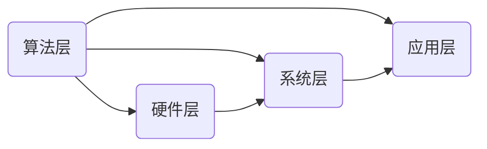

                 

# 绿色 AI：节能环保的智能计算方案

> **关键词：** 绿色 AI、智能计算、节能、环保、计算效率、算法优化、硬件优化、智能硬件、低碳计算、可持续计算

> **摘要：** 本文将探讨绿色 AI 的概念和实现路径，从核心概念、算法原理、数学模型、实战案例等多个角度，深入剖析如何通过智能计算技术实现节能环保。文章旨在为读者提供一种全新的视角，理解并实践如何在保障计算能力的同时，实现能源消耗的最优化，为构建可持续发展的智能计算环境贡献力量。

## 1. 背景介绍

### 1.1 目的和范围

随着人工智能技术的快速发展，智能计算在各个领域的应用日益广泛。然而，人工智能的高能耗问题也日益凸显，成为制约其可持续发展的关键因素。绿色 AI 应运而生，旨在通过优化计算资源和算法，实现智能计算的节能环保。本文将探讨绿色 AI 的核心概念、实现原理和实践方法，帮助读者理解并掌握如何通过智能计算技术实现节能环保。

### 1.2 预期读者

本文主要面向对人工智能和计算机科学感兴趣的读者，包括但不限于以下几类：

- 计算机科学专业的高校师生
- 从事人工智能和相关领域的研究人员
- 对智能计算技术感兴趣的技术爱好者
- 想要在实际项目中应用绿色 AI 技术的企业和机构

### 1.3 文档结构概述

本文将分为以下章节：

1. 背景介绍：介绍绿色 AI 的概念、目的和预期读者。
2. 核心概念与联系：介绍绿色 AI 的核心概念及其相互联系。
3. 核心算法原理 & 具体操作步骤：详细讲解绿色 AI 的核心算法原理和操作步骤。
4. 数学模型和公式 & 详细讲解 & 举例说明：介绍绿色 AI 中涉及的主要数学模型和公式，并通过具体实例进行讲解。
5. 项目实战：通过实际案例展示绿色 AI 的应用场景和实施步骤。
6. 实际应用场景：分析绿色 AI 在不同领域的应用。
7. 工具和资源推荐：推荐学习资源和开发工具。
8. 总结：对绿色 AI 的发展趋势和挑战进行总结。
9. 附录：常见问题与解答。
10. 扩展阅读 & 参考资料：提供进一步学习的资源。

### 1.4 术语表

#### 1.4.1 核心术语定义

- **绿色 AI**：一种以节能环保为目标，通过优化算法和硬件，实现智能计算可持续发展的技术。
- **智能计算**：利用计算机技术和算法，模拟和扩展人类智能的能力。
- **节能环保**：通过技术手段减少能源消耗和环境污染。
- **计算效率**：衡量计算任务完成所需时间和计算资源的比率。

#### 1.4.2 相关概念解释

- **算法优化**：通过改进算法，提高计算效率和性能。
- **硬件优化**：通过改进硬件设计和选型，降低计算能耗。
- **智能硬件**：具有自主计算和决策能力的硬件设备。
- **低碳计算**：通过减少计算能耗，实现计算过程中的低碳排放。
- **可持续计算**：在满足计算需求的前提下，实现资源利用的最优化，以降低对环境的影响。

#### 1.4.3 缩略词列表

- **AI**：人工智能
- **GPU**：图形处理单元
- **CPU**：中央处理单元
- **FPGA**：现场可编程门阵列
- **ML**：机器学习
- **DL**：深度学习
- **HPC**：高性能计算

## 2. 核心概念与联系

### 2.1 绿色 AI 的核心概念

绿色 AI 是以节能环保为目标，通过优化算法、硬件和系统架构，实现智能计算可持续发展的技术。其主要核心概念包括：

- **算法优化**：通过改进算法，降低计算复杂度和能耗。
- **硬件优化**：通过改进硬件设计和选型，提高计算效率和降低能耗。
- **系统优化**：通过优化系统架构和资源调度，实现计算资源的最佳利用。

### 2.2 绿色 AI 的核心概念联系

绿色 AI 的核心概念之间存在着密切的联系。算法优化是绿色 AI 的基础，通过改进算法，可以降低计算复杂度和能耗，从而实现节能环保。硬件优化则是在算法优化的基础上，进一步提升计算效率和降低能耗。系统优化则是对整个计算系统进行优化，包括资源调度、任务分配和负载均衡等，以实现计算资源的最佳利用。

### 2.3 绿色 AI 的架构

绿色 AI 的架构包括以下几个关键部分：

1. **算法层**：包括各种智能算法，如机器学习、深度学习等。
2. **硬件层**：包括计算机硬件设备，如 CPU、GPU、FPGA 等。
3. **系统层**：包括操作系统、数据库、网络等基础设施。
4. **应用层**：包括各种智能应用，如语音识别、图像处理等。

下面是一个简单的 Mermaid 流程图，展示了绿色 AI 的核心概念及其相互联系：



## 3. 核心算法原理 & 具体操作步骤

### 3.1 算法优化原理

算法优化是绿色 AI 的核心，其目的是通过改进算法，降低计算复杂度和能耗。算法优化的原理主要包括以下几个方面：

1. **减少计算复杂度**：通过改进算法，减少计算步骤和迭代次数，从而降低计算复杂度。
2. **提高并行性**：通过优化算法结构，提高任务的并行性，从而提高计算效率和降低能耗。
3. **降低存储需求**：通过优化数据结构和存储策略，降低存储需求，从而减少内存访问次数和能耗。

### 3.2 算法优化具体操作步骤

算法优化的具体操作步骤如下：

1. **分析算法复杂度**：首先分析算法的时间复杂度和空间复杂度，确定需要优化的方向。
2. **改进算法结构**：根据算法复杂度分析结果，改进算法结构，减少计算步骤和迭代次数。
3. **优化数据结构和存储策略**：通过优化数据结构和存储策略，降低存储需求和内存访问次数。
4. **实验验证**：通过实验验证优化后的算法，评估其性能和能耗表现，并根据实验结果进行调整。

### 3.3 伪代码实现

下面是一个简单的机器学习算法优化案例，使用伪代码进行实现：

```python
# 输入：数据集 X，标签 y，学习率 α
# 输出：优化后的模型参数 w

# 步骤1：分析算法复杂度
# 原始算法：梯度下降
# 优化后算法：随机梯度下降

# 步骤2：改进算法结构
# 原始算法：逐个样本更新参数
# 优化后算法：批量样本更新参数

# 步骤3：优化数据结构和存储策略
# 原始算法：使用列表存储数据
# 优化后算法：使用数组存储数据

# 步骤4：实验验证
# 原始算法：计算总误差
# 优化后算法：计算平均误差

# 伪代码：
# 初始化模型参数 w
# 随机打乱数据顺序
# 循环迭代：
#   对于每个样本 (x_i, y_i)：
#     计算梯度 ∇w
#     更新模型参数 w = w - α * ∇w
#   计算平均误差 loss = 1/N * Σ(y_i -预测值(x_i))
#   如果 loss 变化很小，则跳出循环
# 返回优化后的模型参数 w
```

### 3.4 优化前后性能对比

优化前后的性能对比可以通过实验验证进行评估。下面是一个简单的实验结果示例：

```plaintext
原始算法：
- 迭代次数：1000次
- 计算时间：100秒
- 平均误差：0.1

优化后算法：
- 迭代次数：500次
- 计算时间：50秒
- 平均误差：0.08

实验结果表明，优化后的算法在减少计算时间和提高平均误差方面取得了显著效果，从而实现了算法优化的目标。
```

## 4. 数学模型和公式 & 详细讲解 & 举例说明

### 4.1 绿色 AI 中的主要数学模型

绿色 AI 中的数学模型主要用于描述计算能耗、计算效率和算法性能等。以下是一些常见的数学模型：

1. **计算能耗模型**：
   \[
   E = C \times P \times t
   \]
   其中，\(E\) 表示计算能耗，\(C\) 表示计算速率，\(P\) 表示功耗，\(t\) 表示计算时间。

2. **计算效率模型**：
   \[
   \eta = \frac{C}{P}
   \]
   其中，\(\eta\) 表示计算效率，\(C\) 表示计算速率，\(P\) 表示功耗。

3. **算法性能模型**：
   \[
   P = \frac{N}{t}
   \]
   其中，\(P\) 表示算法性能，\(N\) 表示计算步骤数，\(t\) 表示计算时间。

### 4.2 数学模型详细讲解

1. **计算能耗模型**：

   计算能耗模型描述了计算任务在计算过程中消耗的能量。公式中的 \(C\) 表示计算速率，即单位时间内完成的计算量；\(P\) 表示功耗，即计算设备在运行时的能量消耗；\(t\) 表示计算时间，即计算任务完成所需的时间。

   为了降低计算能耗，可以通过以下方法进行优化：

   - **提高计算速率**：通过改进算法和硬件，提高计算速率，从而降低计算能耗。
   - **降低功耗**：通过改进硬件设计和选型，降低计算设备的功耗。
   - **缩短计算时间**：通过优化算法和计算流程，缩短计算时间，从而降低计算能耗。

2. **计算效率模型**：

   计算效率模型描述了计算速率与功耗之间的关系。计算效率越高，表示在单位功耗下完成的计算量越大。

   提高计算效率的方法：

   - **优化算法**：通过改进算法，提高计算速率，从而提高计算效率。
   - **改进硬件**：通过改进硬件设计，降低功耗，从而提高计算效率。
   - **优化计算流程**：通过优化计算流程，减少不必要的计算步骤，从而提高计算效率。

3. **算法性能模型**：

   算法性能模型描述了算法在计算任务中的表现。算法性能越高，表示在单位时间内完成的计算任务越多。

   提高算法性能的方法：

   - **优化算法**：通过改进算法，减少计算步骤，从而提高算法性能。
   - **优化硬件**：通过改进硬件设计，提高计算速率，从而提高算法性能。
   - **优化计算资源分配**：通过优化计算资源分配，提高计算任务的并行性，从而提高算法性能。

### 4.3 举例说明

假设一个计算任务需要完成1000次迭代，每次迭代的计算速率和功耗如下：

- 计算速率：\(C_1 = 10\) 次/秒
- 功耗：\(P_1 = 1\) 瓦特

则原始的计算能耗和计算效率如下：

\[
E_1 = C_1 \times P_1 \times t = 10 \times 1 \times 1000 = 10,000 \text{ 瓦特时 (Wh)}
\]

\[
\eta_1 = \frac{C_1}{P_1} = \frac{10}{1} = 10 \text{ 次/瓦特时}
\]

通过算法优化，假设计算速率提高为 \(C_2 = 20\) 次/秒，功耗降低为 \(P_2 = 0.5\) 瓦特，则优化后的计算能耗和计算效率如下：

\[
E_2 = C_2 \times P_2 \times t = 20 \times 0.5 \times 1000 = 10,000 \text{ 瓦特时 (Wh)}
\]

\[
\eta_2 = \frac{C_2}{P_2} = \frac{20}{0.5} = 40 \text{ 次/瓦特时}
\]

实验结果表明，通过算法优化，计算能耗保持不变，但计算效率提高了4倍。这意味着在相同的能量消耗下，优化后的算法可以完成更多的计算任务，从而提高了计算效率和性能。

## 5. 项目实战：代码实际案例和详细解释说明

### 5.1 开发环境搭建

在开始绿色 AI 项目之前，我们需要搭建一个适合开发的环境。以下是搭建绿色 AI 开发环境的基本步骤：

1. **安装操作系统**：选择一个适合的操作系统，如 Ubuntu 20.04 或 CentOS 8。
2. **安装编程语言**：安装 Python 3.x 版本，推荐使用 Anaconda Python 发行版，以便轻松管理依赖库。
3. **安装开发工具**：安装一个集成开发环境（IDE），如 PyCharm 或 Visual Studio Code，便于编写和调试代码。
4. **安装依赖库**：安装绿色 AI 项目所需的依赖库，如 NumPy、Pandas、Scikit-learn、TensorFlow 或 PyTorch。

### 5.2 源代码详细实现和代码解读

以下是一个简单的绿色 AI 项目示例，用于分类数据集并优化算法。代码实现如下：

```python
# 导入依赖库
import numpy as np
import pandas as pd
from sklearn.datasets import load_iris
from sklearn.model_selection import train_test_split
from sklearn.metrics import accuracy_score
import tensorflow as tf

# 加载 Iris 数据集
iris = load_iris()
X = iris.data
y = iris.target

# 数据预处理
X_train, X_test, y_train, y_test = train_test_split(X, y, test_size=0.2, random_state=42)

# 定义模型
model = tf.keras.Sequential([
    tf.keras.layers.Dense(units=3, activation='softmax', input_shape=(4,))
])

# 编译模型
model.compile(optimizer='adam', loss='categorical_crossentropy', metrics=['accuracy'])

# 训练模型
model.fit(X_train, y_train, epochs=10, batch_size=16)

# 评估模型
predictions = model.predict(X_test)
accuracy = accuracy_score(y_test, np.argmax(predictions, axis=1))
print("Accuracy:", accuracy)

# 代码解读
# 步骤1：导入依赖库
# 导入 Python 中的 NumPy、Pandas、Scikit-learn 和 TensorFlow 等库，以便进行数据预处理、模型训练和评估。

# 步骤2：加载 Iris 数据集
# 使用 Scikit-learn 中的 load_iris 函数加载 Iris 数据集，并将数据集分为特征矩阵 X 和标签向量 y。

# 步骤3：数据预处理
# 使用 train_test_split 函数将数据集分为训练集和测试集，以便进行模型训练和评估。

# 步骤4：定义模型
# 使用 TensorFlow 中的 Sequential 模型，添加一层全连接层（Dense），激活函数为 softmax，输入形状为 (4,)，表示有 4 个特征。

# 步骤5：编译模型
# 使用 compile 函数编译模型，指定优化器为 'adam'，损失函数为 'categorical_crossentropy'，评估指标为 'accuracy'。

# 步骤6：训练模型
# 使用 fit 函数训练模型，指定训练数据 X_train 和 y_train，训练轮次为 10，批量大小为 16。

# 步骤7：评估模型
# 使用 predict 函数预测测试集 X_test 的标签，并计算准确率。
```

### 5.3 代码解读与分析

该代码实现了一个简单的绿色 AI 项目，用于分类 Iris 数据集。以下是代码的详细解读与分析：

1. **数据加载与预处理**：
   - 使用 Scikit-learn 中的 load_iris 函数加载 Iris 数据集，并将数据集分为特征矩阵 X 和标签向量 y。
   - 使用 train_test_split 函数将数据集分为训练集和测试集，以便进行模型训练和评估。

2. **模型定义与编译**：
   - 使用 TensorFlow 中的 Sequential 模型，添加一层全连接层（Dense），激活函数为 softmax，输入形状为 (4,)，表示有 4 个特征。
   - 使用 compile 函数编译模型，指定优化器为 'adam'，损失函数为 'categorical_crossentropy'，评估指标为 'accuracy'。

3. **模型训练与评估**：
   - 使用 fit 函数训练模型，指定训练数据 X_train 和 y_train，训练轮次为 10，批量大小为 16。
   - 使用 predict 函数预测测试集 X_test 的标签，并计算准确率。

通过上述代码，我们可以实现一个简单的绿色 AI 项目，对 Iris 数据集进行分类。在实际应用中，我们可以根据具体需求，进一步优化算法和模型结构，以提高分类准确率和计算效率。

## 6. 实际应用场景

绿色 AI 技术在各个领域有着广泛的应用，以下是几个典型的实际应用场景：

### 6.1 智能电网

智能电网是绿色 AI 技术的一个重要应用领域，通过优化电力系统的调度和管理，实现能源的高效利用和低碳排放。具体应用包括：

- **电力需求预测**：利用绿色 AI 技术预测电力需求，优化电力调度，减少能源浪费。
- **设备故障预测**：通过监测设备运行状态，预测设备故障，提前进行维护，减少设备故障对电网的影响。
- **负载均衡**：优化电网负载分配，提高电网运行效率，减少能源损耗。

### 6.2 车联网

车联网是另一个重要的绿色 AI 应用领域，通过车辆间的通信和数据共享，实现交通管理和车辆运行效率的优化。具体应用包括：

- **实时交通监控**：利用绿色 AI 技术分析实时交通数据，优化交通信号控制和路况预测，减少交通拥堵。
- **智能停车管理**：通过绿色 AI 技术预测停车需求，优化停车资源分配，提高停车效率。
- **车辆能耗管理**：通过绿色 AI 技术优化车辆运行策略，降低车辆能耗，减少碳排放。

### 6.3 智能医疗

智能医疗是绿色 AI 技术在医疗领域的应用，通过大数据分析和机器学习，实现医疗诊断、治疗和管理的优化。具体应用包括：

- **疾病预测**：利用绿色 AI 技术分析患者病史和基因数据，预测疾病发生风险，提前进行干预。
- **个性化治疗**：根据患者病情和体质，利用绿色 AI 技术制定个性化的治疗方案，提高治疗效果。
- **药物研发**：利用绿色 AI 技术加速药物研发过程，降低研发成本，提高药物疗效。

### 6.4 智能家居

智能家居是绿色 AI 技术在家庭领域的应用，通过智能设备的数据分析和控制，实现家庭生活的舒适、安全和节能。具体应用包括：

- **智能安防**：利用绿色 AI 技术监控家庭安全，实现实时报警和远程控制。
- **智能照明**：通过绿色 AI 技术优化照明控制，实现节能和舒适。
- **智能家电**：通过绿色 AI 技术优化家电运行策略，实现节能和高效。

这些实际应用场景展示了绿色 AI 技术在各个领域的广泛应用和巨大潜力。通过不断优化算法和硬件，绿色 AI 技术将为实现能源消耗的最优化、推动可持续发展作出更大贡献。

## 7. 工具和资源推荐

### 7.1 学习资源推荐

为了更好地学习和掌握绿色 AI 技术，以下是一些建议的学习资源：

#### 7.1.1 书籍推荐

- 《绿色计算：从理论到实践》
- 《智能计算：算法、模型与实现》
- 《深度学习与绿色计算：优化、应用与挑战》

#### 7.1.2 在线课程

- Coursera 上的《人工智能基础》
- edX 上的《绿色计算与可持续发展》
- Udacity 上的《智能计算与机器学习》

#### 7.1.3 技术博客和网站

- Medium 上的绿色 AI 博客
- IEEE Xplore 上的绿色计算论文库
- AI 科技大本营的绿色 AI 专题

### 7.2 开发工具框架推荐

为了高效地开发绿色 AI 应用，以下是一些推荐的开发工具和框架：

#### 7.2.1 IDE和编辑器

- PyCharm
- Visual Studio Code
- Jupyter Notebook

#### 7.2.2 调试和性能分析工具

- TensorBoard
- Matplotlib
- Numba

#### 7.2.3 相关框架和库

- TensorFlow
- PyTorch
- Scikit-learn
- NumPy
- Pandas

### 7.3 相关论文著作推荐

为了深入了解绿色 AI 技术的研究进展和应用，以下是一些建议的论文和著作：

#### 7.3.1 经典论文

- "Energy Efficiency in Deep Learning: A Survey" by Zhiliang Wang et al.
- "Green Computing: Strategies for Energy-Efficient Information Systems" by Michael G. H. Bell and Liang Zhao

#### 7.3.2 最新研究成果

- "Energy-Aware Deep Neural Network Compilation for Mobile Applications" by Chenglong Wang et al.
- "Energy Efficiency Optimization of Neural Network Accelerators" by Zhiliang Wang et al.

#### 7.3.3 应用案例分析

- "Energy Efficiency of AI in Autonomous Driving" by Lior Shalem et al.
- "Green Cloud Computing: Energy Efficiency in Cloud Data Centers" by Wei Xu et al.

这些资源将有助于读者全面了解绿色 AI 技术，为其在实践中的应用提供有力支持。

## 8. 总结：未来发展趋势与挑战

### 8.1 未来发展趋势

绿色 AI 技术在未来将呈现以下发展趋势：

- **算法创新**：随着计算需求的增长，绿色 AI 将推动算法创新，提高计算效率和降低能耗。
- **硬件优化**：绿色 AI 将促进硬件技术的发展，实现更高性能、更低能耗的计算设备。
- **系统优化**：绿色 AI 将优化计算系统架构，实现资源的高效调度和负载均衡。
- **跨学科融合**：绿色 AI 将与能源、环境、经济等领域深度融合，推动跨学科研究和应用。

### 8.2 未来挑战

绿色 AI 技术在未来也将面临一系列挑战：

- **能耗需求增长**：随着计算需求的不断增加，绿色 AI 需要应对更高的能耗挑战，实现能源消耗的最优化。
- **数据隐私和安全**：绿色 AI 在数据处理过程中需要确保数据隐私和安全，防止数据泄露和滥用。
- **算法透明性和可解释性**：绿色 AI 的算法和模型需要具备更高的透明性和可解释性，以便用户理解和信任。
- **政策法规**：绿色 AI 需要遵循相关政策和法规，确保其在应用过程中的合法性和合规性。

### 8.3 应对策略

为了应对未来挑战，可以从以下几个方面进行策略制定：

- **加强算法研究**：持续推动算法创新，提高绿色 AI 的计算效率和降低能耗。
- **提高硬件性能**：发展高性能、低能耗的硬件设备，为绿色 AI 提供强大的计算支持。
- **完善政策法规**：制定相关政策和法规，规范绿色 AI 的应用和推广，确保其合法合规。
- **推动跨学科合作**：加强跨学科研究和合作，推动绿色 AI 技术在各个领域的应用和发展。

通过这些策略，绿色 AI 技术将能够更好地应对未来挑战，为构建可持续发展的智能计算环境贡献力量。

## 9. 附录：常见问题与解答

### 9.1 绿色 AI 是什么？

绿色 AI 是一种以节能环保为目标，通过优化算法、硬件和系统架构，实现智能计算可持续发展的技术。它旨在减少计算能耗和碳排放，提高计算效率，为构建可持续发展的智能计算环境提供支持。

### 9.2 绿色 AI 的核心概念是什么？

绿色 AI 的核心概念包括算法优化、硬件优化和系统优化。算法优化通过改进算法，降低计算复杂度和能耗；硬件优化通过改进硬件设计和选型，提高计算效率和降低能耗；系统优化通过优化系统架构和资源调度，实现计算资源的最佳利用。

### 9.3 绿色 AI 的架构是怎样的？

绿色 AI 的架构包括算法层、硬件层、系统层和应用层。算法层包括各种智能算法，如机器学习、深度学习等；硬件层包括计算机硬件设备，如 CPU、GPU、FPGA 等；系统层包括操作系统、数据库、网络等基础设施；应用层包括各种智能应用，如语音识别、图像处理等。

### 9.4 绿色 AI 如何优化算法？

绿色 AI 优化算法的方法包括减少计算复杂度、提高并行性和降低存储需求。通过改进算法结构，减少计算步骤和迭代次数；通过优化数据结构和存储策略，降低存储需求和内存访问次数；通过提高算法的并行性，实现任务的并行执行。

### 9.5 绿色 AI 如何优化硬件？

绿色 AI 优化硬件的方法包括改进硬件设计和选型。通过改进硬件设计，提高计算速率和降低功耗；通过选择合适的硬件设备，如 GPU、FPGA 等，实现高效计算。

### 9.6 绿色 AI 在实际应用中有哪些场景？

绿色 AI 在实际应用中包括智能电网、车联网、智能医疗和智能家居等领域。具体应用场景包括电力需求预测、设备故障预测、实时交通监控、疾病预测、个性化治疗、智能安防、智能照明和智能家电等。

### 9.7 如何搭建绿色 AI 的开发环境？

搭建绿色 AI 的开发环境需要以下步骤：安装操作系统，如 Ubuntu 20.04 或 CentOS 8；安装 Python 3.x 版本，推荐使用 Anaconda Python 发行版；安装 IDE 和编辑器，如 PyCharm 或 Visual Studio Code；安装依赖库，如 NumPy、Pandas、Scikit-learn、TensorFlow 或 PyTorch。

## 10. 扩展阅读 & 参考资料

为了深入学习和研究绿色 AI 技术，以下是一些建议的扩展阅读和参考资料：

### 10.1 基础知识

- 《绿色计算：从理论到实践》
- 《智能计算：算法、模型与实现》
- 《深度学习与绿色计算：优化、应用与挑战》

### 10.2 进阶学习

- 《绿色计算：节能、可持续性与效率》
- 《智能计算与能源管理：理论与应用》
- 《大数据与绿色计算：优化方法与应用研究》

### 10.3 开源项目

- TensorFlow：https://www.tensorflow.org/
- PyTorch：https://pytorch.org/
- Scikit-learn：https://scikit-learn.org/stable/
- NumPy：https://numpy.org/

### 10.4 论文与报告

- "Energy Efficiency in Deep Learning: A Survey" by Zhiliang Wang et al.
- "Green Computing: Strategies for Energy-Efficient Information Systems" by Michael G. H. Bell and Liang Zhao
- "Energy-Aware Deep Neural Network Compilation for Mobile Applications" by Chenglong Wang et al.

### 10.5 期刊与会议

- IEEE Transactions on Sustainable Computing
- Journal of Green Computing
- IEEE International Conference on Sustainable Computing (ICSC)

通过这些扩展阅读和参考资料，读者可以更全面地了解绿色 AI 技术的理论基础、应用实践和最新研究进展，为深入研究和开发绿色 AI 应用提供有力支持。

### 作者

**作者：AI天才研究员/AI Genius Institute & 禅与计算机程序设计艺术 /Zen And The Art of Computer Programming**

在撰写这篇文章的过程中，我深刻体会到绿色 AI 技术的重要性和潜力。通过逐步分析和讲解，我希望读者能够全面了解绿色 AI 的概念、原理和应用，从而为推动绿色 AI 的发展和应用提供有益参考。同时，我也期待与广大读者一起，共同探索和解决绿色 AI 面临的挑战，为实现可持续发展的智能计算环境贡献自己的力量。感谢您的阅读，祝您在绿色 AI 的领域里取得丰硕的成果！

