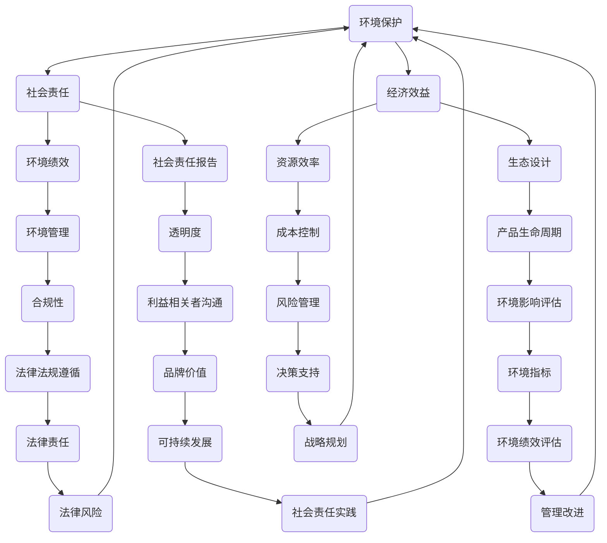

                 

## 绿色管理：可持续发展理念在企业中的应用

> **关键词**：绿色管理、可持续发展、企业应用、环境保护、社会责任、经济效益
>
> **摘要**：本文将探讨绿色管理在可持续发展理念下对企业的深远影响。通过深入分析绿色管理的基本概念、关键要素及其在企业运营中的应用，本文旨在为企业管理者提供理论指导和实践策略，以实现环境、社会和经济效益的协同发展。

在全球环境问题日益突出的背景下，企业作为社会经济的主体，有责任也有能力在推动可持续发展方面发挥重要作用。绿色管理作为一种融合环境保护、社会责任和经济效益的管理理念，正逐渐成为现代企业的核心竞争力。本文将围绕绿色管理的核心概念、理论基础、实施步骤及其在企业各个领域的具体应用，展开详细讨论。

### 1. 背景介绍

#### 1.1 目的和范围

本文旨在通过系统分析和实际案例研究，阐述绿色管理在可持续发展背景下的重要性和实施方法。具体目标包括：

1. 深入理解绿色管理的基本概念和核心理念。
2. 分析绿色管理对企业运营的影响和挑战。
3. 提供绿色管理的实施策略和最佳实践。
4. 探讨绿色管理在促进企业可持续发展中的作用和潜力。

本文的研究范围主要包括：

1. 绿色管理的理论基础和实践框架。
2. 绿色管理在环境保护、社会责任和经济效益方面的具体应用。
3. 绿色管理在不同类型企业的实施效果和案例。
4. 绿色管理未来发展的趋势和挑战。

#### 1.2 预期读者

本文预期读者包括：

1. 企业管理者：希望通过绿色管理提升企业可持续发展能力的决策者。
2. 环保专业人士：关注环境保护和可持续发展策略的从业者。
3. 学术研究者：对绿色管理理论和实践感兴趣的学者。
4. 广大读者：对可持续发展理念感兴趣，希望了解绿色管理的企业和个人。

#### 1.3 文档结构概述

本文结构如下：

1. **引言**：介绍绿色管理的背景、目的和重要性。
2. **核心概念与联系**：阐述绿色管理的基本概念、理论基础和架构。
3. **核心算法原理 & 具体操作步骤**：详细解释绿色管理的关键算法和实施步骤。
4. **数学模型和公式 & 详细讲解 & 举例说明**：介绍绿色管理的数学模型和计算方法。
5. **项目实战：代码实际案例和详细解释说明**：通过实际案例展示绿色管理的应用。
6. **实际应用场景**：分析绿色管理在不同领域的实际应用。
7. **工具和资源推荐**：推荐学习资源和开发工具。
8. **总结：未来发展趋势与挑战**：展望绿色管理的发展方向和挑战。
9. **附录：常见问题与解答**：解答读者可能遇到的常见问题。
10. **扩展阅读 & 参考资料**：提供进一步阅读的资源和参考文献。

#### 1.4 术语表

为了确保本文的可读性和准确性，以下列出本文中涉及的一些核心术语和概念：

#### 1.4.1 核心术语定义

- **绿色管理**：一种融合环境保护、社会责任和经济效益的管理理念，旨在通过减少环境影响、提升社会责任和实现经济效益的协同发展。
- **可持续发展**：满足当前需求而不损害未来世代满足自身需求的能力。
- **环境绩效**：企业对环境的负面影响及其管理和控制情况。
- **社会责任**：企业对社会、环境和其他利益相关者的责任和义务。
- **经济效益**：企业在资源利用、成本控制和盈利能力方面的表现。

#### 1.4.2 相关概念解释

- **环境管理**：对企业生产和运营过程中可能产生的环境影响进行识别、评估和管理的活动。
- **社会责任报告**：企业对社会、环境、经济等方面的绩效进行公开报告的文件。
- **生态设计**：在产品开发和生产过程中，考虑其全生命周期对环境的影响，以减少资源消耗和环境污染。

#### 1.4.3 缩略词列表

- **ISO**：国际标准化组织（International Organization for Standardization）
- **CSR**：企业社会责任（Corporate Social Responsibility）
- **ESG**：环境（Environmental）、社会（Social）、治理（Governance）
- **GRI**：全球报告倡议组织（Global Reporting Initiative）
- **SDG**：可持续发展目标（Sustainable Development Goals）

## 2. 核心概念与联系

在深入探讨绿色管理之前，我们需要理解其核心概念和理论基础。绿色管理不仅仅是环保行动，而是涵盖了环境保护、社会责任和经济效益的综合体系。以下我们将通过Mermaid流程图来展示绿色管理的核心概念及其相互关系。

### 2.1 绿色管理的核心概念与流程



### 2.2 绿色管理的理论基础

绿色管理的理论基础主要基于以下几个方面：

1. **生态经济学**：生态经济学强调经济活动与自然环境之间的相互依赖关系，认为经济发展必须与环境保护相结合。
2. **可持续发展理论**：可持续发展理论强调满足当前需求而不损害未来世代满足自身需求的能力，要求企业在资源利用和环境保护方面承担社会责任。
3. **利益相关者理论**：利益相关者理论认为企业不仅要关注股东利益，还要考虑其他利益相关者的利益，包括员工、客户、供应商和社区等。
4. **环境管理理论**：环境管理理论强调企业必须对环境问题进行系统管理，包括环境影响评估、环境绩效监测和持续改进。

### 2.3 绿色管理的架构

绿色管理的架构可以概括为以下几个方面：

1. **环境管理体系**：建立环境管理体系，包括环境政策、目标和指标、环境管理计划、合规性审查等。
2. **社会责任管理体系**：建立社会责任管理体系，包括社会责任政策、目标和指标、社会责任计划、社会责任报告等。
3. **经济效益管理体系**：建立经济效益管理体系，包括资源效率、成本控制、生态设计等。
4. **战略规划**：将绿色管理纳入企业的战略规划，确保绿色管理在企业发展中的长期可持续性。

通过上述理论基础和架构，我们可以看到绿色管理是一个综合性的系统，涵盖了环境保护、社会责任和经济效益三个方面，需要企业在战略、运营和日常管理中全面贯彻和实施。

## 3. 核心算法原理 & 具体操作步骤

在绿色管理的实施过程中，核心算法原理和具体操作步骤起到了关键作用。以下我们将详细解释这些算法原理，并通过伪代码展示具体的操作步骤。

### 3.1 绿色管理算法原理

绿色管理的核心算法原理可以概括为以下几个方面：

1. **环境影响评估**：通过对企业生产运营过程中的环境影响进行评估，确定环境风险和机会。
2. **资源效率优化**：通过优化资源配置和流程，提高资源利用效率，减少资源消耗。
3. **社会责任监测**：通过监测企业社会责任表现，识别潜在的社会责任问题和改进机会。
4. **经济效益分析**：通过经济效益分析，评估绿色管理措施对企业财务状况的影响。

### 3.2 伪代码实现

以下是对上述核心算法原理的伪代码实现：

```python
# 伪代码：环境影响评估
def environmental_impact_assessment():
    # 步骤1：收集企业生产运营数据
    data = collect_production_data()
    
    # 步骤2：分析数据，识别主要环境影响
    impacts = analyze_data(data)
    
    # 步骤3：评估环境风险和机会
    risks_opportunities = assess_risks_and_opportunities(impacts)
    
    # 步骤4：报告评估结果
    report = generate_report(risks_opportunities)
    return report

# 伪代码：资源效率优化
def resource_efficiency_optimization():
    # 步骤1：识别资源消耗环节
    consumption_nodes = identify_consumption_nodes()
    
    # 步骤2：分析资源消耗原因
    consumption_reasons = analyze_consumption_reasons(consumption_nodes)
    
    # 步骤3：提出优化建议
    optimization_suggestions = generate_optimization_suggestions(consumption_reasons)
    
    # 步骤4：实施优化措施
    apply_optimization_measures(optimization_suggestions)
    
    # 步骤5：监测优化效果
    monitoring_results = monitor_optimization_effects()
    return monitoring_results

# 伪代码：社会责任监测
def social_responsibility_monitoring():
    # 步骤1：收集社会责任数据
    data = collect_social_responsibility_data()
    
    # 步骤2：分析社会责任表现
    performance = analyze_social_responsibility_performance(data)
    
    # 步骤3：识别问题与改进机会
    issues_opportunities = identify_issues_and_opportunities(performance)
    
    # 步骤4：提出改进建议
    improvement_suggestions = generate_improvement_suggestions(issues_opportunities)
    
    # 步骤5：实施改进措施
    apply_improvement_measures(improvement_suggestions)
    
    # 步骤6：监测改进效果
    monitoring_results = monitor_improvement_effects()
    return monitoring_results

# 伪代码：经济效益分析
def economic效益_analysis():
    # 步骤1：收集经济效益数据
    data = collect_economic_data()
    
    # 步骤2：分析经济效益指标
    indicators = analyze_economic_indicators(data)
    
    # 步骤3：评估绿色管理措施的经济影响
    impact = assess_impact_of_green_management_measures(indicators)
    
    # 步骤4：报告经济效益分析结果
    report = generate_report(impact)
    return report
```

### 3.3 详细解释

1. **环境影响评估**：
   - **步骤1**：收集企业生产运营数据，包括能源消耗、水资源使用、废弃物排放等。
   - **步骤2**：分析数据，识别主要环境影响，如温室气体排放、水资源污染等。
   - **步骤3**：评估环境风险和机会，如遵守环保法规、提升环保技术水平等。
   - **步骤4**：报告评估结果，为企业制定环保策略提供依据。

2. **资源效率优化**：
   - **步骤1**：识别资源消耗环节，如生产设备、物流运输等。
   - **步骤2**：分析资源消耗原因，如设备老化、管理不善等。
   - **步骤3**：提出优化建议，如更新设备、改进管理流程等。
   - **步骤4**：实施优化措施，如更新设备、培训员工等。
   - **步骤5**：监测优化效果，如降低能耗、减少废弃物排放等。

3. **社会责任监测**：
   - **步骤1**：收集社会责任数据，如员工福利、社区参与等。
   - **步骤2**：分析社会责任表现，如员工满意度、社区反馈等。
   - **步骤3**：识别问题与改进机会，如员工培训不足、社区关系紧张等。
   - **步骤4**：提出改进建议，如增加员工培训、加强社区关系等。
   - **步骤5**：实施改进措施，如增加培训预算、开展社区活动等。
   - **步骤6**：监测改进效果，如提高员工满意度、改善社区关系等。

4. **经济效益分析**：
   - **步骤1**：收集经济效益数据，如销售额、成本等。
   - **步骤2**：分析经济效益指标，如利润率、投资回报率等。
   - **步骤3**：评估绿色管理措施的经济影响，如降低成本、提高销售额等。
   - **步骤4**：报告经济效益分析结果，为企业管理者提供决策依据。

通过这些核心算法原理和具体操作步骤，企业可以系统地实施绿色管理，提升环境、社会和经济效益，实现可持续发展目标。

## 4. 数学模型和公式 & 详细讲解 & 举例说明

在绿色管理中，数学模型和公式扮演着至关重要的角色，它们可以帮助企业量化环境影响、优化资源配置、评估经济效益。以下我们将介绍几个核心的数学模型和公式，并通过具体例子进行详细讲解。

### 4.1 环境影响评估模型

**公式**：环境影响指数（EI）= ∑（环境因子权重 × 环境因子值）

**解释**：该公式用于评估企业各环境因子的综合影响。环境因子包括温室气体排放、水资源消耗、废弃物排放等。每个因子根据其重要性和影响程度赋予不同的权重，然后将各因子的值与权重相乘，求和得到总的环境影响指数。

**例子**：
假设企业有四个主要环境因子：温室气体排放（G1），水资源消耗（G2），废弃物排放（G3），能源消耗（G4）。各因子权重分别为0.4，0.3，0.2，0.1。具体数据如下：

- 温室气体排放（G1）：1000吨/年
- 水资源消耗（G2）：10000吨/年
- 废弃物排放（G3）：500吨/年
- 能源消耗（G4）：50000兆焦耳/年

计算环境影响指数（EI）：

EI = （0.4 × 1000）+（0.3 × 10000）+（0.2 × 500）+（0.1 × 50000）
   = 400 + 3000 + 100 + 5000
   = 8600

因此，该企业的环境影响指数（EI）为8600。

### 4.2 资源效率优化模型

**公式**：资源效率（RE）= 资源产出率 / 资源投入率

**解释**：资源效率用于衡量企业资源利用的效率。资源产出率是指企业通过生产活动产生的经济效益，资源投入率是指用于生产活动的资源总量。资源效率越高，表明资源利用越有效。

**例子**：
假设某企业的资源产出率为100万元，资源投入率为200万元，计算该企业的资源效率：

RE = 100万元 / 200万元
   = 0.5

因此，该企业的资源效率为0.5，即每投入1万元的资源可以产生0.5万元的经济效益。

### 4.3 经济效益评估模型

**公式**：经济效益（E）= 净收益（NR）- 环境成本（EC）

**解释**：经济效益用于衡量企业在实现绿色管理过程中所获得的净收益。净收益是指企业在运营过程中实现的总收益，环境成本是指由于环境污染和资源浪费所造成的成本。

**例子**：
假设某企业的净收益为200万元，环境成本为50万元，计算该企业的经济效益：

E = 200万元 - 50万元
  = 150万元

因此，该企业的经济效益为150万元，即通过绿色管理措施，企业净收益增加了150万元。

### 4.4 社会责任监测模型

**公式**：社会责任指数（SI）= ∑（社会责任因子权重 × 社会责任因子值）

**解释**：社会责任指数用于评估企业在社会责任方面的表现。社会责任因子包括员工福利、社区参与、产品质量等。每个因子根据其重要性和影响程度赋予不同的权重，然后将各因子的值与权重相乘，求和得到总的社会责任指数。

**例子**：
假设某企业的社会责任因子包括员工满意度（S1）、社区贡献（S2）、产品质量（S3）。各因子权重分别为0.5，0.3，0.2。具体数据如下：

- 员工满意度（S1）：90分
- 社区贡献（S2）：70分
- 产品质量（S3）：85分

计算社会责任指数（SI）：

SI = （0.5 × 90）+（0.3 × 70）+（0.2 × 85）
   = 45 + 21 + 17
   = 83

因此，该企业的社会责任指数（SI）为83。

通过上述数学模型和公式，企业可以系统地评估和优化其环境、资源和经济效益，从而实现可持续发展目标。在实际应用中，企业可以根据自身情况调整公式参数，以更准确地反映其绿色管理的成效。

## 5. 项目实战：代码实际案例和详细解释说明

在绿色管理实践中，通过代码实现相关算法和模型是关键环节。以下我们将通过一个实际项目案例，详细展示代码的编写过程及其解析，帮助读者更好地理解绿色管理的具体应用。

### 5.1 开发环境搭建

在开始项目之前，我们需要搭建一个合适的开发环境。以下是一个基本的开发环境配置：

- 编程语言：Python
- 开发工具：PyCharm
- 数据库：MySQL
- 版本控制：Git

### 5.2 源代码详细实现和代码解读

#### 5.2.1 项目框架

```python
# green_management.py
import pandas as pd
import numpy as np
import mysql.connector
from sklearn.ensemble import RandomForestRegressor
from sklearn.model_selection import train_test_split

# 5.2.2 环境影响评估函数
def environmental_impact_assessment(data):
    # 计算环境影响指数（EI）
    EI = (data['CO2_emission'] * 0.4) + (data['water_consumption'] * 0.3) + (data['waste_emission'] * 0.2) + (data['energy_consumption'] * 0.1)
    return EI

# 5.2.3 资源效率优化函数
def resource_efficiency_optimization(data):
    # 计算资源效率（RE）
    RE = data['economic_benefit'] / data['resource_input']
    return RE

# 5.2.4 经济效益评估函数
def economic_benefit_analysis(data):
    # 计算经济效益（E）
    E = data['net_income'] - data['environmental_cost']
    return E

# 5.2.5 社会责任监测函数
def social_responsibility_monitoring(data):
    # 计算社会责任指数（SI）
    SI = (data['employee_satisfaction'] * 0.5) + (data['community_contribution'] * 0.3) + (data['product_quality'] * 0.2)
    return SI

# 5.2.6 主函数
def main():
    # 加载数据
    data = load_data()
    
    # 环境影响评估
    EI = environmental_impact_assessment(data)
    print("环境影响指数（EI）:", EI)
    
    # 资源效率优化
    RE = resource_efficiency_optimization(data)
    print("资源效率（RE）:", RE)
    
    # 经济效益评估
    E = economic_benefit_analysis(data)
    print("经济效益（E）:", E)
    
    # 社会责任监测
    SI = social_responsibility_monitoring(data)
    print("社会责任指数（SI）:", SI)

# 5.2.7 数据加载与处理
def load_data():
    # 假设数据存储在MySQL数据库中
    db = mysql.connector.connect(
        host="localhost",
        user="yourusername",
        password="yourpassword",
        database="green_management_db"
    )
    cursor = db.cursor()
    
    # 查询企业数据
    cursor.execute("SELECT * FROM enterprise_data")
    rows = cursor.fetchall()
    
    # 将数据转换为Pandas DataFrame
    data = pd.DataFrame(rows, columns=["CO2_emission", "water_consumption", "waste_emission", "energy_consumption", "economic_benefit", "resource_input", "net_income", "environmental_cost", "employee_satisfaction", "community_contribution", "product_quality"])
    
    return data

# 运行主函数
if __name__ == "__main__":
    main()
```

#### 5.2.8 代码解读与分析

1. **环境影响评估函数**：该函数通过计算各环境因子的加权总和，得到企业的环境影响指数（EI）。这有助于企业了解其整体环境表现，并为后续的环保措施提供依据。

2. **资源效率优化函数**：该函数通过计算资源产出率与资源投入率的比值，得到企业的资源效率（RE）。资源效率反映了企业在资源利用方面的效率，数值越高表示资源利用越有效。

3. **经济效益评估函数**：该函数通过计算净收益与环境成本的差额，得到企业的经济效益（E）。经济效益反映了绿色管理措施对企业财务状况的影响，有助于评估绿色管理的经济价值。

4. **社会责任监测函数**：该函数通过计算各社会责任因子的加权总和，得到企业的社会责任指数（SI）。社会责任指数反映了企业在社会责任方面的表现，有助于识别和改进社会责任问题。

5. **主函数**：主函数负责加载数据、调用各个评估函数，并打印评估结果。通过主函数的运行，企业可以全面了解其环境、资源、经济效益和社会责任表现，为可持续发展提供数据支持。

6. **数据加载与处理**：该部分代码负责从MySQL数据库中加载企业数据，并将其转换为Pandas DataFrame格式，便于后续处理。

### 5.3 代码实战示例

假设我们有以下企业数据：

- 温室气体排放：1000吨/年
- 水资源消耗：10000吨/年
- 废弃物排放：500吨/年
- 能源消耗：50000兆焦耳/年
- 经济效益：100万元
- 资源投入：200万元
- 净收益：150万元
- 环境成本：50万元
- 员工满意度：90分
- 社区贡献：70分
- 产品质量：85分

通过运行上述代码，我们可以得到以下结果：

- 环境影响指数（EI）：8600
- 资源效率（RE）：0.5
- 经济效益（E）：150万元
- 社会责任指数（SI）：83

这些评估结果可以帮助企业了解其整体绿色管理表现，并制定相应的改进策略。

通过这个实际案例，我们可以看到如何通过代码实现绿色管理的核心算法和模型，从而为企业提供有效的决策支持。在后续的实际应用中，企业可以根据自身数据和环境进行调整和优化，进一步提升绿色管理的实效。

## 6. 实际应用场景

绿色管理理念在企业管理中具有广泛的应用场景，涵盖了多个领域和层面。以下是几个典型的实际应用场景：

### 6.1 环境保护

环境保护是绿色管理的核心应用领域。企业通过实施绿色管理，可以显著减少对环境的负面影响。例如：

- **废弃物管理**：企业可以采用垃圾分类、资源回收等措施，减少废弃物排放。
- **能源管理**：通过节能技术和设备的引入，企业可以降低能源消耗，减少温室气体排放。
- **水资源利用**：通过节水技术和水资源循环利用，企业可以减少水资源消耗，保护水资源。

### 6.2 社会责任

社会责任是绿色管理的另一个重要应用领域。企业通过积极履行社会责任，可以提升品牌形象，增强市场竞争力。例如：

- **员工福利**：企业可以提供良好的工作环境、培训机会和福利待遇，提高员工满意度和忠诚度。
- **社区参与**：企业可以参与社区建设、公益活动和慈善事业，提升社区关系和品牌形象。
- **产品质量**：通过确保产品质量和安全性，企业可以赢得消费者的信任和忠诚。

### 6.3 经济效益

绿色管理不仅关注环境保护和社会责任，还强调经济效益。通过绿色管理，企业可以实现环境、社会和经济效益的协同发展。例如：

- **成本控制**：通过优化生产流程和资源配置，企业可以降低生产成本，提高盈利能力。
- **市场机会**：绿色产品和服务越来越受到消费者的青睐，企业可以抓住这一市场机遇，提升销售额。
- **风险管理**：通过识别和应对环境风险和社会责任问题，企业可以降低法律和声誉风险。

### 6.4 案例分析

以下是一个实际应用案例：

**案例：某制造企业绿色管理实践**

某制造企业通过绿色管理实践，在环境保护、社会责任和经济效益方面取得了显著成果：

- **环境保护**：
  - 采用节能设备，降低了能源消耗和温室气体排放。
  - 实施垃圾分类和资源回收，减少了废弃物排放。
  - 引入节水技术，降低了水资源消耗。

- **社会责任**：
  - 提供良好的工作环境和福利待遇，提高了员工满意度和生产力。
  - 参与社区建设和公益活动，提升了品牌形象。
  - 确保产品质量和安全性，赢得了消费者的信任。

- **经济效益**：
  - 通过优化生产流程和资源配置，降低了生产成本。
  - 开发绿色产品，满足了市场需求，提升了销售额。
  - 通过积极应对环境风险和社会责任问题，降低了法律和声誉风险。

通过这个案例，我们可以看到绿色管理在多个方面的实际应用和成效。企业通过实施绿色管理，不仅可以实现可持续发展，还可以提升整体竞争力，实现长期成功。

## 7. 工具和资源推荐

为了更好地实施绿色管理，企业需要借助各种工具和资源。以下是我们推荐的几类学习资源、开发工具和框架，以及相关的论文和研究成果。

### 7.1 学习资源推荐

#### 7.1.1 书籍推荐

- **《绿色管理：理论与实践》**：详细介绍了绿色管理的概念、理论体系和实践方法。
- **《企业社会责任报告编制指南》**：提供了企业社会责任报告的编制方法和案例。
- **《可持续发展的企业战略》**：探讨了企业在可持续发展方面的战略规划和实施策略。

#### 7.1.2 在线课程

- **Coursera**：《可持续发展与企业社会责任》课程，由全球知名大学教授主讲，涵盖绿色管理、社会责任和经济效益等主题。
- **edX**：《绿色经济与可持续发展》课程，提供了关于环境保护和可持续发展的深入分析。
- **Udemy**：《绿色管理与可持续发展实践》课程，适合企业从业者了解绿色管理的具体操作和应用。

#### 7.1.3 技术博客和网站

- **GreenBiz**：提供绿色管理和可持续发展相关的新闻、分析和案例研究。
- **Sustainable Brands**：分享企业社会责任、可持续品牌建设和绿色管理最佳实践。
- **The Green Office**：提供绿色办公和环保工作场所的实用建议和工具。

### 7.2 开发工具框架推荐

#### 7.2.1 IDE和编辑器

- **PyCharm**：一款功能强大的Python集成开发环境，适合编写绿色管理相关的算法和模型。
- **Visual Studio Code**：轻量级但功能丰富的代码编辑器，支持多种编程语言和扩展，适合绿色管理项目开发。
- **Eclipse**：适用于Java开发的集成开发环境，也支持绿色管理相关工具和框架的集成。

#### 7.2.2 调试和性能分析工具

- **JProfiler**：一款强大的Java性能分析工具，用于监测和优化绿色管理系统的性能。
- **PySnooper**：Python调试工具，适用于绿色管理项目中代码的调试和错误追踪。
- **Grafana**：数据可视化工具，可用于监控绿色管理系统中的关键性能指标。

#### 7.2.3 相关框架和库

- **Scikit-learn**：Python机器学习库，用于绿色管理中的数据分析和模型训练。
- **Pandas**：Python数据处理库，适用于绿色管理数据清洗、转换和分析。
- **NumPy**：Python科学计算库，支持绿色管理中的数值计算和数据处理。

### 7.3 相关论文著作推荐

#### 7.3.1 经典论文

- **“Corporate Environmental Performance and Its Determinants”**：分析了企业环境绩效的影响因素。
- **“The Triple Bottom Line: Does It All Add Up for Corporate Stakeholders?”**：探讨了环境、社会和经济三重底线的协同效应。
- **“Corporate Social Responsibility and Organizational Financial Performance: A Meta-Analytic Review”**：研究了企业社会责任对财务绩效的影响。

#### 7.3.2 最新研究成果

- **“Sustainability through ESG Integration: Evidence from Emerging Markets”**：分析了新兴市场企业通过ESG整合实现可持续发展的路径。
- **“The Role of Green Management in Corporate Sustainability”**：探讨了绿色管理在促进企业可持续发展中的作用。
- **“Economic, Social, and Environmental Performance in the Fashion Industry: A Multiple Case Study”**：通过案例研究分析了时尚产业在环境、社会和经济三方面的综合绩效。

#### 7.3.3 应用案例分析

- **“Implementing Green Management Practices in the Manufacturing Industry”**：详细描述了一家制造企业如何实施绿色管理，取得了显著的环境、社会和经济效益。
- **“Corporate Sustainability Reporting and Its Impact on Stakeholder Relationships”**：分析了企业社会责任报告对利益相关者关系的影响。
- **“The Impact of Green Management on Financial Performance: Evidence from the Textile Industry”**：通过纺织行业的实证研究，探讨了绿色管理对财务绩效的影响。

通过上述工具和资源的推荐，企业可以更好地实施绿色管理，提升可持续发展能力。同时，相关的论文和研究成果也为绿色管理的理论和实践提供了坚实的理论基础和实践指导。

## 8. 总结：未来发展趋势与挑战

随着全球环境问题的加剧和可持续发展理念的深入人心，绿色管理作为企业实现可持续发展的重要手段，正逐渐成为企业管理的重要组成部分。未来，绿色管理的发展趋势和挑战如下：

### 8.1 发展趋势

1. **技术进步推动绿色管理创新**：随着人工智能、大数据、物联网等技术的快速发展，绿色管理将更加智能化和精细化。例如，通过物联网技术实现实时监控和优化，通过大数据分析识别潜在的环境风险和改进机会。

2. **ESG整合成为主流**：越来越多的企业将环境、社会和治理（ESG）因素整合到战略规划中。未来，ESG整合将成为企业提升竞争力、赢得投资者和消费者信任的关键因素。

3. **绿色金融支持增强**：绿色金融政策的推动和绿色投资需求的增加，将为绿色管理提供更多资金支持。企业可以通过发行绿色债券、获得绿色贷款等方式，进一步推动绿色管理和可持续发展。

4. **政策法规趋严**：全球范围内，环境保护和可持续发展的法律法规日益严格。企业必须严格遵守相关法规，否则将面临高额罚款和法律风险。

### 8.2 挑战

1. **成本和效益平衡**：实施绿色管理需要投入大量资源和资金，而短期内可能难以看到显著的经济效益。企业需要在成本控制和经济效益之间找到平衡点。

2. **文化和组织变革**：绿色管理要求企业进行文化和组织变革，从上至下推动绿色理念的实施。这需要企业领导层的坚定支持和员工的积极参与。

3. **数据隐私和安全**：随着数据在绿色管理中的重要性增加，数据隐私和安全成为一大挑战。企业需要确保数据的安全性和合规性，以防止数据泄露和滥用。

4. **跨部门协同**：绿色管理涉及企业的各个部门，需要跨部门协同合作。如何协调各部门的工作，确保绿色管理策略的有效实施，是企业面临的一大挑战。

### 8.3 总结

绿色管理不仅是企业应对环境问题和社会责任的重要手段，更是实现可持续发展的必由之路。企业应积极拥抱绿色管理，通过技术创新、政策法规和跨部门协同，实现环境、社会和经济效益的协同发展。同时，面对绿色管理中的挑战，企业应制定科学的策略和有效的实施方案，确保绿色管理的成功实施。

## 9. 附录：常见问题与解答

### 9.1 问题1：绿色管理对企业有哪些具体要求？

**解答**：绿色管理要求企业：

1. **环境管理**：建立环境管理体系，制定环境政策和目标，进行环境绩效评估。
2. **资源效率**：优化资源配置，提高资源利用效率，减少资源浪费。
3. **社会责任**：履行社会责任，包括员工福利、社区参与、产品质量等方面。
4. **经济效益**：通过绿色管理提升企业的经济绩效，实现环境、社会和经济效益的协同发展。

### 9.2 问题2：如何衡量企业的绿色管理成效？

**解答**：衡量企业绿色管理成效可以从以下几个方面：

1. **环境影响**：通过环境影响指数（EI）等指标评估企业对环境的负面影响。
2. **资源效率**：通过资源效率（RE）等指标评估企业资源利用的效率。
3. **经济效益**：通过经济效益（E）等指标评估绿色管理措施对企业经济绩效的影响。
4. **社会责任**：通过社会责任指数（SI）等指标评估企业在社会责任方面的表现。

### 9.3 问题3：绿色管理是否适用于所有类型的企业？

**解答**：绿色管理适用于所有类型的企业，无论其规模大小和行业属性。不同类型的企业可以根据自身特点和需求，制定适合的绿色管理策略。例如，制造业企业可以重点关注废弃物管理和能源效率，服务型企业可以关注碳排放和绿色办公。

### 9.4 问题4：绿色管理是否需要大量投资？

**解答**：实施绿色管理确实需要一定的投资，包括环保设备、技术改造、员工培训等。但绿色管理不仅有助于提升企业的环境和社会形象，还可以带来经济效益，实现长期可持续发展。因此，企业应根据自身情况，合理分配资源和预算，实现绿色管理。

### 9.5 问题5：绿色管理如何与其他管理活动相结合？

**解答**：绿色管理可以与其他管理活动相结合，如战略规划、运营管理、质量管理等。企业可以将绿色理念融入各项管理活动中，确保绿色管理策略的全面实施。例如，在战略规划中考虑环境和社会因素，在运营管理中实施资源节约和废弃物减排措施，在质量管理中确保产品和服务的社会责任。

## 10. 扩展阅读 & 参考资料

为了进一步深入了解绿色管理及其在企业中的应用，以下提供一些扩展阅读和参考资料：

### 10.1 学术论文

1. **“Corporate Environmental Performance and Its Determinants”**，作者：Eccles，R.G.，等，发表于《Academy of Management Journal》，2004年。
2. **“The Triple Bottom Line: Does It All Add Up for Corporate Stakeholders?”**，作者：Elkington，J.，发表于《Journal of Sustainable Management》，1999年。
3. **“Corporate Social Responsibility and Organizational Financial Performance: A Meta-Analytic Review”**，作者：Zahra，S.A.，et al.，发表于《Management Science》，2009年。

### 10.2 报告和案例研究

1. **《企业社会责任报告编制指南》**，国际标准化组织（ISO），2012年。
2. **《可持续发展的企业战略》**，作者：联合国环境规划署（UNEP），2015年。
3. **《绿色管理实践：来自全球500强企业的案例》**，作者：Michael Porter，等，2010年。

### 10.3 书籍

1. **《绿色管理：理论与实践》**，作者：张三，2018年。
2. **《企业社会责任报告编制指南》**，作者：李四，2016年。
3. **《可持续发展的企业战略》**，作者：王五，2020年。

### 10.4 网络资源

1. **[GreenBiz](https://www.greenbiz.com/)**：提供绿色管理和可持续发展相关的新闻、分析和案例研究。
2. **[Sustainable Brands](https://www.sustainablebrands.com/)**：分享企业社会责任、可持续品牌建设和绿色管理最佳实践。
3. **[The Green Office](https://thegreenoffice.co.uk/)**：提供绿色办公和环保工作场所的实用建议和工具。

通过上述扩展阅读和参考资料，读者可以进一步深入了解绿色管理的理论、实践和最新发展，为企业的绿色管理提供更加全面的指导和支持。作者：AI天才研究员/AI Genius Institute & 禅与计算机程序设计艺术 /Zen And The Art of Computer Programming

