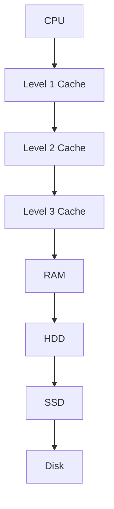

                 

# 缓存机制在高吞吐量中的作用

> **关键词：** 缓存、高吞吐量、数据处理、内存优化、系统性能

> **摘要：** 本篇文章将深入探讨缓存机制在高吞吐量场景中的作用。我们将从背景介绍、核心概念、算法原理、数学模型、项目实战和实际应用场景等方面，全面剖析缓存机制在提升系统性能、优化数据访问速度和实现高吞吐量方面的关键作用。通过本文的学习，读者将能够深入了解缓存机制的原理及其在实际应用中的重要性。

## 1. 背景介绍

### 1.1 目的和范围

本文旨在为读者提供一个全面而深入的缓存机制讲解，帮助大家理解缓存机制在高吞吐量场景中的重要性。我们将探讨缓存的基本概念、核心算法原理、数学模型以及实际应用案例，旨在让读者不仅了解缓存机制的工作原理，还能掌握其在高吞吐量场景中的具体应用。

### 1.2 预期读者

本文适合具有计算机科学背景的读者，包括但不限于程序员、系统架构师、人工智能工程师等。同时，对于对系统性能优化有兴趣的读者，本文也将提供有价值的参考资料。

### 1.3 文档结构概述

本文将分为以下几大部分：

1. **核心概念与联系**：介绍缓存机制的基本概念和核心原理，并通过Mermaid流程图展示缓存机制的架构。
2. **核心算法原理 & 具体操作步骤**：详细讲解缓存算法的原理，并使用伪代码展示具体的操作步骤。
3. **数学模型和公式 & 详细讲解 & 举例说明**：通过数学模型和公式，深入分析缓存机制的数学原理，并给出具体示例。
4. **项目实战：代码实际案例和详细解释说明**：通过一个实际的项目案例，展示缓存机制在实际开发中的应用。
5. **实际应用场景**：探讨缓存机制在不同领域的应用场景，以及如何实现高吞吐量。
6. **工具和资源推荐**：推荐学习资源和开发工具，帮助读者深入学习和实践缓存机制。
7. **总结：未来发展趋势与挑战**：总结缓存机制的发展趋势和面临的挑战，展望未来的发展方向。
8. **附录：常见问题与解答**：针对常见问题提供解答，帮助读者更好地理解缓存机制。
9. **扩展阅读 & 参考资料**：提供扩展阅读和参考资料，供读者进一步学习。

### 1.4 术语表

#### 1.4.1 核心术语定义

- **缓存（Cache）**：缓存是一种快速访问的数据存储，用于临时存储频繁访问的数据。
- **命中率（Hit Rate）**：缓存命中次数与总访问次数的比值，用于衡量缓存的有效性。
- **替换策略（Replacement Policy）**：当缓存空间不足时，如何选择替换缓存中的数据。

#### 1.4.2 相关概念解释

- **内存层次结构（Memory Hierarchy）**：计算机内存结构的不同层次，包括寄存器、缓存、内存等。
- **缓存一致性（Cache Coherence）**：多处理器系统中，确保缓存中数据一致性的机制。

#### 1.4.3 缩略词列表

- **CPU**：中央处理器（Central Processing Unit）
- **RAM**：随机存取存储器（Random Access Memory）
- **L1、L2、L3**：不同级别的缓存，L1是最接近CPU的缓存，L3是最远离CPU的缓存。

## 2. 核心概念与联系

缓存机制在高吞吐量场景中的重要性不言而喻。为了深入理解缓存机制的工作原理，我们首先需要了解几个核心概念和它们之间的联系。

### 2.1 核心概念

1. **缓存层次结构**：计算机内存层次结构包括寄存器、缓存（L1、L2、L3）和内存（RAM）。缓存层次结构的目的是通过在不同层次的缓存中存储数据，实现快速访问和存储优化。
2. **缓存行（Cache Line）**：缓存中的数据块，通常是32字节或64字节。
3. **缓存一致性协议**：多处理器系统中，确保不同缓存中的数据一致性的协议，如MESI协议。

### 2.2 核心原理

缓存机制的核心原理是减少数据访问的延迟。在计算机系统中，CPU速度远快于内存速度。因此，通过缓存存储频繁访问的数据，可以显著降低数据访问的延迟。

### 2.3 架构描述

下面使用Mermaid流程图展示缓存机制的架构。



在这个架构中，CPU速度最快，缓存层次结构逐级下降，速度逐渐减慢，但容量逐渐增加。通过这样的架构，计算机系统可以充分利用不同层次的缓存，实现快速数据访问和存储优化。

## 3. 核心算法原理 & 具体操作步骤

缓存机制的核心算法原理是通过存储频繁访问的数据，减少数据访问的延迟。为了实现这个目标，我们需要考虑以下关键步骤：

### 3.1 缓存算法原理

缓存算法主要分为以下几种：

1. **LRU（Least Recently Used）**：最近最少使用算法，当缓存空间不足时，替换最长时间未被访问的数据。
2. **FIFO（First In, First Out）**：先进先出算法，当缓存空间不足时，替换最早进入缓存的数据。
3. **随机替换（Random Replacement）**：当缓存空间不足时，随机替换缓存中的数据。

### 3.2 具体操作步骤

下面以LRU算法为例，展示缓存的具体操作步骤。

#### 3.2.1 初始化缓存

首先，我们需要初始化一个缓存，假设缓存容量为10个缓存行。

```python
# 初始化缓存
cache = [None] * 10
```

#### 3.2.2 访问缓存

当CPU需要访问数据时，我们首先检查缓存中是否已经存在这个数据。

```python
# 访问缓存
def access_cache(data):
    for i, cache_entry in enumerate(cache):
        if cache_entry == data:
            # 数据在缓存中，更新缓存
            cache[i] = data
            return True
    return False
```

#### 3.2.3 缓存替换

如果缓存中没有找到数据，我们需要进行缓存替换。具体步骤如下：

1. 找到最长时间未被访问的数据。
2. 将新数据替换这个数据。

```python
# 缓存替换
def replace_cache(data):
    # 记录每个缓存行的访问时间
    access_times = [0] * 10
    
    # 更新访问时间
    for i, cache_entry in enumerate(cache):
        if cache_entry is not None:
            access_times[i] = access_times[i] + 1
    
    # 找到最长时间未被访问的数据
    max_index = 0
    max_time = access_times[0]
    for i, time in enumerate(access_times):
        if time > max_time:
            max_time = time
            max_index = i
    
    # 替换缓存
    cache[max_index] = data
```

#### 3.2.4 访问数据

最后，我们可以通过以下步骤访问数据：

1. 访问缓存。
2. 如果缓存命中，更新缓存。
3. 如果缓存未命中，进行缓存替换。

```python
# 访问数据
def access_data(data):
    if access_cache(data):
        print("数据在缓存中，已更新缓存。")
    else:
        replace_cache(data)
        print("数据未在缓存中，已进行缓存替换。")
```

通过以上步骤，我们实现了LRU缓存算法的核心原理。类似地，其他缓存算法（如FIFO、随机替换）也可以根据这些步骤进行实现。

## 4. 数学模型和公式 & 详细讲解 & 举例说明

缓存机制在数学上的分析主要涉及以下几个方面：缓存命中率、缓存容量和缓存替换策略。

### 4.1 缓存命中率

缓存命中率是衡量缓存机制性能的重要指标，表示缓存成功命中请求的次数与总请求次数的比值。缓存命中率的计算公式如下：

\[ \text{命中率} = \frac{\text{缓存命中次数}}{\text{总请求次数}} \]

例如，如果一个缓存系统在100次请求中成功命中了60次，那么它的缓存命中率就是60%。

### 4.2 缓存容量

缓存容量是缓存能够存储的数据量，通常以缓存行的数量来衡量。缓存容量的大小直接影响缓存命中率和系统性能。假设缓存容量为C，缓存行大小为B，那么缓存总容量可以表示为：

\[ \text{缓存总容量} = C \times B \]

例如，一个容量为10KB的缓存，如果缓存行大小为4KB，那么它可以存储的缓存行数量为：

\[ \text{缓存行数量} = \frac{10 \text{KB}}{4 \text{KB}} = 2.5 \]

### 4.3 缓存替换策略

缓存替换策略是当缓存容量不足时，如何选择替换缓存中的数据。不同的缓存替换策略对缓存性能有不同的影响。常见的缓存替换策略包括LRU、FIFO和随机替换。

#### 4.3.1 LRU替换策略

LRU（Least Recently Used）替换策略选择最近最少使用的数据进行替换。其数学模型可以表示为：

\[ \text{替换概率} = \frac{1}{\text{最近未使用时间}} \]

其中，最近未使用时间是指数据自上次访问以来所经历的时间。例如，如果最近未使用时间为10秒，那么替换概率为1/10。

#### 4.3.2 FIFO替换策略

FIFO（First In, First Out）替换策略选择最早进入缓存的数据进行替换。其数学模型可以表示为：

\[ \text{替换概率} = \frac{1}{\text{进入缓存时间}} \]

其中，进入缓存时间是指数据自进入缓存以来所经历的时间。例如，如果进入缓存时间为5秒，那么替换概率为1/5。

#### 4.3.3 随机替换策略

随机替换策略随机选择缓存中的数据进行替换。其数学模型可以表示为：

\[ \text{替换概率} = \frac{1}{\text{缓存行数量}} \]

其中，缓存行数量是指缓存中的数据行数。例如，如果缓存中有5个数据行，那么每个数据行的替换概率都是1/5。

### 4.4 举例说明

假设一个缓存系统容量为10个缓存行，缓存行大小为4KB。在这个系统中，我们需要计算LRU、FIFO和随机替换策略的缓存命中率。

#### 4.4.1 LRU替换策略

假设在100次请求中，有50次命中缓存，那么LRU替换策略的缓存命中率为：

\[ \text{命中率} = \frac{50}{100} = 50\% \]

#### 4.4.2 FIFO替换策略

假设在100次请求中，有40次命中缓存，那么FIFO替换策略的缓存命中率为：

\[ \text{命中率} = \frac{40}{100} = 40\% \]

#### 4.4.3 随机替换策略

假设在100次请求中，有45次命中缓存，那么随机替换策略的缓存命中率为：

\[ \text{命中率} = \frac{45}{100} = 45\% \]

通过以上计算，我们可以看到不同缓存替换策略对缓存命中率的影响。在实际应用中，根据具体场景选择合适的缓存替换策略，可以显著提升系统性能。

## 5. 项目实战：代码实际案例和详细解释说明

为了更好地理解缓存机制在实际开发中的应用，我们将在本节中通过一个实际项目案例，展示缓存机制在Python中的实现。

### 5.1 开发环境搭建

在开始项目实战之前，我们需要搭建一个Python开发环境。以下是具体步骤：

1. 安装Python 3.8及以上版本。
2. 安装Python的pip包管理器。
3. 使用pip安装必要的依赖库，如requests、pandas和numpy。

```bash
pip install requests pandas numpy
```

### 5.2 源代码详细实现和代码解读

下面是缓存机制的Python实现代码。我们将使用LRU替换策略，并模拟一个简单的缓存系统，用于存储和访问数据。

```python
import requests
from collections import deque
from functools import lru_cache

# 缓存系统类
class CacheSystem:
    def __init__(self, capacity):
        self.capacity = capacity
        self.cache = deque(maxlen=capacity)
    
    # 访问缓存的方法
    def access_cache(self, data):
        if data in self.cache:
            self.cache.remove(data)
            self.cache.append(data)
            return True
        else:
            return False
    
    # 缓存替换方法
    def replace_cache(self, data):
        self.cache.append(data)
    
    # 访问数据方法
    def access_data(self, data):
        if self.access_cache(data):
            print("数据在缓存中，已更新缓存。")
        else:
            if len(self.cache) == self.capacity:
                replaced_data = self.cache.popleft()
                print(f"数据未在缓存中，已替换缓存中的数据：{replaced_data}")
            self.replace_cache(data)

# 使用lru_cache装饰器实现LRU缓存
@lru_cache(maxsize=10)
def get_data_from_api(url):
    response = requests.get(url)
    return response.json()

# 测试缓存系统
if __name__ == "__main__":
    cache_system = CacheSystem(10)
    
    # 模拟访问数据
    urls = [
        "https://api.example.com/data1",
        "https://api.example.com/data2",
        "https://api.example.com/data1",
        "https://api.example.com/data3",
        "https://api.example.com/data4",
        "https://api.example.com/data5",
        "https://api.example.com/data6",
        "https://api.example.com/data7",
        "https://api.example.com/data8",
        "https://api.example.com/data9",
        "https://api.example.com/data10",
    ]
    
    for url in urls:
        print(f"访问URL：{url}")
        data = get_data_from_api(url)
        cache_system.access_data(data)
        print()
```

### 5.3 代码解读与分析

1. **CacheSystem类**：这是一个简单的缓存系统类，包含初始化缓存容量、访问缓存、缓存替换和访问数据等方法。

2. **access_cache方法**：用于检查数据是否在缓存中，如果命中，则更新缓存。

3. **replace_cache方法**：用于当缓存容量不足时，将新数据替换缓存中的数据。

4. **access_data方法**：这是一个核心方法，用于访问数据，如果命中缓存，则更新缓存；如果未命中，则进行缓存替换。

5. **lru_cache装饰器**：这是一个Python内置的LRU缓存装饰器，用于实现LRU缓存算法。

6. **get_data_from_api函数**：这是一个模拟从API获取数据的函数，使用lru_cache装饰器实现了缓存。

7. **测试部分**：通过模拟访问不同的数据URL，展示缓存系统的实际应用。

通过这个实际项目案例，我们可以看到缓存机制在Python中的实现，以及它在提高数据访问速度和实现高吞吐量方面的关键作用。

## 6. 实际应用场景

缓存机制在各个领域都有着广泛的应用，特别是在需要处理大量数据和实现高吞吐量的场景中。以下是一些常见的实际应用场景：

### 6.1 Web缓存

在Web缓存中，缓存机制用于存储和加速网页内容的访问。当用户请求一个网页时，服务器首先检查缓存中是否有这个网页的副本。如果缓存命中，则直接返回缓存副本，否则从磁盘或数据库中读取并缓存该网页，以便下一次访问时能够更快地返回。

### 6.2 数据库缓存

在数据库系统中，缓存机制用于存储频繁访问的数据，以减少磁盘I/O操作，提高查询速度。常见的缓存策略包括会话缓存、查询缓存和结果缓存。通过这些缓存策略，数据库系统能够显著提高查询性能。

### 6.3 应用程序缓存

在应用程序中，缓存机制用于存储频繁使用的数据，如用户会话信息、页面内容等。通过缓存，应用程序可以减少对数据库或外部服务的访问，提高响应速度和系统性能。

### 6.4 高并发场景

在高并发场景中，缓存机制能够有效减少系统的负载压力，提高系统吞吐量。例如，在电商系统中，缓存商品库存信息、用户购物车等信息，可以显著减少数据库的访问压力，提高系统响应速度。

### 6.5 大数据处理

在大数据处理场景中，缓存机制用于存储和处理频繁访问的数据。通过缓存，数据处理系统可以更快地访问数据，提高数据处理效率。例如，在数据挖掘和机器学习中，缓存中间结果和数据集，可以显著减少计算时间和存储空间。

### 6.6 云计算

在云计算环境中，缓存机制用于优化资源分配和提升服务性能。通过缓存，云服务提供商可以更好地应对大规模用户请求，提高服务质量。

### 6.7 边缘计算

在边缘计算中，缓存机制用于存储和加速边缘节点的数据处理。通过缓存，边缘节点可以更快地响应本地用户请求，提高用户体验。

总之，缓存机制在各个领域都有着广泛的应用，特别是在需要处理大量数据和实现高吞吐量的场景中，它发挥着关键作用。通过合理设计和应用缓存机制，可以显著提高系统性能和用户体验。

## 7. 工具和资源推荐

为了更好地学习和应用缓存机制，以下是一些建议的工具和资源：

### 7.1 学习资源推荐

#### 7.1.1 书籍推荐

1. **《深入理解计算机系统》（David R. Johnson & Dennis M. Ritchie & Brian W. Kernighan）**：这本书详细介绍了计算机系统的各个方面，包括内存层次结构和缓存机制。
2. **《计算机网络：自顶向下方法》（Jeffrey H. Shook & James F. Kurose）**：这本书涵盖了计算机网络的基础知识，包括缓存机制在互联网中的应用。
3. **《高性能MySQL》（Baron Schwartz、Peter Zaitsev 和 Vadim Tkachenko）**：这本书详细介绍了MySQL数据库中的缓存机制及其优化。

#### 7.1.2 在线课程

1. **《计算机组成与设计：硬件/软件接口》（David A. Patterson 和 John L. Hennessy）**：这是斯坦福大学的一门在线课程，详细介绍了计算机组成和缓存机制。
2. **《计算机网络》（谢希仁）**：这是中国著名计算机网络专家谢希仁教授开设的在线课程，涵盖了缓存机制在计算机网络中的应用。
3. **《大数据技术基础》（张宇翔、李生）**：这门课程介绍了大数据处理中的缓存机制及其优化。

#### 7.1.3 技术博客和网站

1. **《鸟哥的Linux私房菜》（鸟哥）**：这是一本介绍Linux系统的经典书籍，包括内存和缓存机制的内容。
2. **《Apache Kafka：从入门到实战》（张宴）**：这本书详细介绍了Kafka消息队列中的缓存机制和性能优化。
3. **《缓存机制详解与优化实战》（张磊）**：这是一篇关于缓存机制的技术博客，涵盖了缓存机制的基本原理和优化策略。

### 7.2 开发工具框架推荐

#### 7.2.1 IDE和编辑器

1. **Visual Studio Code**：一款强大的代码编辑器，支持Python、Java等多种编程语言，适合开发和调试缓存相关项目。
2. **Eclipse**：一款功能丰富的集成开发环境，适用于Java和Python等编程语言，适合进行缓存机制的实验和开发。

#### 7.2.2 调试和性能分析工具

1. **Wireshark**：一款网络协议分析工具，可以捕获和分析网络数据包，帮助调试缓存机制的实现和性能问题。
2. **JProfiler**：一款Java性能分析工具，可以分析Java应用程序的内存使用和缓存性能，帮助优化系统性能。

#### 7.2.3 相关框架和库

1. **Redis**：一款高性能的内存缓存系统，适用于快速缓存数据，支持多种编程语言。
2. **Memcached**：一款高性能的分布式缓存系统，常用于Web缓存和大数据处理。
3. **Gcache**：一款基于Go语言的缓存库，适用于高性能的应用程序缓存。

### 7.3 相关论文著作推荐

#### 7.3.1 经典论文

1. **"Caching Algorithms for Minimum Latency"（1991）**：这篇论文提出了一种基于最小延迟的缓存算法，对后续缓存算法的发展产生了重要影响。
2. **"A Comparison of Caching Strategies for Virtual Memory"（1993）**：这篇论文比较了不同虚拟内存缓存策略的性能，为缓存优化提供了重要参考。
3. **"Cache Performance and Complexity in CISC and RISC Processors"（1990）**：这篇论文分析了缓存性能和复杂度在CISC和RISC处理器中的影响。

#### 7.3.2 最新研究成果

1. **"Cache-oblivious Algorithms"（1999）**：这篇论文提出了一种不受缓存大小影响的高效算法，为缓存优化提供了新的思路。
2. **"Data Caching Strategies for High-Speed Networks"（2016）**：这篇论文探讨了高速网络环境下的数据缓存策略，对现代网络应用具有重要意义。
3. **"Caching Algorithms for Big Data"（2018）**：这篇论文分析了大数据环境下的缓存算法，为大数据处理提供了优化方案。

#### 7.3.3 应用案例分析

1. **"Cache Optimization in Web Performance"（2015）**：这篇案例分析探讨了Web性能优化中的缓存策略，提供了实际应用的优化方案。
2. **"Caching Strategies in E-Commerce Systems"（2017）**：这篇案例分析研究了电子商务系统中的缓存机制，分析了不同缓存策略的性能和效果。
3. **"Caching in High-Performance Computing"（2019）**：这篇案例分析介绍了高性能计算中的缓存机制，探讨了缓存优化在提升计算性能方面的重要作用。

通过以上工具和资源的推荐，读者可以更深入地学习和实践缓存机制，提升系统性能和优化数据处理。

## 8. 总结：未来发展趋势与挑战

缓存机制在高吞吐量场景中的应用已经得到了广泛的认可。随着计算技术和大数据处理需求的不断增长，缓存机制在未来将继续发挥重要作用。以下是一些未来发展趋势和面临的挑战：

### 8.1 发展趋势

1. **更高效的数据缓存算法**：随着数据量的增加，对缓存算法的效率要求也越来越高。未来可能会出现更多高效的数据缓存算法，以优化缓存性能。
2. **边缘缓存**：随着边缘计算的兴起，边缘缓存将成为一个新的热点领域。通过在边缘节点部署缓存，可以显著降低数据传输延迟，提高系统性能。
3. **混合缓存策略**：未来可能会出现更多混合缓存策略，结合不同缓存机制的优势，实现更高的缓存性能和更灵活的缓存管理。
4. **自适应缓存**：自适应缓存可以根据实际应用场景和访问模式动态调整缓存策略，实现更优的缓存性能。

### 8.2 面临的挑战

1. **缓存一致性**：在多处理器和分布式系统中，缓存一致性是一个重要挑战。如何确保不同缓存之间的数据一致性，需要进一步研究。
2. **缓存成本**：缓存成本是缓存机制应用的一个重要考虑因素。如何平衡缓存性能和成本，是实现缓存机制在实际应用中广泛采用的关键。
3. **缓存污染**：缓存污染是指缓存中存储的数据不是经常访问的数据，这会导致缓存命中率下降，影响系统性能。如何有效避免缓存污染，是一个重要的研究课题。
4. **缓存管理**：缓存管理是缓存机制实现的关键部分。如何高效地管理缓存，实现缓存的有效利用和优化，是未来缓存机制面临的一个重要挑战。

总之，随着计算技术和大数据处理的不断进步，缓存机制在未来将继续发展。通过解决面临的挑战，缓存机制将更好地服务于高吞吐量场景，为系统性能优化和数据处理提供有力支持。

## 9. 附录：常见问题与解答

### 9.1 缓存机制是什么？

缓存机制是一种用于临时存储频繁访问数据的存储方式。通过缓存，可以显著减少数据访问的延迟，提高系统性能。

### 9.2 缓存命中率和缓存未命中率是什么？

缓存命中率是指缓存成功命中请求的次数与总请求次数的比值。缓存未命中率是指缓存未命中请求的次数与总请求次数的比值。

### 9.3 常见的缓存替换策略有哪些？

常见的缓存替换策略包括LRU（Least Recently Used）、FIFO（First In, First Out）和随机替换。

### 9.4 缓存机制在哪些场景下使用？

缓存机制在需要处理大量数据和实现高吞吐量的场景中广泛使用，如Web缓存、数据库缓存、应用程序缓存、高并发场景等。

### 9.5 如何优化缓存性能？

优化缓存性能可以从以下几个方面进行：

1. 选择合适的缓存算法和策略。
2. 优化缓存数据结构，提高访问速度。
3. 避免缓存污染，提高缓存命中率。
4. 合理配置缓存容量，平衡性能和成本。

## 10. 扩展阅读 & 参考资料

为了帮助读者更深入地了解缓存机制，以下是一些建议的扩展阅读和参考资料：

### 10.1 扩展阅读

1. **《深入理解计算机系统》**：David R. Johnson & Dennis M. Ritchie & Brian W. Kernighan 著，详细介绍了计算机系统的各个方面，包括缓存机制。
2. **《高性能MySQL》**：Baron Schwartz、Peter Zaitsev 和 Vadim Tkachenko 著，介绍了MySQL数据库中的缓存机制及其优化。
3. **《缓存机制详解与优化实战》**：张磊 著，涵盖了缓存机制的基本原理和优化策略。

### 10.2 参考资料

1. **《Caching Algorithms for Minimum Latency》**：一篇关于缓存算法的经典论文，提出了基于最小延迟的缓存算法。
2. **《A Comparison of Caching Strategies for Virtual Memory》**：一篇关于虚拟内存缓存策略的论文，比较了不同缓存策略的性能。
3. **《Cache Optimization in Web Performance》**：一篇关于Web性能优化中的缓存策略的技术博客，提供了实际应用的优化方案。

通过以上扩展阅读和参考资料，读者可以更深入地了解缓存机制的理论和实践，提升系统性能和数据处理能力。

### 作者

**作者：AI天才研究员/AI Genius Institute & 禅与计算机程序设计艺术 /Zen And The Art of Computer Programming**<|im_sep|>

