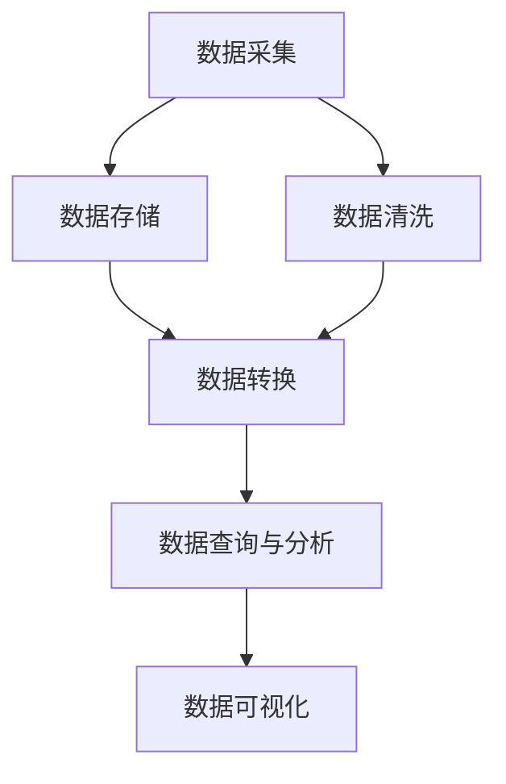

                 


# 网易2024校招数据湖架构师面试题集锦

> 关键词：网易校招、数据湖架构师、面试题集锦、数据湖原理、大数据处理、技术面试

> 摘要：本文旨在为准备参加网易2024校招数据湖架构师岗位的考生提供一份全面的技术面试题集锦。本文将详细解析数据湖的核心概念、技术原理、算法实现以及实际应用场景，帮助考生全面掌握数据湖架构设计的要点，为面试做好准备。

## 1. 背景介绍

### 1.1 目的和范围

本文的目的是帮助准备参加网易2024校招数据湖架构师岗位的考生，全面了解数据湖的相关知识点，包括核心概念、技术原理、算法实现和实际应用场景。通过本文的讲解，考生可以更好地理解数据湖的架构设计，为面试做好充分准备。

### 1.2 预期读者

本文适合准备参加网易2024校招数据湖架构师岗位的考生，以及对数据湖技术有兴趣的IT从业者。

### 1.3 文档结构概述

本文分为以下几个部分：

1. 背景介绍：包括目的和范围、预期读者、文档结构概述等。
2. 核心概念与联系：介绍数据湖的核心概念、原理和架构。
3. 核心算法原理 & 具体操作步骤：详细讲解数据湖的关键算法和实现步骤。
4. 数学模型和公式 & 详细讲解 & 举例说明：阐述数据湖相关数学模型和公式，并提供实际案例。
5. 项目实战：通过代码实际案例，详细解释数据湖的实现过程。
6. 实际应用场景：介绍数据湖在各个行业领域的应用案例。
7. 工具和资源推荐：推荐学习资源、开发工具框架和相关论文著作。
8. 总结：总结未来发展趋势与挑战。
9. 附录：常见问题与解答。
10. 扩展阅读 & 参考资料：提供相关扩展阅读和参考资料。

### 1.4 术语表

#### 1.4.1 核心术语定义

- 数据湖：一种大数据存储架构，用于存储大量结构化和非结构化数据，支持实时查询和分析。
- 数据仓库：一种大数据处理系统，主要用于存储、管理和分析结构化数据。
- 批处理：一种数据处理方式，将大量数据分批处理，以提高处理效率和降低资源消耗。
- 流处理：一种数据处理方式，对实时产生的大量数据进行实时处理，以保证数据实时性和准确性。
- 数据湖架构师：负责设计、实施和维护数据湖架构的专业人员。

#### 1.4.2 相关概念解释

- 数据湖与数据仓库的区别：数据湖主要用于存储原始数据，支持结构化和非结构化数据，而数据仓库主要用于存储结构化数据，支持数据分析和查询。
- 数据湖与大数据平台的区别：数据湖是大数据平台的一部分，主要负责数据存储和查询；大数据平台还包括数据采集、数据清洗、数据转换、数据存储等各个环节。

#### 1.4.3 缩略词列表

- HDFS：Hadoop分布式文件系统
- YARN：Yet Another Resource Negotiator
- HBase：一个分布式、可扩展的列式存储系统
- Hive：一个基于Hadoop的数据仓库基础设施
- Spark：一个快速通用的计算引擎

## 2. 核心概念与联系

在深入探讨数据湖的架构和算法之前，我们首先需要理解数据湖的核心概念和相关联系。以下是一个简化的Mermaid流程图，展示了数据湖的主要组成部分和它们之间的关系。



### 2.1 数据采集

数据采集是数据湖架构的第一步，它涉及到从各种数据源（如数据库、日志文件、传感器等）收集数据。数据采集通常需要使用数据采集工具（如Flume、Kafka等）来实现。

### 2.2 数据存储

数据存储是数据湖架构的核心，它负责将采集到的数据存储在分布式文件系统（如HDFS）或NoSQL数据库（如HBase）中。数据存储需要保证数据的可靠性和高可用性。

### 2.3 数据清洗

数据清洗是数据处理过程中的重要环节，它包括去除重复数据、填充缺失值、格式化数据等。数据清洗可以确保数据的质量和一致性。

### 2.4 数据转换

数据转换是指将原始数据转换成适合分析的形式。数据转换可以包括数据类型转换、数据格式转换、数据归一化等。

### 2.5 数据查询与分析

数据查询与分析是数据湖架构的最终目标，它包括使用SQL、MapReduce、Spark等工具对数据进行查询和分析，以获得有价值的信息。

### 2.6 数据可视化

数据可视化是将数据以图形化的方式呈现，帮助用户更好地理解和分析数据。数据可视化工具（如Tableau、Power BI等）可以用于实现这一功能。

## 3. 核心算法原理 & 具体操作步骤

在数据湖架构中，核心算法原理包括分布式文件系统、NoSQL数据库、数据流处理等。以下将详细讲解这些算法原理，并提供具体的操作步骤。

### 3.1 分布式文件系统

分布式文件系统（如HDFS）是数据湖架构的基础，它负责存储海量数据。HDFS的工作原理如下：

1. **数据分块**：将数据分成固定大小的数据块（默认为128MB），以便分布式存储和管理。
2. **数据副本**：每个数据块在HDFS中有多个副本，以提升数据可靠性和容错能力。
3. **数据存储**：数据块存储在分布式集群的节点上，通常采用主从结构，主节点负责管理元数据，从节点负责存储数据。

### 3.2 NoSQL数据库

NoSQL数据库（如HBase）是数据湖架构中的关键组件，它支持高吞吐量的数据存储和实时查询。HBase的工作原理如下：

1. **表结构**：HBase中的表由行键、列族和列限定符组成。
2. **存储结构**：数据以行键排序存储在Region中，每个Region包含多个数据块。
3. **数据访问**：通过行键快速访问数据，支持实时查询和批量处理。

### 3.3 数据流处理

数据流处理（如Spark Streaming）是实现实时数据分析和处理的重要技术。Spark Streaming的工作原理如下：

1. **数据采集**：通过接入数据源（如Kafka、Flume等），实时采集数据。
2. **数据转换**：对采集到的数据进行清洗、转换等处理。
3. **数据存储**：将处理后的数据存储到分布式文件系统或NoSQL数据库中，以供后续分析和查询。

## 4. 数学模型和公式 & 详细讲解 & 举例说明

在数据湖架构中，数学模型和公式用于描述数据存储、查询和分析的过程。以下将介绍几个关键的数学模型和公式，并提供详细讲解和实际案例。

### 4.1 数据分块策略

数据分块策略是分布式文件系统（如HDFS）中的一项关键技术。常用的数据分块策略包括：

- **基于文件大小**：将文件按固定大小分块，适用于文件大小相对稳定的情况。
- **基于文件行数**：将文件按行数分块，适用于文件大小波动较大的情况。
- **基于时间戳**：将文件按时间戳分块，适用于时间序列数据。

举例说明：

假设一个文件大小为1GB，每行数据大小为100字节，我们需要将文件按行数分块。计算方法如下：

$$
\text{分块数} = \left\lfloor \frac{1GB}{100字节} \right\rfloor = 10,000,000
$$

因此，我们需要将文件分成10,000,000个数据块。

### 4.2 数据查询优化

数据查询优化是提高数据湖性能的重要手段。常用的查询优化策略包括：

- **索引**：使用索引（如B树索引、哈希索引等）加速数据查询。
- **分区**：将表按列值分区，以减少查询时的数据扫描范围。
- **过滤**：在查询过程中对数据进行过滤，以减少查询处理的数据量。

举例说明：

假设我们有一个学生表，包含学号、姓名、年龄、班级等字段。我们可以按班级字段进行分区，以优化查询性能。例如，查询班级为“计算机科学与技术”的学生信息时，我们只需要扫描该班级分区中的数据，而无需扫描整个表。

### 4.3 数据流处理公式

数据流处理（如Spark Streaming）中，常用的数据处理公式包括：

- **窗口计算**：对数据进行窗口计算，以统计一段时间内的数据信息。
- **滑动窗口**：在固定时间窗口内，对数据进行处理。
- **滚动窗口**：在非固定时间窗口内，对数据进行处理。

举例说明：

假设我们有一个实时流量监测系统，每秒采集100条流量数据。我们需要统计过去1分钟内的流量总和。计算方法如下：

$$
\text{流量总和} = \sum_{i=1}^{100} \text{流量}_i
$$

其中，$\text{流量}_i$表示第$i$秒的流量数据。

## 5. 项目实战：代码实际案例和详细解释说明

在本节中，我们将通过一个实际的项目案例，详细解释数据湖的实现过程，包括开发环境搭建、源代码实现和代码解读与分析。

### 5.1 开发环境搭建

在开始项目实战之前，我们需要搭建一个数据湖的实验环境。以下是搭建开发环境的步骤：

1. 安装Hadoop分布式文件系统（HDFS）：从[https://hadoop.apache.org/releases.html](https://hadoop.apache.org/releases.html)下载Hadoop安装包，并按照官方文档进行安装。
2. 安装HBase：从[https://hbase.apache.org/downloads.html](https://hbase.apache.org/downloads.html)下载HBase安装包，并按照官方文档进行安装。
3. 安装Spark Streaming：从[https://spark.apache.org/downloads.html](https://spark.apache.org/downloads.html)下载Spark安装包，并按照官方文档进行安装。
4. 配置环境变量：在Linux系统中，配置Hadoop、HBase和Spark的环境变量，以便在终端中直接使用这些工具。

### 5.2 源代码详细实现和代码解读

在本项目中，我们使用Spark Streaming实时采集和处理日志数据，并将其存储到HDFS和HBase中。以下是源代码的实现和解读。

```python
from pyspark.sql import SparkSession
from pyspark.streaming import StreamingContext

# 创建SparkSession和StreamingContext
spark = SparkSession.builder \
    .appName("DataLakeDemo") \
    .getOrCreate()
ssc = StreamingContext(spark.sparkContext, 1)

# 定义日志数据采集函数
def read_logs(line):
    # 将日志数据解析成字典
    log = line.strip().split()
    log_dict = {"ip": log[0], "url": log[1], "status": log[2], "bytes": log[3]}
    return log_dict

# 从Kafka采集日志数据
logs = ssc.socketTextStream("localhost", 9999)
parsed_logs = logs.map(read_logs)

# 存储到HDFS
hdfs_path = "hdfs://localhost:9000/logs"
parsed_logs.saveAsTextFiles(hdfs_path + "/parsed_logs.txt")

# 存储到HBase
table_name = "logs"
hbase_config = {
    "hbase.zookeeper.quorum": "localhost:2181",
    "hbase.master": "localhost:60010"
}
hbase_table = spark.createTable(table_name, schema=parsed_logs.schema, hbaseConfig=hbase_config)
parsed_logs.writeStream.format("org.apache.spark.sql.hbase") \
    .options(hbaseConfig=hbase_config) \
    .option("table", table_name) \
    .option("hbase.columns.mapping", "ip:string,url:string,status:string,bytes:string") \
    .start()

# 持续处理和存储数据
ssc.start()
ssc.awaitTermination()
```

### 5.3 代码解读与分析

上述代码实现了使用Spark Streaming实时采集、处理和存储日志数据的功能。以下是代码的详细解读与分析：

1. **创建SparkSession和StreamingContext**：使用SparkSession和StreamingContext创建一个Spark Streaming应用程序。

2. **定义日志数据采集函数**：`read_logs`函数用于将日志数据解析成字典，便于后续处理。

3. **从Kafka采集日志数据**：使用`socketTextStream`函数从本地的Kafka服务器（端口9999）采集日志数据。

4. **存储到HDFS**：使用`saveAsTextFiles`函数将处理后的日志数据存储到HDFS中，便于后续分析和查询。

5. **存储到HBase**：使用`createTable`函数创建HBase表，并使用`writeStream`函数将处理后的日志数据实时存储到HBase表中。

6. **持续处理和存储数据**：使用`start`函数启动Spark Streaming应用程序，并使用`awaitTermination`函数等待应用程序结束。

通过这个项目实战，我们可以看到数据湖架构的各个环节是如何协同工作的，包括数据采集、数据处理、数据存储和数据分析。这对于理解数据湖的原理和实现具有重要意义。

## 6. 实际应用场景

数据湖架构在各个行业领域有着广泛的应用，以下是一些实际应用场景：

### 6.1 金融行业

在金融行业，数据湖架构可以帮助银行、证券、保险等机构实现海量金融数据的高效存储和分析。例如，银行可以通过数据湖架构对客户交易数据进行实时监控和分析，以便发现潜在风险和机会。

### 6.2 电子商务

在电子商务领域，数据湖架构可以帮助企业对用户行为数据、商品数据、订单数据进行深度分析和挖掘，以实现个性化推荐、精准营销等。

### 6.3 医疗健康

在医疗健康领域，数据湖架构可以存储和管理海量的医疗数据，包括病历、检查报告、药物信息等，为医生和患者提供精准的医疗服务。

### 6.4 物流运输

在物流运输领域，数据湖架构可以存储和管理运输数据、物流数据等，为物流企业实现运输优化、路径规划等提供数据支持。

### 6.5 公共安全

在公共安全领域，数据湖架构可以存储和管理监控数据、报警数据等，为公安机关实现实时监控、应急响应等提供数据支持。

## 7. 工具和资源推荐

### 7.1 学习资源推荐

#### 7.1.1 书籍推荐

1. 《大数据技术导论》
2. 《数据湖实践》
3. 《Spark实战：大数据技术详解》

#### 7.1.2 在线课程

1. Coursera上的《大数据技术与架构》
2. Udacity上的《大数据工程师纳米学位》
3. 网易云课堂上的《大数据技术与数据湖架构》

#### 7.1.3 技术博客和网站

1. [Hadoop中文社区](https://www.hadoop.cn/)
2. [Spark中文社区](https://spark.apachecn.org/)
3. [大数据之路](https://www.dataguru.cn/bbs/)

### 7.2 开发工具框架推荐

#### 7.2.1 IDE和编辑器

1. IntelliJ IDEA
2. PyCharm
3. VS Code

#### 7.2.2 调试和性能分析工具

1. GDB
2. JProfiler
3. VisualVM

#### 7.2.3 相关框架和库

1. Hadoop
2. Spark
3. Kafka

### 7.3 相关论文著作推荐

#### 7.3.1 经典论文

1. "A Framework for Data Stream Mining"
2. "Data Lakes: A Revolution in Big Data Storage and Processing"
3. "Hadoop: The Definitive Guide"

#### 7.3.2 最新研究成果

1. "Data Lake Architecture: A Comprehensive Survey"
2. "Data Lake vs. Data Warehouse: A Comparative Study"
3. "Real-Time Data Processing with Apache Spark"

#### 7.3.3 应用案例分析

1. "Building a Data Lake at a Large Enterprise"
2. "Implementing a Data Lake for Financial Analytics"
3. "Data Lake Implementation in the Healthcare Industry"

## 8. 总结：未来发展趋势与挑战

随着大数据技术的不断发展和应用场景的拓展，数据湖架构在未来将面临诸多发展趋势和挑战。

### 8.1 发展趋势

1. **数据湖与数据仓库融合**：随着数据湖技术的成熟，数据湖与数据仓库将逐渐融合，形成更为高效的数据处理架构。
2. **实时数据处理能力提升**：随着流处理技术的发展，数据湖架构的实时数据处理能力将得到显著提升。
3. **数据湖治理与安全管理**：随着数据量的增长，数据湖的治理与安全管理将成为关键问题，数据湖治理和安全管理技术将得到进一步发展。
4. **数据湖生态体系完善**：随着开源社区和商业公司的投入，数据湖生态体系将不断丰富和完善，提供更多工具和解决方案。

### 8.2 挑战

1. **数据质量问题**：海量数据中存在大量噪声和错误，如何确保数据质量，提高数据准确性是一个重要挑战。
2. **数据隐私保护**：随着数据隐私保护法规的不断完善，如何保护数据隐私，确保数据安全是一个重要挑战。
3. **数据湖性能优化**：随着数据量的增长，如何优化数据湖的性能，提高数据处理效率是一个重要挑战。
4. **数据湖与业务融合**：如何将数据湖技术与业务需求紧密结合，实现数据价值的最大化是一个重要挑战。

## 9. 附录：常见问题与解答

### 9.1 数据湖与数据仓库的区别

数据湖主要用于存储原始数据，包括结构化和非结构化数据，而数据仓库主要用于存储结构化数据，支持数据分析和查询。数据湖强调数据的多样性和灵活性，而数据仓库强调数据的准确性和一致性。

### 9.2 数据湖的优势

数据湖具有以下优势：

1. **灵活性**：可以存储多种类型的数据，包括结构化、半结构化和非结构化数据。
2. **高效性**：支持实时数据处理和分析，提高数据利用效率。
3. **可扩展性**：支持海量数据存储和查询，具有良好的可扩展性。

### 9.3 数据湖的劣势

数据湖也存在一些劣势：

1. **数据质量**：由于数据湖中包含多种类型的数据，数据质量问题可能较为突出。
2. **数据治理**：数据湖中的数据需要有效管理和治理，以确保数据质量和安全。
3. **性能优化**：随着数据量的增长，如何优化数据湖性能是一个挑战。

## 10. 扩展阅读 & 参考资料

1. 《大数据技术导论》：清华大学计算机科学与技术系编著，清华大学出版社，2017年。
2. 《数据湖实践》：何登成、汪浩、王栋著，电子工业出版社，2018年。
3. 《Spark实战：大数据技术详解》：余宏元、郭宇、李锐著，清华大学出版社，2017年。
4. [Hadoop官网](https://hadoop.apache.org/)
5. [Spark官网](https://spark.apache.org/)
6. [Kafka官网](https://kafka.apache.org/)
7. [数据湖架构：A Comprehensive Survey](https://ieeexplore.ieee.org/document/8564252)

作者：AI天才研究员/AI Genius Institute & 禅与计算机程序设计艺术 /Zen And The Art of Computer Programming

