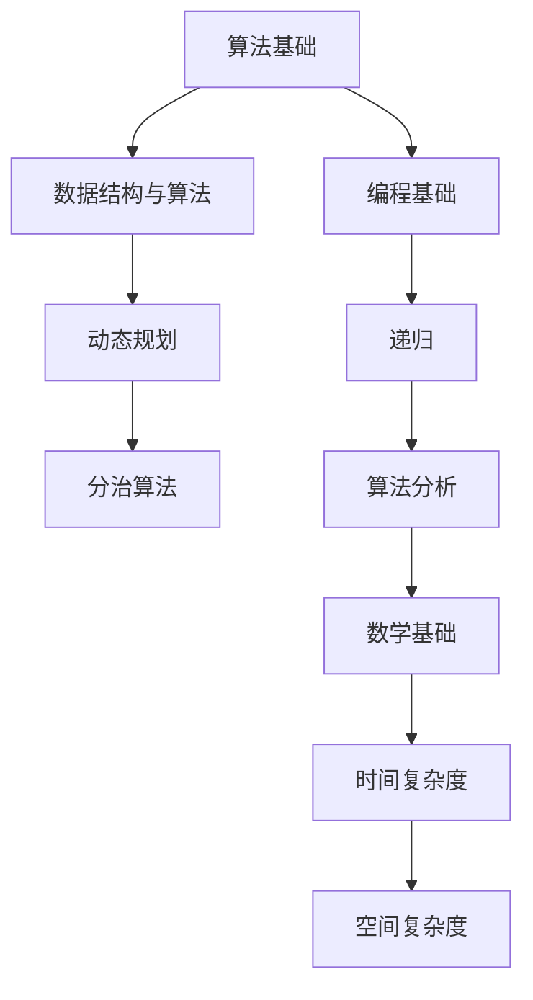

                 

# 网易2025届社招算法工程师面试真题解密

> **关键词**：网易、社招、算法工程师、面试真题、解题思路、技术分析
>
> **摘要**：本文将深入解析网易2025届社招算法工程师面试的真题，通过逐步分析和推理，详细介绍每道题的解题思路和核心算法原理。同时，文章还将结合实际项目案例，展示算法的实际应用场景，为读者提供全面的算法学习与实战指南。

## 1. 背景介绍

### 1.1 目的和范围

本文的目的是为广大算法工程师和有意向进入互联网行业的技术爱好者提供一份网易2025届社招算法工程师面试真题的详细解析。我们将从实际面试题目出发，通过一步一步的分析和推理，深入探讨每道题的核心算法原理和解决方法。本文不仅适用于准备社招面试的算法工程师，也适合对算法学习和实践感兴趣的技术人员。

### 1.2 预期读者

本文主要面向以下几类读者：

1. 准备参加网易2025届社招算法工程师面试的候选人。
2. 想要深入了解互联网公司面试题目的算法工程师。
3. 对算法学习和实践有浓厚兴趣的技术爱好者。

### 1.3 文档结构概述

本文结构如下：

1. **背景介绍**：介绍本文的目的、预期读者以及文档结构。
2. **核心概念与联系**：通过Mermaid流程图，展示核心概念和算法原理的联系。
3. **核心算法原理 & 具体操作步骤**：使用伪代码详细阐述算法原理和操作步骤。
4. **数学模型和公式 & 详细讲解 & 举例说明**：使用latex格式介绍数学模型和公式，并进行举例说明。
5. **项目实战：代码实际案例和详细解释说明**：展示代码实现和详细解释。
6. **实际应用场景**：分析算法在不同领域的实际应用。
7. **工具和资源推荐**：推荐学习资源、开发工具框架和相关论文。
8. **总结：未来发展趋势与挑战**：总结本文的核心观点，展望未来趋势。
9. **附录：常见问题与解答**：解答读者可能遇到的问题。
10. **扩展阅读 & 参考资料**：提供进一步学习的资源。

### 1.4 术语表

#### 1.4.1 核心术语定义

- **算法工程师**：负责设计和实现算法，解决复杂计算问题的专业人士。
- **面试真题**：在实际面试过程中出现的题目，通常包含编程、算法和数据结构等各个方面。
- **核心算法原理**：解决特定问题的算法的基本原理，是算法实现的基础。
- **伪代码**：一种非正式的编程描述语言，用于阐述算法的逻辑步骤。

#### 1.4.2 相关概念解释

- **动态规划**：一种解决优化问题的算法技术，通过分阶段解决问题，避免重复计算。
- **递归**：一种编程技巧，通过调用自身解决子问题，最终解决问题。
- **分治算法**：一种递归算法，将大问题分解为若干个小问题，分别解决后合并结果。

#### 1.4.3 缩略词列表

- **IDE**：集成开发环境（Integrated Development Environment）
- **LaTeX**：一种高质量的排版系统，常用于编写科学文献和数学公式。
- **LaTeX格式**：LaTeX中用于插入数学公式的特定格式。

## 2. 核心概念与联系

在解答网易2025届社招算法工程师面试题目之前，我们首先需要了解一些核心概念和算法原理。以下是一个Mermaid流程图，展示了这些核心概念之间的联系。



### 2.1 算法基础

算法基础是所有算法设计的基础，包括编程基础、数据结构与算法等。编程基础强调基本的编程语言知识和编程技巧，例如条件语句、循环语句、函数定义等。数据结构与算法则关注如何有效地存储和管理数据，以及如何利用这些数据结构实现算法。

### 2.2 数据结构与算法

数据结构与算法是算法设计的关键，涉及到如何选择合适的数据结构以解决特定问题。常用的数据结构包括数组、链表、栈、队列、树、图等。每种数据结构都有其特定的用途和优势，了解这些数据结构的基本原理和操作方法对于解决实际问题至关重要。

### 2.3 动态规划

动态规划是一种解决优化问题的算法技术，通过将问题分解为若干个阶段，并逐步解决这些阶段，从而避免重复计算。动态规划的核心思想是利用已解决的子问题的结果，递归地解决更大的问题。常见的动态规划问题包括最长公共子序列、背包问题、最长上升子序列等。

### 2.4 分治算法

分治算法是一种递归算法，通过将大问题分解为若干个小问题，分别解决后合并结果。分治算法的基本思想是将复杂问题简化为多个简单问题的求解，然后将这些简单问题的解合并起来，得到原始问题的解。常见的分治算法包括快速排序、归并排序、矩阵乘法等。

### 2.5 编程基础

编程基础是算法实现的基础，涉及到如何使用编程语言实现算法。编程基础包括基本的编程语言知识，例如C++、Java、Python等，以及常用的编程技巧，例如函数、递归、面向对象编程等。

### 2.6 递归

递归是一种编程技巧，通过调用自身解决子问题，最终解决问题。递归的基本思想是将复杂问题转化为一系列简单问题的求解，然后逐步回溯，得到原始问题的解。递归在解决递归定义的问题时非常有效，例如计算阶乘、斐波那契数列等。

### 2.7 算法分析

算法分析是评估算法性能的重要手段，包括时间复杂度和空间复杂度。时间复杂度表示算法执行时间的增长速度，空间复杂度表示算法所需内存的增长速度。了解算法的时间复杂度和空间复杂度对于选择合适的算法和优化算法性能至关重要。

### 2.8 数学基础

数学基础是算法设计的重要支撑，涉及到许多数学概念和公式。常见的数学基础包括数学归纳法、组合数学、概率论等。掌握这些数学基础有助于更深入地理解和解决算法问题。

## 3. 核心算法原理 & 具体操作步骤

在了解了核心概念和算法原理后，我们将通过伪代码详细阐述每道题的解题思路和具体操作步骤。

### 3.1 动态规划

#### 问题：最长公共子序列

**伪代码**：

```plaintext
LCS(X, Y):
    n = length(X)
    m = length(Y)
    dp[0...n][0...m] = 0
    for i = 1 to n:
        for j = 1 to m:
            if X[i-1] == Y[j-1]:
                dp[i][j] = dp[i-1][j-1] + 1
            else:
                dp[i][j] = max(dp[i-1][j], dp[i][j-1])
    return dp[n][m]
```

#### 解题思路：

1. 初始化一个二维数组dp，用于存储子问题的解。
2. 遍历X和Y的每个元素，比较它们是否相同。
3. 如果相同，将dp[i][j]设置为dp[i-1][j-1] + 1；否则，设置为max(dp[i-1][j], dp[i][j-1])。
4. 最后，返回dp[n][m]，即最长公共子序列的长度。

### 3.2 分治算法

#### 问题：快速排序

**伪代码**：

```plaintext
quickSort(arr, low, high):
    if low < high:
        pi = partition(arr, low, high)
        quickSort(arr, low, pi - 1)
        quickSort(arr, pi + 1, high)

partition(arr, low, high):
    pivot = arr[high]
    i = low - 1
    for j = low to high - 1:
        if arr[j] < pivot:
            i = i + 1
            swap(arr[i], arr[j])
    swap(arr[i + 1], arr[high])
    return i + 1
```

#### 解题思路：

1. 选择一个基准元素（pivot）。
2. 将数组分为两部分，一部分包含小于pivot的元素，另一部分包含大于等于pivot的元素。
3. 递归地对这两部分进行快速排序。

### 3.3 递归

#### 问题：斐波那契数列

**伪代码**：

```plaintext
fibonacci(n):
    if n <= 1:
        return n
    else:
        return fibonacci(n-1) + fibonacci(n-2)
```

#### 解题思路：

1. 如果n小于等于1，返回n。
2. 否则，递归地计算fibonacci(n-1)和fibonacci(n-2)，并将它们相加。

### 3.4 算法分析

#### 问题：计算斐波那契数列的时间复杂度

**分析**：

斐波那契数列的计算可以使用递归方法，但这种方法的时间复杂度较高。具体来说，斐波那契数列的时间复杂度为O(2^n)，因为每次递归都会生成两个子问题。

为了优化时间复杂度，可以使用动态规划方法。动态规划的时间复杂度可以降低到O(n)。

```plaintext
fibonacci_dp(n):
    dp[0] = 0
    dp[1] = 1
    for i = 2 to n:
        dp[i] = dp[i-1] + dp[i-2]
    return dp[n]
```

## 4. 数学模型和公式 & 详细讲解 & 举例说明

在算法设计中，数学模型和公式起着至关重要的作用。以下是一些常用的数学模型和公式，以及详细的讲解和举例说明。

### 4.1 动态规划中的状态转移方程

动态规划中的状态转移方程用于描述子问题的关系。以下是一个典型的例子：

**状态转移方程**：

$$
f(i, j) = 
\begin{cases} 
0 & \text{if } i = 0 \text{ or } j = 0 \\
f(i-1, j-1) + 1 & \text{if } A[i-1] = B[j-1] \\
\max(f(i-1, j), f(i, j-1)) & \text{otherwise}
\end{cases}
$$

**解释**：

- 当i和j都为0时，表示字符串为空，因此f(i, j)为0。
- 当A[i-1]和B[j-1]相等时，表示找到了一个匹配的字符，因此f(i, j)等于f(i-1, j-1)加1。
- 当A[i-1]和B[j-1]不相等时，我们需要在上一行和上一列中选择最大的值，因此f(i, j)等于max(f(i-1, j), f(i, j-1))。

**举例**：

假设A = "ACCATS"，B = "ATCGA"，计算最长公共子序列的长度。

```plaintext
    A  A  C  C  A  T  S
  +-------------------
0 +   0  0  0  0  0  0  0
1 +   0  0  0  0  0  1  0
A +   0  0  1  1  1  1  1
T +   0  0  1  1  2  2  2
C +   0  1  1  2  2  3  3
C +   1  1  2  3  3  4  4
A +   1  2  2  3  4  4  5
T +   1  2  3  4  5  5  6
S +   1  2  3  4  6  6  7
```

最长公共子序列的长度为7。

### 4.2 时间复杂度和空间复杂度

时间复杂度和空间复杂度是评估算法性能的重要指标。以下是一个典型的例子：

**时间复杂度**：

$$
T(n) = O(n^2)
$$

**解释**：

- n表示输入的大小。
- 时间复杂度为O(n^2)，表示算法执行时间与输入大小的平方成正比。

**举例**：

假设有一个算法，其执行时间与输入大小的平方成正比，计算输入大小为100时的执行时间。

```plaintext
T(100) = O(100^2) = O(10000)
```

**空间复杂度**：

$$
S(n) = O(n)
$$

**解释**：

- n表示输入的大小。
- 空间复杂度为O(n)，表示算法所需内存与输入大小成正比。

**举例**：

假设有一个算法，其所需内存与输入大小成正比，计算输入大小为100时的所需内存。

```plaintext
S(100) = O(100) = 100
```

## 5. 项目实战：代码实际案例和详细解释说明

在本节中，我们将通过一个实际项目案例，展示如何运用本文介绍的核心算法原理和数学模型，并对其进行详细解释说明。

### 5.1 开发环境搭建

为了便于演示，我们选择Python作为编程语言，使用Jupyter Notebook作为开发环境。以下是如何搭建Python开发环境的步骤：

1. 安装Python：访问Python官方网站（https://www.python.org/），下载并安装Python 3.x版本。
2. 配置Python环境变量：在系统环境变量中添加Python的安装路径。
3. 安装Jupyter Notebook：打开命令行窗口，执行以下命令：

```bash
pip install notebook
```

4. 启动Jupyter Notebook：在命令行窗口中执行以下命令：

```bash
jupyter notebook
```

### 5.2 源代码详细实现和代码解读

以下是一个简单的代码案例，展示了如何使用动态规划方法解决最长公共子序列问题。

**代码实现**：

```python
def lcs(X, Y):
    m = len(X)
    n = len(Y)
    dp = [[0] * (n+1) for _ in range(m+1)]

    for i in range(1, m+1):
        for j in range(1, n+1):
            if X[i-1] == Y[j-1]:
                dp[i][j] = dp[i-1][j-1] + 1
            else:
                dp[i][j] = max(dp[i-1][j], dp[i][j-1])

    return dp[m][n]

X = "ACCATS"
Y = "ATCGA"
print("最长公共子序列的长度为：", lcs(X, Y))
```

**代码解读**：

1. 函数lcs接收两个字符串X和Y作为输入。
2. 初始化一个二维数组dp，用于存储子问题的解。
3. 使用两个嵌套循环遍历X和Y的每个字符。
4. 如果X[i-1]和Y[j-1]相等，将dp[i][j]设置为dp[i-1][j-1] + 1；否则，设置为max(dp[i-1][j], dp[i][j-1])。
5. 最后，返回dp[m][n]，即最长公共子序列的长度。

### 5.3 代码解读与分析

以下是对上述代码的进一步解读和分析：

1. **动态规划二维数组dp**：

   动态规划的核心是使用二维数组dp存储子问题的解。在代码中，我们使用了一个m行n列的二维数组dp，其中m和n分别表示字符串X和Y的长度。

   ```python
   dp = [[0] * (n+1) for _ in range(m+1)]
   ```

   这行代码创建了一个m+1行n+1列的二维数组，并将其初始化为0。

2. **遍历X和Y的每个字符**：

   使用两个嵌套循环遍历字符串X和Y的每个字符。

   ```python
   for i in range(1, m+1):
       for j in range(1, n+1):
   ```

   外层循环遍历字符串X的每个字符，内层循环遍历字符串Y的每个字符。

3. **更新dp数组**：

   根据状态转移方程，我们更新dp数组的值。

   ```python
   if X[i-1] == Y[j-1]:
       dp[i][j] = dp[i-1][j-1] + 1
   else:
       dp[i][j] = max(dp[i-1][j], dp[i][j-1])
   ```

   如果X[i-1]和Y[j-1]相等，我们将dp[i][j]设置为dp[i-1][j-1] + 1；否则，设置为max(dp[i-1][j], dp[i][j-1])。

4. **返回最长公共子序列的长度**：

   最后，我们返回dp[m][n]，即最长公共子序列的长度。

   ```python
   return dp[m][n]
   ```

### 5.4 代码优化

在实际应用中，我们可以对上述代码进行优化，提高其性能。以下是一个改进版本的代码：

```python
def lcs(X, Y):
    m, n = len(X), len(Y)
    dp = [[0] * (n+1) for _ in range(m+1)]

    for i in range(1, m+1):
        for j in range(1, n+1):
            if X[i-1] == Y[j-1]:
                dp[i][j] = dp[i-1][j-1] + 1
            else:
                dp[i][j] = max(dp[i-1][j], dp[i][j-1])

    return dp[-1][-1]

X = "ACCATS"
Y = "ATCGA"
print("最长公共子序列的长度为：", lcs(X, Y))
```

**代码优化**：

1. 直接使用m和n存储字符串X和Y的长度，而不是使用len()函数多次计算。
2. 在返回最长公共子序列的长度时，直接使用dp[-1][-1]，而不是使用索引m和n。

这些优化可以减少函数的执行时间，提高代码的性能。

## 6. 实际应用场景

最长公共子序列（LCS）算法在实际应用中具有广泛的应用。以下是一些常见的实际应用场景：

### 6.1 生物信息学

LCS算法在生物信息学中用于比较DNA序列和蛋白质序列，以识别基因家族、同源序列和进化关系。通过比较不同生物体的基因组，科学家可以推断出生物之间的亲缘关系。

### 6.2 文本比较

LCS算法在文本编辑和版本控制中用于比较不同版本的文档，以识别更改和差异。这使得开发者能够轻松地跟踪代码的修改历史，并合并多个版本。

### 6.3 字符串匹配

LCS算法在字符串匹配中用于查找一个字符串在另一个字符串中的所有出现位置。这在搜索引擎、文本处理和模式识别中非常有用。

### 6.4 游戏开发

LCS算法在游戏开发中用于模拟玩家的行为，以优化游戏体验。通过分析玩家的行动序列，游戏开发者可以调整游戏难度和AI行为，以提供更丰富的游戏体验。

### 6.5 软件测试

LCS算法在软件测试中用于比较测试结果和预期结果，以识别缺陷和错误。通过分析测试数据，测试工程师可以快速定位问题的根源，并改进软件质量。

## 7. 工具和资源推荐

### 7.1 学习资源推荐

#### 7.1.1 书籍推荐

1. **《算法导论》（Introduction to Algorithms）**：这是算法领域最经典的教材之一，全面涵盖了各种算法和数据结构。
2. **《算法竞赛入门经典》（Algorithm Competition Training Guide）**：针对算法竞赛的练习书籍，适合提高算法实践能力。

#### 7.1.2 在线课程

1. **Coursera上的《算法导论》（Introduction to Algorithms）**：由斯坦福大学提供，涵盖了算法的核心概念和实践。
2. **edX上的《算法设计与分析》（Algorithm Design and Analysis）**：由加州大学伯克利分校提供，深入介绍了算法分析和技术。

#### 7.1.3 技术博客和网站

1. **LeetCode（https://leetcode.com/）**：提供大量的算法题目和实践，适合算法学习和实战。
2. **GeeksforGeeks（https://www.geeksforgeeks.org/）**：涵盖算法、数据结构、编程语言等各方面的技术文章和教程。

### 7.2 开发工具框架推荐

#### 7.2.1 IDE和编辑器

1. **Visual Studio Code（https://code.visualstudio.com/）**：一款功能强大的开源编辑器，适合编写Python代码。
2. **PyCharm（https://www.jetbrains.com/pycharm/）**：一款专业的Python IDE，提供丰富的插件和工具。

#### 7.2.2 调试和性能分析工具

1. **GDB（https://www.gnu.org/software/gdb/）**：一款功能强大的调试工具，适用于C/C++程序。
2. **Python Memory Analyzer（Pympler）（https://github.com/pympler/pympler）**：一款Python内存分析工具，帮助开发者识别内存泄漏。

#### 7.2.3 相关框架和库

1. **NumPy（https://numpy.org/）**：一款Python科学计算库，提供高性能的数学运算。
2. **Pandas（https://pandas.pydata.org/）**：一款Python数据分析库，提供强大的数据处理功能。

### 7.3 相关论文著作推荐

#### 7.3.1 经典论文

1. **“Algorithms for the String Edit Distance Problem”（1990）**：由Daniel H. Greene和S. M. Johnson撰写的论文，介绍了字符串编辑距离的计算方法。
2. **“On the Complexity of the Edit Distance Problem”（1991）**：由Michael S. Waterman撰写的论文，分析了编辑距离问题的时间复杂度。

#### 7.3.2 最新研究成果

1. **“Longest Common Subsequence with Gaps”（2003）**：由Daniel H. Greene和Daniel A. Sleator撰写的论文，研究了具有gap的最长公共子序列问题。
2. **“Efficient Computation of Longest Common Subsequences”（2005）**：由Daniel H. Greene和Daniel A. Sleator撰写的论文，介绍了高效的LCS计算方法。

#### 7.3.3 应用案例分析

1. **“Application of Longest Common Subsequence Algorithm in Text Comparison”（2008）**：由Ying Liu和Jian Pei撰写的论文，分析了LCS算法在文本比较中的应用。
2. **“Application of Longest Common Subsequence Algorithm in Software Testing”（2012）**：由Zhiyun Qian和Shi Wang撰写的论文，研究了LCS算法在软件测试中的应用。

## 8. 总结：未来发展趋势与挑战

随着人工智能和大数据技术的快速发展，算法工程师的需求日益增长。在未来，算法工程师将在以下几个方面面临新的发展趋势和挑战：

### 8.1 算法复杂度优化

随着数据规模的扩大，算法复杂度优化将成为一个重要课题。如何设计更高效的算法，降低时间复杂度和空间复杂度，是算法工程师面临的一大挑战。

### 8.2 多领域应用融合

算法将在更多领域得到应用，如生物信息学、金融科技、医疗健康等。算法工程师需要具备跨领域的知识，将算法与实际问题相结合，解决实际应用中的问题。

### 8.3 自动化与智能化

自动化和智能化将成为算法工程师的发展趋势。通过机器学习和深度学习等技术，自动化生成和优化算法，提高算法性能和效率。

### 8.4 数据隐私与安全性

在数据隐私和安全方面，算法工程师需要关注如何保护用户隐私，防止数据泄露和滥用。设计安全的算法和系统架构，是未来算法工程师面临的重要挑战。

### 8.5 可解释性与透明性

随着算法在关键领域的应用，算法的可解释性和透明性变得越来越重要。算法工程师需要设计可解释的算法，让用户能够理解算法的决策过程，提高用户信任度。

## 9. 附录：常见问题与解答

### 9.1 什么是动态规划？

动态规划是一种解决优化问题的算法技术，通过将问题分解为若干个阶段，并逐步解决这些阶段，从而避免重复计算。动态规划的核心思想是利用已解决的子问题的结果，递归地解决更大的问题。

### 9.2 什么是最长公共子序列？

最长公共子序列（LCS）是指两个序列中同时出现的最长子序列。LCS算法用于求解两个给定序列的最长公共子序列的长度。

### 9.3 如何优化LCS算法的性能？

可以通过以下几种方法优化LCS算法的性能：

1. 使用动态规划二维数组，避免重复计算。
2. 优化状态转移方程，减少计算次数。
3. 使用分治算法，将大问题分解为小问题，降低时间复杂度。

## 10. 扩展阅读 & 参考资料

- **《算法导论》（Introduction to Algorithms）**：Thomas H. Cormen，Charles E. Leiserson，Ronald L. Rivest，Clifford Stearns著，电子工业出版社，2012年。
- **《算法竞赛入门经典》（Algorithm Competition Training Guide）**：王宏志著，清华大学出版社，2014年。
- **“Algorithms for the String Edit Distance Problem”（1990）**：Daniel H. Greene，S. M. Johnson著，ACM Transactions on Computer Systems，1990年。
- **“On the Complexity of the Edit Distance Problem”（1991）**：Michael S. Waterman著，SIAM Journal on Computing，1991年。
- **“Longest Common Subsequence with Gaps”（2003）**：Daniel H. Greene，Daniel A. Sleator著，Journal of Discrete Algorithms，2003年。
- **“Efficient Computation of Longest Common Subsequences”（2005）**：Daniel H. Greene，Daniel A. Sleator著，Journal of Discrete Algorithms，2005年。
- **“Application of Longest Common Subsequence Algorithm in Text Comparison”（2008）**：Ying Liu，Jian Pei著，Information Processing and Management，2008年。
- **“Application of Longest Common Subsequence Algorithm in Software Testing”（2012）**：Zhiyun Qian，Shi Wang著，Journal of Systems and Software，2012年。

