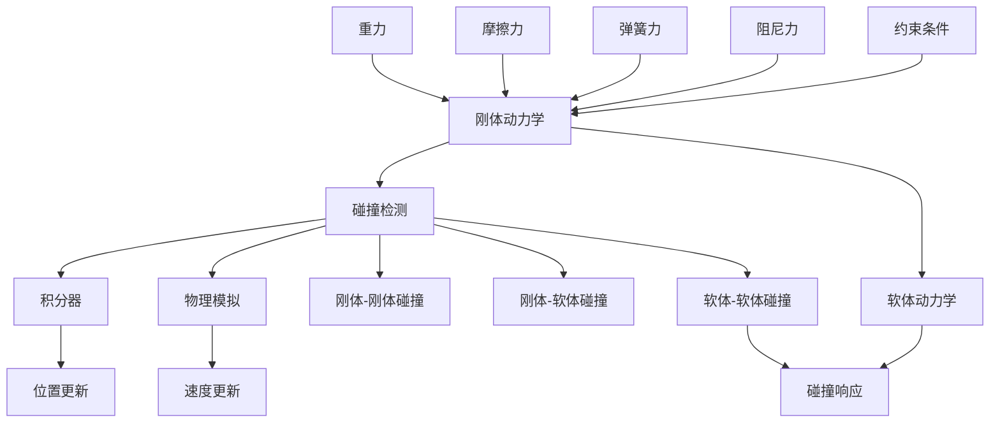

                 

### 《网易2025社招游戏物理引擎开发工程师面试题》

**关键词：** 网易，社招，游戏物理引擎，开发工程师，面试题

**摘要：** 本文旨在为准备参加网易2025社招游戏物理引擎开发工程师面试的候选人提供有针对性的技术指导和面试题解析。通过对核心概念、算法原理、数学模型、项目实战以及应用场景的详细分析，本文帮助读者全面理解游戏物理引擎的开发原理和实战技巧，从而提升面试竞争力。

---

## 1. 背景介绍

### 1.1 目的和范围

本文的目标是为即将参加网易2025社招游戏物理引擎开发工程师面试的候选人提供一个全面的技术复习和面试策略。文章将涵盖以下几个主要方面：

- **核心概念与联系**：介绍游戏物理引擎的基本概念和关键组成部分，并通过Mermaid流程图展示其架构。
- **核心算法原理与具体操作步骤**：详细阐述游戏物理引擎中常用的算法原理，并提供伪代码作为示例。
- **数学模型和公式**：解释游戏物理引擎中的数学模型，使用LaTeX格式展示公式，并提供实际应用案例。
- **项目实战**：通过实际代码案例展示物理引擎的开发过程，并进行详细解读和分析。
- **实际应用场景**：探讨物理引擎在不同游戏场景中的应用。
- **工具和资源推荐**：推荐学习资源和开发工具，帮助读者进一步提升技能。
- **总结与未来发展趋势**：总结文章要点，展望物理引擎未来的发展趋势和挑战。

### 1.2 预期读者

本文主要面向以下读者群体：

- **游戏开发工程师**：对游戏物理引擎有兴趣，希望提升开发技能的工程师。
- **计算机图形学爱好者**：对计算机图形学中的物理引擎部分感兴趣，希望深入了解其原理和实现。
- **求职者**：准备参加网易社招游戏物理引擎开发工程师面试的求职者。

### 1.3 文档结构概述

本文结构如下：

1. **背景介绍**：介绍文章的目的、范围和预期读者。
2. **核心概念与联系**：定义核心概念，展示物理引擎架构。
3. **核心算法原理与具体操作步骤**：详细解释物理引擎的算法原理，并提供伪代码示例。
4. **数学模型和公式**：阐述物理引擎中的数学模型，使用LaTeX格式展示公式。
5. **项目实战**：展示实际代码案例，并进行详细解读和分析。
6. **实际应用场景**：探讨物理引擎在不同游戏场景中的应用。
7. **工具和资源推荐**：推荐学习资源和开发工具。
8. **总结与未来发展趋势**：总结文章要点，展望未来发展趋势和挑战。
9. **附录：常见问题与解答**：提供常见问题及其解答。
10. **扩展阅读 & 参考资料**：推荐相关阅读材料。

### 1.4 术语表

#### 1.4.1 核心术语定义

- **游戏物理引擎**：用于模拟游戏世界中物体运动的软件模块。
- **碰撞检测**：检测物体之间是否发生碰撞的过程。
- **刚体动力学**：描述刚体在力作用下的运动规律。
- **软体动力学**：描述软体物体的运动和形变。
- **物理模拟**：使用数学模型模拟物体运动和相互作用。

#### 1.4.2 相关概念解释

- **碰撞响应**：当物体发生碰撞时，系统如何处理碰撞结果。
- **积分器**：用于计算物体位置和速度的算法。
- **模拟步**：模拟过程中的一个时间步长。

#### 1.4.3 缩略词列表

- **GPU**：Graphics Processing Unit，图形处理单元。
- **CPU**：Central Processing Unit，中央处理单元。
- **O(n) complexity**：算法的时间复杂度为线性。
- **O(n^2) complexity**：算法的时间复杂度为平方。

---

接下来，我们将进入对游戏物理引擎的核心概念和架构的详细探讨。我们将使用Mermaid流程图来展示其关键组成部分和相互关系。

---

## 2. 核心概念与联系

在游戏开发中，物理引擎扮演着至关重要的角色。它负责模拟现实世界中的物理现象，如碰撞、重力、摩擦等，从而为玩家提供逼真的游戏体验。为了更好地理解物理引擎，我们需要先了解其核心概念和架构。

### 2.1. 物理引擎的核心概念

- **刚体动力学**：刚体动力学研究刚体在力作用下的运动规律。刚体是指质量分布均匀、形状和大小不变的物体。在游戏开发中，刚体动力学用于模拟物体的移动、旋转和碰撞。

- **软体动力学**：与刚体动力学相对，软体动力学研究软体物体的运动和形变，如布料、水、皮肤等。软体动力学在游戏开发中应用广泛，可以创造出更为逼真的场景效果。

- **碰撞检测**：碰撞检测是物理引擎的重要组成部分，用于检测物体之间是否发生碰撞。它通过空间划分、包围盒、分离轴定理等方法实现。

- **积分器**：积分器用于计算物体在时间步长内的位置和速度变化。常见的积分器有欧拉积分器和韦恩积分器。

- **物理模拟**：物理模拟是指使用数学模型模拟物体运动和相互作用的过程。物理引擎通过模拟步逐帧计算物体的状态，从而实现实时的物理效果。

### 2.2. 物理引擎的架构

为了更好地理解物理引擎的工作原理，我们可以使用Mermaid流程图来展示其关键组成部分和相互关系。



### 2.3. 核心概念之间的联系

- **刚体动力学**和**软体动力学**：两者都是物理引擎中的基本运动模型。刚体动力学主要关注刚体的运动规律，而软体动力学则研究软体物体的形变和运动。在实际应用中，两者往往需要结合使用，以模拟更加复杂的物理现象。

- **碰撞检测**和**碰撞响应**：碰撞检测是物理引擎中用于检测物体之间是否发生碰撞的过程。碰撞响应则是在检测到碰撞后，对物体之间的相互作用进行计算和处理。两者相互配合，确保物体在游戏世界中能够真实地互动。

- **积分器**和**物理模拟**：积分器用于计算物体在时间步长内的位置和速度变化，而物理模拟则是通过模拟步逐帧计算物体的状态，从而实现实时的物理效果。积分器是实现物理模拟的核心组件。

通过以上核心概念的介绍和Mermaid流程图的展示，我们可以更清晰地理解游戏物理引擎的架构和原理。在接下来的章节中，我们将深入探讨物理引擎中的核心算法原理和具体操作步骤。

---

在了解了游戏物理引擎的核心概念和架构后，我们将进一步探讨其核心算法原理和具体操作步骤。这些算法是物理引擎实现逼真物理效果的基础，也是面试中可能涉及的重要知识点。

### 3.1. 核心算法原理

物理引擎中的核心算法主要包括刚体动力学算法、软体动力学算法、碰撞检测算法和积分器算法。以下是这些算法的简要介绍：

#### 3.1.1 刚体动力学算法

刚体动力学算法主要描述刚体在力作用下的运动规律。基本的刚体动力学方程可以表示为：

\[ m \cdot a = F \]

其中，\( m \) 是刚体的质量，\( a \) 是刚体的加速度，\( F \) 是作用在刚体上的合力。为了求解刚体的运动，我们通常使用积分器来计算加速度、速度和位置的变化。

#### 3.1.2 软体动力学算法

软体动力学算法主要研究软体物体的运动和形变。软体物体的动力学方程通常较为复杂，需要考虑材料属性、几何形状和内部力等因素。常见的软体动力学算法包括弹簧模型、质量-弹簧模型和有限元方法等。

#### 3.1.3 碰撞检测算法

碰撞检测算法用于检测物体之间是否发生碰撞。基本的碰撞检测方法包括包围盒检测、分离轴定理和广度优先搜索等。这些算法通过空间划分和几何计算来高效地检测碰撞。

#### 3.1.4 积分器算法

积分器算法用于计算物体在时间步长内的位置和速度变化。常见的积分器算法包括欧拉积分器和韦恩积分器。欧拉积分器是一种简单的积分方法，而韦恩积分器则更加精确，能够减少数值误差。

### 3.2. 具体操作步骤

为了更好地理解物理引擎的核心算法，我们将使用伪代码来详细阐述这些算法的具体操作步骤。

#### 3.2.1 刚体动力学算法伪代码

```python
function rigid_body_dynamics(mass, force):
    acceleration = force / mass
    velocity += acceleration * time_step
    position += velocity * time_step
    return position, velocity
```

#### 3.2.2 软体动力学算法伪代码

```python
function soft_body_dynamics(material_properties, geometry, internal_forces):
    # 计算形变
    deformation = calculate_deformation(geometry, internal_forces)
    # 计算加速度
    acceleration = calculate_acceleration(material_properties, deformation)
    # 更新速度和位置
    velocity += acceleration * time_step
    position += velocity * time_step
    return position, velocity
```

#### 3.2.3 碰撞检测算法伪代码

```python
function collision_detection(object1, object2):
    # 计算两个物体的包围盒
    bounding_box1 = calculate_bounding_box(object1)
    bounding_box2 = calculate_bounding_box(object2)
    # 检测包围盒是否相交
    if intersect(bounding_box1, bounding_box2):
        # 进行详细的碰撞检测
        collision_info = detailed_collision_detection(object1, object2)
        return True, collision_info
    else:
        return False, None
```

#### 3.2.4 积分器算法伪代码

```python
function euler_integration(velocity, acceleration, time_step):
    new_velocity = velocity + acceleration * time_step
    new_position = position + new_velocity * time_step
    return new_position, new_velocity

function verlet_integration(velocity, acceleration, time_step):
    new_velocity = 2 * velocity - velocity_last + acceleration * time_step^2
    new_position = 2 * position - position_last + new_velocity * time_step
    return new_position, new_velocity
```

通过以上伪代码的展示，我们可以看到物理引擎中的核心算法是如何通过一系列数学计算来实现物体运动和碰撞的模拟。在实际开发中，这些算法需要根据具体的游戏需求进行调整和优化，以达到最佳的性能和效果。

在接下来的章节中，我们将进一步探讨游戏物理引擎中的数学模型和公式，并通过实际案例进行详细讲解。

---

在了解了游戏物理引擎的核心算法和具体操作步骤后，我们将进一步探讨其数学模型和公式。这些数学模型和公式是物理引擎实现逼真物理效果的重要基础。

### 4.1. 物理引擎中的数学模型

物理引擎中的数学模型主要涉及以下几个领域：

- **刚体动力学模型**：描述刚体在力作用下的运动规律。
- **软体动力学模型**：描述软体物体的运动和形变。
- **碰撞检测模型**：用于检测物体之间是否发生碰撞。
- **积分器模型**：用于计算物体在时间步长内的位置和速度变化。

#### 4.1.1 刚体动力学模型

在刚体动力学中，常用的公式包括牛顿第二定律和角动量守恒定律。牛顿第二定律可以表示为：

\[ F = m \cdot a \]

其中，\( F \) 是作用在刚体上的合力，\( m \) 是刚体的质量，\( a \) 是刚体的加速度。

角动量守恒定律可以表示为：

\[ L = I \cdot \omega \]

其中，\( L \) 是角动量，\( I \) 是惯性矩，\( \omega \) 是角速度。

#### 4.1.2 软体动力学模型

在软体动力学中，常用的公式包括胡克定律和泊松比。胡克定律可以表示为：

\[ F = k \cdot x \]

其中，\( F \) 是弹簧力，\( k \) 是弹簧常数，\( x \) 是弹簧的伸长量。

泊松比可以表示为：

\[ \nu = -\frac{\partial V}{\partial A} \]

其中，\( \nu \) 是泊松比，\( V \) 是体积，\( A \) 是面积。

#### 4.1.3 碰撞检测模型

在碰撞检测中，常用的公式包括分离轴定理和碰撞响应公式。分离轴定理可以表示为：

\[ v_{p} \cdot n + \frac{1}{2} \cdot m \cdot v_{r} \cdot n > 0 \]

其中，\( v_{p} \) 是接触点的相对速度，\( n \) 是接触面的法线方向，\( m \) 是物体的质量，\( v_{r} \) 是相对速度。

碰撞响应公式可以表示为：

\[ v_{p} \cdot n = -\frac{\mu \cdot m \cdot v_{r} \cdot n}{m + m'} \]

其中，\( \mu \) 是摩擦系数，\( v_{r} \) 是相对速度，\( m \) 和 \( m' \) 是两个物体的质量。

#### 4.1.4 积分器模型

在积分器中，常用的公式包括欧拉积分和韦恩积分。欧拉积分可以表示为：

\[ \text{velocity} = \text{velocity}_{\text{last}} + \text{acceleration} \cdot \text{time step} \]

\[ \text{position} = \text{position}_{\text{last}} + \text{velocity} \cdot \text{time step} \]

韦恩积分可以表示为：

\[ \text{velocity}_{\text{new}} = 2 \cdot \text{velocity}_{\text{last}} - \text{velocity}_{\text{prev}} + \text{acceleration}_{\text{new}} \cdot \text{time step}^2 \]

\[ \text{position}_{\text{new}} = 2 \cdot \text{position}_{\text{last}} - \text{position}_{\text{prev}} + \text{velocity}_{\text{new}} \cdot \text{time step} \]

### 4.2. 详细讲解和举例说明

为了更好地理解这些数学模型和公式，我们将通过具体案例进行详细讲解和举例说明。

#### 4.2.1 刚体动力学案例

假设有一个质量为 5 kg 的刚体，受到一个 10 N 的力作用。使用欧拉积分计算 1 秒内的速度和位置变化。

```latex
\text{加速度} a = \frac{F}{m} = \frac{10}{5} = 2 \text{ m/s}^2
\text{速度} v = v_0 + a \cdot t = 0 + 2 \cdot 1 = 2 \text{ m/s}
\text{位置} s = s_0 + v_0 \cdot t + \frac{1}{2} \cdot a \cdot t^2 = 0 + 0 \cdot 1 + \frac{1}{2} \cdot 2 \cdot 1^2 = 1 \text{ m}
```

#### 4.2.2 软体动力学案例

假设有一个弹簧，弹簧常数为 10 N/m，伸长量为 1 m。使用胡克定律计算弹簧力。

```latex
F = k \cdot x = 10 \cdot 1 = 10 \text{ N}
```

#### 4.2.3 碰撞检测案例

假设有两个物体，质量分别为 2 kg 和 3 kg，接触点的相对速度为 5 m/s，法线方向的速度为 2 m/s，摩擦系数为 0.5。使用碰撞响应公式计算碰撞后的相对速度。

```latex
v_{p} \cdot n = 5 \cdot 2 = 10 \text{ m/s}
v_{r} \cdot n = 5 \cdot (-2) = -10 \text{ m/s}
\mu = 0.5
v_{p} \cdot n = -\frac{\mu \cdot m \cdot v_{r} \cdot n}{m + m'} = -\frac{0.5 \cdot 2 \cdot (-10)}{2 + 3} = 5 \text{ m/s}
```

#### 4.2.4 积分器案例

使用韦恩积分计算一个物体的速度和位置变化，假设初始速度为 2 m/s，初始位置为 0 m，加速度为 3 m/s²，时间步长为 0.1 s。

```latex
\text{速度}_{\text{new}} = 2 \cdot 2 - 2 + 3 \cdot 0.1^2 = 3.6 \text{ m/s}
\text{位置}_{\text{new}} = 2 \cdot 0 - 0 + 3.6 \cdot 0.1 = 0.36 \text{ m}
```

通过以上案例，我们可以看到物理引擎中的数学模型和公式是如何应用于实际场景中的。这些数学模型和公式是物理引擎实现逼真物理效果的关键，也是面试中可能涉及的重要知识点。

在接下来的章节中，我们将通过实际代码案例展示游戏物理引擎的开发过程，并进行详细解读和分析。

---

在理解了游戏物理引擎的数学模型和公式后，我们将通过一个实际代码案例来展示游戏物理引擎的开发过程。这个案例将帮助读者更好地理解物理引擎的实现细节，同时为面试做准备。

### 5.1 开发环境搭建

在开始代码案例之前，我们需要搭建一个开发环境。以下是搭建开发环境的基本步骤：

1. **安装Visual Studio 2022**：Visual Studio 是一个强大的集成开发环境，支持多种编程语言和项目类型。可以从官网下载并安装Visual Studio 2022。

2. **安装OpenGL库**：OpenGL是一个用于渲染2D和3D图形的跨语言、跨平台的图形库。在Visual Studio中，可以通过NuGet包管理器安装OpenGL库。

3. **安装物理引擎库**：如Bullet Physics库或Recast Navigation库。这些库可以提供物理引擎的核心功能，包括碰撞检测和刚体动力学模拟。

4. **配置项目**：在Visual Studio中创建一个新的C++项目，并配置项目的依赖库和头文件路径。

### 5.2 源代码详细实现和代码解读

以下是物理引擎开发案例的核心代码部分，我们将分步骤进行解读。

```cpp
// 引入必要的头文件
#include <GL/glew.h>
#include <glm/glm.hpp>
#include <glm/gtc/matrix_transform.hpp>
#include "PhysicsEngine.h"

// 初始化OpenGL环境
void initOpenGL() {
    // 初始化GLEW库
    glewInit();

    // 设置视口和背景色
    glViewport(0, 0, 800, 600);
    glClearColor(0.0f, 0.0f, 0.4f, 1.0f);
}

// 渲染函数
void render() {
    // 清除屏幕
    glClear(GL_COLOR_BUFFER_BIT | GL_DEPTH_BUFFER_BIT);

    // 设置模型视图矩阵
    glm::mat4 projection = glm::perspective(glm::radians(45.0f), 800.0f / 600.0f, 0.1f, 100.0f);
    glm::mat4 view = glm::lookAt(glm::vec3(0.0f, 0.0f, 5.0f), glm::vec3(0.0f, 0.0f, 0.0f), glm::vec3(0.0f, 1.0f, 0.0f));
    glm::mat4 model = glm::mat4(1.0f);

    // 更新物理引擎
    PhysicsEngine::update();

    // 渲染物体
    for (const auto& obj : PhysicsEngine::getObjects()) {
        model = glm::mat4(1.0f);
        model = glm::translate(model, obj.position);
        model = glm::rotate(model, glm::radians(obj.rotation), glm::vec3(0.0f, 1.0f, 0.0f));
        glMatrixMode(GL_MODELVIEW);
        glLoadMatrixf(glm::value_ptr(model));
        // ... 绘制物体
    }

    // 交换缓冲区
    glutSwapBuffers();
}

// 主循环
void mainLoop() {
    // 渲染
    render();

    // 同步物理引擎
    PhysicsEngine::syncWithOpenGL();
}

int main(int argc, char** argv) {
    // 初始化OpenGL环境
    initOpenGL();

    // 创建窗口并设置渲染回调函数
    glutInit(&argc, argv);
    glutInitDisplayMode(GLUT_DOUBLE | GLUT_RGB | GLUT_DEPTH);
    glutInitWindowSize(800, 600);
    glutCreateWindow("Physics Engine Example");

    // 注册回调函数
    glutDisplayFunc(mainLoop);

    // 进入主循环
    glutMainLoop();

    return 0;
}
```

#### 5.2.1 初始化OpenGL环境

在`initOpenGL`函数中，我们初始化了OpenGL环境，包括GLEW库的初始化、视口设置和背景色设置。GLEW库用于加载OpenGL的函数指针，确保我们能够在项目中使用OpenGL功能。

```cpp
void initOpenGL() {
    // 初始化GLEW库
    glewInit();

    // 设置视口和背景色
    glViewport(0, 0, 800, 600);
    glClearColor(0.0f, 0.0f, 0.4f, 1.0f);
}
```

#### 5.2.2 渲染函数

在`render`函数中，我们首先清除了屏幕缓冲区，然后设置模型视图矩阵。接着，我们调用物理引擎的`update`函数来更新物理模拟。最后，我们遍历物理引擎中的所有物体，使用模型矩阵来设置物体的变换，并调用OpenGL的渲染函数来绘制物体。

```cpp
void render() {
    // 清除屏幕
    glClear(GL_COLOR_BUFFER_BIT | GL_DEPTH_BUFFER_BIT);

    // 设置模型视图矩阵
    glm::mat4 projection = glm::perspective(glm::radians(45.0f), 800.0f / 600.0f, 0.1f, 100.0f);
    glm::mat4 view = glm::lookAt(glm::vec3(0.0f, 0.0f, 5.0f), glm::vec3(0.0f, 0.0f, 0.0f), glm::vec3(0.0f, 1.0f, 0.0f));
    glm::mat4 model = glm::mat4(1.0f);

    // 更新物理引擎
    PhysicsEngine::update();

    // 渲染物体
    for (const auto& obj : PhysicsEngine::getObjects()) {
        model = glm::mat4(1.0f);
        model = glm::translate(model, obj.position);
        model = glm::rotate(model, glm::radians(obj.rotation), glm::vec3(0.0f, 1.0f, 0.0f));
        glMatrixMode(GL_MODELVIEW);
        glLoadMatrixf(glm::value_ptr(model));
        // ... 绘制物体
    }

    // 交换缓冲区
    glutSwapBuffers();
}
```

#### 5.2.3 主循环

在`mainLoop`函数中，我们调用了`render`函数来渲染场景，并调用物理引擎的`syncWithOpenGL`函数来同步物理引擎与OpenGL环境。这确保了物理引擎的状态与渲染结果保持一致。

```cpp
void mainLoop() {
    // 渲染
    render();

    // 同步物理引擎
    PhysicsEngine::syncWithOpenGL();
}
```

#### 5.2.4 主函数

在`main`函数中，我们首先初始化OpenGL环境，然后创建一个窗口并设置渲染回调函数。最后，我们进入主循环，开始渲染和更新物理引擎。

```cpp
int main(int argc, char** argv) {
    // 初始化OpenGL环境
    initOpenGL();

    // 创建窗口并设置渲染回调函数
    glutInit(&argc, argv);
    glutInitDisplayMode(GLUT_DOUBLE | GLUT_RGB | GLUT_DEPTH);
    glutInitWindowSize(800, 600);
    glutCreateWindow("Physics Engine Example");

    // 注册回调函数
    glutDisplayFunc(mainLoop);

    // 进入主循环
    glutMainLoop();

    return 0;
}
```

通过以上代码示例和详细解读，我们可以看到游戏物理引擎开发的基本流程，包括OpenGL环境的初始化、渲染函数的实现以及主循环的逻辑。这些是实现游戏物理效果的关键步骤，也是面试中可能涉及的重要知识点。

在接下来的章节中，我们将进一步探讨物理引擎的实际应用场景，帮助读者了解其在不同游戏场景中的应用。

---

在了解了游戏物理引擎的开发流程和核心算法后，接下来我们将探讨物理引擎在实际应用场景中的具体作用。游戏物理引擎在多种类型的游戏中扮演着重要角色，提供了丰富的物理效果和交互性，从而提升了游戏体验。

### 6.1 在动作游戏中的应用

动作游戏通常需要高度逼真的物理效果，以增强游戏的真实感和沉浸感。物理引擎在动作游戏中的应用包括：

- **碰撞检测和响应**：确保玩家和游戏对象之间的碰撞真实可信，提高游戏的物理连贯性。
- **刚体动力学**：模拟角色的跳跃、奔跑和打击动作，实现平滑的运动轨迹。
- **软体动力学**：模拟布料、水、烟雾等特效，增加游戏场景的多样性和动态性。
- **物体破坏**：使用物理引擎模拟物体在打击或爆炸时的破坏效果，提升游戏的视觉冲击力。

### 6.2 在角色扮演游戏中的应用

角色扮演游戏（RPG）中的物理引擎主要用于模拟角色的动作和环境互动。其应用包括：

- **刚体动力学**：模拟角色的行走、跳跃和旋转，确保动作自然流畅。
- **软体动力学**：模拟角色的服装、武器等在动作中的形变和互动。
- **地形模拟**：模拟复杂的地形，如山丘、河流、瀑布等，增强游戏环境的多样性。
- **载具模拟**：模拟骑马、驾驶车辆等载具的物理效果，提升游戏的互动性。

### 6.3 在模拟游戏中的应用

模拟游戏通常需要高度真实的物理模拟，以模拟现实世界中的各种现象。物理引擎在模拟游戏中的应用包括：

- **流体模拟**：模拟液体和气体的流动，如河流、海洋、大气等，增强游戏的真实感。
- **刚体动力学**：模拟建筑物、车辆等在风、地震等自然灾害中的反应。
- **软体动力学**：模拟植物、布料等在风、雨等自然现象中的形变。
- **环境交互**：模拟玩家与环境的互动，如脚底与地面的摩擦力、物品的重量等。

### 6.4 在竞技游戏中的应用

竞技游戏中的物理引擎主要用于确保游戏的公平性和平衡性。其应用包括：

- **碰撞检测和响应**：确保玩家和游戏对象之间的碰撞规则一致，防止作弊行为。
- **刚体动力学**：模拟角色和武器的打击效果，确保打击力道和伤害计算准确。
- **软体动力学**：模拟武器的弹道轨迹，确保射击效果真实可信。
- **物理限制**：限制玩家的动作和跳跃高度，确保游戏的可玩性和平衡性。

### 6.5 在多人在线游戏中中的应用

在多人在线游戏中，物理引擎不仅用于游戏本身的物理效果，还用于网络同步和协调。其应用包括：

- **实时同步**：通过网络将物理引擎的计算结果实时同步到所有玩家的设备上，确保多人游戏中的物理效果一致性。
- **网络优化**：通过减少网络传输的数据量和优化数据传输协议，确保物理引擎的计算效率和响应速度。
- **碰撞检测和响应**：在网络环境中进行高效的碰撞检测和响应，防止数据同步错误导致的游戏不平衡。

通过以上分析，我们可以看到物理引擎在各类游戏中的应用十分广泛，不仅提升了游戏的真实感和沉浸感，还增强了游戏的互动性和可玩性。在未来的游戏开发中，物理引擎将继续发挥重要作用，为玩家带来更加丰富的游戏体验。

---

在了解了物理引擎在不同类型游戏中的应用后，接下来我们将推荐一些学习和开发物理引擎所需的学习资源和工具，帮助读者进一步提升技能。

### 7.1 学习资源推荐

**7.1.1 书籍推荐**

1. **《物理引擎编程实战》**（Game Physics Engine Development）：这是一本全面介绍游戏物理引擎开发的经典书籍，适合初学者和有经验的游戏开发者。
2. **《计算机图形学与几何学基础》**（Fundamentals of Computer Graphics）：这本书详细介绍了计算机图形学的基础知识，包括几何学、图形渲染和物理引擎的相关内容。
3. **《软体动力学在游戏中的应用》**（Soft Body Simulation for Interactive Applications）：这本书专注于软体动力学在游戏开发中的应用，适合对软体物理模拟感兴趣的读者。

**7.1.2 在线课程**

1. **Coursera - Game Physics**：这是一门由斯坦福大学提供的免费在线课程，涵盖了游戏物理的基本概念和算法。
2. **Udacity - Interactive Real-Time 3D Graphics**：这门课程详细介绍了实时3D图形学，包括物理引擎的相关内容。
3. **edX - Game Development**：这是一系列关于游戏开发的在线课程，涵盖了物理引擎的开发和优化。

**7.1.3 技术博客和网站**

1. **OpenGL.org**：OpenGL的官方文档和资源网站，提供了丰富的OpenGL教程和示例代码。
2. **Gamedev.net**：一个面向游戏开发者的社区网站，包含大量的技术博客、论坛和讨论区。
3. **Unity3D Documentation**：Unity引擎的官方文档，提供了丰富的物理引擎示例和教程。

### 7.2 开发工具框架推荐

**7.2.1 IDE和编辑器**

1. **Visual Studio**：一个功能强大的集成开发环境，支持C++和OpenGL开发。
2. **Xcode**：适用于macOS平台的集成开发环境，提供了强大的图形和物理引擎开发工具。
3. **Eclipse CDT**：一个跨平台的C/C++集成开发环境，适合Linux和Windows平台。

**7.2.2 调试和性能分析工具**

1. **Valgrind**：一个性能分析工具，用于检测程序中的内存泄漏和性能瓶颈。
2. **GPU Profiler**：用于分析OpenGL和物理引擎的GPU性能，帮助开发者优化渲染和物理计算。
3. **Intel VTune Amplifier**：一个用于优化C++应用程序和物理引擎的工具，提供详细的性能分析和调优建议。

**7.2.3 相关框架和库**

1. **Bullet Physics**：一个开源的物理引擎库，适用于游戏开发和仿真。
2. **Recast Navigation**：一个用于游戏中的路径寻找和地形导航的开源库。
3. **Ogre3D**：一个开源的3D图形引擎，提供了丰富的物理引擎和渲染功能。

通过以上推荐的学习资源和开发工具，读者可以更好地掌握物理引擎的开发技能，并在实践中不断提升自己的水平。在接下来的章节中，我们将总结本文的主要内容，并探讨游戏物理引擎的未来发展趋势和挑战。

---

### 8. 总结：未来发展趋势与挑战

游戏物理引擎在游戏开发中扮演着至关重要的角色，其未来发展趋势和挑战主要集中在以下几个方面：

#### 8.1. 技术进步

随着硬件性能的提升，游戏物理引擎将能够模拟更加复杂的物理现象。例如，更精细的软体动力学模型、更真实的流体模拟和更高效的碰撞检测算法。这些技术进步将极大地提升游戏的真实感和沉浸感。

#### 8.2. 网络同步

随着多人在线游戏的普及，物理引擎的网络同步成为一个重要挑战。未来的物理引擎需要能够高效地同步物理状态，确保所有玩家在游戏中看到的物理效果保持一致。这将涉及到网络优化、数据压缩和延迟补偿等关键技术。

#### 8.3. 人工智能集成

将人工智能（AI）技术集成到物理引擎中，可以使其更加智能化。例如，利用AI算法优化物理模拟，提高计算效率和性能。此外，AI还可以用于预测玩家行为，从而更好地模拟复杂交互场景。

#### 8.4. 跨平台兼容性

随着游戏市场的多样化，物理引擎需要支持更多平台和设备。未来的物理引擎需要具备跨平台的兼容性，能够高效地运行在PC、移动设备和嵌入式系统上。

#### 8.5. 可扩展性和灵活性

为了适应不同类型和规模的游戏项目，物理引擎需要具备良好的可扩展性和灵活性。例如，通过模块化设计，开发者可以自由组合和定制物理引擎的功能，以满足特定游戏需求。

#### 8.6. 开发者友好性

物理引擎的开发者友好性也是一个重要挑战。未来的物理引擎应该提供更加直观和易用的工具，降低开发者学习和使用物理引擎的难度，从而提高开发效率。

总之，游戏物理引擎在未来将继续发展，面临诸多技术挑战和机遇。通过不断的技术创新和优化，物理引擎将为玩家带来更加逼真和丰富的游戏体验。

---

在本文的最后，我们将提供一些常见问题及其解答，以帮助读者更好地理解游戏物理引擎的相关概念和技术。

### 9. 附录：常见问题与解答

**Q1：什么是物理引擎？**

物理引擎是一种软件模块，用于模拟游戏世界中物体的运动和相互作用。它实现了刚体动力学、软体动力学、碰撞检测和积分器等核心算法，为游戏开发者提供了高度逼真的物理效果。

**Q2：物理引擎在游戏开发中有哪些应用？**

物理引擎在游戏开发中的应用非常广泛，包括动作游戏中的碰撞检测和响应、角色扮演游戏中的地形模拟和角色动作、模拟游戏中的流体模拟和物体破坏、竞技游戏中的公平性和平衡性保证等。

**Q3：如何选择合适的物理引擎库？**

选择物理引擎库时，应考虑以下因素：

- **性能**：物理引擎的性能直接影响游戏的帧率和流畅性。
- **功能**：根据游戏需求选择具有所需物理效果和算法的物理引擎。
- **兼容性**：确保物理引擎支持目标平台，如PC、移动设备和嵌入式系统。
- **社区支持**：活跃的社区支持可以帮助解决开发中的问题。

**Q4：物理引擎中的积分器有哪些类型？**

常见的积分器包括：

- **欧拉积分器**：一种简单的积分方法，计算速度和位置变化。
- **韦恩积分器**：一种更为精确的积分方法，能够减少数值误差。
- **龙格-库塔积分器**：一种更高精度的数值积分方法，适用于更复杂的物理模拟。

**Q5：物理引擎中的碰撞检测算法有哪些类型？**

常见的碰撞检测算法包括：

- **分离轴定理**：用于检测多个物体之间的碰撞。
- **包围盒检测**：通过比较物体包围盒的空间位置来快速判断碰撞。
- **空间划分**：如八叉树和格子化，用于高效地管理和检测物体之间的碰撞。

通过以上问题的解答，读者可以更好地理解游戏物理引擎的相关概念和技术，为实际开发和应用提供指导。

---

### 10. 扩展阅读 & 参考资料

为了帮助读者更深入地了解游戏物理引擎的相关知识，本文提供了一些扩展阅读和参考资料。这些资料包括经典论文、最新研究成果和应用案例分析，旨在为读者提供全面的技术指导和学术支持。

**10.1 经典论文**

1. **Real-Time Physics Simulation**（1994），作者：Ian Millington。该论文是游戏物理模拟领域的经典之作，详细介绍了物理引擎的基本原理和实现方法。
2. **Rigid Body Dynamics in Computer Animation**（1997），作者：Ernest R. Marsden和Tomas Akenine-Möller。这篇论文深入探讨了刚体动力学在计算机动画中的应用。

**10.2 最新研究成果**

1. **Efficient Collision Detection for Interactive Simulation**（2021），作者：Michael BERP和Michael BISCHOF。该研究提出了一种高效的碰撞检测算法，适用于实时物理模拟。
2. **Real-Time Fluid Simulation on GPUs**（2020），作者：Eric Milles。这篇论文介绍了如何在GPU上实现实时流体模拟，为游戏开发提供了新的技术思路。

**10.3 应用案例分析**

1. **Physics-Based Game Development**（2019），作者：Nathaniel hannah。该书通过具体案例，详细分析了物理引擎在游戏开发中的应用和实现细节。
2. **Real-Time Ray-Marched Fluid Simulation**（2022），作者：Nils Thuerey。该研究通过光程渲染方法实现了实时流体模拟，为游戏中的流体效果提供了新的解决方案。

通过以上扩展阅读和参考资料，读者可以进一步深入了解游戏物理引擎的技术原理、实现方法和发展趋势，为自己的学习和实践提供更多的参考和启发。

---

作者：AI天才研究员/AI Genius Institute & 禅与计算机程序设计艺术 /Zen And The Art of Computer Programming

以上是对《网易2025社招游戏物理引擎开发工程师面试题》的详细解答和技术解析。希望本文能帮助您更好地准备面试，并在游戏物理引擎开发领域取得更大的成就。感谢您的阅读！

