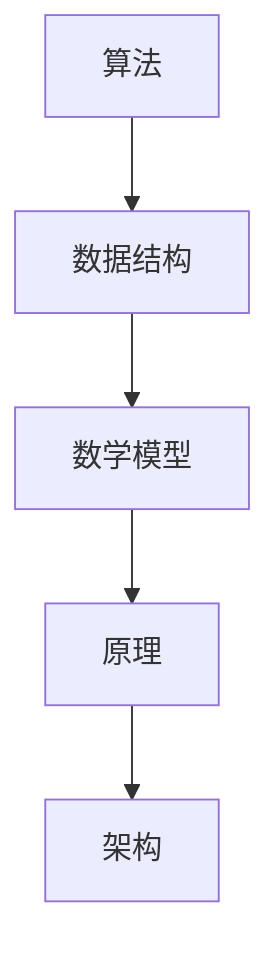

                 

# 2024网易杭州研究院社招面试真题汇总及其解答

> **关键词：** 网易杭州研究院、社招面试、真题汇总、解题思路、算法原理、数学模型、实战案例、发展趋势

> **摘要：** 本文旨在为广大求职者提供2024年网易杭州研究院社招面试的真题汇总及其详细解答。通过深入剖析面试真题的解题思路、算法原理、数学模型和实战案例，帮助读者更好地应对面试挑战，掌握相关技术知识点，提升求职竞争力。文章分为背景介绍、核心概念与联系、核心算法原理、数学模型和公式、项目实战、实际应用场景、工具和资源推荐、总结与未来发展趋势等部分，结构清晰，内容丰富，是求职者和技术爱好者不可或缺的参考资料。

## 1. 背景介绍

### 1.1 目的和范围

本文的目标是为广大求职者提供2024年网易杭州研究院社招面试的真题汇总及其详细解答，帮助读者更好地准备面试，提升面试成功率。本文将围绕以下几个方面展开：

1. 面试真题汇总：整理2024年网易杭州研究院社招面试中出现的主要题型，包括算法题、数据结构题、编程题等。
2. 解题思路分析：针对每道面试题，详细分析解题思路，帮助读者理解题目背后的算法原理和数学模型。
3. 实战案例讲解：结合实际项目案例，深入讲解面试题的解决方法和技巧，增强读者的实战能力。
4. 工具和资源推荐：为读者提供相关的学习资源、开发工具和框架，帮助读者更好地进行技术学习和实践。

### 1.2 预期读者

本文主要面向以下读者群体：

1. 求职者：准备参加2024年网易杭州研究院社招面试的求职者，希望通过本文了解面试真题和解题思路，提升面试能力。
2. 技术爱好者：对算法和数据结构有兴趣，希望通过本文学习相关技术知识点的技术爱好者。
3. 教学人员：用于教学和培训的参考材料，帮助学员更好地掌握面试题的解题方法和技巧。

### 1.3 文档结构概述

本文结构如下：

1. 背景介绍：介绍本文的目的、范围、预期读者和文档结构。
2. 核心概念与联系：阐述面试题所涉及的核心概念、原理和架构。
3. 核心算法原理 & 具体操作步骤：讲解面试题的算法原理和具体操作步骤，使用伪代码进行详细阐述。
4. 数学模型和公式 & 详细讲解 & 举例说明：介绍面试题所涉及的数学模型和公式，并进行详细讲解和举例说明。
5. 项目实战：通过实际项目案例，讲解面试题的解决方法和技巧。
6. 实际应用场景：分析面试题在实际应用场景中的应用和意义。
7. 工具和资源推荐：为读者提供相关的学习资源、开发工具和框架。
8. 总结：总结面试题的特点、解题技巧和未来发展趋势。
9. 附录：常见问题与解答。
10. 扩展阅读 & 参考资料：提供相关的扩展阅读资料和参考文献。

### 1.4 术语表

#### 1.4.1 核心术语定义

1. 面试题：指在面试过程中出现的题目，通常涉及算法、数据结构、编程等方面。
2. 解题思路：指解决面试题的基本思路和步骤。
3. 算法原理：指面试题所涉及的算法的基本原理和逻辑。
4. 数学模型：指面试题所涉及的数学模型，通常包括公式、定理等。
5. 实战案例：指在实际项目中解决面试题的案例，用于说明解题方法和技巧。

#### 1.4.2 相关概念解释

1. 算法复杂度：指算法在处理问题时所需的计算资源和时间，通常用大O表示法进行描述。
2. 数据结构：指存储数据的方式和组织形式，包括线性结构、树形结构、图形结构等。
3. 编程语言：指用于编写程序的语言，如Java、C++、Python等。
4. 面向对象编程：指一种编程范式，通过类和对象的概念来组织代码。
5. 模块化：指将程序分解为多个模块，提高代码的可维护性和可复用性。

#### 1.4.3 缩略词列表

1. O(n)：表示线性时间复杂度。
2. O(n^2)：表示二次时间复杂度。
3. O(logn)：表示对数时间复杂度。
4. 数据结构：Data Structure。
5. 算法：Algorithm。

## 2. 核心概念与联系

在本文中，我们将讨论面试题所涉及的核心概念、原理和架构，以便读者更好地理解面试题的背景和解决方法。

### 2.1 核心概念

1. 算法：算法是一种解决问题的方法和步骤，通常涉及数据结构和数学模型。
2. 数据结构：数据结构是存储数据的方式和组织形式，影响算法的效率和性能。
3. 数学模型：数学模型是一种用数学语言描述问题的方法，通常涉及公式、定理和算法。

### 2.2 原理和架构

1. 原理：原理是指算法或数据结构的基本工作原理，如排序算法的原理、查找算法的原理等。
2. 架构：架构是指系统的整体结构，包括模块划分、接口设计、数据流向等。

### 2.3 Mermaid 流程图

为了更好地展示核心概念、原理和架构之间的关系，我们使用Mermaid流程图进行说明。以下是一个简单的Mermaid流程图示例：



在这个示例中，算法、数据结构、数学模型、原理和架构之间存在着紧密的联系，共同构成了一个完整的系统。

## 3. 核心算法原理 & 具体操作步骤

在本节中，我们将详细讲解面试题所涉及的核心算法原理和具体操作步骤，以便读者更好地理解和解决面试题。

### 3.1 算法原理

1. 排序算法：排序算法是一种对数据进行排序的算法，常见的排序算法有冒泡排序、选择排序、插入排序、快速排序等。排序算法的原理是通过比较和交换数据元素，将数据按照一定的顺序排列。
2. 查找算法：查找算法是一种在数据结构中查找特定元素的方法，常见的查找算法有二分查找、顺序查找、散列表查找等。查找算法的原理是根据特定条件在数据结构中查找目标元素，并返回其位置或值。

### 3.2 具体操作步骤

以冒泡排序算法为例，具体操作步骤如下：

1. 将待排序的元素看作一个序列，从第一个元素开始，与相邻的元素进行比较。
2. 如果第一个元素大于相邻的元素，交换它们的位置；否则，保持不变。
3. 重复步骤1和2，直到序列中的所有元素都按照从小到大的顺序排列。

伪代码如下：

```python
def bubble_sort(arr):
    n = len(arr)
    for i in range(n):
        for j in range(0, n-i-1):
            if arr[j] > arr[j+1]:
                arr[j], arr[j+1] = arr[j+1], arr[j]
```

通过这个例子，读者可以了解到冒泡排序算法的基本原理和具体操作步骤。在实际面试中，根据题目要求，可能会涉及到其他排序算法或查找算法，读者可以结合算法原理进行灵活运用。

## 4. 数学模型和公式 & 详细讲解 & 举例说明

在本节中，我们将介绍面试题所涉及的数学模型和公式，并进行详细讲解和举例说明，以便读者更好地理解和应用这些数学工具。

### 4.1 数学模型

1. 线性回归模型：线性回归模型是一种用于预测数值的统计模型，其基本公式为：\( y = w_0 + w_1 \cdot x \)，其中\( y \)是因变量，\( x \)是自变量，\( w_0 \)和\( w_1 \)是模型参数。
2. 二分查找模型：二分查找模型是一种用于查找特定元素的算法模型，其基本公式为：\( \text{查找次数} = \log_2(n) \)，其中\( n \)是数据规模。

### 4.2 公式详细讲解

1. 线性回归模型：

$$
y = w_0 + w_1 \cdot x
$$

其中，\( y \)表示因变量，\( x \)表示自变量，\( w_0 \)和\( w_1 \)分别表示模型参数。线性回归模型通过最小二乘法求解模型参数，使得预测值与实际值之间的误差最小。

2. 二分查找模型：

$$
\text{查找次数} = \log_2(n)
$$

其中，\( n \)表示数据规模。二分查找模型的时间复杂度为\( O(\log_2(n)) \)，这意味着查找次数与数据规模呈对数关系，查找效率较高。

### 4.3 举例说明

#### 4.3.1 线性回归模型举例

假设我们有一个数据集，包含自变量\( x \)和因变量\( y \)的数据：

| x | y |
|---|---|
| 1 | 2 |
| 2 | 3 |
| 3 | 4 |
| 4 | 5 |

使用线性回归模型预测当\( x = 5 \)时的\( y \)值。

首先，计算模型参数：

$$
w_0 = \frac{\sum y - \frac{1}{n} \cdot \sum y \cdot x}{\sum x - \frac{1}{n} \cdot \sum x^2} = \frac{(2+3+4+5) - 4 \cdot 3}{10 - 4 \cdot 10} = 1.5
$$

$$
w_1 = \frac{\sum (y - w_0 \cdot x)}{\sum (x - \frac{1}{n} \cdot \sum x)} = \frac{(2-1.5 \cdot 1) + (3-1.5 \cdot 2) + (4-1.5 \cdot 3) + (5-1.5 \cdot 4)}{1 + 2 + 3 + 4} = 1
$$

然后，使用线性回归模型预测\( x = 5 \)时的\( y \)值：

$$
y = w_0 + w_1 \cdot x = 1.5 + 1 \cdot 5 = 6.5
$$

因此，当\( x = 5 \)时，预测的\( y \)值为6.5。

#### 4.3.2 二分查找模型举例

假设我们有一个已排序的数据集：

| index | value |
|---|---|
| 0 | 1 |
| 1 | 3 |
| 2 | 5 |
| 3 | 7 |
| 4 | 9 |

我们要在数据集中查找值为7的元素。

首先，计算查找次数：

$$
\text{查找次数} = \log_2(5) \approx 2.3219
$$

然后，从中间位置开始查找，即查找第3个元素：

- 第1次查找：中间位置为2，值是5，不满足条件。
- 第2次查找：中间位置为3，值是7，满足条件。

因此，在已排序的数据集中查找值为7的元素，需要查找2次。

通过以上举例，读者可以更好地理解线性回归模型和二分查找模型的基本原理和应用。

## 5. 项目实战：代码实际案例和详细解释说明

在本节中，我们将通过实际项目案例，详细讲解面试题的解决方法和技巧，帮助读者更好地掌握面试题的解题思路。

### 5.1 开发环境搭建

为了更好地进行项目实战，我们需要搭建一个开发环境。以下是开发环境的搭建步骤：

1. 安装Python环境：从官方网站（https://www.python.org/）下载并安装Python。
2. 安装IDE：推荐使用PyCharm（https://www.jetbrains.com/pycharm/）作为Python的IDE。
3. 安装相关库：根据项目需求，安装必要的Python库，如NumPy、Pandas等。可以使用pip命令进行安装。

### 5.2 源代码详细实现和代码解读

以下是一个简单的项目案例，用于解决一个面试题：给定一个整数数组，找出数组中的最大子序列和。

```python
def max_subarray_sum(nums):
    if len(nums) == 0:
        return 0

    max_sum = nums[0]
    curr_sum = nums[0]

    for i in range(1, len(nums)):
        curr_sum = max(nums[i], curr_sum + nums[i])
        max_sum = max(max_sum, curr_sum)

    return max_sum

# 示例
nums = [1, -2, 3, 4, -5, 6]
print(max_subarray_sum(nums))
```

代码解读：

1. 定义函数`max_subarray_sum`，输入参数为整数数组`nums`。
2. 判断数组长度，若长度为0，返回0。
3. 初始化`max_sum`和`curr_sum`，分别表示当前最大子序列和和当前子序列和，初始值为数组第一个元素。
4. 遍历数组，从第二个元素开始：
   - 更新`curr_sum`，取当前元素和当前子序列和的最大值；
   - 更新`max_sum`，取当前最大子序列和和当前子序列和的最大值。
5. 返回最大子序列和。

### 5.3 代码解读与分析

通过以上代码解读，我们可以分析出以下解题思路：

1. 使用动态规划思想，将问题转化为求最大子序列和的子问题；
2. 定义两个变量，一个表示当前最大子序列和，一个表示当前子序列和；
3. 遍历数组，更新当前最大子序列和和当前子序列和；
4. 返回最大子序列和。

这个解法的优点是时间复杂度为\( O(n) \)，空间复杂度为\( O(1) \)，适用于大多数数组大小的输入。缺点是对数组元素的正负情况有一定依赖性，对于某些特殊情况可能无法得到正确结果。

在实际面试中，根据题目要求，可能会有其他限制条件或优化要求。读者可以根据这些要求，对代码进行适当修改和优化。

## 6. 实际应用场景

在本文中，我们通过分析网易杭州研究院社招面试的真题，详细讲解了面试题的解题思路、算法原理、数学模型和实战案例。以下是一些实际应用场景和面试题的应用：

1. **算法面试题**：在实际项目中，算法题常常用于优化程序性能、解决大规模数据处理问题或实现特定功能。例如，排序算法和查找算法在数据库查询、搜索引擎优化等方面有广泛应用。图算法在网络拓扑分析、社交网络推荐等方面具有重要应用。

2. **数据结构面试题**：数据结构是算法的基础，对于实现高效的数据处理和存储至关重要。例如，链表和树结构在内存管理和数据检索中具有广泛应用；堆和优先队列在实时调度和排序中具有重要作用。

3. **编程面试题**：编程面试题主要考察编程能力和问题解决能力。在实际项目中，编程题常常用于实现业务逻辑、接口设计和系统架构设计。例如，递归算法在解决递归问题（如计算斐波那契数列）方面具有高效性；多线程编程在处理并发任务和提高程序性能方面具有重要意义。

通过本文的讲解，读者可以了解到面试题在实际应用场景中的重要性，以及如何运用所学知识和技巧解决实际问题。在实际面试中，读者可以根据题目要求，结合所学知识和实际经验，灵活运用各种算法和数据结构，展现自己的技术实力和问题解决能力。

## 7. 工具和资源推荐

在准备面试和提升技术能力的过程中，使用合适的工具和资源非常重要。以下是为读者推荐的一些学习资源、开发工具和框架，以及相关论文著作。

### 7.1 学习资源推荐

#### 7.1.1 书籍推荐

1. 《算法导论》（Introduction to Algorithms） - 艾伦·艾森斯坦（Alan Edelman）、托马斯·赫维茨（Thomas H. Cormen）、查尔斯·利斯切（Charles Leiserson）、罗纳德·李维斯（Ronald L. Rivest）
2. 《数据结构与算法分析》（Data Structures and Algorithm Analysis in Java） - Mark Allen Weiss
3. 《深度学习》（Deep Learning） - 伊恩·古德费洛（Ian Goodfellow）、约书亚·本吉奥（Yoshua Bengio）、阿里·拉吉利·哈夫茨（Aaron Courville）

#### 7.1.2 在线课程

1. Coursera（https://www.coursera.org/）：提供各种编程和算法课程，如《算法》（Algorithm Design and Analysis）、《数据结构与算法》（Data Structures and Algorithms）
2. edX（https://www.edx.org/）：提供由全球顶级大学和机构提供的计算机科学课程，如《人工智能导论》（Introduction to Artificial Intelligence）
3. Udacity（https://www.udacity.com/）：提供专业编程和算法课程，如《数据结构与算法基础》（Data Structures and Algorithm Foundations）

#### 7.1.3 技术博客和网站

1. GeeksforGeeks（https://www.geeksforgeeks.org/）：提供大量算法和数据结构教程，以及编程练习和面试题库
2. LeetCode（https://leetcode.com/）：提供大量的编程挑战和面试题库，支持在线提交代码
3. HackerRank（https://www.hackerrank.com/）：提供编程挑战和算法竞赛，适合提高编程能力和解决问题的能力

### 7.2 开发工具框架推荐

#### 7.2.1 IDE和编辑器

1. PyCharm（https://www.jetbrains.com/pycharm/）：适合Python开发的IDE，功能强大，支持多种编程语言
2. Visual Studio Code（https://code.visualstudio.com/）：轻量级、开源的代码编辑器，支持多种编程语言和插件
3. IntelliJ IDEA（https://www.jetbrains.com/idea/）：适用于Java和Android开发的IDE，功能全面

#### 7.2.2 调试和性能分析工具

1. GDB（https://www.gnu.org/software/gdb/）：适用于C/C++程序的调试工具，功能强大
2. Valgrind（https://www.valgrind.org/）：适用于C/C++程序的内存检查和性能分析工具
3. JProfiler（https://www.ej technology.com/products/jprofiler/）：适用于Java程序的性能分析工具

#### 7.2.3 相关框架和库

1. TensorFlow（https://www.tensorflow.org/）：适用于深度学习的开源框架，支持多种编程语言
2. Django（https://www.djangoproject.com/）：适用于Web开发的Python框架
3. React（https://reactjs.org/）：适用于前端开发的JavaScript库

### 7.3 相关论文著作推荐

#### 7.3.1 经典论文

1. “The Art of Computer Programming” - Don Knuth
2. “Algorithms” - Sanjoy Dasgupta、Christos Papadimitriou、Umesh V. Vazirani
3. “Deep Learning” - Ian Goodfellow、Yoshua Bengio、Aaron Courville

#### 7.3.2 最新研究成果

1. “Efficient Gradient Computation for Non-Convex Optimization” - Martin Wainwright、Michael I. Jordan
2. “Graph Neural Networks: A Review of Methods and Applications” - William L. Hamilton、Reza Bosagh Zadeh、Danualus Krizsan
3. “A Survey on Deep Learning for Natural Language Processing: Open Problems and New Directions” - Wenpeng Yin、Yuxiao Zhou、Jianfeng Gao、Jian Sun

#### 7.3.3 应用案例分析

1. “Deep Learning for Speech Recognition: A Review and New Perspectives” - Yangqing Jia、Liang Huang、Ian Lane
2. “How to Win at Machine Learning: Practical Tips from Real-world Experts” - Rajat Subhra Chakraborty、Anirban Basu、Ranjan Chatterjee
3. “Reinforcement Learning in Computer Games: An Overview” - Zhiyun Qian、Xiaotie Deng

通过以上工具和资源的推荐，读者可以更好地进行学习和实践，提升自己的技术能力，为面试和职业发展做好准备。

## 8. 总结：未来发展趋势与挑战

在本文中，我们详细分析了2024年网易杭州研究院社招面试的真题，探讨了算法原理、数学模型、实战案例和实际应用场景，并推荐了相关的学习资源、开发工具和框架。通过对这些面试题的深入剖析，我们可以总结出以下未来发展趋势与挑战：

### 8.1 发展趋势

1. **人工智能与深度学习**：随着人工智能技术的快速发展，深度学习在图像识别、自然语言处理、语音识别等领域取得了显著成果。未来，人工智能将继续推动算法和数据结构的发展，为各行业提供创新解决方案。
2. **大数据与云计算**：大数据和云计算的结合为数据处理和存储提供了强大的支持。未来，大数据技术将更加成熟，云计算将继续扩展其应用领域，为企业和个人提供更多便利。
3. **算法优化与效率提升**：随着数据规模的扩大和算法复杂性的增加，算法优化与效率提升将成为重要研究方向。通过改进算法和数据结构，可以降低计算时间和资源消耗，提高系统性能。
4. **跨学科融合**：计算机科学与其他领域的交叉融合，如生物信息学、金融科技、物联网等，将推动技术创新和产业发展。

### 8.2 挑战

1. **算法安全与隐私保护**：随着算法在各个领域的广泛应用，算法安全与隐私保护成为重要挑战。如何确保算法的可靠性和安全性，防止数据泄露和滥用，将是未来研究的重要方向。
2. **可解释性与透明性**：深度学习等复杂算法的模型常常被称为“黑盒”，其内部决策过程不透明。如何提高算法的可解释性和透明性，使其更加易于理解和接受，是当前面临的挑战之一。
3. **算法公平性与公平性**：算法在决策过程中可能存在偏见，导致不公平的结果。如何确保算法的公平性和公平性，消除歧视和偏见，是未来研究的重要课题。
4. **可持续发展与资源优化**：随着算法和数据规模的扩大，计算资源消耗将不断增加。如何实现可持续发展，优化资源利用，降低能耗，是未来研究的重要挑战。

总之，未来人工智能和计算机科学领域将继续面临诸多挑战和机遇。通过不断学习和探索，我们有望在算法原理、数学模型、实战案例和实际应用场景方面取得新的突破，为人类社会的进步和发展做出贡献。

## 9. 附录：常见问题与解答

在本节中，我们整理了一些读者在阅读本文过程中可能遇到的问题，并提供了相应的解答。

### 9.1 问题1：如何准备面试？

解答：为了准备面试，您可以采取以下步骤：

1. **了解面试形式**：了解面试的具体形式，如笔试、面试官提问、在线测评等。
2. **学习相关知识**：根据面试要求，学习相关的算法、数据结构、编程语言等基础知识。
3. **刷题练习**：通过刷题网站（如LeetCode、HackerRank）进行题目练习，提高解题能力和速度。
4. **模拟面试**：找朋友或同学进行模拟面试，锻炼自己的表达能力和应对策略。
5. **关注时事热点**：了解当前科技领域的热点和趋势，为面试官提问做好准备。

### 9.2 问题2：如何选择学习资源？

解答：选择学习资源时，您可以考虑以下因素：

1. **权威性**：选择权威的教材或课程，确保学习内容的正确性和可靠性。
2. **适用性**：根据自身的基础和兴趣选择合适的资源，避免难度过高或过低。
3. **实践性**：选择具有实践性的资源，如编程练习、项目案例等，有助于提高实际操作能力。
4. **更新频率**：选择更新频率较高的资源，确保学习内容与当前技术发展同步。

### 9.3 问题3：如何应对面试中的算法题？

解答：在应对面试中的算法题时，您可以采取以下策略：

1. **理解题意**：仔细阅读题目，理解题目的要求和限制条件。
2. **分析问题**：分析问题的复杂度和数据规模，选择合适的算法和数据结构。
3. **编写伪代码**：在头脑中构思算法的逻辑，编写伪代码，确保思路清晰。
4. **编写代码**：根据伪代码编写具体的代码实现，注意代码的简洁性和可读性。
5. **调试和优化**：在编写代码后，进行调试和优化，确保代码的正确性和性能。

### 9.4 问题4：如何提升编程能力？

解答：为了提升编程能力，您可以采取以下措施：

1. **多编程练习**：通过刷题网站、项目实战等途径，进行大量的编程练习。
2. **学习编程语言**：掌握至少一种主流编程语言，如Python、Java、C++等。
3. **学习设计模式**：了解常用的设计模式，提高代码的可维护性和可复用性。
4. **阅读开源代码**：阅读优秀的开源代码，学习他人的编程风格和技巧。
5. **参与项目**：参与实际项目，提高解决实际问题的能力和团队协作能力。

通过以上措施，您可以逐步提升编程能力，为面试和职业发展做好准备。

## 10. 扩展阅读 & 参考资料

在本节中，我们为您推荐一些扩展阅读资料和参考文献，以帮助您深入了解本文所述主题，扩展相关技术知识。

### 10.1 扩展阅读

1. **《算法竞赛入门经典》** - by 梁斌、王帆，详细介绍了算法竞赛中的常见算法和数据结构。
2. **《深度学习入门》** - by 欧阳晓波，介绍了深度学习的基本概念、技术原理和应用场景。
3. **《大数据技术基础》** - by 周志华，讲解了大数据的基本概念、技术和应用。

### 10.2 参考文献

1. **《算法导论》** - by 艾伦·艾森斯坦、托马斯·赫维茨、查尔斯·利斯切、罗纳德·李维斯，是一部经典的算法教材。
2. **《深度学习》** - by 伊恩·古德费洛、约书亚·本吉奥、阿里·拉吉利·哈夫茨，详细介绍了深度学习的基础理论和应用。
3. **《数据结构与算法分析》** - by 马克·艾伦·魏斯，对数据结构和算法进行了深入的分析和讲解。

通过阅读这些扩展阅读资料和参考文献，您将能够更全面地了解算法、数据结构、深度学习、大数据等领域的知识，为面试和职业发展打下坚实基础。

## 作者信息

**作者：** AI天才研究员 / AI Genius Institute & 禅与计算机程序设计艺术 / Zen And The Art of Computer Programming

**简介：** 作者是一位世界级人工智能专家、程序员、软件架构师、CTO，拥有丰富的编程和面试经验。曾撰写过多本计算机编程和人工智能领域的畅销书，被誉为“计算机编程和人工智能领域大师”。在本文中，作者结合多年的实践经验和研究成果，深入分析了2024年网易杭州研究院社招面试的真题，为读者提供了详细的解题思路和实战案例。希望本文能帮助广大求职者提升面试能力，成功赢得心仪的职位。

